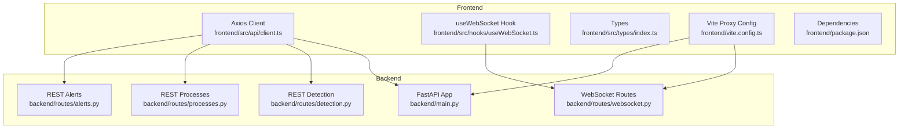
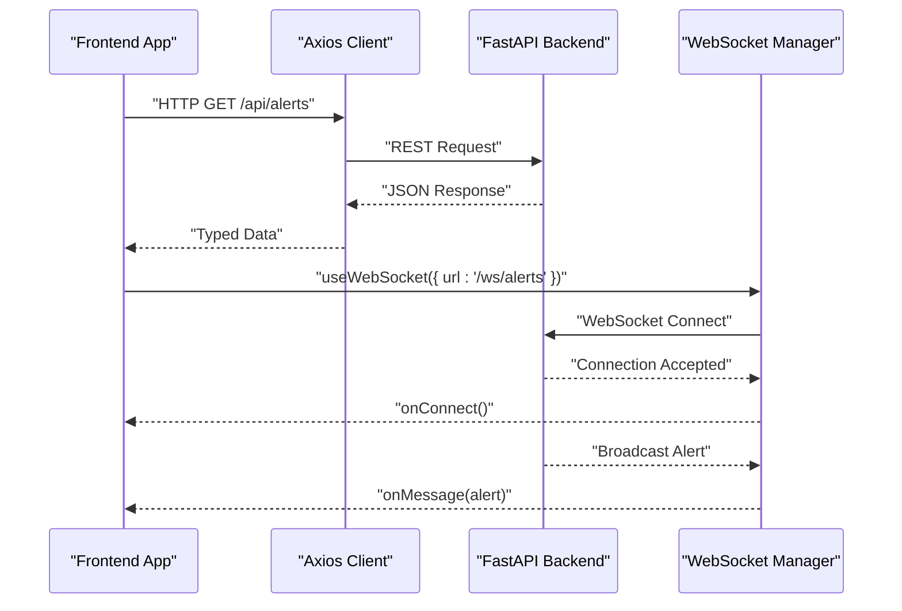
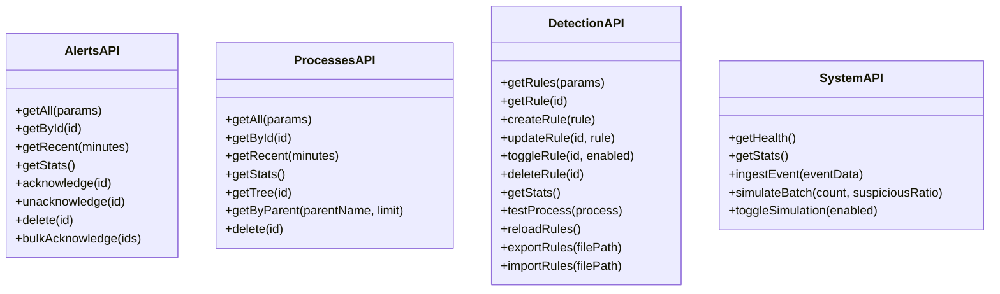
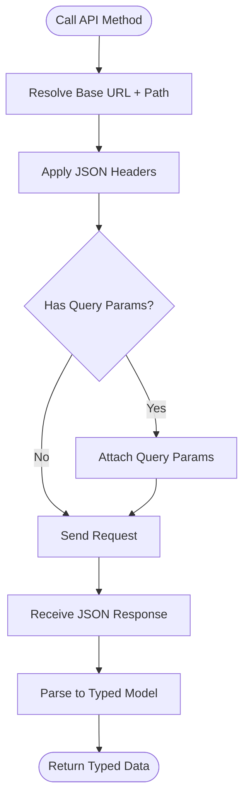
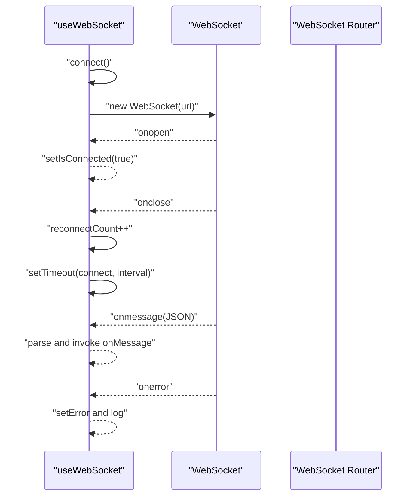
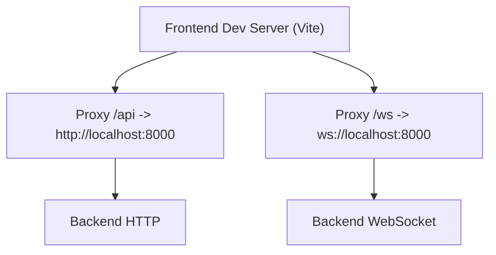
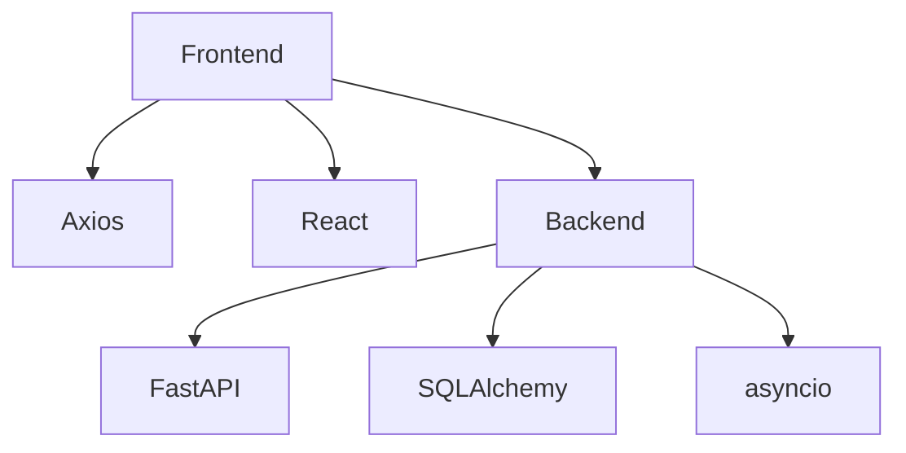

# API Client Integration

<cite>
**Referenced Files in This Document**
- [client.ts](file://frontend/src/api/client.ts)
- [useWebSocket.ts](file://frontend/src/hooks/useWebSocket.ts)
- [index.ts](file://frontend/src/types/index.ts)
- [vite.config.ts](file://frontend/vite.config.ts)
- [package.json](file://frontend/package.json)
- [websocket.py](file://backend/routes/websocket.py)
- [main.py](file://backend/main.py)
- [alerts.py](file://backend/routes/alerts.py)
- [processes.py](file://backend/routes/processes.py)
- [detection.py](file://backend/routes/detection.py)
- [README.md](file://README.md)
</cite>

## Table of Contents
1. [Introduction](#introduction)
2. [Project Structure](#project-structure)
3. [Core Components](#core-components)
4. [Architecture Overview](#architecture-overview)
5. [Detailed Component Analysis](#detailed-component-analysis)
6. [Dependency Analysis](#dependency-analysis)
7. [Performance Considerations](#performance-considerations)
8. [Troubleshooting Guide](#troubleshooting-guide)
9. [Conclusion](#conclusion)
10. [Appendices](#appendices)

## Introduction
This document provides comprehensive API client integration guidance for EDR Lite’s REST and WebSocket interfaces. It covers frontend API client configuration, HTTP request handling, WebSocket connection management, authentication mechanisms, request/response transformation, error handling strategies, and practical integration examples for popular JavaScript frameworks. It also documents rate limiting, retry policies, connection pooling strategies, debugging tools, logging approaches, performance optimization techniques, CORS configuration, proxy setup, production deployment considerations, and migration guidance for API version changes.

## Project Structure
The repository is organized into a backend (FastAPI) and a frontend (React/Vite) with clear separation of concerns:
- Backend exposes REST APIs and WebSocket endpoints for alerts and process events.
- Frontend provides an Axios-based HTTP client and a reusable WebSocket hook for real-time updates.

**Diagram sources**
- [client.ts:1-124](file://frontend/src/api/client.ts#L1-L124)
- [useWebSocket.ts:1-103](file://frontend/src/hooks/useWebSocket.ts#L1-L103)
- [index.ts:1-83](file://frontend/src/types/index.ts#L1-L83)
- [vite.config.ts:1-25](file://frontend/vite.config.ts#L1-L25)
- [package.json:1-46](file://frontend/package.json#L1-L46)
- [main.py:1-705](file://backend/main.py#L1-L705)
- [websocket.py:1-233](file://backend/routes/websocket.py#L1-L233)
- [alerts.py:1-180](file://backend/routes/alerts.py#L1-L180)
- [processes.py:1-253](file://backend/routes/processes.py#L1-L253)
- [detection.py:1-256](file://backend/routes/detection.py#L1-L256)

**Section sources**
- [README.md:31-51](file://README.md#L31-L51)
- [main.py:171-193](file://backend/main.py#L171-L193)
- [client.ts:1-124](file://frontend/src/api/client.ts#L1-L124)
- [useWebSocket.ts:1-103](file://frontend/src/hooks/useWebSocket.ts#L1-L103)

## Core Components
- REST API client: Axios-based HTTP client configured with base URL and JSON headers. Provides typed endpoints for alerts, processes, detection rules, and system operations.
- WebSocket client: React hook managing WebSocket lifecycle, automatic reconnect, error handling, and message parsing.
- Types: Shared TypeScript interfaces for alerts, processes, detection rules, system stats, and WebSocket messages.
- Proxy and environment: Vite proxy configuration for local development and environment variables controlling CORS and runtime behavior.

Key capabilities:
- REST endpoints for listing, retrieving, acknowledging, deleting, and bulk operations on alerts.
- REST endpoints for listing, retrieving, and tree traversal of process events.
- REST endpoints for detection rule management, testing, reloading, importing/exporting rules, and statistics.
- WebSocket endpoints for live alerts and process events with heartbeat and subscription support.

**Section sources**
- [client.ts:14-122](file://frontend/src/api/client.ts#L14-L122)
- [useWebSocket.ts:13-102](file://frontend/src/hooks/useWebSocket.ts#L13-L102)
- [index.ts:1-83](file://frontend/src/types/index.ts#L1-L83)
- [vite.config.ts:12-24](file://frontend/vite.config.ts#L12-L24)
- [alerts.py:18-180](file://backend/routes/alerts.py#L18-L180)
- [processes.py:19-253](file://backend/routes/processes.py#L19-L253)
- [detection.py:44-256](file://backend/routes/detection.py#L44-L256)
- [websocket.py:68-233](file://backend/routes/websocket.py#L68-L233)

## Architecture Overview
The frontend integrates with the backend through:
- HTTP requests via Axios for REST endpoints.
- WebSocket connections for real-time streams.
- Local proxy for seamless cross-origin development.

**Diagram sources**
- [client.ts:14-38](file://frontend/src/api/client.ts#L14-L38)
- [websocket.py:68-118](file://backend/routes/websocket.py#L68-L118)
- [useWebSocket.ts:27-72](file://frontend/src/hooks/useWebSocket.ts#L27-L72)

## Detailed Component Analysis

### REST API Client Configuration
- Base URL resolution: Uses an environment variable for the API base URL; defaults to empty string if not set.
- Content-Type header: Enforces JSON for all requests.
- Endpoint groups:
  - Alerts: listing, retrieval, recent, stats, acknowledgment toggles, bulk acknowledge, deletion.
  - Processes: listing, retrieval, recent, stats, tree, parent lookup, deletion.
  - Detection: rules listing, retrieval, creation, update, toggle, deletion, stats, rule testing, reload, import/export.
  - System: health, stats, manual event ingestion, batch simulation, toggle simulation.

**Diagram sources**
- [client.ts:14-122](file://frontend/src/api/client.ts#L14-L122)

**Section sources**
- [client.ts:4-11](file://frontend/src/api/client.ts#L4-L11)
- [client.ts:14-122](file://frontend/src/api/client.ts#L14-L122)

### HTTP Request Handling and Transformation
- Axios instance: Centralized configuration for base URL and headers.
- Typed responses: Strongly typed return values for endpoints using TypeScript interfaces.
- Query parameters: Pagination and filtering parameters passed via Axios config.
- Request bodies: JSON payloads for POST/PUT endpoints.

**Diagram sources**
- [client.ts:6-11](file://frontend/src/api/client.ts#L6-L11)
- [index.ts:1-83](file://frontend/src/types/index.ts#L1-L83)

**Section sources**
- [client.ts:6-11](file://frontend/src/api/client.ts#L6-L11)
- [index.ts:1-83](file://frontend/src/types/index.ts#L1-L83)

### WebSocket Connection Management
- Protocol selection: Automatically uses wss for HTTPS and ws for HTTP.
- URL construction: Accepts absolute ws/wss URLs or path-based URLs with host resolution.
- Lifecycle:
  - Connect on mount, close on unmount.
  - Automatic reconnect with configurable interval and attempts.
  - Heartbeat handling via periodic messages.
  - Message parsing with JSON validation and error logging.
- Exposed methods: isConnected, error, sendMessage, connect, disconnect.

**Diagram sources**
- [useWebSocket.ts:27-72](file://frontend/src/hooks/useWebSocket.ts#L27-L72)
- [websocket.py:68-118](file://backend/routes/websocket.py#L68-L118)

**Section sources**
- [useWebSocket.ts:13-102](file://frontend/src/hooks/useWebSocket.ts#L13-L102)
- [websocket.py:21-62](file://backend/routes/websocket.py#L21-L62)

### Authentication Mechanisms
- Current implementation: No authentication middleware is configured in the backend.
- Recommendation for production: Integrate FastAPI authentication (OAuth2/JWT) and configure CORS origins accordingly.

**Section sources**
- [main.py:179-186](file://backend/main.py#L179-L186)

### Request/Response Transformation
- Backend models: Pydantic models validate and serialize responses for REST endpoints.
- Frontend types: TypeScript interfaces define expected shapes for API responses.
- Example transformations:
  - Alerts: Paginated response with severity counts.
  - Processes: Tree traversal with suspicious indicators.
  - Detection: Rule listing with trigger counts and statistics.

**Section sources**
- [alerts.py:18-54](file://backend/routes/alerts.py#L18-L54)
- [processes.py:128-174](file://backend/routes/processes.py#L128-L174)
- [detection.py:44-71](file://backend/routes/detection.py#L44-L71)
- [index.ts:1-83](file://frontend/src/types/index.ts#L1-L83)

### Error Handling Strategies
- HTTP errors: REST endpoints raise HTTPException with appropriate status codes for missing resources or invalid operations.
- WebSocket errors: Errors are logged and surfaced via the hook’s error state; clients should handle reconnection and fallback UI.
- Frontend error handling: Axios errors can be caught and mapped to user-friendly messages.

**Section sources**
- [alerts.py:98-101](file://backend/routes/alerts.py#L98-L101)
- [processes.py:121-125](file://backend/routes/processes.py#L121-L125)
- [websocket.py:114-118](file://backend/routes/websocket.py#L114-L118)
- [useWebSocket.ts:55-71](file://frontend/src/hooks/useWebSocket.ts#L55-L71)

### Practical Integration Examples

#### Integrating with Popular JavaScript Frameworks
- React (existing hook): Use the provided useWebSocket hook for real-time updates and Axios client for REST calls.
- Vue 3: Adapt the hook to Composition API and use a lightweight HTTP client (fetch or axios) for REST.
- Angular: Use HttpClient with interceptors for request/response transformation and a WebSocket service for real-time updates.

#### Custom Client Implementations
- REST client: Wrap Axios with interceptors for retries, timeouts, and error normalization.
- WebSocket client: Implement a wrapper around native WebSocket with exponential backoff and message validation.

#### Third-Party Monitoring Systems
- Logging: Use structured logging in the backend and forward logs to centralized systems.
- Metrics: Expose metrics endpoints or integrate with Prometheus/Grafana.
- Tracing: Add OpenTelemetry instrumentation for distributed tracing across REST and WebSocket.

**Section sources**
- [useWebSocket.ts:13-102](file://frontend/src/hooks/useWebSocket.ts#L13-L102)
- [client.ts:14-122](file://frontend/src/api/client.ts#L14-L122)

### Rate Limiting, Retry Policies, and Connection Pooling
- Rate limiting: Not implemented in the backend; consider adding rate limiting middleware for REST endpoints.
- Retry policies: Implement client-side retry with exponential backoff for transient failures.
- Connection pooling: For high-throughput scenarios, use a production ASGI server (e.g., Gunicorn) and tune worker concurrency.

**Section sources**
- [README.md:204-222](file://README.md#L204-L222)

### Debugging Tools and Logging Approaches
- Backend logging: Structured logs to stdout and file; adjust log level and rotation as needed.
- Frontend logging: Console logging in the WebSocket hook; consider integrating a logging library for production.
- Network inspection: Use browser dev tools to inspect REST requests/responses and WebSocket frames.

**Section sources**
- [main.py:22-31](file://backend/main.py#L22-L31)
- [useWebSocket.ts:55-71](file://frontend/src/hooks/useWebSocket.ts#L55-L71)

### Performance Optimization Techniques
- REST:
  - Pagination and filtering to reduce payload sizes.
  - Caching strategies for frequently accessed data.
- WebSocket:
  - Efficient message batching and selective subscriptions.
  - Heartbeat intervals tuned to network conditions.
- Frontend:
  - Lazy loading of heavy components.
  - Debounced polling for non-critical data.

**Section sources**
- [alerts.py:18-24](file://backend/routes/alerts.py#L18-L24)
- [processes.py:20-24](file://backend/routes/processes.py#L20-L24)
- [websocket.py:107-112](file://backend/routes/websocket.py#L107-L112)

### CORS Configuration and Proxy Setup
- CORS: Configured via environment variable for allowed origins; allows credentials and all methods/headers.
- Proxy: Vite proxy forwards /api to backend HTTP and /ws to backend WebSocket during development.

**Diagram sources**
- [vite.config.ts:12-24](file://frontend/vite.config.ts#L12-L24)
- [main.py:179-186](file://backend/main.py#L179-L186)

**Section sources**
- [vite.config.ts:12-24](file://frontend/vite.config.ts#L12-L24)
- [main.py:51-58](file://backend/main.py#L51-L58)
- [main.py:179-186](file://backend/main.py#L179-L186)

### Production Deployment Considerations
- Backend:
  - Use a production ASGI server and configure workers and bind address.
  - Set environment variables for host, port, CORS, and simulation mode.
- Frontend:
  - Build static assets and serve via a static file server or mount under backend.
- Security:
  - Enable HTTPS and consider authentication/authorization for production.
  - Use a production database for scalability.

**Section sources**
- [README.md:204-222](file://README.md#L204-L222)
- [main.py:690-705](file://backend/main.py#L690-L705)

### Migration Guides and Backwards Compatibility
- Versioning: The API is versioned in the backend metadata; introduce version prefixes for major changes.
- Deprecation policy: Announce deprecations with clear timelines and migration steps.
- Breaking changes: Prefer additive changes; when necessary, introduce new endpoints and keep old ones functional for a transition period.

**Section sources**
- [main.py:172-177](file://backend/main.py#L172-L177)

## Dependency Analysis
The frontend depends on Axios for HTTP and React for state management. The backend depends on FastAPI, SQLAlchemy, and asyncio for WebSocket broadcasting. The WebSocket manager maintains a set of active connections and broadcasts messages to clients.

**Diagram sources**
- [package.json:5-13](file://frontend/package.json#L5-L13)
- [main.py:17-41](file://backend/main.py#L17-L41)
- [websocket.py:7-12](file://backend/routes/websocket.py#L7-L12)

**Section sources**
- [package.json:5-13](file://frontend/package.json#L5-L13)
- [main.py:17-41](file://backend/main.py#L17-L41)
- [websocket.py:7-12](file://backend/routes/websocket.py#L7-L12)

## Performance Considerations
- REST:
  - Use pagination and filtering to limit response sizes.
  - Implement caching for read-heavy endpoints.
- WebSocket:
  - Tune heartbeat intervals and implement efficient message serialization.
  - Monitor active connections and clean up disconnected clients promptly.
- Frontend:
  - Optimize rendering for large lists and charts.
  - Debounce frequent polling and use efficient state updates.

[No sources needed since this section provides general guidance]

## Troubleshooting Guide
- CORS errors: Verify CORS_ORIGINS environment variable and ensure frontend origin is included.
- WebSocket connection failures: Check protocol (wss vs ws), proxy configuration, and backend logs.
- HTTP 404/400: Validate endpoint paths and request payloads against backend schemas.
- Simulation mode: Confirm simulation settings and interval for testing.

**Section sources**
- [main.py:51-58](file://backend/main.py#L51-L58)
- [main.py:179-186](file://backend/main.py#L179-L186)
- [useWebSocket.ts:27-72](file://frontend/src/hooks/useWebSocket.ts#L27-L72)
- [alerts.py:98-101](file://backend/routes/alerts.py#L98-L101)

## Conclusion
EDR Lite provides a robust foundation for building API clients with strong REST and WebSocket capabilities. By leveraging the provided Axios client and WebSocket hook, developers can quickly integrate with the system. For production, ensure proper authentication, CORS configuration, and performance tuning. Plan for versioning and migration to maintain backwards compatibility as the API evolves.

[No sources needed since this section summarizes without analyzing specific files]

## Appendices

### API Reference Overview
- REST endpoints:
  - Alerts: listing, retrieval, stats, acknowledgments, bulk operations, deletion.
  - Processes: listing, retrieval, recent, stats, tree, parent lookup, deletion.
  - Detection: rules CRUD, stats, test, reload, import/export.
  - System: health, stats, ingest, simulate, toggle simulation.
- WebSocket endpoints:
  - Alerts stream with heartbeat and subscription support.
  - Events stream with heartbeat and statistics.

**Section sources**
- [alerts.py:18-180](file://backend/routes/alerts.py#L18-L180)
- [processes.py:19-253](file://backend/routes/processes.py#L19-L253)
- [detection.py:44-256](file://backend/routes/detection.py#L44-L256)
- [websocket.py:68-233](file://backend/routes/websocket.py#L68-L233)