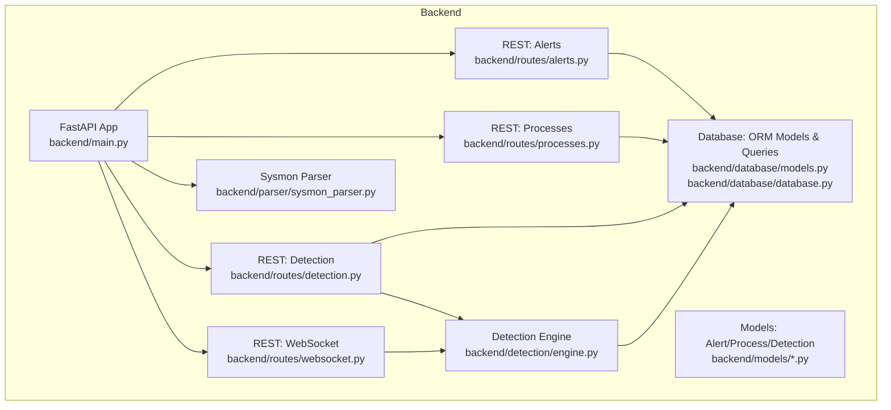
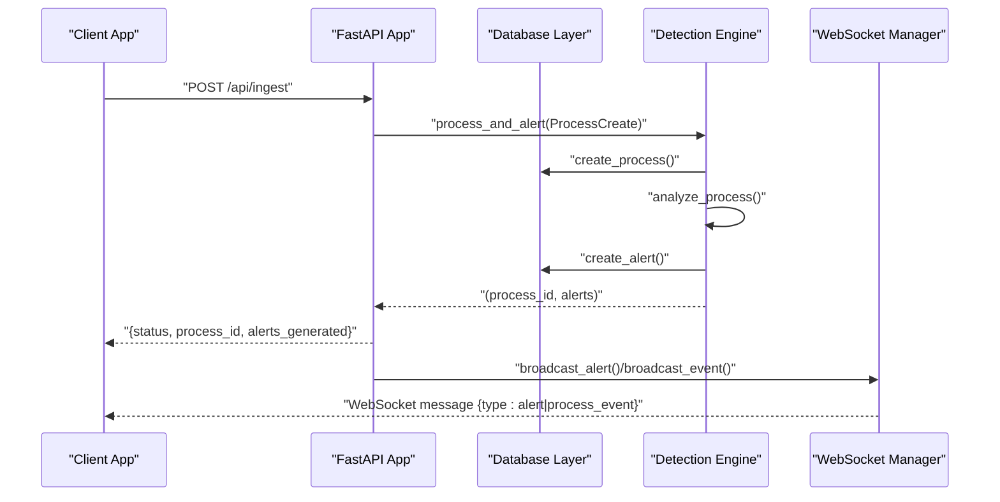
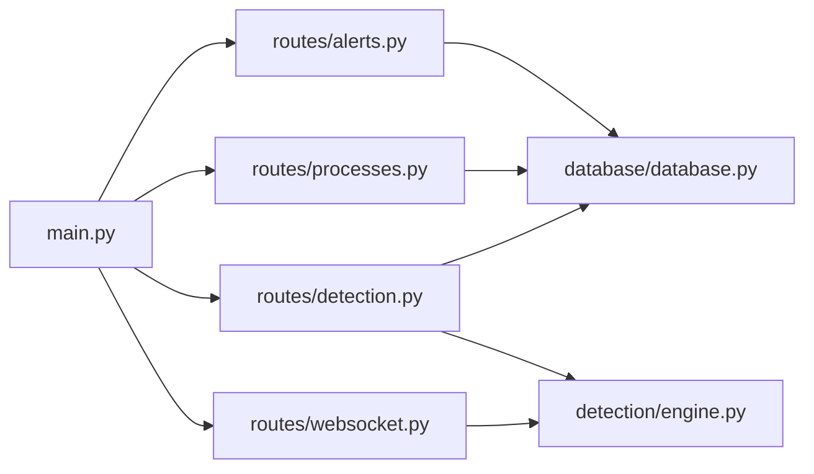
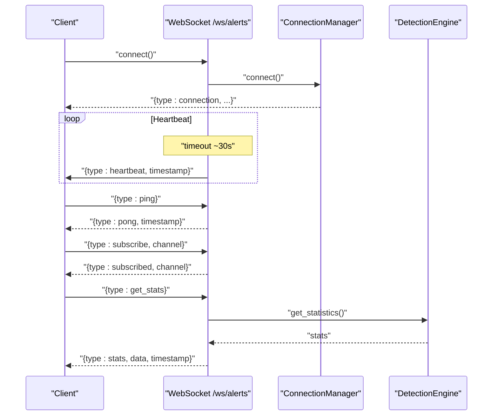

# API Reference

<cite>
**Referenced Files in This Document**
- [backend/main.py](file://backend/main.py)
- [backend/routes/alerts.py](file://backend/routes/alerts.py)
- [backend/routes/processes.py](file://backend/routes/processes.py)
- [backend/routes/detection.py](file://backend/routes/detection.py)
- [backend/routes/websocket.py](file://backend/routes/websocket.py)
- [backend/models/alert.py](file://backend/models/alert.py)
- [backend/models/process.py](file://backend/models/process.py)
- [backend/models/detection.py](file://backend/models/detection.py)
- [backend/database/models.py](file://backend/database/models.py)
- [backend/database/database.py](file://backend/database/database.py)
- [backend/detection/engine.py](file://backend/detection/engine.py)
- [backend/parser/sysmon_parser.py](file://backend/parser/sysmon_parser.py)
- [frontend/src/api/client.ts](file://frontend/src/api/client.ts)
- [frontend/src/hooks/useWebSocket.ts](file://frontend/src/hooks/useWebSocket.ts)
- [README.md](file://README.md)
</cite>

## Table of Contents
1. [Introduction](#introduction)
2. [Project Structure](#project-structure)
3. [Core Components](#core-components)
4. [Architecture Overview](#architecture-overview)
5. [Detailed Component Analysis](#detailed-component-analysis)
6. [Dependency Analysis](#dependency-analysis)
7. [Performance Considerations](#performance-considerations)
8. [Troubleshooting Guide](#troubleshooting-guide)
9. [Conclusion](#conclusion)
10. [Appendices](#appendices)

## Introduction
This document provides a complete API reference for EDR Lite’s REST and WebSocket interfaces. It covers:
- REST endpoints for alerts, processes, and detection rule management
- WebSocket endpoints for real-time alert and event streaming
- Request/response schemas, parameters, and error handling
- Authentication and security considerations
- Rate limiting, versioning, and backwards compatibility
- Practical examples using curl and JavaScript clients
- Debugging, monitoring, and performance optimization guidance

## Project Structure
The API surface is implemented in the backend using FastAPI and exposed via:
- REST endpoints under /api/* for alerts, processes, detection rules, ingestion, and system stats
- WebSocket endpoints under /ws/* for live streaming of alerts and process events
- A lightweight database layer and detection engine integrated into the lifecycle

**Diagram sources**
- [backend/main.py:171-192](file://backend/main.py#L171-L192)
- [backend/routes/alerts.py:15](file://backend/routes/alerts.py#L15)
- [backend/routes/processes.py:16](file://backend/routes/processes.py#L16)
- [backend/routes/detection.py:14](file://backend/routes/detection.py#L14)
- [backend/routes/websocket.py:14](file://backend/routes/websocket.py#L14)
- [backend/models/alert.py:15](file://backend/models/alert.py#L15)
- [backend/models/process.py:6](file://backend/models/process.py#L6)
- [backend/models/detection.py:17](file://backend/models/detection.py#L17)
- [backend/database/models.py:9](file://backend/database/models.py#L9)
- [backend/database/database.py:21](file://backend/database/database.py#L21)
- [backend/detection/engine.py:64](file://backend/detection/engine.py#L64)
- [backend/parser/sysmon_parser.py:61](file://backend/parser/sysmon_parser.py#L61)

**Section sources**
- [backend/main.py:171-192](file://backend/main.py#L171-L192)
- [README.md:31-51](file://README.md#L31-L51)

## Core Components
- REST API
  - Alerts: list, filter, stats, recent, get by id, acknowledge/unacknowledge, delete, bulk acknowledge
  - Processes: list, recent, stats, get by id, tree, by parent, delete
  - Detection: list rules, get rule, create/update/delete rule, toggle, stats, test process, reload, export/import
  - System: health, stats, manual ingest, simulate batch, toggle simulation
- WebSocket API
  - /ws/alerts: live alerts stream with heartbeat and subscription
  - /ws/events: live process events stream with heartbeat and subscription
- Data Models
  - Alert, AlertResponse, AlertStats
  - ProcessEvent, ProcessTreeNode
  - DetectionRule, DetectionResult, RuleType
- Database Models
  - ProcessModel, AlertModel, RuleExecutionLog

**Section sources**
- [backend/routes/alerts.py:18-180](file://backend/routes/alerts.py#L18-L180)
- [backend/routes/processes.py:19-253](file://backend/routes/processes.py#L19-L253)
- [backend/routes/detection.py:44-256](file://backend/routes/detection.py#L44-L256)
- [backend/routes/websocket.py:68-233](file://backend/routes/websocket.py#L68-L233)
- [backend/models/alert.py:15-55](file://backend/models/alert.py#L15-L55)
- [backend/models/process.py:6-44](file://backend/models/process.py#L6-L44)
- [backend/models/detection.py:17-92](file://backend/models/detection.py#L17-L92)
- [backend/database/models.py:9-77](file://backend/database/models.py#L9-L77)

## Architecture Overview
The system integrates ingestion, detection, persistence, and real-time streaming:
- Ingestion: manual ingest endpoint and background simulation produce process events
- Detection: detection engine evaluates events against rules and creates alerts
- Persistence: SQLAlchemy ORM stores processes and alerts
- Streaming: WebSocket broadcasts new alerts and events to clients
- Frontend: Axios-based REST client and custom WebSocket hook consume the APIs

**Diagram sources**
- [backend/main.py:243-311](file://backend/main.py#L243-L311)
- [backend/detection/engine.py:272-291](file://backend/detection/engine.py#L272-L291)
- [backend/routes/websocket.py:209-224](file://backend/routes/websocket.py#L209-L224)

## Detailed Component Analysis

### REST API: Alerts
- Base path: /api/alerts
- Response model: AlertResponse with total, alerts[], and severity_counts

Endpoints
- GET /api/alerts
  - Query parameters:
    - limit: integer, min 1, max 1000, default 100
    - offset: integer, min 0, default 0
    - severity: enum string [low, medium, high, critical]
    - acknowledged: boolean
  - Response: AlertResponse
  - Notes: severity_counts computed client-side from returned alerts
- GET /api/alerts/stats
  - Response: alert statistics (counts by severity, hourly distribution)
- GET /api/alerts/recent?minutes=1..1440
  - Response: array of Alert
- GET /api/alerts/{alert_id}
  - Response: Alert
  - 404 if not found
- POST /api/alerts/{alert_id}/acknowledge
  - Response: {status, message}
  - 404 if not found
- POST /api/alerts/{alert_id}/unacknowledge
  - Response: {status, message}
  - 404 if not found
- DELETE /api/alerts/{alert_id}
  - Response: {status, message}
  - 404 if not found
- POST /api/alerts/bulk/acknowledge
  - Body: array of integers (alert ids)
  - Response: {status, message}

Common response codes
- 200 OK for successful GET/POST/DELETE
- 404 Not Found for missing resources
- 400 Bad Request for invalid requests (creation/update failures)

Error handling
- Missing resource raises HTTP 404
- Validation errors surfaced as HTTP 422 (Pydantic)
- Bulk operations acknowledge subset found in DB

**Section sources**
- [backend/routes/alerts.py:18-180](file://backend/routes/alerts.py#L18-L180)
- [backend/database/database.py:217-245](file://backend/database/database.py#L217-L245)
- [backend/models/alert.py:40-55](file://backend/models/alert.py#L40-L55)

### REST API: Processes
- Base path: /api/processes

Endpoints
- GET /api/processes
  - Query parameters:
    - limit: integer, min 1, max 1000, default 100
    - offset: integer, min 0, default 0
    - search: string (matches process_name, parent_name, command_line)
  - Response: array of ProcessEvent
- GET /api/processes/recent?minutes=1..1440
  - Response: array of ProcessEvent
- GET /api/processes/stats
  - Response: {total_processes, processes_last_hour, processes_last_24h, top_parent_processes[], top_child_processes[]}
- GET /api/processes/{process_id}
  - Response: ProcessEvent
  - 404 if not found
- GET /api/processes/{process_id}/tree
  - Response: ProcessTreeNode (includes related alerts and severity)
  - Builds tree recursively up to max depth
- GET /api/processes/by-parent/{parent_name}?limit=1..1000
  - Response: array of ProcessEvent
- DELETE /api/processes/{process_id}
  - Response: {status, message}
  - 404 if not found

**Section sources**
- [backend/routes/processes.py:19-253](file://backend/routes/processes.py#L19-L253)
- [backend/models/process.py:22-44](file://backend/models/process.py#L22-L44)
- [backend/database/models.py:9-37](file://backend/database/models.py#L9-L37)

### REST API: Detection Rules and Engine
- Base path: /api/detection

Endpoints
- GET /api/detection/rules
  - Query parameters:
    - enabled_only: boolean, default false
    - rule_type: string enum [parent_child, command_line, frequency, behavior, anomaly]
  - Response: {total: number, rules: DetectionRule[]}
  - Rule payload excludes compiled patterns; includes times_triggered
- GET /api/detection/rules/{rule_id}
  - Response: rule details or 404
- POST /api/detection/rules
  - Request: DetectionRule
  - Response: {status, message, rule_id}
  - 400 on failure
- PUT /api/detection/rules/{rule_id}
  - Request: DetectionRule
  - Response: {status, message}
  - 404 if not found
- POST /api/detection/rules/{rule_id}/toggle
  - Request: {enabled: boolean}
  - Response: {status, message}
  - 404 if not found
- DELETE /api/detection/rules/{rule_id}
  - Response: {status, message}
  - 404 if not found or protected default rule
- GET /api/detection/rules/stats
  - Response: rule manager statistics
- POST /api/detection/test
  - Request: TestProcessRequest {process_name, parent_name, command_line, process_id?, parent_process_id?}
  - Response: {process, threats_detected, results[] with is_threat, rule_name, severity, confidence, risk_score, description, details}
- GET /api/detection/stats
  - Response: engine statistics
- POST /api/detection/reload
  - Response: {status, message, rules_loaded}
- POST /api/detection/export
  - Request: {file_path: string}
  - Response: {status, message}
- POST /api/detection/import
  - Request: {file_path: string}
  - Response: {status, message, total_rules}

**Section sources**
- [backend/routes/detection.py:44-256](file://backend/routes/detection.py#L44-L256)
- [backend/models/detection.py:17-92](file://backend/models/detection.py#L17-L92)
- [backend/detection/engine.py:64-324](file://backend/detection/engine.py#L64-L324)

### REST API: System and Ingestion
- GET /health
  - Response: {status, timestamp, database, detection_engine, simulation_mode}
- GET /api/stats
  - Response: {engine, rules, simulation_mode, timestamp}
- POST /api/ingest
  - Request: raw Sysmon event object (supports multiple formats)
  - Response: {status, process_id, alerts_generated, is_threat}
  - Errors logged and returned as {status: "error", message}
- POST /api/simulate/batch?count=&suspicious_ratio=
  - Response: {status, events_generated, events_ingested, alerts_generated}
- POST /api/simulation/toggle?enabled=true|false
  - Response: {status, message}

Notes
- Ingestion converts Sysmon-like events into ProcessCreate and triggers detection
- Simulation toggling starts/stops background task that emits events periodically

**Section sources**
- [backend/main.py:214-358](file://backend/main.py#L214-L358)
- [backend/parser/sysmon_parser.py:61-385](file://backend/parser/sysmon_parser.py#L61-L385)

### WebSocket API: Real-Time Streaming
- Base path: /ws
- Two channels:
  - /ws/alerts: live alerts and periodic heartbeat
  - /ws/events: live process events and periodic stats

Connection lifecycle
- Accept connection and send initial connection message
- Maintain heartbeat every ~30s
- Handle client messages:
  - ping -> pong
  - subscribe -> subscribed
  - get_stats -> stats

Message types
- connection: {type: "connection", status, timestamp, message}
- alert: {type: "alert", data: Alert payload, timestamp}
- process_event: {type: "process_event", data: ProcessEvent payload, timestamp}
- heartbeat: {type: "heartbeat", timestamp}
- error: {type: "error", message}
- stats: {type: "stats", data: engine stats, timestamp}
- subscribed: {type: "subscribed", channel, timestamp}
- pong: {type: "pong", timestamp}

Client behavior
- Reconnect on close with exponential backoff
- Send ping periodically to keep alive
- Subscribe to desired channel

**Section sources**
- [backend/routes/websocket.py:68-233](file://backend/routes/websocket.py#L68-L233)

### Data Models and Schemas
Alerts
- Alert: id, process_id, rule_triggered, severity, description, risk_score, timestamp, acknowledged, details
- AlertResponse: total, alerts[], severity_counts
- AlertStats: totals and hourly breakdown

Processes
- ProcessEvent: id, process_name, parent_name, command_line, process_id, parent_process_id, timestamp, user, computer, created_at
- ProcessTreeNode: id, process_name, process_id, parent_process_id, command_line, timestamp, children[], is_suspicious, severity

Detection Rules
- DetectionRule: id, name, rule_type, description, severity, enabled, patterns, risk_score, compiled fields
- DetectionResult: is_threat, rule, confidence, risk_score, details, timestamp

Database Models
- ProcessModel: process_name, parent_name, command_line, process_id, parent_process_id, timestamp, user, computer, created_at
- AlertModel: process_id, rule_triggered, severity, description, risk_score, details, timestamp, acknowledged
- RuleExecutionLog: rule_id, rule_name, process_id, matched, execution_time_ms, timestamp

**Section sources**
- [backend/models/alert.py:15-55](file://backend/models/alert.py#L15-L55)
- [backend/models/process.py:6-44](file://backend/models/process.py#L6-L44)
- [backend/models/detection.py:17-92](file://backend/models/detection.py#L17-L92)
- [backend/database/models.py:9-77](file://backend/database/models.py#L9-L77)

## Dependency Analysis
Key relationships
- Routes depend on Database sessions and DetectionEngine
- DetectionEngine depends on RuleManager and Database
- WebSocket routes broadcast to clients via ConnectionManager
- Frontend consumes REST via Axios and WebSocket via a custom hook

**Diagram sources**
- [backend/routes/alerts.py:12-14](file://backend/routes/alerts.py#L12-L14)
- [backend/routes/processes.py:12-14](file://backend/routes/processes.py#L12-L14)
- [backend/routes/detection.py:11-12](file://backend/routes/detection.py#L11-L12)
- [backend/routes/websocket.py:65](file://backend/routes/websocket.py#L65)
- [backend/main.py:40-41](file://backend/main.py#L40-L41)

**Section sources**
- [backend/main.py:40-41](file://backend/main.py#L40-L41)
- [backend/routes/alerts.py:12-14](file://backend/routes/alerts.py#L12-L14)
- [backend/routes/processes.py:12-14](file://backend/routes/processes.py#L12-L14)
- [backend/routes/detection.py:11-12](file://backend/routes/detection.py#L11-L12)
- [backend/routes/websocket.py:65](file://backend/routes/websocket.py#L65)

## Performance Considerations
- Pagination limits
  - REST endpoints cap limit to 1000 items per page to prevent heavy queries
- Asynchronous database access
  - Async sessions are used for route handlers to improve concurrency
- WebSocket broadcasting
  - Broadcast handles disconnections and cleans up stale connections
- Detection engine
  - Frequency tracking uses thread-safe deques with bounded windows
- Recommendations
  - Use limit and offset for paginated lists
  - Prefer recent endpoints for time-bound queries
  - Batch operations where possible (bulk acknowledge)
  - Monitor engine stats endpoint for throughput and latency

[No sources needed since this section provides general guidance]

## Troubleshooting Guide
Common issues and resolutions
- 404 Not Found
  - Verify resource IDs exist (alerts, processes, rules)
- 400 Bad Request
  - Check rule creation/update payloads and constraints
- WebSocket disconnects
  - Client should reconnect automatically; ensure network stability
- Slow queries
  - Reduce limit, apply filters, use recent endpoints
- Simulation mode
  - Toggle simulation off/on via /api/simulation/toggle to control event generation

Monitoring
- Health endpoint: /health
- Stats endpoint: /api/stats
- WebSocket stats: send {type: "get_stats"} to /ws/alerts or /ws/events

**Section sources**
- [backend/main.py:214-241](file://backend/main.py#L214-L241)
- [backend/routes/websocket.py:187-201](file://backend/routes/websocket.py#L187-L201)

## Conclusion
EDR Lite exposes a cohesive REST and WebSocket API for real-time endpoint monitoring and threat detection. The REST API supports robust filtering, pagination, and rule management, while the WebSocket endpoints enable live streaming of alerts and events. The system is designed for demonstration and learning, with clear extension points for production hardening.

[No sources needed since this section summarizes without analyzing specific files]

## Appendices

### Authentication and Security
- Current implementation does not enforce authentication
- For production, integrate middleware for authentication/authorization and enable HTTPS

**Section sources**
- [README.md:283-289](file://README.md#L283-L289)

### Rate Limiting and Backwards Compatibility
- No explicit rate limiting is implemented
- API versioning: application version is set to 1.0.0
- Backwards compatibility: maintain stable response shapes for existing endpoints

**Section sources**
- [backend/main.py:172-177](file://backend/main.py#L172-L177)

### API Examples

curl examples
- List alerts with pagination and filter
  - curl "http://localhost:8000/api/alerts?limit=100&offset=0&severity=high"
- Acknowledge an alert
  - curl -X POST "http://localhost:8000/api/alerts/1/acknowledge"
- Get recent processes
  - curl "http://localhost:8000/api/processes/recent?minutes=5"
- Test a process against rules
  - curl -X POST "http://localhost:8000/api/detection/test" -H "Content-Type: application/json" -d '{"process_name":"cmd.exe","parent_name":"outlook.exe","command_line":"cmd.exe /c whoami"}'
- Ingest a Sysmon event
  - curl -X POST "http://localhost:8000/api/ingest" -H "Content-Type: application/json" -d @sample_data/sample_sysmon_events.json

JavaScript client usage
- REST client
  - Use the Axios-based client in frontend/src/api/client.ts for typed calls
- WebSocket client
  - Use frontend/src/hooks/useWebSocket.ts for connection management and reconnection

**Section sources**
- [README.md:224-252](file://README.md#L224-L252)
- [frontend/src/api/client.ts:14-124](file://frontend/src/api/client.ts#L14-L124)
- [frontend/src/hooks/useWebSocket.ts:13-103](file://frontend/src/hooks/useWebSocket.ts#L13-L103)

### WebSocket Message Flow

**Diagram sources**
- [backend/routes/websocket.py:68-207](file://backend/routes/websocket.py#L68-L207)
- [backend/detection/engine.py:292-309](file://backend/detection/engine.py#L292-L309)