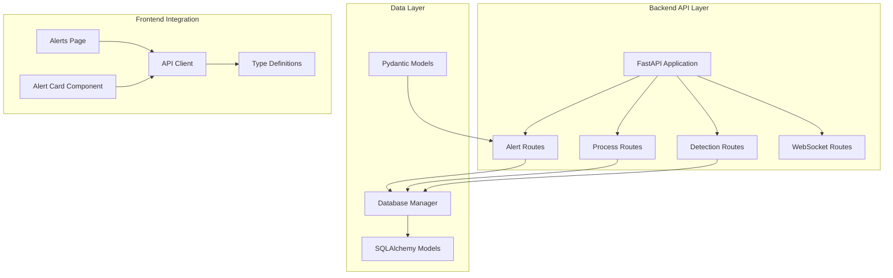
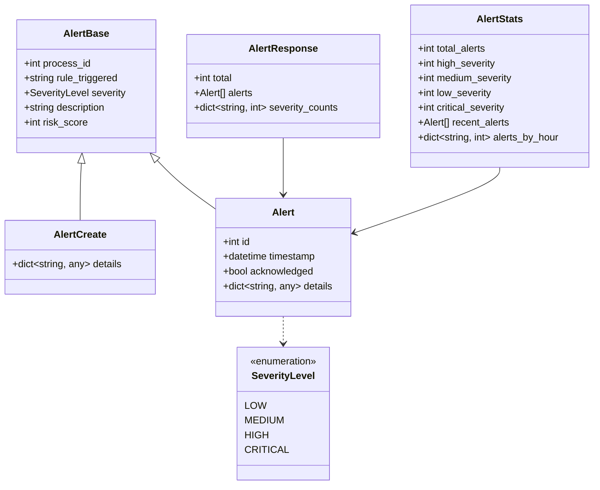
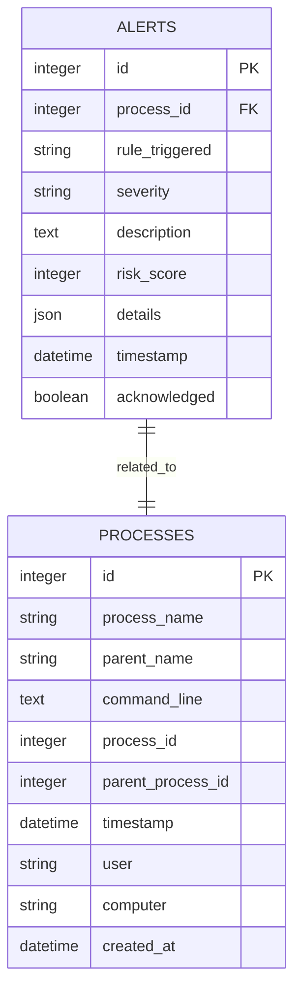
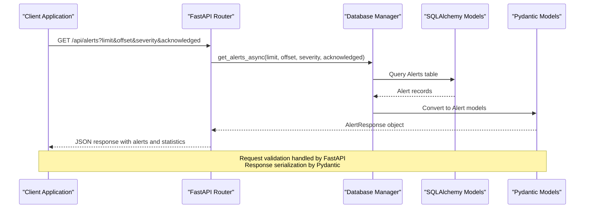
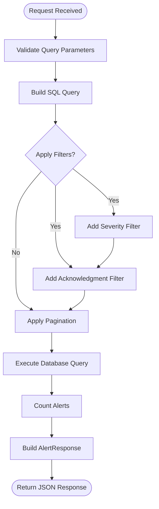
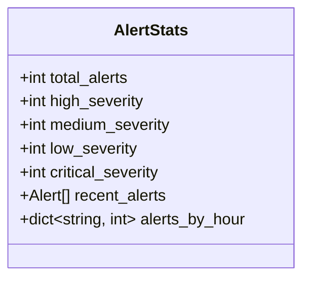
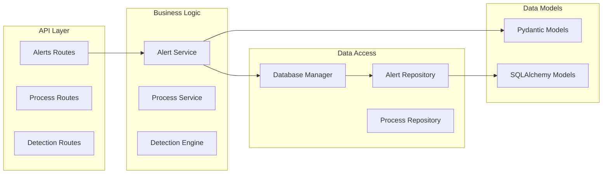
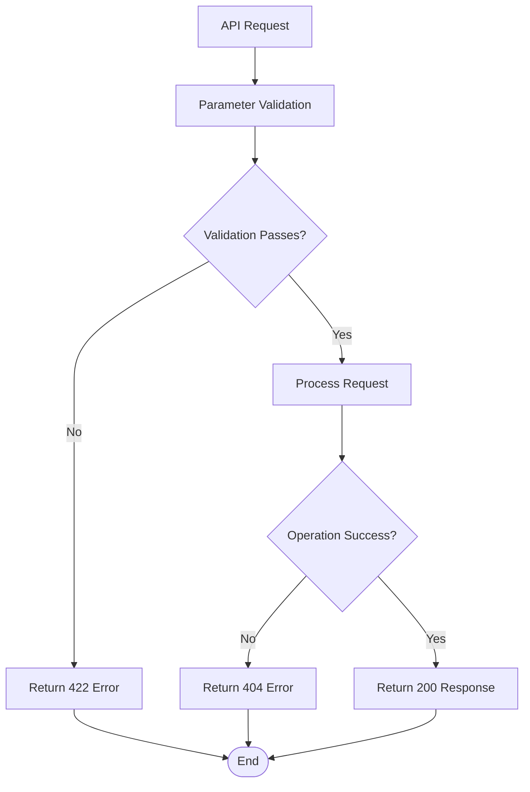

# Alerts Management Endpoints

<cite>
**Referenced Files in This Document**
- [backend/routes/alerts.py](file://backend/routes/alerts.py)
- [backend/models/alert.py](file://backend/models/alert.py)
- [backend/database/database.py](file://backend/database/database.py)
- [backend/database/models.py](file://backend/database/models.py)
- [backend/main.py](file://backend/main.py)
- [frontend/src/pages/Alerts.tsx](file://frontend/src/pages/Alerts.tsx)
- [frontend/src/components/AlertCard.tsx](file://frontend/src/components/AlertCard.tsx)
- [frontend/src/api/client.ts](file://frontend/src/api/client.ts)
- [frontend/src/types/index.ts](file://frontend/src/types/index.ts)
</cite>

## Table of Contents
1. [Introduction](#introduction)
2. [Project Structure](#project-structure)
3. [Core Components](#core-components)
4. [Architecture Overview](#architecture-overview)
5. [Detailed Component Analysis](#detailed-component-analysis)
6. [Dependency Analysis](#dependency-analysis)
7. [Performance Considerations](#performance-considerations)
8. [Troubleshooting Guide](#troubleshooting-guide)
9. [Conclusion](#conclusion)

## Introduction

EDR Lite is a lightweight Endpoint Detection and Response system built with FastAPI that provides comprehensive alert management capabilities. This documentation covers the complete API surface for alert management, including retrieval, filtering, acknowledgment, and bulk operations. The system is designed for real-time security monitoring with support for severity-based filtering, pagination controls, and acknowledgment workflows.

The alert management endpoints enable security analysts to monitor, filter, and manage security events generated by the detection engine. The system supports four severity levels (low, medium, high, critical), pagination controls, acknowledgment status filtering, and bulk operations for efficient alert management workflows.

## Project Structure

The alert management functionality is organized across several key modules:



**Diagram sources**
- [backend/main.py:171-192](file://backend/main.py#L171-L192)
- [backend/routes/alerts.py:15](file://backend/routes/alerts.py#L15)
- [backend/database/database.py:21-84](file://backend/database/database.py#L21-L84)

**Section sources**
- [backend/main.py:171-192](file://backend/main.py#L171-L192)
- [backend/routes/alerts.py:15](file://backend/routes/alerts.py#L15)

## Core Components

### Alert Data Models

The alert management system uses Pydantic models to define data structures and validation rules:



**Diagram sources**
- [backend/models/alert.py:7-55](file://backend/models/alert.py#L7-L55)

### Database Schema

The alert data is persisted using SQLAlchemy models with comprehensive indexing for performance:



**Diagram sources**
- [backend/database/models.py:39-64](file://backend/database/models.py#L39-L64)

**Section sources**
- [backend/models/alert.py:7-55](file://backend/models/alert.py#L7-L55)
- [backend/database/models.py:39-64](file://backend/database/models.py#L39-L64)

## Architecture Overview

The alert management system follows a layered architecture with clear separation of concerns:



**Diagram sources**
- [backend/routes/alerts.py:18-54](file://backend/routes/alerts.py#L18-L54)
- [backend/database/database.py:232-245](file://backend/database/database.py#L232-L245)

The system architecture ensures type safety through Pydantic validation, efficient database operations through SQLAlchemy, and clean separation between API logic and data persistence.

**Section sources**
- [backend/routes/alerts.py:18-54](file://backend/routes/alerts.py#L18-L54)
- [backend/database/database.py:232-245](file://backend/database/database.py#L232-L245)

## Detailed Component Analysis

### GET /api/alerts - Alert Retrieval with Filtering

The primary alert retrieval endpoint supports comprehensive filtering and pagination:

#### Request Parameters

| Parameter | Type | Required | Default | Range | Description |
|-----------|------|----------|---------|-------|-------------|
| limit | integer | No | 100 | 1-1000 | Number of alerts to return |
| offset | integer | No | 0 | ≥0 | Pagination offset |
| severity | string | No | None | low, medium, high, critical | Filter by severity level |
| acknowledged | boolean | No | None | true, false, null | Filter by acknowledgment status |

#### Response Schema

The endpoint returns an `AlertResponse` object containing:

- **total**: Total number of alerts matching filters
- **alerts**: Array of `Alert` objects (validated by Pydantic)
- **severity_counts**: Dictionary with counts for each severity level

#### Implementation Details



**Diagram sources**
- [backend/routes/alerts.py:18-54](file://backend/routes/alerts.py#L18-L54)
- [backend/database/database.py:232-245](file://backend/database/database.py#L232-L245)

**Section sources**
- [backend/routes/alerts.py:18-54](file://backend/routes/alerts.py#L18-L54)
- [backend/database/database.py:232-245](file://backend/database/database.py#L232-L245)

### GET /api/alerts/stats - Dashboard Statistics

This endpoint provides comprehensive statistics for dashboard visualization:

#### Response Schema



**Diagram sources**
- [backend/models/alert.py:47-55](file://backend/models/alert.py#L47-L55)

#### Statistics Calculation

The endpoint calculates:
- **Total alerts** by severity distribution
- **Recent alerts** from the last 24 hours grouped by hour
- **Alert counts** for each severity level

**Section sources**
- [backend/routes/alerts.py:57-63](file://backend/routes/alerts.py#L57-L63)
- [backend/database/database.py:247-284](file://backend/database/database.py#L247-L284)

### GET /api/alerts/recent - Recent Alerts

Retrieves alerts from a configurable time window:

#### Request Parameters

| Parameter | Type | Required | Default | Range | Description |
|-----------|------|----------|---------|-------|-------------|
| minutes | integer | No | 60 | 1-1440 | Time window in minutes (1 day max) |

#### Response Schema

Returns an array of `Alert` objects ordered by timestamp (newest first).

**Section sources**
- [backend/routes/alerts.py:66-86](file://backend/routes/alerts.py#L66-L86)

### Individual Alert Retrieval

#### GET /api/alerts/{alert_id}

Retrieves a specific alert by its database ID:

**HTTP Status Codes:**
- 200: Successful retrieval
- 404: Alert not found

**Response Schema:** `Alert` object

**Section sources**
- [backend/routes/alerts.py:89-101](file://backend/routes/alerts.py#L89-L101)

### Alert Acknowledgment Operations

#### POST /api/alerts/{alert_id}/acknowledge

Marks an alert as acknowledged:

**HTTP Status Codes:**
- 200: Success
- 404: Alert not found

**Response Schema:**
```json
{
  "status": "success",
  "message": "Alert {id} acknowledged"
}
```

#### POST /api/alerts/{alert_id}/unacknowledge

Removes acknowledgment from an alert:

**HTTP Status Codes:**
- 200: Success
- 404: Alert not found

**Response Schema:**
```json
{
  "status": "success",
  "message": "Alert {id} unacknowledged"
}
```

#### DELETE /api/alerts/{alert_id}

Deletes an alert from the database:

**HTTP Status Codes:**
- 200: Success
- 404: Alert not found

**Response Schema:**
```json
{
  "status": "success",
  "message": "Alert {id} deleted"
}
```

**Section sources**
- [backend/routes/alerts.py:104-155](file://backend/routes/alerts.py#L104-L155)

### Bulk Operations

#### POST /api/alerts/bulk/acknowledge

Acknowledges multiple alerts in a single operation:

**Request Body:** Array of alert IDs

**Response Schema:**
```json
{
  "status": "success",
  "message": "Acknowledged {count} alerts"
}
```

**Section sources**
- [backend/routes/alerts.py:158-180](file://backend/routes/alerts.py#L158-L180)

## Dependency Analysis

The alert management system demonstrates excellent separation of concerns:



**Diagram sources**
- [backend/routes/alerts.py:15](file://backend/routes/alerts.py#L15)
- [backend/database/database.py:21-84](file://backend/database/database.py#L21-L84)

Key dependencies:
- **FastAPI**: Web framework and automatic OpenAPI generation
- **SQLAlchemy**: ORM for database operations
- **Pydantic**: Data validation and serialization
- **AsyncIO**: Asynchronous database operations

**Section sources**
- [backend/routes/alerts.py:15](file://backend/routes/alerts.py#L15)
- [backend/database/database.py:21-84](file://backend/database/database.py#L21-L84)

## Performance Considerations

### Database Optimization

The system implements several performance optimizations:

1. **Indexing Strategy**: Critical columns (`severity`, `acknowledged`, `timestamp`) are indexed for efficient filtering
2. **Pagination Limits**: Built-in limits prevent excessive memory usage (1-1000 alerts per request)
3. **Asynchronous Operations**: All database operations use async/await for non-blocking I/O
4. **Query Optimization**: Selective column retrieval and efficient WHERE clauses

### Caching Strategy

The `AlertResponse` includes `severity_counts` to reduce repeated calculations in client applications.

### Scalability Considerations

- **Connection Pooling**: SQLAlchemy async engine with connection pooling
- **Memory Management**: Streaming responses for large datasets
- **Query Limits**: Prevents resource exhaustion through parameter validation

## Troubleshooting Guide

### Common Issues and Solutions

#### 404 Not Found Errors

**Symptoms:** HTTP 404 responses when accessing alerts
**Causes:**
- Non-existent alert ID
- Incorrect endpoint URL
- Database corruption

**Solutions:**
- Verify alert ID exists in database
- Check endpoint URL format
- Restart application to rebuild database indices

#### Validation Errors

**Symptoms:** HTTP 422 Unprocessable Entity errors
**Causes:**
- Invalid parameter values (out of range)
- Incorrect data types
- Missing required parameters

**Solutions:**
- Validate parameters against documented ranges
- Use provided client libraries for automatic validation
- Check parameter types (integers vs strings)

#### Performance Issues

**Symptoms:** Slow response times with large datasets
**Causes:**
- Excessive pagination limits
- Complex filter combinations
- Database contention

**Solutions:**
- Use appropriate limit values (1-1000)
- Apply selective filters
- Monitor database query performance

### Error Handling Patterns

The system follows consistent error handling patterns:



**Section sources**
- [backend/routes/alerts.py:89-101](file://backend/routes/alerts.py#L89-L101)
- [backend/routes/alerts.py:104-155](file://backend/routes/alerts.py#L104-L155)

## Conclusion

The EDR Lite alert management system provides a comprehensive, production-ready solution for security alert monitoring and management. The system offers:

- **Complete CRUD Operations**: Full lifecycle management of security alerts
- **Advanced Filtering**: Multi-dimensional filtering by severity and status
- **Efficient Pagination**: Controlled data retrieval with performance safeguards
- **Real-time Capabilities**: WebSocket integration for live alert streaming
- **Type Safety**: Comprehensive Pydantic validation and serialization
- **Scalable Architecture**: Asynchronous operations and optimized database access

The API design follows RESTful principles with clear endpoint semantics, comprehensive error handling, and extensive client integration support. The system is suitable for both development and production environments, with built-in performance optimizations and scalability considerations.

Common use cases include:
- Security incident response workflows
- Alert triage and prioritization
- Compliance reporting and audit trails
- Real-time security monitoring dashboards
- Automated alert acknowledgment and escalation

The modular architecture ensures easy maintenance, testing, and extension for future security monitoring requirements.