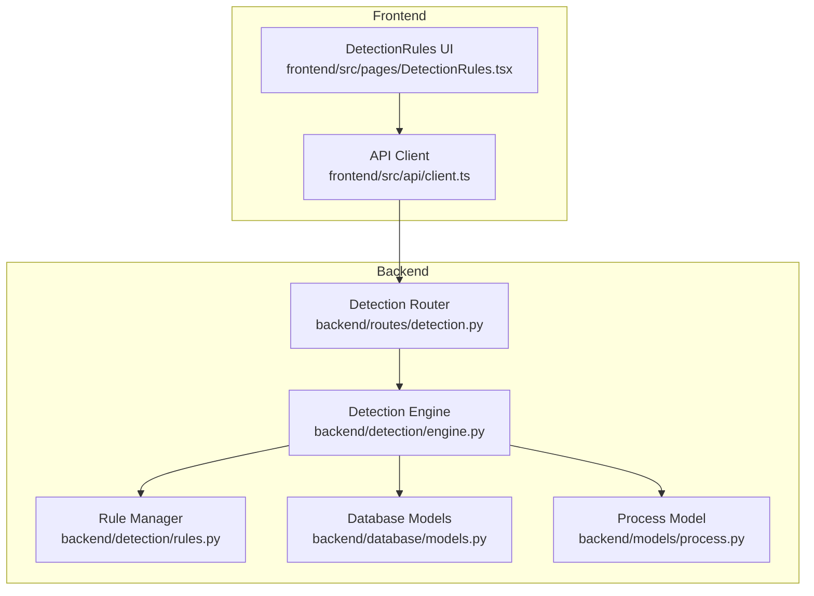
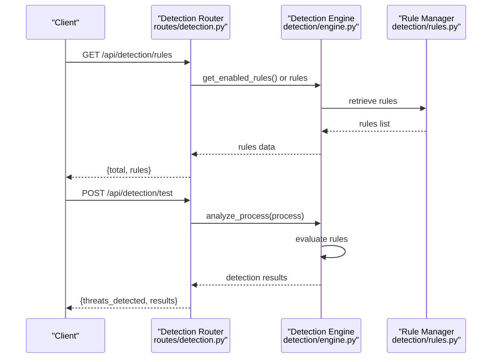
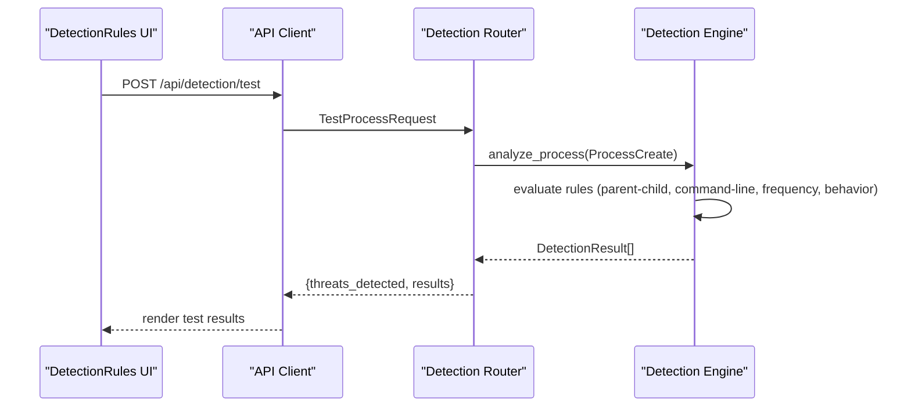
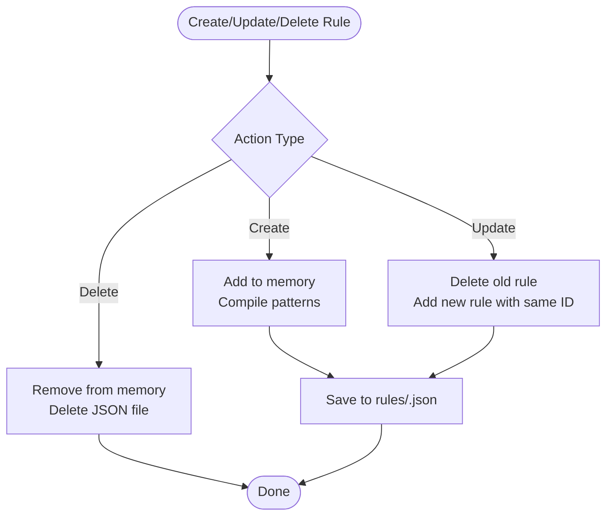
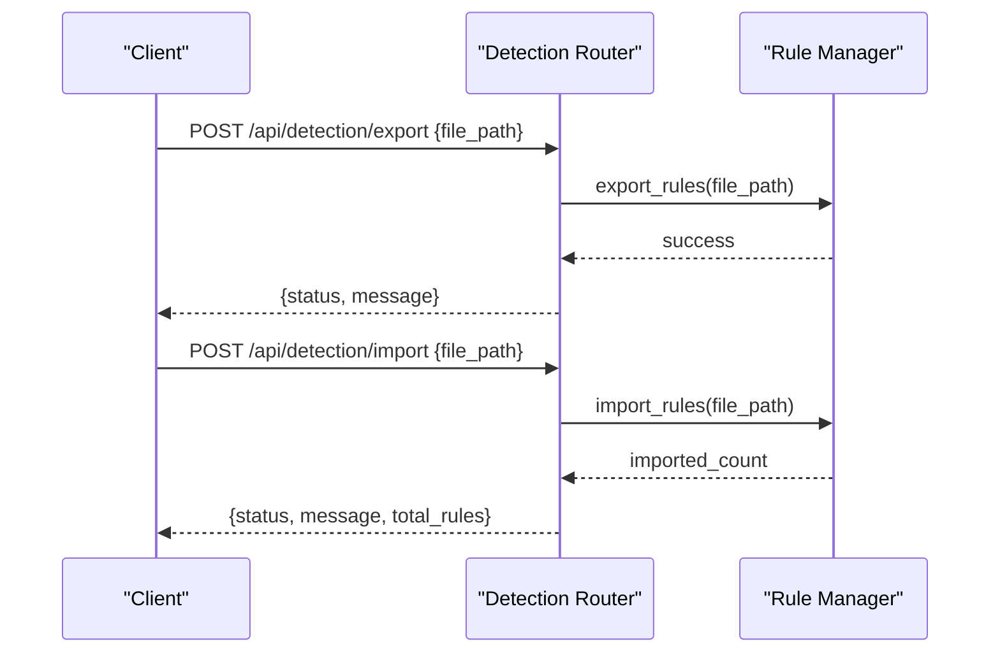
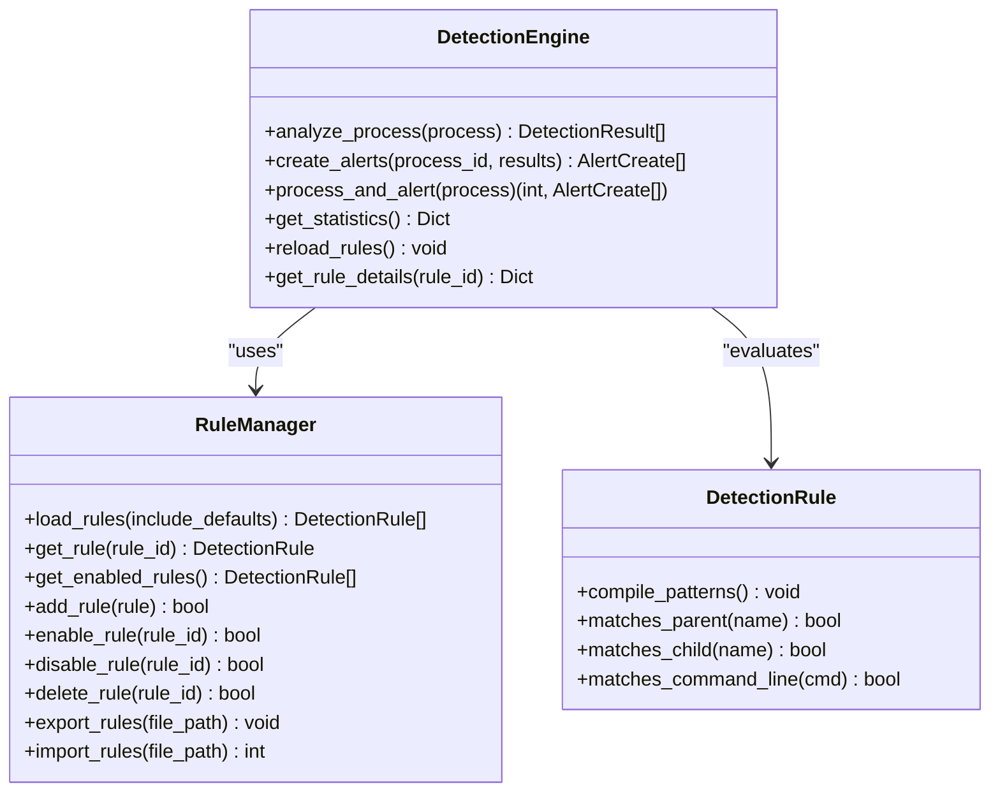
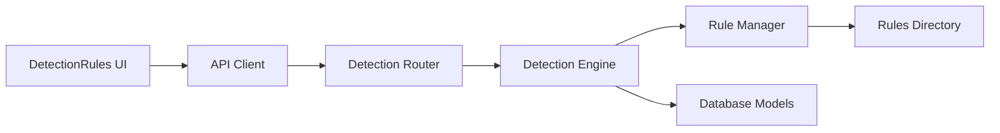

# Detection Rules Management Endpoints

<cite>
**Referenced Files in This Document**
- [backend/routes/detection.py](file://backend/routes/detection.py)
- [backend/detection/engine.py](file://backend/detection/engine.py)
- [backend/detection/rules.py](file://backend/detection/rules.py)
- [backend/models/detection.py](file://backend/models/detection.py)
- [backend/models/process.py](file://backend/models/process.py)
- [backend/database/models.py](file://backend/database/models.py)
- [backend/parser/sysmon_parser.py](file://backend/parser/sysmon_parser.py)
- [backend/parser/log_simulator.py](file://backend/parser/log_simulator.py)
- [backend/main.py](file://backend/main.py)
- [frontend/src/pages/DetectionRules.tsx](file://frontend/src/pages/DetectionRules.tsx)
- [frontend/src/api/client.ts](file://frontend/src/api/client.ts)
- [frontend/src/types/index.ts](file://frontend/src/types/index.ts)
- [sample_data/sample_sysmon_events.json](file://sample_data/sample_sysmon_events.json)
</cite>

## Table of Contents
1. [Introduction](#introduction)
2. [Project Structure](#project-structure)
3. [Core Components](#core-components)
4. [Architecture Overview](#architecture-overview)
5. [Detailed Component Analysis](#detailed-component-analysis)
6. [Dependency Analysis](#dependency-analysis)
7. [Performance Considerations](#performance-considerations)
8. [Troubleshooting Guide](#troubleshooting-guide)
9. [Conclusion](#conclusion)
10. [Appendices](#appendices)

## Introduction
This document provides comprehensive API documentation for EDR Lite's detection rule management endpoints. It covers endpoints for creating, updating, and deleting detection rules, retrieving rule configurations, enabling/disabling rules, managing rule priorities, and testing detection logic against sample Sysmon events. It also documents request/response schemas for rule definitions, validation behavior, error handling, and integration with the detection engine. Practical examples and best practices are included for rule development, performance optimization, and troubleshooting.

## Project Structure
The detection rule management system spans backend API routes, a detection engine, rule storage, and a lightweight frontend UI. The backend exposes REST endpoints under `/api/detection`, integrates with a detection engine that evaluates process events against rules, and persists rule changes to JSON files in a configurable directory. The frontend provides a UI for viewing, testing, and managing rules.

**Diagram sources**
- [backend/routes/detection.py:14-256](file://backend/routes/detection.py#L14-L256)
- [backend/detection/engine.py:64-324](file://backend/detection/engine.py#L64-L324)
- [backend/detection/rules.py:273-480](file://backend/detection/rules.py#L273-L480)
- [backend/database/models.py:9-77](file://backend/database/models.py#L9-L77)
- [backend/models/process.py:6-44](file://backend/models/process.py#L6-L44)
- [frontend/src/pages/DetectionRules.tsx:1-271](file://frontend/src/pages/DetectionRules.tsx#L1-L271)
- [frontend/src/api/client.ts:64-104](file://frontend/src/api/client.ts#L64-L104)

**Section sources**
- [backend/routes/detection.py:14-256](file://backend/routes/detection.py#L14-L256)
- [backend/detection/engine.py:64-324](file://backend/detection/engine.py#L64-L324)
- [backend/detection/rules.py:273-480](file://backend/detection/rules.py#L273-L480)
- [backend/database/models.py:9-77](file://backend/database/models.py#L9-L77)
- [backend/models/process.py:6-44](file://backend/models/process.py#L6-L44)
- [frontend/src/pages/DetectionRules.tsx:1-271](file://frontend/src/pages/DetectionRules.tsx#L1-L271)
- [frontend/src/api/client.ts:64-104](file://frontend/src/api/client.ts#L64-L104)

## Core Components
- Detection Router: Exposes REST endpoints for rule CRUD, toggling, retrieval, statistics, rule testing, and bulk operations.
- Detection Engine: Evaluates process events against rules, tracks frequency anomalies, and generates alerts.
- Rule Manager: Loads default and custom rules from JSON files, manages rule lifecycle, and supports export/import.
- Data Models: Define rule schema, detection results, and process event structures.
- Database Models: Persist processes and alerts for audit and historical analysis.
- Frontend UI and API Client: Provide a user interface and typed API bindings for rule management and testing.

Key capabilities:
- Create/update/delete custom detection rules via JSON configuration.
- Enable/disable rules and filter by type or status.
- Test detection logic against sample Sysmon events without persisting results.
- Export/import rule sets for backup and migration.
- Retrieve rule statistics and engine metrics.

**Section sources**
- [backend/routes/detection.py:44-256](file://backend/routes/detection.py#L44-L256)
- [backend/detection/engine.py:84-324](file://backend/detection/engine.py#L84-L324)
- [backend/detection/rules.py:273-480](file://backend/detection/rules.py#L273-L480)
- [backend/models/detection.py:17-92](file://backend/models/detection.py#L17-L92)
- [backend/database/models.py:9-77](file://backend/database/models.py#L9-L77)

## Architecture Overview
The detection rule management architecture centers around the Detection Router, which delegates to the Detection Engine and Rule Manager. Rules are persisted to JSON files in a dedicated directory and loaded at startup. The engine evaluates incoming process events against enabled rules and produces alerts.

**Diagram sources**
- [backend/routes/detection.py:44-211](file://backend/routes/detection.py#L44-L211)
- [backend/detection/engine.py:84-190](file://backend/detection/engine.py#L84-L190)
- [backend/detection/rules.py:342-354](file://backend/detection/rules.py#L342-L354)

**Section sources**
- [backend/routes/detection.py:44-211](file://backend/routes/detection.py#L44-L211)
- [backend/detection/engine.py:84-190](file://backend/detection/engine.py#L84-L190)
- [backend/detection/rules.py:342-354](file://backend/detection/rules.py#L342-L354)

## Detailed Component Analysis

### Detection Rules API Endpoints
- Base path: `/api/detection`
- Tags: `detection`

Endpoints:
- GET `/rules`: Retrieve all rules with optional filters and trigger counts.
- GET `/rules/{rule_id}`: Retrieve a specific rule by ID.
- POST `/rules`: Create a new detection rule from JSON configuration.
- PUT `/rules/{rule_id}`: Update an existing rule by replacing it.
- POST `/rules/{rule_id}/toggle`: Enable or disable a rule.
- DELETE `/rules/{rule_id}`: Delete a custom rule.
- GET `/rules/stats`: Get statistics about loaded rules.
- POST `/test`: Test a process against detection rules without saving.
- GET `/stats`: Get detection engine statistics.
- POST `/reload`: Reload all detection rules from files.
- POST `/export`: Export all rules to a JSON file.
- POST `/import`: Import rules from a JSON file.

Request/Response Schemas:
- Rule Definition Schema: See [DetectionRule model:17-84](file://backend/models/detection.py#L17-L84).
- Test Request Schema: See [TestProcessRequest:30-37](file://backend/routes/detection.py#L30-L37).
- Rule Toggle Request Schema: See [RuleToggleRequest:39-42](file://backend/routes/detection.py#L39-L42).
- Response for GET `/rules`: `{ total: number, rules: DetectionRule[] }`.
- Response for GET `/rules/{rule_id}`: `{ rule: DetectionRule, times_triggered?: number }`.
- Response for POST `/test`: `{ process, threats_detected: number, results: DetectionResult[] }`.

Validation and Error Handling:
- Validation occurs via Pydantic models; invalid rule configurations cause HTTP 400 responses during creation/update.
- Not found errors return HTTP 404 for missing rule IDs.
- Toggle operations return HTTP 404 if the rule does not exist.

Bulk Operations:
- Export/Import endpoints accept a file path string and return success messages with counts.

**Section sources**
- [backend/routes/detection.py:44-256](file://backend/routes/detection.py#L44-L256)
- [backend/models/detection.py:17-92](file://backend/models/detection.py#L17-L92)
- [frontend/src/api/client.ts:64-104](file://frontend/src/api/client.ts#L64-L104)

### Rule Testing Workflow
The `/api/detection/test` endpoint allows developers to validate detection logic against sample Sysmon events without persisting results. It accepts a minimal process representation and returns detection outcomes with confidence and risk scores.

**Diagram sources**
- [frontend/src/pages/DetectionRules.tsx:56-67](file://frontend/src/pages/DetectionRules.tsx#L56-L67)
- [frontend/src/api/client.ts:87-94](file://frontend/src/api/client.ts#L87-L94)
- [backend/routes/detection.py:168-211](file://backend/routes/detection.py#L168-L211)
- [backend/detection/engine.py:84-190](file://backend/detection/engine.py#L84-L190)

**Section sources**
- [frontend/src/pages/DetectionRules.tsx:56-67](file://frontend/src/pages/DetectionRules.tsx#L56-L67)
- [frontend/src/api/client.ts:87-94](file://frontend/src/api/client.ts#L87-L94)
- [backend/routes/detection.py:168-211](file://backend/routes/detection.py#L168-L211)
- [backend/detection/engine.py:84-190](file://backend/detection/engine.py#L84-L190)

### Rule Configuration Schema
The DetectionRule model defines the JSON schema for rule configuration. It supports multiple rule types and includes pattern-matching criteria, frequency thresholds, and behavioral parameters.

Fields:
- id: Unique rule identifier (optional for creation).
- name: Human-readable rule name.
- rule_type: One of parent_child, command_line, frequency, behavior, anomaly.
- description: Explanation of what the rule detects.
- severity: low, medium, high, critical.
- enabled: Whether the rule is active.
- parent_process: Regex pattern for parent process name.
- child_process: Regex pattern for child process name.
- command_line_pattern: Regex pattern for command line.
- command_line_contains: Array of substrings to match in command line.
- max_events_per_minute: Threshold for frequency detection.
- time_window_minutes: Time window for frequency check.
- risk_score: Base risk score (0–100).
- times_triggered: Engine-side counter (returned by GET /rules).

Pattern Matching Logic:
- Parent-child: Matches both parent and child process patterns.
- Command line: Matches either command_line_contains or command_line_pattern.
- Frequency: Counts events per parent within a time window and compares to threshold.
- Behavior: Matches child process pattern for suspicious behavior.

**Section sources**
- [backend/models/detection.py:17-84](file://backend/models/detection.py#L17-L84)
- [backend/detection/engine.py:121-244](file://backend/detection/engine.py#L121-L244)

### Rule Lifecycle Management
- Creation: POST `/rules` adds a new rule, compiles patterns, and saves to a JSON file named by rule ID.
- Update: PUT `/rules/{rule_id}` deletes the old rule and creates a new one with the same ID.
- Deletion: DELETE `/rules/{rule_id}` removes the rule from memory and deletes the associated JSON file.
- Toggle: POST `/rules/{rule_id}/toggle` switches enabled state and persists to disk.
- Persistence: Rules are stored as individual JSON files in the configured rules directory.

**Diagram sources**
- [backend/detection/rules.py:355-424](file://backend/detection/rules.py#L355-L424)

**Section sources**
- [backend/detection/rules.py:355-424](file://backend/detection/rules.py#L355-L424)

### Bulk Rule Management
- Export: POST `/export` writes all loaded rules to a JSON file.
- Import: POST `/import` reads a JSON file and adds rules to the manager.
- Reload: POST `/reload` refreshes rules from files.

**Diagram sources**
- [backend/routes/detection.py:234-256](file://backend/routes/detection.py#L234-L256)
- [backend/detection/rules.py:448-480](file://backend/detection/rules.py#L448-L480)

**Section sources**
- [backend/routes/detection.py:234-256](file://backend/routes/detection.py#L234-L256)
- [backend/detection/rules.py:448-480](file://backend/detection/rules.py#L448-L480)

### Integration with Detection Engine
- Rule Loading: The engine initializes a Rule Manager that loads default and custom rules.
- Evaluation: For each process, the engine evaluates enabled rules and produces DetectionResult objects.
- Alerts: Threat detections are transformed into AlertCreate objects and persisted to the database.

**Diagram sources**
- [backend/detection/engine.py:64-324](file://backend/detection/engine.py#L64-L324)
- [backend/detection/rules.py:273-480](file://backend/detection/rules.py#L273-L480)
- [backend/models/detection.py:17-84](file://backend/models/detection.py#L17-L84)

**Section sources**
- [backend/detection/engine.py:64-324](file://backend/detection/engine.py#L64-L324)
- [backend/detection/rules.py:273-480](file://backend/detection/rules.py#L273-L480)
- [backend/models/detection.py:17-84](file://backend/models/detection.py#L17-L84)

## Dependency Analysis
The detection rule management system exhibits clear separation of concerns:
- Router depends on DetectionEngine and RuleManager for rule operations.
- Engine depends on RuleManager for rule data and on Database for persistence.
- RuleManager depends on filesystem for rule storage and on DetectionRule for validation.
- Frontend UI communicates with the API client to manage rules and test detections.

**Diagram sources**
- [frontend/src/pages/DetectionRules.tsx:1-271](file://frontend/src/pages/DetectionRules.tsx#L1-L271)
- [frontend/src/api/client.ts:64-104](file://frontend/src/api/client.ts#L64-L104)
- [backend/routes/detection.py:14-256](file://backend/routes/detection.py#L14-L256)
- [backend/detection/engine.py:64-324](file://backend/detection/engine.py#L64-L324)
- [backend/detection/rules.py:273-480](file://backend/detection/rules.py#L273-L480)
- [backend/database/models.py:9-77](file://backend/database/models.py#L9-L77)

**Section sources**
- [frontend/src/pages/DetectionRules.tsx:1-271](file://frontend/src/pages/DetectionRules.tsx#L1-L271)
- [frontend/src/api/client.ts:64-104](file://frontend/src/api/client.ts#L64-L104)
- [backend/routes/detection.py:14-256](file://backend/routes/detection.py#L14-L256)
- [backend/detection/engine.py:64-324](file://backend/detection/engine.py#L64-L324)
- [backend/detection/rules.py:273-480](file://backend/detection/rules.py#L273-L480)
- [backend/database/models.py:9-77](file://backend/database/models.py#L9-L77)

## Performance Considerations
- Rule evaluation cost: Each rule evaluation involves regex compilation and matching. Keep patterns simple and avoid overly broad regex to reduce CPU overhead.
- Frequency tracking: The FrequencyTracker maintains bounded deques per parent process. Tune time windows and thresholds to balance sensitivity and performance.
- Memory footprint: Large rule sets increase memory usage. Prefer enabling only necessary rules and use filtering queries (enabled_only, rule_type).
- I/O operations: Rule persistence uses JSON files. Batch updates and minimize frequent reloads to reduce disk I/O.
- Concurrency: The engine uses thread locks for frequency tracking to ensure safe concurrent access.

[No sources needed since this section provides general guidance]

## Troubleshooting Guide
Common issues and resolutions:
- Malformed rule configuration: Creation/Update returns HTTP 400. Validate rule fields against the DetectionRule schema and ensure regex patterns are syntactically correct.
- Rule not found: Toggle/Delete returns HTTP 404. Verify the rule ID exists and is not a default rule (deletion may be restricted).
- No detections during testing: Confirm the rule type and patterns match the test input. Use the test endpoint to validate logic before deployment.
- Performance degradation: Review enabled rules count and simplify complex regex patterns. Adjust frequency thresholds and time windows.
- Persistence failures: Check write permissions for the rules directory and ensure sufficient disk space.

**Section sources**
- [backend/routes/detection.py:87-120](file://backend/routes/detection.py#L87-L120)
- [backend/detection/rules.py:355-424](file://backend/detection/rules.py#L355-L424)

## Conclusion
EDR Lite provides a robust, JSON-driven detection rule management system with comprehensive endpoints for creation, testing, toggling, and bulk operations. The Detection Engine efficiently evaluates rules against process events, generating actionable alerts. By following the guidelines in this document, teams can develop effective detection rules, validate them safely, and maintain optimal performance.

[No sources needed since this section summarizes without analyzing specific files]

## Appendices

### Example: Creating a Parent-Child Detection Rule
- Endpoint: POST `/api/detection/rules`
- Schema: DetectionRule with rule_type parent_child, parent_process, child_process, severity, risk_score.
- Purpose: Detect suspicious parent-child process relationships indicative of malware execution.

**Section sources**
- [backend/models/detection.py:17-84](file://backend/models/detection.py#L17-L84)
- [backend/routes/detection.py:86-99](file://backend/routes/detection.py#L86-L99)

### Example: Creating a Command-Line Detection Rule
- Endpoint: POST `/api/detection/rules`
- Schema: DetectionRule with rule_type command_line, child_process, command_line_contains, severity, risk_score.
- Purpose: Identify suspicious command-line constructs commonly used by attackers.

**Section sources**
- [backend/models/detection.py:17-84](file://backend/models/detection.py#L17-L84)
- [backend/routes/detection.py:86-99](file://backend/routes/detection.py#L86-L99)

### Example: Creating a Frequency-Based Detection Rule
- Endpoint: POST `/api/detection/rules`
- Schema: DetectionRule with rule_type frequency, max_events_per_minute, time_window_minutes, severity, risk_score.
- Purpose: Detect rapid process spawning from a single parent, indicating automated attacks.

**Section sources**
- [backend/models/detection.py:17-84](file://backend/models/detection.py#L17-L84)
- [backend/detection/engine.py:192-225](file://backend/detection/engine.py#L192-L225)
- [backend/routes/detection.py:86-99](file://backend/routes/detection.py#L86-L99)

### Example: Testing a Rule Against Sample Sysmon Events
- Endpoint: POST `/api/detection/test`
- Sample events: See [sample_sysmon_events.json:1-194](file://sample_data/sample_sysmon_events.json#L1-L194).
- Workflow: Use the DetectionRules UI or API client to send a test process and review results.

**Section sources**
- [backend/routes/detection.py:168-211](file://backend/routes/detection.py#L168-L211)
- [frontend/src/pages/DetectionRules.tsx:56-67](file://frontend/src/pages/DetectionRules.tsx#L56-L67)
- [frontend/src/api/client.ts:87-94](file://frontend/src/api/client.ts#L87-L94)
- [sample_data/sample_sysmon_events.json:1-194](file://sample_data/sample_sysmon_events.json#L1-L194)

### Best Practices for Rule Development
- Keep regex patterns precise to avoid false positives; test with representative samples.
- Use appropriate severities aligned with risk_score to prioritize alerts.
- Enable only necessary rules to maintain performance; disable others via toggle endpoint.
- Use the test endpoint extensively during development to validate logic.
- Export rules regularly for backup and version control.

[No sources needed since this section provides general guidance]