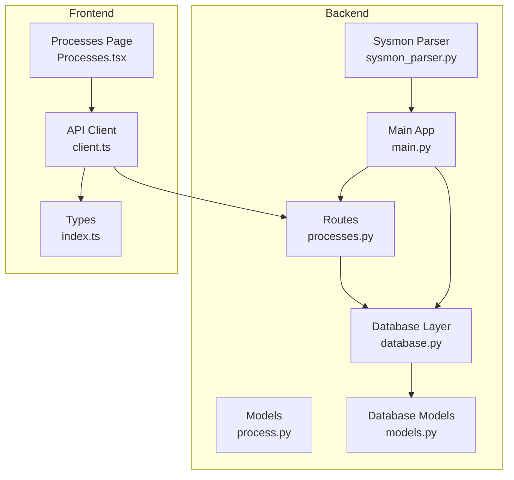
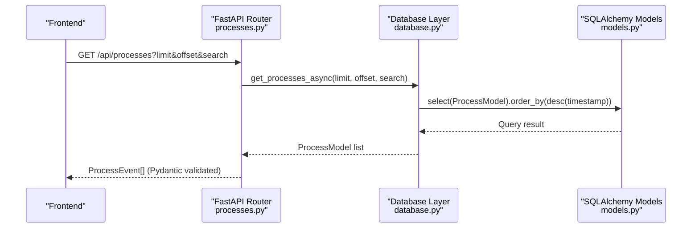
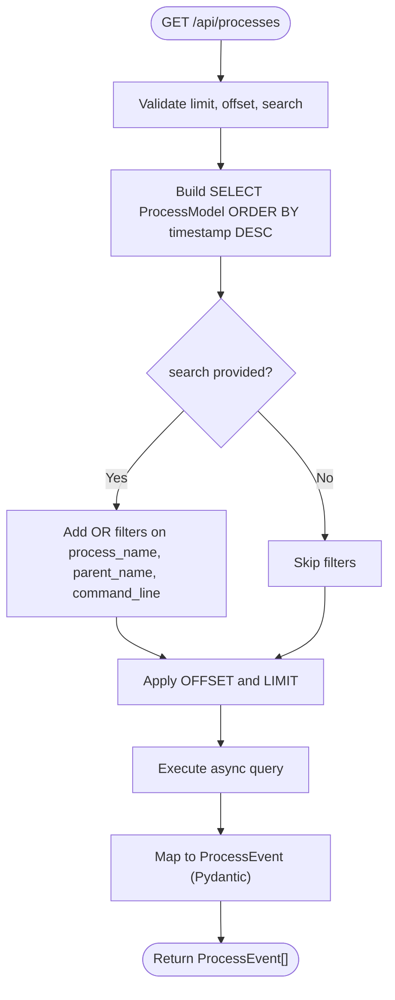
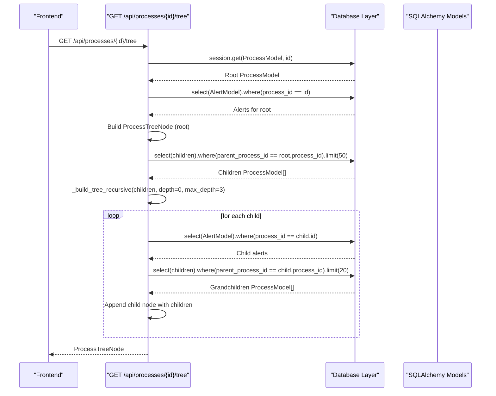
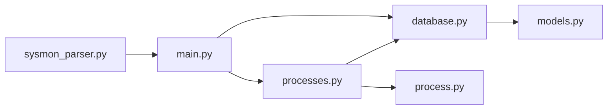

# Processes Management Endpoints

<cite>
**Referenced Files in This Document**
- [processes.py](file://backend/routes/processes.py)
- [process.py](file://backend/models/process.py)
- [models.py](file://backend/database/models.py)
- [database.py](file://backend/database/database.py)
- [sysmon_parser.py](file://backend/parser/sysmon_parser.py)
- [client.ts](file://frontend/src/api/client.ts)
- [Processes.tsx](file://frontend/src/pages/Processes.tsx)
- [index.ts](file://frontend/src/types/index.ts)
- [main.py](file://backend/main.py)
- [sample_sysmon_events.json](file://sample_data/sample_sysmon_events.json)
</cite>

## Table of Contents
1. [Introduction](#introduction)
2. [Project Structure](#project-structure)
3. [Core Components](#core-components)
4. [Architecture Overview](#architecture-overview)
5. [Detailed Component Analysis](#detailed-component-analysis)
6. [Dependency Analysis](#dependency-analysis)
7. [Performance Considerations](#performance-considerations)
8. [Troubleshooting Guide](#troubleshooting-guide)
9. [Conclusion](#conclusion)
10. [Appendices](#appendices)

## Introduction
This document provides comprehensive API documentation for EDR Lite’s process management endpoints. It covers process event listing with filtering, recent process retrieval, statistics, individual process lookup, hierarchical process tree visualization, and parent-based filtering. It also documents request/response schemas, pagination and sorting behavior, Sysmon event mappings, and practical examples for monitoring and forensic workflows.

## Project Structure
The process management functionality spans the backend FastAPI routes, SQLAlchemy models, Pydantic data models, and the frontend client and UI components.

**Diagram sources**
- [processes.py:1-253](file://backend/routes/processes.py#L1-L253)
- [process.py:1-44](file://backend/models/process.py#L1-L44)
- [models.py:1-77](file://backend/database/models.py#L1-L77)
- [database.py:1-324](file://backend/database/database.py#L1-L324)
- [sysmon_parser.py:1-385](file://backend/parser/sysmon_parser.py#L1-L385)
- [client.ts:1-124](file://frontend/src/api/client.ts#L1-L124)
- [Processes.tsx:1-136](file://frontend/src/pages/Processes.tsx#L1-L136)
- [index.ts:1-83](file://frontend/src/types/index.ts#L1-L83)
- [main.py:1-705](file://backend/main.py#L1-L705)

**Section sources**
- [processes.py:1-253](file://backend/routes/processes.py#L1-L253)
- [process.py:1-44](file://backend/models/process.py#L1-L44)
- [models.py:1-77](file://backend/database/models.py#L1-L77)
- [database.py:1-324](file://backend/database/database.py#L1-L324)
- [sysmon_parser.py:1-385](file://backend/parser/sysmon_parser.py#L1-L385)
- [client.ts:1-124](file://frontend/src/api/client.ts#L1-L124)
- [Processes.tsx:1-136](file://frontend/src/pages/Processes.tsx#L1-L136)
- [index.ts:1-83](file://frontend/src/types/index.ts#L1-L83)
- [main.py:1-705](file://backend/main.py#L1-L705)

## Core Components
- Process listing and filtering: GET /api/processes with pagination and search across process name, parent name, and command line.
- Recent processes: GET /api/processes/recent with configurable time window.
- Process statistics: GET /api/processes/stats for totals and top processes.
- Individual process: GET /api/processes/{process_id}.
- Process tree: GET /api/processes/{process_id}/tree with hierarchical children and suspiciousness indicators.
- Parent-based filtering: GET /api/processes/by-parent/{parent_name} with limit.
- Process deletion: DELETE /api/processes/{process_id}.

These endpoints are implemented in the processes router and backed by SQLAlchemy models and Pydantic schemas.

**Section sources**
- [processes.py:19-253](file://backend/routes/processes.py#L19-L253)
- [process.py:22-44](file://backend/models/process.py#L22-L44)
- [models.py:9-36](file://backend/database/models.py#L9-L36)

## Architecture Overview
The process management endpoints follow a layered architecture:
- FastAPI routes define the REST API surface.
- Database layer handles async sessions and query construction.
- SQLAlchemy models represent persisted process and alert data.
- Pydantic models define request/response schemas.
- Frontend client consumes the API and renders the UI.

**Diagram sources**
- [processes.py:19-42](file://backend/routes/processes.py#L19-L42)
- [database.py:139-153](file://backend/database/database.py#L139-L153)
- [models.py:9-22](file://backend/database/models.py#L9-L22)

**Section sources**
- [processes.py:19-42](file://backend/routes/processes.py#L19-L42)
- [database.py:139-153](file://backend/database/database.py#L139-L153)
- [models.py:9-22](file://backend/database/models.py#L9-L22)

## Detailed Component Analysis

### Process Listing and Filtering
- Endpoint: GET /api/processes
- Query parameters:
  - limit: integer, default 100, min 1, max 1000
  - offset: integer, default 0, min 0
  - search: optional string to match process_name, parent_name, or command_line
- Sorting: descending by timestamp
- Response: Array of ProcessEvent (validated Pydantic model)
- Implementation notes:
  - Uses async database session dependency.
  - Applies SQL LIKE-style containment filters for search.
  - Limits results by offset and limit.

**Diagram sources**
- [processes.py:19-42](file://backend/routes/processes.py#L19-L42)
- [database.py:139-153](file://backend/database/database.py#L139-L153)

**Section sources**
- [processes.py:19-42](file://backend/routes/processes.py#L19-L42)
- [database.py:122-153](file://backend/database/database.py#L122-L153)
- [process.py:22-32](file://backend/models/process.py#L22-L32)

### Recent Processes
- Endpoint: GET /api/processes/recent
- Query parameters:
  - minutes: integer, default 5, min 1, max 1440
- Behavior:
  - Computes cutoff as UTC now minus minutes.
  - Filters by timestamp >= cutoff.
  - Orders by timestamp descending.
- Response: Array of ProcessEvent.

**Section sources**
- [processes.py:45-62](file://backend/routes/processes.py#L45-L62)
- [database.py:160-168](file://backend/database/database.py#L160-L168)

### Process Statistics
- Endpoint: GET /api/processes/stats
- Returns:
  - total_processes
  - processes_last_hour
  - processes_last_24h
  - top_parent_processes (name, count)
  - top_child_processes (name, count)
- Implementation uses grouped counts and limits.

**Section sources**
- [processes.py:65-112](file://backend/routes/processes.py#L65-L112)
- [database.py:169-182](file://backend/database/database.py#L169-L182)

### Individual Process Lookup
- Endpoint: GET /api/processes/{process_id}
- Behavior:
  - Retrieves ProcessModel by primary key.
  - Returns 404 if not found.
  - Converts to ProcessEvent (validated).
- Response: ProcessEvent.

**Section sources**
- [processes.py:115-125](file://backend/routes/processes.py#L115-L125)
- [database.py:155-158](file://backend/database/database.py#L155-L158)

### Process Tree Visualization
- Endpoint: GET /api/processes/{process_id}/tree
- Behavior:
  - Validates root process existence.
  - Builds ProcessTreeNode with:
    - id, process_name, process_id, parent_process_id, command_line, timestamp
    - children: array of ProcessTreeNode
    - is_suspicious: true if any related alert exists
    - severity: first alert severity if present
  - Recursively collects children with depth limit (default 3) and per-level child limit (default 20).
  - Related alerts are fetched for each node to mark suspiciousness.
- Response: ProcessTreeNode.

**Diagram sources**
- [processes.py:128-174](file://backend/routes/processes.py#L128-L174)
- [processes.py:177-219](file://backend/routes/processes.py#L177-L219)
- [models.py:9-22](file://backend/database/models.py#L9-L22)

**Section sources**
- [processes.py:128-174](file://backend/routes/processes.py#L128-L174)
- [processes.py:177-219](file://backend/routes/processes.py#L177-L219)
- [process.py:34-44](file://backend/models/process.py#L34-L44)

### Parent-Based Filtering
- Endpoint: GET /api/processes/by-parent/{parent_name}
- Query parameters:
  - limit: integer, default 100, min 1, max 1000
- Behavior:
  - Filters ProcessModel where parent_name contains the given string.
  - Orders by timestamp descending.
  - Limits results by limit.
- Response: Array of ProcessEvent.

**Section sources**
- [processes.py:222-237](file://backend/routes/processes.py#L222-L237)
- [database.py:170-182](file://backend/database/database.py#L170-L182)

### Process Deletion
- Endpoint: DELETE /api/processes/{process_id}
- Behavior:
  - Retrieves ProcessModel by primary key.
  - Returns 404 if not found.
  - Deletes and commits.
- Response: Success message.

**Section sources**
- [processes.py:240-253](file://backend/routes/processes.py#L240-L253)
- [database.py:155-158](file://backend/database/database.py#L155-L158)

### Request/Response Schemas

#### ProcessEvent (response)
- Fields:
  - id: integer
  - process_name: string
  - parent_name: string
  - command_line: string
  - process_id: integer
  - parent_process_id: integer
  - timestamp: datetime (ISO format)
  - user: optional string
  - computer: optional string
  - created_at: datetime (ISO format)

**Section sources**
- [process.py:22-32](file://backend/models/process.py#L22-L32)
- [models.py:24-36](file://backend/database/models.py#L24-L36)

#### ProcessTreeNode (tree response)
- Fields:
  - id: integer
  - process_name: string
  - process_id: integer
  - parent_process_id: integer
  - command_line: string
  - timestamp: datetime (ISO format)
  - children: array of ProcessTreeNode
  - is_suspicious: boolean
  - severity: optional string

**Section sources**
- [process.py:34-44](file://backend/models/process.py#L34-L44)

#### Frontend Types
- Process: matches ProcessEvent shape
- ProcessTreeNode: matches backend tree shape

**Section sources**
- [index.ts:19-42](file://frontend/src/types/index.ts#L19-L42)

### Sysmon Event Mappings
The backend ingests Windows Sysmon Event ID 1 (Process Creation) events. The parser maps fields to internal models and supports ingestion via:
- Manual ingestion endpoint POST /api/ingest
- Batch simulation endpoint POST /api/simulate/batch
- Real-time simulation mode

Key Sysmon fields mapped include process identifiers, names, command lines, parent process info, user, computer, and hashes.

**Section sources**
- [sysmon_parser.py:23-58](file://backend/parser/sysmon_parser.py#L23-L58)
- [sysmon_parser.py:296-327](file://backend/parser/sysmon_parser.py#L296-L327)
- [main.py:243-311](file://backend/main.py#L243-L311)
- [sample_sysmon_events.json:1-194](file://sample_data/sample_sysmon_events.json#L1-L194)

### Frontend Integration
- API client exposes:
  - getAll(params): limit, offset, search
  - getRecent(minutes)
  - getStats()
  - getTree(id)
  - getByParent(parentName, limit)
  - getById(id)
  - delete(id)
- Processes page:
  - Implements search, pagination, and real-time updates via WebSocket.

**Section sources**
- [client.ts:40-62](file://frontend/src/api/client.ts#L40-L62)
- [Processes.tsx:15-29](file://frontend/src/pages/Processes.tsx#L15-L29)

## Dependency Analysis
- Routes depend on:
  - Database dependency for async sessions
  - Pydantic models for serialization/validation
  - SQLAlchemy models for queries
- Database layer encapsulates:
  - Async session management
  - Query builders for processes and alerts
- Parser integrates with ingestion pipeline to populate process records.

**Diagram sources**
- [processes.py:12-14](file://backend/routes/processes.py#L12-L14)
- [database.py:11-12](file://backend/database/database.py#L11-L12)
- [process.py:1-4](file://backend/models/process.py#L1-L4)
- [models.py:1-6](file://backend/database/models.py#L1-L6)
- [main.py:39-41](file://backend/main.py#L39-L41)
- [sysmon_parser.py:1-9](file://backend/parser/sysmon_parser.py#L1-L9)

**Section sources**
- [processes.py:12-14](file://backend/routes/processes.py#L12-L14)
- [database.py:11-12](file://backend/database/database.py#L11-L12)
- [process.py:1-4](file://backend/models/process.py#L1-L4)
- [models.py:1-6](file://backend/database/models.py#L1-L6)
- [main.py:39-41](file://backend/main.py#L39-L41)
- [sysmon_parser.py:1-9](file://backend/parser/sysmon_parser.py#L1-L9)

## Performance Considerations
- Pagination limits:
  - Default limit 100; max 1000 per request.
  - Use offset for pagination to avoid scanning entire dataset.
- Indexing:
  - Timestamp, process_name, parent_name, and process_id are indexed in the database model.
- Search scope:
  - Search applies OR filters across three fields; consider narrowing search terms.
- Tree traversal:
  - Depth limit 3 and per-level child limits reduce recursion cost.
- Asynchronous queries:
  - Async sessions minimize blocking during I/O.
- Recommendations:
  - Prefer recent endpoints for live dashboards.
  - Use parent-based filtering for targeted investigations.
  - Combine search with pagination for large datasets.

[No sources needed since this section provides general guidance]

## Troubleshooting Guide
- 404 Not Found:
  - Occurs when requesting non-existent process ID in single lookup or tree endpoints.
- Large result sets:
  - Adjust limit and use offset for pagination.
  - Use recent or parent-based endpoints to constrain scope.
- Slow queries:
  - Ensure database is initialized and tables created.
  - Verify indexes exist on timestamp, process_name, parent_name.
- Frontend issues:
  - Confirm API base URL is configured.
  - Check WebSocket connectivity for real-time updates.

**Section sources**
- [processes.py:115-125](file://backend/routes/processes.py#L115-L125)
- [processes.py:128-174](file://backend/routes/processes.py#L128-L174)
- [database.py:71-74](file://backend/database/database.py#L71-L74)

## Conclusion
The process management endpoints provide robust APIs for listing, filtering, and visualizing process events, with hierarchical tree support and statistics. They integrate seamlessly with the Sysmon ingestion pipeline and offer efficient pagination and indexing for large datasets. The frontend client and UI components enable interactive monitoring and investigation workflows.

[No sources needed since this section summarizes without analyzing specific files]

## Appendices

### Endpoint Reference Summary
- GET /api/processes
  - Query: limit, offset, search
  - Sort: timestamp desc
  - Response: ProcessEvent[]
- GET /api/processes/recent
  - Query: minutes
  - Response: ProcessEvent[]
- GET /api/processes/stats
  - Response: Stats object
- GET /api/processes/{process_id}
  - Response: ProcessEvent
- GET /api/processes/{process_id}/tree
  - Response: ProcessTreeNode
- GET /api/processes/by-parent/{parent_name}
  - Query: limit
  - Response: ProcessEvent[]
- DELETE /api/processes/{process_id}
  - Response: Success message

**Section sources**
- [processes.py:19-253](file://backend/routes/processes.py#L19-L253)

### Example Queries
- List recent processes from the last 5 minutes:
  - GET /api/processes/recent?minutes=5
- Retrieve first 50 processes with search:
  - GET /api/processes?limit=50&offset=0&search=cmd
- Get process tree for a specific process:
  - GET /api/processes/{process_id}/tree
- Filter processes spawned by a parent:
  - GET /api/processes/by-parent/OUTLOOK.EXE?limit=100

**Section sources**
- [processes.py:45-62](file://backend/routes/processes.py#L45-L62)
- [processes.py:19-42](file://backend/routes/processes.py#L19-L42)
- [processes.py:128-174](file://backend/routes/processes.py#L128-L174)
- [processes.py:222-237](file://backend/routes/processes.py#L222-L237)