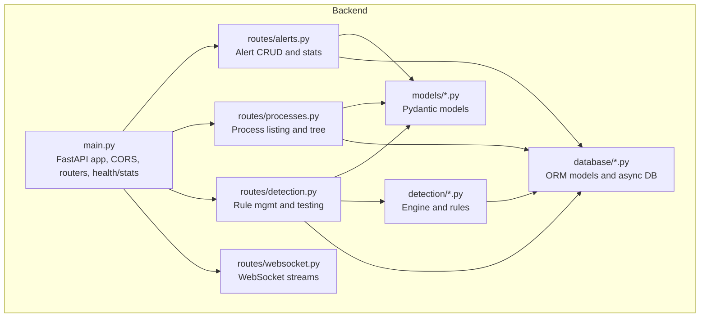
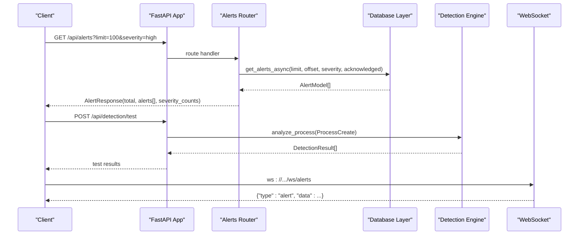
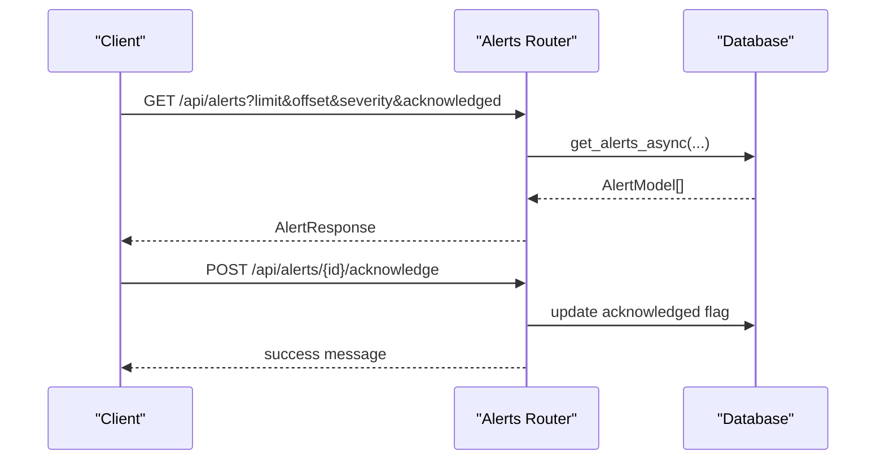
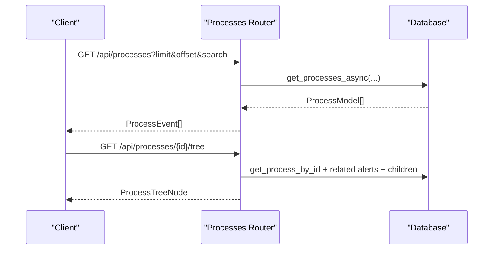
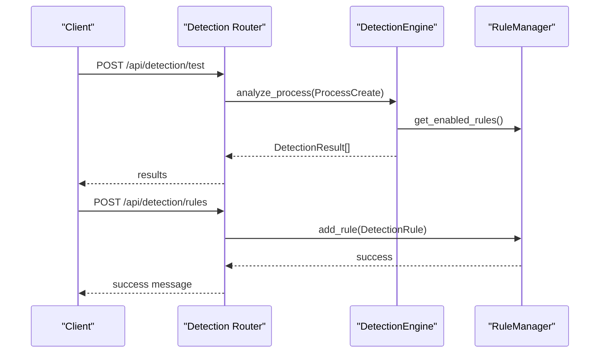
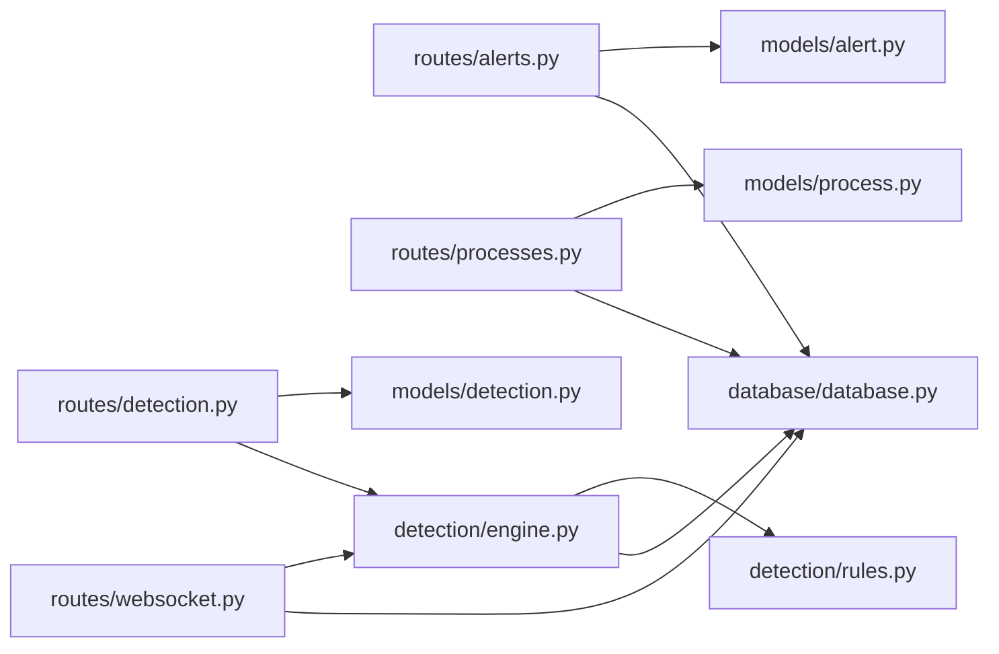

# REST API Endpoints

<cite>
**Referenced Files in This Document**
- [README.md](file://README.md)
- [backend/main.py](file://backend/main.py)
- [backend/routes/alerts.py](file://backend/routes/alerts.py)
- [backend/routes/processes.py](file://backend/routes/processes.py)
- [backend/routes/detection.py](file://backend/routes/detection.py)
- [backend/routes/websocket.py](file://backend/routes/websocket.py)
- [backend/models/alert.py](file://backend/models/alert.py)
- [backend/models/process.py](file://backend/models/process.py)
- [backend/models/detection.py](file://backend/models/detection.py)
- [backend/database/models.py](file://backend/database/models.py)
- [backend/database/database.py](file://backend/database/database.py)
- [backend/detection/engine.py](file://backend/detection/engine.py)
- [backend/detection/rules.py](file://backend/detection/rules.py)
</cite>

## Table of Contents
1. [Introduction](#introduction)
2. [Project Structure](#project-structure)
3. [Core Components](#core-components)
4. [Architecture Overview](#architecture-overview)
5. [Detailed Component Analysis](#detailed-component-analysis)
6. [Dependency Analysis](#dependency-analysis)
7. [Performance Considerations](#performance-considerations)
8. [Troubleshooting Guide](#troubleshooting-guide)
9. [Conclusion](#conclusion)
10. [Appendices](#appendices)

## Introduction
This document provides comprehensive REST API documentation for EDR Lite’s HTTP endpoints. It covers:
- Alert management endpoints (listing, filtering, acknowledging, deleting, and statistics)
- Process event listing and tree visualization
- Detection rule management (listing, creating, updating, enabling/disabling, deleting, testing, reloading, exporting/importing)
- Authentication, rate limiting, and API versioning
- Practical examples using curl and common HTTP clients
- Error handling strategies and common use cases

The API is implemented with FastAPI and exposes both REST endpoints and WebSocket streams for real-time updates.

## Project Structure
The backend is organized into modular components:
- Routes: REST endpoints grouped by domain (alerts, processes, detection, websocket)
- Models: Pydantic models for request/response schemas
- Database: SQLAlchemy ORM models and async database layer
- Detection: Detection engine and rule management
- Parser: Sysmon log parsing utilities
- Config: Rule configuration directory

**Diagram sources**
- [backend/main.py:171-192](file://backend/main.py#L171-L192)
- [backend/routes/alerts.py:15](file://backend/routes/alerts.py#L15)
- [backend/routes/processes.py:16](file://backend/routes/processes.py#L16)
- [backend/routes/detection.py:14](file://backend/routes/detection.py#L14)
- [backend/routes/websocket.py:14](file://backend/routes/websocket.py#L14)
- [backend/models/alert.py:1-55](file://backend/models/alert.py#L1-L55)
- [backend/models/process.py:1-44](file://backend/models/process.py#L1-L44)
- [backend/models/detection.py:1-92](file://backend/models/detection.py#L1-L92)
- [backend/database/models.py:1-77](file://backend/database/models.py#L1-L77)
- [backend/database/database.py:21-324](file://backend/database/database.py#L21-L324)
- [backend/detection/engine.py:64-324](file://backend/detection/engine.py#L64-L324)
- [backend/detection/rules.py:273-480](file://backend/detection/rules.py#L273-L480)

**Section sources**
- [README.md:31-51](file://README.md#L31-L51)
- [backend/main.py:171-192](file://backend/main.py#L171-L192)

## Core Components
- Alerts: Retrieve paginated alerts with severity and acknowledgment filters, get recent alerts, acknowledge/unacknowledge, bulk acknowledge, delete, and get statistics.
- Processes: List process events with search, get recent, get stats, get a specific process, get process tree, and delete.
- Detection: List rules (optionally enabled-only and by type), get a specific rule, create/update/delete rules, toggle rule state, test a process against rules, get detection stats, reload rules, export/import rules.
- Stats and Health: System stats endpoint and health check.
- Ingestion and Simulation: Manual ingestion of Sysmon events and batch simulation.
- WebSocket: Real-time alert and event streams.

**Section sources**
- [backend/routes/alerts.py:18-180](file://backend/routes/alerts.py#L18-L180)
- [backend/routes/processes.py:19-253](file://backend/routes/processes.py#L19-L253)
- [backend/routes/detection.py:44-256](file://backend/routes/detection.py#L44-L256)
- [backend/main.py:226-358](file://backend/main.py#L226-L358)
- [backend/routes/websocket.py:68-233](file://backend/routes/websocket.py#L68-L233)

## Architecture Overview
The API is served by a FastAPI application with:
- Routers mounted under /api/* and /ws/*
- Async database sessions via SQLAlchemy
- Detection engine for rule evaluation and alert creation
- WebSocket endpoints for live streaming

**Diagram sources**
- [backend/main.py:171-192](file://backend/main.py#L171-L192)
- [backend/routes/alerts.py:18-54](file://backend/routes/alerts.py#L18-L54)
- [backend/database/database.py:232-245](file://backend/database/database.py#L232-L245)
- [backend/detection/engine.py:84-119](file://backend/detection/engine.py#L84-L119)
- [backend/routes/websocket.py:68-119](file://backend/routes/websocket.py#L68-L119)

## Detailed Component Analysis

### Alerts API
Endpoints:
- GET /api/alerts
- GET /api/alerts/stats
- GET /api/alerts/recent
- GET /api/alerts/{alert_id}
- POST /api/alerts/{alert_id}/acknowledge
- POST /api/alerts/{alert_id}/unacknowledge
- DELETE /api/alerts/{alert_id}
- POST /api/alerts/bulk/acknowledge

Parameters:
- limit: integer, default 100, min 1, max 1000
- offset: integer, default 0, min 0
- severity: enum string, one of low, medium, high, critical
- acknowledged: boolean
- minutes: integer, default 60, min 1, max 1440
- alert_ids: array of integers for bulk acknowledge

Response schemas:
- AlertResponse: total (int), alerts (array of Alert), severity_counts (dict)
- Alert: id (int), process_id (int), rule_triggered (string), severity (enum), description (string), risk_score (int), timestamp (datetime), acknowledged (bool), details (optional dict)
- AlertStats: total_alerts (int), high_severity (int), medium_severity (int), low_severity (int), critical_severity (int), recent_alerts (array), alerts_by_hour (dict)

HTTP status codes:
- 200 OK for successful GET/POST/DELETE
- 404 Not Found when alert/process not found
- 400 Bad Request for invalid rule creation/update

Example requests:
- List alerts with pagination and severity filter
  - curl -X GET "http://localhost:8000/api/alerts?limit=100&offset=0&severity=high"
- Acknowledge an alert
  - curl -X POST "http://localhost:8000/api/alerts/1/acknowledge"
- Bulk acknowledge
  - curl -X POST "http://localhost:8000/api/alerts/bulk/acknowledge" -H "Content-Type: application/json" -d '{"alert_ids":[1,2,3]}'

**Diagram sources**
- [backend/routes/alerts.py:18-54](file://backend/routes/alerts.py#L18-L54)
- [backend/database/database.py:232-245](file://backend/database/database.py#L232-L245)

**Section sources**
- [backend/routes/alerts.py:18-180](file://backend/routes/alerts.py#L18-L180)
- [backend/models/alert.py:15-55](file://backend/models/alert.py#L15-L55)
- [backend/database/models.py:39-64](file://backend/database/models.py#L39-L64)

### Processes API
Endpoints:
- GET /api/processes
- GET /api/processes/recent
- GET /api/processes/stats
- GET /api/processes/{process_id}
- GET /api/processes/{process_id}/tree
- GET /api/processes/by-parent/{parent_name}
- DELETE /api/processes/{process_id}

Parameters:
- limit: integer, default 100, min 1, max 1000
- offset: integer, default 0, min 0
- search: string for process_name, parent_name, or command_line
- minutes: integer, default 5, min 1, max 1440
- parent_name: string path parameter

Response schemas:
- ProcessEvent: id (int), process_name (string), parent_name (string), command_line (string), process_id (int), parent_process_id (int), timestamp (datetime), user (optional string), computer (optional string), created_at (datetime)
- ProcessTreeNode: id (int), process_name (string), process_id (int), parent_process_id (int), command_line (string), timestamp (datetime), children (array), is_suspicious (bool), severity (optional string)

HTTP status codes:
- 200 OK for successful GET/DELETE
- 404 Not Found when process not found

Example requests:
- List processes with search and pagination
  - curl -X GET "http://localhost:8000/api/processes?limit=100&offset=0&search=cmd.exe"
- Get process tree
  - curl -X GET "http://localhost:8000/api/processes/1234/tree"

**Diagram sources**
- [backend/routes/processes.py:19-174](file://backend/routes/processes.py#L19-L174)
- [backend/database/database.py:139-153](file://backend/database/database.py#L139-L153)

**Section sources**
- [backend/routes/processes.py:19-253](file://backend/routes/processes.py#L19-L253)
- [backend/models/process.py:6-44](file://backend/models/process.py#L6-L44)
- [backend/database/models.py:9-36](file://backend/database/models.py#L9-L36)

### Detection Rules API
Endpoints:
- GET /api/detection/rules
- GET /api/detection/rules/{rule_id}
- POST /api/detection/rules
- PUT /api/detection/rules/{rule_id}
- POST /api/detection/rules/{rule_id}/toggle
- DELETE /api/detection/rules/{rule_id}
- GET /api/detection/rules/stats
- POST /api/detection/test
- GET /api/detection/stats
- POST /api/detection/reload
- POST /api/detection/export
- POST /api/detection/import

Parameters:
- enabled_only: boolean, default false
- rule_type: string enum, one of parent_child, command_line, frequency, behavior, anomaly
- TestProcessRequest: process_name, parent_name, command_line, process_id, parent_process_id
- RuleToggleRequest: enabled (boolean)
- file_path: string body parameter for export/import

Request/response schemas:
- DetectionRule: id (optional), name (string), rule_type (enum), description (string), severity (string), enabled (boolean), parent_process (optional), child_process (optional), command_line_pattern (optional), command_line_contains (optional array), max_events_per_minute (optional), time_window_minutes (default 1), risk_score (int), compiled patterns internally
- DetectionResult: is_threat (bool), rule (optional DetectionRule), confidence (float), risk_score (int), details (dict), timestamp (datetime)
- RuleType: enum with values parent_child, command_line, frequency, behavior, anomaly

HTTP status codes:
- 200 OK for successful operations
- 404 Not Found when rule not found
- 400 Bad Request for invalid rule creation/update

Example requests:
- Create a rule
  - curl -X POST "http://localhost:8000/api/detection/rules" -H "Content-Type: application/json" -d '{...}'
- Toggle a rule
  - curl -X POST "http://localhost:8000/api/detection/rules/RULE-001/toggle" -H "Content-Type: application/json" -d '{"enabled":true}'
- Test a process
  - curl -X POST "http://localhost:8000/api/detection/test" -H "Content-Type: application/json" -d '{"process_name":"cmd.exe","parent_name":"outlook.exe","command_line":"..."}'

**Diagram sources**
- [backend/routes/detection.py:168-211](file://backend/routes/detection.py#L168-L211)
- [backend/detection/engine.py:84-119](file://backend/detection/engine.py#L84-L119)
- [backend/detection/rules.py:355-375](file://backend/detection/rules.py#L355-L375)

**Section sources**
- [backend/routes/detection.py:44-256](file://backend/routes/detection.py#L44-L256)
- [backend/models/detection.py:17-92](file://backend/models/detection.py#L17-L92)
- [backend/detection/engine.py:64-324](file://backend/detection/engine.py#L64-L324)
- [backend/detection/rules.py:273-480](file://backend/detection/rules.py#L273-L480)

### System and Ingestion APIs
Endpoints:
- GET /api/stats
- GET /health
- POST /api/ingest
- POST /api/simulate/batch
- POST /api/simulation/toggle

Behavior:
- /api/stats returns engine and rule statistics plus simulation mode status
- /health returns service health and component statuses
- /api/ingest accepts a Sysmon event payload and triggers detection
- /api/simulate/batch generates and ingests multiple simulated events
- /api/simulation/toggle enables/disables simulation mode

Example requests:
- Get system stats
  - curl -X GET "http://localhost:8000/api/stats"
- Ingest a Sysmon event
  - curl -X POST "http://localhost:8000/api/ingest" -H "Content-Type: application/json" -d @sample_data/sample_sysmon_events.json
- Toggle simulation
  - curl -X POST "http://localhost:8000/api/simulation/toggle" -H "Content-Type: application/json" -d '{"enabled":true}'

**Section sources**
- [backend/main.py:226-358](file://backend/main.py#L226-L358)

### WebSocket Streams
Endpoints:
- ws://host:port/ws/alerts
- ws://host:port/ws/events

Features:
- Real-time broadcasting of alerts and process events
- Heartbeat messages
- Client can subscribe and request stats

Example usage:
- Connect to alerts stream and listen for new alerts
- Send ping/subscribe/get_stats messages to control the stream

**Section sources**
- [backend/routes/websocket.py:68-233](file://backend/routes/websocket.py#L68-L233)

## Dependency Analysis
Key dependencies and relationships:
- Routes depend on Pydantic models for request/response validation
- Routes use async database sessions from the Database layer
- Detection router depends on DetectionEngine and RuleManager
- DetectionEngine depends on RuleManager and Database
- WebSocket routes broadcast to connected clients

**Diagram sources**
- [backend/routes/alerts.py:13-14](file://backend/routes/alerts.py#L13-L14)
- [backend/routes/processes.py:13-14](file://backend/routes/processes.py#L13-L14)
- [backend/routes/detection.py:11-12](file://backend/routes/detection.py#L11-L12)
- [backend/models/alert.py:1-55](file://backend/models/alert.py#L1-L55)
- [backend/models/process.py:1-44](file://backend/models/process.py#L1-L44)
- [backend/models/detection.py:1-92](file://backend/models/detection.py#L1-L92)
- [backend/database/database.py:21-324](file://backend/database/database.py#L21-L324)
- [backend/detection/engine.py:64-324](file://backend/detection/engine.py#L64-L324)
- [backend/detection/rules.py:273-480](file://backend/detection/rules.py#L273-L480)
- [backend/routes/websocket.py:68-233](file://backend/routes/websocket.py#L68-L233)

**Section sources**
- [backend/main.py:37-41](file://backend/main.py#L37-L41)
- [backend/routes/alerts.py:13-14](file://backend/routes/alerts.py#L13-L14)
- [backend/routes/processes.py:13-14](file://backend/routes/processes.py#L13-L14)
- [backend/routes/detection.py:11-12](file://backend/routes/detection.py#L11-L12)

## Performance Considerations
- Pagination limits: All list endpoints enforce reasonable bounds (limit 1–1000) to prevent heavy queries.
- Asynchronous database access: Routes use async sessions to improve concurrency.
- Frequency tracking: DetectionEngine maintains a sliding window counter for anomaly detection.
- Rule compilation: Patterns are compiled once per rule to optimize matching.
- WebSocket broadcasting: Efficient broadcast to all connected clients with cleanup on errors.

[No sources needed since this section provides general guidance]

## Troubleshooting Guide
Common issues and resolutions:
- 404 Not Found
  - Occurs when accessing non-existent alert/process IDs. Verify IDs and retry.
- 400 Bad Request
  - Validation errors for rule creation/update. Ensure DetectionRule fields conform to schema.
- WebSocket disconnections
  - Heartbeats keep connections alive; reconnect automatically. Check server logs for errors.
- Slow queries
  - Reduce limit and use filters (severity, acknowledged, search). Use recent endpoints for time-bound queries.
- Simulation mode
  - Toggle simulation off/on via /api/simulation/toggle if unexpected events appear.

**Section sources**
- [backend/routes/alerts.py:97-101](file://backend/routes/alerts.py#L97-L101)
- [backend/routes/processes.py:121-125](file://backend/routes/processes.py#L121-L125)
- [backend/routes/detection.py:107-110](file://backend/routes/detection.py#L107-L110)
- [backend/routes/websocket.py:114-118](file://backend/routes/websocket.py#L114-L118)

## Conclusion
EDR Lite provides a comprehensive REST API for alert and process management, detection rule lifecycle, and real-time streaming. The API leverages FastAPI, async database access, and a robust detection engine to support monitoring and rule management workflows. Use the provided endpoints and examples to integrate with dashboards, automation scripts, and external systems.

[No sources needed since this section summarizes without analyzing specific files]

## Appendices

### Authentication and Authorization
- No authentication middleware is configured in the application. For production deployments, add authentication/authorization as needed.

**Section sources**
- [backend/main.py:179-186](file://backend/main.py#L179-L186)

### Rate Limiting
- No rate limiting is implemented. Consider integrating a rate-limiting middleware for production environments.

[No sources needed since this section provides general guidance]

### API Versioning
- The application sets a version field in the FastAPI metadata. No explicit versioned URL routing is used; future versions can adopt path-based or header-based versioning.

**Section sources**
- [backend/main.py:172-177](file://backend/main.py#L172-L177)

### Example Workflows

- Alert monitoring
  - Poll /api/alerts with limit/offset/severity filters
  - Acknowledge alerts via /api/alerts/{id}/acknowledge
  - Monitor real-time alerts via ws://host:port/ws/alerts

- Process analysis
  - Search recent processes with /api/processes/recent
  - Get process tree for a suspicious PID via /api/processes/{id}/tree
  - Export rules for backup via /api/detection/export

- Detection rule management
  - Create a rule via /api/detection/rules
  - Test a process against rules via /api/detection/test
  - Reload rules via /api/detection/reload

**Section sources**
- [README.md:224-253](file://README.md#L224-L253)
- [backend/routes/alerts.py:18-54](file://backend/routes/alerts.py#L18-L54)
- [backend/routes/processes.py:128-174](file://backend/routes/processes.py#L128-L174)
- [backend/routes/detection.py:86-125](file://backend/routes/detection.py#L86-L125)