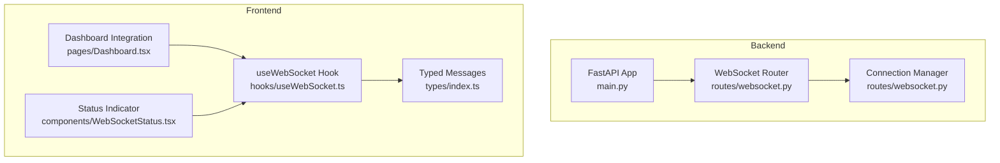
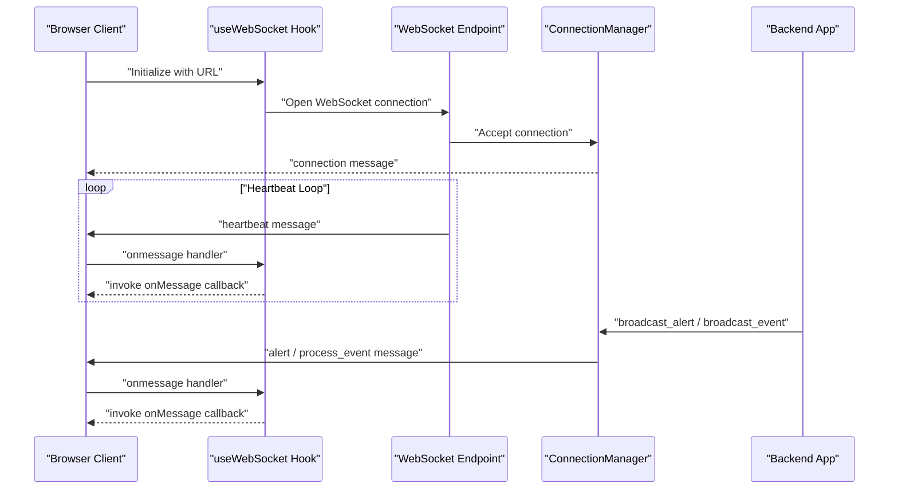
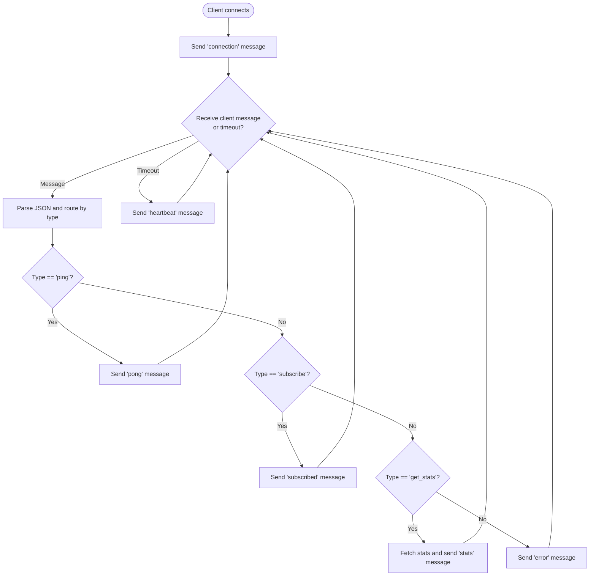
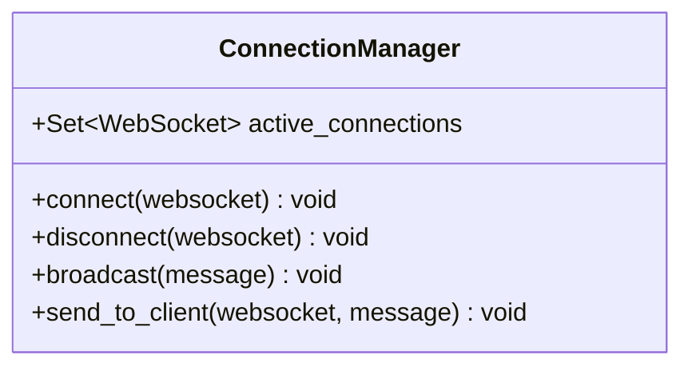
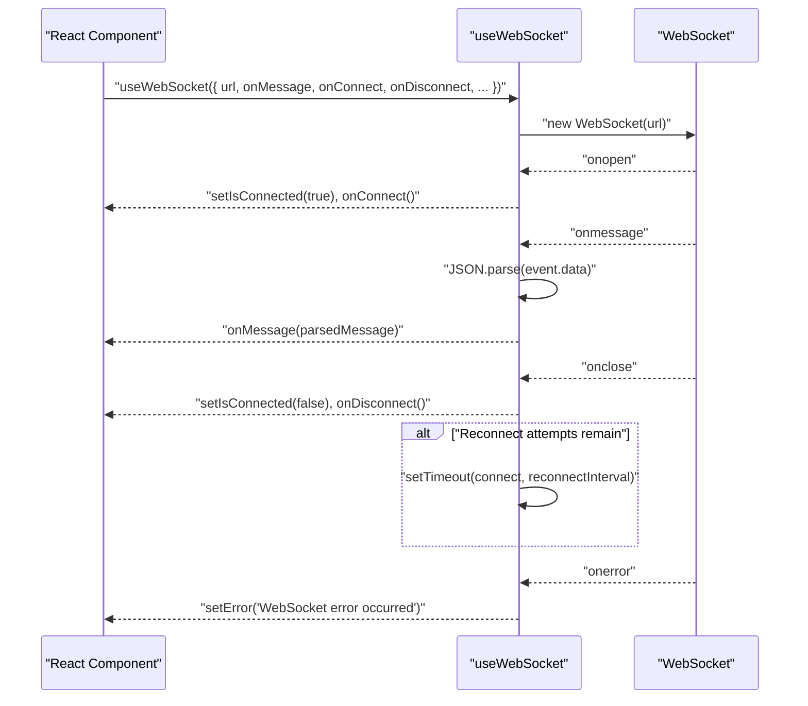
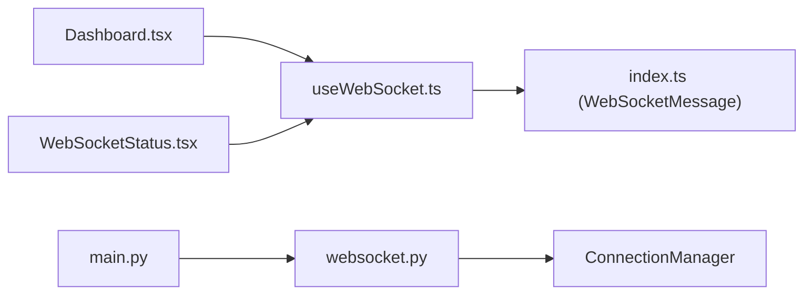

# WebSocket API

<cite>
**Referenced Files in This Document**
- [websocket.py](file://backend/routes/websocket.py)
- [main.py](file://backend/main.py)
- [useWebSocket.ts](file://frontend/src/hooks/useWebSocket.ts)
- [index.ts](file://frontend/src/types/index.ts)
- [Dashboard.tsx](file://frontend/src/pages/Dashboard.tsx)
- [WebSocketStatus.tsx](file://frontend/src/components/WebSocketStatus.tsx)
- [client.ts](file://frontend/src/api/client.ts)
- [README.md](file://README.md)
</cite>

## Table of Contents
1. [Introduction](#introduction)
2. [Project Structure](#project-structure)
3. [Core Components](#core-components)
4. [Architecture Overview](#architecture-overview)
5. [Detailed Component Analysis](#detailed-component-analysis)
6. [Dependency Analysis](#dependency-analysis)
7. [Performance Considerations](#performance-considerations)
8. [Troubleshooting Guide](#troubleshooting-guide)
9. [Conclusion](#conclusion)
10. [Appendices](#appendices)

## Introduction
This document describes the WebSocket API used by EDR Lite for real-time communication. It covers connection establishment, message protocols, event streaming patterns for live alert updates and process event notifications, and client-side integration using the provided useWebSocket hook. It also documents message formats for different event types, connection lifecycle management, heartbeat mechanisms, automatic reconnection strategies, and practical examples for JavaScript clients.

## Project Structure
The WebSocket API spans both backend and frontend components:
- Backend: FastAPI WebSocket endpoints and a connection manager
- Frontend: A reusable React hook for WebSocket integration and typed message handling

**Diagram sources**
- [main.py:172-192](file://backend/main.py#L172-L192)
- [websocket.py:14-65](file://backend/routes/websocket.py#L14-L65)
- [useWebSocket.ts:13-103](file://frontend/src/hooks/useWebSocket.ts#L13-L103)
- [index.ts:78-83](file://frontend/src/types/index.ts#L78-L83)
- [Dashboard.tsx:54-58](file://frontend/src/pages/Dashboard.tsx#L54-L58)
- [WebSocketStatus.tsx:4-7](file://frontend/src/components/WebSocketStatus.tsx#L4-L7)

**Section sources**
- [README.md:138-141](file://README.md#L138-L141)
- [main.py:172-192](file://backend/main.py#L172-L192)
- [websocket.py:14-65](file://backend/routes/websocket.py#L14-L65)
- [useWebSocket.ts:13-103](file://frontend/src/hooks/useWebSocket.ts#L13-L103)
- [index.ts:78-83](file://frontend/src/types/index.ts#L78-L83)
- [Dashboard.tsx:54-58](file://frontend/src/pages/Dashboard.tsx#L54-L58)
- [WebSocketStatus.tsx:4-7](file://frontend/src/components/WebSocketStatus.tsx#L4-L7)

## Core Components
- Backend WebSocket endpoints:
  - Alerts stream: ws://host/ws/alerts
  - Events stream: ws://host/ws/events
- Connection manager handles broadcasting and per-client messaging.
- Frontend useWebSocket hook manages connection lifecycle, reconnection, and message parsing.

Key responsibilities:
- Establish WebSocket connections and maintain them.
- Stream real-time alert and process event updates.
- Handle client-initiated messages (ping, subscribe, get_stats).
- Send periodic heartbeat messages to keep connections alive.

**Section sources**
- [websocket.py:68-166](file://backend/routes/websocket.py#L68-L166)
- [websocket.py:169-207](file://backend/routes/websocket.py#L169-L207)
- [useWebSocket.ts:27-94](file://frontend/src/hooks/useWebSocket.ts#L27-L94)

## Architecture Overview
The WebSocket subsystem integrates with the FastAPI application and React frontend:

**Diagram sources**
- [useWebSocket.ts:27-94](file://frontend/src/hooks/useWebSocket.ts#L27-L94)
- [websocket.py:68-166](file://backend/routes/websocket.py#L68-L166)
- [websocket.py:21-62](file://backend/routes/websocket.py#L21-L62)

## Detailed Component Analysis

### Backend WebSocket Endpoints
Endpoints:
- /ws/alerts: Streams live alerts and heartbeats; supports client messages.
- /ws/events: Streams live process events and heartbeats; supports client messages.

Connection lifecycle:
- Accept new connections and register them in the connection manager.
- Send an initial connection confirmation upon successful accept.
- Maintain a heartbeat loop by sending periodic heartbeat messages when no client messages are received within a timeout.
- Gracefully handle disconnections and cleanup.

Client-to-server message handling:
- ping: Responds with a pong message.
- subscribe: Acknowledges subscription to a channel.
- get_stats: Requests current system statistics; responds with stats message.

Server-to-client message types:
- connection: Initial confirmation with status and timestamp.
- alert: Live alert broadcast with alert data.
- process_event: Live process event broadcast with process data.
- heartbeat: Periodic keep-alive message with timestamp.
- stats_update: Periodic system statistics broadcast.
- error: Error responses for malformed or unsupported messages.

**Diagram sources**
- [websocket.py:68-166](file://backend/routes/websocket.py#L68-L166)
- [websocket.py:169-207](file://backend/routes/websocket.py#L169-L207)

**Section sources**
- [websocket.py:68-166](file://backend/routes/websocket.py#L68-L166)
- [websocket.py:169-207](file://backend/routes/websocket.py#L169-L207)

### Connection Manager
Responsibilities:
- Maintain a set of active connections.
- Broadcast messages to all clients.
- Send messages to a specific client.
- Clean up disconnected clients.

**Diagram sources**
- [websocket.py:21-62](file://backend/routes/websocket.py#L21-L62)

**Section sources**
- [websocket.py:21-62](file://backend/routes/websocket.py#L21-L62)

### Frontend useWebSocket Hook
Purpose:
- Manage WebSocket lifecycle: connect, disconnect, reconnect.
- Parse incoming messages and forward to caller-provided callbacks.
- Provide connection state and error reporting.

Key behaviors:
- Auto-detect protocol (ws/wss) and construct URL.
- Track connection state and attempt reconnection with configurable delay and attempts.
- Send messages safely only when the socket is open.
- Parse JSON messages and forward to onMessage callback.

**Diagram sources**
- [useWebSocket.ts:27-94](file://frontend/src/hooks/useWebSocket.ts#L27-L94)

**Section sources**
- [useWebSocket.ts:13-103](file://frontend/src/hooks/useWebSocket.ts#L13-L103)

### Message Types and Formats
Common fields:
- type: String indicating message category.
- timestamp: ISO 8601 UTC timestamp.
- message: Optional human-readable message for informational/error responses.

Specific message categories:
- connection
  - Purpose: Initial confirmation after connection.
  - Fields: type, status, timestamp, message.
- alert
  - Purpose: Live alert broadcast.
  - Fields: type, data (alert payload), timestamp.
- process_event
  - Purpose: Live process event broadcast.
  - Fields: type, data (process payload), timestamp.
- heartbeat
  - Purpose: Keep-alive signal.
  - Fields: type, timestamp.
- stats_update
  - Purpose: Periodic system statistics broadcast.
  - Fields: type, data (stats payload), timestamp.
- error
  - Purpose: Error response to client messages.
  - Fields: type, message.
- ping/pong
  - Purpose: Client/server liveness check.
  - Fields: type, timestamp.
- subscribed
  - Purpose: Acknowledgement of subscription request.
  - Fields: type, channel, timestamp.
- stats
  - Purpose: Response to get_stats request.
  - Fields: type, data (stats payload), timestamp.

Note: The data payload for alert and process_event corresponds to the backend models used for ingestion and storage.

**Section sources**
- [websocket.py:80-86](file://backend/routes/websocket.py#L80-L86)
- [websocket.py:108-112](file://backend/routes/websocket.py#L108-L112)
- [websocket.py:132-138](file://backend/routes/websocket.py#L132-L138)
- [websocket.py:156-160](file://backend/routes/websocket.py#L156-L160)
- [websocket.py:169-207](file://backend/routes/websocket.py#L169-L207)
- [index.ts:78-83](file://frontend/src/types/index.ts#L78-L83)

### Client-Side Integration Patterns
- Basic integration in Dashboard:
  - Initialize useWebSocket with the alerts endpoint.
  - Handle incoming alert and process_event messages to update UI state.
- Status indicator:
  - Use the hook’s isConnected flag to reflect live status.
- Manual message handling:
  - Send ping to verify liveness.
  - Request stats periodically via get_stats.

Example integration points:
- Dashboard page sets up onMessage to prepend new alerts and processes.
- WebSocketStatus component reads isConnected to render live/offline state.

**Section sources**
- [Dashboard.tsx:54-58](file://frontend/src/pages/Dashboard.tsx#L54-L58)
- [Dashboard.tsx:46-52](file://frontend/src/pages/Dashboard.tsx#L46-L52)
- [WebSocketStatus.tsx:4-7](file://frontend/src/components/WebSocketStatus.tsx#L4-L7)

## Dependency Analysis
- Backend depends on FastAPI for routing and WebSocket support.
- ConnectionManager encapsulates connection state and broadcasting.
- Frontend hook depends on browser WebSocket API and React hooks.
- Dashboard and status components depend on the hook for connection state.

**Diagram sources**
- [useWebSocket.ts:13-103](file://frontend/src/hooks/useWebSocket.ts#L13-L103)
- [index.ts:78-83](file://frontend/src/types/index.ts#L78-L83)
- [Dashboard.tsx:54-58](file://frontend/src/pages/Dashboard.tsx#L54-L58)
- [WebSocketStatus.tsx:4-7](file://frontend/src/components/WebSocketStatus.tsx#L4-L7)
- [websocket.py:21-62](file://backend/routes/websocket.py#L21-L62)
- [main.py:172-192](file://backend/main.py#L172-L192)

**Section sources**
- [useWebSocket.ts:13-103](file://frontend/src/hooks/useWebSocket.ts#L13-L103)
- [index.ts:78-83](file://frontend/src/types/index.ts#L78-L83)
- [Dashboard.tsx:54-58](file://frontend/src/pages/Dashboard.tsx#L54-L58)
- [WebSocketStatus.tsx:4-7](file://frontend/src/components/WebSocketStatus.tsx#L4-L7)
- [websocket.py:21-62](file://backend/routes/websocket.py#L21-L62)
- [main.py:172-192](file://backend/main.py#L172-L192)

## Performance Considerations
- Connection limits:
  - There is no explicit connection limit enforced in the code. Production deployments should consider infrastructure capacity and resource limits.
- Heartbeat cadence:
  - Heartbeat is sent on a 30-second timeout; adjust client-side polling accordingly to avoid unnecessary overhead.
- Broadcasting:
  - Broadcasting to all clients occurs synchronously; large numbers of clients may increase latency. Consider rate-limiting or sharding for high scale.
- Message volume:
  - Live streams can be high-frequency. Clients should efficiently render updates and cap the number of displayed items.
- Reconnection strategy:
  - The hook retries with a configurable interval and maximum attempts. Tune these values for your deployment environment.

[No sources needed since this section provides general guidance]

## Troubleshooting Guide
Common issues and remedies:
- Connection fails immediately:
  - Verify URL construction and CORS configuration. The hook auto-detects ws/wss based on the current page protocol.
- Frequent reconnections:
  - Adjust reconnectInterval and reconnectAttempts to match network conditions.
- No messages received:
  - Ensure onMessage callback is provided and properly handles parsed messages.
  - Confirm the endpoint is correct (/ws/alerts or /ws/events).
- Heartbeat errors:
  - Heartbeats are sent by the server; if clients do not receive them, inspect network connectivity and timeouts.
- Error messages:
  - The server responds with error messages for invalid JSON or unknown message types. Validate client messages and ensure correct field types.

Debugging tips:
- Inspect browser developer tools Network tab for WebSocket frames.
- Log parsed messages in onMessage to confirm message types and payloads.
- Use the built-in dashboard to validate live streaming.

**Section sources**
- [useWebSocket.ts:27-94](file://frontend/src/hooks/useWebSocket.ts#L27-L94)
- [websocket.py:68-166](file://backend/routes/websocket.py#L68-L166)
- [websocket.py:169-207](file://backend/routes/websocket.py#L169-L207)

## Conclusion
EDR Lite’s WebSocket API provides a straightforward, reliable mechanism for real-time alert and process event streaming. The backend endpoints and connection manager offer robust broadcasting and keep-alive behavior, while the frontend useWebSocket hook simplifies client integration with automatic reconnection and typed message handling. By following the message formats and lifecycle patterns documented here, developers can integrate live dashboards and external monitoring systems effectively.

[No sources needed since this section summarizes without analyzing specific files]

## Appendices

### WebSocket Endpoints
- Alerts stream: ws://host/ws/alerts
- Events stream: ws://host/ws/events

**Section sources**
- [README.md:138-141](file://README.md#L138-L141)

### Client Implementation Examples
- Basic React integration:
  - Use the hook with url pointing to /ws/alerts or /ws/events.
  - Provide onMessage to handle alert and process_event messages.
  - Use isConnected to reflect live status.
- Manual message sending:
  - Use sendMessage to send ping, subscribe, or get_stats messages.

**Section sources**
- [Dashboard.tsx:54-58](file://frontend/src/pages/Dashboard.tsx#L54-L58)
- [WebSocketStatus.tsx:4-7](file://frontend/src/components/WebSocketStatus.tsx#L4-L7)
- [useWebSocket.ts:83-89](file://frontend/src/hooks/useWebSocket.ts#L83-L89)

### Message Format Reference
- Common fields: type, timestamp, message (optional).
- Server-to-client:
  - connection, alert, process_event, heartbeat, stats_update, error.
- Client-to-server:
  - ping, subscribe, get_stats.

**Section sources**
- [websocket.py:68-166](file://backend/routes/websocket.py#L68-L166)
- [websocket.py:169-207](file://backend/routes/websocket.py#L169-L207)
- [index.ts:78-83](file://frontend/src/types/index.ts#L78-L83)