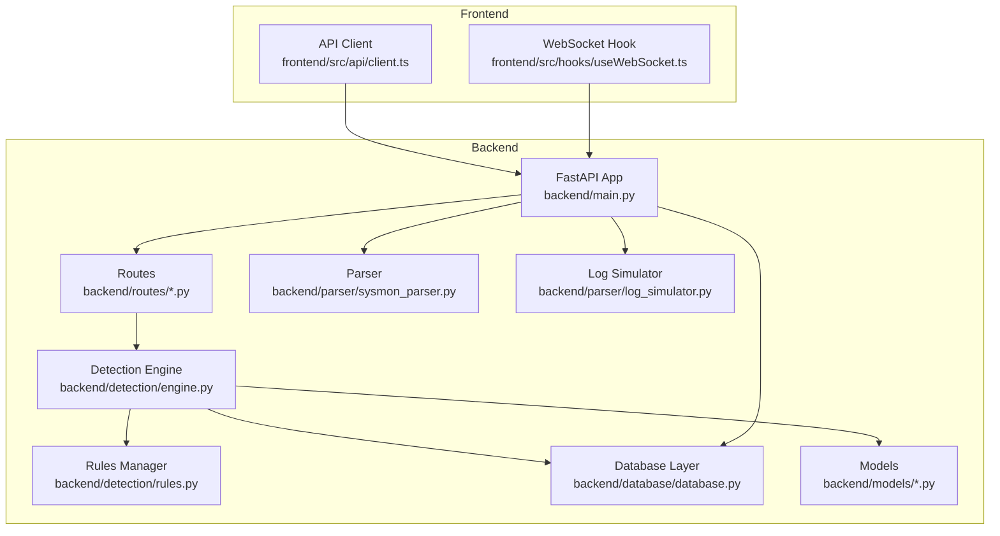
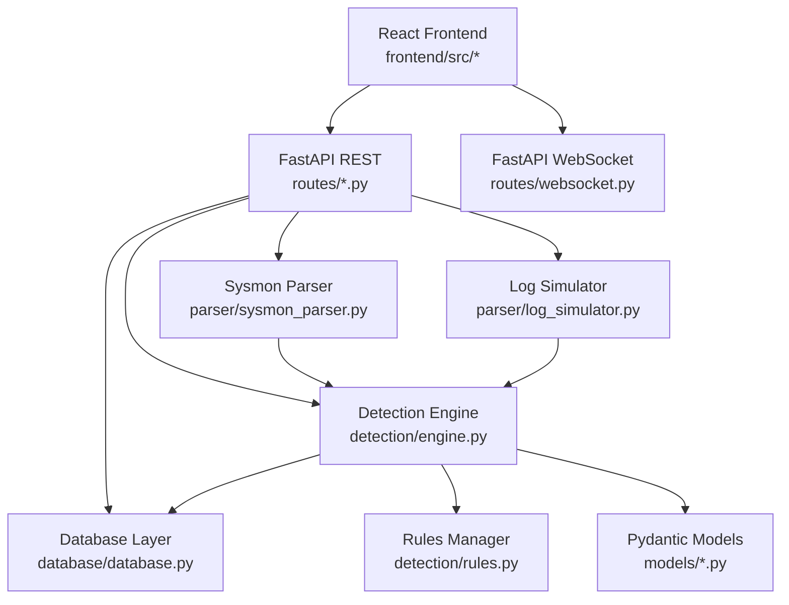
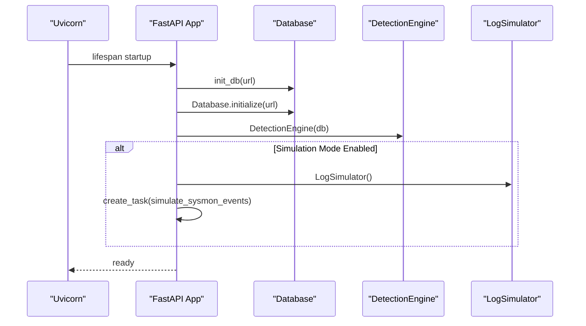
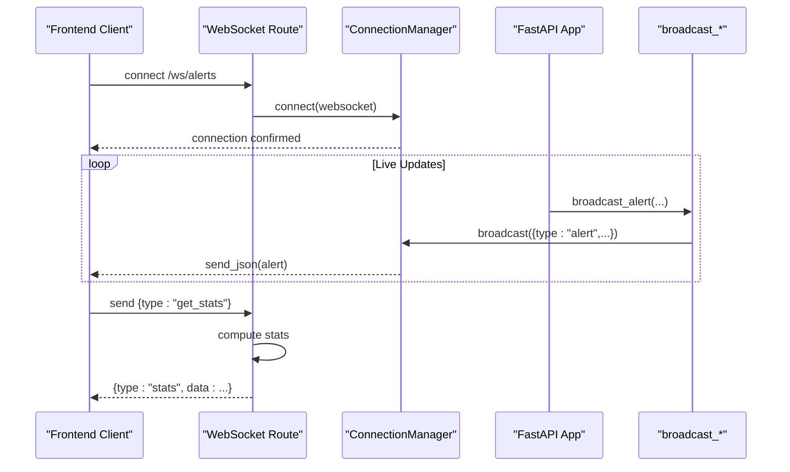
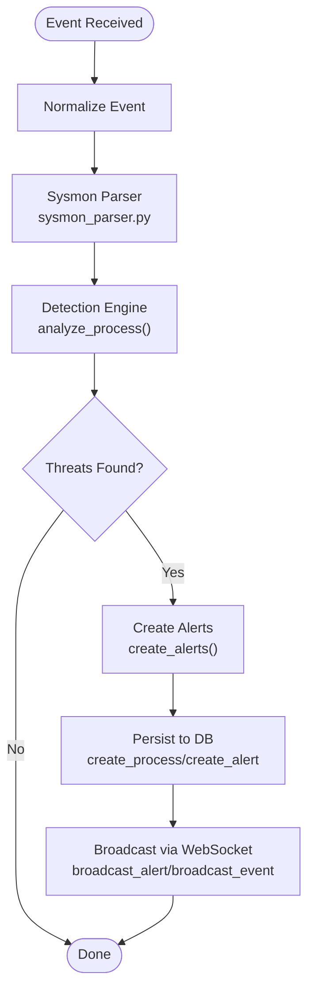
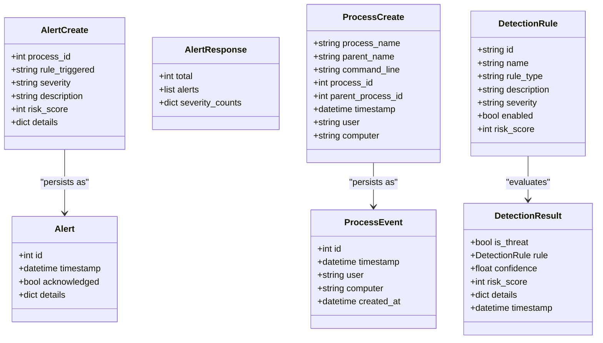
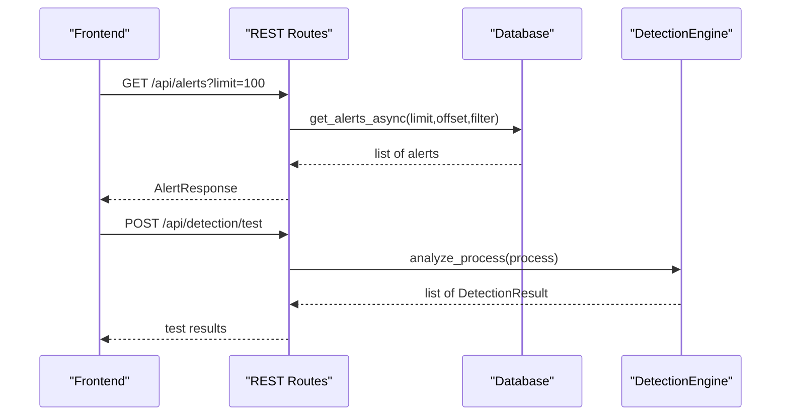
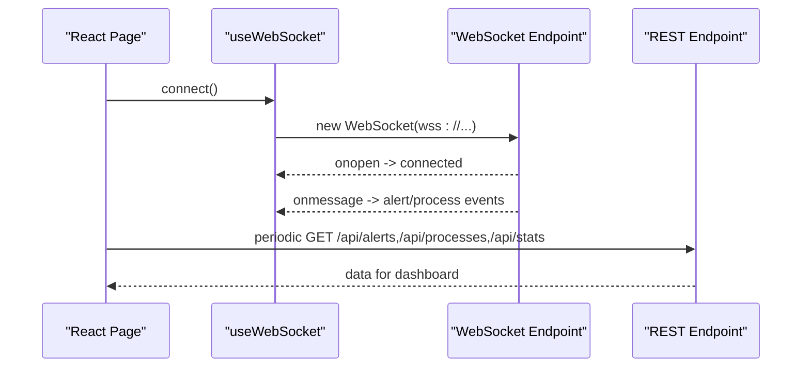
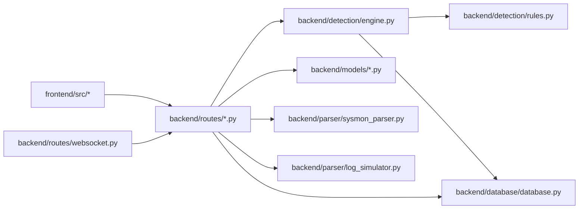

# Architecture Overview

<cite>
**Referenced Files in This Document**
- [backend/main.py](file://backend/main.py)
- [backend/database/database.py](file://backend/database/database.py)
- [backend/detection/engine.py](file://backend/detection/engine.py)
- [backend/detection/rules.py](file://backend/detection/rules.py)
- [backend/parser/sysmon_parser.py](file://backend/parser/sysmon_parser.py)
- [backend/parser/log_simulator.py](file://backend/parser/log_simulator.py)
- [backend/routes/websocket.py](file://backend/routes/websocket.py)
- [backend/routes/alerts.py](file://backend/routes/alerts.py)
- [backend/routes/processes.py](file://backend/routes/processes.py)
- [backend/routes/detection.py](file://backend/routes/detection.py)
- [backend/models/alert.py](file://backend/models/alert.py)
- [backend/models/process.py](file://backend/models/process.py)
- [backend/models/detection.py](file://backend/models/detection.py)
- [frontend/src/api/client.ts](file://frontend/src/api/client.ts)
- [frontend/src/hooks/useWebSocket.ts](file://frontend/src/hooks/useWebSocket.ts)
- [sample_data/sample_sysmon_events.json](file://sample_data/sample_sysmon_events.json)
</cite>

## Table of Contents
1. [Introduction](#introduction)
2. [Project Structure](#project-structure)
3. [Core Components](#core-components)
4. [Architecture Overview](#architecture-overview)
5. [Detailed Component Analysis](#detailed-component-analysis)
6. [Dependency Analysis](#dependency-analysis)
7. [Performance Considerations](#performance-considerations)
8. [Troubleshooting Guide](#troubleshooting-guide)
9. [Conclusion](#conclusion)
10. [Appendices](#appendices)

## Introduction
This document describes the architecture and component interactions of EDR Lite, a lightweight Endpoint Detection and Response system. The backend is a FastAPI application that ingests Sysmon process creation events, parses them, applies detection rules, stores results in a database, and streams real-time updates via WebSockets. The frontend is a React application that consumes REST APIs and WebSocket streams to present live dashboards.

Key technical decisions:
- SQLite database for simplicity and zero-dependency deployment
- JSON-based detection rules for flexibility and easy authoring
- WebSocket endpoints for live alert and event streaming
- Simulated ingestion for demonstration and testing

## Project Structure
The repository follows a layered backend with a separate frontend directory. The backend is organized by domain capabilities: database, detection, parser, routes, and models. The frontend uses Vite and TypeScript with Axios for API calls and a custom WebSocket hook.

**Diagram sources**
- [backend/main.py:171-192](file://backend/main.py#L171-L192)
- [backend/routes/alerts.py:18-54](file://backend/routes/alerts.py#L18-L54)
- [backend/routes/processes.py:19-42](file://backend/routes/processes.py#L19-L42)
- [backend/routes/detection.py:44-71](file://backend/routes/detection.py#L44-L71)
- [backend/detection/engine.py:64-82](file://backend/detection/engine.py#L64-L82)
- [backend/detection/rules.py:273-313](file://backend/detection/rules.py#L273-L313)
- [backend/database/database.py:21-70](file://backend/database/database.py#L21-L70)
- [backend/models/alert.py:15-38](file://backend/models/alert.py#L15-L38)
- [backend/models/process.py:6-31](file://backend/models/process.py#L6-L31)
- [backend/models/detection.py:17-92](file://backend/models/detection.py#L17-L92)
- [backend/parser/sysmon_parser.py:61-95](file://backend/parser/sysmon_parser.py#L61-L95)
- [backend/parser/log_simulator.py:18-37](file://backend/parser/log_simulator.py#L18-L37)
- [frontend/src/api/client.ts:13-124](file://frontend/src/api/client.ts#L13-L124)
- [frontend/src/hooks/useWebSocket.ts:13-103](file://frontend/src/hooks/useWebSocket.ts#L13-L103)

**Section sources**
- [backend/main.py:171-192](file://backend/main.py#L171-L192)
- [backend/database/database.py:21-70](file://backend/database/database.py#L21-L70)
- [backend/detection/engine.py:64-82](file://backend/detection/engine.py#L64-L82)
- [backend/detection/rules.py:273-313](file://backend/detection/rules.py#L273-L313)
- [backend/parser/sysmon_parser.py:61-95](file://backend/parser/sysmon_parser.py#L61-L95)
- [backend/parser/log_simulator.py:18-37](file://backend/parser/log_simulator.py#L18-L37)
- [frontend/src/api/client.ts:13-124](file://frontend/src/api/client.ts#L13-L124)
- [frontend/src/hooks/useWebSocket.ts:13-103](file://frontend/src/hooks/useWebSocket.ts#L13-L103)

## Core Components
- FastAPI Application: Orchestrates startup/shutdown, mounts routers, exposes health and stats endpoints, and serves the dashboard page.
- Database Layer: Provides synchronous and asynchronous SQLAlchemy sessions, table creation, CRUD operations for alerts and processes, and statistics aggregation.
- Detection Engine: Evaluates incoming process events against detection rules, tracks frequency anomalies, and generates alerts.
- Rules Manager: Loads default and custom JSON rules, compiles patterns, and supports CRUD operations for rules.
- Parser: Parses Sysmon events from EVTX, XML, and JSON formats, normalizing to a unified event model.
- Log Simulator: Generates synthetic Sysmon events for testing and demonstration.
- WebSocket Routes: Manages real-time broadcasting of alerts and process events to connected clients.
- REST Routes: Provide APIs for alerts, processes, detection rules, and system operations.
- Frontend API Client and WebSocket Hook: Encapsulate HTTP and WebSocket interactions for the React UI.

**Section sources**
- [backend/main.py:120-169](file://backend/main.py#L120-L169)
- [backend/database/database.py:21-324](file://backend/database/database.py#L21-L324)
- [backend/detection/engine.py:64-324](file://backend/detection/engine.py#L64-L324)
- [backend/detection/rules.py:273-480](file://backend/detection/rules.py#L273-L480)
- [backend/parser/sysmon_parser.py:61-385](file://backend/parser/sysmon_parser.py#L61-L385)
- [backend/parser/log_simulator.py:18-315](file://backend/parser/log_simulator.py#L18-L315)
- [backend/routes/websocket.py:21-233](file://backend/routes/websocket.py#L21-L233)
- [backend/routes/alerts.py:18-180](file://backend/routes/alerts.py#L18-L180)
- [backend/routes/processes.py:19-253](file://backend/routes/processes.py#L19-L253)
- [backend/routes/detection.py:44-256](file://backend/routes/detection.py#L44-L256)
- [frontend/src/api/client.ts:13-124](file://frontend/src/api/client.ts#L13-L124)
- [frontend/src/hooks/useWebSocket.ts:13-103](file://frontend/src/hooks/useWebSocket.ts#L13-L103)

## Architecture Overview
The system follows a layered architecture:
- Presentation Layer: FastAPI routes expose REST endpoints and serve the dashboard. WebSocket endpoints stream live data.
- Application Layer: Detection engine coordinates rule evaluation, alert creation, and statistics.
- Persistence Layer: Database layer abstracts SQLite access with synchronous and asynchronous sessions.
- Data Ingestion: Parser normalizes Sysmon events; simulator provides synthetic events for testing.

**Diagram sources**
- [backend/main.py:171-192](file://backend/main.py#L171-L192)
- [backend/routes/websocket.py:68-166](file://backend/routes/websocket.py#L68-L166)
- [backend/routes/alerts.py:18-54](file://backend/routes/alerts.py#L18-L54)
- [backend/routes/processes.py:19-42](file://backend/routes/processes.py#L19-L42)
- [backend/routes/detection.py:44-71](file://backend/routes/detection.py#L44-L71)
- [backend/detection/engine.py:64-82](file://backend/detection/engine.py#L64-L82)
- [backend/detection/rules.py:273-313](file://backend/detection/rules.py#L273-L313)
- [backend/database/database.py:21-70](file://backend/database/database.py#L21-L70)
- [backend/models/alert.py:15-38](file://backend/models/alert.py#L15-L38)
- [backend/models/process.py:6-31](file://backend/models/process.py#L6-L31)
- [backend/models/detection.py:17-92](file://backend/models/detection.py#L17-L92)
- [backend/parser/sysmon_parser.py:61-95](file://backend/parser/sysmon_parser.py#L61-L95)
- [backend/parser/log_simulator.py:18-37](file://backend/parser/log_simulator.py#L18-L37)

## Detailed Component Analysis

### Backend Application Lifecycle and Startup
The application initializes the database, detection engine, and optional log simulator during startup. It also starts a background task to simulate Sysmon events when configured. Health checks and statistics endpoints provide operational visibility.

**Diagram sources**
- [backend/main.py:120-169](file://backend/main.py#L120-L169)
- [backend/database/database.py:42-70](file://backend/database/database.py#L42-L70)
- [backend/detection/engine.py:64-82](file://backend/detection/engine.py#L64-L82)
- [backend/parser/log_simulator.py:18-37](file://backend/parser/log_simulator.py#L18-L37)

**Section sources**
- [backend/main.py:120-169](file://backend/main.py#L120-L169)
- [backend/database/database.py:42-70](file://backend/database/database.py#L42-L70)

### WebSocket Communication Patterns
Two WebSocket endpoints stream alerts and process events. The ConnectionManager maintains active connections and broadcasts messages. Clients receive typed messages with heartbeat and stats updates.

**Diagram sources**
- [backend/routes/websocket.py:68-166](file://backend/routes/websocket.py#L68-L166)
- [backend/routes/websocket.py:21-62](file://backend/routes/websocket.py#L21-L62)
- [backend/routes/websocket.py:209-233](file://backend/routes/websocket.py#L209-L233)
- [backend/main.py:90-118](file://backend/main.py#L90-L118)

**Section sources**
- [backend/routes/websocket.py:68-166](file://backend/routes/websocket.py#L68-L166)
- [backend/routes/websocket.py:209-233](file://backend/routes/websocket.py#L209-L233)
- [backend/main.py:90-118](file://backend/main.py#L90-L118)

### Detection Pipeline: From Sysmon Events to Alerts
Incoming events are normalized, processed by the detection engine, persisted to the database, and streamed to clients.

**Diagram sources**
- [backend/parser/sysmon_parser.py:257-294](file://backend/parser/sysmon_parser.py#L257-L294)
- [backend/detection/engine.py:84-119](file://backend/detection/engine.py#L84-L119)
- [backend/detection/engine.py:252-290](file://backend/detection/engine.py#L252-L290)
- [backend/database/database.py:86-120](file://backend/database/database.py#L86-L120)
- [backend/database/database.py:185-215](file://backend/database/database.py#L185-L215)
- [backend/routes/websocket.py:209-233](file://backend/routes/websocket.py#L209-L233)

**Section sources**
- [backend/parser/sysmon_parser.py:257-294](file://backend/parser/sysmon_parser.py#L257-L294)
- [backend/detection/engine.py:84-119](file://backend/detection/engine.py#L84-L119)
- [backend/detection/engine.py:252-290](file://backend/detection/engine.py#L252-L290)
- [backend/database/database.py:86-120](file://backend/database/database.py#L86-L120)
- [backend/database/database.py:185-215](file://backend/database/database.py#L185-L215)

### Data Models and Relationships
The system uses Pydantic models for request/response validation and SQLAlchemy ORM for persistence.

**Diagram sources**
- [backend/models/alert.py:15-55](file://backend/models/alert.py#L15-L55)
- [backend/models/process.py:6-44](file://backend/models/process.py#L6-L44)
- [backend/models/detection.py:17-92](file://backend/models/detection.py#L17-L92)

**Section sources**
- [backend/models/alert.py:15-55](file://backend/models/alert.py#L15-L55)
- [backend/models/process.py:6-44](file://backend/models/process.py#L6-L44)
- [backend/models/detection.py:17-92](file://backend/models/detection.py#L17-L92)

### REST API Workflows
- Alerts API: Retrieve paginated alerts, filter by severity and acknowledgment, acknowledge/unacknowledge, bulk operations, and statistics.
- Processes API: Retrieve recent and paginated processes, search, statistics, process tree, and parent-child queries.
- Detection API: Manage rules (list, create, update, toggle, delete), test processes, reload rules, export/import, and engine stats.

**Diagram sources**
- [backend/routes/alerts.py:18-54](file://backend/routes/alerts.py#L18-L54)
- [backend/routes/processes.py:19-42](file://backend/routes/processes.py#L19-L42)
- [backend/routes/detection.py:168-211](file://backend/routes/detection.py#L168-L211)
- [backend/database/database.py:217-245](file://backend/database/database.py#L217-L245)
- [backend/detection/engine.py:84-119](file://backend/detection/engine.py#L84-L119)

**Section sources**
- [backend/routes/alerts.py:18-180](file://backend/routes/alerts.py#L18-L180)
- [backend/routes/processes.py:19-253](file://backend/routes/processes.py#L19-L253)
- [backend/routes/detection.py:44-256](file://backend/routes/detection.py#L44-L256)
- [backend/database/database.py:217-245](file://backend/database/database.py#L217-L245)
- [backend/detection/engine.py:84-119](file://backend/detection/engine.py#L84-L119)

### Frontend Integration
- API Client: Centralized Axios client with typed endpoints for alerts, processes, detection, and system operations.
- WebSocket Hook: Manages connection lifecycle, reconnection, message parsing, and sending messages to the server.

**Diagram sources**
- [frontend/src/hooks/useWebSocket.ts:27-72](file://frontend/src/hooks/useWebSocket.ts#L27-L72)
- [frontend/src/api/client.ts:13-124](file://frontend/src/api/client.ts#L13-L124)
- [backend/routes/websocket.py:68-166](file://backend/routes/websocket.py#L68-L166)

**Section sources**
- [frontend/src/hooks/useWebSocket.ts:27-72](file://frontend/src/hooks/useWebSocket.ts#L27-L72)
- [frontend/src/api/client.ts:13-124](file://frontend/src/api/client.ts#L13-L124)

## Dependency Analysis
- Backend modules depend on shared models and database abstractions.
- Detection engine depends on the rules manager and database.
- Routes depend on database sessions and models.
- Frontend depends on backend endpoints and WebSocket streams.

**Diagram sources**
- [backend/main.py:171-192](file://backend/main.py#L171-L192)
- [backend/routes/alerts.py:18-54](file://backend/routes/alerts.py#L18-L54)
- [backend/routes/processes.py:19-42](file://backend/routes/processes.py#L19-L42)
- [backend/routes/detection.py:44-71](file://backend/routes/detection.py#L44-L71)
- [backend/detection/engine.py:64-82](file://backend/detection/engine.py#L64-L82)
- [backend/detection/rules.py:273-313](file://backend/detection/rules.py#L273-L313)
- [backend/database/database.py:21-70](file://backend/database/database.py#L21-L70)
- [backend/models/alert.py:15-38](file://backend/models/alert.py#L15-L38)
- [backend/models/process.py:6-31](file://backend/models/process.py#L6-L31)
- [backend/models/detection.py:17-92](file://backend/models/detection.py#L17-L92)
- [backend/parser/sysmon_parser.py:61-95](file://backend/parser/sysmon_parser.py#L61-L95)
- [backend/parser/log_simulator.py:18-37](file://backend/parser/log_simulator.py#L18-L37)
- [frontend/src/api/client.ts:13-124](file://frontend/src/api/client.ts#L13-L124)
- [frontend/src/hooks/useWebSocket.ts:13-103](file://frontend/src/hooks/useWebSocket.ts#L13-L103)

**Section sources**
- [backend/main.py:171-192](file://backend/main.py#L171-L192)
- [backend/database/database.py:21-70](file://backend/database/database.py#L21-L70)
- [backend/detection/engine.py:64-82](file://backend/detection/engine.py#L64-L82)
- [backend/detection/rules.py:273-313](file://backend/detection/rules.py#L273-L313)
- [backend/parser/sysmon_parser.py:61-95](file://backend/parser/sysmon_parser.py#L61-L95)
- [backend/parser/log_simulator.py:18-37](file://backend/parser/log_simulator.py#L18-L37)
- [frontend/src/api/client.ts:13-124](file://frontend/src/api/client.ts#L13-L124)
- [frontend/src/hooks/useWebSocket.ts:13-103](file://frontend/src/hooks/useWebSocket.ts#L13-L103)

## Performance Considerations
- Database Choice: SQLite is lightweight and suitable for small to medium deployments but may bottleneck under high write concurrency. Consider migrating to a production-grade database for scale.
- Asynchronous Operations: The database layer provides async sessions; ensure route handlers leverage them to avoid blocking.
- Rule Evaluation: Regex compilation occurs once per rule; keep patterns efficient and avoid overly broad matches.
- WebSocket Scalability: ConnectionManager broadcasts to all clients; monitor memory usage and consider sharding or external pub/sub for many concurrent clients.
- Background Tasks: Simulation tasks sleep between iterations; tune intervals for desired throughput.
- Caching: Consider caching frequent queries (e.g., recent alerts) to reduce database load.

[No sources needed since this section provides general guidance]

## Troubleshooting Guide
- Health Checks: Use the health endpoint to verify database connectivity and engine status.
- Logging: Application logs to stdout and a file; inspect logs for startup errors and runtime exceptions.
- WebSocket Issues: The frontend hook attempts reconnection; verify server endpoints and network connectivity.
- Database Cleanup: The database module includes a cleanup routine for old data; configure retention policies as needed.
- Rule Management: Use detection endpoints to reload, export, and import rules; verify rule syntax and patterns.

**Section sources**
- [backend/main.py:214-223](file://backend/main.py#L214-L223)
- [backend/database/database.py:296-308](file://backend/database/database.py#L296-L308)
- [frontend/src/hooks/useWebSocket.ts:46-52](file://frontend/src/hooks/useWebSocket.ts#L46-L52)

## Conclusion
EDR Lite combines a FastAPI backend with a React frontend to deliver a real-time, rule-driven detection system. Its layered design separates concerns across parsing, detection, persistence, and streaming. SQLite simplifies deployment, while JSON rules enable flexible and maintainable detection logic. WebSocket endpoints provide immediate feedback for dashboards and monitoring. For production scaling, consider upgrading the database, optimizing rule evaluation, and implementing horizontal scaling for WebSocket traffic.

[No sources needed since this section summarizes without analyzing specific files]

## Appendices

### Infrastructure Requirements
- Python 3.10+ and Node.js for development; production runtime requires Python and a WSGI server for FastAPI.
- SQLite for development; migrate to PostgreSQL/MySQL for production.
- Ports: Default HTTP port configurable via environment variables.

**Section sources**
- [backend/main.py:694-705](file://backend/main.py#L694-L705)

### Deployment Topologies
- Single-Node: FastAPI + SQLite + React static assets served by the same process or a reverse proxy.
- Multi-Node: Scale out WebSocket and REST workloads behind a load balancer; persist WebSocket state or use a shared pub/sub backend.

[No sources needed since this section provides general guidance]

### Security Considerations
- CORS: Configure origins appropriately for development and production.
- Authentication/Authorization: Not implemented; add middleware as needed.
- Input Validation: Pydantic models enforce request shapes; sanitize outputs for XSS.
- Secrets: Use environment variables for database URLs and feature flags.

**Section sources**
- [backend/main.py:179-186](file://backend/main.py#L179-L186)

### Monitoring Approaches
- Health endpoint for basic liveness/readiness checks.
- Application logs for operational insights.
- Database statistics and alert counts for trend analysis.
- WebSocket connection metrics via logs and heartbeat messages.

**Section sources**
- [backend/main.py:214-223](file://backend/main.py#L214-L223)
- [backend/database/database.py:247-284](file://backend/database/database.py#L247-L284)
- [backend/routes/websocket.py:107-118](file://backend/routes/websocket.py#L107-L118)

### Sample Data
- Example Sysmon events are provided for testing and validation.

**Section sources**
- [sample_data/sample_sysmon_events.json](file://sample_data/sample_sysmon_events.json)