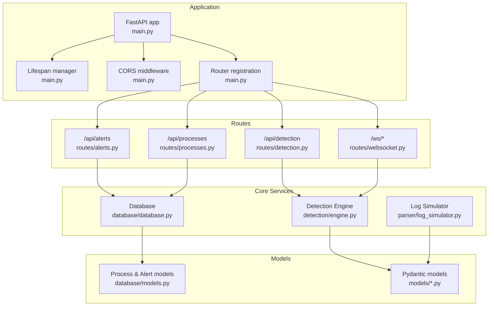
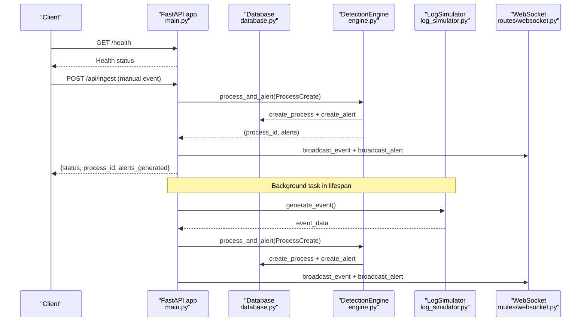
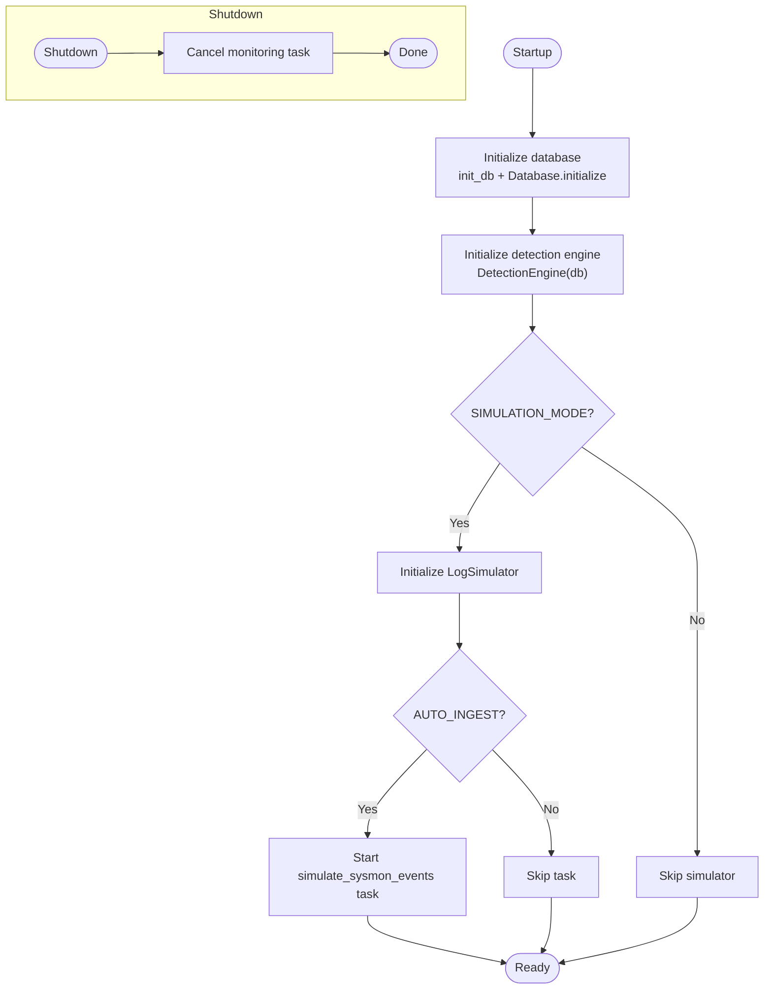
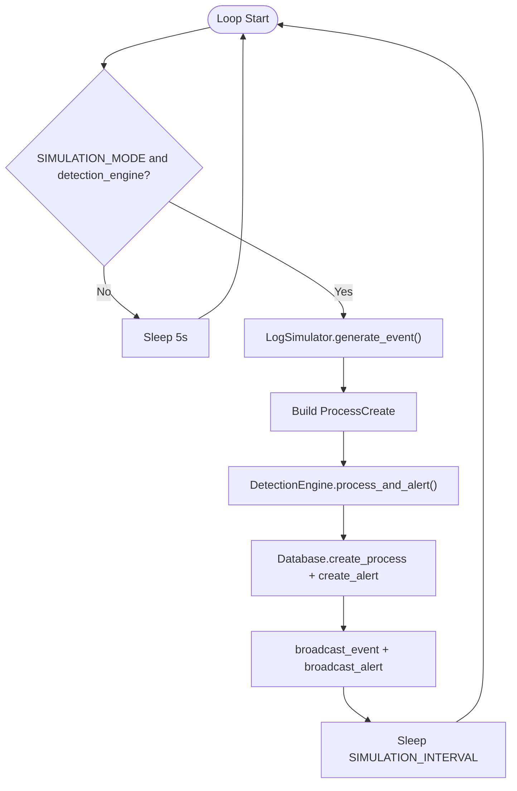
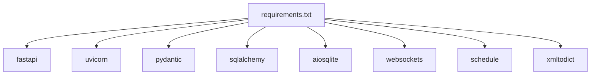

# Application Entry Point

<cite>
**Referenced Files in This Document**
- [backend/main.py](file://backend/main.py)
- [backend/database/database.py](file://backend/database/database.py)
- [backend/database/models.py](file://backend/database/models.py)
- [backend/detection/engine.py](file://backend/detection/engine.py)
- [backend/parser/log_simulator.py](file://backend/parser/log_simulator.py)
- [backend/routes/websocket.py](file://backend/routes/websocket.py)
- [backend/routes/alerts.py](file://backend/routes/alerts.py)
- [backend/routes/processes.py](file://backend/routes/processes.py)
- [backend/routes/detection.py](file://backend/routes/detection.py)
- [backend/models/process.py](file://backend/models/process.py)
- [backend/models/alert.py](file://backend/models/alert.py)
- [backend/models/detection.py](file://backend/models/detection.py)
- [backend/parser/sysmon_parser.py](file://backend/parser/sysmon_parser.py)
- [backend/requirements.txt](file://backend/requirements.txt)
</cite>

## Table of Contents
1. [Introduction](#introduction)
2. [Project Structure](#project-structure)
3. [Core Components](#core-components)
4. [Architecture Overview](#architecture-overview)
5. [Detailed Component Analysis](#detailed-component-analysis)
6. [Dependency Analysis](#dependency-analysis)
7. [Performance Considerations](#performance-considerations)
8. [Troubleshooting Guide](#troubleshooting-guide)
9. [Conclusion](#conclusion)
10. [Appendices](#appendices)

## Introduction
This document explains the EDR Lite application entry point and FastAPI configuration. It covers the main application initialization lifecycle, CORS configuration, router registration, environment-based configuration management, health checks, system statistics, manual event ingestion, dashboard serving, static file handling, simulation mode with background tasks, event generation, and WebSocket broadcasting. Practical examples of configuration options, environment variable usage, and deployment considerations are included to help operators deploy and operate the system effectively.

## Project Structure
The backend is organized around a FastAPI application with modular components:
- Application entry point and configuration
- Database abstraction and models
- Detection engine and rule management
- Parser utilities for Sysmon events
- Route modules for REST APIs and WebSocket
- Pydantic models for data validation and serialization

**Diagram sources**
- [backend/main.py:171-192](file://backend/main.py#L171-L192)
- [backend/routes/alerts.py:15](file://backend/routes/alerts.py#L15)
- [backend/routes/processes.py:16](file://backend/routes/processes.py#L16)
- [backend/routes/detection.py:14](file://backend/routes/detection.py#L14)
- [backend/routes/websocket.py:14](file://backend/routes/websocket.py#L14)
- [backend/database/database.py:21](file://backend/database/database.py#L21)
- [backend/detection/engine.py:64](file://backend/detection/engine.py#L64)
- [backend/parser/log_simulator.py:18](file://backend/parser/log_simulator.py#L18)
- [backend/database/models.py:9](file://backend/database/models.py#L9)
- [backend/models/process.py:6](file://backend/models/process.py#L6)
- [backend/models/alert.py:15](file://backend/models/alert.py#L15)
- [backend/models/detection.py:17](file://backend/models/detection.py#L17)

**Section sources**
- [backend/main.py:171-192](file://backend/main.py#L171-L192)
- [backend/routes/alerts.py:15](file://backend/routes/alerts.py#L15)
- [backend/routes/processes.py:16](file://backend/routes/processes.py#L16)
- [backend/routes/detection.py:14](file://backend/routes/detection.py#L14)
- [backend/routes/websocket.py:14](file://backend/routes/websocket.py#L14)
- [backend/database/database.py:21](file://backend/database/database.py#L21)
- [backend/detection/engine.py:64](file://backend/detection/engine.py#L64)
- [backend/parser/log_simulator.py:18](file://backend/parser/log_simulator.py#L18)
- [backend/database/models.py:9](file://backend/database/models.py#L9)
- [backend/models/process.py:6](file://backend/models/process.py#L6)
- [backend/models/alert.py:15](file://backend/models/alert.py#L15)
- [backend/models/detection.py:17](file://backend/models/detection.py#L17)

## Core Components
- EDRConfig: Centralized environment-based configuration for database URL, CORS origins, simulation mode, simulation interval, and auto-ingestion.
- Lifespan manager: Orchestrates startup and shutdown sequences, initializes database, detection engine, and optional simulation.
- FastAPI app: Creates the ASGI application, applies CORS, registers routers, and exposes health, stats, ingestion, and dashboard endpoints.
- Simulation mode: Background task that generates synthetic Sysmon events, runs detection, persists data, and broadcasts updates via WebSocket.
- WebSocket: Real-time streaming of alerts and process events to connected clients.
- REST APIs: Alerts, processes, and detection endpoints backed by SQLAlchemy and the detection engine.

**Section sources**
- [backend/main.py:51-58](file://backend/main.py#L51-L58)
- [backend/main.py:120-169](file://backend/main.py#L120-L169)
- [backend/main.py:171-192](file://backend/main.py#L171-L192)
- [backend/main.py:60-118](file://backend/main.py#L60-L118)
- [backend/routes/websocket.py:68-233](file://backend/routes/websocket.py#L68-L233)
- [backend/routes/alerts.py:18-180](file://backend/routes/alerts.py#L18-L180)
- [backend/routes/processes.py:19-253](file://backend/routes/processes.py#L19-L253)
- [backend/routes/detection.py:44-256](file://backend/routes/detection.py#L44-L256)

## Architecture Overview
The application follows a layered architecture:
- Entry point initializes services and wires middleware and routers.
- Routes depend on the database session provider and the detection engine.
- The detection engine evaluates incoming or simulated events against rules and persists results.
- WebSocket broadcasts live updates to clients.

**Diagram sources**
- [backend/main.py:214-311](file://backend/main.py#L214-L311)
- [backend/detection/engine.py:272-290](file://backend/detection/engine.py#L272-L290)
- [backend/database/database.py:86-215](file://backend/database/database.py#L86-L215)
- [backend/parser/log_simulator.py:138-150](file://backend/parser/log_simulator.py#L138-L150)
- [backend/routes/websocket.py:209-224](file://backend/routes/websocket.py#L209-L224)

## Detailed Component Analysis

### EDRConfig: Environment-Based Configuration Management
EDRConfig centralizes configuration loaded from environment variables:
- DATABASE_URL: Database connection string (default SQLite).
- CORS_ORIGINS: Comma-separated list of allowed origins for CORS.
- SIMULATION_MODE: Enable/disable simulation mode.
- SIMULATION_INTERVAL: Sleep interval between simulated events (seconds).
- AUTO_INGEST: Whether to auto-start background ingestion when in simulation mode.

Operational guidance:
- Set DATABASE_URL to configure the database backend (e.g., PostgreSQL).
- Configure CORS_ORIGINS to allowlist frontend origins.
- Toggle SIMULATION_MODE to enable synthetic event generation.
- Adjust SIMULATION_INTERVAL to control event generation rate.
- AUTO_INGEST controls whether background ingestion starts automatically.

**Section sources**
- [backend/main.py:51-58](file://backend/main.py#L51-L58)

### Lifespan Manager: Startup and Shutdown Procedures
The lifespan manager coordinates application lifecycle:
- On startup:
  - Initializes logging and ensures logs directory exists.
  - Initializes database and creates tables.
  - Initializes the detection engine.
  - Optionally initializes the log simulator and starts the background monitoring task if AUTO_INGEST and SIMULATION_MODE are enabled.
- On shutdown:
  - Cancels the background task and waits for graceful termination.

**Diagram sources**
- [backend/main.py:120-169](file://backend/main.py#L120-L169)
- [backend/database/database.py:315-324](file://backend/database/database.py#L315-L324)
- [backend/detection/engine.py:64-82](file://backend/detection/engine.py#L64-L82)
- [backend/parser/log_simulator.py:18](file://backend/parser/log_simulator.py#L18)

**Section sources**
- [backend/main.py:120-169](file://backend/main.py#L120-L169)
- [backend/database/database.py:315-324](file://backend/database/database.py#L315-L324)
- [backend/detection/engine.py:64-82](file://backend/detection/engine.py#L64-L82)
- [backend/parser/log_simulator.py:18](file://backend/parser/log_simulator.py#L18)

### CORS Configuration and Router Registration
- CORS middleware is configured with origins from EDRConfig, allowing credentials and all methods/headers.
- Routers are registered for alerts, processes, detection, and WebSocket endpoints.

Practical tips:
- Ensure CORS_ORIGINS includes the frontend origin(s).
- Verify router prefixes align with frontend API base paths.

**Section sources**
- [backend/main.py:179-192](file://backend/main.py#L179-L192)

### Health Check Endpoints
- GET /health returns service health, database connectivity, detection engine status, and simulation mode flag.

Usage:
- Call from monitoring systems to verify service availability.

**Section sources**
- [backend/main.py:214-223](file://backend/main.py#L214-L223)

### System Statistics API
- GET /api/stats aggregates detection engine and rule statistics, including counts and top triggered rules.

Use cases:
- Dashboard widgets and operational dashboards.

**Section sources**
- [backend/main.py:226-240](file://backend/main.py#L226-L240)

### Manual Event Ingestion
- POST /api/ingest accepts a Sysmon-style event payload, converts it to a ProcessCreate model, runs detection, persists results, and broadcasts updates.

Payload expectations:
- Event structure mirrors Sysmon Event ID 1 with EventData containing Image, ParentImage, CommandLine, ProcessId, ParentProcessId, and Computer.

Behavior:
- On success, returns process_id, number of alerts generated, and whether any alerts were triggered.
- On failure, returns an error status with message.

**Section sources**
- [backend/main.py:243-311](file://backend/main.py#L243-L311)

### Batch Simulation and Toggle Simulation Mode
- POST /api/simulate/batch generates a batch of simulated events and ingests them.
- POST /api/simulation/toggle enables or disables simulation mode and manages the background task.

Operational guidance:
- Use batch endpoint for load testing or demonstration.
- Toggle endpoint to pause/resume simulation during maintenance.

**Section sources**
- [backend/main.py:313-358](file://backend/main.py#L313-L358)

### Dashboard Serving and Static File Handling
- GET /dashboard serves a static HTML dashboard with embedded JavaScript for real-time updates.
- Static files under /static are mounted if the directory exists.

Deployment note:
- Ensure the static directory exists or serve the frontend separately via a reverse proxy.

**Section sources**
- [backend/main.py:361-364](file://backend/main.py#L361-L364)
- [backend/main.py:366-687](file://backend/main.py#L366-L687)

### Simulation Mode Implementation
Background task loop:
- Generates a simulated event via LogSimulator.
- Converts to ProcessCreate and runs detection via DetectionEngine.
- Persists process and alerts to the database.
- Broadcasts process events and alerts to WebSocket clients.
- Sleeps for EDRConfig.SIMULATION_INTERVAL between iterations.

Error handling:
- Exceptions are logged and the loop continues after a short sleep.

**Diagram sources**
- [backend/main.py:60-118](file://backend/main.py#L60-L118)
- [backend/parser/log_simulator.py:138-150](file://backend/parser/log_simulator.py#L138-L150)
- [backend/detection/engine.py:272-290](file://backend/detection/engine.py#L272-L290)
- [backend/database/database.py:86-215](file://backend/database/database.py#L86-L215)
- [backend/routes/websocket.py:209-224](file://backend/routes/websocket.py#L209-L224)

**Section sources**
- [backend/main.py:60-118](file://backend/main.py#L60-L118)
- [backend/parser/log_simulator.py:138-150](file://backend/parser/log_simulator.py#L138-L150)
- [backend/detection/engine.py:272-290](file://backend/detection/engine.py#L272-L290)
- [backend/database/database.py:86-215](file://backend/database/database.py#L86-L215)
- [backend/routes/websocket.py:209-224](file://backend/routes/websocket.py#L209-L224)

### WebSocket Broadcasting
- ConnectionManager maintains active connections and supports broadcasting to all clients and sending to specific clients.
- Two WebSocket endpoints:
  - /ws/alerts: Streams alerts to clients.
  - /ws/events: Streams process events and statistics.

Client messaging:
- Supports heartbeat and subscription messages for robust client-server communication.

**Section sources**
- [backend/routes/websocket.py:21-62](file://backend/routes/websocket.py#L21-L62)
- [backend/routes/websocket.py:68-167](file://backend/routes/websocket.py#L68-L167)
- [backend/routes/websocket.py:169-207](file://backend/routes/websocket.py#L169-L207)
- [backend/routes/websocket.py:209-233](file://backend/routes/websocket.py#L209-L233)

### REST API Endpoints
- Alerts API: Retrieve alerts, statistics, acknowledge/unacknowledge, delete, and bulk operations.
- Processes API: Retrieve processes, recent events, statistics, process tree, and delete.
- Detection API: Manage detection rules, test processes, reload rules, export/import rules, and get statistics.

**Section sources**
- [backend/routes/alerts.py:18-180](file://backend/routes/alerts.py#L18-L180)
- [backend/routes/processes.py:19-253](file://backend/routes/processes.py#L19-L253)
- [backend/routes/detection.py:44-256](file://backend/routes/detection.py#L44-L256)

### Data Models and Persistence
- Database models define processes and alerts with indices and JSON fields for details.
- Pydantic models validate and serialize request/response payloads.
- Detection models define rule types, risk scoring, and detection results.

**Section sources**
- [backend/database/models.py:9-77](file://backend/database/models.py#L9-L77)
- [backend/models/process.py:6-44](file://backend/models/process.py#L6-L44)
- [backend/models/alert.py:15-55](file://backend/models/alert.py#L15-L55)
- [backend/models/detection.py:17-92](file://backend/models/detection.py#L17-L92)

## Dependency Analysis
External dependencies include FastAPI, Uvicorn, Pydantic, SQLAlchemy, aiosqlite, websockets, schedule, and xmltodict. These are declared in requirements.txt.

**Diagram sources**
- [backend/requirements.txt:1-10](file://backend/requirements.txt#L1-L10)

**Section sources**
- [backend/requirements.txt:1-10](file://backend/requirements.txt#L1-L10)

## Performance Considerations
- Simulation interval: Tune SIMULATION_INTERVAL to balance load and responsiveness.
- Database I/O: Use async database sessions and minimize round-trips in hot paths.
- WebSocket scalability: ConnectionManager handles broadcasting; consider scaling horizontally and using a message broker for high concurrency.
- Rule evaluation: DetectionEngine compiles patterns lazily; ensure rule sets are optimized and only enabled rules are evaluated.
- Logging: Excessive logging can impact performance; adjust log levels in production.

## Troubleshooting Guide
Common issues and resolutions:
- Database connectivity failures:
  - Verify DATABASE_URL and network access.
  - Check logs directory permissions.
- CORS errors:
  - Confirm CORS_ORIGINS includes the frontend origin.
- WebSocket disconnections:
  - Inspect heartbeat handling and client reconnection logic.
- Simulation not generating events:
  - Ensure SIMULATION_MODE is true and AUTO_INGEST is true.
  - Check background task cancellation and logs for exceptions.
- Health endpoint shows disconnected database:
  - Confirm database initialization and table creation steps.

**Section sources**
- [backend/main.py:214-223](file://backend/main.py#L214-L223)
- [backend/main.py:120-169](file://backend/main.py#L120-L169)
- [backend/routes/websocket.py:68-167](file://backend/routes/websocket.py#L68-L167)

## Conclusion
EDR Lite’s entry point and FastAPI configuration provide a robust foundation for real-time endpoint monitoring. The environment-driven configuration, lifecycle management, simulation mode, and WebSocket streaming enable flexible deployment and operation. By tuning configuration parameters and following operational best practices, teams can deploy EDR Lite for development, testing, and production environments.

## Appendices

### Environment Variables and Configuration Options
- DATABASE_URL: Database connection string (default SQLite).
- CORS_ORIGINS: Comma-separated list of allowed origins.
- SIMULATION_MODE: Enable/disable simulation mode.
- SIMULATION_INTERVAL: Seconds between simulated events.
- AUTO_INGEST: Auto-start background ingestion in simulation mode.
- PORT/HOST: Uvicorn server binding (via main module).
- DEBUG: Enable hot reload in development.

**Section sources**
- [backend/main.py:51-58](file://backend/main.py#L51-L58)
- [backend/main.py:690-705](file://backend/main.py#L690-L705)

### Deployment Considerations
- Database: Choose a persistent database backend for production (e.g., PostgreSQL) and manage migrations externally.
- Frontend: Serve the React/Turbo dashboard via a reverse proxy or mount static assets appropriately.
- Scaling: Use multiple workers behind a load balancer; consider a message broker for WebSocket broadcasting at scale.
- Monitoring: Use the /health and /api/stats endpoints for health checks and metrics collection.
- Security: Restrict CORS origins, enforce authentication/authorization at the reverse proxy, and rotate secrets.