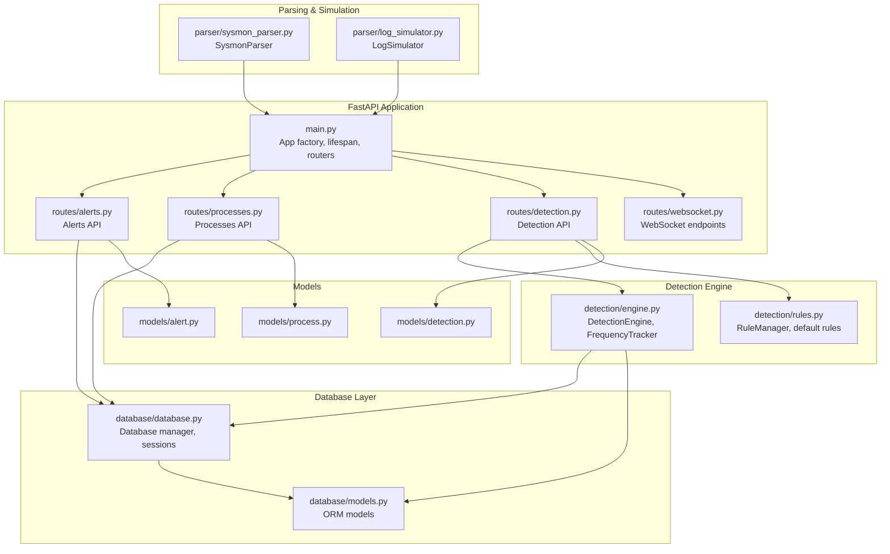
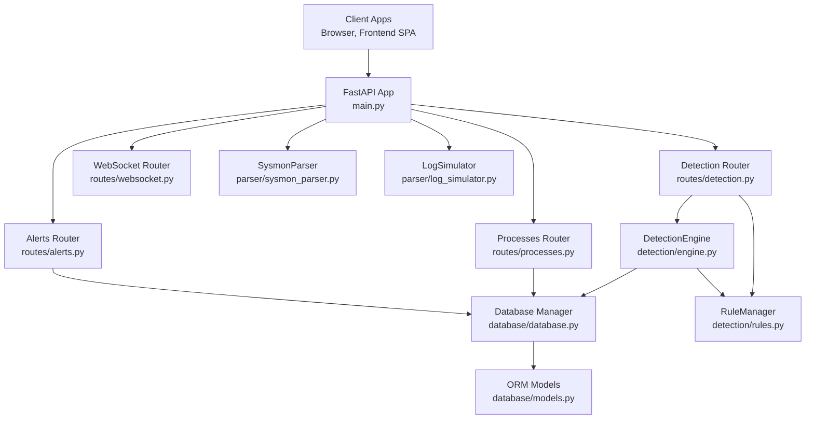
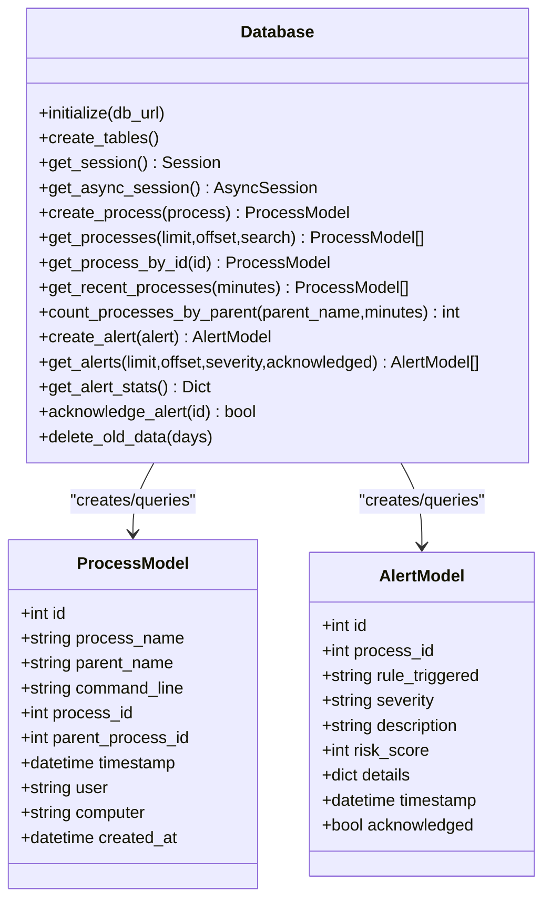
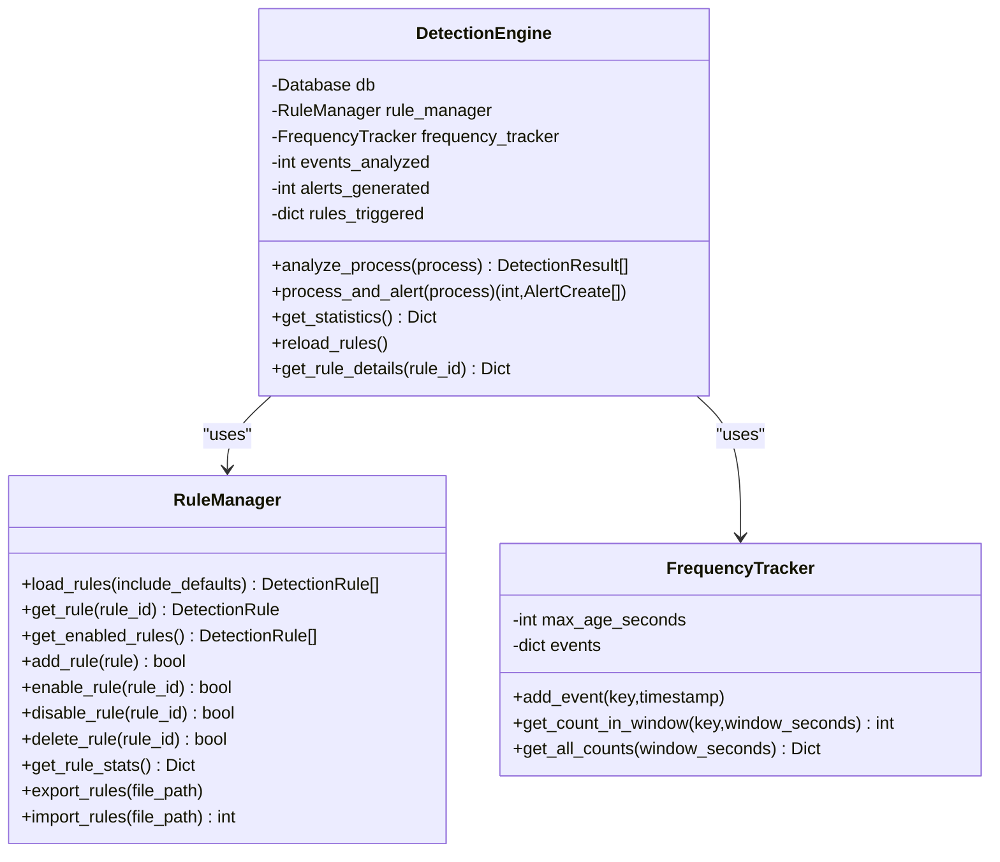
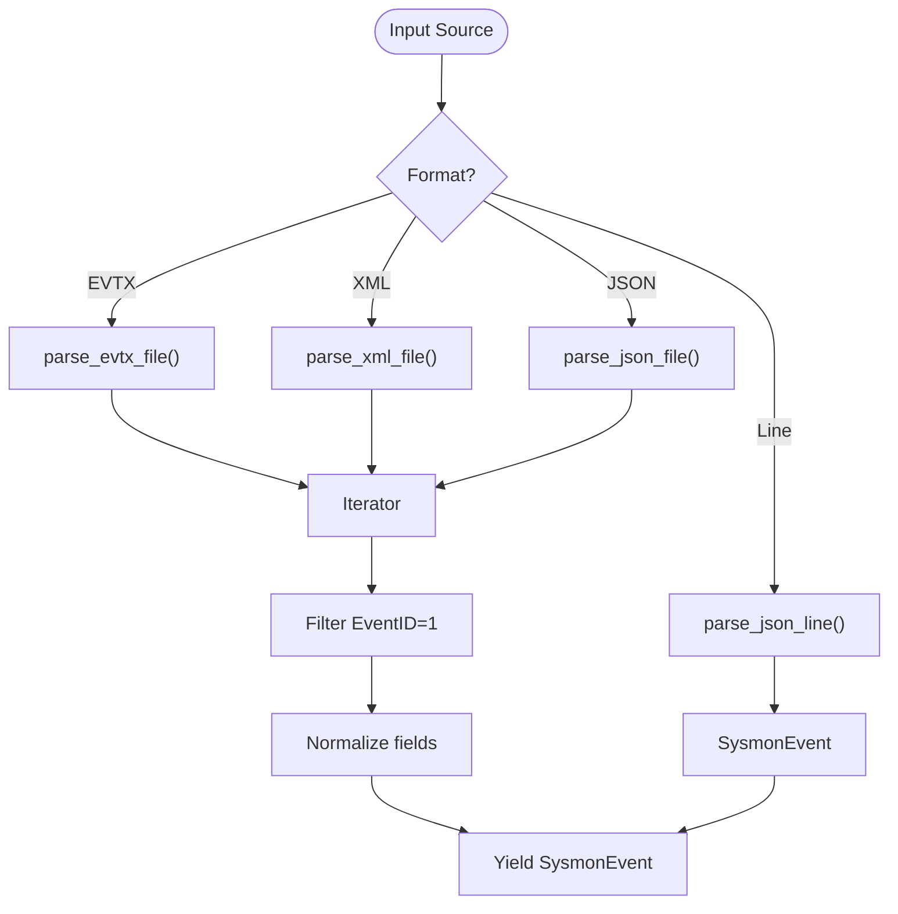
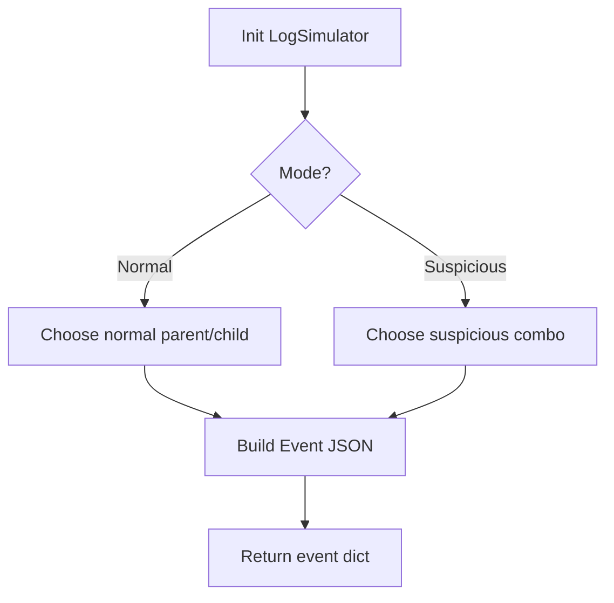
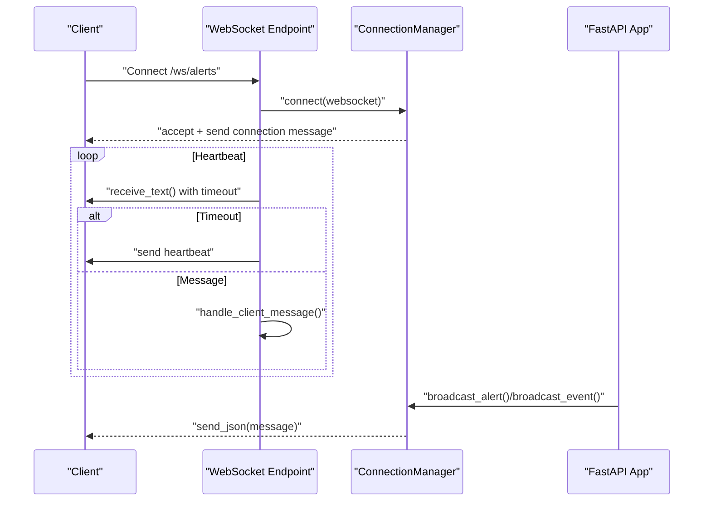
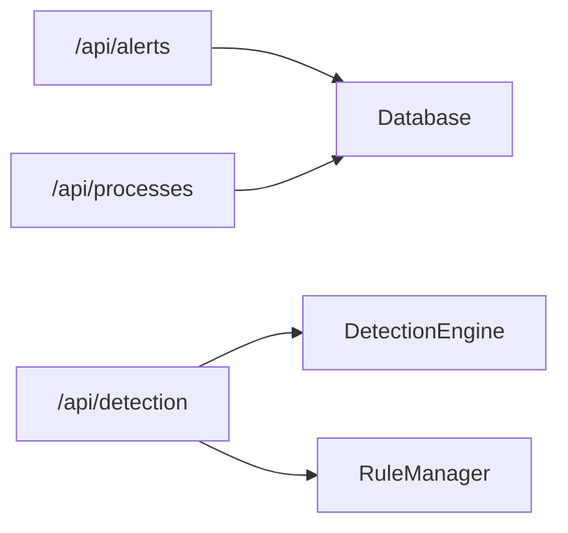
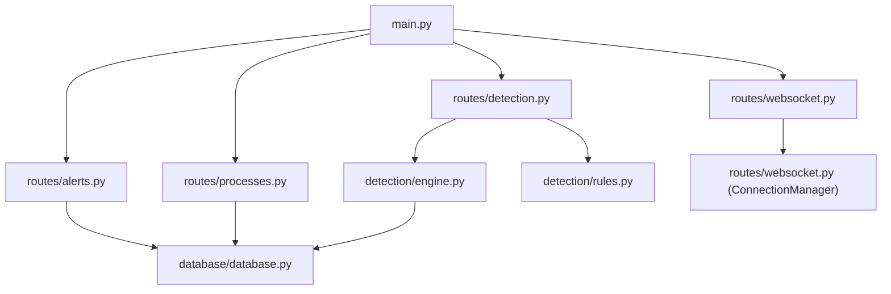

# Backend Components

<cite>
**Referenced Files in This Document**
- [backend/main.py](file://backend/main.py)
- [backend/database/database.py](file://backend/database/database.py)
- [backend/database/models.py](file://backend/database/models.py)
- [backend/detection/engine.py](file://backend/detection/engine.py)
- [backend/detection/rules.py](file://backend/detection/rules.py)
- [backend/parser/sysmon_parser.py](file://backend/parser/sysmon_parser.py)
- [backend/parser/log_simulator.py](file://backend/parser/log_simulator.py)
- [backend/routes/websocket.py](file://backend/routes/websocket.py)
- [backend/routes/alerts.py](file://backend/routes/alerts.py)
- [backend/routes/processes.py](file://backend/routes/processes.py)
- [backend/routes/detection.py](file://backend/routes/detection.py)
- [backend/models/process.py](file://backend/models/process.py)
- [backend/models/alert.py](file://backend/models/alert.py)
- [backend/models/detection.py](file://backend/models/detection.py)
</cite>

## Table of Contents
1. [Introduction](#introduction)
2. [Project Structure](#project-structure)
3. [Core Components](#core-components)
4. [Architecture Overview](#architecture-overview)
5. [Detailed Component Analysis](#detailed-component-analysis)
6. [Dependency Analysis](#dependency-analysis)
7. [Performance Considerations](#performance-considerations)
8. [Troubleshooting Guide](#troubleshooting-guide)
9. [Conclusion](#conclusion)

## Introduction
This document describes the backend architecture of EDR Lite, focusing on the FastAPI application, database layer, detection engine, parser subsystem, and WebSocket real-time streaming. It explains how components interact, how dependency injection is applied, and how lifecycle management is handled during application startup and shutdown.

## Project Structure
The backend is organized around a FastAPI application that exposes REST endpoints and WebSocket streams, integrates a database layer with SQLAlchemy ORM, runs a detection engine with configurable rules, parses Sysmon events, and simulates realistic traffic for testing.

**Diagram sources**
- [backend/main.py:171-192](file://backend/main.py#L171-L192)
- [backend/routes/websocket.py:14](file://backend/routes/websocket.py#L14)
- [backend/routes/alerts.py:15](file://backend/routes/alerts.py#L15)
- [backend/routes/processes.py:16](file://backend/routes/processes.py#L16)
- [backend/routes/detection.py:14](file://backend/routes/detection.py#L14)
- [backend/database/database.py:21](file://backend/database/database.py#L21)
- [backend/database/models.py:1](file://backend/database/models.py#L1)
- [backend/detection/engine.py:64](file://backend/detection/engine.py#L64)
- [backend/detection/rules.py:273](file://backend/detection/rules.py#L273)
- [backend/parser/sysmon_parser.py:61](file://backend/parser/sysmon_parser.py#L61)
- [backend/parser/log_simulator.py:18](file://backend/parser/log_simulator.py#L18)
- [backend/models/process.py:6](file://backend/models/process.py#L6)
- [backend/models/alert.py:15](file://backend/models/alert.py#L15)
- [backend/models/detection.py:17](file://backend/models/detection.py#L17)

**Section sources**
- [backend/main.py:171-192](file://backend/main.py#L171-L192)
- [backend/database/database.py:21-84](file://backend/database/database.py#L21-L84)
- [backend/detection/engine.py:64-83](file://backend/detection/engine.py#L64-L83)
- [backend/detection/rules.py:273-314](file://backend/detection/rules.py#L273-L314)
- [backend/parser/sysmon_parser.py:61-95](file://backend/parser/sysmon_parser.py#L61-L95)
- [backend/parser/log_simulator.py:18-44](file://backend/parser/log_simulator.py#L18-L44)
- [backend/routes/websocket.py:14-65](file://backend/routes/websocket.py#L14-L65)
- [backend/routes/alerts.py:15-54](file://backend/routes/alerts.py#L15-L54)
- [backend/routes/processes.py:16-42](file://backend/routes/processes.py#L16-L42)
- [backend/routes/detection.py:14-71](file://backend/routes/detection.py#L14-L71)
- [backend/models/process.py:6-32](file://backend/models/process.py#L6-L32)
- [backend/models/alert.py:15-38](file://backend/models/alert.py#L15-L38)
- [backend/models/detection.py:17-92](file://backend/models/detection.py#L17-L92)

## Core Components
- FastAPI application entry point with lifespan management, CORS configuration, router inclusion, and health endpoints.
- Database layer with synchronous and asynchronous engines, session factories, and ORM models.
- Detection engine implementing multiple detection strategies with rule evaluation and frequency tracking.
- Parser supporting multiple Sysmon formats and a log simulator for synthetic events.
- WebSocket service for real-time alert and event streaming with connection management.
- REST API routes for alerts, processes, and detection rule management.

**Section sources**
- [backend/main.py:120-177](file://backend/main.py#L120-L177)
- [backend/database/database.py:21-84](file://backend/database/database.py#L21-L84)
- [backend/detection/engine.py:64-83](file://backend/detection/engine.py#L64-L83)
- [backend/parser/sysmon_parser.py:61-95](file://backend/parser/sysmon_parser.py#L61-L95)
- [backend/parser/log_simulator.py:18-44](file://backend/parser/log_simulator.py#L18-L44)
- [backend/routes/websocket.py:21-65](file://backend/routes/websocket.py#L21-L65)
- [backend/routes/alerts.py:15-54](file://backend/routes/alerts.py#L15-L54)
- [backend/routes/processes.py:16-42](file://backend/routes/processes.py#L16-L42)
- [backend/routes/detection.py:14-71](file://backend/routes/detection.py#L14-L71)

## Architecture Overview
The system follows a layered architecture:
- Presentation layer: FastAPI app with routers for REST and WebSocket.
- Domain layer: Detection engine and rule management.
- Persistence layer: SQLAlchemy ORM with dual synchronous/asynchronous engines.
- Integration layer: Parser and simulator for ingestion.

**Diagram sources**
- [backend/main.py:171-192](file://backend/main.py#L171-L192)
- [backend/routes/alerts.py:15](file://backend/routes/alerts.py#L15)
- [backend/routes/processes.py:16](file://backend/routes/processes.py#L16)
- [backend/routes/detection.py:14](file://backend/routes/detection.py#L14)
- [backend/routes/websocket.py:14](file://backend/routes/websocket.py#L14)
- [backend/database/database.py:21](file://backend/database/database.py#L21)
- [backend/database/models.py:1](file://backend/database/models.py#L1)
- [backend/detection/engine.py:64](file://backend/detection/engine.py#L64)
- [backend/detection/rules.py:273](file://backend/detection/rules.py#L273)
- [backend/parser/sysmon_parser.py:61](file://backend/parser/sysmon_parser.py#L61)
- [backend/parser/log_simulator.py:18](file://backend/parser/log_simulator.py#L18)

## Detailed Component Analysis

### FastAPI Application and Lifespan
- Application factory creates a FastAPI app with CORS middleware and includes routers for alerts, processes, detection, and WebSocket.
- Lifespan manages application startup and shutdown:
  - Initializes database and creates tables.
  - Creates the detection engine and optionally the log simulator.
  - Starts a background task to simulate Sysmon events when enabled.
  - On shutdown, cancels the background task and logs completion.
- Root and health endpoints provide basic status and API discovery.
- Additional endpoints support manual ingestion, batch simulation, and runtime toggling of simulation mode.

```mermaid
sequenceDiagram
participant Uvicorn as "Uvicorn"
participant App as "FastAPI App"
participant Lifespan as "lifespan()"
participant DB as "Database"
participant Engine as "DetectionEngine"
participant Sim as "LogSimulator"
Uvicorn->>App : "Create app"
App->>Lifespan : "Enter lifespan"
Lifespan->>DB : "init_db(url)"
Lifespan->>DB : "initialize(url)"
Lifespan->>Engine : "create DetectionEngine(db)"
alt SIMULATION_MODE
Lifespan->>Sim : "create LogSimulator()"
Lifespan->>App : "start background task"
end
Lifespan-->>App : "yield"
Note over App,Lifespan : "App running..."
App-->>Lifespan : "Exit lifespan"
Lifespan->>App : "cancel background task"
Lifespan-->>App : "shutdown complete"
```

**Diagram sources**
- [backend/main.py:120-177](file://backend/main.py#L120-L177)
- [backend/database/database.py:315-324](file://backend/database/database.py#L315-L324)

**Section sources**
- [backend/main.py:171-241](file://backend/main.py#L171-L241)
- [backend/main.py:313-358](file://backend/main.py#L313-L358)
- [backend/main.py:120-177](file://backend/main.py#L120-L177)
- [backend/database/database.py:315-324](file://backend/database/database.py#L315-L324)

### Database Layer
- Database manager encapsulates:
  - Synchronous engine for initialization and synchronous operations.
  - Asynchronous engine for FastAPI endpoints.
  - Session factories for sync and async usage.
  - CRUD operations for processes and alerts, plus statistics and cleanup.
- ORM models define tables for processes, alerts, and rule execution logs with appropriate indices and JSON fields.

**Diagram sources**
- [backend/database/database.py:21-324](file://backend/database/database.py#L21-L324)
- [backend/database/models.py:9-77](file://backend/database/models.py#L9-L77)

**Section sources**
- [backend/database/database.py:21-324](file://backend/database/database.py#L21-L324)
- [backend/database/models.py:9-77](file://backend/database/models.py#L9-L77)

### Detection Engine
- DetectionEngine orchestrates:
  - Rule evaluation across multiple strategies: parent-child, command line, frequency, behavior, and anomaly placeholders.
  - FrequencyTracker for per-parent process creation counts within sliding windows.
  - Statistics tracking for events analyzed, alerts generated, and rule triggers.
- RuleManager loads default and custom rules from JSON files, supports enabling/disabling, editing, and exporting/importing.

**Diagram sources**
- [backend/detection/engine.py:64-324](file://backend/detection/engine.py#L64-L324)
- [backend/detection/rules.py:273-480](file://backend/detection/rules.py#L273-L480)

**Section sources**
- [backend/detection/engine.py:64-324](file://backend/detection/engine.py#L64-L324)
- [backend/detection/rules.py:273-480](file://backend/detection/rules.py#L273-L480)

### Parser Module (Sysmon)
- SysmonParser supports multiple input formats:
  - EVTX files (requires python-evtx).
  - XML exports (including multiple namespace variants).
  - JSON exports (single event or array).
  - Streaming JSON lines.
- Extracts standardized fields and normalizes them into a structured event representation, including hashes and timestamps.

**Diagram sources**
- [backend/parser/sysmon_parser.py:96-207](file://backend/parser/sysmon_parser.py#L96-L207)
- [backend/parser/sysmon_parser.py:208-385](file://backend/parser/sysmon_parser.py#L208-L385)

**Section sources**
- [backend/parser/sysmon_parser.py:61-385](file://backend/parser/sysmon_parser.py#L61-L385)

### Log Simulator
- Generates realistic Sysmon Event ID 1 events:
  - Normal system behavior with typical parent-child pairs.
  - Suspicious combinations mimicking common attack patterns.
  - Supports batch generation, streaming, and export to JSON/XML.
- Useful for testing and demonstration without external Sysmon sources.

**Diagram sources**
- [backend/parser/log_simulator.py:131-250](file://backend/parser/log_simulator.py#L131-L250)

**Section sources**
- [backend/parser/log_simulator.py:18-315](file://backend/parser/log_simulator.py#L18-L315)

### WebSocket Communication
- ConnectionManager maintains active connections and broadcasts messages to all clients.
- Two WebSocket endpoints:
  - /ws/alerts: real-time alert stream with heartbeat and client message handling.
  - /ws/events: live process event feed with periodic stats updates.
- Global broadcast helpers for alerts, events, and stats updates are exposed to the main app.

**Diagram sources**
- [backend/routes/websocket.py:21-233](file://backend/routes/websocket.py#L21-L233)

**Section sources**
- [backend/routes/websocket.py:21-233](file://backend/routes/websocket.py#L21-L233)

### REST API Routers
- Alerts router: list, filter, acknowledge/unacknowledge, delete, and recent alerts.
- Processes router: paginated retrieval, recent processes, stats, process tree, and parent-child queries.
- Detection router: CRUD for rules, enable/disable, test a process, reload rules, export/import, and engine stats.

**Diagram sources**
- [backend/routes/alerts.py:15-180](file://backend/routes/alerts.py#L15-L180)
- [backend/routes/processes.py:16-253](file://backend/routes/processes.py#L16-L253)
- [backend/routes/detection.py:14-256](file://backend/routes/detection.py#L14-L256)

**Section sources**
- [backend/routes/alerts.py:15-180](file://backend/routes/alerts.py#L15-L180)
- [backend/routes/processes.py:16-253](file://backend/routes/processes.py#L16-L253)
- [backend/routes/detection.py:14-256](file://backend/routes/detection.py#L14-L256)

## Dependency Analysis
- FastAPI app depends on routers, which depend on the database session provider and models.
- Detection engine depends on the database and rule manager; rule manager depends on models and JSON files.
- WebSocket endpoints depend on the connection manager and broadcast helpers.
- Parser and simulator are independent but integrated via ingestion endpoints and background tasks.

**Diagram sources**
- [backend/main.py:171-192](file://backend/main.py#L171-L192)
- [backend/routes/alerts.py:15](file://backend/routes/alerts.py#L15)
- [backend/routes/processes.py:16](file://backend/routes/processes.py#L16)
- [backend/routes/detection.py:14](file://backend/routes/detection.py#L14)
- [backend/routes/websocket.py:14](file://backend/routes/websocket.py#L14)
- [backend/database/database.py:21](file://backend/database/database.py#L21)
- [backend/detection/engine.py:64](file://backend/detection/engine.py#L64)
- [backend/detection/rules.py:273](file://backend/detection/rules.py#L273)

**Section sources**
- [backend/main.py:171-192](file://backend/main.py#L171-L192)
- [backend/database/database.py:21-84](file://backend/database/database.py#L21-L84)
- [backend/detection/engine.py:64-83](file://backend/detection/engine.py#L64-L83)
- [backend/detection/rules.py:273-314](file://backend/detection/rules.py#L273-L314)
- [backend/routes/websocket.py:21-65](file://backend/routes/websocket.py#L21-L65)

## Performance Considerations
- Database engines:
  - Separate synchronous and asynchronous engines are configured for initialization and runtime usage respectively.
  - Async sessions are acquired per request to avoid blocking.
- Detection:
  - FrequencyTracker uses thread-safe deques with a maximum window size to cap memory usage.
  - Rule evaluation short-circuits on non-matching conditions to minimize work.
- WebSocket:
  - Broadcasting iterates active connections and cleans up failed ones to prevent leaks.
- Logging:
  - Structured logging to both stdout and file for observability.

[No sources needed since this section provides general guidance]

## Troubleshooting Guide
- Health checks:
  - Use the health endpoint to confirm database connectivity and engine readiness.
- Simulation mode:
  - Toggle simulation on/off and adjust interval via dedicated endpoints.
- Parser errors:
  - Sysmon parser logs import and parsing errors; ensure required libraries are installed for EVTX parsing.
- WebSocket:
  - Clients receive heartbeat messages; persistent failures indicate network or server issues.
- Database cleanup:
  - Old data retention can be managed by deleting entries older than a threshold.

**Section sources**
- [backend/main.py:214-223](file://backend/main.py#L214-L223)
- [backend/main.py:339-358](file://backend/main.py#L339-L358)
- [backend/parser/sysmon_parser.py:96-161](file://backend/parser/sysmon_parser.py#L96-L161)
- [backend/routes/websocket.py:68-166](file://backend/routes/websocket.py#L68-L166)
- [backend/database/database.py:296-309](file://backend/database/database.py#L296-L309)

## Conclusion
EDR Lite’s backend is a cohesive FastAPI application integrating a dual-engine database, a flexible detection engine with rule management, robust Sysmon parsing, and real-time WebSocket streaming. The architecture emphasizes modularity, testability, and operational simplicity, enabling rapid deployment and iteration for endpoint detection and response scenarios.