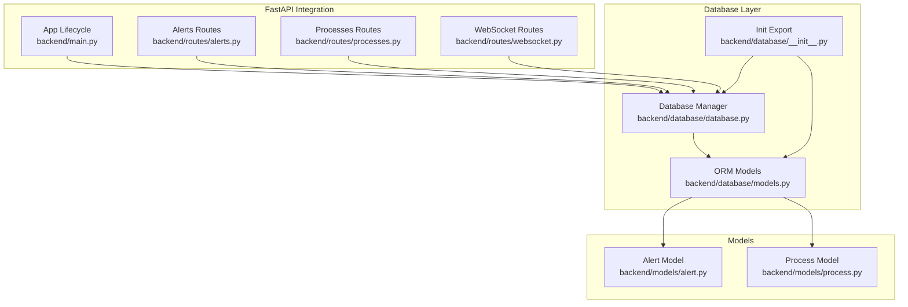
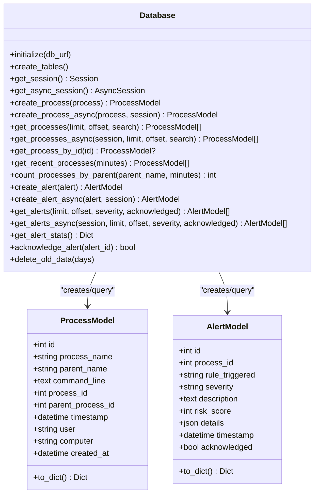
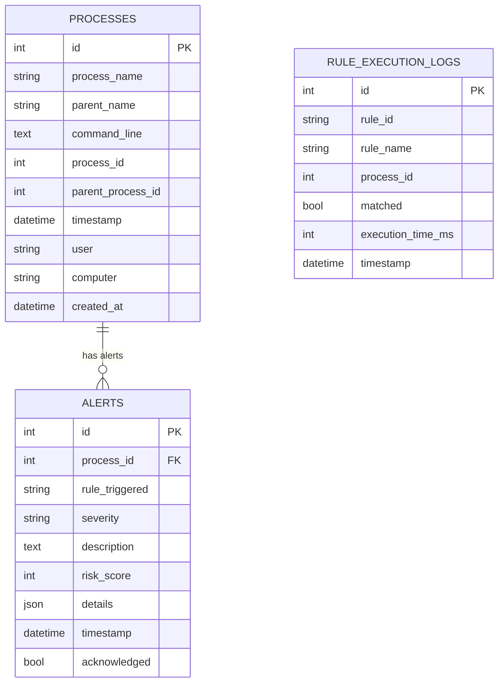
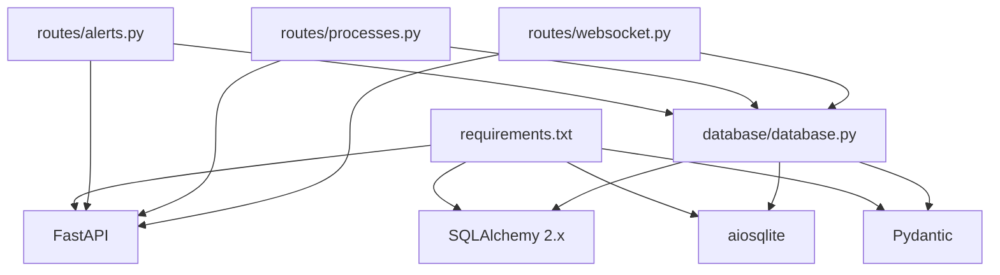

# Database Layer

<cite>
**Referenced Files in This Document**
- [database.py](file://backend/database/database.py)
- [models.py](file://backend/database/models.py)
- [__init__.py](file://backend/database/__init__.py)
- [main.py](file://backend/main.py)
- [alerts.py](file://backend/routes/alerts.py)
- [processes.py](file://backend/routes/processes.py)
- [websocket.py](file://backend/routes/websocket.py)
- [alert.py](file://backend/models/alert.py)
- [process.py](file://backend/models/process.py)
- [requirements.txt](file://backend/requirements.txt)
</cite>

## Table of Contents
1. [Introduction](#introduction)
2. [Project Structure](#project-structure)
3. [Core Components](#core-components)
4. [Architecture Overview](#architecture-overview)
5. [Detailed Component Analysis](#detailed-component-analysis)
6. [Dependency Analysis](#dependency-analysis)
7. [Performance Considerations](#performance-considerations)
8. [Troubleshooting Guide](#troubleshooting-guide)
9. [Conclusion](#conclusion)

## Introduction
This document describes the EDR Lite database layer architecture, focusing on the Database class implementation with dual engine support (synchronous and asynchronous), connection management, session handling, and the SQLAlchemy ORM models for Process and Alert entities. It explains initialization, table creation, migration strategies, data access patterns, query optimization, statistical analytics, examples of operations, error handling, connection pooling, and thread-safety considerations for concurrent access.

## Project Structure
The database layer resides under backend/database and integrates with FastAPI routes and the main application lifecycle. The key files are:
- Database manager and session provider
- SQLAlchemy declarative models
- Route integrations for async sessions
- Application lifecycle initialization

**Diagram sources**
- [database.py:21-324](file://backend/database/database.py#L21-L324)
- [models.py:1-77](file://backend/database/models.py#L1-L77)
- [__init__.py:1-11](file://backend/database/__init__.py#L1-L11)
- [main.py:120-177](file://backend/main.py#L120-L177)
- [alerts.py:1-180](file://backend/routes/alerts.py#L1-L180)
- [processes.py:1-253](file://backend/routes/processes.py#L1-L253)
- [websocket.py:1-233](file://backend/routes/websocket.py#L1-L233)
- [alert.py:1-55](file://backend/models/alert.py#L1-L55)
- [process.py:1-44](file://backend/models/process.py#L1-L44)

**Section sources**
- [database.py:1-324](file://backend/database/database.py#L1-L324)
- [models.py:1-77](file://backend/database/models.py#L1-L77)
- [__init__.py:1-11](file://backend/database/__init__.py#L1-L11)
- [main.py:120-177](file://backend/main.py#L120-L177)

## Core Components
- Database class singleton managing both synchronous and asynchronous engines and sessions
- SQLAlchemy declarative models for Process and Alert entities
- Route integrations using async sessions via FastAPI dependency injection
- Application lifecycle initialization and table creation

Key responsibilities:
- Initialize engines and sessions from environment variables
- Provide CRUD and analytical methods for processes and alerts
- Expose async session dependency for FastAPI routes
- Support statistics and cleanup operations

**Section sources**
- [database.py:21-324](file://backend/database/database.py#L21-L324)
- [models.py:9-77](file://backend/database/models.py#L9-L77)
- [__init__.py:1-11](file://backend/database/__init__.py#L1-L11)

## Architecture Overview
The database layer uses SQLAlchemy with dual engines:
- Synchronous engine for initialization and synchronous operations
- Asynchronous engine for FastAPI routes and concurrent access

Sessions are managed via scoped factories:
- Sync sessionmaker bound to the sync engine
- Async sessionmaker bound to the async engine

**Diagram sources**
- [database.py:21-324](file://backend/database/database.py#L21-L324)
- [models.py:9-77](file://backend/database/models.py#L9-L77)

## Detailed Component Analysis

### Database Class Implementation
The Database class is a singleton that manages:
- Engines: synchronous and asynchronous
- Session factories: synchronous and asynchronous
- Initialization from environment variables
- Table creation via metadata
- CRUD and analytics methods for Process and Alert entities

Initialization and connection management:
- Reads DATABASE_URL and ASYNC_DATABASE_URL from environment
- Creates synchronous engine with optional StaticPool for SQLite
- Creates asynchronous engine with aiosqlite and StaticPool
- Builds session factories bound to respective engines
- Provides get_session() and get_async_session() for route usage

Session handling:
- Synchronous operations use with self.get_session() as session
- Asynchronous operations accept an AsyncSession parameter and await commit/refresh
- Async dependency get_db yields a session for route handlers

Dual engine support:
- Synchronous engine for initialization and synchronous methods
- Asynchronous engine for FastAPI routes and concurrent access

Thread safety and concurrency:
- Uses separate engines and session factories for sync/async
- Async sessions are created per-request via dependency injection
- StaticPool is used for SQLite to avoid cross-thread issues

Statistical analytics:
- get_alert_stats aggregates severity counts and hourly distribution
- Additional stats exposed via routes for processes

Data retention:
- delete_old_data removes old Process and Alert records older than N days

Examples of operations:
- Creating processes and alerts
- Filtering and paginating lists
- Aggregating statistics
- Acknowledging alerts

**Section sources**
- [database.py:21-324](file://backend/database/database.py#L21-L324)

### SQLAlchemy ORM Models
Process entity:
- Fields: identifiers, names, command line, timestamps, user/computer
- Indexes: process_name, parent_name, timestamp
- Utility: to_dict serialization

Alert entity:
- Fields: foreign key to Process, rule name, severity, description, risk score, details, timestamps, acknowledgment flag
- Indexes: severity, timestamp, process_id, rule_triggered
- Utility: to_dict serialization

Rule execution log (auxiliary):
- Tracks rule execution metrics for debugging and auditing

Relationships:
- AlertModel.process_id references ProcessModel.id (foreign key)
- No explicit ORM relationship declared; handled via foreign keys and joins in queries

**Diagram sources**
- [models.py:9-77](file://backend/database/models.py#L9-L77)

**Section sources**
- [models.py:9-77](file://backend/database/models.py#L9-L77)

### Database Initialization and Migration Strategies
Initialization:
- init_db(db_url) calls Database.initialize and creates tables
- Database.initialize sets up engines and session factories
- create_tables() invokes Base.metadata.create_all on the sync engine

Migration strategies:
- Current implementation uses declarative Base.metadata.create_all for schema creation
- No explicit Alembic migrations present in the repository snapshot
- For production, consider migrating to Alembic for versioned migrations

Lifecycle integration:
- main.py lifespan manager initializes database and detection engine during startup
- Uses EDRConfig.DATABASE_URL environment variable

**Section sources**
- [database.py:71-74](file://backend/database/database.py#L71-L74)
- [database.py:42-69](file://backend/database/database.py#L42-L69)
- [database.py:315-319](file://backend/database/database.py#L315-L319)
- [main.py:120-154](file://backend/main.py#L120-L154)

### Data Access Patterns and Query Optimization
Access patterns:
- CRUD operations for Process and Alert entities
- Filtering by severity and acknowledgment status
- Search across process names and command lines
- Time-window queries for recent events
- Aggregation queries for statistics

Optimization techniques:
- Indexes on frequently queried columns (process_name, parent_name, timestamp, severity, process_id)
- LIMIT/OFFSET pagination for large datasets
- SELECT scalar counts for aggregations
- strftime-based grouping for hourly alert distributions

Route-level usage:
- Alerts routes use get_db dependency to inject AsyncSession
- Processes routes use get_db dependency to inject AsyncSession
- Both routes apply filters and pagination consistently

**Section sources**
- [database.py:122-137](file://backend/database/database.py#L122-L137)
- [database.py:217-230](file://backend/database/database.py#L217-L230)
- [database.py:247-284](file://backend/database/database.py#L247-L284)
- [alerts.py:18-54](file://backend/routes/alerts.py#L18-L54)
- [processes.py:19-42](file://backend/routes/processes.py#L19-L42)

### Statistical Analytics and Aggregation Queries
Alert statistics:
- Severity breakdown using GROUP BY on severity
- Hourly distribution using strftime on timestamp
- Recent alerts filtered by time window

Process statistics:
- Counts for total, last hour, last 24 hours
- Top parent and child processes by spawn counts

These analytics are exposed via dedicated endpoints and used by the dashboard.

**Section sources**
- [database.py:247-284](file://backend/database/database.py#L247-L284)
- [processes.py:65-112](file://backend/routes/processes.py#L65-L112)

### Examples of Database Operations
Creating records:
- Create process: Database.create_process with ProcessCreate payload
- Create alert: Database.create_alert with AlertCreate payload

Retrieving records:
- List processes with optional search and pagination
- List alerts with optional severity and acknowledgment filters
- Get recent events within time windows

Acknowledging alerts:
- Mark alerts as acknowledged via Database.acknowledge_alert

Cleanup:
- Delete old data older than N days

**Section sources**
- [database.py:86-103](file://backend/database/database.py#L86-L103)
- [database.py:185-200](file://backend/database/database.py#L185-L200)
- [database.py:122-137](file://backend/database/database.py#L122-L137)
- [database.py:217-230](file://backend/database/database.py#L217-L230)
- [database.py:160-168](file://backend/database/database.py#L160-L168)
- [database.py:286-294](file://backend/database/database.py#L286-L294)
- [database.py:296-308](file://backend/database/database.py#L296-L308)

### Error Handling and Connection Pooling
Error handling:
- Route handlers raise HTTPException for missing resources
- WebSocket broadcast handles exceptions and cleans up disconnected clients
- Logging is used throughout the database layer for operational visibility

Connection pooling:
- SQLite uses StaticPool to avoid cross-thread issues
- Engines are configured with connect_args to disable thread checks for SQLite
- Async sessions are created per request via dependency injection

Thread safety:
- Separate engines and session factories for sync/async
- Async sessions are isolated per request
- StaticPool ensures safe reuse of SQLite connections

**Section sources**
- [database.py:50-62](file://backend/database/database.py#L50-L62)
- [alerts.py:97-101](file://backend/routes/alerts.py#L97-L101)
- [websocket.py:43-61](file://backend/routes/websocket.py#L43-L61)
- [main.py:120-154](file://backend/main.py#L120-L154)

## Dependency Analysis
External dependencies:
- FastAPI for async route handling and dependency injection
- SQLAlchemy 2.x for ORM and async support
- aiosqlite for async SQLite connectivity
- Pydantic for data models and validation

Internal dependencies:
- Routes depend on get_db for AsyncSession
- Database class depends on models for ORM entities
- Main application lifecycle initializes database and detection engine

**Diagram sources**
- [requirements.txt:1-10](file://backend/requirements.txt#L1-L10)
- [alerts.py:1-180](file://backend/routes/alerts.py#L1-L180)
- [processes.py:1-253](file://backend/routes/processes.py#L1-L253)
- [websocket.py:1-233](file://backend/routes/websocket.py#L1-L233)
- [database.py:1-324](file://backend/database/database.py#L1-L324)

**Section sources**
- [requirements.txt:1-10](file://backend/requirements.txt#L1-L10)
- [alerts.py:1-180](file://backend/routes/alerts.py#L1-L180)
- [processes.py:1-253](file://backend/routes/processes.py#L1-L253)
- [websocket.py:1-233](file://backend/routes/websocket.py#L1-L233)
- [database.py:1-324](file://backend/database/database.py#L1-L324)

## Performance Considerations
- Use indexes on frequently filtered and sorted columns (severity, timestamp, process_name, parent_name, process_id)
- Prefer LIMIT/OFFSET pagination for large datasets; consider cursor-based pagination for very large result sets
- Aggregate queries should use scalar counts and grouped selects to minimize memory overhead
- Avoid N+1 queries by batching operations and using joined queries where appropriate
- For production, consider switching from SQLite to a production database (e.g., PostgreSQL) and tune connection pools accordingly
- Monitor alert and process volumes; adjust retention policies and cleanup intervals

[No sources needed since this section provides general guidance]

## Troubleshooting Guide
Common issues and resolutions:
- Database initialization failures: Verify DATABASE_URL and ASYNC_DATABASE_URL environment variables; ensure SQLite file path is writable
- Session errors: Ensure get_db dependency is used in routes; avoid mixing sync and async sessions
- Missing indexes: Add indexes on new query filters; rebuild tables after schema changes
- Slow queries: Review query plans; add appropriate indexes; optimize LIMIT/OFFSET usage
- WebSocket disconnections: Check broadcast error handling; ensure clients reconnect gracefully

Operational logging:
- Database layer logs initialization and operations
- Main application logs startup/shutdown lifecycle
- WebSocket routes log connection and error states

**Section sources**
- [database.py:42-69](file://backend/database/database.py#L42-L69)
- [database.py:71-74](file://backend/database/database.py#L71-L74)
- [main.py:120-154](file://backend/main.py#L120-L154)
- [websocket.py:43-61](file://backend/routes/websocket.py#L43-L61)

## Conclusion
The EDR Lite database layer provides a robust foundation for process and alert persistence with dual synchronous/asynchronous engines, efficient indexing, and practical analytics. The singleton Database class centralizes connection management and exposes clean CRUD and aggregation APIs. While the current implementation relies on declarative schema creation, adopting Alembic for migrations would improve production readiness. The route integrations leverage FastAPI’s dependency injection for safe async session usage, and the design supports scalable growth with appropriate indexing and connection tuning.