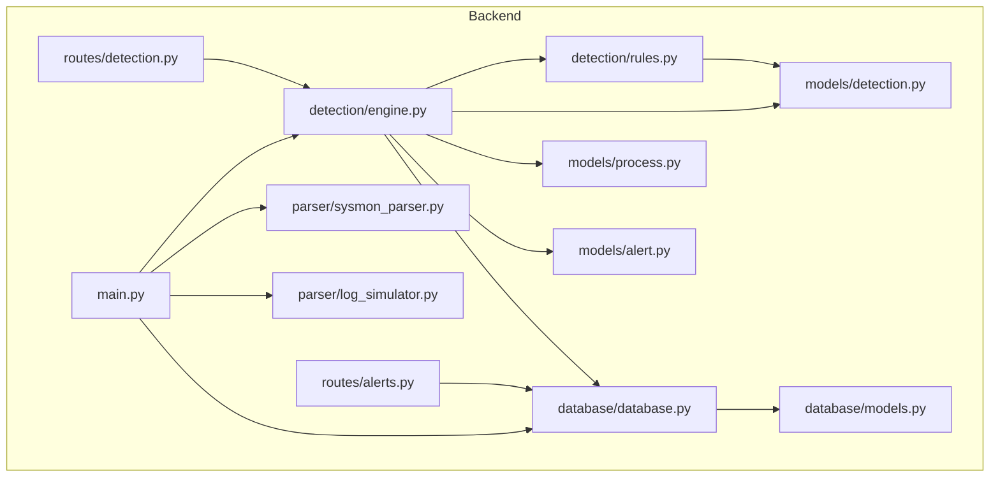
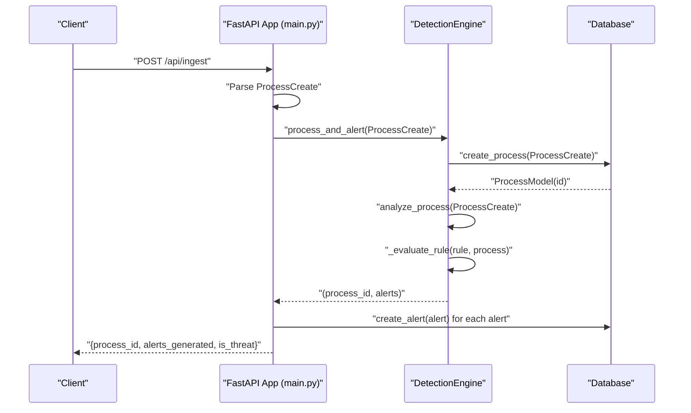
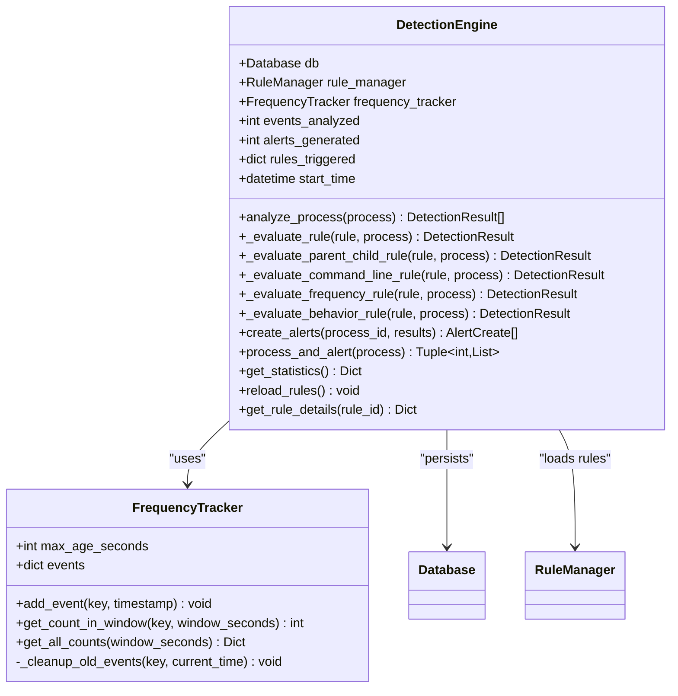
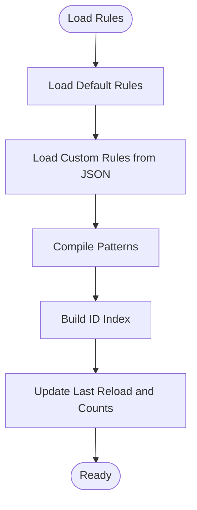
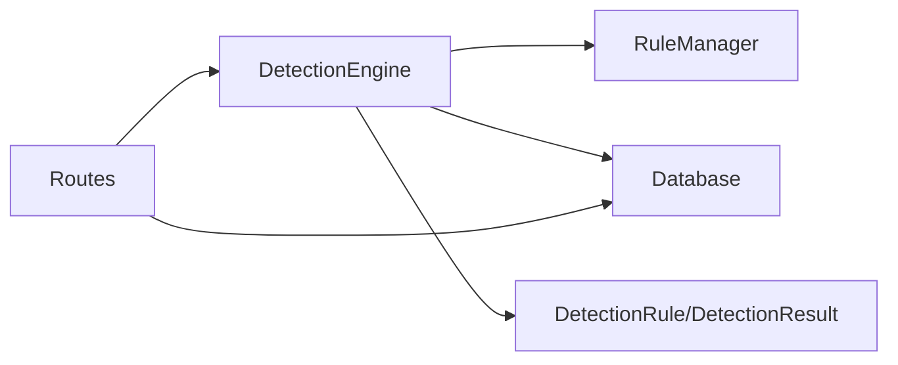
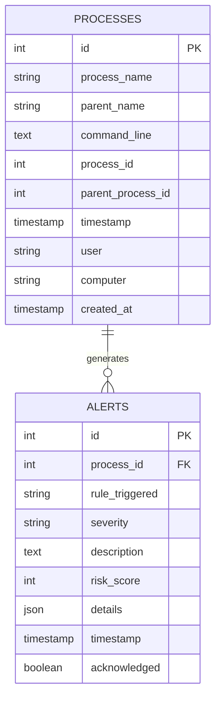

# Detection Engine

<cite>
**Referenced Files in This Document**
- [backend/detection/engine.py](file://backend/detection/engine.py)
- [backend/detection/rules.py](file://backend/detection/rules.py)
- [backend/models/detection.py](file://backend/models/detection.py)
- [backend/database/database.py](file://backend/database/database.py)
- [backend/database/models.py](file://backend/database/models.py)
- [backend/models/alert.py](file://backend/models/alert.py)
- [backend/models/process.py](file://backend/models/process.py)
- [backend/main.py](file://backend/main.py)
- [backend/routes/detection.py](file://backend/routes/detection.py)
- [backend/routes/alerts.py](file://backend/routes/alerts.py)
- [backend/parser/sysmon_parser.py](file://backend/parser/sysmon_parser.py)
- [backend/parser/log_simulator.py](file://backend/parser/log_simulator.py)
- [README.md](file://README.md)
</cite>

## Table of Contents
1. [Introduction](#introduction)
2. [Project Structure](#project-structure)
3. [Core Components](#core-components)
4. [Architecture Overview](#architecture-overview)
5. [Detailed Component Analysis](#detailed-component-analysis)
6. [Dependency Analysis](#dependency-analysis)
7. [Performance Considerations](#performance-considerations)
8. [Troubleshooting Guide](#troubleshooting-guide)
9. [Conclusion](#conclusion)
10. [Appendices](#appendices)

## Introduction
This document explains the EDR Lite detection engine implementation, focusing on the DetectionEngine class and its integrated rule evaluation system. It covers detection strategies (parent-child analysis, command line pattern matching, frequency analysis, and behavioral detection), dynamic rule loading and management, frequency tracking for anomaly detection, thread-safety considerations, database integration, alert generation and severity classification, statistical reporting, and practical guidance for custom rule development and performance optimization.

## Project Structure
The detection engine resides in the backend under the detection package and integrates with models, database, parsers, and routes.

**Diagram sources**
- [backend/main.py:120-154](file://backend/main.py#L120-L154)
- [backend/routes/detection.py:14-28](file://backend/routes/detection.py#L14-L28)
- [backend/routes/alerts.py:15-25](file://backend/routes/alerts.py#L15-L25)
- [backend/detection/engine.py:64-83](file://backend/detection/engine.py#L64-L83)
- [backend/detection/rules.py:273-290](file://backend/detection/rules.py#L273-L290)
- [backend/models/detection.py:17-92](file://backend/models/detection.py#L17-L92)
- [backend/models/process.py:6-44](file://backend/models/process.py#L6-L44)
- [backend/models/alert.py:15-55](file://backend/models/alert.py#L15-L55)
- [backend/database/database.py:21-84](file://backend/database/database.py#L21-L84)
- [backend/database/models.py:9-77](file://backend/database/models.py#L9-L77)
- [backend/parser/sysmon_parser.py:61-95](file://backend/parser/sysmon_parser.py#L61-L95)
- [backend/parser/log_simulator.py:18-44](file://backend/parser/log_simulator.py#L18-L44)

**Section sources**
- [README.md:31-51](file://README.md#L31-L51)
- [backend/main.py:120-154](file://backend/main.py#L120-L154)

## Core Components
- DetectionEngine: Central orchestrator that loads rules, evaluates detections, tracks frequency anomalies, generates alerts, and maintains statistics.
- RuleManager: Loads default and custom rules from JSON files, compiles patterns, and supports CRUD operations on rules.
- DetectionRule and DetectionResult: Pydantic models defining rule schema, matching logic, and detection outcomes.
- FrequencyTracker: Thread-safe sliding-window counter for process creation frequency used by frequency-based rules.
- Database and Models: SQLAlchemy ORM for persisting processes and alerts; async and sync sessions for throughput.
- Routes: REST endpoints for rule management, detection testing, statistics, and alert retrieval.

**Section sources**
- [backend/detection/engine.py:64-83](file://backend/detection/engine.py#L64-L83)
- [backend/detection/rules.py:273-314](file://backend/detection/rules.py#L273-L314)
- [backend/models/detection.py:17-92](file://backend/models/detection.py#L17-L92)
- [backend/database/database.py:21-84](file://backend/database/database.py#L21-L84)

## Architecture Overview
The detection engine runs as part of a FastAPI application. It receives process events (via ingestion or simulation), persists them, evaluates against rules, and emits alerts. WebSocket endpoints broadcast live updates to the dashboard.

**Diagram sources**
- [backend/main.py:243-311](file://backend/main.py#L243-L311)
- [backend/detection/engine.py:272-290](file://backend/detection/engine.py#L272-L290)
- [backend/database/database.py:86-120](file://backend/database/database.py#L86-L120)

## Detailed Component Analysis

### DetectionEngine
The DetectionEngine coordinates detection across multiple strategies and manages statistics and alert creation.

Key responsibilities:
- Rule evaluation pipeline: iterates enabled rules and delegates to strategy-specific evaluators.
- Parent-child detection: matches parent and child process patterns.
- Command line pattern detection: checks presence of suspicious substrings or regex patterns.
- Frequency-based detection: uses FrequencyTracker to compute per-parent counts within a time window and scales risk dynamically.
- Behavioral detection: flags suspicious child patterns (e.g., temp directory execution).
- Alert creation: converts DetectionResult objects into AlertCreate entries and persists them.
- Statistics: tracks events analyzed, alerts generated, top triggered rules, and frequency stats.

Thread-safety:
- FrequencyTracker uses a lock around mutating operations to protect shared deques.
- No other shared mutable state is observed in the engine; concurrent processing should be safe at the process level.

Integration points:
- Database: creates processes and alerts, and supports async sessions for route handlers.
- RuleManager: loads and manages rules, including custom JSON files.

Risk scoring and confidence:
- Confidence and risk_score are set per strategy and adjusted for frequency anomalies.

**Section sources**
- [backend/detection/engine.py:64-324](file://backend/detection/engine.py#L64-L324)
- [backend/database/database.py:86-215](file://backend/database/database.py#L86-L215)

#### Class Diagram

**Diagram sources**
- [backend/detection/engine.py:23-324](file://backend/detection/engine.py#L23-L324)
- [backend/database/database.py:21-84](file://backend/database/database.py#L21-L84)

### Rule Evaluation System
The engine evaluates each rule against the incoming process event. Supported rule types:
- Parent-child: matches both parent and child process patterns.
- Command line: matches either a list of substrings or a regex pattern in the command line.
- Frequency: thresholds process creation rate per parent within a time window.
- Behavior: flags suspicious child process patterns (e.g., temp directory execution).
- Anomaly: reserved for future ML-based detection.

Dynamic rule loading:
- Default rules are embedded in code and compiled at load time.
- Custom rules are loaded from JSON files in a configurable directory.
- Rules can be added, updated, enabled/disabled, deleted, exported/imported via the RuleManager.

Rule types and parameters:
- RuleType enumeration defines supported strategies.
- DetectionRule fields include identifiers, descriptions, severity, enabling flag, and strategy-specific parameters (patterns, thresholds, risk score).
- Pattern compilation caches compiled regex objects to avoid repeated work.

**Section sources**
- [backend/detection/engine.py:121-141](file://backend/detection/engine.py#L121-L141)
- [backend/detection/rules.py:20-256](file://backend/detection/rules.py#L20-L256)
- [backend/models/detection.py:8-92](file://backend/models/detection.py#L8-L92)

#### Rule Manager Flow

**Diagram sources**
- [backend/detection/rules.py:291-314](file://backend/detection/rules.py#L291-L314)

### Frequency Tracking Mechanisms
FrequencyTracker implements a thread-safe sliding window counter keyed by parent process name. It maintains a deque per key with a maximum length and prunes old entries based on a configurable max age. Counts are computed on demand for a given window.

Risk scoring calculation:
- Frequency-based rules compute an event count within the configured window.
- If the count exceeds the threshold, risk_score is scaled proportionally and confidence increases with excess.

**Section sources**
- [backend/detection/engine.py:23-62](file://backend/detection/engine.py#L23-L62)
- [backend/detection/engine.py:192-226](file://backend/detection/engine.py#L192-L226)

### Alert Generation, Severity Classification, and Statistical Reporting
Alert creation:
- DetectionResults are transformed into AlertCreate objects with severity, risk score, and details.
- Alerts are persisted to the database and counted in engine statistics.

Severity classification:
- Severity levels are defined in AlertCreate and used for filtering and display.

Statistical reporting:
- Engine statistics include counts, uptime, top triggered rules, and frequency metrics.
- Alert statistics provide severity breakdowns and hourly trends.

**Section sources**
- [backend/detection/engine.py:252-309](file://backend/detection/engine.py#L252-L309)
- [backend/models/alert.py:7-55](file://backend/models/alert.py#L7-L55)
- [backend/database/database.py:247-284](file://backend/database/database.py#L247-L284)

### Thread-Safe Implementation for Concurrent Processing
- FrequencyTracker uses a threading lock around add_event and count computations to prevent race conditions.
- The engine itself does not maintain shared mutable state beyond the frequency tracker; concurrent calls to analyze_process are safe at the process level.

**Section sources**
- [backend/detection/engine.py:23-62](file://backend/detection/engine.py#L23-L62)

### Integration with Database Layer
- Database class provides both sync and async SQLAlchemy sessions.
- Synchronous methods handle process and alert creation; async methods are used in route handlers.
- Models define processes and alerts with JSON fields for flexible alert details.

**Section sources**
- [backend/database/database.py:21-324](file://backend/database/database.py#L21-L324)
- [backend/database/models.py:9-77](file://backend/database/models.py#L9-L77)

### Examples and Best Practices

#### Custom Rule Development
- Create a JSON file in the rules directory with fields for id, name, rule_type, description, severity, enabled, and strategy-specific parameters.
- Use the detection routes to create, update, enable/disable, or delete rules.
- Use the test endpoint to validate rule behavior against mock ProcessCreate events.

**Section sources**
- [backend/detection/rules.py:315-425](file://backend/detection/rules.py#L315-L425)
- [backend/routes/detection.py:86-159](file://backend/routes/detection.py#L86-L159)
- [backend/routes/detection.py:168-212](file://backend/routes/detection.py#L168-L212)

#### Detection Strategy Configuration
- Parent-child: configure parent_process and child_process patterns.
- Command line: configure command_line_contains or command_line_pattern.
- Frequency: configure max_events_per_minute and time_window_minutes.
- Behavior: configure child_process patterns for suspicious execution contexts.

**Section sources**
- [backend/models/detection.py:17-83](file://backend/models/detection.py#L17-L83)
- [backend/detection/rules.py:210-254](file://backend/detection/rules.py#L210-L254)

#### Performance Optimization Techniques
- Keep regex patterns simple and compile once (handled by DetectionRule.compile_patterns).
- Limit rule count and complexity; disable unused rules.
- Use time_window_minutes and max_events_per_minute tuned to workload.
- Persist in batches where appropriate; leverage async sessions in route handlers.
- Monitor engine statistics to identify hot rules and optimize accordingly.

**Section sources**
- [backend/models/detection.py:46-79](file://backend/models/detection.py#L46-L79)
- [backend/detection/engine.py:292-309](file://backend/detection/engine.py#L292-L309)

## Dependency Analysis
The detection engine depends on:
- RuleManager for rule lifecycle and matching.
- Database for persistence of processes and alerts.
- Models for typed rule evaluation and result representation.
- Routes for external control and inspection.

**Diagram sources**
- [backend/detection/engine.py:67-83](file://backend/detection/engine.py#L67-L83)
- [backend/detection/rules.py:273-314](file://backend/detection/rules.py#L273-L314)
- [backend/database/database.py:21-84](file://backend/database/database.py#L21-L84)
- [backend/routes/detection.py:14-28](file://backend/routes/detection.py#L14-L28)

**Section sources**
- [backend/detection/engine.py:64-83](file://backend/detection/engine.py#L64-L83)
- [backend/detection/rules.py:273-314](file://backend/detection/rules.py#L273-L314)
- [backend/database/database.py:21-84](file://backend/database/database.py#L21-L84)

## Performance Considerations
- Rule evaluation cost scales linearly with the number of enabled rules; keep only necessary rules active.
- Regex compilation is cached; avoid frequent reconfiguration of patterns.
- FrequencyTracker uses bounded deques; tune max_age_seconds and window sizes to balance accuracy and memory.
- Use async database sessions in route handlers to improve concurrency.
- Batch ingestion and alert broadcasting can reduce overhead in high-throughput scenarios.

[No sources needed since this section provides general guidance]

## Troubleshooting Guide
- Rule not triggering: verify enabled flag, patterns, and strategy parameters; use the test endpoint to validate.
- Frequency anomaly not detected: adjust max_events_per_minute and time_window_minutes; confirm parent_name normalization.
- Alerts missing: check database connectivity and session usage; verify alert creation path.
- High CPU usage: review active rule count and complexity; inspect engine statistics for hotspots.

**Section sources**
- [backend/routes/detection.py:168-212](file://backend/routes/detection.py#L168-L212)
- [backend/detection/engine.py:292-309](file://backend/detection/engine.py#L292-L309)
- [backend/database/database.py:185-215](file://backend/database/database.py#L185-L215)

## Conclusion
The EDR Lite detection engine provides a modular, extensible foundation for process anomaly detection. Its rule-driven design, dynamic rule management, frequency tracking, and robust database integration enable effective real-time monitoring. By tuning configurations, leveraging async patterns, and maintaining a focused set of high-quality rules, operators can achieve strong detection coverage with predictable performance.

[No sources needed since this section summarizes without analyzing specific files]

## Appendices

### API Endpoints for Detection and Alerts
- Detection rules: list, create, update, toggle enable/disable, delete, reload, export/import, test.
- Alerts: list with filtering, get by id, acknowledge/unacknowledge, bulk acknowledge, delete, stats.

**Section sources**
- [backend/routes/detection.py:44-256](file://backend/routes/detection.py#L44-L256)
- [backend/routes/alerts.py:18-180](file://backend/routes/alerts.py#L18-L180)

### Data Models Overview

**Diagram sources**
- [backend/database/models.py:9-77](file://backend/database/models.py#L9-L77)