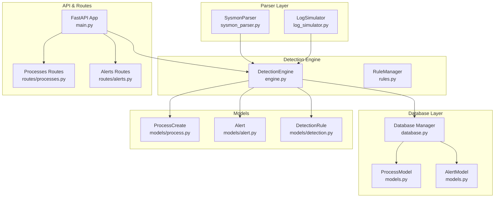
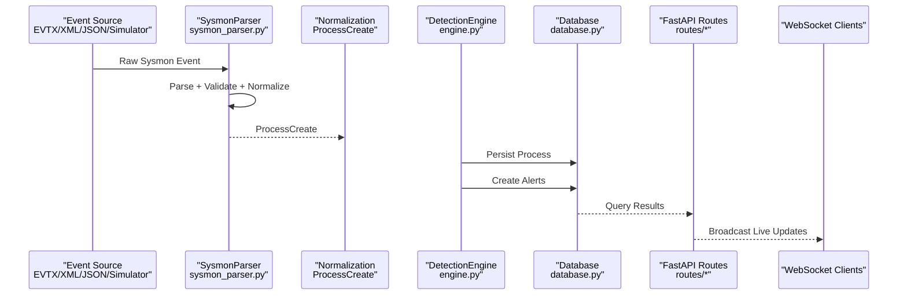
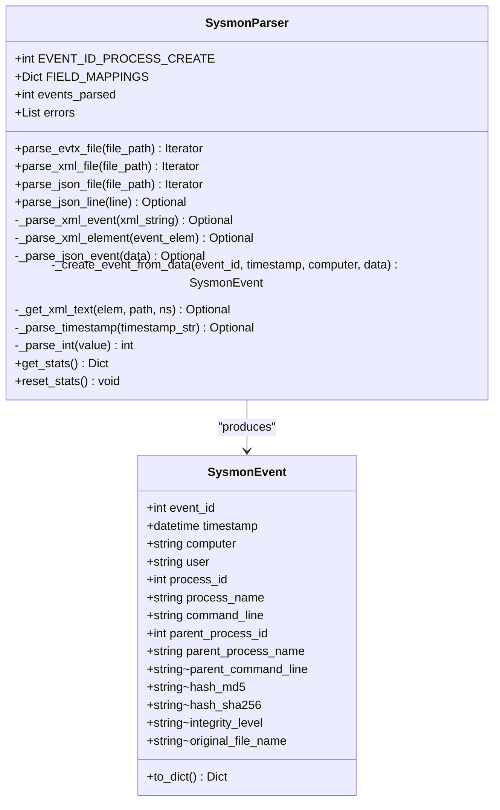
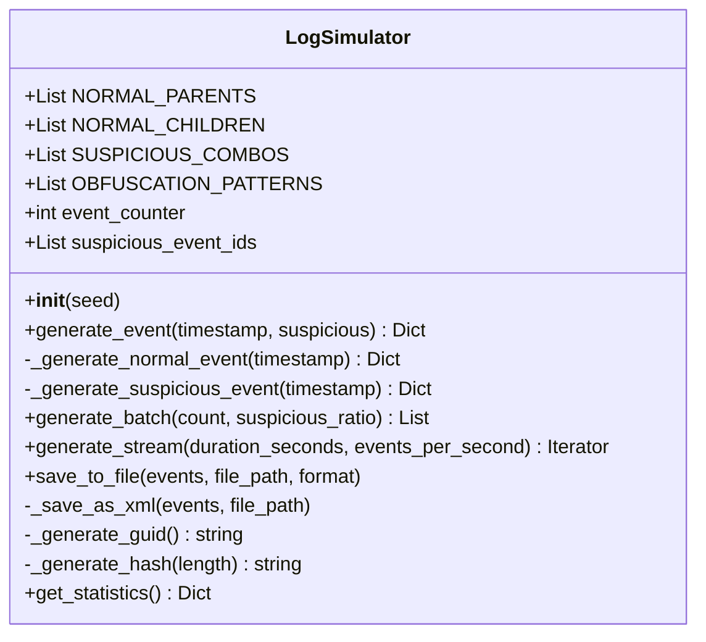
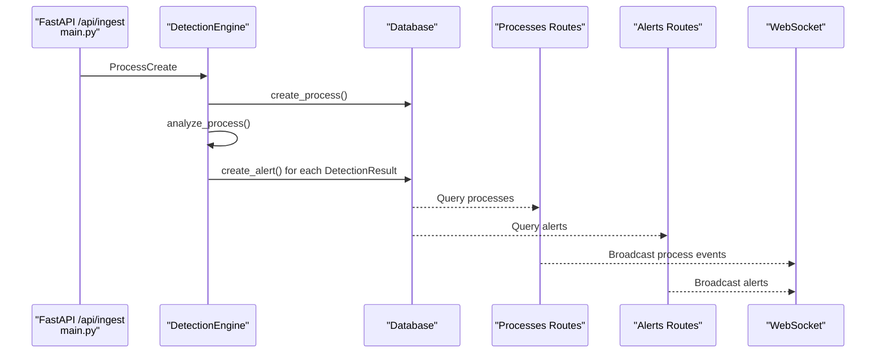
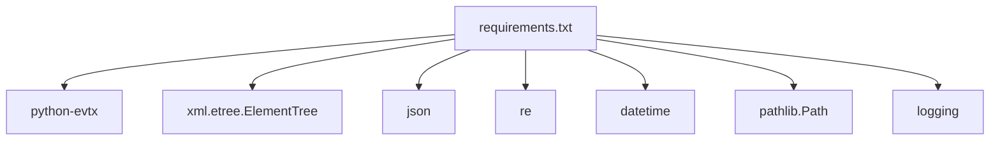

# Parser Module

<cite>
**Referenced Files in This Document**
- [sysmon_parser.py](file://backend/parser/sysmon_parser.py)
- [log_simulator.py](file://backend/parser/log_simulator.py)
- [sample_sysmon_events.json](file://sample_data/sample_sysmon_events.json)
- [main.py](file://backend/main.py)
- [engine.py](file://backend/detection/engine.py)
- [rules.py](file://backend/detection/rules.py)
- [database.py](file://backend/database/database.py)
- [models.py](file://backend/database/models.py)
- [process.py](file://backend/models/process.py)
- [alert.py](file://backend/models/alert.py)
- [detection.py](file://backend/models/detection.py)
- [processes.py](file://backend/routes/processes.py)
- [alerts.py](file://backend/routes/alerts.py)
- [requirements.txt](file://backend/requirements.txt)
</cite>

## Table of Contents
1. [Introduction](#introduction)
2. [Project Structure](#project-structure)
3. [Core Components](#core-components)
4. [Architecture Overview](#architecture-overview)
5. [Detailed Component Analysis](#detailed-component-analysis)
6. [Dependency Analysis](#dependency-analysis)
7. [Performance Considerations](#performance-considerations)
8. [Troubleshooting Guide](#troubleshooting-guide)
9. [Conclusion](#conclusion)
10. [Appendices](#appendices)

## Introduction
This document describes the EDR Lite parser module responsible for Sysmon event processing. It covers the SysmonParser class for parsing Sysmon Event ID 1 (Process Creation) events from multiple formats (EVTX, XML, JSON), the LogSimulator class for generating synthetic events for testing and demonstration, and the integration with the detection engine and database layer. It also documents supported event formats, field extraction, validation, error handling, data normalization, and compatibility considerations.

## Project Structure
The parser module resides under backend/parser and integrates with the detection engine, database layer, and FastAPI routes. The sample_data directory provides example Sysmon JSON events for reference.

**Diagram sources**
- [sysmon_parser.py:61-385](file://backend/parser/sysmon_parser.py#L61-L385)
- [log_simulator.py:18-315](file://backend/parser/log_simulator.py#L18-L315)
- [engine.py:64-324](file://backend/detection/engine.py#L64-L324)
- [rules.py:273-480](file://backend/detection/rules.py#L273-L480)
- [database.py:21-324](file://backend/database/database.py#L21-L324)
- [models.py:9-77](file://backend/database/models.py#L9-L77)
- [process.py:6-44](file://backend/models/process.py#L6-L44)
- [alert.py:15-55](file://backend/models/alert.py#L15-L55)
- [detection.py:17-92](file://backend/models/detection.py#L17-L92)
- [processes.py:19-253](file://backend/routes/processes.py#L19-L253)
- [alerts.py:18-180](file://backend/routes/alerts.py#L18-L180)
- [main.py:60-118](file://backend/main.py#L60-L118)

**Section sources**
- [sysmon_parser.py:1-385](file://backend/parser/sysmon_parser.py#L1-L385)
- [log_simulator.py:1-315](file://backend/parser/log_simulator.py#L1-L315)
- [main.py:1-705](file://backend/main.py#L1-L705)

## Core Components
- SysmonParser: Parses Sysmon Event ID 1 from EVTX, XML, and JSON sources; extracts and normalizes fields; validates event IDs and timestamps; yields normalized events.
- LogSimulator: Generates realistic Sysmon Event ID 1 events for testing, including normal and suspicious parent-child combinations; supports batch generation and streaming.
- DetectionEngine: Consumes normalized ProcessCreate events, evaluates detection rules, creates alerts, persists to database, and broadcasts via WebSocket.
- Database: Provides ORM models for Process and Alert, CRUD operations, and statistics queries.
- Models: Pydantic models for ProcessCreate, Alert, and DetectionRule define the internal data representation and validation.

**Section sources**
- [sysmon_parser.py:61-385](file://backend/parser/sysmon_parser.py#L61-L385)
- [log_simulator.py:18-315](file://backend/parser/log_simulator.py#L18-L315)
- [engine.py:64-324](file://backend/detection/engine.py#L64-L324)
- [database.py:21-324](file://backend/database/database.py#L21-L324)
- [process.py:6-44](file://backend/models/process.py#L6-L44)
- [alert.py:15-55](file://backend/models/alert.py#L15-L55)
- [detection.py:17-92](file://backend/models/detection.py#L17-L92)

## Architecture Overview
The parser module participates in a data ingestion and detection pipeline:
- Ingestion: SysmonParser reads raw logs and produces SysmonEvent objects; LogSimulator generates synthetic events for testing.
- Transformation: Events are normalized into ProcessCreate models.
- Detection: DetectionEngine evaluates ProcessCreate against DetectionRule instances and emits AlertCreate objects.
- Persistence: Database persists Process and Alert records and exposes statistics.
- Exposure: FastAPI routes serve process and alert data; WebSocket broadcasts live events and alerts.

**Diagram sources**
- [sysmon_parser.py:96-206](file://backend/parser/sysmon_parser.py#L96-L206)
- [engine.py:272-291](file://backend/detection/engine.py#L272-L291)
- [database.py:86-215](file://backend/database/database.py#L86-L215)
- [processes.py:19-126](file://backend/routes/processes.py#L19-L126)
- [alerts.py:18-102](file://backend/routes/alerts.py#L18-L102)
- [main.py:60-118](file://backend/main.py#L60-L118)

## Detailed Component Analysis

### SysmonParser
Responsibilities:
- Parse EVTX files using python-evtx (optional dependency).
- Parse XML exports with namespace-aware ElementTree handling.
- Parse JSON exports supporting both single events and arrays.
- Stream JSON lines for real-time ingestion.
- Validate Event ID (only Event ID 1 is processed).
- Extract and normalize fields (process identifiers, names, command lines, hashes, integrity level, original filename).
- Robust timestamp parsing across multiple formats.
- Safe integer parsing and fallback defaults.
- Error accumulation and statistics reporting.

Key behaviors:
- Field extraction uses a mapping table and regex parsing for hashes.
- Timestamp normalization to UTC datetime.
- Case-insensitive and tolerant parsing for cross-platform compatibility.
- Graceful degradation when optional libraries are missing.

**Diagram sources**
- [sysmon_parser.py:23-58](file://backend/parser/sysmon_parser.py#L23-L58)
- [sysmon_parser.py:61-385](file://backend/parser/sysmon_parser.py#L61-L385)

Supported input formats and field extraction:
- EVTX: Uses python-evtx; parses XML records and applies XML parsing logic.
- XML: Handles multiple namespace variants and nested Event/EventData structures.
- JSON: Accepts both single events and arrays; supports alternate key names (e.g., EventID vs event_id).
- JSON Lines: Single-line JSON events streamed per line.

Validation and normalization:
- Event ID filtering ensures only Event ID 1 is processed.
- Hash extraction via regex for MD5 and SHA256.
- Timestamp parsing supports ISO-like and locale-specific formats.
- Safe integer conversion with fallbacks.
- Default values for missing fields (e.g., user, parent command line).

Error handling:
- Missing python-evtx does not crash; logs an actionable message.
- File not found, XML/JSON parse errors, and runtime exceptions are caught and recorded.
- Errors are accumulated and retrievable via statistics.

Compatibility:
- Cross-platform timestamp parsing.
- Flexible JSON/XML key mappings to accommodate variations in export formats.

**Section sources**
- [sysmon_parser.py:61-385](file://backend/parser/sysmon_parser.py#L61-L385)
- [sample_sysmon_events.json:1-194](file://sample_data/sample_sysmon_events.json#L1-L194)

### LogSimulator
Responsibilities:
- Generate realistic Sysmon Event ID 1 events for testing and demos.
- Support normal system behavior and suspicious parent-child combinations.
- Produce batches and streaming events with configurable intervals.
- Save events to JSON, JSONL, or XML formats.

Key behaviors:
- Normal parents include common Windows services and shells.
- Normal children include typical interactive applications and shells.
- Suspicious combos include well-known attack patterns (e.g., Office products spawning shells or PowerShell with encoded commands).
- Metadata tagging for suspicious events (severity, description, attack category).
- GUID and hash generation helpers for realistic artifacts.

**Diagram sources**
- [log_simulator.py:18-315](file://backend/parser/log_simulator.py#L18-L315)

Usage examples:
- Batch generation for smoke tests.
- Streaming for continuous ingestion simulations.
- Saving to disk for later parsing with SysmonParser.

**Section sources**
- [log_simulator.py:18-315](file://backend/parser/log_simulator.py#L18-L315)

### Integration with Detection Engine and Database
End-to-end flow:
- SysmonParser produces normalized ProcessCreate objects.
- DetectionEngine persists Process records, evaluates rules, and creates Alert records.
- Database provides ORM models and async/sync sessions.
- Routes expose APIs for processes and alerts; WebSocket broadcasts updates.

**Diagram sources**
- [main.py:243-311](file://backend/main.py#L243-L311)
- [engine.py:272-291](file://backend/detection/engine.py#L272-L291)
- [database.py:86-215](file://backend/database/database.py#L86-L215)
- [processes.py:19-126](file://backend/routes/processes.py#L19-L126)
- [alerts.py:18-102](file://backend/routes/alerts.py#L18-L102)

**Section sources**
- [main.py:60-118](file://backend/main.py#L60-L118)
- [engine.py:64-324](file://backend/detection/engine.py#L64-L324)
- [database.py:21-324](file://backend/database/database.py#L21-L324)
- [processes.py:19-253](file://backend/routes/processes.py#L19-L253)
- [alerts.py:18-180](file://backend/routes/alerts.py#L18-L180)

## Dependency Analysis
External dependencies relevant to parsing:
- python-evtx: Required for EVTX file parsing; absence is handled gracefully.
- xml.etree.ElementTree: Standard library for XML parsing.
- json: Standard library for JSON parsing.
- re: Regular expressions for hash extraction and rule matching.
- datetime: Timestamp parsing and normalization.
- pathlib: File path handling.
- logging: Structured logging for errors and info.

**Diagram sources**
- [requirements.txt:1-10](file://backend/requirements.txt#L1-L10)

Internal dependencies:
- SysmonParser depends on SysmonEvent dataclass and standard libraries.
- LogSimulator depends on random, json, datetime, pathlib, and logging.
- DetectionEngine depends on Database, RuleManager, and models.
- Database depends on SQLAlchemy ORM models and async engines.
- Routes depend on Database and Pydantic models.

**Section sources**
- [sysmon_parser.py:11-20](file://backend/parser/sysmon_parser.py#L11-L20)
- [log_simulator.py:8-15](file://backend/parser/log_simulator.py#L8-L15)
- [engine.py:16-18](file://backend/detection/engine.py#L16-L18)
- [database.py:1-14](file://backend/database/database.py#L1-L14)

## Performance Considerations
- Parsing performance:
  - XML parsing uses ElementTree; ensure minimal DOM traversal by leveraging find/findall with explicit paths.
  - JSON parsing is straightforward; avoid unnecessary conversions.
  - EVTX parsing requires python-evtx; consider batching and avoiding repeated imports.
- Memory usage:
  - Iterator-based parsing (parse_evtx_file, parse_xml_file, parse_json_file) reduces memory overhead.
  - Streaming JSON lines (parse_json_line) enables low-memory processing.
- Validation cost:
  - Regex-based hash extraction is linear in event size; keep patterns concise.
  - Timestamp parsing tries multiple formats; pre-normalized ISO formats reduce overhead.
- Database writes:
  - Batch operations are not implemented in the current design; consider bulk inserts for high-throughput scenarios.
- Concurrency:
  - Asynchronous database sessions are available; leverage them in production deployments.

[No sources needed since this section provides general guidance]

## Troubleshooting Guide
Common issues and resolutions:
- Missing python-evtx:
  - Symptom: Error indicating python-evtx not installed when parsing EVTX.
  - Resolution: Install python-evtx or avoid EVTX ingestion.
  - Evidence: Error logging and graceful return from EVTX parsing method.
- File not found:
  - Symptom: File not found errors for input paths.
  - Resolution: Verify file paths and permissions.
- XML/JSON parse errors:
  - Symptom: Parse errors logged; events skipped.
  - Resolution: Validate input format and encoding; ensure EventID presence.
- Malformed timestamps:
  - Symptom: Fallback to UTC now when timestamp parsing fails.
  - Resolution: Ensure timestamps conform to supported formats.
- Empty or partial fields:
  - Symptom: Missing user, parent command line, or hashes.
  - Resolution: Defaults are applied; confirm export completeness.

Operational checks:
- Parser statistics:
  - Use get_stats to inspect events parsed and error counts.
- Database connectivity:
  - Health endpoint confirms database and engine status.
- WebSocket connectivity:
  - Dashboard connects to WebSocket endpoints for live updates.

**Section sources**
- [sysmon_parser.py:101-128](file://backend/parser/sysmon_parser.py#L101-L128)
- [sysmon_parser.py:156-161](file://backend/parser/sysmon_parser.py#L156-L161)
- [sysmon_parser.py:189-194](file://backend/parser/sysmon_parser.py#L189-L194)
- [main.py:214-223](file://backend/main.py#L214-L223)

## Conclusion
The parser module provides robust, multi-format ingestion of Sysmon Event ID 1 events with strong validation and normalization. The LogSimulator complements development and testing workflows. Integration with the detection engine and database enables end-to-end threat detection and persistence, while FastAPI routes and WebSocket broadcasting deliver operational visibility.

[No sources needed since this section summarizes without analyzing specific files]

## Appendices

### Supported Sysmon Event Formats and Field Extraction
- EVTX:
  - Requires python-evtx; parses XML records and forwards to XML parsing logic.
- XML:
  - Supports multiple namespace variants; extracts EventID, timestamps, and EventData fields.
- JSON:
  - Accepts both single events and arrays; tolerates alternate key names.
- JSON Lines:
  - Streams single-line JSON events.

Field extraction highlights:
- Event ID filtering to Event ID 1.
- Hash extraction via regex for MD5 and SHA256.
- Integrity level and original filename preservation.
- User and parent command line normalization.

**Section sources**
- [sysmon_parser.py:96-206](file://backend/parser/sysmon_parser.py#L96-L206)
- [sample_sysmon_events.json:1-194](file://sample_data/sample_sysmon_events.json#L1-L194)

### Example Workflows

#### Parsing Different Event Types
- EVTX ingestion: Use parse_evtx_file to iterate over events.
- XML ingestion: Use parse_xml_file for file-based XML exports.
- JSON ingestion: Use parse_json_file for JSON arrays or single events.
- Streaming: Use parse_json_line for real-time processing.

**Section sources**
- [sysmon_parser.py:96-206](file://backend/parser/sysmon_parser.py#L96-L206)

#### Handling Malformed Events
- XML/JSON parse errors are caught and recorded; processing continues.
- Missing EventID or invalid EventID results in skipping the event.
- Timestamp parsing fallback to UTC now prevents crashes.

**Section sources**
- [sysmon_parser.py:156-161](file://backend/parser/sysmon_parser.py#L156-L161)
- [sysmon_parser.py:189-194](file://backend/parser/sysmon_parser.py#L189-L194)
- [sysmon_parser.py:230-235](file://backend/parser/sysmon_parser.py#L230-L235)
- [sysmon_parser.py:339-365](file://backend/parser/sysmon_parser.py#L339-L365)

#### Extending Support for Additional Log Formats
- Add a new parse_* method following existing patterns:
  - Validate and normalize fields.
  - Yield ProcessCreate objects.
  - Integrate with DetectionEngine similarly to existing parsers.
- Consider adding a dedicated loader or factory to centralize format selection.

[No sources needed since this section provides general guidance]