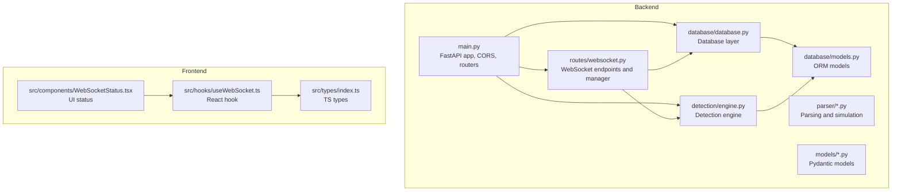
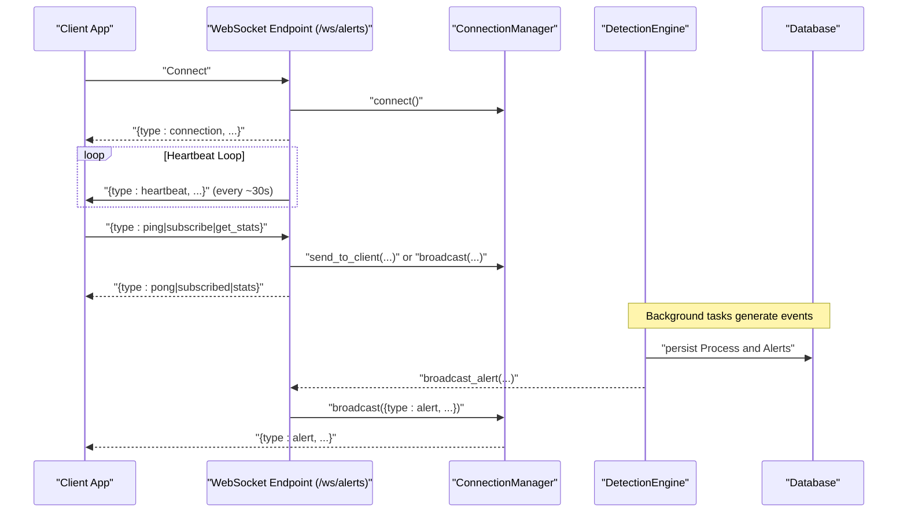
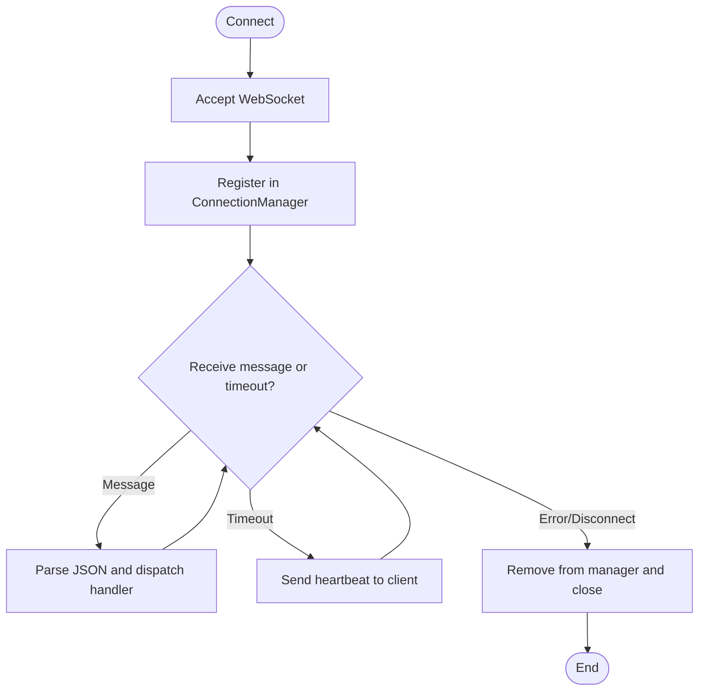
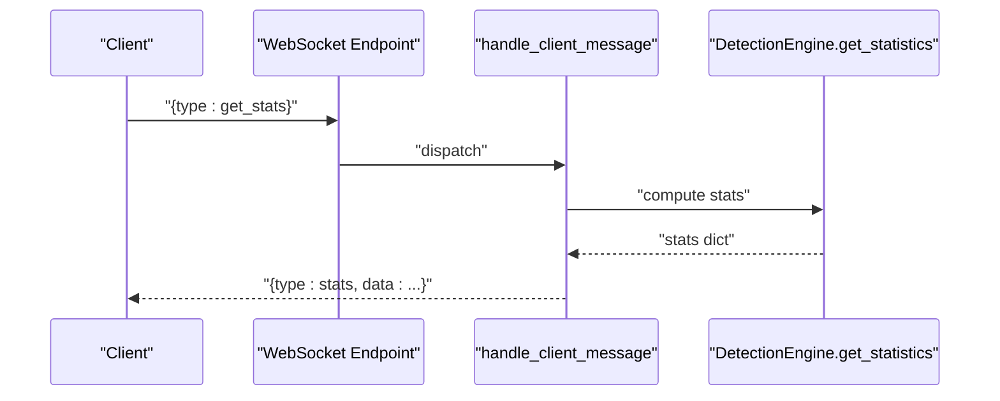
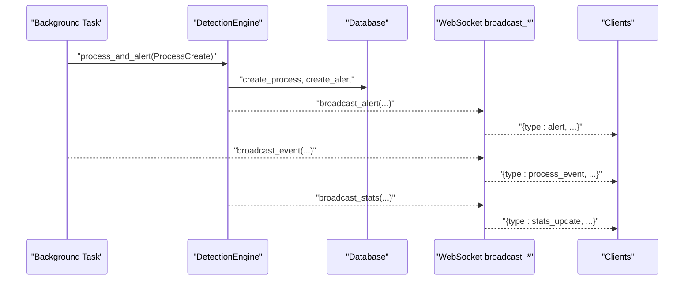
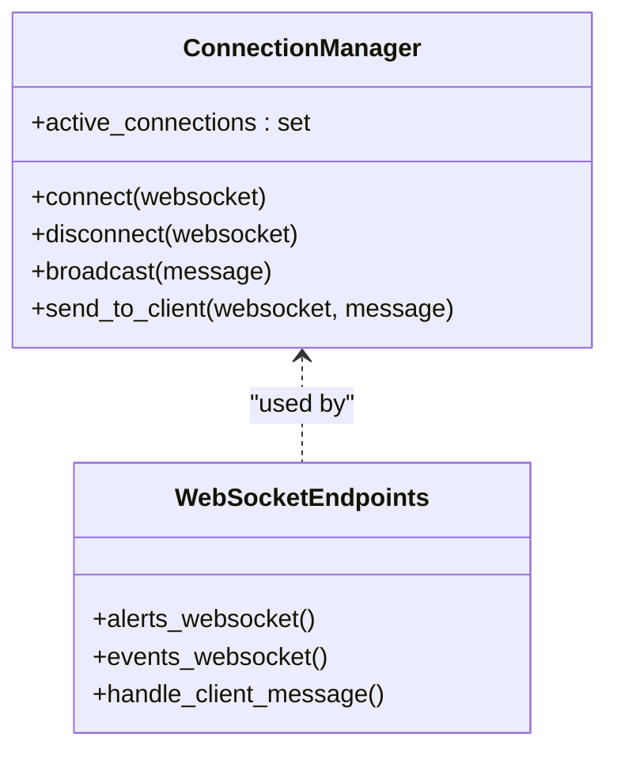
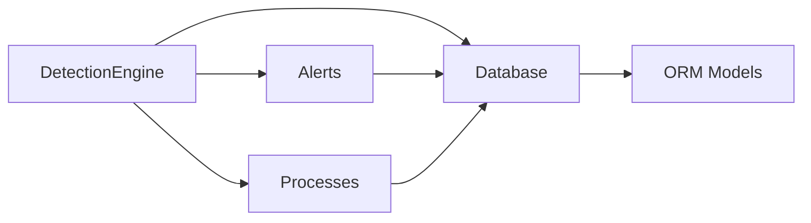
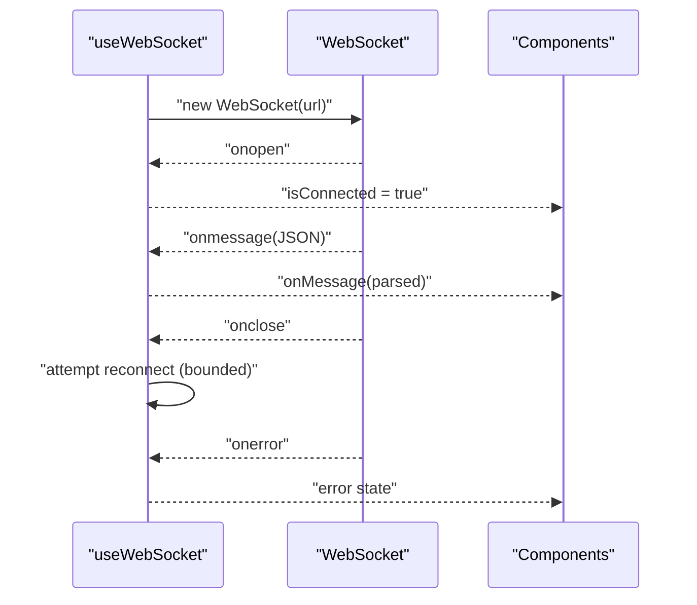
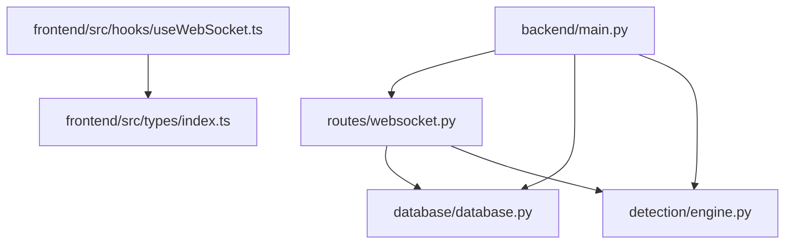

# WebSocket Communication

<cite>
**Referenced Files in This Document**
- [backend/routes/websocket.py](file://backend/routes/websocket.py)
- [backend/main.py](file://backend/main.py)
- [backend/database/database.py](file://backend/database/database.py)
- [backend/database/models.py](file://backend/database/models.py)
- [backend/detection/engine.py](file://backend/detection/engine.py)
- [backend/models/alert.py](file://backend/models/alert.py)
- [backend/models/process.py](file://backend/models/process.py)
- [backend/models/detection.py](file://backend/models/detection.py)
- [backend/parser/sysmon_parser.py](file://backend/parser/sysmon_parser.py)
- [backend/parser/log_simulator.py](file://backend/parser/log_simulator.py)
- [frontend/src/hooks/useWebSocket.ts](file://frontend/src/hooks/useWebSocket.ts)
- [frontend/src/types/index.ts](file://frontend/src/types/index.ts)
- [frontend/src/components/WebSocketStatus.tsx](file://frontend/src/components/WebSocketStatus.tsx)
</cite>

## Table of Contents
1. [Introduction](#introduction)
2. [Project Structure](#project-structure)
3. [Core Components](#core-components)
4. [Architecture Overview](#architecture-overview)
5. [Detailed Component Analysis](#detailed-component-analysis)
6. [Dependency Analysis](#dependency-analysis)
7. [Performance Considerations](#performance-considerations)
8. [Troubleshooting Guide](#troubleshooting-guide)
9. [Conclusion](#conclusion)
10. [Appendices](#appendices)

## Introduction
This document explains the EDR Lite WebSocket communication system. It covers how real-time alerts and process events are streamed to clients, how connections are managed, how heartbeats and error recovery work, and how the system integrates with the detection engine and database. It also documents message formats, client-side integration patterns, and operational guidance for scaling and reliability.

## Project Structure
The WebSocket implementation resides in the backend under the routes module and is orchestrated by the main application. The frontend provides a reusable React hook and TypeScript types for WebSocket integration.

**Diagram sources**
- [backend/main.py:171-192](file://backend/main.py#L171-L192)
- [backend/routes/websocket.py:14](file://backend/routes/websocket.py#L14)
- [backend/database/database.py:21-84](file://backend/database/database.py#L21-L84)
- [backend/database/models.py:9-77](file://backend/database/models.py#L9-L77)
- [backend/detection/engine.py:64-120](file://backend/detection/engine.py#L64-L120)
- [frontend/src/hooks/useWebSocket.ts:13-103](file://frontend/src/hooks/useWebSocket.ts#L13-L103)
- [frontend/src/types/index.ts:78-83](file://frontend/src/types/index.ts#L78-L83)
- [frontend/src/components/WebSocketStatus.tsx:4-24](file://frontend/src/components/WebSocketStatus.tsx#L4-L24)

**Section sources**
- [backend/main.py:171-192](file://backend/main.py#L171-L192)
- [backend/routes/websocket.py:14](file://backend/routes/websocket.py#L14)

## Core Components
- ConnectionManager: Centralized management of active WebSocket connections, broadcasting to all clients, and per-client messaging with error handling and cleanup.
- WebSocket endpoints:
  - /ws/alerts: Streams live alerts and periodic heartbeats; supports client-initiated ping/pong and stats requests.
  - /ws/events: Streams live process events and periodic heartbeats; supports client-initiated ping/pong and stats requests.
- Broadcast functions: broadcast_alert, broadcast_event, broadcast_stats invoked from the main application loop and ingestion pipeline.
- Client integration: React hook useWebSocket provides connection lifecycle, reconnection, and message parsing; TypeScript types define message shapes.

**Section sources**
- [backend/routes/websocket.py:21-65](file://backend/routes/websocket.py#L21-L65)
- [backend/routes/websocket.py:68-167](file://backend/routes/websocket.py#L68-L167)
- [backend/routes/websocket.py:209-233](file://backend/routes/websocket.py#L209-L233)
- [frontend/src/hooks/useWebSocket.ts:13-103](file://frontend/src/hooks/useWebSocket.ts#L13-L103)
- [frontend/src/types/index.ts:78-83](file://frontend/src/types/index.ts#L78-L83)

## Architecture Overview
The WebSocket subsystem is built around two endpoints and a shared manager. The application lifecycle creates simulated or real events, runs detection, persists data, and broadcasts updates to WebSocket clients.

**Diagram sources**
- [backend/routes/websocket.py:68-167](file://backend/routes/websocket.py#L68-L167)
- [backend/routes/websocket.py:21-65](file://backend/routes/websocket.py#L21-L65)
- [backend/detection/engine.py:272-291](file://backend/detection/engine.py#L272-L291)
- [backend/database/database.py:86-216](file://backend/database/database.py#L86-L216)

## Detailed Component Analysis

### Connection Management and Lifecycle
- Acceptance and storage: On connect, the endpoint accepts the WebSocket and registers it with the manager.
- Disconnection: The manager removes disconnected sockets and logs the current connection count.
- Heartbeat: When no inbound message is received within a timeout, the server sends a heartbeat to keep the connection alive.
- Error handling: Exceptions during message handling or timeouts lead to disconnection and cleanup.

**Diagram sources**
- [backend/routes/websocket.py:27-36](file://backend/routes/websocket.py#L27-L36)
- [backend/routes/websocket.py:89-118](file://backend/routes/websocket.py#L89-L118)

**Section sources**
- [backend/routes/websocket.py:27-36](file://backend/routes/websocket.py#L27-L36)
- [backend/routes/websocket.py:89-118](file://backend/routes/websocket.py#L89-L118)

### Client Subscription Handling and Message Types
- Supported client messages:
  - ping: Responds with a pong message.
  - subscribe: Acknowledges subscription; currently no channel filtering is implemented in the manager.
  - get_stats: Computes and returns system statistics from the detection engine.
- Server-to-client messages:
  - connection: Initial confirmation upon successful connection.
  - heartbeat: Periodic keepalive sent when the client is silent.
  - alert: Live alert stream.
  - process_event: Live process event stream.
  - stats_update: Periodic system statistics update broadcast.
  - error: Error responses for invalid JSON or unknown message types.

**Diagram sources**
- [backend/routes/websocket.py:169-207](file://backend/routes/websocket.py#L169-L207)
- [backend/detection/engine.py:292-309](file://backend/detection/engine.py#L292-L309)

**Section sources**
- [backend/routes/websocket.py:169-207](file://backend/routes/websocket.py#L169-L207)

### Real-Time Event Streaming
- Alerts: Generated by the detection engine and broadcast to all clients.
- Process events: Emitted when a process is created and broadcast to all clients.
- Statistics: Periodic updates broadcast to clients.

**Diagram sources**
- [backend/main.py:60-118](file://backend/main.py#L60-L118)
- [backend/detection/engine.py:272-291](file://backend/detection/engine.py#L272-L291)
- [backend/database/database.py:86-216](file://backend/database/database.py#L86-L216)
- [backend/routes/websocket.py:209-233](file://backend/routes/websocket.py#L209-L233)

**Section sources**
- [backend/main.py:60-118](file://backend/main.py#L60-L118)
- [backend/routes/websocket.py:209-233](file://backend/routes/websocket.py#L209-L233)

### Broadcast Functions and Filtering
- broadcast_alert: Sends alert payloads to all connected clients.
- broadcast_event: Sends process event payloads to all clients.
- broadcast_stats: Sends system statistics updates to all clients.
- Filtering: No client-side filtering is implemented in the manager; all clients receive all broadcasts.

**Diagram sources**
- [backend/routes/websocket.py:21-65](file://backend/routes/websocket.py#L21-L65)
- [backend/routes/websocket.py:68-167](file://backend/routes/websocket.py#L68-L167)

**Section sources**
- [backend/routes/websocket.py:21-65](file://backend/routes/websocket.py#L21-L65)
- [backend/routes/websocket.py:209-233](file://backend/routes/websocket.py#L209-L233)

### Integration with Detection Engine and Database
- DetectionEngine:
  - Analyzes process events against detection rules.
  - Tracks statistics and frequency anomalies.
  - Persists process and alert records to the database.
- Database:
  - Provides synchronous and asynchronous sessions.
  - Stores processes and alerts with indices for efficient queries.
- Ingestion pipeline:
  - Background simulation generates events and invokes DetectionEngine.
  - Manual ingestion endpoint also triggers detection and broadcasting.

**Diagram sources**
- [backend/detection/engine.py:64-120](file://backend/detection/engine.py#L64-L120)
- [backend/database/database.py:86-216](file://backend/database/database.py#L86-L216)
- [backend/database/models.py:9-77](file://backend/database/models.py#L9-L77)

**Section sources**
- [backend/detection/engine.py:272-291](file://backend/detection/engine.py#L272-L291)
- [backend/database/database.py:86-216](file://backend/database/database.py#L86-L216)
- [backend/database/models.py:9-77](file://backend/database/models.py#L9-L77)

### Client-Side WebSocket Integration
- React hook useWebSocket:
  - Creates a WebSocket with automatic protocol selection (ws/wss).
  - Handles onopen/onclose/onerror/onmessage.
  - Implements exponential or bounded reconnection with configurable attempts and intervals.
  - Exposes sendMessage, connect, and disconnect utilities.
- TypeScript types:
  - WebSocketMessage defines the canonical message shape for server-to-client streams.
- UI component:
  - WebSocketStatus displays live/disconnected status using the hook.

**Diagram sources**
- [frontend/src/hooks/useWebSocket.ts:27-72](file://frontend/src/hooks/useWebSocket.ts#L27-L72)
- [frontend/src/types/index.ts:78-83](file://frontend/src/types/index.ts#L78-L83)
- [frontend/src/components/WebSocketStatus.tsx:4-24](file://frontend/src/components/WebSocketStatus.tsx#L4-L24)

**Section sources**
- [frontend/src/hooks/useWebSocket.ts:13-103](file://frontend/src/hooks/useWebSocket.ts#L13-L103)
- [frontend/src/types/index.ts:78-83](file://frontend/src/types/index.ts#L78-L83)
- [frontend/src/components/WebSocketStatus.tsx:4-24](file://frontend/src/components/WebSocketStatus.tsx#L4-L24)

## Dependency Analysis
- Backend depends on:
  - FastAPI for routing and lifespan management.
  - SQLAlchemy (sync and async) for database operations.
  - Detection engine for threat analysis and statistics.
  - Parser utilities for generating and transforming events.
- Frontend depends on:
  - React hooks and TypeScript types for type-safe WebSocket handling.

**Diagram sources**
- [backend/main.py:36-41](file://backend/main.py#L36-L41)
- [backend/routes/websocket.py:189-194](file://backend/routes/websocket.py#L189-L194)
- [frontend/src/hooks/useWebSocket.ts:13-20](file://frontend/src/hooks/useWebSocket.ts#L13-L20)

**Section sources**
- [backend/main.py:36-41](file://backend/main.py#L36-L41)
- [backend/routes/websocket.py:189-194](file://backend/routes/websocket.py#L189-L194)

## Performance Considerations
- Concurrency: Each client connection is handled concurrently by the ASGI server; the manager iterates over active connections for each broadcast.
- Backpressure: Broadcasting writes are attempted per connection; failed writes trigger cleanup of disconnected sockets.
- Heartbeats: Periodic heartbeat messages prevent idle timeouts and help detect dead peers.
- Scalability:
  - Horizontal scaling: Deploy behind a load balancer; ensure sticky sessions are not required for WebSocket traffic.
  - Connection limits: Tune server worker processes and connection limits according to hardware.
  - Database I/O: Batch writes and avoid long-running queries in the hot path.
  - Offload heavy analytics: Consider moving heavy computations off the main thread or using async I/O where feasible.

[No sources needed since this section provides general guidance]

## Troubleshooting Guide
- Connection fails:
  - Verify CORS configuration allows the frontend origin.
  - Confirm the WebSocket URL uses the correct scheme (ws/wss) and path.
- Frequent disconnects:
  - Check network stability and NAT/firewall configurations.
  - Review heartbeat behavior; ensure clients handle timeouts gracefully.
- No messages received:
  - Confirm the client sends a valid JSON message with a supported type.
  - Ensure the server is broadcasting alerts/process events (check detection engine and ingestion pipeline).
- Error messages:
  - Unknown message type or invalid JSON are reported back to the client; inspect client logs for details.
- Database connectivity:
  - Verify database initialization and table creation during startup.

**Section sources**
- [backend/main.py:179-186](file://backend/main.py#L179-L186)
- [backend/routes/websocket.py:101-106](file://backend/routes/websocket.py#L101-L106)
- [backend/database/database.py:71-74](file://backend/database/database.py#L71-L74)

## Conclusion
The EDR Lite WebSocket system provides a robust foundation for real-time monitoring of alerts and process events. It offers clean separation between connection management, message handling, and broadcasting, integrates tightly with the detection engine and database, and includes practical client-side utilities for reliable real-time UI updates. With careful deployment and monitoring, it scales to serve multiple concurrent clients efficiently.

[No sources needed since this section summarizes without analyzing specific files]

## Appendices

### Message Format Specifications
- Server-to-client message types:
  - connection: Initial connection confirmation.
  - heartbeat: Keepalive ping.
  - alert: Live alert payload.
  - process_event: Live process event payload.
  - stats_update: Periodic system statistics update.
  - error: Error response with message.
- Client-to-server message types:
  - ping: Request a pong response.
  - subscribe: Subscribe acknowledgment (channel parameter accepted but no filtering).
  - get_stats: Request current system statistics.

**Section sources**
- [backend/routes/websocket.py:81-86](file://backend/routes/websocket.py#L81-L86)
- [backend/routes/websocket.py:109-112](file://backend/routes/websocket.py#L109-L112)
- [backend/routes/websocket.py:173-177](file://backend/routes/websocket.py#L173-L177)
- [backend/routes/websocket.py:179-185](file://backend/routes/websocket.py#L179-L185)
- [backend/routes/websocket.py:187-200](file://backend/routes/websocket.py#L187-L200)
- [frontend/src/types/index.ts:78-83](file://frontend/src/types/index.ts#L78-L83)

### Client-Side Integration Examples
- React integration:
  - Use the hook to connect to /ws/alerts, handle onMessage to append alerts, and manage reconnection.
  - Display connection status using the WebSocketStatus component.
- Manual client:
  - Connect to wss://host/ws/alerts or ws://host/ws/alerts depending on deployment.
  - Send JSON messages: { type: "ping" }, { type: "subscribe" }, { type: "get_stats" }.
  - Listen for JSON messages with type field indicating the message category.

**Section sources**
- [frontend/src/hooks/useWebSocket.ts:27-72](file://frontend/src/hooks/useWebSocket.ts#L27-L72)
- [frontend/src/components/WebSocketStatus.tsx:4-24](file://frontend/src/components/WebSocketStatus.tsx#L4-L24)
- [backend/main.py:534-561](file://backend/main.py#L534-L561)