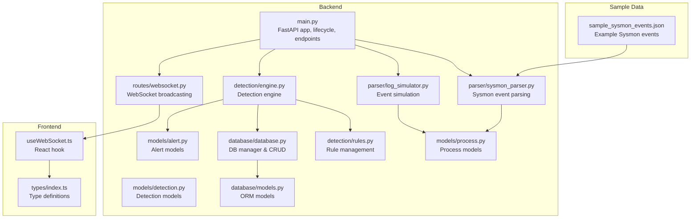
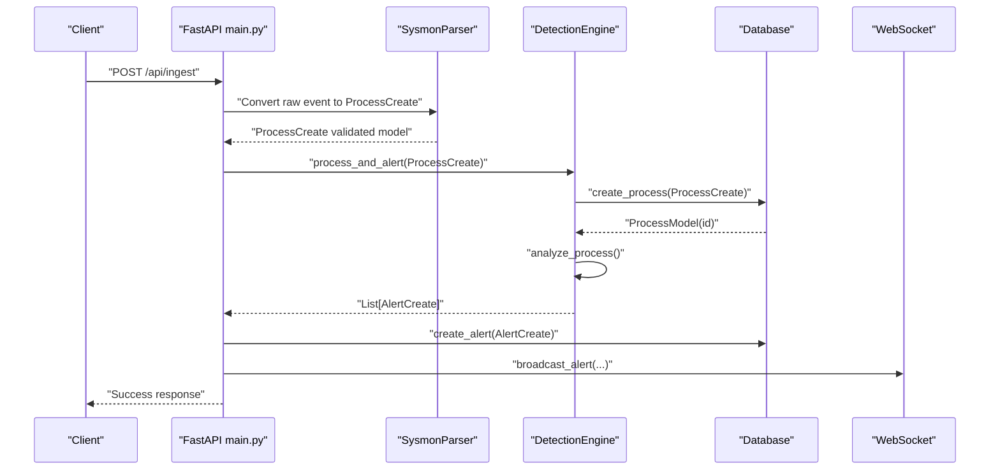
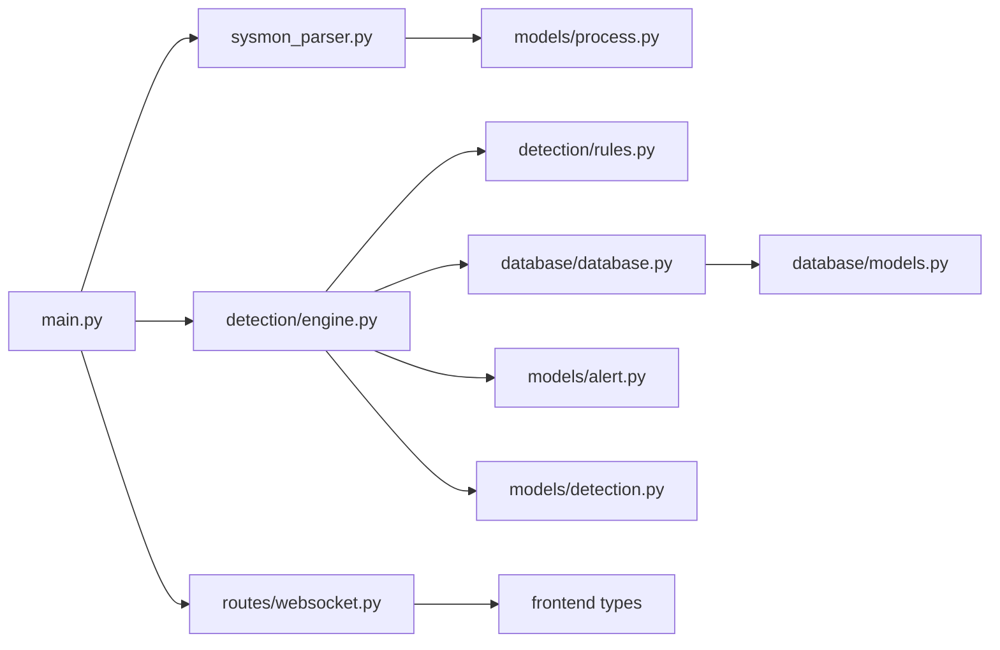

# Data Flow and Processing

<cite>
**Referenced Files in This Document**
- [backend/main.py](file://backend/main.py)
- [backend/parser/sysmon_parser.py](file://backend/parser/sysmon_parser.py)
- [backend/parser/log_simulator.py](file://backend/parser/log_simulator.py)
- [backend/models/process.py](file://backend/models/process.py)
- [backend/models/alert.py](file://backend/models/alert.py)
- [backend/models/detection.py](file://backend/models/detection.py)
- [backend/database/database.py](file://backend/database/database.py)
- [backend/database/models.py](file://backend/database/models.py)
- [backend/detection/engine.py](file://backend/detection/engine.py)
- [backend/detection/rules.py](file://backend/detection/rules.py)
- [backend/routes/websocket.py](file://backend/routes/websocket.py)
- [frontend/src/hooks/useWebSocket.ts](file://frontend/src/hooks/useWebSocket.ts)
- [frontend/src/types/index.ts](file://frontend/src/types/index.ts)
- [sample_data/sample_sysmon_events.json](file://sample_data/sample_sysmon_events.json)
</cite>

## Table of Contents
1. [Introduction](#introduction)
2. [Project Structure](#project-structure)
3. [Core Components](#core-components)
4. [Architecture Overview](#architecture-overview)
5. [Detailed Component Analysis](#detailed-component-analysis)
6. [Dependency Analysis](#dependency-analysis)
7. [Performance Considerations](#performance-considerations)
8. [Troubleshooting Guide](#troubleshooting-guide)
9. [Conclusion](#conclusion)
10. [Appendices](#appendices)

## Introduction
This document explains EDR Lite’s data flow architecture and processing pipeline. It covers the complete journey from Sysmon event ingestion, parsing, detection, database storage, and real-time presentation via WebSocket. It also documents validation rules, serialization formats, caching mechanisms, error handling, and performance strategies.

## Project Structure
The system is organized around a FastAPI backend with modular components for parsing, detection, database persistence, and WebSocket broadcasting. The frontend provides real-time dashboards and WebSocket consumers.

**Diagram sources**
- [backend/main.py:171-241](file://backend/main.py#L171-L241)
- [backend/parser/sysmon_parser.py:61-385](file://backend/parser/sysmon_parser.py#L61-L385)
- [backend/parser/log_simulator.py:18-315](file://backend/parser/log_simulator.py#L18-L315)
- [backend/models/process.py:6-44](file://backend/models/process.py#L6-L44)
- [backend/models/alert.py:7-55](file://backend/models/alert.py#L7-L55)
- [backend/models/detection.py:8-92](file://backend/models/detection.py#L8-L92)
- [backend/database/database.py:21-324](file://backend/database/database.py#L21-L324)
- [backend/database/models.py:9-77](file://backend/database/models.py#L9-L77)
- [backend/detection/engine.py:64-324](file://backend/detection/engine.py#L64-L324)
- [backend/detection/rules.py:273-480](file://backend/detection/rules.py#L273-L480)
- [backend/routes/websocket.py:21-233](file://backend/routes/websocket.py#L21-L233)
- [frontend/src/hooks/useWebSocket.ts:13-103](file://frontend/src/hooks/useWebSocket.ts#L13-L103)
- [frontend/src/types/index.ts:1-83](file://frontend/src/types/index.ts#L1-L83)
- [sample_data/sample_sysmon_events.json:1-194](file://sample_data/sample_sysmon_events.json#L1-L194)

**Section sources**
- [backend/main.py:171-241](file://backend/main.py#L171-L241)
- [backend/parser/sysmon_parser.py:61-385](file://backend/parser/sysmon_parser.py#L61-L385)
- [backend/parser/log_simulator.py:18-315](file://backend/parser/log_simulator.py#L18-L315)
- [backend/database/database.py:21-324](file://backend/database/database.py#L21-L324)
- [backend/detection/engine.py:64-324](file://backend/detection/engine.py#L64-L324)
- [backend/routes/websocket.py:21-233](file://backend/routes/websocket.py#L21-L233)
- [frontend/src/hooks/useWebSocket.ts:13-103](file://frontend/src/hooks/useWebSocket.ts#L13-L103)
- [frontend/src/types/index.ts:1-83](file://frontend/src/types/index.ts#L1-L83)
- [sample_data/sample_sysmon_events.json:1-194](file://sample_data/sample_sysmon_events.json#L1-L194)

## Core Components
- FastAPI application with lifecycle management, CORS, and routing.
- Sysmon parser supporting EVTX, XML, and JSON formats.
- Log simulator for generating synthetic events and batches.
- Detection engine with rule-based evaluation and frequency tracking.
- Database manager with ORM models for processes and alerts.
- WebSocket broadcaster for real-time alert and event streams.
- Frontend WebSocket consumer and typed models.

**Section sources**
- [backend/main.py:171-241](file://backend/main.py#L171-L241)
- [backend/parser/sysmon_parser.py:61-385](file://backend/parser/sysmon_parser.py#L61-L385)
- [backend/parser/log_simulator.py:18-315](file://backend/parser/log_simulator.py#L18-L315)
- [backend/detection/engine.py:64-324](file://backend/detection/engine.py#L64-L324)
- [backend/database/database.py:21-324](file://backend/database/database.py#L21-L324)
- [backend/routes/websocket.py:21-233](file://backend/routes/websocket.py#L21-L233)
- [frontend/src/hooks/useWebSocket.ts:13-103](file://frontend/src/hooks/useWebSocket.ts#L13-L103)

## Architecture Overview
The system follows a pipeline: ingestion → parsing → validation → detection → persistence → real-time broadcast.

**Diagram sources**
- [backend/main.py:243-311](file://backend/main.py#L243-L311)
- [backend/parser/sysmon_parser.py:257-294](file://backend/parser/sysmon_parser.py#L257-L294)
- [backend/detection/engine.py:272-290](file://backend/detection/engine.py#L272-L290)
- [backend/database/database.py:86-200](file://backend/database/database.py#L86-L200)
- [backend/routes/websocket.py:209-215](file://backend/routes/websocket.py#L209-L215)

## Detailed Component Analysis

### Sysmon Event Parsing
- Supports multiple formats: EVTX (requires python-evtx), XML, and JSON.
- Normalizes fields to a unified structure and extracts hashes and timestamps.
- Provides streaming and batch parsing capabilities.

Key behaviors:
- Field mapping and timestamp normalization.
- Error handling and statistics collection.
- Output conversion to a normalized event object.

**Section sources**
- [backend/parser/sysmon_parser.py:61-385](file://backend/parser/sysmon_parser.py#L61-L385)

### Process Model Validation and Transformation
- ProcessCreate validates and enriches incoming event data with timestamps and optional metadata.
- ProcessEvent adds database identifiers and timestamps.
- ProcessTreeNode supports visualization of process trees.

Validation rules:
- Non-empty process and parent names.
- Numeric IDs converted safely.
- Timestamp defaults to UTC now.

**Section sources**
- [backend/models/process.py:6-44](file://backend/models/process.py#L6-L44)

### Detection Engine Evaluation
- Loads detection rules from defaults and files.
- Evaluates rules by type: parent-child, command line, frequency, behavior, anomaly.
- Tracks frequency anomalies per parent process.
- Produces DetectionResult objects with confidence and risk scores.

Processing logic:
- Parent-child rule checks both parent and child process names.
- Command line rule supports regex and substring matching.
- Frequency rule computes counts in configurable windows.
- Behavior and anomaly placeholders for future ML-based detection.

**Section sources**
- [backend/detection/engine.py:64-324](file://backend/detection/engine.py#L64-L324)
- [backend/models/detection.py:8-92](file://backend/models/detection.py#L8-L92)
- [backend/detection/rules.py:273-480](file://backend/detection/rules.py#L273-L480)

### Alert Generation and Persistence
- Converts DetectionResult to AlertCreate with severity and risk score.
- Persists alerts to the database with JSON details.
- Provides statistics and filtering APIs.

Persistence details:
- Alerts stored with severity, description, risk score, and optional details.
- Acknowledgement flag and timestamps.

**Section sources**
- [backend/detection/engine.py:252-271](file://backend/detection/engine.py#L252-L271)
- [backend/models/alert.py:7-55](file://backend/models/alert.py#L7-L55)
- [backend/database/database.py:184-215](file://backend/database/database.py#L184-L215)

### Database Operations
- Asynchronous and synchronous engines for SQLite.
- ORM models for processes and alerts.
- CRUD operations with filtering, pagination, and aggregation.
- Cleanup of old data and statistics queries.

Operations:
- Create process and alert records.
- Retrieve recent processes and alerts.
- Aggregate alert counts by severity and hourly distribution.

**Section sources**
- [backend/database/database.py:21-324](file://backend/database/database.py#L21-L324)
- [backend/database/models.py:9-77](file://backend/database/models.py#L9-L77)

### WebSocket Broadcasting System
- Manages active connections and broadcasts to clients.
- Streams alerts and process events in real time.
- Handles heartbeats and client messages.

Client integration:
- React hook manages connection lifecycle, reconnection, and message parsing.
- Types define message shapes for alerts, events, and stats.

**Section sources**
- [backend/routes/websocket.py:21-233](file://backend/routes/websocket.py#L21-L233)
- [frontend/src/hooks/useWebSocket.ts:13-103](file://frontend/src/hooks/useWebSocket.ts#L13-L103)
- [frontend/src/types/index.ts:78-83](file://frontend/src/types/index.ts#L78-L83)

### Simulation Mode and Batch Ingestion
- Background task generates synthetic events at intervals.
- Manual ingestion endpoint accepts Sysmon-formatted events.
- Batch simulation endpoint creates multiple events and ingests them.

**Section sources**
- [backend/main.py:60-118](file://backend/main.py#L60-L118)
- [backend/main.py:243-336](file://backend/main.py#L243-L336)
- [backend/parser/log_simulator.py:18-315](file://backend/parser/log_simulator.py#L18-L315)

### Example Data Flows and Edge Cases
- Typical flow: Sysmon event → Parser → ProcessCreate → DetectionEngine → Alerts → Database → WebSocket broadcast.
- Edge cases handled: missing fields, invalid numeric IDs, unsupported timestamp formats, rule evaluation exceptions, WebSocket send failures.

**Section sources**
- [backend/main.py:243-311](file://backend/main.py#L243-L311)
- [backend/parser/sysmon_parser.py:339-365](file://backend/parser/sysmon_parser.py#L339-L365)
- [backend/detection/engine.py:109-111](file://backend/detection/engine.py#L109-L111)
- [backend/routes/websocket.py:44-53](file://backend/routes/websocket.py#L44-L53)

## Dependency Analysis
The system exhibits clear separation of concerns with explicit dependencies:

**Diagram sources**
- [backend/main.py:37-41](file://backend/main.py#L37-L41)
- [backend/detection/engine.py:16-18](file://backend/detection/engine.py#L16-L18)
- [backend/database/database.py:11-12](file://backend/database/database.py#L11-L12)
- [backend/parser/sysmon_parser.py:14-16](file://backend/parser/sysmon_parser.py#L14-L16)
- [backend/models/process.py:1-3](file://backend/models/process.py#L1-L3)
- [backend/models/alert.py:1-4](file://backend/models/alert.py#L1-L4)
- [backend/models/detection.py:1-5](file://backend/models/detection.py#L1-L5)
- [backend/routes/websocket.py:12-14](file://backend/routes/websocket.py#L12-L14)

**Section sources**
- [backend/main.py:37-41](file://backend/main.py#L37-L41)
- [backend/detection/engine.py:16-18](file://backend/detection/engine.py#L16-L18)
- [backend/database/database.py:11-12](file://backend/database/database.py#L11-L12)
- [backend/parser/sysmon_parser.py:14-16](file://backend/parser/sysmon_parser.py#L14-L16)
- [backend/models/process.py:1-3](file://backend/models/process.py#L1-L3)
- [backend/models/alert.py:1-4](file://backend/models/alert.py#L1-L4)
- [backend/models/detection.py:1-5](file://backend/models/detection.py#L1-L5)
- [backend/routes/websocket.py:12-14](file://backend/routes/websocket.py#L12-L14)

## Performance Considerations
- Asynchronous database sessions reduce blocking during I/O.
- Frequency tracking uses thread-safe deques with bounded windows to cap memory usage.
- Rule evaluation short-circuits on non-matching conditions.
- WebSocket broadcast cleans up disconnected clients automatically.
- SQLite with StaticPool reduces overhead for small deployments.

[No sources needed since this section provides general guidance]

## Troubleshooting Guide
Common issues and resolutions:
- Missing python-evtx: Install the library to enable EVTX parsing.
- WebSocket send failures: Automatic cleanup removes broken connections.
- Rule evaluation errors: Logged and skipped to prevent pipeline halts.
- Database write errors: Transactions committed per operation; verify connectivity and permissions.
- Frontend reconnection: Hook retries with exponential backoff until attempts exhausted.

**Section sources**
- [backend/parser/sysmon_parser.py:102-106](file://backend/parser/sysmon_parser.py#L102-L106)
- [backend/routes/websocket.py:44-53](file://backend/routes/websocket.py#L44-L53)
- [backend/detection/engine.py:109-111](file://backend/detection/engine.py#L109-L111)
- [backend/database/database.py:196-200](file://backend/database/database.py#L196-L200)
- [frontend/src/hooks/useWebSocket.ts:46-52](file://frontend/src/hooks/useWebSocket.ts#L46-L52)

## Conclusion
EDR Lite implements a robust, modular pipeline for Sysmon event processing. It validates and parses events, applies configurable detection rules, persists data efficiently, and streams insights in real time. The architecture balances simplicity and extensibility, enabling rule customization, simulation, and scalable WebSocket broadcasting.

[No sources needed since this section summarizes without analyzing specific files]

## Appendices

### Data Validation Rules
- ProcessCreate enforces non-empty process and parent names, numeric IDs, and optional user/computer fields.
- DetectionRule compiles regex patterns lazily and supports substring matching.
- SysmonParser normalizes timestamps and extracts MD5/SHA256 hashes.

**Section sources**
- [backend/models/process.py:6-19](file://backend/models/process.py#L6-L19)
- [backend/models/detection.py:46-79](file://backend/models/detection.py#L46-L79)
- [backend/parser/sysmon_parser.py:296-327](file://backend/parser/sysmon_parser.py#L296-L327)

### Serialization Formats
- Events: JSON with EventID, TimeCreated, Computer, and EventData.
- Alerts: JSON with severity, risk_score, description, and optional details.
- WebSocket messages: JSON with type, data, and timestamp.

**Section sources**
- [sample_data/sample_sysmon_events.json:1-194](file://sample_data/sample_sysmon_events.json#L1-L194)
- [backend/models/alert.py:24-37](file://backend/models/alert.py#L24-L37)
- [backend/routes/websocket.py:78-118](file://backend/routes/websocket.py#L78-L118)

### Caching Mechanisms
- FrequencyTracker maintains sliding windows per parent process to detect anomalies.
- No external cache is used; in-memory deques serve as the cache layer.

**Section sources**
- [backend/detection/engine.py:23-61](file://backend/detection/engine.py#L23-L61)