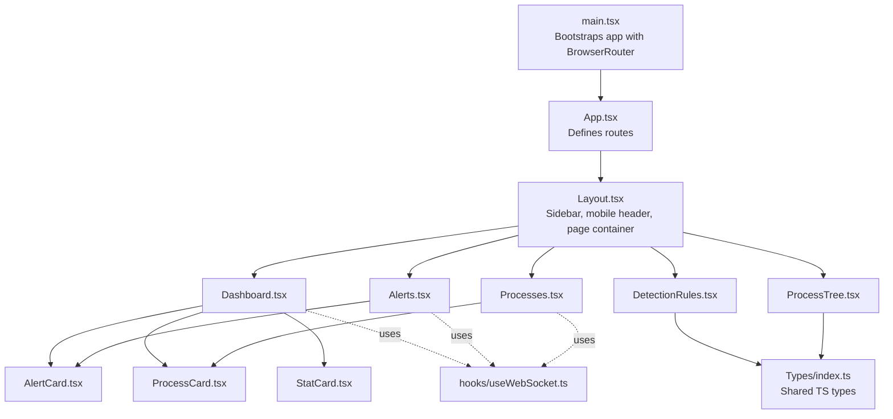
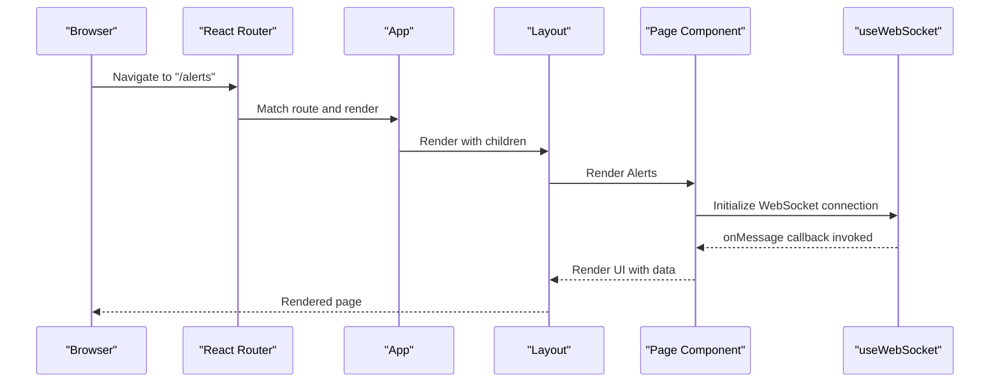
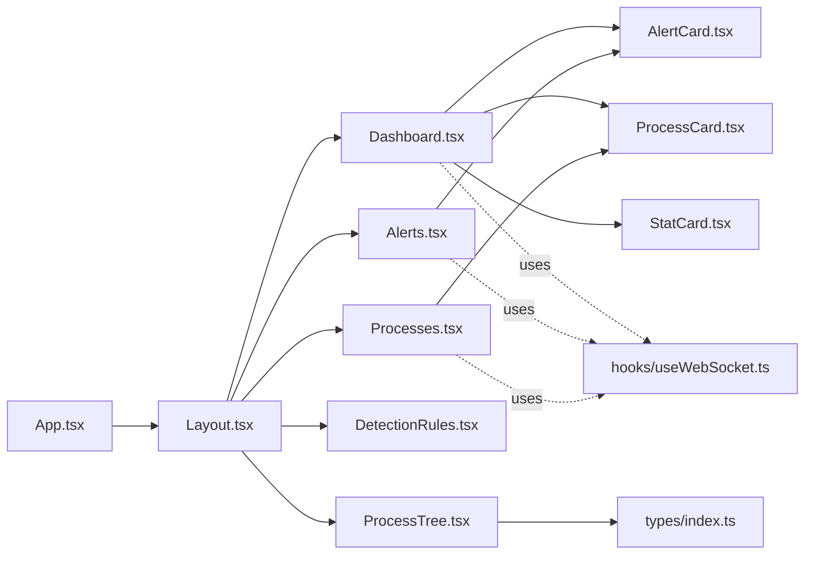

# Component Architecture

<cite>
**Referenced Files in This Document**
- [App.tsx](file://frontend/src/App.tsx)
- [Layout.tsx](file://frontend/src/components/Layout.tsx)
- [main.tsx](file://frontend/src/main.tsx)
- [Dashboard.tsx](file://frontend/src/pages/Dashboard.tsx)
- [Alerts.tsx](file://frontend/src/pages/Alerts.tsx)
- [Processes.tsx](file://frontend/src/pages/Processes.tsx)
- [DetectionRules.tsx](file://frontend/src/pages/DetectionRules.tsx)
- [ProcessTree.tsx](file://frontend/src/pages/ProcessTree.tsx)
- [AlertCard.tsx](file://frontend/src/components/AlertCard.tsx)
- [ProcessCard.tsx](file://frontend/src/components/ProcessCard.tsx)
- [StatCard.tsx](file://frontend/src/components/StatCard.tsx)
- [useWebSocket.ts](file://frontend/src/hooks/useWebSocket.ts)
- [index.ts](file://frontend/src/types/index.ts)
- [package.json](file://frontend/package.json)
- [tsconfig.json](file://frontend/tsconfig.json)
</cite>

## Table of Contents
1. [Introduction](#introduction)
2. [Project Structure](#project-structure)
3. [Core Components](#core-components)
4. [Architecture Overview](#architecture-overview)
5. [Detailed Component Analysis](#detailed-component-analysis)
6. [Dependency Analysis](#dependency-analysis)
7. [Performance Considerations](#performance-considerations)
8. [Troubleshooting Guide](#troubleshooting-guide)
9. [Conclusion](#conclusion)

## Introduction
This document explains the React component architecture of EDR Lite’s frontend. It focuses on the main App component and routing via React Router, the Layout component pattern that wraps all pages, and the component hierarchy from App → Layout → individual page components. It also covers prop passing strategies, the use of a custom WebSocket hook, lifecycle management, error handling, performance techniques, and TypeScript integration.

## Project Structure
The frontend is organized around a small set of pages, shared components, a layout wrapper, a custom hook for WebSocket communication, and a centralized types module. Routing is configured at the root App level and rendered inside the Layout wrapper.

**Diagram sources**
- [main.tsx:1-13](file://frontend/src/main.tsx#L1-L13)
- [App.tsx:1-23](file://frontend/src/App.tsx#L1-L23)
- [Layout.tsx:1-110](file://frontend/src/components/Layout.tsx#L1-L110)
- [Dashboard.tsx:1-208](file://frontend/src/pages/Dashboard.tsx#L1-L208)
- [Alerts.tsx:1-242](file://frontend/src/pages/Alerts.tsx#L1-L242)
- [Processes.tsx:1-136](file://frontend/src/pages/Processes.tsx#L1-L136)
- [DetectionRules.tsx:1-271](file://frontend/src/pages/DetectionRules.tsx#L1-L271)
- [ProcessTree.tsx:1-130](file://frontend/src/pages/ProcessTree.tsx#L1-L130)
- [AlertCard.tsx:1-69](file://frontend/src/components/AlertCard.tsx#L1-L69)
- [ProcessCard.tsx:1-57](file://frontend/src/components/ProcessCard.tsx#L1-L57)
- [StatCard.tsx:1-41](file://frontend/src/components/StatCard.tsx#L1-L41)
- [useWebSocket.ts:1-103](file://frontend/src/hooks/useWebSocket.ts#L1-L103)
- [index.ts:1-83](file://frontend/src/types/index.ts#L1-L83)

**Section sources**
- [main.tsx:1-13](file://frontend/src/main.tsx#L1-L13)
- [App.tsx:1-23](file://frontend/src/App.tsx#L1-L23)
- [Layout.tsx:1-110](file://frontend/src/components/Layout.tsx#L1-L110)

## Core Components
- App: Declares routes and renders the Layout wrapper.
- Layout: Provides global navigation, responsive sidebar, and page container for children.
- Pages: Dashboard, Alerts, Processes, DetectionRules, ProcessTree.
- Shared Components: AlertCard, ProcessCard, StatCard.
- Hook: useWebSocket encapsulates WebSocket lifecycle and reconnection logic.
- Types: Centralized TypeScript interfaces for API responses and domain models.

Key TypeScript integration highlights:
- Strict compiler options enable strong typing across components and hooks.
- Props for shared components are typed via interfaces.
- API client usage relies on typed responses from the backend.

**Section sources**
- [App.tsx:9-21](file://frontend/src/App.tsx#L9-L21)
- [Layout.tsx:14-16](file://frontend/src/components/Layout.tsx#L14-L16)
- [AlertCard.tsx:5-9](file://frontend/src/components/AlertCard.tsx#L5-L9)
- [ProcessCard.tsx:5-8](file://frontend/src/components/ProcessCard.tsx#L5-L8)
- [StatCard.tsx:3-12](file://frontend/src/components/StatCard.tsx#L3-L12)
- [useWebSocket.ts:4-11](file://frontend/src/hooks/useWebSocket.ts#L4-L11)
- [index.ts:1-83](file://frontend/src/types/index.ts#L1-L83)
- [tsconfig.json:1-25](file://frontend/tsconfig.json#L1-L25)

## Architecture Overview
The application follows a straightforward composition pattern:
- main.tsx initializes the router and mounts App.
- App defines static and dynamic routes and passes page components as children to Layout.
- Layout manages global UI (sidebar, mobile header) and renders the outlet content supplied by React Router.
- Pages fetch data, manage local state, and render shared components.
- A custom hook abstracts WebSocket connectivity and message handling.

**Diagram sources**
- [main.tsx:7-12](file://frontend/src/main.tsx#L7-L12)
- [App.tsx:10-20](file://frontend/src/App.tsx#L10-L20)
- [Layout.tsx:25-110](file://frontend/src/components/Layout.tsx#L25-L110)
- [Alerts.tsx:47-58](file://frontend/src/pages/Alerts.tsx#L47-L58)
- [useWebSocket.ts:13-72](file://frontend/src/hooks/useWebSocket.ts#L13-L72)

## Detailed Component Analysis

### App Component and Routing
- Defines five routes: home, alerts, processes, detection rules, and process tree with a dynamic parameter.
- Wraps all routes with Layout so the global navigation and page container are always present.
- Uses React Router v6 semantics for route definition and outlet rendering.

Routing configuration summary:
- "/" → Dashboard
- "/alerts" → Alerts
- "/processes" → Processes
- "/rules" → DetectionRules
- "/process-tree/:id" → ProcessTree (dynamic segment)

There are no route guards in the current implementation; navigation is open and unauthenticated.

**Section sources**
- [App.tsx:1-23](file://frontend/src/App.tsx#L1-L23)

### Layout Component Pattern
- Accepts children via a typed prop interface.
- Manages a responsive sidebar with navigation items and active state based on current location.
- Renders a mobile header with a hamburger menu to toggle the sidebar.
- Embeds WebSocketStatus inside the sidebar footer area.
- Provides a main content area that renders the routed page.

Composition strategy:
- Children are passed directly from App to Layout and then rendered inside the main content region.
- No prop drilling occurs because the sidebar and header are self-contained and do not require props from page components.

**Section sources**
- [Layout.tsx:14-16](file://frontend/src/components/Layout.tsx#L14-L16)
- [Layout.tsx:18-23](file://frontend/src/components/Layout.tsx#L18-L23)
- [Layout.tsx:25-110](file://frontend/src/components/Layout.tsx#L25-L110)

### Dashboard Page
- Fetches system stats, recent alerts, and recent processes concurrently.
- Subscribes to real-time updates via WebSocket and updates lists reactively.
- Supports manual refresh and simulated event generation.
- Renders StatCard components for metrics and AlertCard/ProcessCard for lists.

Lifecycle management:
- Uses effect to load data on mount and sets up a periodic refresh.
- Uses cleanup to clear intervals.

Propagation:
- Passes acknowledge handler to AlertCard.
- Uses shared components without further prop drilling.

**Section sources**
- [Dashboard.tsx:18-66](file://frontend/src/pages/Dashboard.tsx#L18-L66)
- [Dashboard.tsx:46-52](file://frontend/src/pages/Dashboard.tsx#L46-L52)
- [Dashboard.tsx:117-205](file://frontend/src/pages/Dashboard.tsx#L117-L205)

### Alerts Page
- Implements filtering by severity and acknowledgment status, pagination, and bulk actions.
- Subscribes to alerts WebSocket stream and updates the list in real time.
- Supports single and bulk acknowledgment and deletion.

Lifecycle management:
- Loads data on mount and reacts to filter/page changes.

**Section sources**
- [Alerts.tsx:11-62](file://frontend/src/pages/Alerts.tsx#L11-L62)
- [Alerts.tsx:47-58](file://frontend/src/pages/Alerts.tsx#L47-L58)
- [Alerts.tsx:146-241](file://frontend/src/pages/Alerts.tsx#L146-L241)

### Processes Page
- Supports search and pagination for process events.
- Subscribes to process events WebSocket stream.
- Renders each process with ProcessCard.

Lifecycle management:
- Loads data on mount and reacts to search and pagination changes.

**Section sources**
- [Processes.tsx:8-45](file://frontend/src/pages/Processes.tsx#L8-L45)
- [Processes.tsx:31-41](file://frontend/src/pages/Processes.tsx#L31-L41)
- [Processes.tsx:53-135](file://frontend/src/pages/Processes.tsx#L53-L135)

### DetectionRules Page
- Loads detection rules and statistics concurrently.
- Supports enabling/disabling rules, deletion, and rule testing.
- Includes modal placeholders for create/edit flows.

Lifecycle management:
- Loads data on mount.

**Section sources**
- [DetectionRules.tsx:6-32](file://frontend/src/pages/DetectionRules.tsx#L6-L32)
- [DetectionRules.tsx:80-271](file://frontend/src/pages/DetectionRules.tsx#L80-L271)

### ProcessTree Page
- Reads a dynamic route parameter and loads a process tree.
- Renders a hierarchical tree with indentation and suspicious highlighting.
- Handles loading, error, and empty states.

Lifecycle management:
- Uses effect to load data when the parameter changes.

**Section sources**
- [ProcessTree.tsx:7-30](file://frontend/src/pages/ProcessTree.tsx#L7-L30)
- [ProcessTree.tsx:32-82](file://frontend/src/pages/ProcessTree.tsx#L32-L82)
- [ProcessTree.tsx:106-130](file://frontend/src/pages/ProcessTree.tsx#L106-L130)

### Shared Components
- AlertCard: Displays alert details, severity, and optional action buttons. Props are strongly typed.
- ProcessCard: Displays process info with optional suspicious highlighting.
- StatCard: Generic metric card with icon and optional trend indicator.

Composition:
- These components are reused across pages and receive data via props without requiring context.

**Section sources**
- [AlertCard.tsx:18-69](file://frontend/src/components/AlertCard.tsx#L18-L69)
- [ProcessCard.tsx:10-57](file://frontend/src/components/ProcessCard.tsx#L10-L57)
- [StatCard.tsx:22-41](file://frontend/src/components/StatCard.tsx#L22-L41)

### WebSocket Hook (useWebSocket)
- Encapsulates connection lifecycle, message parsing, and reconnection logic.
- Exposes connection state, error, send function, and lifecycle controls.
- Integrates with pages via callbacks for real-time updates.

Usage patterns:
- Pages pass a URL and an onMessage handler to subscribe to streams.
- The hook handles protocol selection, automatic reconnect, and cleanup.

**Section sources**
- [useWebSocket.ts:13-103](file://frontend/src/hooks/useWebSocket.ts#L13-L103)
- [Dashboard.tsx:55-58](file://frontend/src/pages/Dashboard.tsx#L55-L58)
- [Alerts.tsx:55-58](file://frontend/src/pages/Alerts.tsx#L55-L58)
- [Processes.tsx:38-41](file://frontend/src/pages/Processes.tsx#L38-L41)

### TypeScript Integration
- Strict compiler options enforce type safety across components and hooks.
- Props for shared components are defined with explicit interfaces.
- Domain models are centralized in a single types module for reuse.

Best practices observed:
- Interfaces model API payloads and domain entities.
- Enum-like unions constrain string literals for severity and rule types.
- Optional fields are clearly marked in types.

**Section sources**
- [tsconfig.json:2-17](file://frontend/tsconfig.json#L2-L17)
- [index.ts:1-83](file://frontend/src/types/index.ts#L1-L83)

## Dependency Analysis
The component graph shows clear separation of concerns:
- App depends on Layout and page components.
- Pages depend on shared components and the WebSocket hook.
- Shared components depend on types.
- The hook depends on types and browser APIs.

**Diagram sources**
- [App.tsx:1-23](file://frontend/src/App.tsx#L1-L23)
- [Layout.tsx:1-110](file://frontend/src/components/Layout.tsx#L1-L110)
- [Dashboard.tsx:1-208](file://frontend/src/pages/Dashboard.tsx#L1-L208)
- [Alerts.tsx:1-242](file://frontend/src/pages/Alerts.tsx#L1-L242)
- [Processes.tsx:1-136](file://frontend/src/pages/Processes.tsx#L1-L136)
- [DetectionRules.tsx:1-271](file://frontend/src/pages/DetectionRules.tsx#L1-L271)
- [ProcessTree.tsx:1-130](file://frontend/src/pages/ProcessTree.tsx#L1-L130)
- [AlertCard.tsx:1-69](file://frontend/src/components/AlertCard.tsx#L1-L69)
- [ProcessCard.tsx:1-57](file://frontend/src/components/ProcessCard.tsx#L1-L57)
- [StatCard.tsx:1-41](file://frontend/src/components/StatCard.tsx#L1-L41)
- [useWebSocket.ts:1-103](file://frontend/src/hooks/useWebSocket.ts#L1-L103)
- [index.ts:1-83](file://frontend/src/types/index.ts#L1-L83)

**Section sources**
- [package.json:1-46](file://frontend/package.json#L1-L46)

## Performance Considerations
- Concurrent data fetching: Dashboard uses concurrent requests to reduce load time.
- Memoization: useCallback is used to stabilize handlers and reduce unnecessary re-renders.
- Efficient list rendering: Lists are paginated and filtered to avoid rendering large datasets.
- Minimal reflows: Tailwind utility classes are used for layout; avoid excessive inline styles.
- WebSocket batching: Real-time updates are handled efficiently via a single hook per stream.
- Cleanup: Effects clear intervals and timers; WebSocket hook cleans up connections on unmount.

Recommendations:
- Consider virtualizing long lists (e.g., Alerts, Processes) for very large datasets.
- Debounce search inputs to reduce API calls.
- Implement selective re-rendering with memoization for frequently updated lists.

**Section sources**
- [Dashboard.tsx:25-43](file://frontend/src/pages/Dashboard.tsx#L25-L43)
- [Alerts.tsx:21-45](file://frontend/src/pages/Alerts.tsx#L21-L45)
- [Processes.tsx:15-29](file://frontend/src/pages/Processes.tsx#L15-L29)
- [useWebSocket.ts:91-94](file://frontend/src/hooks/useWebSocket.ts#L91-L94)

## Troubleshooting Guide
Common issues and resolutions:
- WebSocket connection failures:
  - Verify backend WebSocket endpoint availability.
  - Check protocol selection (ws/wss) and host configuration.
  - Inspect error state returned by the hook.
- Route navigation problems:
  - Ensure routes match the defined paths in App.
  - Confirm Layout is wrapping all routes.
- Real-time updates not appearing:
  - Confirm onMessage handlers are wired correctly in pages.
  - Check that the correct WebSocket URL is used per stream.
- Type errors:
  - Validate props against the types module.
  - Ensure optional fields are handled safely.

**Section sources**
- [useWebSocket.ts:27-72](file://frontend/src/hooks/useWebSocket.ts#L27-L72)
- [Alerts.tsx:47-58](file://frontend/src/pages/Alerts.tsx#L47-L58)
- [Processes.tsx:31-41](file://frontend/src/pages/Processes.tsx#L31-L41)
- [index.ts:1-83](file://frontend/src/types/index.ts#L1-L83)

## Conclusion
EDR Lite’s frontend employs a clean, composable architecture:
- App defines routes and delegates rendering to Layout.
- Layout centralizes navigation and page container logic.
- Pages encapsulate domain logic, lifecycle, and UI rendering.
- Shared components promote reuse and type safety.
- A custom WebSocket hook abstracts real-time communication.
- TypeScript configuration enforces strong typing across the codebase.

This structure supports maintainability, scalability, and predictable behavior, with room to introduce route guards, global state, and advanced caching strategies as requirements evolve.