# Frontend Components

<cite>
**Referenced Files in This Document**
- [App.tsx](file://frontend/src/App.tsx)
- [main.tsx](file://frontend/src/main.tsx)
- [Layout.tsx](file://frontend/src/components/Layout.tsx)
- [AlertCard.tsx](file://frontend/src/components/AlertCard.tsx)
- [ProcessCard.tsx](file://frontend/src/components/ProcessCard.tsx)
- [StatCard.tsx](file://frontend/src/components/StatCard.tsx)
- [WebSocketStatus.tsx](file://frontend/src/components/WebSocketStatus.tsx)
- [useWebSocket.ts](file://frontend/src/hooks/useWebSocket.ts)
- [client.ts](file://frontend/src/api/client.ts)
- [Dashboard.tsx](file://frontend/src/pages/Dashboard.tsx)
- [Alerts.tsx](file://frontend/src/pages/Alerts.tsx)
- [Processes.tsx](file://frontend/src/pages/Processes.tsx)
- [DetectionRules.tsx](file://frontend/src/pages/DetectionRules.tsx)
- [ProcessTree.tsx](file://frontend/src/pages/ProcessTree.tsx)
- [index.ts](file://frontend/src/types/index.ts)
</cite>

## Table of Contents
1. [Introduction](#introduction)
2. [Project Structure](#project-structure)
3. [Core Components](#core-components)
4. [Architecture Overview](#architecture-overview)
5. [Detailed Component Analysis](#detailed-component-analysis)
6. [Dependency Analysis](#dependency-analysis)
7. [Performance Considerations](#performance-considerations)
8. [Troubleshooting Guide](#troubleshooting-guide)
9. [Conclusion](#conclusion)
10. [Appendices](#appendices)

## Introduction
This document describes the frontend component architecture of EDR Lite’s React and TypeScript application. It covers the component hierarchy starting from the main App component, routing via React Router, layout and navigation, page-level components for Dashboard, Alerts, Processes, Detection Rules, and Process Tree, real-time WebSocket integration using a custom hook, UI component library (AlertCard, ProcessCard, StatCard, WebSocketStatus), styling with TailwindCSS, TypeScript integration and type safety, and data-fetching patterns.

## Project Structure
The frontend is organized into:
- Entry point initializes the router and renders the app.
- Routing wraps pages inside a shared Layout component.
- Pages implement domain-specific UI and data fetching.
- Shared UI components encapsulate presentation logic.
- A custom WebSocket hook centralizes real-time connectivity.
- An API client module abstracts HTTP requests.
- Strongly typed models define the data contract.

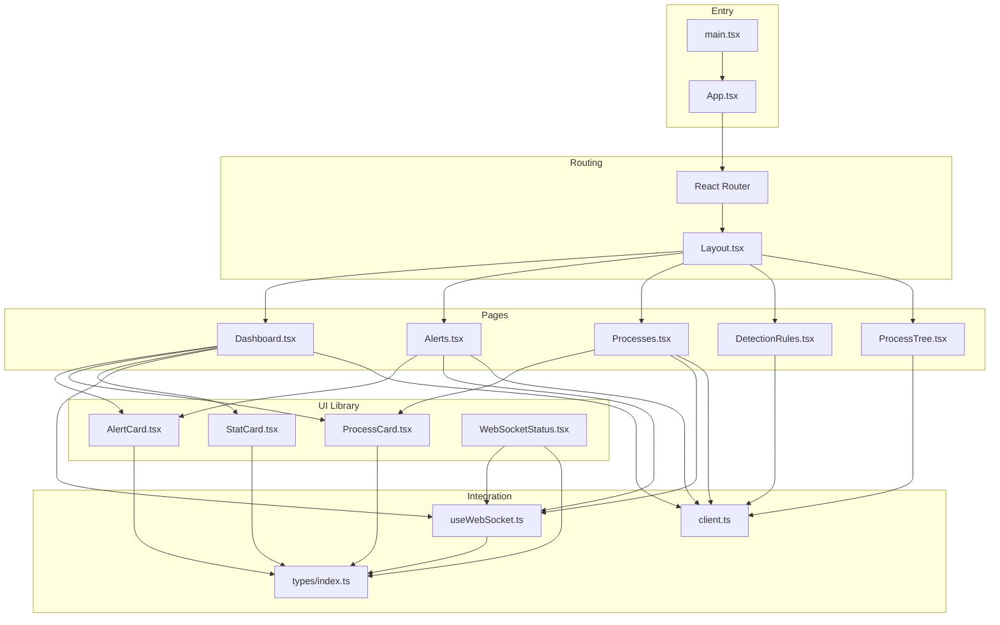

**Diagram sources**
- [main.tsx:1-13](file://frontend/src/main.tsx#L1-L13)
- [App.tsx:1-23](file://frontend/src/App.tsx#L1-L23)
- [Layout.tsx:1-110](file://frontend/src/components/Layout.tsx#L1-L110)
- [Dashboard.tsx:1-208](file://frontend/src/pages/Dashboard.tsx#L1-L208)
- [Alerts.tsx:1-242](file://frontend/src/pages/Alerts.tsx#L1-L242)
- [Processes.tsx:1-136](file://frontend/src/pages/Processes.tsx#L1-L136)
- [DetectionRules.tsx:1-271](file://frontend/src/pages/DetectionRules.tsx#L1-L271)
- [ProcessTree.tsx:1-130](file://frontend/src/pages/ProcessTree.tsx#L1-L130)
- [AlertCard.tsx:1-69](file://frontend/src/components/AlertCard.tsx#L1-L69)
- [ProcessCard.tsx:1-57](file://frontend/src/components/ProcessCard.tsx#L1-L57)
- [StatCard.tsx:1-41](file://frontend/src/components/StatCard.tsx#L1-L41)
- [WebSocketStatus.tsx:1-24](file://frontend/src/components/WebSocketStatus.tsx#L1-L24)
- [useWebSocket.ts:1-103](file://frontend/src/hooks/useWebSocket.ts#L1-L103)
- [client.ts:1-124](file://frontend/src/api/client.ts#L1-L124)
- [index.ts:1-83](file://frontend/src/types/index.ts#L1-L83)

**Section sources**
- [main.tsx:1-13](file://frontend/src/main.tsx#L1-L13)
- [App.tsx:1-23](file://frontend/src/App.tsx#L1-L23)
- [Layout.tsx:1-110](file://frontend/src/components/Layout.tsx#L1-L110)

## Core Components
- App: Declares routes and nests pages under Layout.
- Layout: Provides responsive navigation, mobile sidebar, and WebSocket status footer.
- useWebSocket: Encapsulates WebSocket lifecycle, reconnection, and message parsing.
- API client: Centralized HTTP client with typed endpoints for alerts, processes, detection, and system.
- Types: Strongly typed models for alerts, processes, detection rules, system stats, and WebSocket messages.

Key patterns:
- Prop drilling is minimized by composing pages within Layout and sharing stateless UI components.
- Real-time updates are handled via a single custom hook used across pages.
- Data fetching uses concurrent requests where appropriate and paginated endpoints.

**Section sources**
- [App.tsx:1-23](file://frontend/src/App.tsx#L1-L23)
- [Layout.tsx:14-27](file://frontend/src/components/Layout.tsx#L14-L27)
- [useWebSocket.ts:13-103](file://frontend/src/hooks/useWebSocket.ts#L13-L103)
- [client.ts:13-124](file://frontend/src/api/client.ts#L13-L124)
- [index.ts:1-83](file://frontend/src/types/index.ts#L1-L83)

## Architecture Overview
The runtime flow connects routing, layout, pages, UI components, and integration layers:

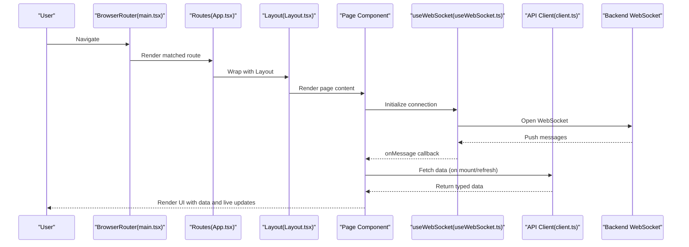

**Diagram sources**
- [main.tsx:7-12](file://frontend/src/main.tsx#L7-L12)
- [App.tsx:10-20](file://frontend/src/App.tsx#L10-L20)
- [Layout.tsx:25-110](file://frontend/src/components/Layout.tsx#L25-L110)
- [useWebSocket.ts:27-94](file://frontend/src/hooks/useWebSocket.ts#L27-L94)
- [client.ts:14-124](file://frontend/src/api/client.ts#L14-L124)

## Detailed Component Analysis

### App and Routing
- App defines routes for Dashboard, Alerts, Processes, Detection Rules, and Process Tree.
- Layout composes the routed pages and provides global navigation and WebSocket status.

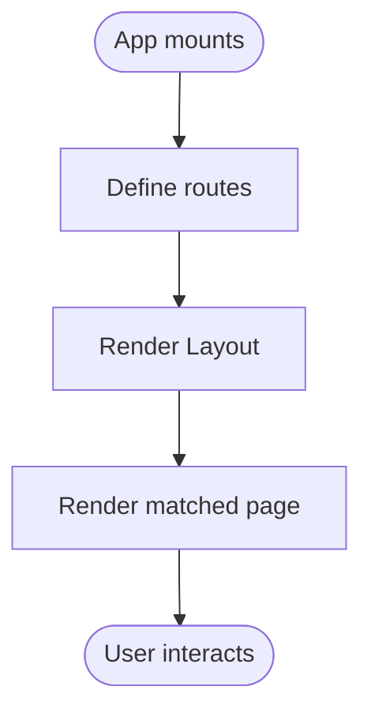

**Diagram sources**
- [App.tsx:9-21](file://frontend/src/App.tsx#L9-L21)
- [Layout.tsx:25-110](file://frontend/src/components/Layout.tsx#L25-L110)

**Section sources**
- [App.tsx:1-23](file://frontend/src/App.tsx#L1-L23)
- [Layout.tsx:18-23](file://frontend/src/components/Layout.tsx#L18-L23)

### Layout Component
Responsibilities:
- Mobile-responsive sidebar with navigation items.
- Active link highlighting based on current location.
- Fixed WebSocketStatus component in the sidebar footer.
- Main content area with page children passed via props.

Composition highlights:
- Uses Lucide icons and Tailwind classes for responsive design.
- Uses react-router Link for navigation and useLocation for active state.

**Section sources**
- [Layout.tsx:14-27](file://frontend/src/components/Layout.tsx#L14-L27)
- [Layout.tsx:54-77](file://frontend/src/components/Layout.tsx#L54-L77)
- [Layout.tsx:80-82](file://frontend/src/components/Layout.tsx#L80-L82)

### Dashboard Page
Highlights:
- Concurrent data fetch for stats, recent alerts, and recent processes.
- Real-time updates via useWebSocket listening to alert and process events.
- Manual refresh and simulated event generation.
- Renders StatCard for metrics and AlertCard/ProcessCard lists.

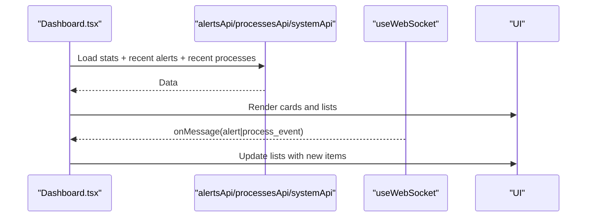

**Diagram sources**
- [Dashboard.tsx:25-65](file://frontend/src/pages/Dashboard.tsx#L25-L65)
- [Dashboard.tsx:46-52](file://frontend/src/pages/Dashboard.tsx#L46-L52)
- [useWebSocket.ts:27-72](file://frontend/src/hooks/useWebSocket.ts#L27-L72)
- [client.ts:14-62](file://frontend/src/api/client.ts#L14-L62)

**Section sources**
- [Dashboard.tsx:18-208](file://frontend/src/pages/Dashboard.tsx#L18-L208)

### Alerts Page
Highlights:
- Paginated and filterable alert listing (severity and status).
- Bulk acknowledge and individual actions.
- Real-time ingestion of new alerts via WebSocket.
- Uses AlertCard for rendering and supports delete action.

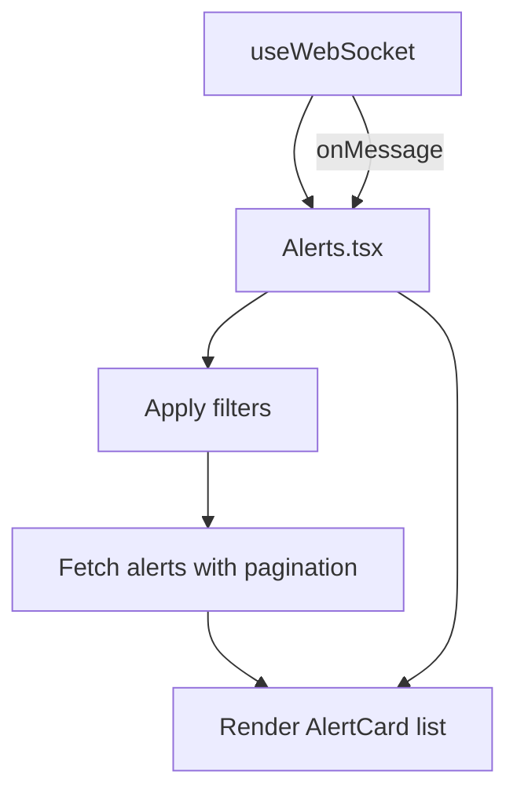

**Diagram sources**
- [Alerts.tsx:21-62](file://frontend/src/pages/Alerts.tsx#L21-L62)
- [Alerts.tsx:47-53](file://frontend/src/pages/Alerts.tsx#L47-L53)
- [useWebSocket.ts:27-72](file://frontend/src/hooks/useWebSocket.ts#L27-L72)

**Section sources**
- [Alerts.tsx:11-242](file://frontend/src/pages/Alerts.tsx#L11-L242)
- [AlertCard.tsx:18-69](file://frontend/src/components/AlertCard.tsx#L18-L69)

### Processes Page
Highlights:
- Searchable and paginated process listing.
- Real-time process events via WebSocket.
- Uses ProcessCard for rendering and Tailwind-based styling.

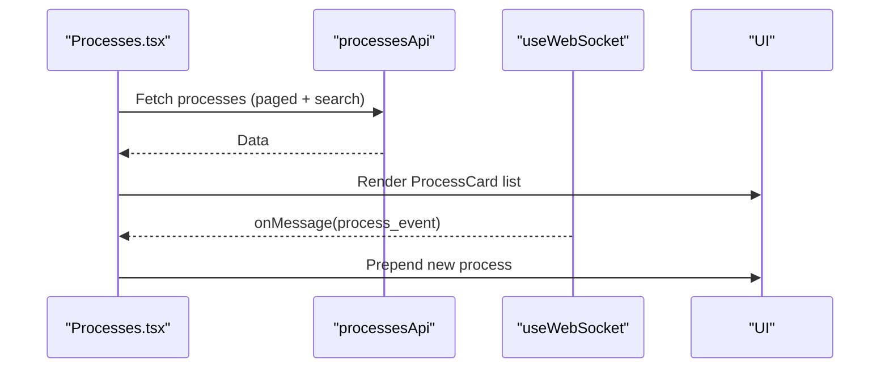

**Diagram sources**
- [Processes.tsx:15-45](file://frontend/src/pages/Processes.tsx#L15-L45)
- [Processes.tsx:31-36](file://frontend/src/pages/Processes.tsx#L31-L36)
- [useWebSocket.ts:27-72](file://frontend/src/hooks/useWebSocket.ts#L27-L72)

**Section sources**
- [Processes.tsx:8-136](file://frontend/src/pages/Processes.tsx#L8-L136)
- [ProcessCard.tsx:10-57](file://frontend/src/components/ProcessCard.tsx#L10-L57)

### Detection Rules Page
Highlights:
- Lists detection rules with enable/disable actions.
- Displays statistics grouped by severity.
- Provides rule testing and modal placeholders for create/edit.

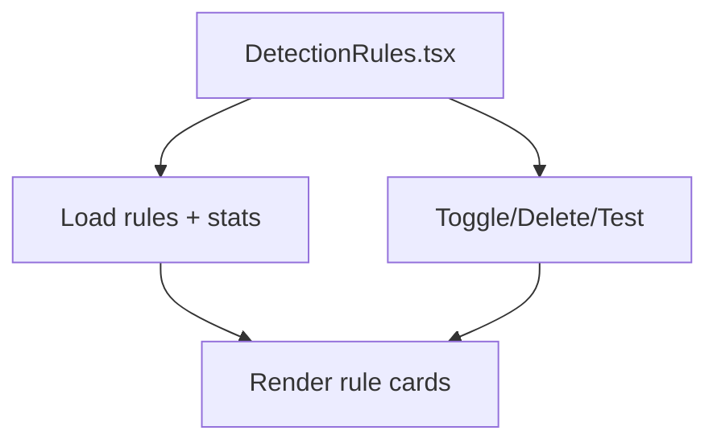

**Diagram sources**
- [DetectionRules.tsx:14-32](file://frontend/src/pages/DetectionRules.tsx#L14-L32)
- [client.ts:64-104](file://frontend/src/api/client.ts#L64-L104)

**Section sources**
- [DetectionRules.tsx:6-271](file://frontend/src/pages/DetectionRules.tsx#L6-L271)

### Process Tree Page
Highlights:
- Loads a process tree by ID from the API.
- Recursively renders hierarchical nodes with indentation and suspicious indicators.

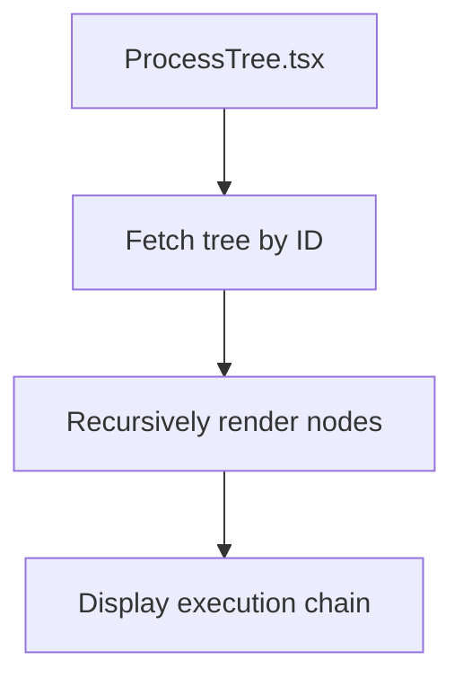

**Diagram sources**
- [ProcessTree.tsx:13-30](file://frontend/src/pages/ProcessTree.tsx#L13-L30)
- [client.ts:54-55](file://frontend/src/api/client.ts#L54-L55)

**Section sources**
- [ProcessTree.tsx:7-130](file://frontend/src/pages/ProcessTree.tsx#L7-L130)

### UI Component Library

#### AlertCard
- Props: alert object and optional callbacks for acknowledge/delete.
- Severity-driven styling and icons.
- Displays timestamp, risk score, and acknowledgment status.

**Section sources**
- [AlertCard.tsx:5-69](file://frontend/src/components/AlertCard.tsx#L5-L69)
- [index.ts:1-17](file://frontend/src/types/index.ts#L1-L17)

#### ProcessCard
- Props: process object and optional suspicious flag.
- Shows process and parent names, command line, timestamps, and identifiers.

**Section sources**
- [ProcessCard.tsx:5-57](file://frontend/src/components/ProcessCard.tsx#L5-L57)
- [index.ts:19-30](file://frontend/src/types/index.ts#L19-L30)

#### StatCard
- Props: title, value, icon, optional trend, and color.
- Renders metric cards with colored accents.

**Section sources**
- [StatCard.tsx:3-41](file://frontend/src/components/StatCard.tsx#L3-L41)
- [index.ts:61-76](file://frontend/src/types/index.ts#L61-L76)

#### WebSocketStatus
- Consumes useWebSocket to show live/offline status.

**Section sources**
- [WebSocketStatus.tsx:4-24](file://frontend/src/components/WebSocketStatus.tsx#L4-L24)
- [useWebSocket.ts:21-22](file://frontend/src/hooks/useWebSocket.ts#L21-L22)

### WebSocket Integration with useWebSocket Hook
Capabilities:
- Automatic connection using ws/wss based on protocol.
- Reconnection with configurable attempts and intervals.
- Message parsing and error handling.
- Exposes connect/disconnect/send helpers alongside state.

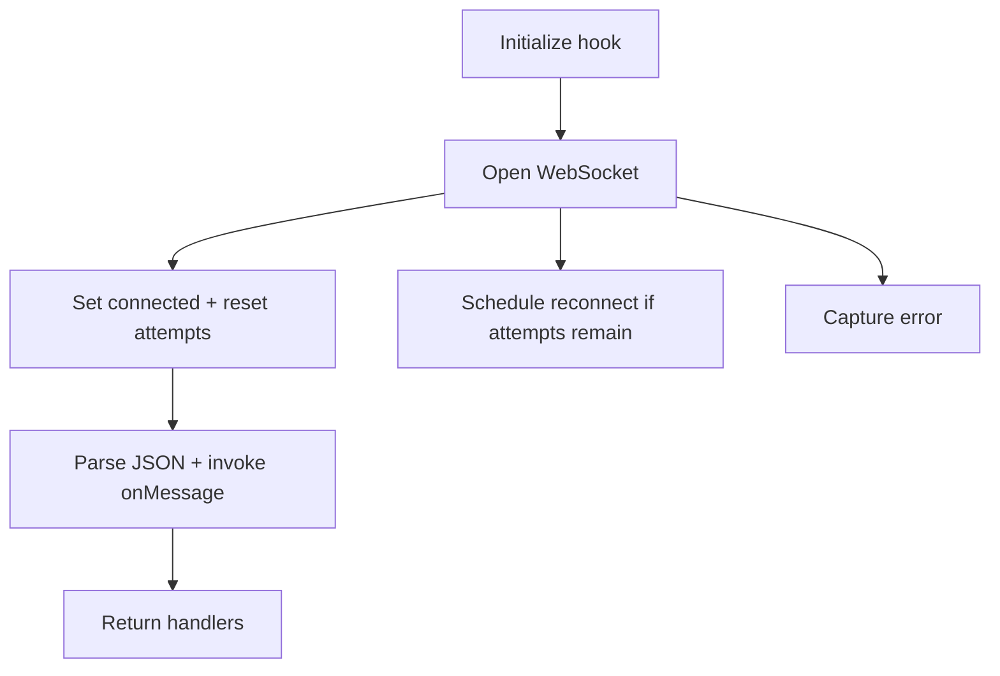

**Diagram sources**
- [useWebSocket.ts:27-94](file://frontend/src/hooks/useWebSocket.ts#L27-L94)

**Section sources**
- [useWebSocket.ts:13-103](file://frontend/src/hooks/useWebSocket.ts#L13-L103)

### API Client and Data Fetching Patterns
- Axios-based client with base URL from environment.
- Typed endpoints for alerts, processes, detection, and system.
- Pages orchestrate concurrent loads and pagination.

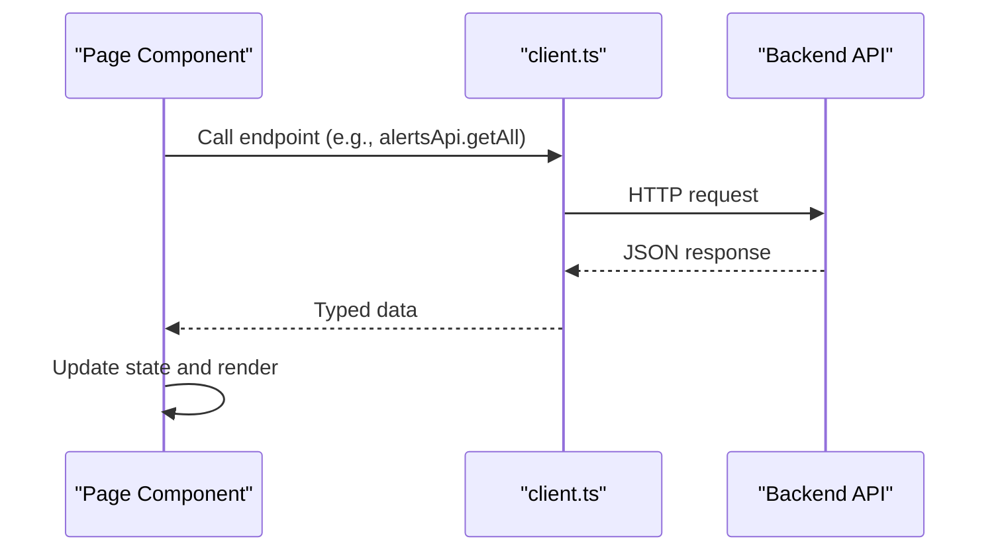

**Diagram sources**
- [client.ts:14-124](file://frontend/src/api/client.ts#L14-L124)

**Section sources**
- [client.ts:1-124](file://frontend/src/api/client.ts#L1-L124)

### TypeScript Integration and Type Safety
- Strongly typed models for Alert, Process, DetectionRule, SystemStats, and WebSocketMessage.
- API client functions return typed responses.
- Props interfaces enforce component contracts.

**Section sources**
- [index.ts:1-83](file://frontend/src/types/index.ts#L1-L83)
- [client.ts:14-124](file://frontend/src/api/client.ts#L14-L124)

## Dependency Analysis
Component and module dependencies:

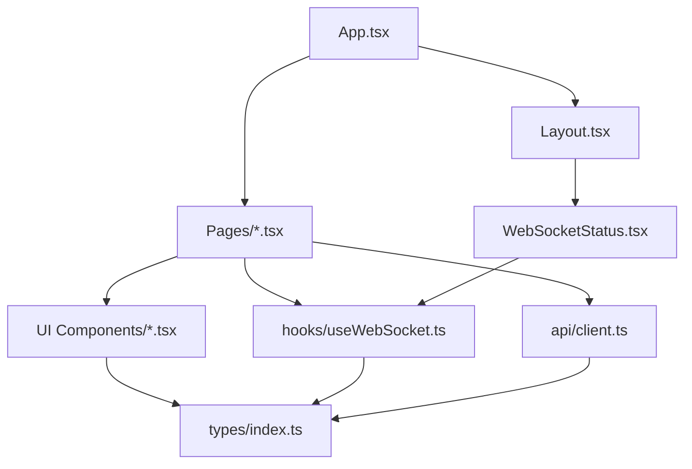

**Diagram sources**
- [App.tsx:1-23](file://frontend/src/App.tsx#L1-L23)
- [Layout.tsx:12-12](file://frontend/src/components/Layout.tsx#L12-L12)
- [WebSocketStatus.tsx:2-2](file://frontend/src/components/WebSocketStatus.tsx#L2-L2)
- [useWebSocket.ts:1-103](file://frontend/src/hooks/useWebSocket.ts#L1-L103)
- [client.ts:1-124](file://frontend/src/api/client.ts#L1-L124)
- [index.ts:1-83](file://frontend/src/types/index.ts#L1-L83)

**Section sources**
- [App.tsx:1-23](file://frontend/src/App.tsx#L1-L23)
- [Layout.tsx:12-12](file://frontend/src/components/Layout.tsx#L12-L12)
- [WebSocketStatus.tsx:2-2](file://frontend/src/components/WebSocketStatus.tsx#L2-L2)
- [useWebSocket.ts:1-103](file://frontend/src/hooks/useWebSocket.ts#L1-L103)
- [client.ts:1-124](file://frontend/src/api/client.ts#L1-L124)
- [index.ts:1-83](file://frontend/src/types/index.ts#L1-L83)

## Performance Considerations
- Concurrent data fetching reduces total load time on Dashboard.
- Efficient WebSocket message handling prevents unnecessary re-renders by updating arrays immutably.
- Pagination limits payload sizes for Alerts and Processes.
- Debounce or throttle search inputs if extended to server-side filtering.
- Memoize callbacks with useCallback where appropriate to avoid prop drift.

## Troubleshooting Guide
Common issues and resolutions:
- WebSocket errors: Inspect returned error state from the hook and verify backend endpoint availability.
- API failures: Check network tab for failed requests and confirm VITE_API_URL configuration.
- Type mismatches: Ensure API responses match types; add defensive checks if backend evolves.
- Memory leaks: Confirm cleanup of timers and subscriptions in effects and WebSocket hook.

**Section sources**
- [useWebSocket.ts:21-22](file://frontend/src/hooks/useWebSocket.ts#L21-L22)
- [useWebSocket.ts:68-71](file://frontend/src/hooks/useWebSocket.ts#L68-L71)
- [client.ts:4-4](file://frontend/src/api/client.ts#L4-L4)

## Conclusion
The frontend architecture emphasizes composability, real-time responsiveness, and type safety. The shared Layout and UI components reduce duplication, while the useWebSocket hook centralizes WebSocket concerns. Pages coordinate data fetching and present structured views, leveraging TailwindCSS for responsive design and a clean component model.

## Appendices

### Styling and Responsive Design
- Tailwind utility classes are used extensively for layout, colors, spacing, and responsive breakpoints.
- Cards, grids, and lists adapt across screen sizes.
- Icons from Lucide React enhance visual communication.

### Component Composition Strategies
- Presentational components (AlertCard, ProcessCard, StatCard) receive data via props.
- Container components (pages) manage state, effects, and data fetching.
- Layout composes pages and provides global navigation and status.