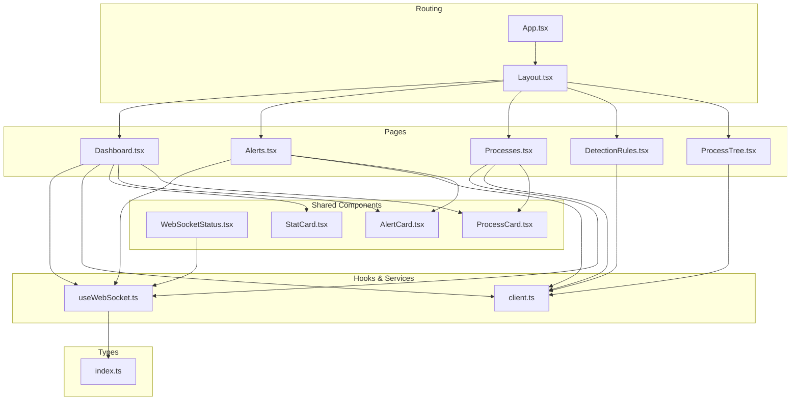
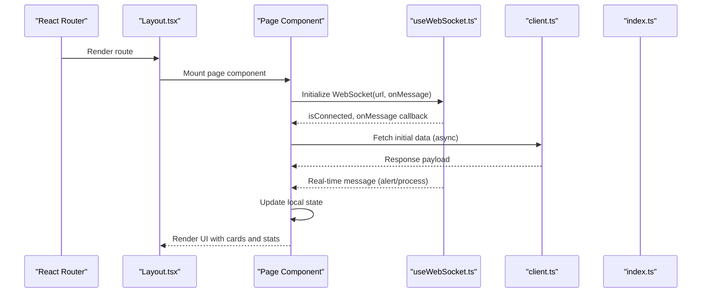
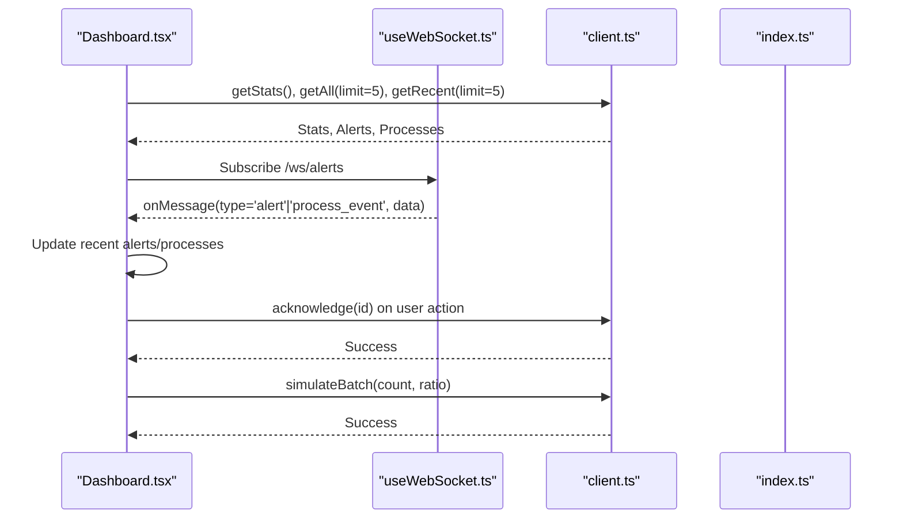
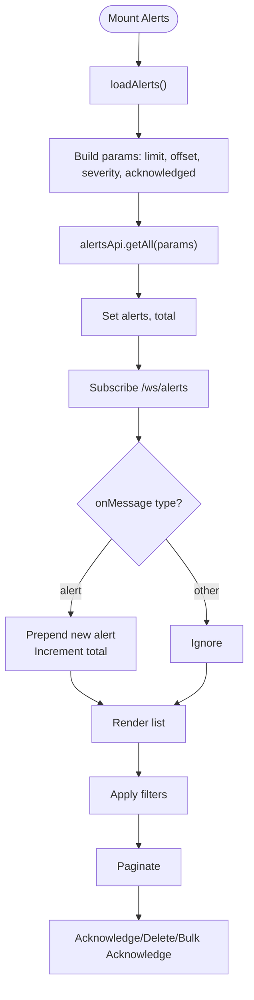
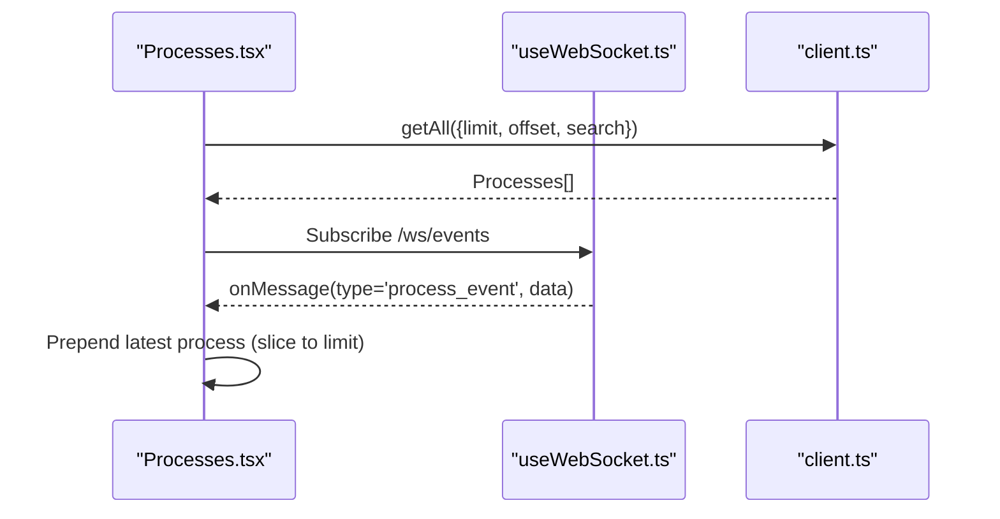
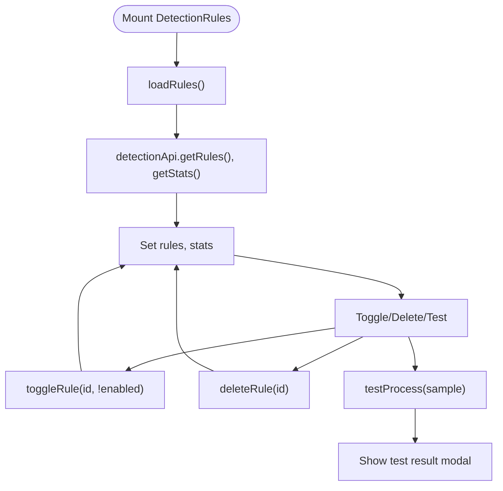
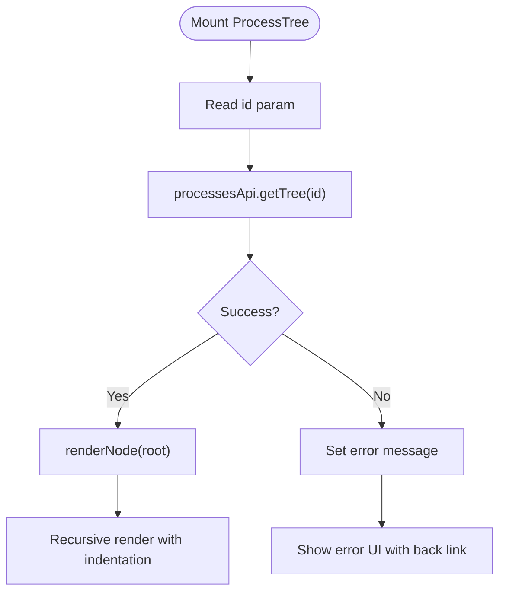
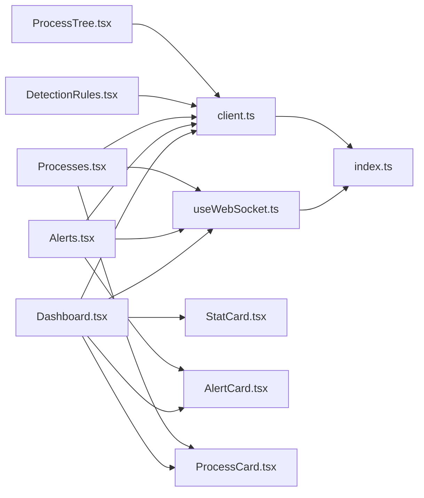

# Pages and Views

<cite>
**Referenced Files in This Document**
- [App.tsx](file://frontend/src/App.tsx)
- [Layout.tsx](file://frontend/src/components/Layout.tsx)
- [WebSocketStatus.tsx](file://frontend/src/components/WebSocketStatus.tsx)
- [useWebSocket.ts](file://frontend/src/hooks/useWebSocket.ts)
- [client.ts](file://frontend/src/api/client.ts)
- [Dashboard.tsx](file://frontend/src/pages/Dashboard.tsx)
- [Alerts.tsx](file://frontend/src/pages/Alerts.tsx)
- [Processes.tsx](file://frontend/src/pages/Processes.tsx)
- [DetectionRules.tsx](file://frontend/src/pages/DetectionRules.tsx)
- [ProcessTree.tsx](file://frontend/src/pages/ProcessTree.tsx)
- [AlertCard.tsx](file://frontend/src/components/AlertCard.tsx)
- [ProcessCard.tsx](file://frontend/src/components/ProcessCard.tsx)
- [StatCard.tsx](file://frontend/src/components/StatCard.tsx)
- [index.ts](file://frontend/src/types/index.ts)
</cite>

## Table of Contents
1. [Introduction](#introduction)
2. [Project Structure](#project-structure)
3. [Core Components](#core-components)
4. [Architecture Overview](#architecture-overview)
5. [Detailed Component Analysis](#detailed-component-analysis)
6. [Dependency Analysis](#dependency-analysis)
7. [Performance Considerations](#performance-considerations)
8. [Troubleshooting Guide](#troubleshooting-guide)
9. [Conclusion](#conclusion)

## Introduction
This document provides comprehensive documentation for EDR Lite’s page-level components and views. It covers the Dashboard as the primary monitoring interface, the Alerts page for detailed threat investigation, the Processes page for system activity monitoring, the DetectionRules page for managing security rules, and the ProcessTree page for hierarchical process visualization. It explains data fetching patterns, state management, WebSocket integration, responsive design considerations, loading states, and error handling for each page.

## Project Structure
The frontend is organized around a routing-driven layout with dedicated pages and shared components:
- Routing and layout are defined in App and Layout.
- Pages implement page-specific logic and UI.
- Shared components encapsulate reusable UI elements.
- API client abstracts HTTP requests to backend endpoints.
- WebSocket hook manages live updates via WebSocket streams.

**Diagram sources**
- [App.tsx:1-23](file://frontend/src/App.tsx#L1-L23)
- [Layout.tsx:1-110](file://frontend/src/components/Layout.tsx#L1-L110)
- [Dashboard.tsx:1-208](file://frontend/src/pages/Dashboard.tsx#L1-L208)
- [Alerts.tsx:1-242](file://frontend/src/pages/Alerts.tsx#L1-L242)
- [Processes.tsx:1-136](file://frontend/src/pages/Processes.tsx#L1-L136)
- [DetectionRules.tsx:1-271](file://frontend/src/pages/DetectionRules.tsx#L1-L271)
- [ProcessTree.tsx:1-130](file://frontend/src/pages/ProcessTree.tsx#L1-L130)
- [WebSocketStatus.tsx:1-24](file://frontend/src/components/WebSocketStatus.tsx#L1-L24)
- [useWebSocket.ts:1-103](file://frontend/src/hooks/useWebSocket.ts#L1-L103)
- [client.ts:1-124](file://frontend/src/api/client.ts#L1-L124)
- [AlertCard.tsx:1-69](file://frontend/src/components/AlertCard.tsx#L1-L69)
- [ProcessCard.tsx:1-57](file://frontend/src/components/ProcessCard.tsx#L1-L57)
- [StatCard.tsx:1-41](file://frontend/src/components/StatCard.tsx#L1-L41)
- [index.ts:1-83](file://frontend/src/types/index.ts#L1-L83)

**Section sources**
- [App.tsx:1-23](file://frontend/src/App.tsx#L1-L23)
- [Layout.tsx:1-110](file://frontend/src/components/Layout.tsx#L1-L110)

## Core Components
- API client: Provides typed methods for alerts, processes, detection, and system endpoints.
- WebSocket hook: Manages WebSocket lifecycle, reconnection, and message parsing.
- Shared cards: AlertCard and ProcessCard present compact, actionable views of security events.
- StatCard: Displays KPIs with icons and color-coded themes.

Key responsibilities:
- API client centralizes HTTP calls and parameterization.
- WebSocket hook abstracts connection management and error handling.
- Cards encapsulate presentation and minimal interactivity.

**Section sources**
- [client.ts:1-124](file://frontend/src/api/client.ts#L1-L124)
- [useWebSocket.ts:1-103](file://frontend/src/hooks/useWebSocket.ts#L1-L103)
- [AlertCard.tsx:1-69](file://frontend/src/components/AlertCard.tsx#L1-L69)
- [ProcessCard.tsx:1-57](file://frontend/src/components/ProcessCard.tsx#L1-L57)
- [StatCard.tsx:1-41](file://frontend/src/components/StatCard.tsx#L1-L41)

## Architecture Overview
The pages integrate with the API client and WebSocket hook to provide real-time monitoring and interactive controls. The layout provides navigation and a persistent WebSocket status indicator.

**Diagram sources**
- [App.tsx:9-21](file://frontend/src/App.tsx#L9-L21)
- [Layout.tsx:25-109](file://frontend/src/components/Layout.tsx#L25-L109)
- [useWebSocket.ts:13-72](file://frontend/src/hooks/useWebSocket.ts#L13-L72)
- [client.ts:14-122](file://frontend/src/api/client.ts#L14-L122)
- [index.ts:1-83](file://frontend/src/types/index.ts#L1-L83)

## Detailed Component Analysis

### Dashboard Page
The Dashboard serves as the main monitoring interface, aggregating system statistics, recent alerts, and recent processes. It integrates with WebSocket streams for live updates and provides manual refresh and simulation controls.

Key behaviors:
- Concurrent data fetching for stats, recent alerts, and recent processes.
- WebSocket subscription to alerts and process events with real-time updates.
- Periodic refresh via interval to keep data fresh.
- Acknowledge actions for alerts.
- Simulation trigger to generate test events.

State management:
- Local state for stats, recent alerts, recent processes, loading flag, last update timestamp.
- Controlled by useCallback for data loaders and message handlers to prevent unnecessary re-renders.

WebSocket integration:
- Subscribes to alerts stream to prepend new alerts.
- Subscribes to process events stream to prepend new process events.

Responsive design:
- Responsive grid for stats and content areas.
- Adaptive header layout for mobile and desktop.

Loading and error handling:
- Loading spinner during fetches.
- Error logging to console for failures.
- Graceful empty states with icons and guidance.

**Diagram sources**
- [Dashboard.tsx:25-85](file://frontend/src/pages/Dashboard.tsx#L25-L85)
- [useWebSocket.ts:13-72](file://frontend/src/hooks/useWebSocket.ts#L13-L72)
- [client.ts:14-122](file://frontend/src/api/client.ts#L14-L122)
- [index.ts:1-83](file://frontend/src/types/index.ts#L1-L83)

**Section sources**
- [Dashboard.tsx:18-208](file://frontend/src/pages/Dashboard.tsx#L18-L208)
- [client.ts:14-62](file://frontend/src/api/client.ts#L14-L62)
- [useWebSocket.ts:13-72](file://frontend/src/hooks/useWebSocket.ts#L13-L72)
- [StatCard.tsx:22-41](file://frontend/src/components/StatCard.tsx#L22-L41)
- [AlertCard.tsx:18-69](file://frontend/src/components/AlertCard.tsx#L18-L69)
- [ProcessCard.tsx:10-57](file://frontend/src/components/ProcessCard.tsx#L10-L57)

### Alerts Page
The Alerts page enables detailed threat investigation with filtering, pagination, selection, and bulk actions. It subscribes to the alerts WebSocket stream for live updates.

Key behaviors:
- Filtering by severity and acknowledgment status.
- Pagination with configurable page size.
- Selection of multiple alerts for bulk acknowledgment.
- Individual acknowledgment and deletion actions.
- Real-time updates via WebSocket.

State management:
- Local state for alerts list, total count, filters, pagination, selection set, and loading flag.
- useCallback for loader to memoize dependencies.

WebSocket integration:
- Subscribes to alerts stream to prepend new alerts and increment total.

Pagination logic:
- Calculates total pages from total count and renders navigation controls.

**Diagram sources**
- [Alerts.tsx:21-100](file://frontend/src/pages/Alerts.tsx#L21-L100)
- [useWebSocket.ts:13-72](file://frontend/src/hooks/useWebSocket.ts#L13-L72)
- [client.ts:14-38](file://frontend/src/api/client.ts#L14-L38)

**Section sources**
- [Alerts.tsx:11-242](file://frontend/src/pages/Alerts.tsx#L11-L242)
- [client.ts:14-38](file://frontend/src/api/client.ts#L14-L38)
- [useWebSocket.ts:13-72](file://frontend/src/hooks/useWebSocket.ts#L13-L72)
- [AlertCard.tsx:18-69](file://frontend/src/components/AlertCard.tsx#L18-L69)

### Processes Page
The Processes page displays real-time process creation events with search and pagination. It subscribes to the events WebSocket stream for live updates.

Key behaviors:
- Search by process name, parent name, or command line.
- Pagination with configurable page size.
- Real-time updates via WebSocket for new process events.

State management:
- Local state for processes list, loading flag, search query, and pagination.

WebSocket integration:
- Subscribes to events stream to prepend latest process events up to limit.

**Diagram sources**
- [Processes.tsx:15-51](file://frontend/src/pages/Processes.tsx#L15-L51)
- [useWebSocket.ts:13-72](file://frontend/src/hooks/useWebSocket.ts#L13-L72)
- [client.ts:40-62](file://frontend/src/api/client.ts#L40-L62)

**Section sources**
- [Processes.tsx:8-136](file://frontend/src/pages/Processes.tsx#L8-L136)
- [client.ts:40-62](file://frontend/src/api/client.ts#L40-L62)
- [useWebSocket.ts:13-72](file://frontend/src/hooks/useWebSocket.ts#L13-L72)
- [ProcessCard.tsx:10-57](file://frontend/src/components/ProcessCard.tsx#L10-L57)

### DetectionRules Page
The DetectionRules page manages detection rules, enabling toggling, deletion, and testing. It also displays rule statistics grouped by severity.

Key behaviors:
- Concurrent loading of rules and statistics.
- Toggle rule enable/disable.
- Delete rule with confirmation.
- Test rule against a sample process.
- Modal UI placeholders for create/edit rule forms.

State management:
- Local state for rules, stats, loading flag, modal visibility, and test result.

**Diagram sources**
- [DetectionRules.tsx:14-67](file://frontend/src/pages/DetectionRules.tsx#L14-L67)
- [client.ts:64-104](file://frontend/src/api/client.ts#L64-L104)

**Section sources**
- [DetectionRules.tsx:6-271](file://frontend/src/pages/DetectionRules.tsx#L6-L271)
- [client.ts:64-104](file://frontend/src/api/client.ts#L64-L104)

### ProcessTree Page
The ProcessTree page visualizes a process and its ancestors in a hierarchical tree. It loads a single process tree by ID and renders a collapsible, indented view.

Key behaviors:
- Loads tree by process ID from URL params.
- Renders nodes with suspicious indicators and command lines.
- Handles loading, error, and empty states.

State management:
- Local state for tree data, loading flag, and error message.

**Diagram sources**
- [ProcessTree.tsx:13-30](file://frontend/src/pages/ProcessTree.tsx#L13-L30)
- [client.ts:54-55](file://frontend/src/api/client.ts#L54-L55)

**Section sources**
- [ProcessTree.tsx:7-130](file://frontend/src/pages/ProcessTree.tsx#L7-L130)
- [client.ts:54-55](file://frontend/src/api/client.ts#L54-L55)

## Dependency Analysis
- Pages depend on the API client for data fetching and on the WebSocket hook for live updates.
- Shared components encapsulate presentation and reduce coupling.
- Types define contracts for API responses and WebSocket messages.

**Diagram sources**
- [Dashboard.tsx:10-16](file://frontend/src/pages/Dashboard.tsx#L10-L16)
- [Alerts.tsx:3-6](file://frontend/src/pages/Alerts.tsx#L3-L6)
- [Processes.tsx:3-6](file://frontend/src/pages/Processes.tsx#L3-L6)
- [DetectionRules.tsx:3-4](file://frontend/src/pages/DetectionRules.tsx#L3-L4)
- [ProcessTree.tsx:4](file://frontend/src/pages/ProcessTree.tsx#L4)
- [useWebSocket.ts:2](file://frontend/src/hooks/useWebSocket.ts#L2)
- [client.ts:2](file://frontend/src/api/client.ts#L2)
- [index.ts:1-83](file://frontend/src/types/index.ts#L1-L83)

**Section sources**
- [Dashboard.tsx:10-16](file://frontend/src/pages/Dashboard.tsx#L10-L16)
- [Alerts.tsx:3-6](file://frontend/src/pages/Alerts.tsx#L3-L6)
- [Processes.tsx:3-6](file://frontend/src/pages/Processes.tsx#L3-L6)
- [DetectionRules.tsx:3-4](file://frontend/src/pages/DetectionRules.tsx#L3-L4)
- [ProcessTree.tsx:4](file://frontend/src/pages/ProcessTree.tsx#L4)
- [useWebSocket.ts:2](file://frontend/src/hooks/useWebSocket.ts#L2)
- [client.ts:2](file://frontend/src/api/client.ts#L2)
- [index.ts:1-83](file://frontend/src/types/index.ts#L1-L83)

## Performance Considerations
- Concurrent data fetching: Pages use Promise.all to minimize round-trips for related data.
- Memoized callbacks: useCallback prevents unnecessary re-renders for data loaders and message handlers.
- Efficient WebSocket updates: New items are prepended and sliced to maintain bounded lists, reducing DOM churn.
- Pagination: Limits list sizes and reduces rendering overhead.
- Debounced or controlled re-fetch triggers: Filters and search change the loader dependency to avoid redundant calls.

[No sources needed since this section provides general guidance]

## Troubleshooting Guide
Common issues and remedies:
- WebSocket disconnections: The hook attempts automatic reconnection with retry limits and intervals. Inspect the WebSocket status indicator in the layout.
- API errors: Network failures or server errors are logged to the console. Verify backend health endpoints and CORS configuration.
- Pagination inconsistencies: Ensure page and limit parameters are correctly passed to API methods.
- Empty states: Pages provide clear empty states with icons and guidance; confirm filters or search terms are appropriate.
- Bulk actions: Confirm selections before invoking bulk operations and handle confirm dialogs appropriately.

**Section sources**
- [useWebSocket.ts:13-72](file://frontend/src/hooks/useWebSocket.ts#L13-L72)
- [WebSocketStatus.tsx:4-24](file://frontend/src/components/WebSocketStatus.tsx#L4-L24)
- [client.ts:14-122](file://frontend/src/api/client.ts#L14-L122)
- [Alerts.tsx:75-85](file://frontend/src/pages/Alerts.tsx#L75-L85)
- [DetectionRules.tsx:45-54](file://frontend/src/pages/DetectionRules.tsx#L45-L54)

## Conclusion
The pages and views in EDR Lite are structured around consistent data fetching patterns, robust state management, and real-time WebSocket integration. The Dashboard provides a comprehensive overview, while the Alerts, Processes, DetectionRules, and ProcessTree pages offer specialized capabilities for investigation, monitoring, configuration, and visualization. The shared components and typed contracts ensure maintainability and reliability across the application.