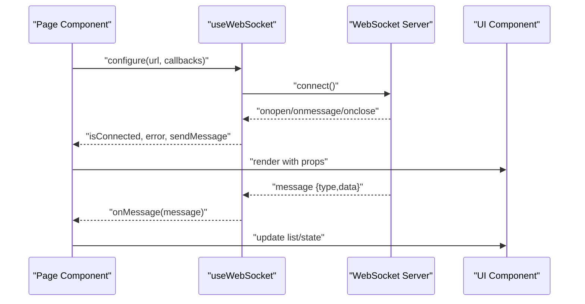
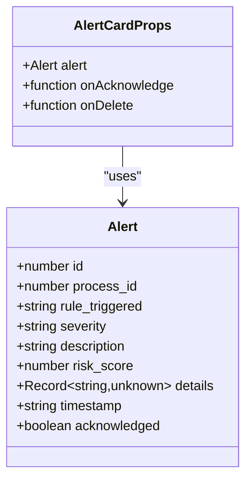
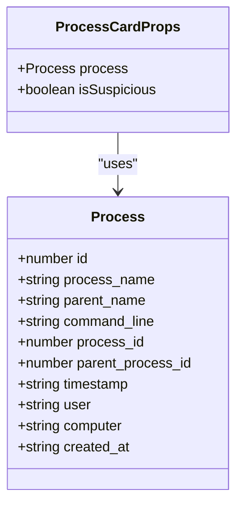
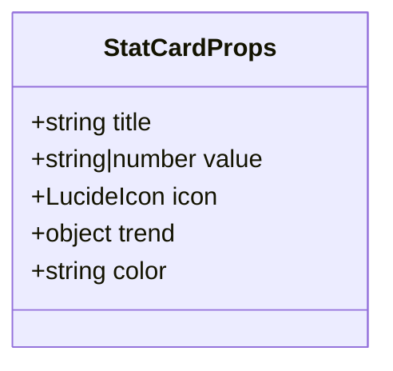
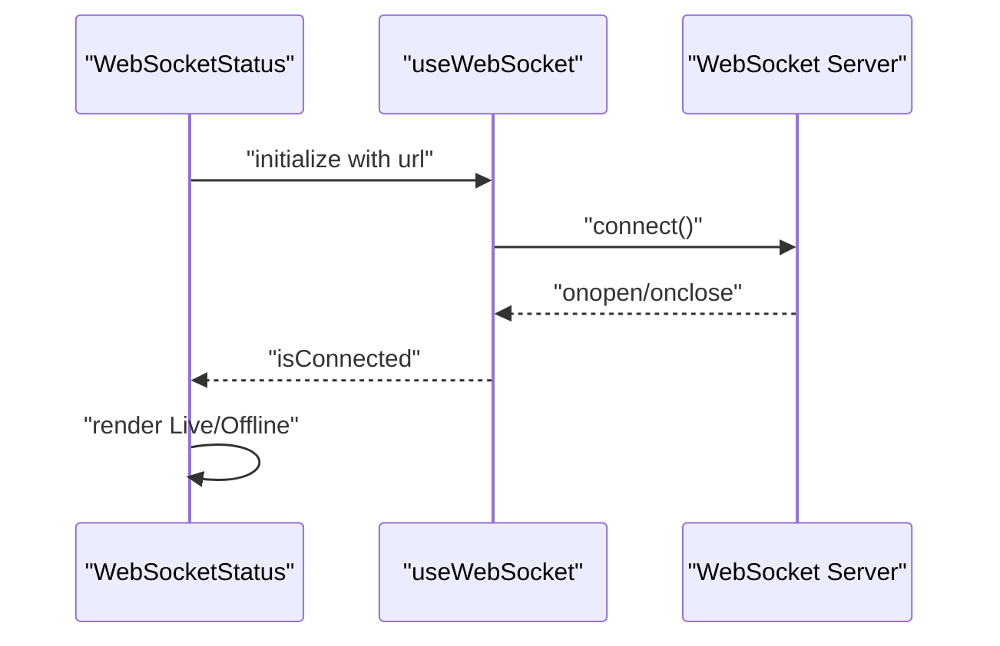
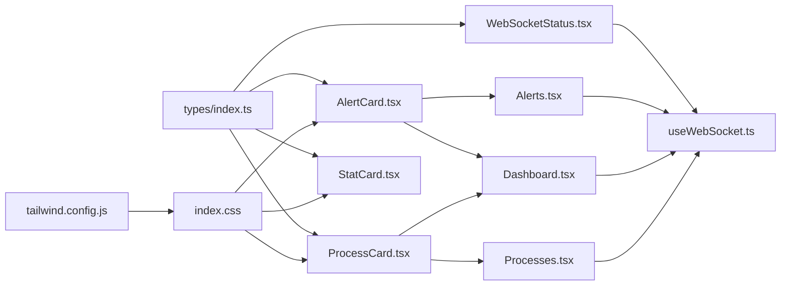

# UI Components

<cite>
**Referenced Files in This Document**
- [AlertCard.tsx](file://frontend/src/components/AlertCard.tsx)
- [ProcessCard.tsx](file://frontend/src/components/ProcessCard.tsx)
- [StatCard.tsx](file://frontend/src/components/StatCard.tsx)
- [WebSocketStatus.tsx](file://frontend/src/components/WebSocketStatus.tsx)
- [useWebSocket.ts](file://frontend/src/hooks/useWebSocket.ts)
- [index.css](file://frontend/src/index.css)
- [tailwind.config.js](file://frontend/tailwind.config.js)
- [Alerts.tsx](file://frontend/src/pages/Alerts.tsx)
- [Dashboard.tsx](file://frontend/src/pages/Dashboard.tsx)
- [Processes.tsx](file://frontend/src/pages/Processes.tsx)
- [client.ts](file://frontend/src/api/client.ts)
- [index.ts](file://frontend/src/types/index.ts)
</cite>

## Table of Contents
1. [Introduction](#introduction)
2. [Project Structure](#project-structure)
3. [Core Components](#core-components)
4. [Architecture Overview](#architecture-overview)
5. [Detailed Component Analysis](#detailed-component-analysis)
6. [Dependency Analysis](#dependency-analysis)
7. [Performance Considerations](#performance-considerations)
8. [Troubleshooting Guide](#troubleshooting-guide)
9. [Conclusion](#conclusion)
10. [Appendices](#appendices)

## Introduction
This document describes EDR Lite’s reusable UI components with a focus on AlertCard, ProcessCard, StatCard, and WebSocketStatus. It explains component props, event handlers, styling approaches, responsive design patterns, composition, slots, accessibility, animations, and performance considerations. It also covers how these components integrate with the application’s WebSocket hook and backend APIs.

## Project Structure
The UI components live under the frontend/src/components directory and are consumed by page components under frontend/src/pages. Styling is implemented via Tailwind CSS with custom layer definitions and animations. The useWebSocket hook centralizes WebSocket lifecycle management and reconnection logic.

```mermaid
graph TB
subgraph "Components"
AC["AlertCard.tsx"]
PC["ProcessCard.tsx"]
SC["StatCard.tsx"]
WSS["WebSocketStatus.tsx"]
end
subgraph "Hooks"
UWS["useWebSocket.ts"]
end
subgraph "Pages"
AL["Alerts.tsx"]
DB["Dashboard.tsx"]
PR["Processes.tsx"]
end
subgraph "Styling"
CSS["index.css"]
TW["tailwind.config.js"]
end
subgraph "API"
API["client.ts"]
end
subgraph "Types"
T["index.ts"]
end
AL --> AC
DB --> AC
DB --> PC
DB --> SC
PR --> PC
WSS --> UWS
AC -.props/types.-> T
PC -.props/types.-> T
SC -.props/types.-> T
WSS -.props/types.-> T
UWS -.consumed by.-> AL
UWS -.consumed by.-> DB
UWS -.consumed by.-> PR
AC -.uses icons & animations.-> CSS
PC -.uses icons & animations.-> CSS
SC -.uses icons & animations.-> CSS
CSS --> TW
AL -.HTTP calls.-> API
DB -.HTTP calls.-> API
PR -.HTTP calls.-> API
```

**Diagram sources**
- [AlertCard.tsx](file://frontend/src/components/AlertCard.tsx)
- [ProcessCard.tsx](file://frontend/src/components/ProcessCard.tsx)
- [StatCard.tsx](file://frontend/src/components/StatCard.tsx)
- [WebSocketStatus.tsx](file://frontend/src/components/WebSocketStatus.tsx)
- [useWebSocket.ts](file://frontend/src/hooks/useWebSocket.ts)
- [Alerts.tsx](file://frontend/src/pages/Alerts.tsx)
- [Dashboard.tsx](file://frontend/src/pages/Dashboard.tsx)
- [Processes.tsx](file://frontend/src/pages/Processes.tsx)
- [index.css](file://frontend/src/index.css)
- [tailwind.config.js](file://frontend/tailwind.config.js)
- [client.ts](file://frontend/src/api/client.ts)
- [index.ts](file://frontend/src/types/index.ts)

**Section sources**
- [AlertCard.tsx](file://frontend/src/components/AlertCard.tsx)
- [ProcessCard.tsx](file://frontend/src/components/ProcessCard.tsx)
- [StatCard.tsx](file://frontend/src/components/StatCard.tsx)
- [WebSocketStatus.tsx](file://frontend/src/components/WebSocketStatus.tsx)
- [useWebSocket.ts](file://frontend/src/hooks/useWebSocket.ts)
- [Alerts.tsx](file://frontend/src/pages/Alerts.tsx)
- [Dashboard.tsx](file://frontend/src/pages/Dashboard.tsx)
- [Processes.tsx](file://frontend/src/pages/Processes.tsx)
- [index.css](file://frontend/src/index.css)
- [tailwind.config.js](file://frontend/tailwind.config.js)
- [client.ts](file://frontend/src/api/client.ts)
- [index.ts](file://frontend/src/types/index.ts)

## Core Components
This section documents the four reusable UI components and how they are used across the application.

- AlertCard: Displays a single security alert with severity-specific styling, timestamp, risk score, acknowledgment state, and action buttons.
- ProcessCard: Renders process information with optional suspicious highlighting, command line, timestamps, and identifiers.
- StatCard: Presents a metric with an icon, trend indicator, and color-coded accent.
- WebSocketStatus: Shows live/offline status based on the shared WebSocket hook.

**Section sources**
- [AlertCard.tsx](file://frontend/src/components/AlertCard.tsx)
- [ProcessCard.tsx](file://frontend/src/components/ProcessCard.tsx)
- [StatCard.tsx](file://frontend/src/components/StatCard.tsx)
- [WebSocketStatus.tsx](file://frontend/src/components/WebSocketStatus.tsx)

## Architecture Overview
The components rely on a shared WebSocket hook for real-time updates and on typed data models for props. Pages orchestrate data fetching and pass props to components. Tailwind utilities and custom animations provide styling and motion.



**Diagram sources**
- [useWebSocket.ts](file://frontend/src/hooks/useWebSocket.ts)
- [Alerts.tsx](file://frontend/src/pages/Alerts.tsx)
- [Dashboard.tsx](file://frontend/src/pages/Dashboard.tsx)
- [Processes.tsx](file://frontend/src/pages/Processes.tsx)
- [AlertCard.tsx](file://frontend/src/components/AlertCard.tsx)
- [ProcessCard.tsx](file://frontend/src/components/ProcessCard.tsx)
- [StatCard.tsx](file://frontend/src/components/StatCard.tsx)

## Detailed Component Analysis

### AlertCard
Purpose
- Render a single alert with severity-aware visuals, metadata, and actions.

Props
- alert: Alert (from types)
  - id, process_id, rule_triggered, severity, description, risk_score, details?, timestamp, acknowledged
- onAcknowledge?: (id: number) => void
- onDelete?: (id: number) => void

Behavior
- Severity mapping selects icon and border classes.
- Displays timestamp, risk score, and acknowledgment state.
- Conditionally renders action buttons based on props and acknowledgment state.

Accessibility
- Buttons have titles and hover/focus styles via Tailwind utilities.

Animations
- Uses a slide-in animation class applied to the card container.

Responsive Design
- Flex layout adapts to narrow widths; timestamp and metadata wrap appropriately.

Composition and Slots
- No explicit slot pattern; uses composition via props and children passed by pages.

Customization
- Severity classes and badge classes are derived from a configuration mapping.
- Action button visibility is controlled by prop presence.

Integration
- Used in Alerts and Dashboard pages; receives handlers for acknowledgment and deletion.

**Section sources**
- [AlertCard.tsx](file://frontend/src/components/AlertCard.tsx)
- [Alerts.tsx](file://frontend/src/pages/Alerts.tsx)
- [Dashboard.tsx](file://frontend/src/pages/Dashboard.tsx)
- [index.ts](file://frontend/src/types/index.ts)
- [index.css](file://frontend/src/index.css)
- [tailwind.config.js](file://frontend/tailwind.config.js)

#### AlertCard Class Diagram


**Diagram sources**
- [AlertCard.tsx](file://frontend/src/components/AlertCard.tsx)
- [index.ts](file://frontend/src/types/index.ts)

### ProcessCard
Purpose
- Display process creation/monitoring details with optional suspicious highlighting.

Props
- process: Process (from types)
  - id, process_name, parent_name, command_line, process_id, parent_process_id, timestamp, user?, computer?, created_at
- isSuspicious?: boolean (default false)

Behavior
- Extracts base names from full process and parent names.
- Highlights suspicious entries with red accents.
- Shows command line in a monospace block and metadata row.

Accessibility
- Uses semantic text and icons; relies on Tailwind focus/hover styles.

Animations
- No explicit animation; transitions apply to hover states.

Responsive Design
- Flex layout with wrapping labels and monospace text area for readability.

Composition and Slots
- No slot pattern; composed via props.

Customization
- Suspicious mode toggles background, borders, and text colors.

Integration
- Used in Processes and Dashboard pages.

**Section sources**
- [ProcessCard.tsx](file://frontend/src/components/ProcessCard.tsx)
- [Processes.tsx](file://frontend/src/pages/Processes.tsx)
- [Dashboard.tsx](file://frontend/src/pages/Dashboard.tsx)
- [index.ts](file://frontend/src/types/index.ts)
- [index.css](file://frontend/src/index.css)

#### ProcessCard Class Diagram


**Diagram sources**
- [ProcessCard.tsx](file://frontend/src/components/ProcessCard.tsx)
- [index.ts](file://frontend/src/types/index.ts)

### StatCard
Purpose
- Present a metric with an icon, value, optional trend, and color scheme.

Props
- title: string
- value: string | number
- icon: LucideIcon
- trend?: { value: number; isPositive: boolean }
- color?: 'blue' | 'green' | 'yellow' | 'red' | 'purple'

Behavior
- Renders title, value, and optional trend arrow with color-coded text.
- Applies color classes to the icon container.

Accessibility
- Uses semantic text and iconography; relies on color contrast from theme.

Animations
- No animation; relies on icon sizing and color classes.

Responsive Design
- Grid-based layouts in pages adapt StatCard placement.

Composition and Slots
- No slot pattern; composed via props.

Customization
- Color palette is configurable via props and mapped to Tailwind classes.

Integration
- Used in Dashboard page to show system metrics.

**Section sources**
- [StatCard.tsx](file://frontend/src/components/StatCard.tsx)
- [Dashboard.tsx](file://frontend/src/pages/Dashboard.tsx)
- [index.css](file://frontend/src/index.css)
- [tailwind.config.js](file://frontend/tailwind.config.js)

#### StatCard Class Diagram


**Diagram sources**
- [StatCard.tsx](file://frontend/src/components/StatCard.tsx)

### WebSocketStatus
Purpose
- Visual indicator of WebSocket connectivity.

Props
- None (uses hook internally)

Behavior
- Consumes useWebSocket hook with a configured URL.
- Displays “Live” or “Offline” with appropriate icon and color.

Accessibility
- Uses simple text and icons; relies on color and label.

Animations
- No animation; uses icon sizes and colors.

Responsive Design
- Compact inline layout suitable for headers.

Composition and Slots
- No slot pattern; composed via hook.

Customization
- URL is fixed in component; can be externalized if needed.

Integration
- Standalone component; demonstrates hook usage.

**Section sources**
- [WebSocketStatus.tsx](file://frontend/src/components/WebSocketStatus.tsx)
- [useWebSocket.ts](file://frontend/src/hooks/useWebSocket.ts)

#### WebSocketStatus Sequence Diagram


**Diagram sources**
- [WebSocketStatus.tsx](file://frontend/src/components/WebSocketStatus.tsx)
- [useWebSocket.ts](file://frontend/src/hooks/useWebSocket.ts)

## Dependency Analysis
- Components depend on shared types for props.
- AlertCard and ProcessCard are used by Alerts and Dashboard pages.
- ProcessCard is used by Processes page.
- WebSocketStatus depends on useWebSocket hook.
- useWebSocket manages connection lifecycle and retries.
- Styling is centralized in index.css and extended via tailwind.config.js.



**Diagram sources**
- [index.ts](file://frontend/src/types/index.ts)
- [AlertCard.tsx](file://frontend/src/components/AlertCard.tsx)
- [ProcessCard.tsx](file://frontend/src/components/ProcessCard.tsx)
- [StatCard.tsx](file://frontend/src/components/StatCard.tsx)
- [WebSocketStatus.tsx](file://frontend/src/components/WebSocketStatus.tsx)
- [Alerts.tsx](file://frontend/src/pages/Alerts.tsx)
- [Dashboard.tsx](file://frontend/src/pages/Dashboard.tsx)
- [Processes.tsx](file://frontend/src/pages/Processes.tsx)
- [useWebSocket.ts](file://frontend/src/hooks/useWebSocket.ts)
- [index.css](file://frontend/src/index.css)
- [tailwind.config.js](file://frontend/tailwind.config.js)

**Section sources**
- [index.ts](file://frontend/src/types/index.ts)
- [AlertCard.tsx](file://frontend/src/components/AlertCard.tsx)
- [ProcessCard.tsx](file://frontend/src/components/ProcessCard.tsx)
- [StatCard.tsx](file://frontend/src/components/StatCard.tsx)
- [WebSocketStatus.tsx](file://frontend/src/components/WebSocketStatus.tsx)
- [Alerts.tsx](file://frontend/src/pages/Alerts.tsx)
- [Dashboard.tsx](file://frontend/src/pages/Dashboard.tsx)
- [Processes.tsx](file://frontend/src/pages/Processes.tsx)
- [useWebSocket.ts](file://frontend/src/hooks/useWebSocket.ts)
- [index.css](file://frontend/src/index.css)
- [tailwind.config.js](file://frontend/tailwind.config.js)

## Performance Considerations
- AlertCard and ProcessCard lists are rendered in pages with pagination and virtualization-friendly scrolling; avoid rendering very large arrays without slicing.
- useWebSocket implements exponential-like retry with capped attempts; adjust reconnectInterval and reconnectAttempts as needed.
- StatCard is lightweight; keep trend calculations minimal.
- Animations (fade-in, slide-in) are small; ensure they do not trigger layout thrashing in dense lists.
- Prefer memoization for heavy computations in parent containers (e.g., Alerts page’s filter and selection logic).

[No sources needed since this section provides general guidance]

## Troubleshooting Guide
Common issues and resolutions:
- WebSocket does not connect
  - Verify URL and protocol resolution in useWebSocket; ensure the page is served over https/wss when required.
  - Check browser console for errors emitted by the hook.
- Alerts not updating in real-time
  - Confirm onMessage handler is wired in the consuming page and that the server emits the correct message types.
- Action buttons not visible
  - Ensure onAcknowledge and onDelete handlers are passed to AlertCard; buttons render conditionally.
- Styling inconsistencies
  - Confirm Tailwind classes match those defined in index.css and tailwind.config.js; check for missing color or animation utilities.

**Section sources**
- [useWebSocket.ts](file://frontend/src/hooks/useWebSocket.ts)
- [Alerts.tsx](file://frontend/src/pages/Alerts.tsx)
- [AlertCard.tsx](file://frontend/src/components/AlertCard.tsx)
- [index.css](file://frontend/src/index.css)
- [tailwind.config.js](file://frontend/tailwind.config.js)

## Conclusion
These components provide a cohesive, accessible, and performant foundation for EDR Lite’s UI. They leverage shared types, a robust WebSocket hook, and Tailwind utilities to deliver consistent styling and behavior across pages. Their composition patterns and customization options support rapid iteration while maintaining a unified design language.

[No sources needed since this section summarizes without analyzing specific files]

## Appendices

### Props Reference Summary
- AlertCard
  - alert: Alert
  - onAcknowledge?: (id: number) => void
  - onDelete?: (id: number) => void
- ProcessCard
  - process: Process
  - isSuspicious?: boolean
- StatCard
  - title: string
  - value: string | number
  - icon: LucideIcon
  - trend?: { value: number; isPositive: boolean }
  - color?: 'blue' | 'green' | 'yellow' | 'red' | 'purple'
- WebSocketStatus
  - none (uses internal hook configuration)

**Section sources**
- [AlertCard.tsx](file://frontend/src/components/AlertCard.tsx)
- [ProcessCard.tsx](file://frontend/src/components/ProcessCard.tsx)
- [StatCard.tsx](file://frontend/src/components/StatCard.tsx)
- [WebSocketStatus.tsx](file://frontend/src/components/WebSocketStatus.tsx)
- [index.ts](file://frontend/src/types/index.ts)

### Integration Examples
- Alerts page
  - Loads alerts, applies filters, handles acknowledgments/deletions, and subscribes to WebSocket messages.
- Dashboard page
  - Fetches stats and recent items, subscribes to WebSocket, and renders StatCard, AlertCard, and ProcessCard.
- Processes page
  - Lists processes with search and pagination, subscribes to process events.

**Section sources**
- [Alerts.tsx](file://frontend/src/pages/Alerts.tsx)
- [Dashboard.tsx](file://frontend/src/pages/Dashboard.tsx)
- [Processes.tsx](file://frontend/src/pages/Processes.tsx)