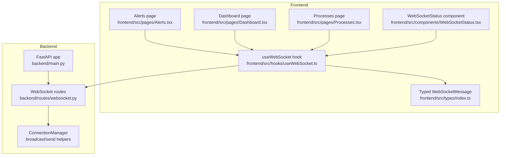
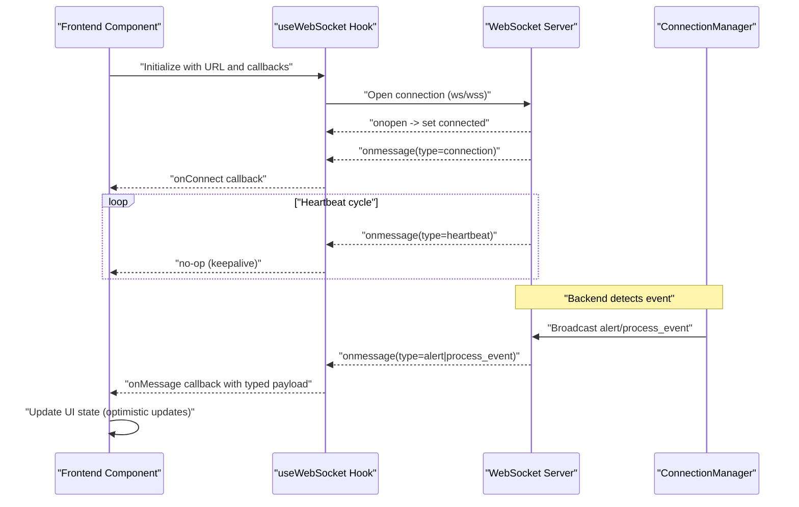
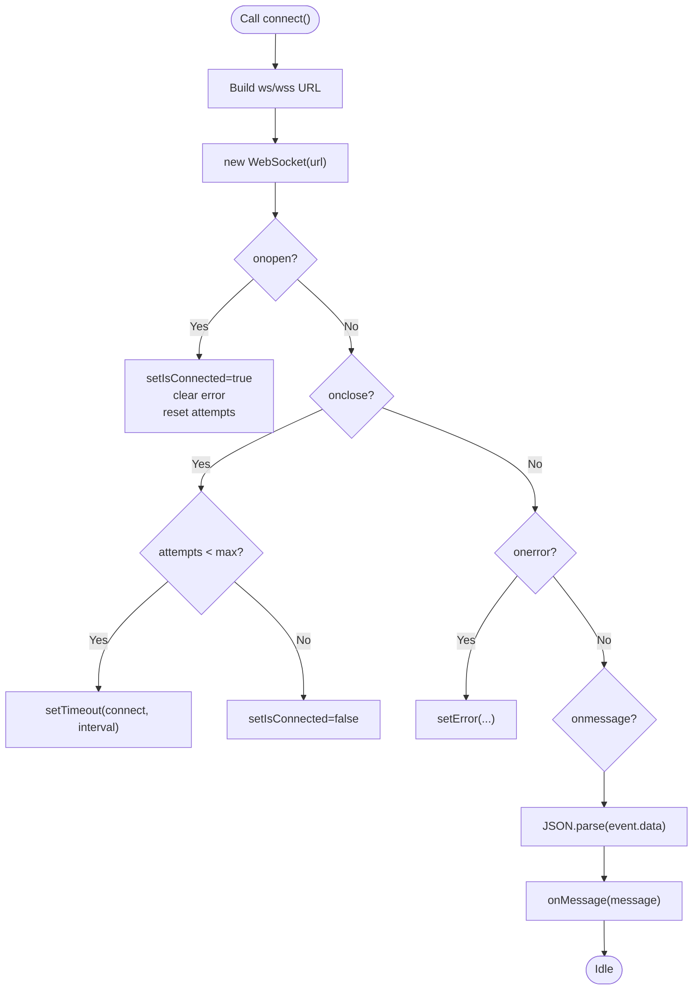
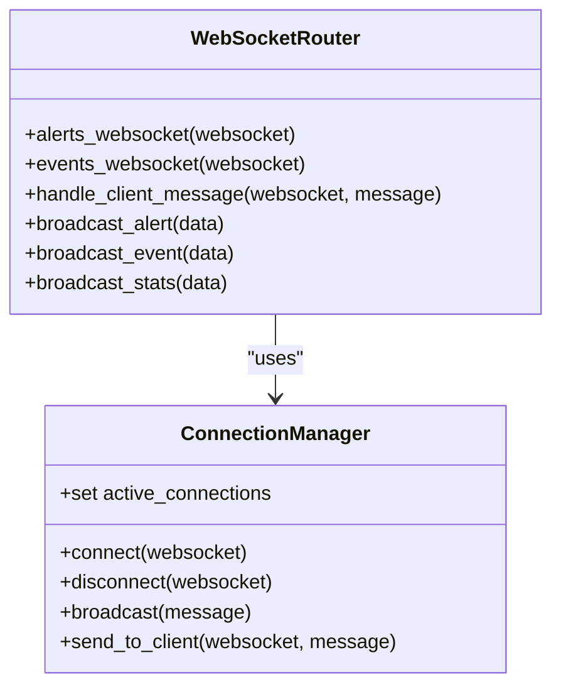
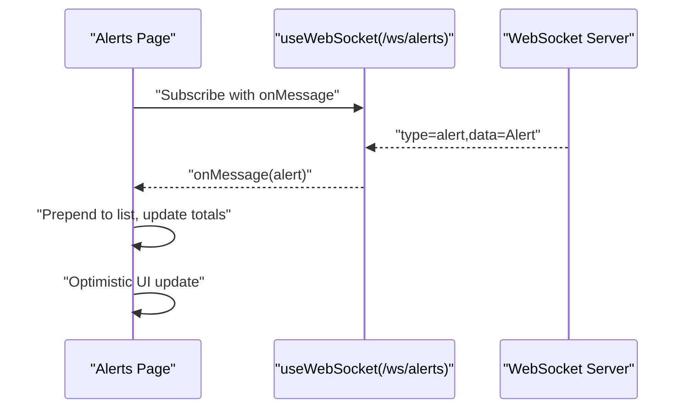
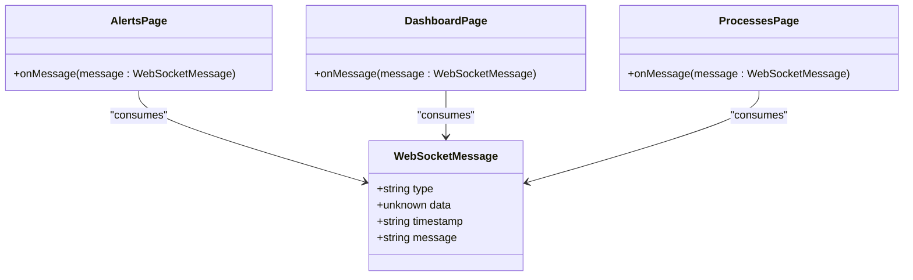
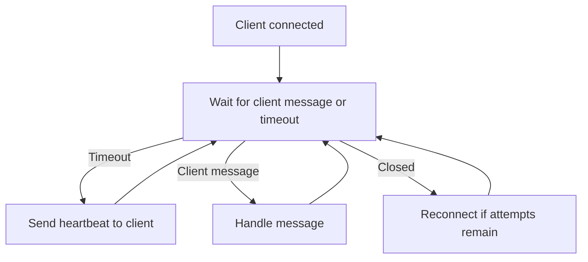
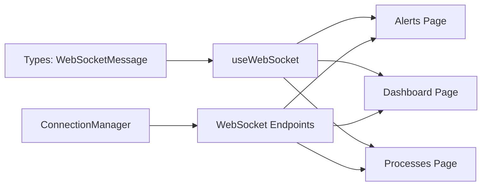

# WebSocket Integration

<cite>
**Referenced Files in This Document**
- [useWebSocket.ts](file://frontend/src/hooks/useWebSocket.ts)
- [index.ts](file://frontend/src/types/index.ts)
- [WebSocketStatus.tsx](file://frontend/src/components/WebSocketStatus.tsx)
- [Alerts.tsx](file://frontend/src/pages/Alerts.tsx)
- [Dashboard.tsx](file://frontend/src/pages/Dashboard.tsx)
- [Processes.tsx](file://frontend/src/pages/Processes.tsx)
- [websocket.py](file://backend/routes/websocket.py)
- [main.py](file://backend/main.py)
</cite>

## Table of Contents
1. [Introduction](#introduction)
2. [Project Structure](#project-structure)
3. [Core Components](#core-components)
4. [Architecture Overview](#architecture-overview)
5. [Detailed Component Analysis](#detailed-component-analysis)
6. [Dependency Analysis](#dependency-analysis)
7. [Performance Considerations](#performance-considerations)
8. [Troubleshooting Guide](#troubleshooting-guide)
9. [Conclusion](#conclusion)

## Introduction
This document explains EDR Lite’s WebSocket integration and real-time communication patterns. It focuses on the custom React hook that manages WebSocket connections, message handling, and reconnection logic; the backend WebSocket server that broadcasts live updates; and the frontend components that consume real-time data. It also covers TypeScript integration for message typing, event-driven architecture, error handling, heartbeat mechanisms, and performance optimization strategies.

## Project Structure
The WebSocket integration spans the frontend React application and the backend FastAPI service:
- Frontend
  - Custom hook for WebSocket lifecycle and reconnection
  - Type definitions for typed WebSocket messages
  - UI components that subscribe to real-time streams
- Backend
  - WebSocket endpoints for alerts and process events
  - Connection manager for broadcasting to all clients
  - Heartbeat and client message handling
  - Background tasks that trigger broadcasts

**Diagram sources**
- [useWebSocket.ts:1-103](file://frontend/src/hooks/useWebSocket.ts#L1-L103)
- [index.ts:78-83](file://frontend/src/types/index.ts#L78-L83)
- [Alerts.tsx:47-58](file://frontend/src/pages/Alerts.tsx#L47-L58)
- [Dashboard.tsx:45-58](file://frontend/src/pages/Dashboard.tsx#L45-L58)
- [Processes.tsx:31-41](file://frontend/src/pages/Processes.tsx#L31-L41)
- [WebSocketStatus.tsx:4-7](file://frontend/src/components/WebSocketStatus.tsx#L4-L7)
- [websocket.py:21-65](file://backend/routes/websocket.py#L21-L65)
- [main.py:171-192](file://backend/main.py#L171-L192)

**Section sources**
- [useWebSocket.ts:1-103](file://frontend/src/hooks/useWebSocket.ts#L1-L103)
- [index.ts:78-83](file://frontend/src/types/index.ts#L78-L83)
- [Alerts.tsx:47-58](file://frontend/src/pages/Alerts.tsx#L47-L58)
- [Dashboard.tsx:45-58](file://frontend/src/pages/Dashboard.tsx#L45-L58)
- [Processes.tsx:31-41](file://frontend/src/pages/Processes.tsx#L31-L41)
- [WebSocketStatus.tsx:4-7](file://frontend/src/components/WebSocketStatus.tsx#L4-L7)
- [websocket.py:21-65](file://backend/routes/websocket.py#L21-L65)
- [main.py:171-192](file://backend/main.py#L171-L192)

## Core Components
- Frontend useWebSocket hook
  - Establishes WebSocket connections with automatic reconnection
  - Parses incoming JSON messages and dispatches typed events
  - Exposes send, connect, and disconnect utilities
- Backend WebSocket router
  - Accepts connections and maintains a set of active clients
  - Broadcasts alerts and process events to all clients
  - Implements heartbeat and client message handling
- Typed message contract
  - Defines the shape of WebSocket messages exchanged between frontend and backend

Key responsibilities:
- Real-time updates: Alerts and process events are pushed to subscribed clients
- Reconnection: Automatic retry with capped attempts and exponential-like backoff
- Heartbeat: Periodic keepalive messages to maintain liveness
- Event-driven UI: Pages subscribe to streams and update state reactively

**Section sources**
- [useWebSocket.ts:13-103](file://frontend/src/hooks/useWebSocket.ts#L13-L103)
- [websocket.py:21-65](file://backend/routes/websocket.py#L21-L65)
- [index.ts:78-83](file://frontend/src/types/index.ts#L78-L83)

## Architecture Overview
The system uses a publish-subscribe pattern:
- Backend detects events and broadcasts them to all connected clients
- Frontend components subscribe to specific streams via the useWebSocket hook
- Messages are JSON-encoded with a type discriminator and payload

**Diagram sources**
- [useWebSocket.ts:27-72](file://frontend/src/hooks/useWebSocket.ts#L27-L72)
- [websocket.py:68-118](file://backend/routes/websocket.py#L68-L118)
- [websocket.py:209-224](file://backend/routes/websocket.py#L209-L224)

## Detailed Component Analysis

### useWebSocket Hook
The hook encapsulates connection lifecycle, message parsing, and reconnection logic:
- Connection establishment
  - Determines ws or wss based on current page protocol
  - Accepts absolute URLs or path-based URLs; normalizes to full WebSocket URL
- Message handling
  - Parses JSON payloads and forwards typed messages to onMessage
  - Logs parsing errors and prevents crashes
- Reconnection
  - Tracks reconnect attempts and schedules timeouts
  - Stops timers on manual disconnect
- Utilities
  - sendMessage serializes and sends messages when ready
  - Provides connect/disconnect controls

**Diagram sources**
- [useWebSocket.ts:27-72](file://frontend/src/hooks/useWebSocket.ts#L27-L72)

**Section sources**
- [useWebSocket.ts:13-103](file://frontend/src/hooks/useWebSocket.ts#L13-L103)

### Backend WebSocket Router and Connection Manager
The backend exposes two WebSocket endpoints and a shared manager:
- Endpoints
  - /ws/alerts: Live security alerts
  - /ws/events: Live process creation events
- ConnectionManager
  - Accepts connections and tracks active clients
  - Broadcasts messages to all clients with cleanup on failures
  - Sends targeted messages to specific clients
- Heartbeat and client messages
  - Sends periodic heartbeat messages to keep connections alive
  - Handles client ping/pong, subscription, and stats requests
- Broadcasting
  - Alerts and process events are broadcast to all clients
  - Stats updates are broadcast periodically by the background task

**Diagram sources**
- [websocket.py:21-65](file://backend/routes/websocket.py#L21-L65)
- [websocket.py:68-233](file://backend/routes/websocket.py#L68-L233)

**Section sources**
- [websocket.py:21-65](file://backend/routes/websocket.py#L21-L65)
- [websocket.py:68-167](file://backend/routes/websocket.py#L68-L167)
- [websocket.py:209-233](file://backend/routes/websocket.py#L209-L233)

### Frontend Pages and Real-Time Updates
- Alerts page
  - Subscribes to /ws/alerts
  - On alert messages, prepends new alerts and increments totals
- Dashboard
  - Subscribes to /ws/alerts
  - On alert or process event messages, updates recent lists
- Processes page
  - Subscribes to /ws/events
  - On process_event messages, prepends new events and limits list size

**Diagram sources**
- [Alerts.tsx:47-58](file://frontend/src/pages/Alerts.tsx#L47-L58)
- [useWebSocket.ts:60-67](file://frontend/src/hooks/useWebSocket.ts#L60-L67)
- [websocket.py:209-215](file://backend/routes/websocket.py#L209-L215)

**Section sources**
- [Alerts.tsx:47-58](file://frontend/src/pages/Alerts.tsx#L47-L58)
- [Dashboard.tsx:45-58](file://frontend/src/pages/Dashboard.tsx#L45-L58)
- [Processes.tsx:31-41](file://frontend/src/pages/Processes.tsx#L31-L41)

### TypeScript Integration and Message Typing
- WebSocketMessage defines the canonical message shape:
  - type discriminator for routing
  - optional data payload
  - timestamp and optional human-readable message
- Frontend components receive typed messages and update state accordingly
- Backend constructs messages with consistent fields and broadcasts them

**Diagram sources**
- [index.ts:78-83](file://frontend/src/types/index.ts#L78-L83)
- [Alerts.tsx:47-53](file://frontend/src/pages/Alerts.tsx#L47-L53)
- [Dashboard.tsx:45-52](file://frontend/src/pages/Dashboard.tsx#L45-L52)
- [Processes.tsx:31-36](file://frontend/src/pages/Processes.tsx#L31-L36)

**Section sources**
- [index.ts:78-83](file://frontend/src/types/index.ts#L78-L83)
- [Alerts.tsx:47-53](file://frontend/src/pages/Alerts.tsx#L47-L53)
- [Dashboard.tsx:45-52](file://frontend/src/pages/Dashboard.tsx#L45-L52)
- [Processes.tsx:31-36](file://frontend/src/pages/Processes.tsx#L31-L36)

### Heartbeat and Connection Recovery
- Heartbeat
  - Backend sends heartbeat messages to keep connections alive
  - Frontend receives heartbeats without UI changes
- Recovery
  - Frontend attempts reconnection on close with bounded retries
  - Timer is cleared on manual disconnect to prevent spurious reconnects

**Diagram sources**
- [websocket.py:107-112](file://backend/routes/websocket.py#L107-L112)
- [useWebSocket.ts:46-52](file://frontend/src/hooks/useWebSocket.ts#L46-L52)

**Section sources**
- [websocket.py:107-112](file://backend/routes/websocket.py#L107-L112)
- [useWebSocket.ts:46-52](file://frontend/src/hooks/useWebSocket.ts#L46-L52)

### Browser Compatibility and Fallback Strategies
- Protocol selection
  - Automatically uses wss for HTTPS and ws for HTTP
- Fallback
  - No polling fallback is implemented in the current code
  - Consider adding Server-Sent Events or long-polling if WebSocket fails to connect
- Debugging
  - Inspect browser network panel for WebSocket handshake and frames
  - Use WebSocketStatus component to visually confirm connectivity

**Section sources**
- [useWebSocket.ts:28-32](file://frontend/src/hooks/useWebSocket.ts#L28-L32)
- [WebSocketStatus.tsx:4-7](file://frontend/src/components/WebSocketStatus.tsx#L4-L7)

## Dependency Analysis
- Frontend-to-backend dependencies
  - useWebSocket depends on WebSocketMessage typing
  - Pages depend on useWebSocket for subscriptions
  - Backend routes depend on ConnectionManager for broadcasting
- Internal backend dependencies
  - WebSocket endpoints rely on ConnectionManager
  - Background tasks trigger broadcasts to clients

**Diagram sources**
- [index.ts:78-83](file://frontend/src/types/index.ts#L78-L83)
- [useWebSocket.ts:1-103](file://frontend/src/hooks/useWebSocket.ts#L1-L103)
- [Alerts.tsx:47-58](file://frontend/src/pages/Alerts.tsx#L47-L58)
- [Dashboard.tsx:45-58](file://frontend/src/pages/Dashboard.tsx#L45-L58)
- [Processes.tsx:31-41](file://frontend/src/pages/Processes.tsx#L31-L41)
- [websocket.py:21-65](file://backend/routes/websocket.py#L21-L65)

**Section sources**
- [index.ts:78-83](file://frontend/src/types/index.ts#L78-L83)
- [useWebSocket.ts:1-103](file://frontend/src/hooks/useWebSocket.ts#L1-L103)
- [websocket.py:21-65](file://backend/routes/websocket.py#L21-L65)

## Performance Considerations
- Message volume
  - Limit the number of items shown in real-time lists (e.g., cap recent alerts/events)
  - Debounce or batch UI updates when receiving bursts of events
- Connection scaling
  - ConnectionManager cleans up failed connections automatically
  - Consider rate-limiting or throttling for high-frequency events
- Memory and timers
  - Clear reconnect timers on component unmount to avoid leaks
  - Avoid retaining large payloads in message handlers

[No sources needed since this section provides general guidance]

## Troubleshooting Guide
- Connection fails immediately
  - Verify protocol selection matches deployment (wss vs ws)
  - Check CORS configuration and origin settings
- Frequent reconnections
  - Review reconnect attempts and interval configuration
  - Inspect server-side exceptions and client timeouts
- Heartbeat not received
  - Confirm backend heartbeat logic and client-side handling
- Parsing errors
  - Ensure frontend parses only properly structured JSON messages
  - Validate message shapes on the backend before sending

**Section sources**
- [useWebSocket.ts:55-71](file://frontend/src/hooks/useWebSocket.ts#L55-L71)
- [websocket.py:107-112](file://backend/routes/websocket.py#L107-L112)

## Conclusion
EDR Lite’s WebSocket integration provides a robust, event-driven real-time experience:
- The frontend uses a reusable hook to manage connections, handle messages, and recover from failures
- The backend implements a scalable broadcast mechanism with heartbeat and client message handling
- TypeScript ensures safe message contracts across the wire
- Pages subscribe to streams and apply optimistic updates for responsive UX
Future enhancements could include fallback transports, rate limiting, and richer client-side caching strategies.