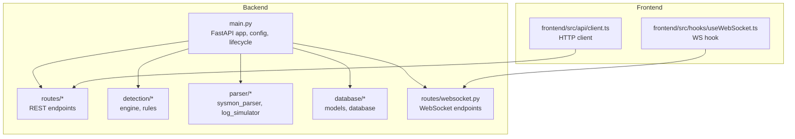
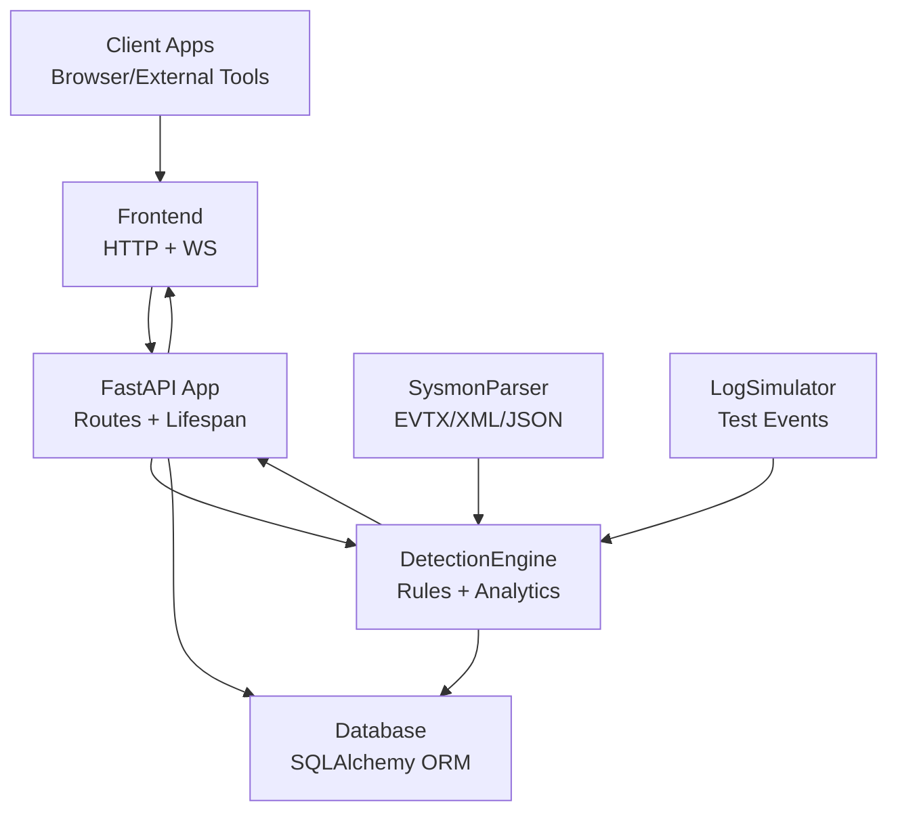
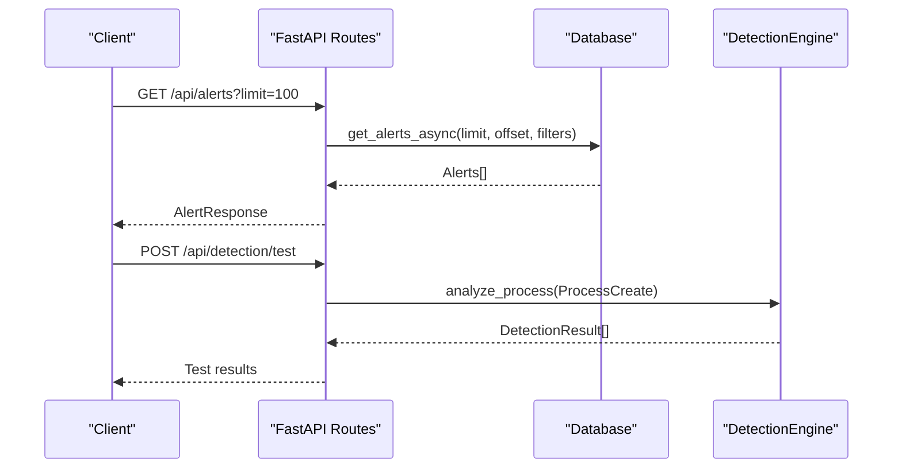
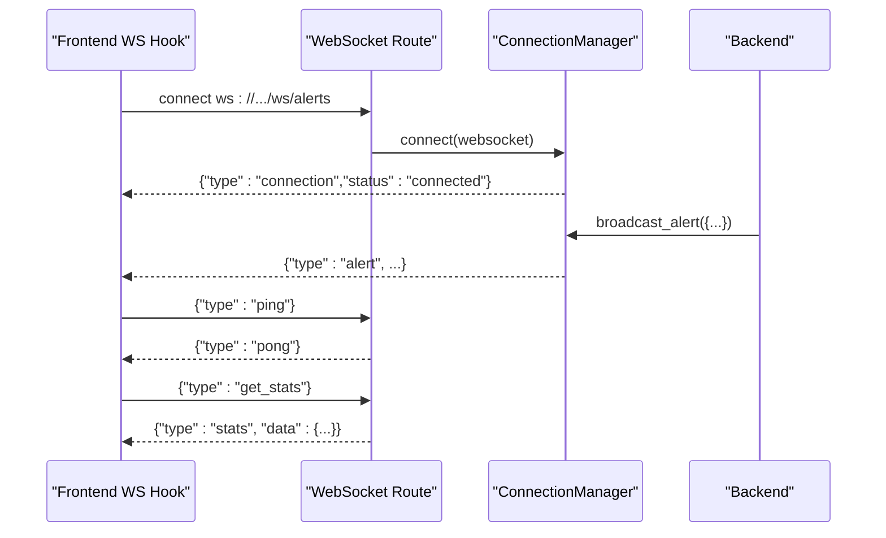
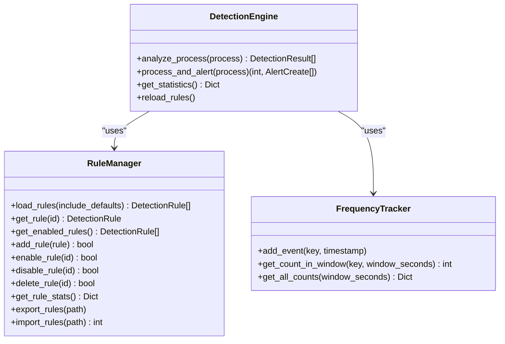
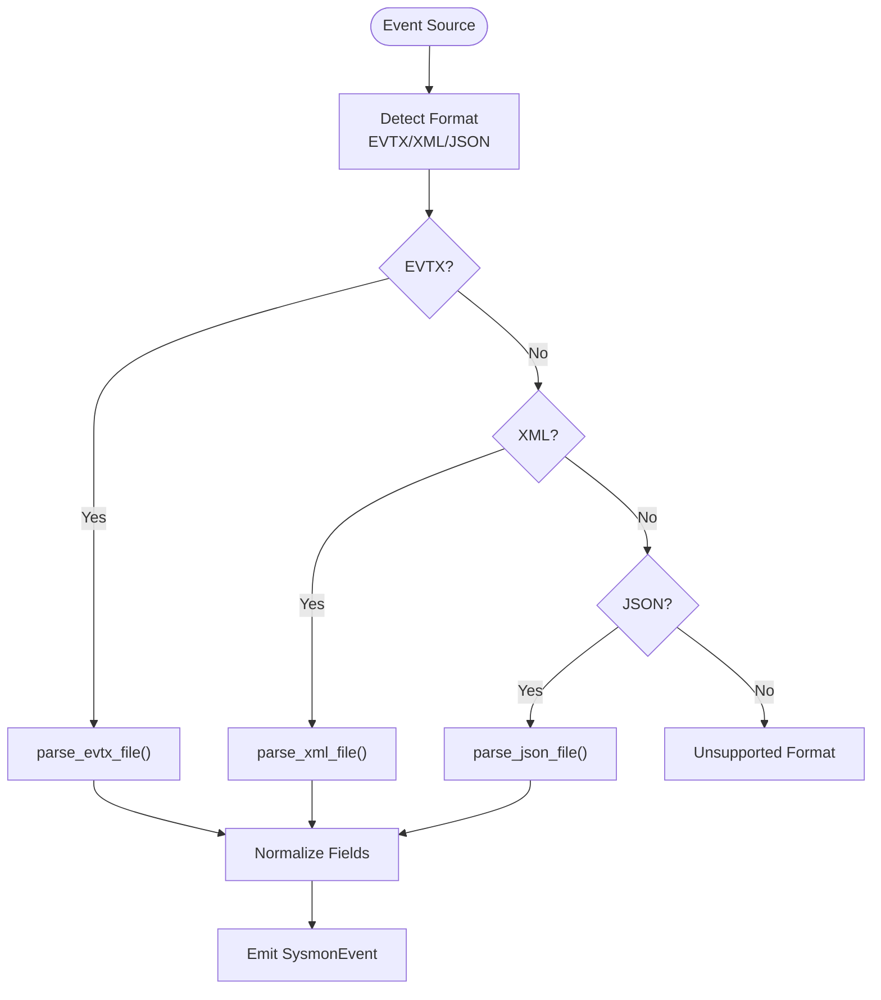
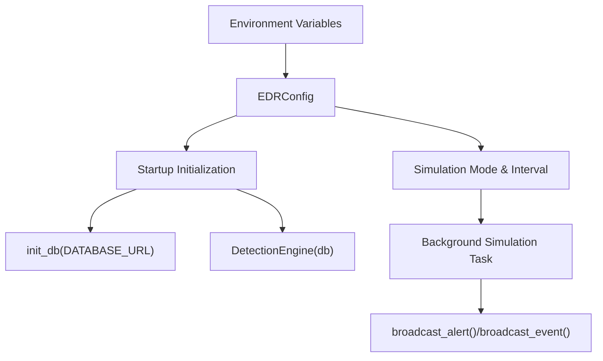
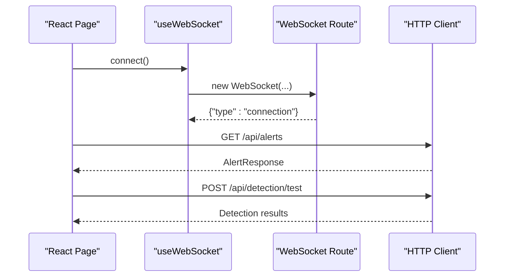
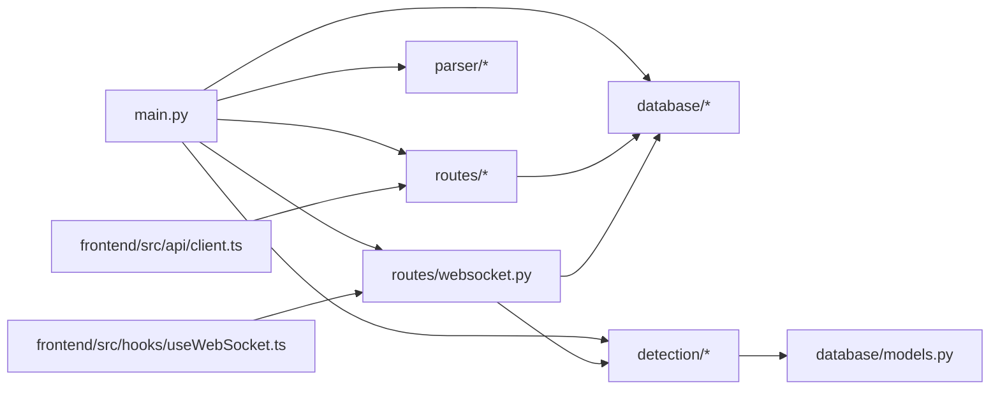

# Integration Patterns

<cite>
**Referenced Files in This Document**
- [backend/main.py](file://backend/main.py)
- [backend/detection/engine.py](file://backend/detection/engine.py)
- [backend/detection/rules.py](file://backend/detection/rules.py)
- [backend/parser/sysmon_parser.py](file://backend/parser/sysmon_parser.py)
- [backend/parser/log_simulator.py](file://backend/parser/log_simulator.py)
- [backend/database/database.py](file://backend/database/database.py)
- [backend/database/models.py](file://backend/database/models.py)
- [backend/routes/websocket.py](file://backend/routes/websocket.py)
- [backend/routes/alerts.py](file://backend/routes/alerts.py)
- [backend/routes/processes.py](file://backend/routes/processes.py)
- [backend/routes/detection.py](file://backend/routes/detection.py)
- [frontend/src/api/client.ts](file://frontend/src/api/client.ts)
- [frontend/src/hooks/useWebSocket.ts](file://frontend/src/hooks/useWebSocket.ts)
</cite>

## Table of Contents
1. [Introduction](#introduction)
2. [Project Structure](#project-structure)
3. [Core Components](#core-components)
4. [Architecture Overview](#architecture-overview)
5. [Detailed Component Analysis](#detailed-component-analysis)
6. [Dependency Analysis](#dependency-analysis)
7. [Performance Considerations](#performance-considerations)
8. [Troubleshooting Guide](#troubleshooting-guide)
9. [Conclusion](#conclusion)
10. [Appendices](#appendices)

## Introduction
This document explains EDR Lite’s integration patterns and extensibility points. It covers:
- Plugin architecture for detection rules and runtime rule management
- Parser extensibility for Windows Sysmon and other log formats
- WebSocket message handling framework for real-time alerts and events
- REST API integration patterns for ingestion, alerts, processes, and detection
- Configuration system for environment variables, detection rule management, and runtime toggles
- Extension mechanisms for custom detection algorithms, parsers, and WebSocket channels
- Deployment integration patterns, reverse proxy setup, and production configuration options

## Project Structure
EDR Lite follows a layered backend (FastAPI) plus a separate frontend (React + TypeScript). The backend organizes concerns by domain:
- Routes: REST endpoints for alerts, processes, detection, and WebSocket
- Database: SQLAlchemy ORM models and async/sync sessions
- Detection: Rule engine, rule manager, and analytics
- Parser: Sysmon event parsing and log simulation
- Main: Application lifecycle, configuration, and orchestration

**Diagram sources**
- [backend/main.py:171-224](file://backend/main.py#L171-L224)
- [backend/routes/alerts.py:18-54](file://backend/routes/alerts.py#L18-L54)
- [backend/routes/processes.py:19-42](file://backend/routes/processes.py#L19-L42)
- [backend/routes/detection.py:44-71](file://backend/routes/detection.py#L44-L71)
- [backend/routes/websocket.py:68-166](file://backend/routes/websocket.py#L68-L166)
- [backend/detection/engine.py:64-82](file://backend/detection/engine.py#L64-L82)
- [backend/parser/sysmon_parser.py:61-95](file://backend/parser/sysmon_parser.py#L61-L95)
- [backend/database/database.py:21-84](file://backend/database/database.py#L21-L84)
- [frontend/src/api/client.ts:1-124](file://frontend/src/api/client.ts#L1-L124)
- [frontend/src/hooks/useWebSocket.ts:13-103](file://frontend/src/hooks/useWebSocket.ts#L13-L103)

**Section sources**
- [backend/main.py:171-224](file://backend/main.py#L171-L224)
- [backend/routes/alerts.py:18-54](file://backend/routes/alerts.py#L18-L54)
- [backend/routes/processes.py:19-42](file://backend/routes/processes.py#L19-L42)
- [backend/routes/detection.py:44-71](file://backend/routes/detection.py#L44-L71)
- [backend/routes/websocket.py:68-166](file://backend/routes/websocket.py#L68-L166)
- [backend/detection/engine.py:64-82](file://backend/detection/engine.py#L64-L82)
- [backend/parser/sysmon_parser.py:61-95](file://backend/parser/sysmon_parser.py#L61-L95)
- [backend/database/database.py:21-84](file://backend/database/database.py#L21-L84)
- [frontend/src/api/client.ts:1-124](file://frontend/src/api/client.ts#L1-L124)
- [frontend/src/hooks/useWebSocket.ts:13-103](file://frontend/src/hooks/useWebSocket.ts#L13-L103)

## Core Components
- Application configuration and lifecycle: Environment-driven configuration, CORS, database initialization, detection engine initialization, and background simulation tasks.
- REST API: Alerts, processes, detection/rule management, ingestion, simulation controls, and stats.
- WebSocket: Real-time alert and event streaming with connection management and broadcasting.
- Detection engine: Rule evaluation, frequency tracking, and alert generation.
- Parser: Sysmon event parsing from EVTX/XML/JSON and log simulation for testing.
- Database: ORM models and async/sync sessions for persistence.

**Section sources**
- [backend/main.py:51-118](file://backend/main.py#L51-L118)
- [backend/main.py:243-358](file://backend/main.py#L243-L358)
- [backend/routes/websocket.py:21-62](file://backend/routes/websocket.py#L21-L62)
- [backend/detection/engine.py:64-120](file://backend/detection/engine.py#L64-L120)
- [backend/parser/sysmon_parser.py:61-95](file://backend/parser/sysmon_parser.py#L61-L95)
- [backend/database/database.py:21-84](file://backend/database/database.py#L21-L84)

## Architecture Overview
The system integrates three primary data flows:
- Ingestion: Sysmon events (via parser) enter the detection engine, which persists process events and generates alerts.
- Real-time streaming: WebSocket endpoints broadcast live alerts and process events to clients.
- REST API: Clients query alerts, processes, detection rules, and system stats; also trigger ingestion and simulation.

**Diagram sources**
- [backend/main.py:171-224](file://backend/main.py#L171-L224)
- [backend/detection/engine.py:64-120](file://backend/detection/engine.py#L64-L120)
- [backend/parser/sysmon_parser.py:61-95](file://backend/parser/sysmon_parser.py#L61-L95)
- [backend/parser/log_simulator.py:18-44](file://backend/parser/log_simulator.py#L18-L44)
- [backend/database/database.py:21-84](file://backend/database/database.py#L21-L84)
- [frontend/src/api/client.ts:1-124](file://frontend/src/api/client.ts#L1-L124)
- [frontend/src/hooks/useWebSocket.ts:13-103](file://frontend/src/hooks/useWebSocket.ts#L13-L103)

## Detailed Component Analysis

### REST API Integration Patterns
- Alerts API: Retrieve paginated alerts, filter by severity and acknowledgment, get recent alerts, acknowledge/unacknowledge, bulk operations, and delete.
- Processes API: Paginated retrieval, recent processes, stats, per-process details, process tree visualization, and parent-based queries.
- Detection API: CRUD and toggle for rules, reload rules, export/import rules, test process against rules, and detection engine stats.
- System endpoints: Health check, stats, manual ingestion, and simulation controls.

**Diagram sources**
- [backend/routes/alerts.py:18-54](file://backend/routes/alerts.py#L18-L54)
- [backend/routes/detection.py:168-211](file://backend/routes/detection.py#L168-L211)
- [backend/database/database.py:217-245](file://backend/database/database.py#L217-L245)

**Section sources**
- [backend/routes/alerts.py:18-180](file://backend/routes/alerts.py#L18-L180)
- [backend/routes/processes.py:19-253](file://backend/routes/processes.py#L19-L253)
- [backend/routes/detection.py:44-256](file://backend/routes/detection.py#L44-L256)
- [backend/database/database.py:217-308](file://backend/database/database.py#L217-L308)

### WebSocket Message Handling Framework
- Two WebSocket channels: alerts and events.
- ConnectionManager maintains active connections and broadcasts messages.
- Server sends periodic heartbeats and handles client ping/subscribe/get_stats messages.
- Backend broadcasts new alerts and process events to connected clients.

**Diagram sources**
- [backend/routes/websocket.py:21-62](file://backend/routes/websocket.py#L21-L62)
- [backend/routes/websocket.py:68-206](file://backend/routes/websocket.py#L68-L206)
- [frontend/src/hooks/useWebSocket.ts:13-103](file://frontend/src/hooks/useWebSocket.ts#L13-L103)

**Section sources**
- [backend/routes/websocket.py:21-233](file://backend/routes/websocket.py#L21-L233)
- [frontend/src/hooks/useWebSocket.ts:13-103](file://frontend/src/hooks/useWebSocket.ts#L13-L103)

### Detection Engine and Rule Management
- DetectionEngine evaluates incoming ProcessCreate events against enabled DetectionRule entries.
- RuleManager loads default and custom rules from JSON files, supports CRUD, toggle, and reload.
- FrequencyTracker tracks parent-to-child spawn rates for anomaly detection.
- Results are persisted as alerts with severity and risk scores.

**Diagram sources**
- [backend/detection/engine.py:64-324](file://backend/detection/engine.py#L64-L324)
- [backend/detection/rules.py:273-480](file://backend/detection/rules.py#L273-L480)

**Section sources**
- [backend/detection/engine.py:64-324](file://backend/detection/engine.py#L64-L324)
- [backend/detection/rules.py:273-480](file://backend/detection/rules.py#L273-L480)

### Parser Extensibility for Log Formats
- SysmonParser supports EVTX, XML, and JSON inputs, extracting standardized fields and creating SysmonEvent objects.
- LogSimulator generates synthetic Sysmon events for testing and demonstration, supporting batches and streams.

**Diagram sources**
- [backend/parser/sysmon_parser.py:96-194](file://backend/parser/sysmon_parser.py#L96-L194)
- [backend/parser/log_simulator.py:138-236](file://backend/parser/log_simulator.py#L138-L236)

**Section sources**
- [backend/parser/sysmon_parser.py:96-385](file://backend/parser/sysmon_parser.py#L96-L385)
- [backend/parser/log_simulator.py:18-315](file://backend/parser/log_simulator.py#L18-L315)

### Configuration System and Runtime Controls
- Environment variables configure database URL, CORS origins, simulation mode, and intervals.
- Runtime toggles include enabling/disabling simulation and manual ingestion endpoints.
- Health and stats endpoints expose system status and detection statistics.

**Diagram sources**
- [backend/main.py:51-118](file://backend/main.py#L51-L118)
- [backend/database/database.py:42-74](file://backend/database/database.py#L42-L74)
- [backend/detection/engine.py:64-82](file://backend/detection/engine.py#L64-L82)

**Section sources**
- [backend/main.py:51-118](file://backend/main.py#L51-L118)
- [backend/database/database.py:42-74](file://backend/database/database.py#L42-L74)
- [backend/detection/engine.py:64-82](file://backend/detection/engine.py#L64-L82)

### Frontend Integration Patterns
- HTTP client wraps Axios with typed endpoints for alerts, processes, detection, and system operations.
- WebSocket hook manages connection lifecycle, reconnection, and message parsing.

**Diagram sources**
- [frontend/src/hooks/useWebSocket.ts:13-103](file://frontend/src/hooks/useWebSocket.ts#L13-L103)
- [frontend/src/api/client.ts:1-124](file://frontend/src/api/client.ts#L1-124)

**Section sources**
- [frontend/src/hooks/useWebSocket.ts:13-103](file://frontend/src/hooks/useWebSocket.ts#L13-L103)
- [frontend/src/api/client.ts:1-124](file://frontend/src/api/client.ts#L1-L124)

## Dependency Analysis
Key dependencies and relationships:
- main.py orchestrates routes, database, detection engine, and WebSocket broadcasting.
- DetectionEngine depends on RuleManager and Database.
- SysmonParser and LogSimulator feed ProcessCreate objects into DetectionEngine.
- WebSocket routes depend on ConnectionManager and broadcast utilities.
- Frontend HTTP client depends on backend REST endpoints; WebSocket hook depends on WebSocket routes.

**Diagram sources**
- [backend/main.py:171-224](file://backend/main.py#L171-L224)
- [backend/detection/engine.py:64-82](file://backend/detection/engine.py#L64-L82)
- [backend/database/models.py:1-77](file://backend/database/models.py#L1-L77)
- [backend/routes/websocket.py:21-62](file://backend/routes/websocket.py#L21-L62)
- [frontend/src/api/client.ts:1-124](file://frontend/src/api/client.ts#L1-L124)
- [frontend/src/hooks/useWebSocket.ts:13-103](file://frontend/src/hooks/useWebSocket.ts#L13-L103)

**Section sources**
- [backend/main.py:171-224](file://backend/main.py#L171-L224)
- [backend/detection/engine.py:64-82](file://backend/detection/engine.py#L64-L82)
- [backend/database/models.py:1-77](file://backend/database/models.py#L1-L77)
- [backend/routes/websocket.py:21-62](file://backend/routes/websocket.py#L21-L62)
- [frontend/src/api/client.ts:1-124](file://frontend/src/api/client.ts#L1-L124)
- [frontend/src/hooks/useWebSocket.ts:13-103](file://frontend/src/hooks/useWebSocket.ts#L13-L103)

## Performance Considerations
- Asynchronous database sessions reduce blocking during I/O.
- FrequencyTracker uses thread-safe deques and locks to maintain counts efficiently.
- WebSocket broadcasting iterates active connections and cleans up disconnected clients.
- Simulation tasks sleep between iterations to avoid CPU spikes.
- Rule evaluation short-circuits on non-matching conditions to minimize work.

[No sources needed since this section provides general guidance]

## Troubleshooting Guide
- Health checks: Use the health endpoint to confirm database connectivity and engine status.
- Stats endpoints: Use detection and system stats to diagnose throughput and rule activity.
- WebSocket diagnostics: Verify connection status and heartbeat messages; inspect client-side reconnection behavior.
- Parser errors: Review parser statistics and error lists for malformed events.
- Database cleanup: Use retention utilities to remove old data periodically.

**Section sources**
- [backend/main.py:214-240](file://backend/main.py#L214-L240)
- [backend/routes/websocket.py:169-206](file://backend/routes/websocket.py#L169-L206)
- [backend/parser/sysmon_parser.py:374-385](file://backend/parser/sysmon_parser.py#L374-L385)
- [backend/database/database.py:296-308](file://backend/database/database.py#L296-L308)

## Conclusion
EDR Lite provides a modular, extensible platform for endpoint detection and response:
- REST APIs enable ingestion, alerting, process inspection, and rule management.
- WebSocket channels deliver real-time visibility into alerts and events.
- The detection engine and rule manager support runtime customization and extensibility.
- Parser and simulator modules facilitate ingestion from diverse sources and testing.
- Environment-driven configuration and lifecycle management simplify deployment and operations.

[No sources needed since this section summarizes without analyzing specific files]

## Appendices

### Configuration Options
- Environment variables:
  - DATABASE_URL: Database connection string
  - CORS_ORIGINS: Comma-separated list of allowed origins
  - SIMULATION_MODE: Enable/disable simulation
  - SIMULATION_INTERVAL: Seconds between simulated events
  - AUTO_INGEST: Auto-ingest in simulation mode
  - PORT/HOST: Server binding for production
- Runtime toggles:
  - Toggle simulation on/off
  - Manual ingestion endpoint for external Sysmon events

**Section sources**
- [backend/main.py:51-58](file://backend/main.py#L51-L58)
- [backend/main.py:339-358](file://backend/main.py#L339-L358)
- [backend/main.py:243-310](file://backend/main.py#L243-L310)

### Extension Mechanisms
- Custom detection rules:
  - Add JSON rule files in the configured rules directory
  - Use detection API to create/update/delete rules
  - Export/import rules for sharing and backup
- Additional parser implementations:
  - Extend the parser module with new format handlers
  - Ensure normalized event objects compatible with DetectionEngine
- WebSocket channel extensions:
  - Add new WebSocket endpoints mirroring existing patterns
  - Use ConnectionManager for broadcasting and client management

**Section sources**
- [backend/detection/rules.py:273-480](file://backend/detection/rules.py#L273-L480)
- [backend/routes/detection.py:86-158](file://backend/routes/detection.py#L86-L158)
- [backend/parser/sysmon_parser.py:61-95](file://backend/parser/sysmon_parser.py#L61-L95)
- [backend/routes/websocket.py:21-62](file://backend/routes/websocket.py#L21-L62)

### Deployment Integration Patterns
- Reverse proxy:
  - Serve static assets and route API/WebSocket traffic behind a reverse proxy
  - Ensure WebSocket upgrade handling and long-lived connections
- Production configuration:
  - Set HOST/PORT for binding
  - Configure CORS_ORIGINS for trusted frontend origins
  - Use persistent DATABASE_URL for production databases
- Monitoring:
  - Expose health and stats endpoints for external monitoring tools
  - Integrate SIEM via REST ingestion and WebSocket streams

**Section sources**
- [backend/main.py:690-705](file://backend/main.py#L690-L705)
- [backend/main.py:179-186](file://backend/main.py#L179-L186)
- [backend/main.py:214-240](file://backend/main.py#L214-L240)