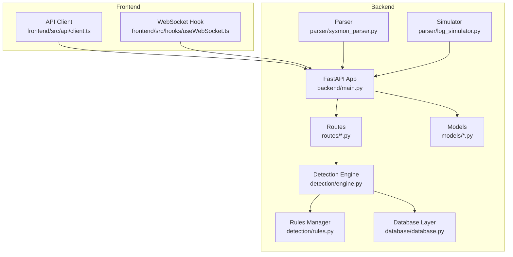
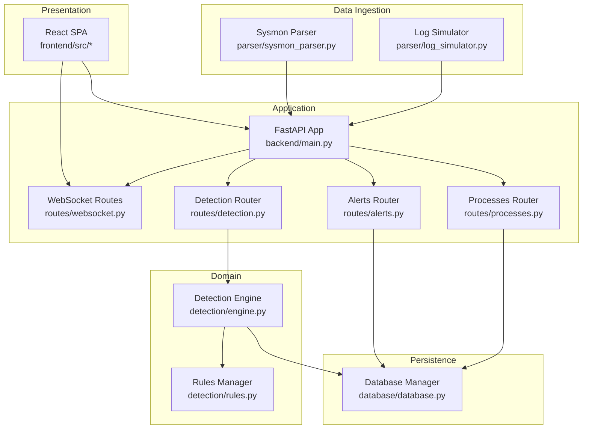
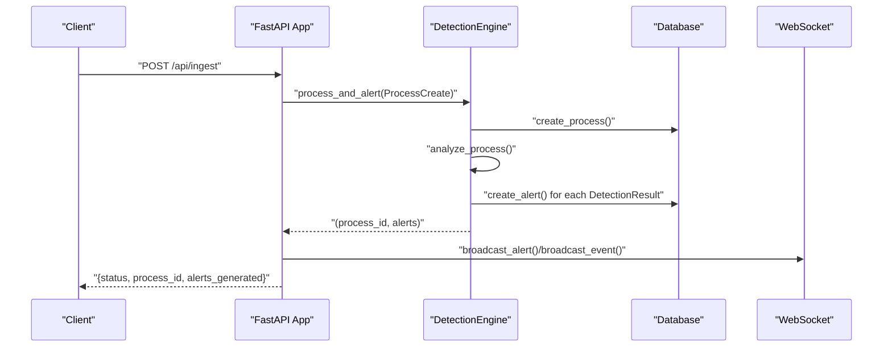
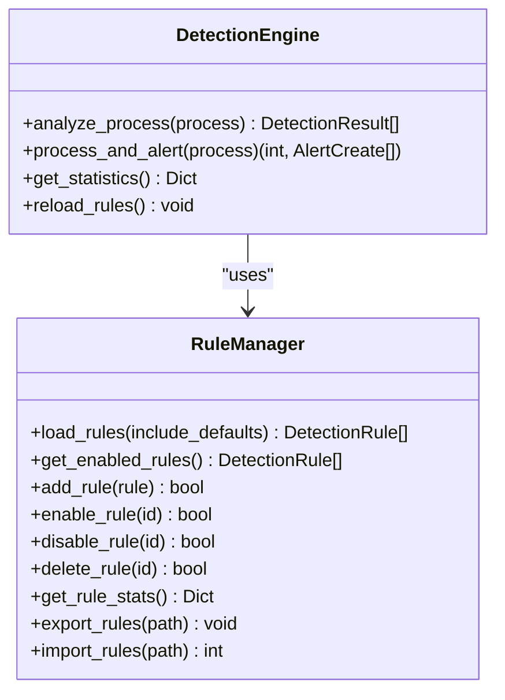
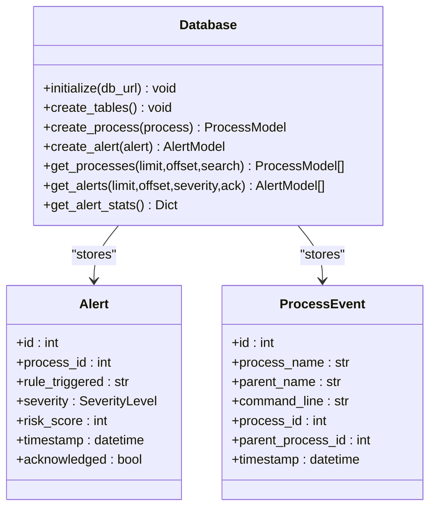
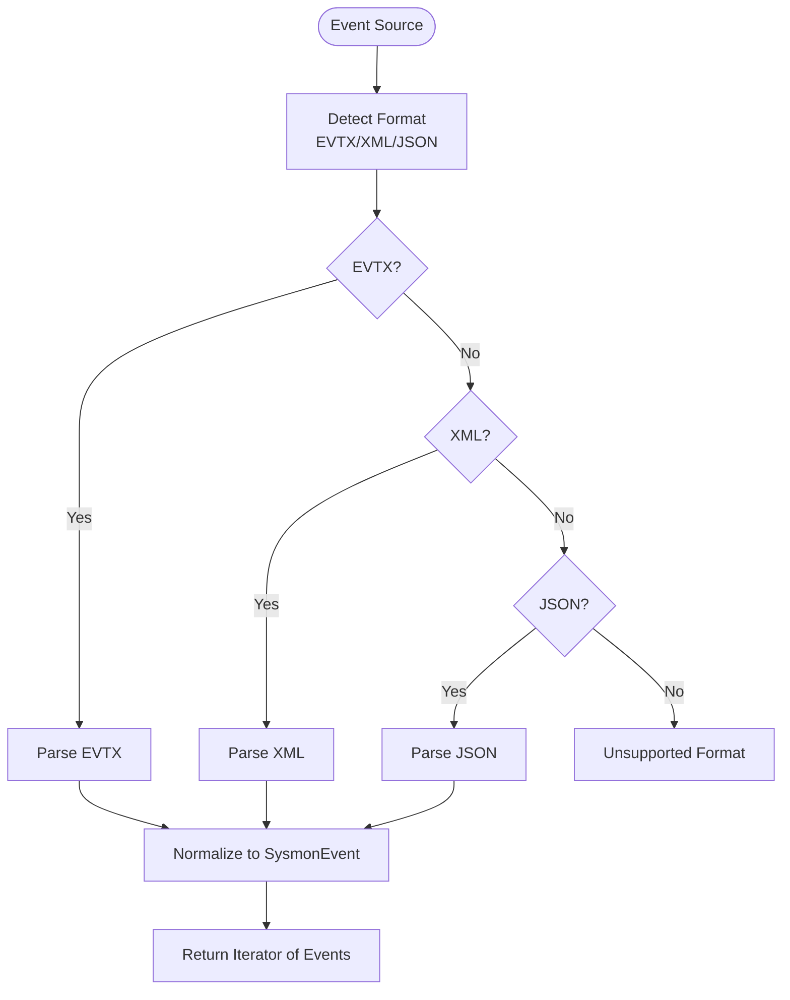
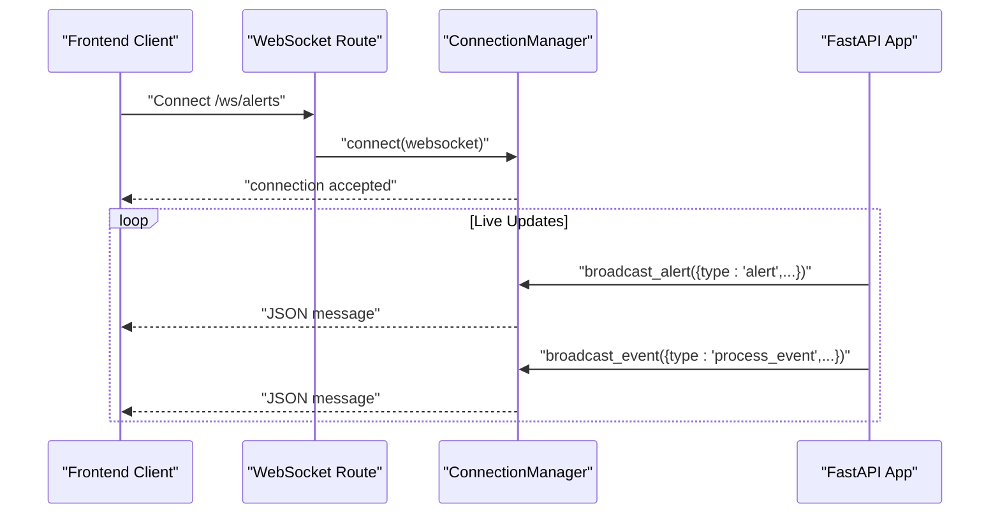
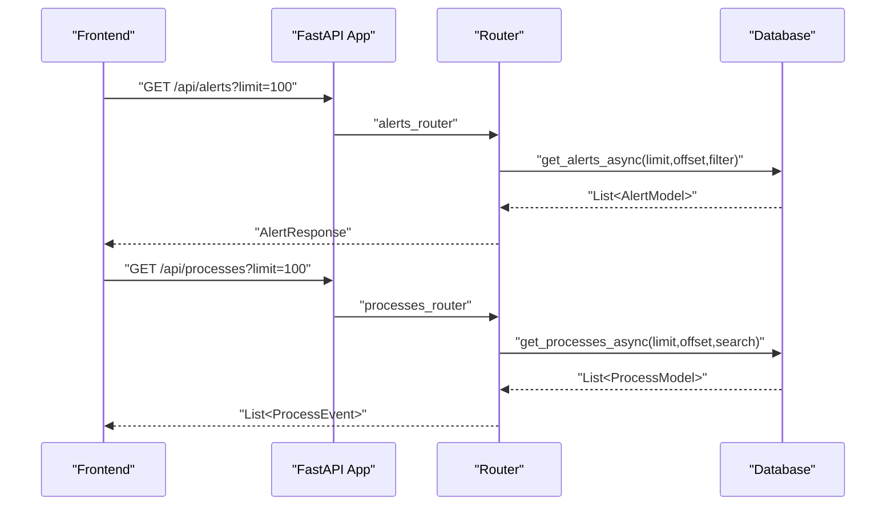
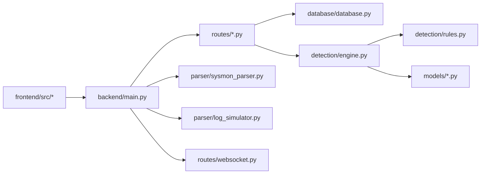

# System Architecture

<cite>
**Referenced Files in This Document**
- [backend/main.py](file://backend/main.py)
- [backend/database/database.py](file://backend/database/database.py)
- [backend/detection/engine.py](file://backend/detection/engine.py)
- [backend/detection/rules.py](file://backend/detection/rules.py)
- [backend/parser/sysmon_parser.py](file://backend/parser/sysmon_parser.py)
- [backend/parser/log_simulator.py](file://backend/parser/log_simulator.py)
- [backend/routes/websocket.py](file://backend/routes/websocket.py)
- [backend/routes/alerts.py](file://backend/routes/alerts.py)
- [backend/routes/processes.py](file://backend/routes/processes.py)
- [backend/routes/detection.py](file://backend/routes/detection.py)
- [backend/models/alert.py](file://backend/models/alert.py)
- [backend/models/process.py](file://backend/models/process.py)
- [backend/models/detection.py](file://backend/models/detection.py)
- [frontend/src/api/client.ts](file://frontend/src/api/client.ts)
- [frontend/src/hooks/useWebSocket.ts](file://frontend/src/hooks/useWebSocket.ts)
</cite>

## Table of Contents
1. [Introduction](#introduction)
2. [Project Structure](#project-structure)
3. [Core Components](#core-components)
4. [Architecture Overview](#architecture-overview)
5. [Detailed Component Analysis](#detailed-component-analysis)
6. [Dependency Analysis](#dependency-analysis)
7. [Performance Considerations](#performance-considerations)
8. [Troubleshooting Guide](#troubleshooting-guide)
9. [Conclusion](#conclusion)
10. [Appendices](#appendices)

## Introduction
This document describes the system architecture of EDR Lite, a lightweight Endpoint Detection and Response platform. It outlines the high-level layered architecture combining a FastAPI backend with a React frontend, real-time WebSocket communication, and a SQLite-backed persistence layer. The system ingests Sysmon process creation events, parses them, applies configurable detection rules, stores outcomes in a database, and streams live updates to the dashboard. Cross-cutting concerns include security, monitoring, and performance optimization strategies.

## Project Structure
The repository follows a clear separation of concerns:
- Backend: FastAPI application with routers, database, detection engine, parser, and models.
- Frontend: React SPA using TypeScript and Vite, communicating with the backend via Axios and WebSocket hooks.
- Sample data: JSON sample Sysmon events for demonstration and testing.

**Diagram sources**
- [backend/main.py:171-192](file://backend/main.py#L171-L192)
- [backend/routes/alerts.py:15](file://backend/routes/alerts.py#L15)
- [backend/routes/processes.py:16](file://backend/routes/processes.py#L16)
- [backend/routes/detection.py:14](file://backend/routes/detection.py#L14)
- [backend/detection/engine.py:64-82](file://backend/detection/engine.py#L64-L82)
- [backend/detection/rules.py:273-313](file://backend/detection/rules.py#L273-L313)
- [backend/database/database.py:21-70](file://backend/database/database.py#L21-L70)
- [backend/parser/sysmon_parser.py:61-95](file://backend/parser/sysmon_parser.py#L61-L95)
- [backend/parser/log_simulator.py:18-37](file://backend/parser/log_simulator.py#L18-L37)
- [backend/models/alert.py:15-38](file://backend/models/alert.py#L15-L38)
- [backend/models/process.py:6-31](file://backend/models/process.py#L6-L31)
- [backend/models/detection.py:17-92](file://backend/models/detection.py#L17-L92)
- [frontend/src/api/client.ts:1-124](file://frontend/src/api/client.ts#L1-L124)
- [frontend/src/hooks/useWebSocket.ts:1-103](file://frontend/src/hooks/useWebSocket.ts#L1-L103)

**Section sources**
- [backend/main.py:171-192](file://backend/main.py#L171-L192)
- [backend/database/database.py:21-70](file://backend/database/database.py#L21-L70)
- [backend/detection/engine.py:64-82](file://backend/detection/engine.py#L64-L82)
- [backend/detection/rules.py:273-313](file://backend/detection/rules.py#L273-L313)
- [backend/parser/sysmon_parser.py:61-95](file://backend/parser/sysmon_parser.py#L61-L95)
- [backend/parser/log_simulator.py:18-37](file://backend/parser/log_simulator.py#L18-L37)
- [backend/routes/websocket.py:14-65](file://backend/routes/websocket.py#L14-L65)
- [backend/models/alert.py:15-38](file://backend/models/alert.py#L15-L38)
- [backend/models/process.py:6-31](file://backend/models/process.py#L6-L31)
- [backend/models/detection.py:17-92](file://backend/models/detection.py#L17-L92)
- [frontend/src/api/client.ts:1-124](file://frontend/src/api/client.ts#L1-L124)
- [frontend/src/hooks/useWebSocket.ts:1-103](file://frontend/src/hooks/useWebSocket.ts#L1-L103)

## Core Components
- FastAPI Application: Orchestrates startup/shutdown, mounts routers, configures CORS, and exposes health and stats endpoints.
- Database Layer: Singleton manager using SQLAlchemy and aiosqlite for SQLite, providing sync and async sessions and CRUD operations.
- Detection Engine: Evaluates incoming process events against JSON-driven rules, tracks frequency anomalies, and generates alerts.
- Rules Manager: Loads default and custom rules from JSON files, supports enabling/disabling, exporting/importing, and runtime reload.
- Parser: Parses Sysmon events from EVTX/XML/JSON formats and normalizes to internal models.
- Log Simulator: Generates synthetic Sysmon events for testing and demonstration.
- WebSocket Routes: Real-time streaming of alerts and process events to connected clients.
- API Routers: REST endpoints for alerts, processes, detection rules, and ingestion.
- Frontend API Client and WebSocket Hook: Axios-based HTTP client and reusable WebSocket hook for real-time updates.

**Section sources**
- [backend/main.py:120-169](file://backend/main.py#L120-L169)
- [backend/database/database.py:21-324](file://backend/database/database.py#L21-L324)
- [backend/detection/engine.py:64-324](file://backend/detection/engine.py#L64-L324)
- [backend/detection/rules.py:273-480](file://backend/detection/rules.py#L273-L480)
- [backend/parser/sysmon_parser.py:61-385](file://backend/parser/sysmon_parser.py#L61-L385)
- [backend/parser/log_simulator.py:18-315](file://backend/parser/log_simulator.py#L18-L315)
- [backend/routes/websocket.py:14-233](file://backend/routes/websocket.py#L14-L233)
- [backend/routes/alerts.py:15-180](file://backend/routes/alerts.py#L15-L180)
- [backend/routes/processes.py:16-253](file://backend/routes/processes.py#L16-L253)
- [backend/routes/detection.py:14-256](file://backend/routes/detection.py#L14-L256)
- [frontend/src/api/client.ts:1-124](file://frontend/src/api/client.ts#L1-L124)
- [frontend/src/hooks/useWebSocket.ts:1-103](file://frontend/src/hooks/useWebSocket.ts#L1-L103)

## Architecture Overview
EDR Lite employs a layered architecture:
- Presentation Layer: React SPA with Axios for REST and WebSocket for live updates.
- Application Layer: FastAPI routes delegate to the detection engine and database layer.
- Domain Layer: Detection engine encapsulates rule evaluation and alert generation.
- Persistence Layer: SQLite via SQLAlchemy and aiosqlite for lightweight deployment.

**Diagram sources**
- [backend/main.py:171-192](file://backend/main.py#L171-L192)
- [backend/routes/websocket.py:14-65](file://backend/routes/websocket.py#L14-L65)
- [backend/routes/alerts.py:15-180](file://backend/routes/alerts.py#L15-L180)
- [backend/routes/processes.py:16-253](file://backend/routes/processes.py#L16-L253)
- [backend/routes/detection.py:14-256](file://backend/routes/detection.py#L14-L256)
- [backend/detection/engine.py:64-82](file://backend/detection/engine.py#L64-L82)
- [backend/detection/rules.py:273-313](file://backend/detection/rules.py#L273-L313)
- [backend/database/database.py:21-70](file://backend/database/database.py#L21-L70)
- [backend/parser/sysmon_parser.py:61-95](file://backend/parser/sysmon_parser.py#L61-L95)
- [backend/parser/log_simulator.py:18-37](file://backend/parser/log_simulator.py#L18-L37)

## Detailed Component Analysis

### FastAPI Application Lifecycle and Endpoints
- Startup: Initializes database, detection engine, optional log simulator, and background monitoring task when simulation mode is enabled.
- Health and Stats: Provides health status and combined engine/rule statistics.
- Manual Ingestion: Accepts Sysmon events and triggers detection and broadcasting.
- Simulation Controls: Toggle simulation mode and generate batch events.

**Diagram sources**
- [backend/main.py:243-311](file://backend/main.py#L243-L311)
- [backend/detection/engine.py:272-290](file://backend/detection/engine.py#L272-L290)
- [backend/database/database.py:86-215](file://backend/database/database.py#L86-L215)
- [backend/routes/websocket.py:209-224](file://backend/routes/websocket.py#L209-L224)

**Section sources**
- [backend/main.py:120-169](file://backend/main.py#L120-L169)
- [backend/main.py:214-241](file://backend/main.py#L214-L241)
- [backend/main.py:243-358](file://backend/main.py#L243-L358)

### Detection Engine and Rules Management
- Detection Engine: Tracks frequency anomalies, evaluates multiple rule types (parent-child, command line, frequency, behavior, anomaly), and aggregates statistics.
- Rules Manager: Loads default and custom rules from JSON, compiles patterns, and supports CRUD operations and runtime reload.

**Diagram sources**
- [backend/detection/engine.py:64-324](file://backend/detection/engine.py#L64-L324)
- [backend/detection/rules.py:273-480](file://backend/detection/rules.py#L273-L480)

**Section sources**
- [backend/detection/engine.py:64-324](file://backend/detection/engine.py#L64-L324)
- [backend/detection/rules.py:258-480](file://backend/detection/rules.py#L258-L480)

### Database Layer and Data Models
- Database Manager: Singleton with sync and async engines, table creation, and CRUD helpers for processes and alerts.
- Models: Pydantic models define alert severity, process event structure, and detection rule schema.

**Diagram sources**
- [backend/database/database.py:21-324](file://backend/database/database.py#L21-L324)
- [backend/models/alert.py:15-55](file://backend/models/alert.py#L15-L55)
- [backend/models/process.py:6-44](file://backend/models/process.py#L6-L44)

**Section sources**
- [backend/database/database.py:21-324](file://backend/database/database.py#L21-L324)
- [backend/models/alert.py:15-55](file://backend/models/alert.py#L15-L55)
- [backend/models/process.py:6-44](file://backend/models/process.py#L6-L44)

### Parser and Simulator
- Sysmon Parser: Supports EVTX, XML, and JSON event sources, normalizes to a unified event model.
- Log Simulator: Generates realistic normal and suspicious Sysmon events for testing and demos.

**Diagram sources**
- [backend/parser/sysmon_parser.py:96-206](file://backend/parser/sysmon_parser.py#L96-L206)
- [backend/parser/sysmon_parser.py:208-327](file://backend/parser/sysmon_parser.py#L208-L327)

**Section sources**
- [backend/parser/sysmon_parser.py:61-385](file://backend/parser/sysmon_parser.py#L61-L385)
- [backend/parser/log_simulator.py:18-315](file://backend/parser/log_simulator.py#L18-L315)

### WebSocket Real-Time Streaming
- Connection Manager: Tracks active connections, broadcasts to all, and cleans up disconnected clients.
- Endpoints: /ws/alerts and /ws/events stream alerts and process events; clients receive heartbeats and can request stats.

**Diagram sources**
- [backend/routes/websocket.py:68-167](file://backend/routes/websocket.py#L68-L167)
- [backend/routes/websocket.py:209-233](file://backend/routes/websocket.py#L209-L233)

**Section sources**
- [backend/routes/websocket.py:14-233](file://backend/routes/websocket.py#L14-L233)

### API Routes and Data Flows
- Alerts: Retrieve paginated alerts, recent alerts, stats, acknowledge/unacknowledge, bulk actions.
- Processes: Paginate, search, recent, stats, process tree, parent lookup, delete.
- Detection: CRUD rules, toggle, reload, test, stats, export/import.

**Diagram sources**
- [backend/routes/alerts.py:18-54](file://backend/routes/alerts.py#L18-L54)
- [backend/routes/processes.py:19-42](file://backend/routes/processes.py#L19-L42)

**Section sources**
- [backend/routes/alerts.py:15-180](file://backend/routes/alerts.py#L15-L180)
- [backend/routes/processes.py:16-253](file://backend/routes/processes.py#L16-L253)
- [backend/routes/detection.py:14-256](file://backend/routes/detection.py#L14-L256)

## Dependency Analysis
- Backend modules depend on shared models and database abstractions.
- Detection engine depends on rules manager and database.
- Routes depend on database sessions and detection engine.
- Frontend depends on API client and WebSocket hook.

**Diagram sources**
- [backend/main.py:171-192](file://backend/main.py#L171-L192)
- [backend/database/database.py:21-70](file://backend/database/database.py#L21-L70)
- [backend/detection/engine.py:64-82](file://backend/detection/engine.py#L64-L82)
- [backend/detection/rules.py:273-313](file://backend/detection/rules.py#L273-L313)
- [backend/parser/sysmon_parser.py:61-95](file://backend/parser/sysmon_parser.py#L61-L95)
- [backend/parser/log_simulator.py:18-37](file://backend/parser/log_simulator.py#L18-L37)
- [backend/routes/websocket.py:14-65](file://backend/routes/websocket.py#L14-L65)
- [frontend/src/api/client.ts:1-124](file://frontend/src/api/client.ts#L1-L124)
- [frontend/src/hooks/useWebSocket.ts:1-103](file://frontend/src/hooks/useWebSocket.ts#L1-L103)

**Section sources**
- [backend/main.py:171-192](file://backend/main.py#L171-L192)
- [backend/database/database.py:21-70](file://backend/database/database.py#L21-L70)
- [backend/detection/engine.py:64-82](file://backend/detection/engine.py#L64-L82)
- [backend/detection/rules.py:273-313](file://backend/detection/rules.py#L273-L313)
- [backend/parser/sysmon_parser.py:61-95](file://backend/parser/sysmon_parser.py#L61-L95)
- [backend/parser/log_simulator.py:18-37](file://backend/parser/log_simulator.py#L18-L37)
- [backend/routes/websocket.py:14-65](file://backend/routes/websocket.py#L14-L65)
- [frontend/src/api/client.ts:1-124](file://frontend/src/api/client.ts#L1-L124)
- [frontend/src/hooks/useWebSocket.ts:1-103](file://frontend/src/hooks/useWebSocket.ts#L1-L103)

## Performance Considerations
- SQLite choice: Lightweight, embedded storage suitable for small to medium deployments; consider WAL mode and pragmas for tuning.
- Asynchronous I/O: Async database sessions reduce blocking during concurrent requests.
- Rule evaluation: Regex compilation is cached per rule; avoid excessive rule churn to minimize overhead.
- Frequency tracking: Thread-safe deque-based tracker limits memory and provides O(1) window maintenance.
- WebSocket broadcasting: Batch and throttle updates; implement client-side debouncing.
- CORS and middleware: Ensure minimal latency; avoid permissive wildcard in production.

[No sources needed since this section provides general guidance]

## Troubleshooting Guide
- Health checks: Use the /health endpoint to verify database connectivity and engine status.
- Logging: Application logs to stdout and file; inspect logs directory for errors.
- WebSocket issues: Verify protocol (ws/wss), reconnection attempts, and heartbeat handling.
- API errors: Check router responses for 404/400 statuses and payload validation failures.
- Data cleanup: Use retention policies to prune old alerts and processes.

**Section sources**
- [backend/main.py:214-223](file://backend/main.py#L214-L223)
- [backend/main.py:226-240](file://backend/main.py#L226-L240)
- [backend/routes/websocket.py:68-167](file://backend/routes/websocket.py#L68-L167)

## Conclusion
EDR Lite integrates a FastAPI backend with a React frontend to deliver real-time endpoint visibility. Its layered design separates concerns cleanly, enabling modular development and straightforward scaling. SQLite provides a pragmatic persistence layer, while JSON-based detection rules offer flexibility and ease of management. WebSocket endpoints ensure timely alert delivery to the dashboard. With careful attention to monitoring, security, and performance, the system can serve as a foundation for lightweight EDR deployments.

[No sources needed since this section summarizes without analyzing specific files]

## Appendices

### Infrastructure Requirements and Deployment Options
- Runtime: Python 3.10+, Node.js for frontend build.
- Backend: Uvicorn/ASGI server; configure host/port via environment variables.
- Database: SQLite file; ensure write permissions and disk space.
- Frontend: Build artifacts served by FastAPI static files mount or external CDN.
- Deployment topologies:
  - Single VM: Run FastAPI with Uvicorn and serve static assets.
  - Containerized: Dockerize backend; expose port; mount SQLite volume.
  - Reverse proxy: Nginx/Apache in front of Uvicorn; terminate TLS.

[No sources needed since this section provides general guidance]

### Security Considerations
- CORS: Configure origins explicitly; avoid wildcards in production.
- Authentication/Authorization: Not implemented; consider adding middleware or gateway protection.
- Input validation: Pydantic models enforce schema; sanitize logs and avoid exposing internals.
- Secrets: Environment variables for configuration; avoid committing secrets.

[No sources needed since this section provides general guidance]

### Monitoring and Observability
- Logging: Structured logs to file and stdout; integrate with log aggregation systems.
- Metrics: Expose Prometheus-compatible metrics or use application-level counters.
- Tracing: Add OpenTelemetry instrumentation for request tracing.

[No sources needed since this section provides general guidance]