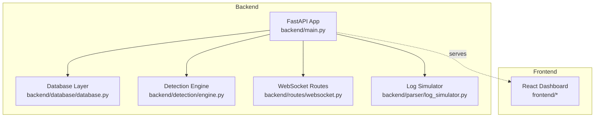
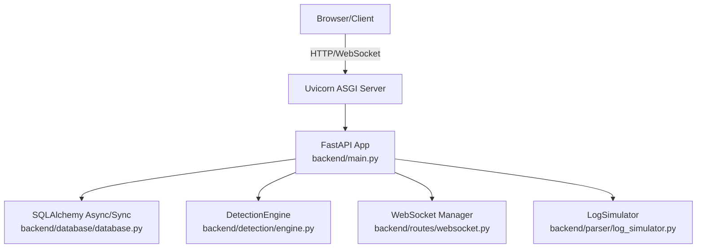
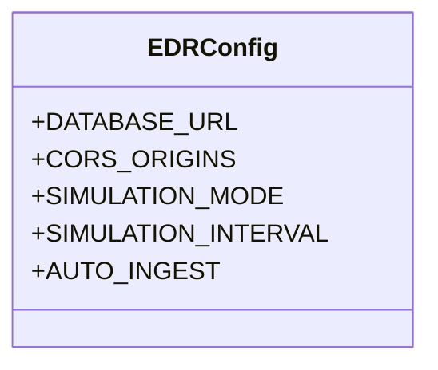
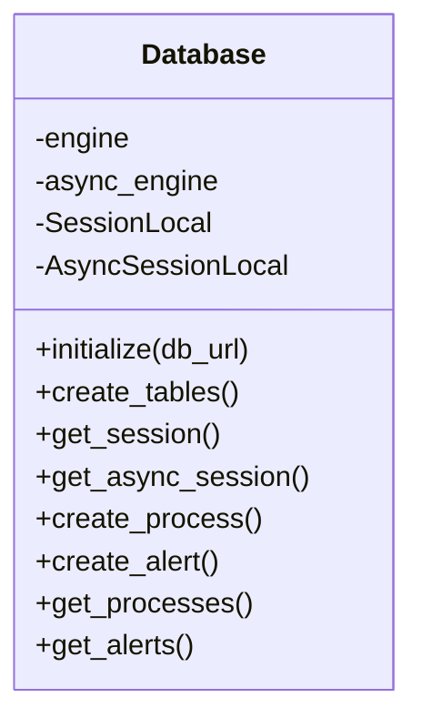
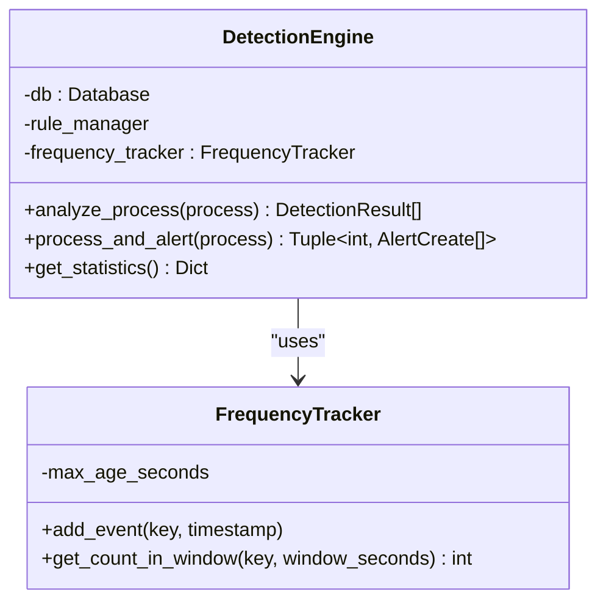
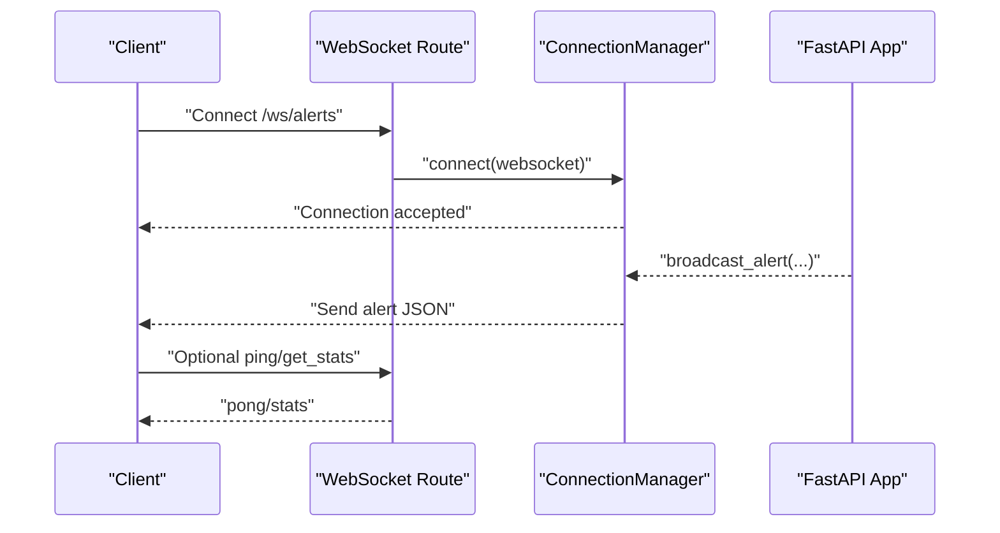
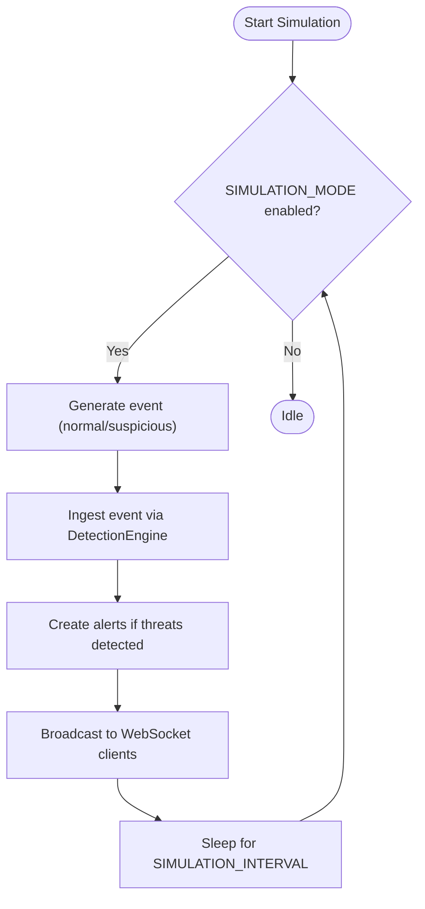

# Configuration and Deployment

<cite>
**Referenced Files in This Document**
- [backend/main.py](file://backend/main.py)
- [backend/database/database.py](file://backend/database/database.py)
- [backend/routes/websocket.py](file://backend/routes/websocket.py)
- [backend/detection/engine.py](file://backend/detection/engine.py)
- [backend/parser/log_simulator.py](file://backend/parser/log_simulator.py)
- [backend/requirements.txt](file://backend/requirements.txt)
- [frontend/package.json](file://frontend/package.json)
</cite>

## Table of Contents
1. [Introduction](#introduction)
2. [Project Structure](#project-structure)
3. [Core Components](#core-components)
4. [Architecture Overview](#architecture-overview)
5. [Detailed Component Analysis](#detailed-component-analysis)
6. [Environment Variables and Configuration](#environment-variables-and-configuration)
7. [Development vs Production Differences](#development-vs-production-differences)
8. [Security Hardening Recommendations](#security-hardening-recommendations)
9. [Performance Tuning Options](#performance-tuning-options)
10. [Deployment Procedures](#deployment-procedures)
11. [Reverse Proxy, SSL/TLS, and Load Balancing](#reverse-proxy-ssl-tls-and-load-balancing)
12. [Containerization and Cloud Integration](#containerization-and-cloud-integration)
13. [Monitoring, Logging, and Health Checks](#monitoring-logging-and-health-checks)
14. [Troubleshooting Guide](#troubleshooting-guide)
15. [Conclusion](#conclusion)

## Introduction
This document provides comprehensive configuration and deployment guidance for EDR Lite, focusing on environment setup, production readiness, and operational excellence. It covers environment variables, development versus production configurations, security hardening, performance tuning, deployment procedures across environments, reverse proxy and SSL/TLS setup, containerization and cloud integration, monitoring and logging, and troubleshooting.

## Project Structure
EDR Lite consists of:
- Backend: FastAPI application with database, detection engine, parsers, and WebSocket streaming
- Frontend: React-based dashboard served statically by the backend
- Sample data: Example Sysmon events for testing

**Diagram sources**
- [backend/main.py:171-192](file://backend/main.py#L171-L192)
- [backend/database/database.py:21-84](file://backend/database/database.py#L21-L84)
- [backend/detection/engine.py:64-82](file://backend/detection/engine.py#L64-L82)
- [backend/routes/websocket.py:14-65](file://backend/routes/websocket.py#L14-L65)
- [backend/parser/log_simulator.py:18-31](file://backend/parser/log_simulator.py#L18-L31)

**Section sources**
- [backend/main.py:171-192](file://backend/main.py#L171-L192)
- [backend/database/database.py:21-84](file://backend/database/database.py#L21-L84)
- [backend/detection/engine.py:64-82](file://backend/detection/engine.py#L64-L82)
- [backend/routes/websocket.py:14-65](file://backend/routes/websocket.py#L14-L65)
- [backend/parser/log_simulator.py:18-31](file://backend/parser/log_simulator.py#L18-L31)

## Core Components
- Application lifecycle and configuration: [backend/main.py:51-177](file://backend/main.py#L51-L177)
- Database initialization and sessions: [backend/database/database.py:21-84](file://backend/database/database.py#L21-L84)
- Detection engine and rule evaluation: [backend/detection/engine.py:64-120](file://backend/detection/engine.py#L64-L120)
- WebSocket streaming and broadcasting: [backend/routes/websocket.py:21-65](file://backend/routes/websocket.py#L21-L65)
- Simulation mode and event generation: [backend/parser/log_simulator.py:18-31](file://backend/parser/log_simulator.py#L18-L31)

**Section sources**
- [backend/main.py:51-177](file://backend/main.py#L51-L177)
- [backend/database/database.py:21-84](file://backend/database/database.py#L21-L84)
- [backend/detection/engine.py:64-120](file://backend/detection/engine.py#L64-L120)
- [backend/routes/websocket.py:21-65](file://backend/routes/websocket.py#L21-L65)
- [backend/parser/log_simulator.py:18-31](file://backend/parser/log_simulator.py#L18-L31)

## Architecture Overview
The backend exposes REST APIs and WebSocket endpoints, initializes the database and detection engine, and optionally simulates Sysmon events. The frontend is served statically by the backend and connects to WebSocket streams for live updates.

**Diagram sources**
- [backend/main.py:171-192](file://backend/main.py#L171-L192)
- [backend/database/database.py:21-84](file://backend/database/database.py#L21-L84)
- [backend/detection/engine.py:64-82](file://backend/detection/engine.py#L64-L82)
- [backend/routes/websocket.py:21-65](file://backend/routes/websocket.py#L21-L65)
- [backend/parser/log_simulator.py:18-31](file://backend/parser/log_simulator.py#L18-L31)

## Detailed Component Analysis

### Configuration and Environment Management
- Centralized configuration class reads environment variables and applies defaults.
- CORS origins are configurable and split into a list for middleware.
- Simulation mode and intervals are controlled via environment variables.
- Auto-ingestion toggles background simulation tasks.

**Diagram sources**
- [backend/main.py:51-58](file://backend/main.py#L51-L58)

**Section sources**
- [backend/main.py:51-58](file://backend/main.py#L51-L58)

### Database Initialization and Sessions
- Initializes both synchronous and asynchronous engines.
- Uses SQLite by default but supports external databases via environment variable.
- Provides sync and async session factories and CRUD helpers.

**Diagram sources**
- [backend/database/database.py:21-84](file://backend/database/database.py#L21-L84)

**Section sources**
- [backend/database/database.py:21-84](file://backend/database/database.py#L21-L84)

### Detection Engine and Rule Evaluation
- Tracks process creation frequency for anomaly detection.
- Evaluates multiple rule types: parent-child, command-line, frequency, behavior, and anomaly placeholders.
- Generates alerts and maintains statistics.

**Diagram sources**
- [backend/detection/engine.py:64-82](file://backend/detection/engine.py#L64-L82)
- [backend/detection/engine.py:23-62](file://backend/detection/engine.py#L23-L62)

**Section sources**
- [backend/detection/engine.py:64-120](file://backend/detection/engine.py#L64-L120)
- [backend/detection/engine.py:23-62](file://backend/detection/engine.py#L23-L62)

### WebSocket Streaming
- Manages active connections and broadcasts alerts and process events.
- Supports heartbeat and client message handling.

**Diagram sources**
- [backend/routes/websocket.py:68-118](file://backend/routes/websocket.py#L68-L118)
- [backend/routes/websocket.py:21-65](file://backend/routes/websocket.py#L21-L65)

**Section sources**
- [backend/routes/websocket.py:68-118](file://backend/routes/websocket.py#L68-L118)
- [backend/routes/websocket.py:21-65](file://backend/routes/websocket.py#L21-L65)

### Log Simulation
- Generates realistic Sysmon Event ID 1 events for testing and demonstration.
- Supports normal and suspicious parent-child combinations, batching, and streaming.

**Diagram sources**
- [backend/parser/log_simulator.py:138-150](file://backend/parser/log_simulator.py#L138-L150)
- [backend/main.py:60-118](file://backend/main.py#L60-L118)
- [backend/routes/websocket.py:209-233](file://backend/routes/websocket.py#L209-L233)

**Section sources**
- [backend/parser/log_simulator.py:138-150](file://backend/parser/log_simulator.py#L138-L150)
- [backend/main.py:60-118](file://backend/main.py#L60-L118)
- [backend/routes/websocket.py:209-233](file://backend/routes/websocket.py#L209-L233)

## Environment Variables and Configuration
Key environment variables and their impact:
- DATABASE_URL: Database connection string; defaults to SQLite for local development.
- CORS_ORIGINS: Comma-separated list of allowed origins for the frontend; defaults to localhost ports.
- SIMULATION_MODE: Enables/disables simulated Sysmon events; affects background task scheduling.
- SIMULATION_INTERVAL: Seconds between simulated events; controls ingestion rate.
- AUTO_INGEST: Controls whether automatic ingestion runs in simulation mode.
- HOST and PORT: Server binding address and port; used by the ASGI server runner.

Behavioral impacts:
- Changing DATABASE_URL allows switching between SQLite and external databases.
- Adjusting CORS_ORIGINS enables cross-origin access from production frontends.
- Toggling SIMULATION_MODE and adjusting SIMULATION_INTERVAL controls test load and CPU usage.
- AUTO_INGEST determines whether background simulation tasks run automatically.

**Section sources**
- [backend/main.py:51-58](file://backend/main.py#L51-L58)
- [backend/main.py:693-705](file://backend/main.py#L693-L705)
- [backend/database/database.py:16-18](file://backend/database/database.py#L16-L18)

## Development vs Production Differences
- Development:
  - Default SQLite database and local filesystem logging.
  - Debug mode may enable hot reload in the ASGI server.
  - CORS_ORIGINS configured for local frontend ports.
- Production:
  - Use external relational databases via DATABASE_URL.
  - Configure CORS_ORIGINS for production domains.
  - Disable or carefully tune SIMULATION_MODE and AUTO_INGEST.
  - Enable structured logging and centralized log aggregation.
  - Deploy behind a reverse proxy with SSL/TLS termination.

[No sources needed since this section provides general guidance]

## Security Hardening Recommendations
- Restrict CORS_ORIGINS to exact production domains and subpaths.
- Enforce HTTPS at the reverse proxy; configure TLS ciphers and protocols appropriately.
- Use secrets management for DATABASE_URL and any credentials.
- Rate-limit API endpoints and WebSocket connections to mitigate abuse.
- Validate and sanitize all incoming data; apply input sanitization and schema validation.
- Rotate application secrets and database credentials regularly.
- Monitor and alert on unusual spikes in alerts or WebSocket connections.

[No sources needed since this section provides general guidance]

## Performance Tuning Options
- Database:
  - Use asynchronous sessions and connection pooling appropriate for the backend workload.
  - Optimize queries and indexes for frequent filters (e.g., severity, timestamp).
- Detection Engine:
  - Tune rule sets to reduce false positives and unnecessary evaluations.
  - Consider batching ingestion for high-volume environments.
- Simulation:
  - Lower SIMULATION_INTERVAL to increase load during testing; raise it in production.
  - Disable AUTO_INGEST in production to avoid unintended event generation.
- WebSocket:
  - Monitor active connections and implement connection limits.
  - Use heartbeat mechanisms to detect stale connections promptly.

**Section sources**
- [backend/database/database.py:56-67](file://backend/database/database.py#L56-L67)
- [backend/detection/engine.py:23-62](file://backend/detection/engine.py#L23-L62)
- [backend/main.py:56-58](file://backend/main.py#L56-L58)

## Deployment Procedures

### Development Setup
- Install Python dependencies from the backend requirements.
- Ensure the logs directory exists for file logging.
- Run the application with default environment variables for local development.
- Access the dashboard at the root path and use WebSocket endpoints for live updates.

**Section sources**
- [backend/requirements.txt:1-14](file://backend/requirements.txt#L1-L14)
- [backend/main.py:22-34](file://backend/main.py#L22-L34)
- [backend/main.py:690-705](file://backend/main.py#L690-L705)

### Staging Setup
- Provision a staging database using DATABASE_URL.
- Configure CORS_ORIGINS for staging frontend domain(s).
- Enable health checks and basic monitoring.
- Validate WebSocket connectivity and alert delivery.

**Section sources**
- [backend/main.py:214-223](file://backend/main.py#L214-L223)
- [backend/routes/websocket.py:68-118](file://backend/routes/websocket.py#L68-L118)

### Production Setup
- Use a managed database service and secure connection strings.
- Configure reverse proxy with SSL/TLS termination and appropriate timeouts.
- Scale horizontally using multiple application instances behind a load balancer.
- Implement health checks, metrics, and centralized logging.

**Section sources**
- [backend/main.py:214-223](file://backend/main.py#L214-L223)
- [backend/database/database.py:16-18](file://backend/database/database.py#L16-L18)

## Reverse Proxy, SSL/TLS, and Load Balancing
- Reverse proxy configuration:
  - Terminate TLS at the proxy; forward HTTP to the application.
  - Configure timeouts for long-running WebSocket connections.
  - Set appropriate headers for client IP and protocol detection.
- SSL/TLS:
  - Use strong ciphers and modern TLS versions.
  - Renew certificates proactively and automate certificate management.
- Load balancing:
  - Use sticky sessions if required by WebSocket semantics.
  - Ensure health checks target the /health endpoint.

**Section sources**
- [backend/main.py:214-223](file://backend/main.py#L214-L223)

## Containerization and Cloud Integration
- Containerization:
  - Build a minimal image with Python runtime and dependencies.
  - Expose the port defined by the PORT environment variable.
  - Mount persistent storage for logs if needed; prefer external logging.
- Orchestration:
  - Use Kubernetes deployments with readiness/liveness probes.
  - Configure environment variables via ConfigMaps/Secrets.
- Cloud platforms:
  - AWS/GCP/Azure: Use managed databases and load balancers.
  - Integrate with platform-specific logging and monitoring services.

[No sources needed since this section provides general guidance]

## Monitoring, Logging, and Health Checks
- Logging:
  - Structured logging is enabled; ensure logs are aggregated and retained per policy.
  - Consider rotating logs and setting retention windows.
- Health checks:
  - Use the /health endpoint for liveness/readiness probes.
  - Include database connectivity and engine status in health responses.
- Metrics:
  - Expose application metrics and integrate with monitoring stacks.
  - Track alert rates, WebSocket connection counts, and ingestion throughput.

**Section sources**
- [backend/main.py:22-34](file://backend/main.py#L22-L34)
- [backend/main.py:214-223](file://backend/main.py#L214-L223)
- [backend/detection/engine.py:292-308](file://backend/detection/engine.py#L292-L308)

## Troubleshooting Guide
Common issues and resolutions:
- Database connectivity failures:
  - Verify DATABASE_URL correctness and network access.
  - Ensure the database is reachable and credentials are valid.
- CORS errors in the browser:
  - Confirm CORS_ORIGINS includes the frontend origin(s).
- WebSocket disconnections:
  - Check reverse proxy timeouts and keepalive settings.
  - Review backend logs for connection errors.
- High CPU usage:
  - Reduce SIMULATION_INTERVAL or disable AUTO_INGEST in production.
  - Optimize rule sets and database queries.
- Health probe failures:
  - Confirm the /health endpoint responds and database is connected.

**Section sources**
- [backend/main.py:214-223](file://backend/main.py#L214-L223)
- [backend/database/database.py:16-18](file://backend/database/database.py#L16-L18)
- [backend/routes/websocket.py:68-118](file://backend/routes/websocket.py#L68-L118)
- [backend/main.py:56-58](file://backend/main.py#L56-L58)

## Conclusion
This guide outlines how to configure, deploy, and operate EDR Lite securely and efficiently across environments. By controlling environment variables, hardening security, tuning performance, and implementing robust monitoring and deployment practices, teams can achieve reliable, scalable operations for endpoint detection and response.