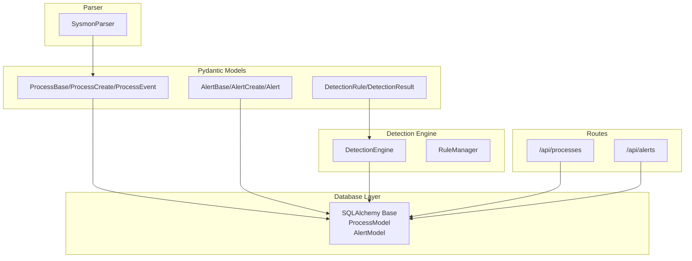
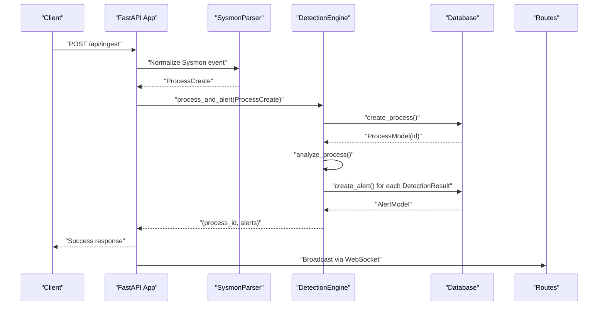
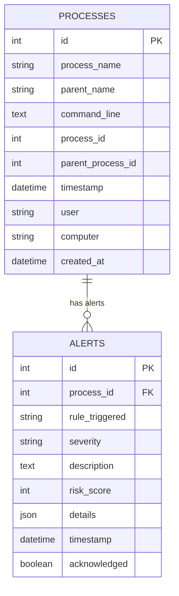
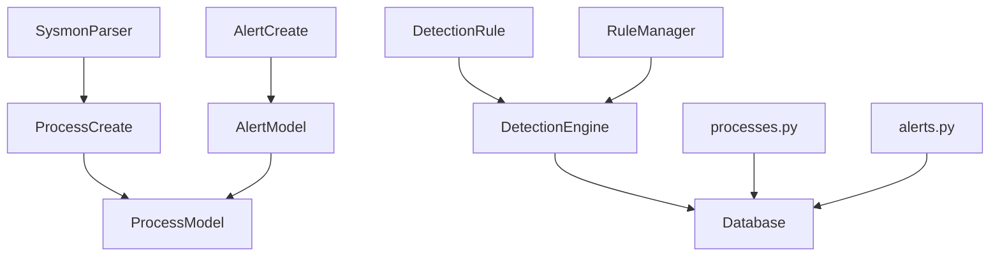
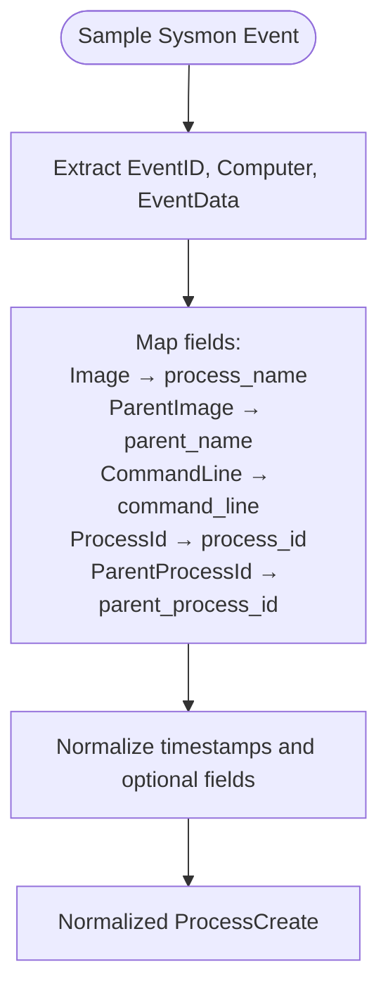

# Data Models and Schema

<cite>
**Referenced Files in This Document**
- [database.py](file://backend/database/database.py)
- [models.py](file://backend/database/models.py)
- [process.py](file://backend/models/process.py)
- [alert.py](file://backend/models/alert.py)
- [detection.py](file://backend/models/detection.py)
- [engine.py](file://backend/detection/engine.py)
- [rules.py](file://backend/detection/rules.py)
- [sysmon_parser.py](file://backend/parser/sysmon_parser.py)
- [processes.py](file://backend/routes/processes.py)
- [alerts.py](file://backend/routes/alerts.py)
- [main.py](file://backend/main.py)
- [sample_sysmon_events.json](file://sample_data/sample_sysmon_events.json)
</cite>

## Table of Contents
1. [Introduction](#introduction)
2. [Project Structure](#project-structure)
3. [Core Components](#core-components)
4. [Architecture Overview](#architecture-overview)
5. [Detailed Component Analysis](#detailed-component-analysis)
6. [Dependency Analysis](#dependency-analysis)
7. [Performance Considerations](#performance-considerations)
8. [Troubleshooting Guide](#troubleshooting-guide)
9. [Conclusion](#conclusion)
10. [Appendices](#appendices)

## Introduction
This document provides comprehensive data model documentation for EDR Lite’s database schema and entity relationships. It focuses on two primary entities:
- Process: stores Windows Sysmon Event ID 1 (Process Creation) events, including process names, parent-child relationships, command lines, timestamps, and metadata.
- Alert: captures threat detection results, including severity levels, risk scores, acknowledgment status, and correlation with process events.

It explains field definitions, data types, constraints, indexing strategy, entity relationships, data validation rules, business logic constraints, data lifecycle management, access patterns, caching strategies, performance considerations, and security/privacy controls.

## Project Structure
The data model spans several modules:
- Database layer: SQLAlchemy declarative base and ORM models for Process and Alert.
- Pydantic models: request/response and internal models for processes and alerts.
- Detection engine: evaluates process events against rules and generates alerts.
- Routes: expose REST APIs for processes and alerts.
- Parser: converts Sysmon events into normalized process records.

**Diagram sources**
- [models.py:9-77](file://backend/database/models.py#L9-L77)
- [process.py:6-44](file://backend/models/process.py#L6-L44)
- [alert.py:15-55](file://backend/models/alert.py#L15-L55)
- [detection.py:17-92](file://backend/models/detection.py#L17-L92)
- [engine.py:64-324](file://backend/detection/engine.py#L64-L324)
- [rules.py:273-480](file://backend/detection/rules.py#L273-L480)
- [processes.py:19-253](file://backend/routes/processes.py#L19-L253)
- [alerts.py:18-180](file://backend/routes/alerts.py#L18-L180)
- [sysmon_parser.py:23-385](file://backend/parser/sysmon_parser.py#L23-L385)

**Section sources**
- [models.py:1-77](file://backend/database/models.py#L1-L77)
- [process.py:1-44](file://backend/models/process.py#L1-L44)
- [alert.py:1-55](file://backend/models/alert.py#L1-L55)
- [detection.py:1-92](file://backend/models/detection.py#L1-L92)
- [engine.py:1-324](file://backend/detection/engine.py#L1-L324)
- [rules.py:1-480](file://backend/detection/rules.py#L1-L480)
- [processes.py:1-253](file://backend/routes/processes.py#L1-L253)
- [alerts.py:1-180](file://backend/routes/alerts.py#L1-L180)
- [sysmon_parser.py:1-385](file://backend/parser/sysmon_parser.py#L1-L385)

## Core Components
- ProcessModel: relational representation of process events with indexed fields for efficient querying.
- AlertModel: relational representation of alerts linked to ProcessModel via foreign key.
- Process* Pydantic models: request/response and internal representations for process events.
- Alert* Pydantic models: request/response and internal representations for alerts.
- DetectionRule/DetectionResult: rule definitions and detection outcomes used by the detection engine.

Key characteristics:
- Primary keys: id (auto-increment Integer) for both ProcessModel and AlertModel.
- Foreign key: AlertModel.process_id references ProcessModel.id.
- Indexes: primary keys and selected fields are indexed for performance.
- Timestamps: created_at and timestamp fields capture temporal data.
- JSON: AlertModel.details stores structured rule-specific details.

**Section sources**
- [models.py:9-77](file://backend/database/models.py#L9-L77)
- [process.py:6-44](file://backend/models/process.py#L6-L44)
- [alert.py:15-55](file://backend/models/alert.py#L15-L55)
- [detection.py:17-92](file://backend/models/detection.py#L17-L92)

## Architecture Overview
The system ingests Windows Sysmon events, normalizes them into Process records, runs detection rules, and persists both Process and Alert records. Routes expose read/write operations and real-time updates via WebSocket.

**Diagram sources**
- [main.py:243-337](file://backend/main.py#L243-L337)
- [sysmon_parser.py:23-385](file://backend/parser/sysmon_parser.py#L23-L385)
- [engine.py:272-291](file://backend/detection/engine.py#L272-L291)
- [database.py:86-215](file://backend/database/database.py#L86-L215)
- [processes.py:19-42](file://backend/routes/processes.py#L19-L42)
- [alerts.py:18-54](file://backend/routes/alerts.py#L18-L54)

## Detailed Component Analysis

### Process Model
Purpose: Store Windows Sysmon Event ID 1 (Process Creation) events with parent-child relationships and metadata.

Fields and types:
- id: Integer, primary key, indexed.
- process_name: String(255), not null, indexed.
- parent_name: String(255), not null, indexed.
- command_line: Text, not null.
- process_id: Integer, not null.
- parent_process_id: Integer, not null.
- timestamp: DateTime, not null, indexed.
- user: String(255), nullable.
- computer: String(255), nullable.
- created_at: DateTime, default now.

Constraints and indexes:
- Primary key on id.
- Indexes on process_name, parent_name, timestamp for efficient filtering and sorting.
- No explicit foreign key constraint enforced at the database level for parent_process_id; referential integrity relies on application logic.

Validation rules:
- process_name, parent_name, command_line, process_id, parent_process_id, timestamp are required.
- user and computer are optional.

Lifecycle:
- Created when a Sysmon event is processed.
- Supports pagination, search, and time-window queries.

**Section sources**
- [models.py:9-36](file://backend/database/models.py#L9-L36)
- [process.py:6-32](file://backend/models/process.py#L6-L32)
- [processes.py:19-112](file://backend/routes/processes.py#L19-L112)
- [database.py:122-183](file://backend/database/database.py#L122-L183)

### Alert Model
Purpose: Capture threat detection results linked to a Process.

Fields and types:
- id: Integer, primary key, indexed.
- process_id: Integer, not null, indexed (foreign key to ProcessModel.id).
- rule_triggered: String(255), not null, indexed.
- severity: String(50), not null, indexed.
- description: Text, not null.
- risk_score: Integer, default 0.
- details: JSON, nullable.
- timestamp: DateTime, default now, indexed.
- acknowledged: Boolean, default false.

Constraints and indexes:
- Primary key on id.
- Indexes on process_id, rule_triggered, severity, timestamp for filtering and sorting.
- No explicit foreign key constraint enforced at the database level for process_id; referential integrity relies on application logic.

Validation rules:
- process_id, rule_triggered, severity, description are required.
- severity constrained to predefined levels via Pydantic enum.
- risk_score constrained to 0–100.

Lifecycle:
- Created when detection rules match a Process.
- Supports filtering by severity and acknowledgment status.
- Acknowledgment toggles acknowledged flag.

**Section sources**
- [models.py:39-64](file://backend/database/models.py#L39-L64)
- [alert.py:7-37](file://backend/models/alert.py#L7-L37)
- [alerts.py:18-138](file://backend/routes/alerts.py#L18-L138)
- [database.py:184-295](file://backend/database/database.py#L184-L295)

### Entity Relationships
- One-to-many: ProcessModel.id → AlertModel.process_id.
- No explicit foreign key constraints are defined in the models; referential integrity is maintained by application logic and route handlers.

**Diagram sources**
- [models.py:9-77](file://backend/database/models.py#L9-L77)

**Section sources**
- [models.py:9-77](file://backend/database/models.py#L9-L77)
- [processes.py:134-174](file://backend/routes/processes.py#L134-L174)
- [alerts.py:95-101](file://backend/routes/alerts.py#L95-L101)

### Data Validation Rules and Business Logic Constraints
- ProcessCreate: Enforces presence of process_name, parent_name, command_line, process_id, parent_process_id, timestamp; optional user and computer.
- AlertCreate: Enforces presence of process_id, rule_triggered, severity, description; risk_score constrained to 0–100; details optional.
- SeverityLevel enum restricts severity to low, medium, high, critical.
- DetectionRule: Validates rule_type, severity, and risk_score; compiles regex patterns lazily; supports parent/child/command-line/frequency/behavior/anomaly detection strategies.
- DetectionResult: Confirms is_threat, rule, confidence, risk_score, and details; timestamp included.

**Section sources**
- [process.py:15-28](file://backend/models/process.py#L15-L28)
- [alert.py:24-37](file://backend/models/alert.py#L24-L37)
- [detection.py:17-92](file://backend/models/detection.py#L17-L92)

### Data Lifecycle Management
- Ingestion: SysmonParser normalizes events; main ingestion endpoint converts to ProcessCreate and triggers detection.
- Storage: Database.create_process and Database.create_alert persist records.
- Queries: Paginated retrieval, search, and time-window filtering for processes; filtering by severity and acknowledgment for alerts.
- Statistics: Aggregates by severity and hourly distribution for alerts.
- Cleanup: Database.delete_old_data removes old Process and Alert records older than a configured threshold.

**Section sources**
- [sysmon_parser.py:23-385](file://backend/parser/sysmon_parser.py#L23-L385)
- [main.py:243-337](file://backend/main.py#L243-L337)
- [database.py:86-308](file://backend/database/database.py#L86-L308)

### Data Access Patterns and Caching Strategies
- Access patterns:
  - Processes: list with pagination and optional search; recent window queries; by parent; tree traversal; deletion.
  - Alerts: list with pagination and filters; recent window queries; acknowledgment toggles; deletion; statistics.
- Caching: No explicit caching layer is implemented in the codebase. Performance relies on database indexes and efficient queries.

**Section sources**
- [processes.py:19-253](file://backend/routes/processes.py#L19-L253)
- [alerts.py:18-180](file://backend/routes/alerts.py#L18-L180)
- [database.py:122-295](file://backend/database/database.py#L122-L295)

### Performance Considerations
- Indexes: Primary keys and selected fields (process_name, parent_name, timestamp, process_id, rule_triggered, severity) are indexed to optimize filtering and sorting.
- Query patterns: Sorting by timestamp descending and filtering by severity/acknowledgment are supported efficiently by indexes.
- Frequency tracking: DetectionEngine maintains a FrequencyTracker to compute counts within time windows for anomaly detection.
- Asynchronous sessions: Async engines and sessions are used for FastAPI endpoints to improve concurrency.

**Section sources**
- [models.py:13-50](file://backend/database/models.py#L13-L50)
- [database.py:80-84](file://backend/database/database.py#L80-L84)
- [engine.py:23-62](file://backend/detection/engine.py#L23-L62)

### Security, Privacy, and Access Control
- Authentication/Authorization: No explicit authentication or authorization middleware is present in the codebase.
- CORS: Configured for allowed origins; ensure production deployments restrict origins appropriately.
- Data retention: delete_old_data automatically purges old records to manage storage and potentially reduce exposure.
- Logging: Application logs are written to files; sensitive data should be redacted in logs.

**Section sources**
- [main.py:179-187](file://backend/main.py#L179-L187)
- [database.py:296-308](file://backend/database/database.py#L296-L308)

## Dependency Analysis
The following diagram shows key dependencies among components involved in data modeling and processing.

**Diagram sources**
- [models.py:9-77](file://backend/database/models.py#L9-L77)
- [process.py:15-28](file://backend/models/process.py#L15-L28)
- [alert.py:24-37](file://backend/models/alert.py#L24-L37)
- [detection.py:17-92](file://backend/models/detection.py#L17-L92)
- [engine.py:64-324](file://backend/detection/engine.py#L64-L324)
- [rules.py:273-480](file://backend/detection/rules.py#L273-L480)
- [sysmon_parser.py:23-385](file://backend/parser/sysmon_parser.py#L23-L385)
- [processes.py:19-253](file://backend/routes/processes.py#L19-L253)
- [alerts.py:18-180](file://backend/routes/alerts.py#L18-L180)
- [database.py:86-215](file://backend/database/database.py#L86-L215)

**Section sources**
- [models.py:1-77](file://backend/database/models.py#L1-L77)
- [process.py:1-44](file://backend/models/process.py#L1-L44)
- [alert.py:1-55](file://backend/models/alert.py#L1-L55)
- [detection.py:1-92](file://backend/models/detection.py#L1-L92)
- [engine.py:1-324](file://backend/detection/engine.py#L1-L324)
- [rules.py:1-480](file://backend/detection/rules.py#L1-L480)
- [sysmon_parser.py:1-385](file://backend/parser/sysmon_parser.py#L1-L385)
- [processes.py:1-253](file://backend/routes/processes.py#L1-L253)
- [alerts.py:1-180](file://backend/routes/alerts.py#L1-L180)
- [database.py:1-324](file://backend/database/database.py#L1-L324)

## Performance Considerations
- Indexing strategy:
  - ProcessModel: id (PK), process_name, parent_name, timestamp.
  - AlertModel: id (PK), process_id, rule_triggered, severity, timestamp.
- Query optimization:
  - Sorting by timestamp descending is common; indexes support this.
  - Filtering by severity and acknowledgment is supported by indexes.
- Asynchronous operations:
  - Async engines and sessions improve throughput under concurrent loads.
- Frequency analysis:
  - FrequencyTracker maintains sliding windows to detect anomalies without scanning entire datasets.

[No sources needed since this section provides general guidance]

## Troubleshooting Guide
Common issues and resolutions:
- Missing or invalid Sysmon events:
  - Verify SysmonParser can parse the input format (EVTX/XML/JSON/line-delimited JSON).
  - Check timestamp parsing and field mappings.
- Database connectivity:
  - Ensure DATABASE_URL is set and database is initialized.
  - Confirm tables are created via create_all.
- Query performance:
  - Use appropriate limits and offsets; leverage indexes on timestamp and filtering fields.
- Data retention:
  - Adjust cleanup interval to balance storage and historical analysis needs.

**Section sources**
- [sysmon_parser.py:96-194](file://backend/parser/sysmon_parser.py#L96-L194)
- [database.py:42-74](file://backend/database/database.py#L42-L74)
- [processes.py:19-112](file://backend/routes/processes.py#L19-L112)
- [alerts.py:18-86](file://backend/routes/alerts.py#L18-L86)
- [database.py:296-308](file://backend/database/database.py#L296-L308)

## Conclusion
EDR Lite’s data model centers on two core entities—Process and Alert—designed for efficient ingestion, detection, and retrieval of Windows Sysmon process events. The schema emphasizes indexed fields for performance, flexible filtering, and clear relationships between processes and alerts. While no explicit foreign key constraints are defined at the database level, application logic and route handlers enforce referential integrity. The system supports real-time ingestion, rule-based detection, and operational statistics, with straightforward lifecycle management through data retention policies.

[No sources needed since this section summarizes without analyzing specific files]

## Appendices

### Sample Data Example
Sample Sysmon Event ID 1 entries demonstrate the structure expected by the parser and ingestion pipeline.

**Diagram sources**
- [sample_sysmon_events.json:1-194](file://sample_data/sample_sysmon_events.json#L1-L194)
- [sysmon_parser.py:257-294](file://backend/parser/sysmon_parser.py#L257-L294)

**Section sources**
- [sample_sysmon_events.json:1-194](file://sample_data/sample_sysmon_events.json#L1-L194)
- [sysmon_parser.py:257-294](file://backend/parser/sysmon_parser.py#L257-L294)