# Alert Generation and Management

<cite>
**Referenced Files in This Document**
- [backend/models/alert.py](file://backend/models/alert.py)
- [backend/models/detection.py](file://backend/models/detection.py)
- [backend/models/process.py](file://backend/models/process.py)
- [backend/detection/engine.py](file://backend/detection/engine.py)
- [backend/detection/rules.py](file://backend/detection/rules.py)
- [backend/database/database.py](file://backend/database/database.py)
- [backend/database/models.py](file://backend/database/models.py)
- [backend/routes/alerts.py](file://backend/routes/alerts.py)
- [backend/routes/detection.py](file://backend/routes/detection.py)
- [backend/routes/websocket.py](file://backend/routes/websocket.py)
- [backend/main.py](file://backend/main.py)
- [frontend/src/types/index.ts](file://frontend/src/types/index.ts)
- [frontend/src/components/AlertCard.tsx](file://frontend/src/components/AlertCard.tsx)
- [frontend/src/hooks/useWebSocket.ts](file://frontend/src/hooks/useWebSocket.ts)
</cite>

## Table of Contents
1. [Introduction](#introduction)
2. [Project Structure](#project-structure)
3. [Core Components](#core-components)
4. [Architecture Overview](#architecture-overview)
5. [Detailed Component Analysis](#detailed-component-analysis)
6. [Dependency Analysis](#dependency-analysis)
7. [Performance Considerations](#performance-considerations)
8. [Troubleshooting Guide](#troubleshooting-guide)
9. [Conclusion](#conclusion)
10. [Appendices](#appendices)

## Introduction
This document explains EDR Lite’s alert generation and management system. It covers how detection outcomes are transformed into alerts, the end-to-end pipeline from process analysis to alert persistence, alert metadata and severity classification, alert details and detection type classifications, rule-triggered alert mapping, acknowledgment workflows, real-time streaming via WebSocket, filtering and historical tracking, and integration points for external security systems.

## Project Structure
The alert system spans backend models, detection engine, database persistence, REST APIs, and WebSocket streaming, with the frontend consuming alerts and rendering them.

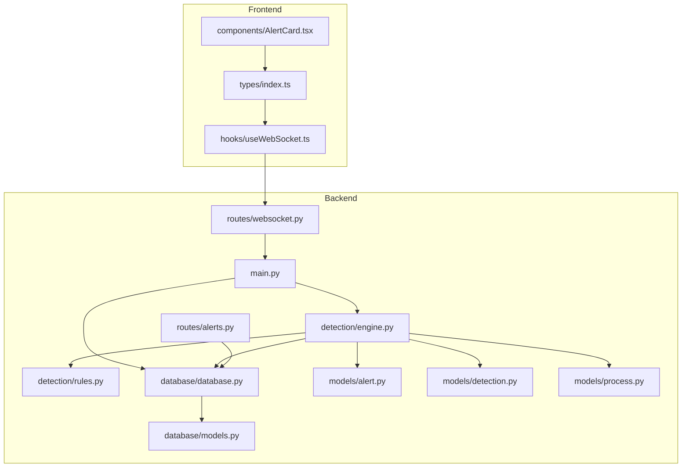

**Diagram sources**
- [backend/main.py:120-170](file://backend/main.py#L120-L170)
- [backend/routes/alerts.py:18-54](file://backend/routes/alerts.py#L18-L54)
- [backend/routes/websocket.py:68-118](file://backend/routes/websocket.py#L68-L118)
- [backend/detection/engine.py:64-83](file://backend/detection/engine.py#L64-L83)
- [backend/detection/rules.py:273-313](file://backend/detection/rules.py#L273-L313)
- [backend/database/database.py:21-84](file://backend/database/database.py#L21-L84)
- [backend/database/models.py:9-77](file://backend/database/models.py#L9-L77)
- [backend/models/alert.py:15-55](file://backend/models/alert.py#L15-L55)
- [backend/models/detection.py:85-92](file://backend/models/detection.py#L85-L92)
- [backend/models/process.py:6-44](file://backend/models/process.py#L6-L44)
- [frontend/src/types/index.ts:1-83](file://frontend/src/types/index.ts#L1-L83)
- [frontend/src/hooks/useWebSocket.ts:1-103](file://frontend/src/hooks/useWebSocket.ts#L1-L103)
- [frontend/src/components/AlertCard.tsx:1-69](file://frontend/src/components/AlertCard.tsx#L1-L69)

**Section sources**
- [backend/main.py:120-170](file://backend/main.py#L120-L170)
- [backend/routes/alerts.py:18-54](file://backend/routes/alerts.py#L18-L54)
- [backend/routes/websocket.py:68-118](file://backend/routes/websocket.py#L68-L118)
- [backend/detection/engine.py:64-83](file://backend/detection/engine.py#L64-L83)
- [backend/detection/rules.py:273-313](file://backend/detection/rules.py#L273-L313)
- [backend/database/database.py:21-84](file://backend/database/database.py#L21-L84)
- [backend/database/models.py:9-77](file://backend/database/models.py#L9-L77)
- [backend/models/alert.py:15-55](file://backend/models/alert.py#L15-L55)
- [backend/models/detection.py:85-92](file://backend/models/detection.py#L85-L92)
- [backend/models/process.py:6-44](file://backend/models/process.py#L6-L44)
- [frontend/src/types/index.ts:1-83](file://frontend/src/types/index.ts#L1-L83)
- [frontend/src/hooks/useWebSocket.ts:1-103](file://frontend/src/hooks/useWebSocket.ts#L1-L103)
- [frontend/src/components/AlertCard.tsx:1-69](file://frontend/src/components/AlertCard.tsx#L1-L69)

## Core Components
- DetectionResult: encapsulates whether a threat was detected, the triggering rule, confidence, risk score, and detection details.
- AlertCreate: the DTO used to persist alerts with process linkage, rule name, severity, description, risk score, and optional details.
- Alert: the persisted alert model with database ID, timestamp, acknowledgment flag, and details.
- DetectionEngine: orchestrates process analysis, rule evaluation, and alert creation; persists alerts to the database.
- Database: provides CRUD operations for alerts and processes, supports filtering and statistics.
- WebSocket routes: broadcast live alerts and process events to connected clients.
- Frontend types and components: define alert structures and render alerts with acknowledgment controls.

**Section sources**
- [backend/models/detection.py:85-92](file://backend/models/detection.py#L85-L92)
- [backend/models/alert.py:15-55](file://backend/models/alert.py#L15-L55)
- [backend/detection/engine.py:252-290](file://backend/detection/engine.py#L252-L290)
- [backend/database/database.py:185-215](file://backend/database/database.py#L185-L215)
- [backend/routes/websocket.py:209-216](file://backend/routes/websocket.py#L209-L216)
- [frontend/src/types/index.ts:1-17](file://frontend/src/types/index.ts#L1-L17)

## Architecture Overview
The alert lifecycle begins when a process event is ingested. The DetectionEngine saves the process, evaluates enabled rules, converts matching DetectionResult entries into AlertCreate objects, persists alerts, and broadcasts them via WebSocket to the frontend.

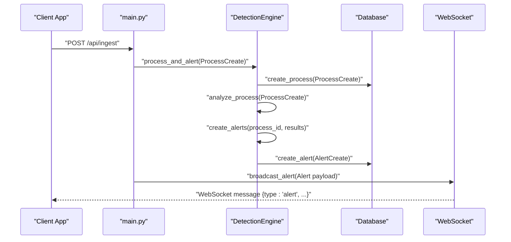

**Diagram sources**
- [backend/main.py:243-311](file://backend/main.py#L243-L311)
- [backend/detection/engine.py:272-290](file://backend/detection/engine.py#L272-L290)
- [backend/database/database.py:185-215](file://backend/database/database.py#L185-L215)
- [backend/routes/websocket.py:209-216](file://backend/routes/websocket.py#L209-L216)

## Detailed Component Analysis

### DetectionResult and AlertCreate
- DetectionResult fields include is_threat, rule, confidence, risk_score, details, and timestamp. These represent the outcome of rule evaluation per process.
- AlertCreate extends AlertBase with optional details and is used to persist alerts. It carries the process_id, rule_triggered, severity, description, and risk_score derived from the DetectionResult.

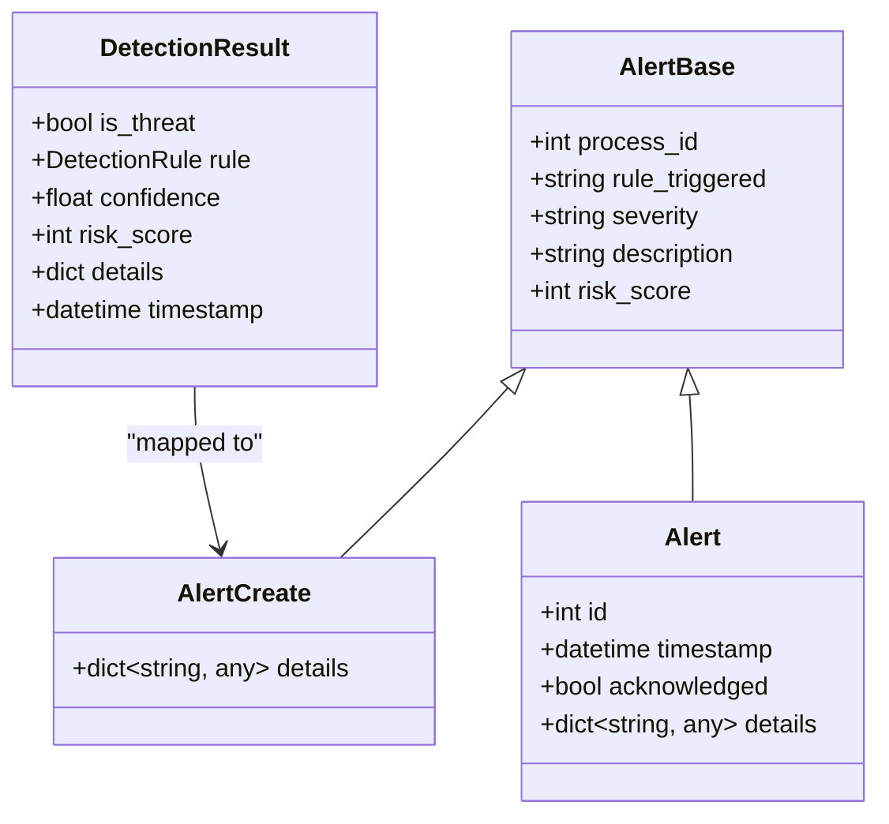

**Diagram sources**
- [backend/models/detection.py:85-92](file://backend/models/detection.py#L85-L92)
- [backend/models/alert.py:15-38](file://backend/models/alert.py#L15-L38)

**Section sources**
- [backend/models/detection.py:85-92](file://backend/models/detection.py#L85-L92)
- [backend/models/alert.py:15-38](file://backend/models/alert.py#L15-L38)

### Alert Creation Pipeline
- Process ingestion produces a ProcessCreate object.
- DetectionEngine.save_process creates a ProcessModel and returns its id.
- DetectionEngine.analyze_process iterates enabled rules and builds DetectionResult entries.
- DetectionEngine.create_alerts transforms DetectionResult entries into AlertCreate objects.
- DetectionEngine persists alerts via Database.create_alert and returns them to the caller.

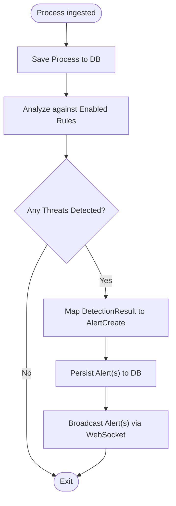

**Diagram sources**
- [backend/detection/engine.py:272-290](file://backend/detection/engine.py#L272-L290)
- [backend/database/database.py:185-215](file://backend/database/database.py#L185-L215)
- [backend/routes/websocket.py:209-216](file://backend/routes/websocket.py#L209-L216)

**Section sources**
- [backend/detection/engine.py:272-290](file://backend/detection/engine.py#L272-L290)
- [backend/database/database.py:185-215](file://backend/database/database.py#L185-L215)

### Alert Severity Classification
- Severity is taken directly from the triggering DetectionRule.severity and is one of low, medium, high, critical.
- Risk score originates from DetectionResult.risk_score, which may be derived from the base rule risk_score and adjusted by detection-specific logic (e.g., frequency anomalies).

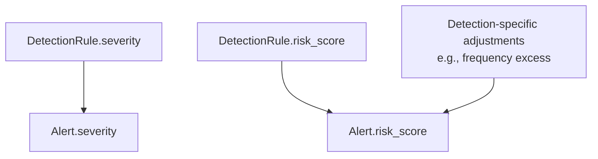

**Diagram sources**
- [backend/models/detection.py:17-44](file://backend/models/detection.py#L17-L44)
- [backend/detection/engine.py:252-270](file://backend/detection/engine.py#L252-L270)

**Section sources**
- [backend/models/detection.py:17-44](file://backend/models/detection.py#L17-L44)
- [backend/detection/engine.py:252-270](file://backend/detection/engine.py#L252-L270)

### Alert Details and Detection Type Classifications
- Detection types surfaced in details include:
  - parent_child_mismatch: indicates suspicious parent-child process spawning.
  - suspicious_command_line: indicates command-line patterns or contains checks matched.
  - frequency_anomaly: indicates excessive process creation from a parent within a time window.
  - suspicious_behavior: indicates behavior-based detections (e.g., suspicious extensions or temp directory execution).
- Additional fields in details include process identifiers, command lines, and contextual metrics (e.g., event counts, thresholds).

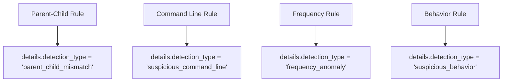

**Diagram sources**
- [backend/detection/engine.py:142-166](file://backend/detection/engine.py#L142-L166)
- [backend/detection/engine.py:168-190](file://backend/detection/engine.py#L168-L190)
- [backend/detection/engine.py:192-225](file://backend/detection/engine.py#L192-L225)
- [backend/detection/engine.py:227-244](file://backend/detection/engine.py#L227-L244)

**Section sources**
- [backend/detection/engine.py:142-166](file://backend/detection/engine.py#L142-L166)
- [backend/detection/engine.py:168-190](file://backend/detection/engine.py#L168-L190)
- [backend/detection/engine.py:192-225](file://backend/detection/engine.py#L192-L225)
- [backend/detection/engine.py:227-244](file://backend/detection/engine.py#L227-L244)

### Relationship Between Detection Rules and Alert Generation
- Enabled DetectionRule entries are evaluated against each ProcessCreate.
- Matching rules produce DetectionResult entries that are mapped to AlertCreate objects.
- The mapping preserves rule metadata (name, description, severity) and risk score.

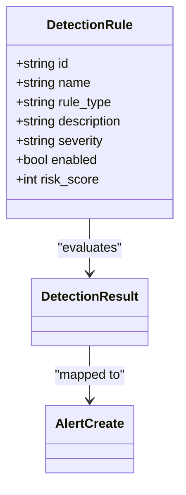

**Diagram sources**
- [backend/models/detection.py:17-83](file://backend/models/detection.py#L17-L83)
- [backend/detection/engine.py:252-270](file://backend/detection/engine.py#L252-L270)

**Section sources**
- [backend/models/detection.py:17-83](file://backend/models/detection.py#L17-L83)
- [backend/detection/engine.py:252-270](file://backend/detection/engine.py#L252-L270)

### Alert Acknowledgment Workflows
- REST endpoints support acknowledging and unacknowledging individual alerts and bulk acknowledgment.
- The database model includes an acknowledged flag; endpoints update it and commit changes.

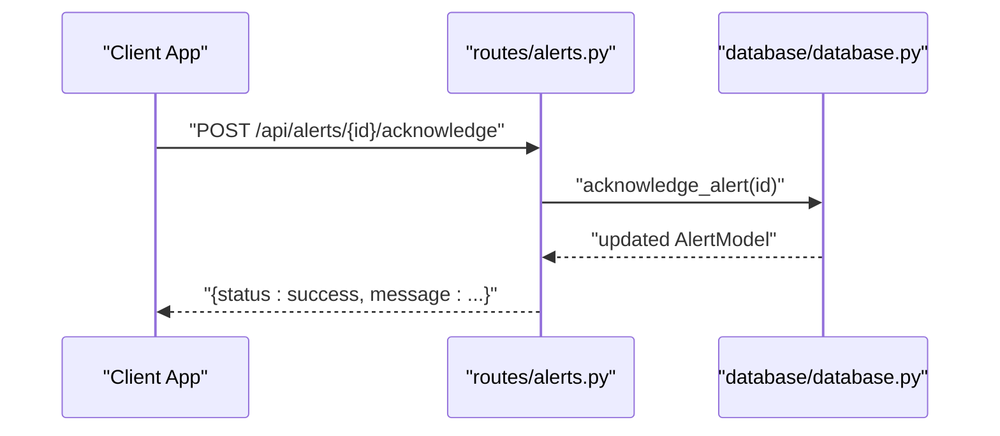

**Diagram sources**
- [backend/routes/alerts.py:104-138](file://backend/routes/alerts.py#L104-L138)
- [backend/database/database.py:286-294](file://backend/database/database.py#L286-L294)

**Section sources**
- [backend/routes/alerts.py:104-138](file://backend/routes/alerts.py#L104-L138)
- [backend/database/database.py:286-294](file://backend/database/database.py#L286-L294)

### Real-Time Streaming via WebSocket
- The backend maintains active WebSocket connections and broadcasts alert payloads to all clients.
- The frontend connects to /ws/alerts, receives alert messages, and renders them.

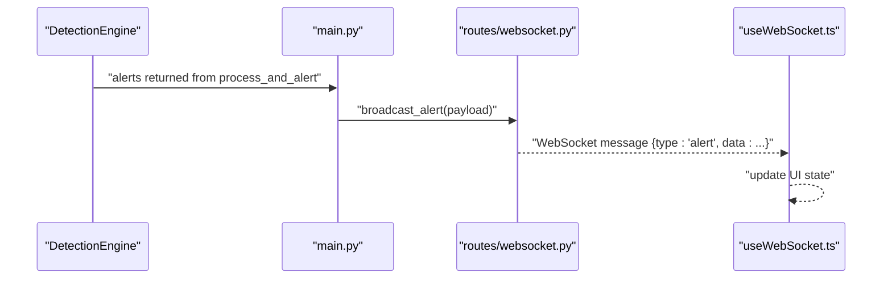

**Diagram sources**
- [backend/main.py:278-300](file://backend/main.py#L278-L300)
- [backend/routes/websocket.py:209-216](file://backend/routes/websocket.py#L209-L216)
- [frontend/src/hooks/useWebSocket.ts:13-72](file://frontend/src/hooks/useWebSocket.ts#L13-L72)

**Section sources**
- [backend/main.py:278-300](file://backend/main.py#L278-L300)
- [backend/routes/websocket.py:209-216](file://backend/routes/websocket.py#L209-L216)
- [frontend/src/hooks/useWebSocket.ts:13-72](file://frontend/src/hooks/useWebSocket.ts#L13-L72)

### Examples of Alert Generation Scenarios
- Parent-Child Mismatch: A suspicious parent spawns a shell or scripting process; details include parent and child process names and detection_type parent_child_mismatch.
- Suspicious Command Line: PowerShell with encoded commands or download patterns triggers detection_type suspicious_command_line.
- Frequency Anomaly: Rapid process spawning from a single parent exceeds configured threshold; details include event_count and threshold.
- Suspicious Behavior: Executables from temp directories or suspicious extensions trigger detection_type suspicious_behavior.

These scenarios are produced by DetectionEngine rule evaluators and mapped into AlertCreate objects with severity and risk_score derived from the rule.

**Section sources**
- [backend/detection/engine.py:142-166](file://backend/detection/engine.py#L142-L166)
- [backend/detection/engine.py:168-190](file://backend/detection/engine.py#L168-L190)
- [backend/detection/engine.py:192-225](file://backend/detection/engine.py#L192-L225)
- [backend/detection/engine.py:227-244](file://backend/detection/engine.py#L227-L244)

### Alert Filtering, Historical Tracking, and External Integrations
- Filtering: REST endpoints support filtering alerts by severity and acknowledgment status.
- Historical tracking: Recent alerts endpoints and statistics endpoints provide time-bound and aggregated views.
- External integrations: The system exposes REST APIs for alert retrieval and rule management, enabling integration with SIEMs or ticketing systems.

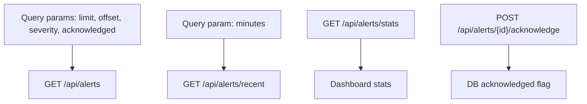

**Diagram sources**
- [backend/routes/alerts.py:18-54](file://backend/routes/alerts.py#L18-L54)
- [backend/routes/alerts.py:66-86](file://backend/routes/alerts.py#L66-L86)
- [backend/routes/alerts.py:57-63](file://backend/routes/alerts.py#L57-L63)
- [backend/database/database.py:217-245](file://backend/database/database.py#L217-L245)

**Section sources**
- [backend/routes/alerts.py:18-54](file://backend/routes/alerts.py#L18-L54)
- [backend/routes/alerts.py:66-86](file://backend/routes/alerts.py#L66-L86)
- [backend/routes/alerts.py:57-63](file://backend/routes/alerts.py#L57-L63)
- [backend/database/database.py:217-245](file://backend/database/database.py#L217-L245)

## Dependency Analysis
The alert system exhibits clear separation of concerns:
- DetectionEngine depends on RuleManager and Database.
- REST routes depend on Database for persistence and on WebSocket routes for streaming.
- Frontend types mirror backend models and consume WebSocket streams.

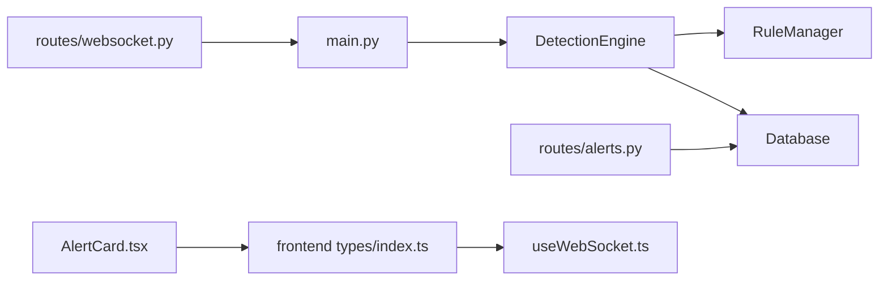

**Diagram sources**
- [backend/detection/engine.py:64-83](file://backend/detection/engine.py#L64-L83)
- [backend/detection/rules.py:273-313](file://backend/detection/rules.py#L273-L313)
- [backend/database/database.py:21-84](file://backend/database/database.py#L21-L84)
- [backend/routes/alerts.py:18-54](file://backend/routes/alerts.py#L18-L54)
- [backend/routes/websocket.py:68-118](file://backend/routes/websocket.py#L68-L118)
- [backend/main.py:120-170](file://backend/main.py#L120-L170)
- [frontend/src/types/index.ts:1-83](file://frontend/src/types/index.ts#L1-L83)
- [frontend/src/hooks/useWebSocket.ts:1-103](file://frontend/src/hooks/useWebSocket.ts#L1-L103)
- [frontend/src/components/AlertCard.tsx:1-69](file://frontend/src/components/AlertCard.tsx#L1-L69)

**Section sources**
- [backend/detection/engine.py:64-83](file://backend/detection/engine.py#L64-L83)
- [backend/detection/rules.py:273-313](file://backend/detection/rules.py#L273-L313)
- [backend/database/database.py:21-84](file://backend/database/database.py#L21-L84)
- [backend/routes/alerts.py:18-54](file://backend/routes/alerts.py#L18-L54)
- [backend/routes/websocket.py:68-118](file://backend/routes/websocket.py#L68-L118)
- [backend/main.py:120-170](file://backend/main.py#L120-L170)
- [frontend/src/types/index.ts:1-83](file://frontend/src/types/index.ts#L1-L83)
- [frontend/src/hooks/useWebSocket.ts:1-103](file://frontend/src/hooks/useWebSocket.ts#L1-L103)
- [frontend/src/components/AlertCard.tsx:1-69](file://frontend/src/components/AlertCard.tsx#L1-L69)

## Performance Considerations
- Rule evaluation is O(R) per process where R is the number of enabled rules.
- FrequencyTracker uses thread-safe deques with bounded length to cap memory usage.
- Database operations are synchronous for alert creation; consider batching or async patterns for high throughput.
- WebSocket broadcasting handles disconnections and cleans up stale connections.

[No sources needed since this section provides general guidance]

## Troubleshooting Guide
- No alerts generated:
  - Verify enabled rules and that DetectionEngine loads them.
  - Confirm process ingestion and that process_and_alert returns alerts.
- WebSocket not receiving alerts:
  - Ensure the frontend connects to /ws/alerts and that main broadcasts alerts.
- Acknowledgment not persisting:
  - Check routes/alerts endpoints and Database.acknowledge_alert behavior.

**Section sources**
- [backend/detection/engine.py:310-314](file://backend/detection/engine.py#L310-L314)
- [backend/main.py:278-300](file://backend/main.py#L278-L300)
- [backend/routes/alerts.py:104-138](file://backend/routes/alerts.py#L104-L138)
- [backend/database/database.py:286-294](file://backend/database/database.py#L286-L294)

## Conclusion
EDR Lite’s alert system integrates robust detection rules, precise alert mapping from detection outcomes, reliable persistence, and real-time streaming. The severity and risk score derive from rule configurations, while alert details capture actionable context. REST and WebSocket endpoints enable filtering, acknowledgment, and live dashboards, supporting operational workflows and external integrations.

[No sources needed since this section summarizes without analyzing specific files]

## Appendices
- Default detection rules are embedded and supplemented by custom rules stored as JSON files under config/rules.
- Frontend types align with backend models, and the AlertCard component renders severity-aware alerts with acknowledgment controls.

**Section sources**
- [backend/detection/rules.py:20-255](file://backend/detection/rules.py#L20-L255)
- [backend/models/alert.py:15-55](file://backend/models/alert.py#L15-L55)
- [frontend/src/components/AlertCard.tsx:18-69](file://frontend/src/components/AlertCard.tsx#L18-L69)