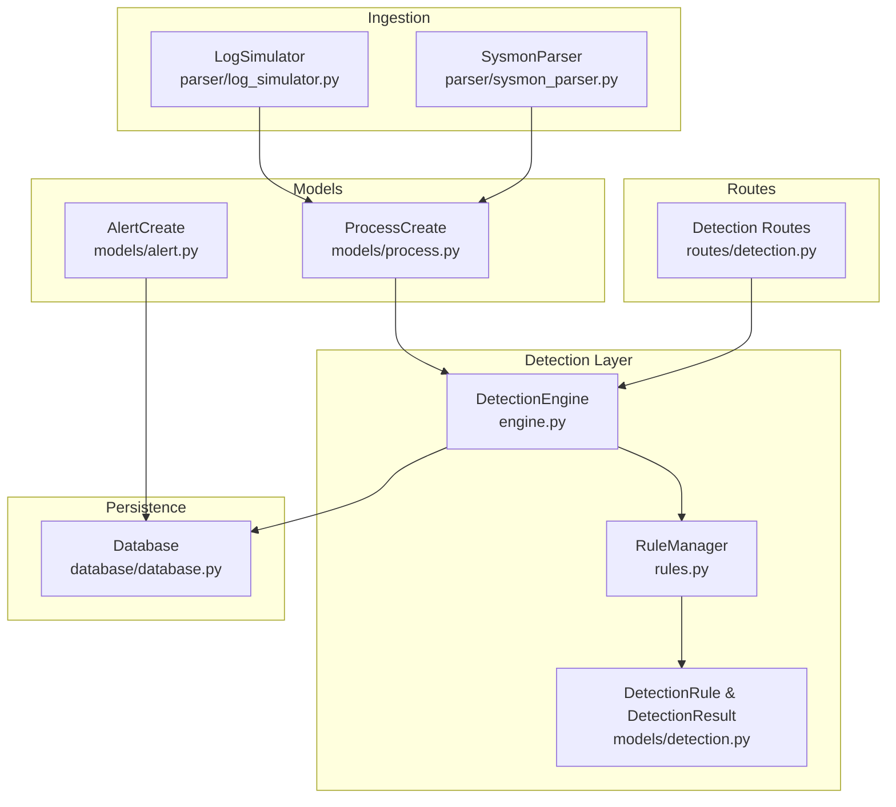
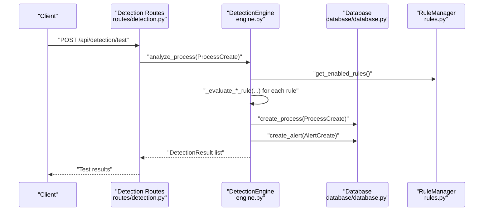
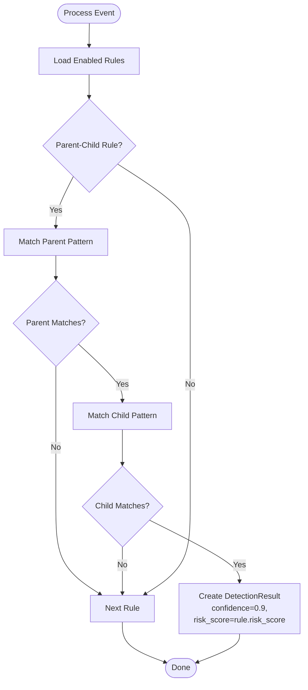
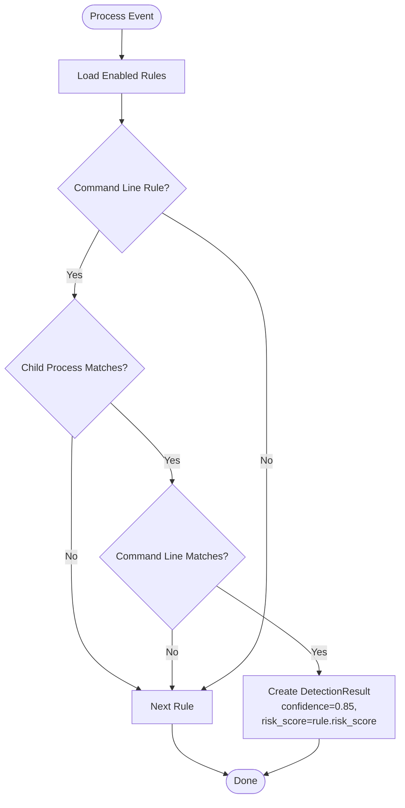
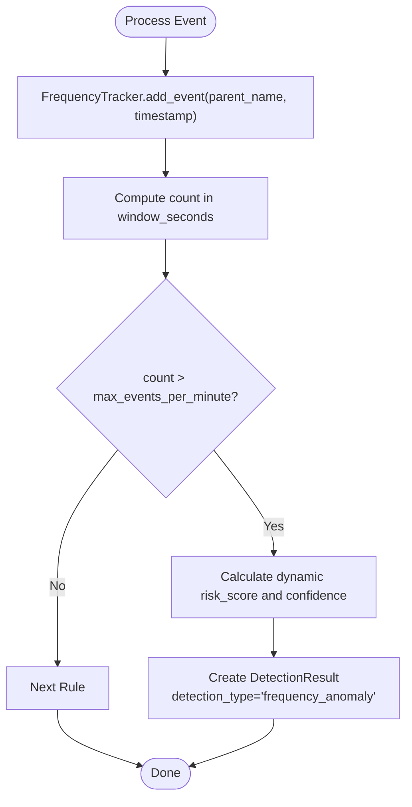
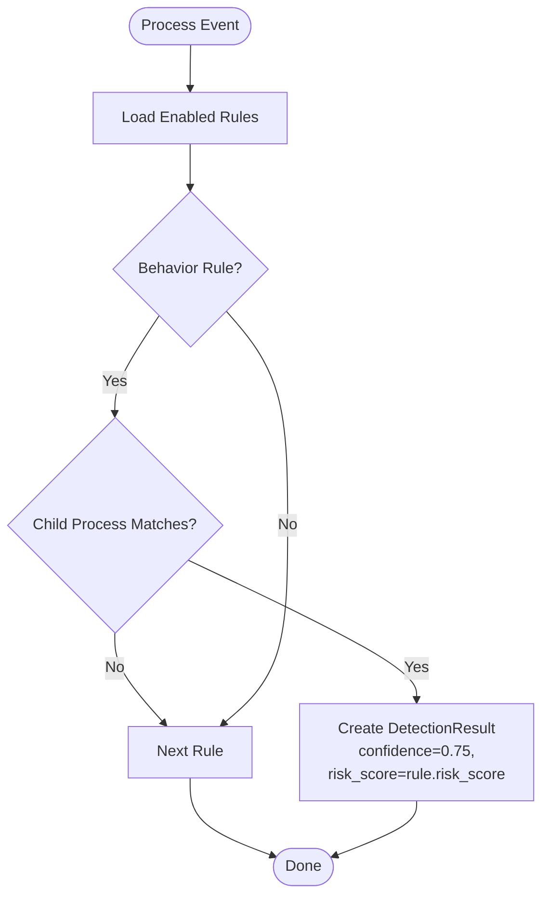
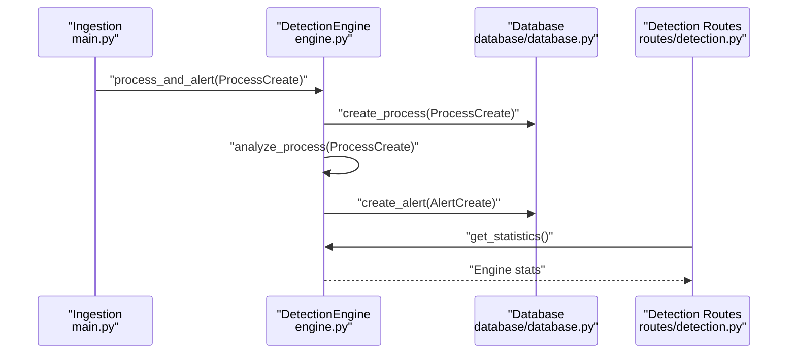
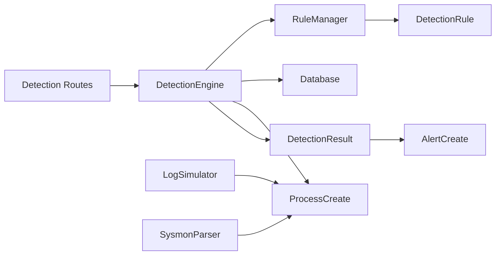

# Detection Strategies

<cite>
**Referenced Files in This Document**
- [engine.py](file://backend/detection/engine.py)
- [rules.py](file://backend/detection/rules.py)
- [detection.py](file://backend/models/detection.py)
- [process.py](file://backend/models/process.py)
- [alert.py](file://backend/models/alert.py)
- [database.py](file://backend/database/database.py)
- [routes/detection.py](file://backend/routes/detection.py)
- [main.py](file://backend/main.py)
- [log_simulator.py](file://backend/parser/log_simulator.py)
- [sysmon_parser.py](file://backend/parser/sysmon_parser.py)
</cite>

## Table of Contents
1. [Introduction](#introduction)
2. [Project Structure](#project-structure)
3. [Core Components](#core-components)
4. [Architecture Overview](#architecture-overview)
5. [Detailed Component Analysis](#detailed-component-analysis)
6. [Dependency Analysis](#dependency-analysis)
7. [Performance Considerations](#performance-considerations)
8. [Troubleshooting Guide](#troubleshooting-guide)
9. [Conclusion](#conclusion)

## Introduction
This document explains EDR Lite’s detection strategies and how the DetectionEngine implements four core detection approaches: parent-child relationship analysis, command line pattern matching, frequency analysis, and behavioral detection. It covers implementation details, configuration parameters, risk scoring mechanisms, and performance characteristics for each method, with concrete examples drawn from the codebase.

## Project Structure
The detection subsystem centers around the DetectionEngine and RuleManager, with supporting models for rules, detections, and alerts. The system integrates with a database for persistence and exposes REST endpoints for rule management and testing.

**Diagram sources**
- [engine.py:64-324](file://backend/detection/engine.py#L64-L324)
- [rules.py:273-480](file://backend/detection/rules.py#L273-L480)
- [detection.py:17-92](file://backend/models/detection.py#L17-L92)
- [process.py:6-44](file://backend/models/process.py#L6-L44)
- [alert.py:15-55](file://backend/models/alert.py#L15-L55)
- [database.py:21-324](file://backend/database/database.py#L21-L324)
- [routes/detection.py:14-256](file://backend/routes/detection.py#L14-L256)
- [log_simulator.py:18-315](file://backend/parser/log_simulator.py#L18-L315)
- [sysmon_parser.py:61-385](file://backend/parser/sysmon_parser.py#L61-L385)

**Section sources**
- [engine.py:64-324](file://backend/detection/engine.py#L64-L324)
- [rules.py:273-480](file://backend/detection/rules.py#L273-L480)
- [routes/detection.py:14-256](file://backend/routes/detection.py#L14-L256)

## Core Components
- DetectionEngine: Orchestrates detection across all rule types, maintains statistics, and creates alerts.
- RuleManager: Loads, manages, and persists detection rules from default and custom JSON sources.
- DetectionRule/DetectionResult: Typed models for rule definitions and detection outcomes.
- ProcessCreate: Standardized process event model used across the pipeline.
- Database: Persists processes and alerts, and provides analytics queries.
- Routes: Expose APIs for rule management, testing, and statistics.

Key runtime behaviors:
- Parent-child detection checks both parent and child process names against configured patterns.
- Command line detection validates command line content against either substring matches or regex patterns.
- Frequency detection uses a sliding-window counter keyed by parent process to detect bursts.
- Behavioral detection flags suspicious child process patterns and execution contexts.

**Section sources**
- [engine.py:64-324](file://backend/detection/engine.py#L64-L324)
- [rules.py:258-480](file://backend/detection/rules.py#L258-L480)
- [detection.py:17-92](file://backend/models/detection.py#L17-L92)
- [process.py:6-44](file://backend/models/process.py#L6-L44)
- [database.py:21-324](file://backend/database/database.py#L21-L324)

## Architecture Overview
The detection pipeline ingests process events, persists them, evaluates them against rules, and emits alerts when threats are detected. The system supports manual ingestion, simulated events, and rule management via REST endpoints.

**Diagram sources**
- [routes/detection.py:168-211](file://backend/routes/detection.py#L168-L211)
- [engine.py:84-119](file://backend/detection/engine.py#L84-L119)
- [database.py:86-200](file://backend/database/database.py#L86-L200)
- [rules.py:346-354](file://backend/detection/rules.py#L346-L354)

## Detailed Component Analysis

### Parent-Child Relationship Analysis
Purpose: Detect suspicious process spawning relationships by validating parent and child process names against configured patterns.

Implementation highlights:
- Parent-child evaluation is performed by checking whether the parent and child process names match the rule’s patterns.
- Confidence and risk score are set to predefined values for this rule type.
- Details include the matched parent and child processes, command line, and detection type.

Configuration parameters:
- parent_process: Regex pattern for the parent process name.
- child_process: Regex pattern for the child process name.
- risk_score: Base risk score for the rule.
- severity: Low/medium/high/critical.

Risk scoring:
- Fixed confidence and risk score derived from the rule definition.

Performance characteristics:
- O(1) per rule evaluation; negligible overhead.
- Uses compiled regex patterns internally for matching.

Concrete examples from codebase:
- Example rule IDs: RULE-001 (Outlook spawning shell), RULE-002 (Word spawning PowerShell), RULE-003 (Excel spawning scripting), RULE-004 (Browser spawning shell), RULE-005 (LSASS spawning shell), RULE-006 (Service Host spawning regsvr32), RULE-020 (WMI process creation).

**Diagram sources**
- [engine.py:142-166](file://backend/detection/engine.py#L142-L166)
- [detection.py:55-79](file://backend/models/detection.py#L55-L79)

**Section sources**
- [engine.py:142-166](file://backend/detection/engine.py#L142-L166)
- [detection.py:55-79](file://backend/models/detection.py#L55-L79)
- [rules.py:21-255](file://backend/detection/rules.py#L21-L255)

### Command Line Pattern Matching
Purpose: Detect suspicious command line arguments and execution patterns associated with known malware techniques.

Implementation highlights:
- Supports two matching modes:
  - Substring containment: Checks if any configured substrings appear in the command line (case-insensitive).
  - Regex pattern: Compiles and applies a regex pattern to the command line.
- Optionally restricts matching to specific child processes.
- Risk scoring and confidence are set according to the rule definition.

Configuration parameters:
- child_process: Optional child process pattern to constrain matching.
- command_line_contains: List of substrings to search for.
- command_line_pattern: Optional regex pattern for command line.
- risk_score: Base risk score for the rule.
- severity: Low/medium/high/critical.

Risk scoring:
- Fixed confidence and risk score derived from the rule definition.

Performance characteristics:
- Substring matching is linear in command line length; regex compilation is cached per rule.
- Negligible overhead for typical command lines.

Concrete examples from codebase:
- Encoded PowerShell command, PowerShell download cradle, hidden window, execution policy bypass, certutil download, MSHTA execution, regsvr32 remote script, shadow copy deletion, net user creation, net localgroup admin addition.

**Diagram sources**
- [engine.py:168-190](file://backend/detection/engine.py#L168-L190)
- [detection.py:71-79](file://backend/models/detection.py#L71-L79)

**Section sources**
- [engine.py:168-190](file://backend/detection/engine.py#L168-L190)
- [detection.py:30-44](file://backend/models/detection.py#L30-L44)
- [rules.py:90-209](file://backend/detection/rules.py#L90-L209)

### Frequency Analysis
Purpose: Detect anomalous spikes in process creation rates from a given parent process using a sliding-window counter.

Implementation highlights:
- FrequencyTracker maintains a thread-safe deque of timestamps keyed by parent process name.
- Sliding window cleanup removes stale entries older than a configurable age.
- get_count_in_window computes event counts within a specified window.
- Detection triggers when the count exceeds the configured threshold, with dynamic risk score and confidence computed from the excess.

Configuration parameters:
- max_events_per_minute: Threshold for triggering frequency anomalies.
- time_window_minutes: Time window for counting events.
- risk_score: Base risk score for the rule.

Risk scoring:
- Dynamic risk score increases with the excess above the threshold, capped at a maximum multiplier.
- Confidence increases with the excess.

Performance characteristics:
- add_event and get_count_in_window are O(n) in the number of events within the window; bounded by max_age_seconds and deque capacity.
- Thread-safe via a lock; suitable for concurrent ingestion.

Concrete examples from codebase:
- Rapid process spawning rule with a configurable threshold and window.

**Diagram sources**
- [engine.py:23-61](file://backend/detection/engine.py#L23-L61)
- [engine.py:192-225](file://backend/detection/engine.py#L192-L225)

**Section sources**
- [engine.py:23-61](file://backend/detection/engine.py#L23-L61)
- [engine.py:192-225](file://backend/detection/engine.py#L192-L225)
- [rules.py:210-222](file://backend/detection/rules.py#L210-L222)

### Behavioral Detection
Purpose: Identify suspicious behaviors such as script extensions or execution from temporary directories.

Implementation highlights:
- Behavioral rules match child process patterns (e.g., script extensions) or paths indicating unusual execution locations.
- On match, a DetectionResult is produced with a moderate confidence and risk score.

Configuration parameters:
- child_process: Regex pattern for child process names or paths.
- risk_score: Base risk score for the rule.
- severity: Low/medium/high/critical.

Risk scoring:
- Fixed confidence and risk score derived from the rule definition.

Performance characteristics:
- O(1) per rule evaluation; lightweight pattern matching.

Concrete examples from codebase:
- Suspicious script extension (.ps1, .vbs, .js, .bat, .cmd).
- Executables running from temp directories.

**Diagram sources**
- [engine.py:227-244](file://backend/detection/engine.py#L227-L244)
- [detection.py:63-69](file://backend/models/detection.py#L63-L69)

**Section sources**
- [engine.py:227-244](file://backend/detection/engine.py#L227-L244)
- [rules.py:223-254](file://backend/detection/rules.py#L223-L254)

### Detection Pipeline and Alert Generation
End-to-end flow:
- ProcessCreate is persisted to the database.
- DetectionEngine.analyze_process iterates enabled rules and produces DetectionResult objects.
- DetectionResults are transformed into AlertCreate objects and persisted.
- Statistics track events analyzed, alerts generated, and top triggered rules.

**Diagram sources**
- [main.py:243-311](file://backend/main.py#L243-L311)
- [engine.py:272-290](file://backend/detection/engine.py#L272-L290)
- [database.py:86-200](file://backend/database/database.py#L86-L200)
- [routes/detection.py:214-218](file://backend/routes/detection.py#L214-L218)

**Section sources**
- [engine.py:272-290](file://backend/detection/engine.py#L272-L290)
- [database.py:86-200](file://backend/database/database.py#L86-L200)
- [routes/detection.py:214-218](file://backend/routes/detection.py#L214-L218)

## Dependency Analysis
- DetectionEngine depends on:
  - RuleManager for rule lifecycle and filtering.
  - Database for persisting processes and alerts.
  - ProcessCreate and DetectionResult models for typed I/O.
- RuleManager depends on:
  - DetectionRule model for rule definitions.
  - JSON files in a configurable directory for custom rules.
- Routes depend on DetectionEngine for rule management and testing endpoints.
- Ingestion path uses LogSimulator and SysmonParser to produce ProcessCreate objects.

**Diagram sources**
- [engine.py:64-324](file://backend/detection/engine.py#L64-L324)
- [rules.py:273-480](file://backend/detection/rules.py#L273-L480)
- [routes/detection.py:14-256](file://backend/routes/detection.py#L14-L256)
- [log_simulator.py:18-315](file://backend/parser/log_simulator.py#L18-L315)
- [sysmon_parser.py:61-385](file://backend/parser/sysmon_parser.py#L61-L385)

**Section sources**
- [engine.py:64-324](file://backend/detection/engine.py#L64-L324)
- [rules.py:273-480](file://backend/detection/rules.py#L273-L480)
- [routes/detection.py:14-256](file://backend/routes/detection.py#L14-L256)

## Performance Considerations
- DetectionEngine:
  - Per-event analysis time is measured and logged; rule evaluation is O(R) where R is the number of enabled rules.
  - FrequencyTracker operations are O(n) in the number of events within the window; thread-safe and bounded by max_age_seconds and deque capacity.
- RuleManager:
  - Loading rules from files is linear in the number of rules; pattern compilation occurs once per rule.
- Database:
  - Synchronous operations for persistence; async variants are available for FastAPI endpoints.
- Ingestion:
  - Simulation mode generates synthetic events at a configurable interval; production ingestion via SysmonParser supports multiple formats.

[No sources needed since this section provides general guidance]

## Troubleshooting Guide
- Rule not triggering:
  - Verify the rule is enabled and matches the child process (if constrained).
  - Confirm command line patterns or parent/child patterns are correctly compiled.
- Frequency anomalies not detected:
  - Adjust max_events_per_minute and time_window_minutes.
  - Ensure events are arriving with sufficient temporal density.
- No alerts created:
  - Check database connectivity and permissions.
  - Review DetectionEngine logs for exceptions during rule evaluation.
- Testing rules:
  - Use the test endpoint to evaluate a ProcessCreate against rules without persisting.

**Section sources**
- [routes/detection.py:168-211](file://backend/routes/detection.py#L168-L211)
- [engine.py:109-111](file://backend/detection/engine.py#L109-L111)
- [database.py:86-200](file://backend/database/database.py#L86-L200)

## Conclusion
EDR Lite’s DetectionEngine provides a modular, rule-driven detection framework with four core strategies: parent-child analysis, command line pattern matching, frequency analysis, and behavioral detection. The system is designed for extensibility, with JSON-driven rules, robust persistence, and REST endpoints for management and testing. The provided examples demonstrate practical configurations for common attack vectors, while the architecture supports customization and performance tuning for production deployments.