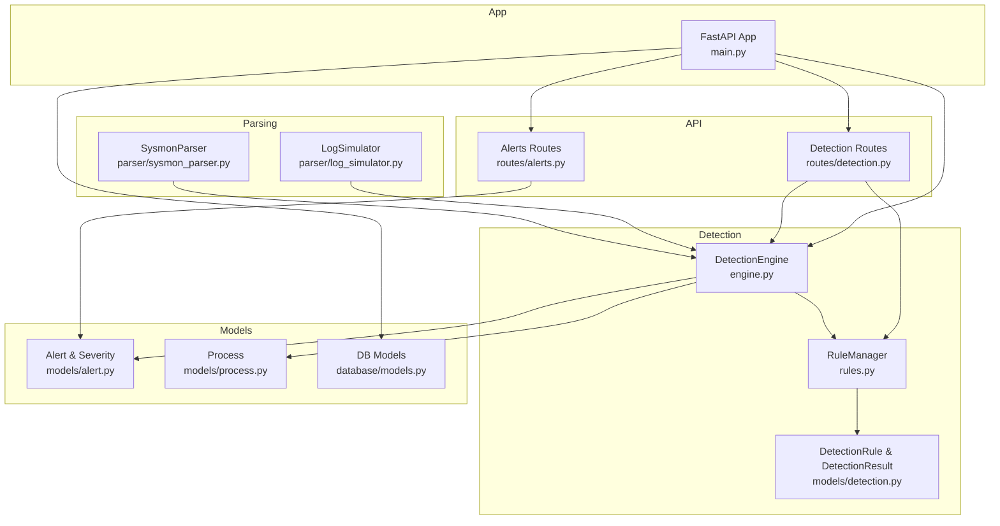
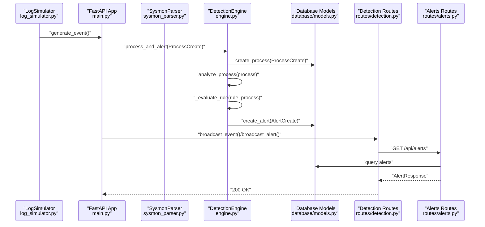
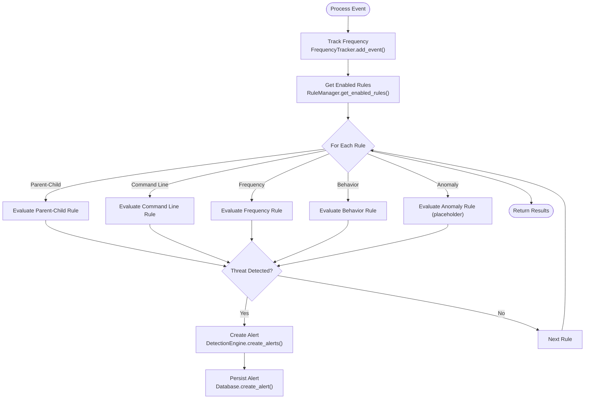
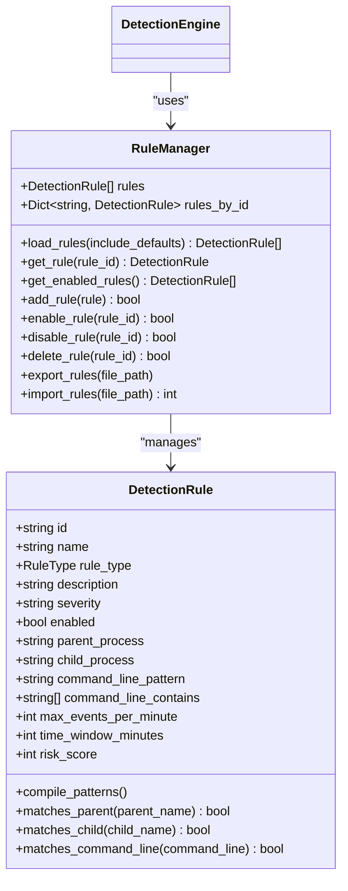
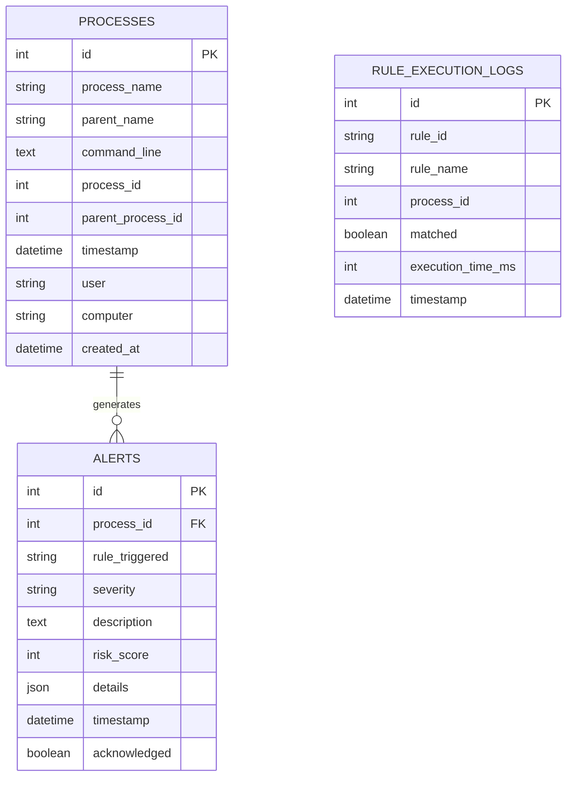
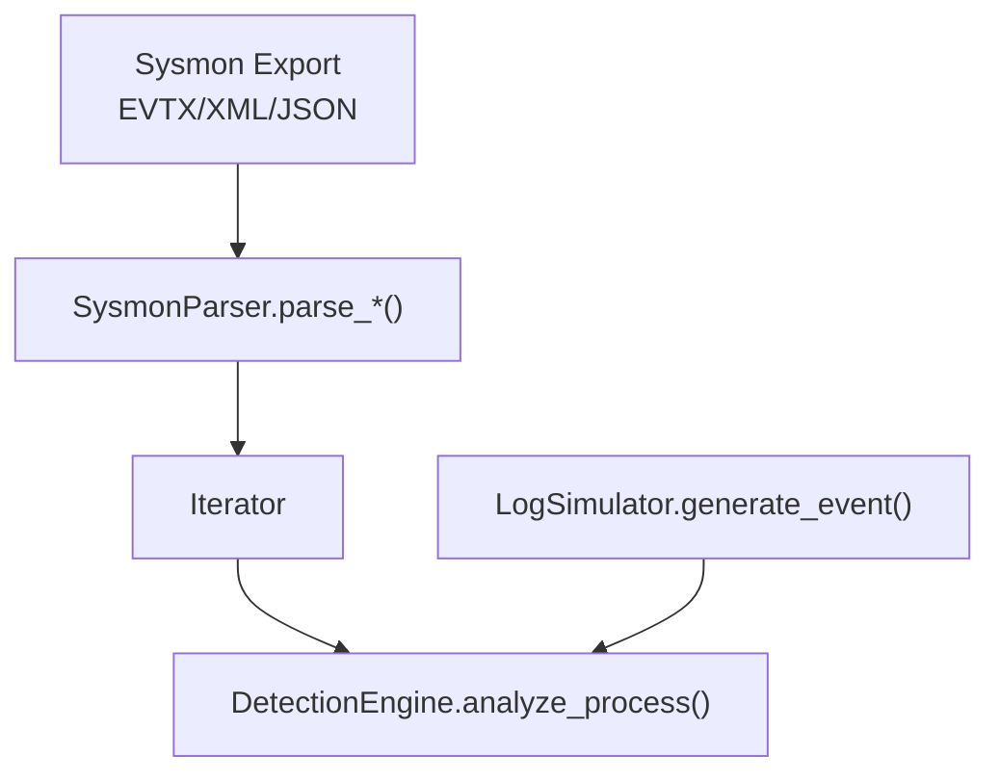
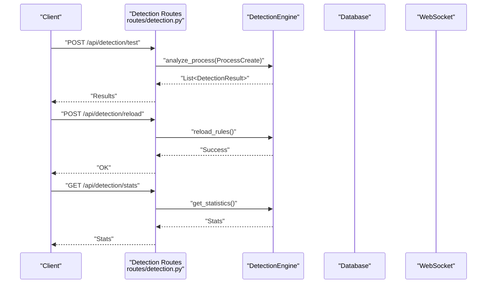
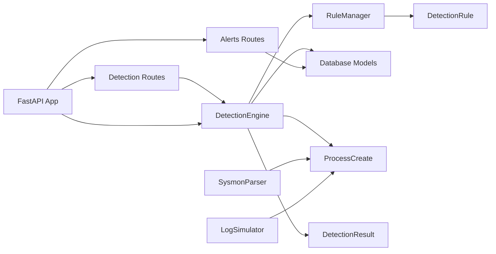

# Detection System

<cite>
**Referenced Files in This Document**
- [engine.py](file://backend/detection/engine.py)
- [rules.py](file://backend/detection/rules.py)
- [detection.py](file://backend/models/detection.py)
- [alert.py](file://backend/models/alert.py)
- [process.py](file://backend/models/process.py)
- [sysmon_parser.py](file://backend/parser/sysmon_parser.py)
- [log_simulator.py](file://backend/parser/log_simulator.py)
- [models.py](file://backend/database/models.py)
- [detection.py](file://backend/routes/detection.py)
- [alerts.py](file://backend/routes/alerts.py)
- [main.py](file://backend/main.py)
- [sample_sysmon_events.json](file://sample_data/sample_sysmon_events.json)
</cite>

## Table of Contents
1. [Introduction](#introduction)
2. [Project Structure](#project-structure)
3. [Core Components](#core-components)
4. [Architecture Overview](#architecture-overview)
5. [Detailed Component Analysis](#detailed-component-analysis)
6. [Dependency Analysis](#dependency-analysis)
7. [Performance Considerations](#performance-considerations)
8. [Troubleshooting Guide](#troubleshooting-guide)
9. [Conclusion](#conclusion)
10. [Appendices](#appendices)

## Introduction
This document explains EDR Lite’s detection system with a focus on the multi-strategy detection engine, rule-based evaluation, and alert generation. It covers:
- Multi-strategy detection: parent-child relationship analysis, command line pattern matching, frequency analysis, and behavioral detection
- Rule-based evaluation system with JSON configuration format and rule types
- Severity classification and risk scoring
- Examples of default detection rules for office macro threats, email phishing, browser exploits, credential dumping, and LOLBAS techniques
- Relationship between detection rules and alert generation, including false positive mitigation strategies
- Performance considerations for real-time detection processing and rule evaluation optimization

## Project Structure
The detection system spans several modules:
- Detection engine and rule management
- Data models for rules, detections, and alerts
- Log ingestion and parsing (Sysmon)
- Simulation for testing and demonstration
- REST API for rule management and statistics
- Database models for persistence

**Diagram sources**
- [engine.py:64-324](file://backend/detection/engine.py#L64-L324)
- [rules.py:273-480](file://backend/detection/rules.py#L273-L480)
- [detection.py:17-92](file://backend/models/detection.py#L17-L92)
- [sysmon_parser.py:61-385](file://backend/parser/sysmon_parser.py#L61-L385)
- [log_simulator.py:18-315](file://backend/parser/log_simulator.py#L18-L315)
- [alert.py:15-55](file://backend/models/alert.py#L15-L55)
- [process.py:6-44](file://backend/models/process.py#L6-L44)
- [models.py:9-77](file://backend/database/models.py#L9-L77)
- [detection.py:14-256](file://backend/routes/detection.py#L14-L256)
- [alerts.py:15-180](file://backend/routes/alerts.py#L15-L180)
- [main.py:171-360](file://backend/main.py#L171-L360)

**Section sources**
- [engine.py:1-324](file://backend/detection/engine.py#L1-L324)
- [rules.py:1-480](file://backend/detection/rules.py#L1-L480)
- [detection.py:1-92](file://backend/models/detection.py#L1-L92)
- [sysmon_parser.py:1-385](file://backend/parser/sysmon_parser.py#L1-L385)
- [log_simulator.py:1-315](file://backend/parser/log_simulator.py#L1-L315)
- [alert.py:1-55](file://backend/models/alert.py#L1-L55)
- [process.py:1-44](file://backend/models/process.py#L1-L44)
- [models.py:1-77](file://backend/database/models.py#L1-L77)
- [detection.py:1-256](file://backend/routes/detection.py#L1-L256)
- [alerts.py:1-180](file://backend/routes/alerts.py#L1-L180)
- [main.py:1-360](file://backend/main.py#L1-L360)

## Core Components
- DetectionEngine: orchestrates rule evaluation, frequency tracking, and alert creation
- RuleManager: loads, manages, and persists detection rules from JSON files and defaults
- DetectionRule: defines rule schema, matching logic, and risk scoring
- SysmonParser: parses Sysmon Event ID 1 (Process Creation) from multiple formats
- LogSimulator: generates realistic events for testing and demonstration
- Alert and Process models: define alert severity, risk scoring, and process event structures
- Database models: persist processes, alerts, and rule execution logs
- REST API: exposes endpoints for rule management, testing, statistics, and alert retrieval

**Section sources**
- [engine.py:64-324](file://backend/detection/engine.py#L64-L324)
- [rules.py:273-480](file://backend/detection/rules.py#L273-L480)
- [detection.py:17-92](file://backend/models/detection.py#L17-L92)
- [sysmon_parser.py:61-385](file://backend/parser/sysmon_parser.py#L61-L385)
- [log_simulator.py:18-315](file://backend/parser/log_simulator.py#L18-L315)
- [alert.py:15-55](file://backend/models/alert.py#L15-L55)
- [process.py:6-44](file://backend/models/process.py#L6-L44)
- [models.py:9-77](file://backend/database/models.py#L9-L77)
- [detection.py:14-256](file://backend/routes/detection.py#L14-L256)
- [alerts.py:15-180](file://backend/routes/alerts.py#L15-L180)

## Architecture Overview
The detection pipeline ingests process creation events, evaluates them against detection rules, and creates alerts when threats are detected. The system supports real-time ingestion via simulation and manual ingestion, with WebSocket broadcasting for live dashboards.

**Diagram sources**
- [log_simulator.py:138-236](file://backend/parser/log_simulator.py#L138-L236)
- [main.py:60-118](file://backend/main.py#L60-L118)
- [engine.py:272-290](file://backend/detection/engine.py#L272-L290)
- [models.py:9-77](file://backend/database/models.py#L9-L77)
- [detection.py:243-336](file://backend/routes/detection.py#L243-L336)
- [alerts.py:18-54](file://backend/routes/alerts.py#L18-L54)

## Detailed Component Analysis

### Detection Engine
The DetectionEngine performs:
- Parent-child relationship analysis
- Command line pattern matching
- Frequency-based anomaly detection
- Behavioral detection
- Alert creation and persistence

Key behaviors:
- Tracks process creation frequency per parent process for anomaly detection
- Evaluates each rule against incoming process events
- Computes risk scores and confidence levels per detection result
- Creates alerts with severity mapped from rule severity

**Diagram sources**
- [engine.py:84-119](file://backend/detection/engine.py#L84-L119)
- [engine.py:121-250](file://backend/detection/engine.py#L121-L250)
- [engine.py:252-290](file://backend/detection/engine.py#L252-L290)

**Section sources**
- [engine.py:23-61](file://backend/detection/engine.py#L23-L61)
- [engine.py:84-119](file://backend/detection/engine.py#L84-L119)
- [engine.py:121-250](file://backend/detection/engine.py#L121-L250)
- [engine.py:252-290](file://backend/detection/engine.py#L252-L290)

### Rule-Based Evaluation System
RuleManager loads default rules and custom rules from JSON files. Each DetectionRule defines:
- Rule type: parent_child, command_line, frequency, behavior, anomaly
- Matching criteria: parent_process, child_process, command_line_contains or command_line_pattern
- Thresholds: max_events_per_minute, time_window_minutes
- Risk scoring: risk_score
- Severity: low, medium, high, critical

Default rules include:
- Office macro threats: Outlook/Word/Excel spawning shells or suspicious engines
- Email phishing: Outlook spawning shells
- Browser exploits: Chrome/Firefox/IE spawning shells or PowerShell
- Credential dumping: LSASS spawning shells
- LOLBAS techniques: CertUtil, MSHTA, Regsvr32, VSSAdmin, Net, LocalGroup additions

**Diagram sources**
- [detection.py:17-92](file://backend/models/detection.py#L17-L92)
- [rules.py:273-480](file://backend/detection/rules.py#L273-L480)

**Section sources**
- [rules.py:20-255](file://backend/detection/rules.py#L20-L255)
- [rules.py:273-480](file://backend/detection/rules.py#L273-L480)
- [detection.py:8-14](file://backend/models/detection.py#L8-L14)
- [detection.py:17-92](file://backend/models/detection.py#L17-L92)

### Data Models and Persistence
- DetectionRule and DetectionResult define rule metadata, matching logic, and detection outcomes
- Alert and SeverityLevel define alert severity mapping and risk scoring
- Process models capture process creation events
- Database models persist processes, alerts, and rule execution logs

**Diagram sources**
- [process.py:6-44](file://backend/models/process.py#L6-L44)
- [alert.py:15-55](file://backend/models/alert.py#L15-L55)
- [models.py:9-77](file://backend/database/models.py#L9-L77)

**Section sources**
- [process.py:6-44](file://backend/models/process.py#L6-L44)
- [alert.py:7-13](file://backend/models/alert.py#L7-L13)
- [models.py:9-77](file://backend/database/models.py#L9-L77)

### Log Ingestion and Parsing
- SysmonParser supports EVTX, XML, and JSON formats, extracting Event ID 1 (Process Creation) fields
- LogSimulator generates realistic events for testing, including suspicious parent-child combinations and obfuscation patterns

**Diagram sources**
- [sysmon_parser.py:96-195](file://backend/parser/sysmon_parser.py#L96-L195)
- [log_simulator.py:138-236](file://backend/parser/log_simulator.py#L138-L236)
- [engine.py:84-119](file://backend/detection/engine.py#L84-L119)

**Section sources**
- [sysmon_parser.py:61-385](file://backend/parser/sysmon_parser.py#L61-L385)
- [log_simulator.py:18-315](file://backend/parser/log_simulator.py#L18-L315)

### API and WebSockets
- Detection routes expose endpoints to manage rules, test processes, reload rules, export/import rules, and view statistics
- Alerts routes provide paginated retrieval, acknowledgment, and bulk operations
- FastAPI app initializes the detection engine, database, and background simulation tasks, and broadcasts events/alerts via WebSocket

**Diagram sources**
- [detection.py:168-211](file://backend/routes/detection.py#L168-L211)
- [detection.py:221-231](file://backend/routes/detection.py#L221-L231)
- [detection.py:214-218](file://backend/routes/detection.py#L214-L218)
- [main.py:60-118](file://backend/main.py#L60-L118)

**Section sources**
- [detection.py:14-256](file://backend/routes/detection.py#L14-L256)
- [alerts.py:15-180](file://backend/routes/alerts.py#L15-L180)
- [main.py:171-360](file://backend/main.py#L171-L360)

## Dependency Analysis
- DetectionEngine depends on RuleManager, ProcessCreate, DetectionResult, DetectionRule, AlertCreate, and Database
- RuleManager depends on DetectionRule and JSON file system
- SysmonParser and LogSimulator feed ProcessCreate to DetectionEngine
- Alerts routes depend on database models and SQLAlchemy
- FastAPI app wires all components together and handles WebSocket broadcasting

**Diagram sources**
- [engine.py:64-82](file://backend/detection/engine.py#L64-L82)
- [rules.py:273-314](file://backend/detection/rules.py#L273-L314)
- [sysmon_parser.py:61-95](file://backend/parser/sysmon_parser.py#L61-L95)
- [log_simulator.py:18-44](file://backend/parser/log_simulator.py#L18-L44)
- [alerts.py:15-54](file://backend/routes/alerts.py#L15-L54)
- [detection.py:14-28](file://backend/routes/detection.py#L14-L28)
- [main.py:171-192](file://backend/main.py#L171-L192)

**Section sources**
- [engine.py:64-82](file://backend/detection/engine.py#L64-L82)
- [rules.py:273-314](file://backend/detection/rules.py#L273-L314)
- [sysmon_parser.py:61-95](file://backend/parser/sysmon_parser.py#L61-L95)
- [log_simulator.py:18-44](file://backend/parser/log_simulator.py#L18-L44)
- [alerts.py:15-54](file://backend/routes/alerts.py#L15-L54)
- [detection.py:14-28](file://backend/routes/detection.py#L14-L28)
- [main.py:171-192](file://backend/main.py#L171-L192)

## Performance Considerations
- FrequencyTracker uses thread-safe deques with bounded capacity and time-based cleanup to keep memory usage bounded during high-volume processing
- Rule evaluation is linear in the number of enabled rules; enabling only necessary rules reduces overhead
- Risk score computation scales with rule thresholds; tuning max_events_per_minute and time_window_minutes balances sensitivity and performance
- Regex compilation is deferred until needed and cached as compiled patterns on DetectionRule
- WebSocket broadcasting occurs asynchronously; ensure client-side buffering to avoid overload
- Database writes are performed per alert; batching or asynchronous writes could improve throughput under heavy load

[No sources needed since this section provides general guidance]

## Troubleshooting Guide
- Rule not triggering: verify rule.enabled, correct rule_type, and matching patterns; use the test endpoint to validate
- No alerts generated: confirm process ingestion and DetectionEngine.analyze_process is invoked; check database connectivity
- High false positives: adjust risk_score and severity thresholds; refine command_line_contains or command_line_pattern; reduce max_events_per_minute for frequency rules
- Performance degradation: disable unused rules, tune time_window_minutes, and monitor engine statistics via /api/detection/stats
- Import/Export issues: ensure JSON rule files conform to DetectionRule schema; verify file permissions and paths

**Section sources**
- [detection.py:168-211](file://backend/routes/detection.py#L168-L211)
- [rules.py:376-424](file://backend/detection/rules.py#L376-L424)
- [engine.py:292-308](file://backend/detection/engine.py#L292-L308)

## Conclusion
EDR Lite’s detection system combines rule-based matching with frequency and behavioral heuristics to detect suspicious process creation patterns. Its modular design enables easy customization via JSON rules, real-time ingestion from Sysmon, and live alerting through WebSocket. Proper tuning of thresholds and rule sets helps balance detection sensitivity with operational performance.

[No sources needed since this section summarizes without analyzing specific files]

## Appendices

### Rule Types and Examples
- Parent-Child: Detects suspicious parent-child process pairs (e.g., Outlook/Word/Excel spawning shells)
- Command Line: Matches suspicious command line patterns (e.g., encoded PowerShell, certutil downloads, regsvr32 remote scripts)
- Frequency: Flags rapid process spawning from a single parent
- Behavior: Identifies suspicious execution patterns (e.g., scripts, temp directory execution)
- Anomaly: Placeholder for future ML-based detection

**Section sources**
- [rules.py:20-255](file://backend/detection/rules.py#L20-L255)
- [detection.py:8-14](file://backend/models/detection.py#L8-L14)

### Severity Classification and Risk Scoring
- Severity levels: low, medium, high, critical
- Risk score: integer 0–100; base risk_score per rule with dynamic adjustments for frequency rules
- Confidence: floating point 0.0–1.0; varies by detection strategy

**Section sources**
- [alert.py:7-13](file://backend/models/alert.py#L7-L13)
- [detection.py:38-44](file://backend/models/detection.py#L38-L44)
- [engine.py:155-166](file://backend/detection/engine.py#L155-L166)
- [engine.py:180-190](file://backend/detection/engine.py#L180-L190)
- [engine.py:211-223](file://backend/detection/engine.py#L211-L223)

### Example Default Detection Rules
- Office macro threats: Outlook/Word/Excel spawning cmd/powershell/wscript/cscript/mshta
- Email phishing: Outlook spawning shells
- Browser exploits: Chrome/Firefox/IE spawning shells or PowerShell
- Credential dumping: LSASS spawning shells
- LOLBAS techniques: certutil, mshta, regsvr32 remote scripts, vssadmin, net user/localgroup

**Section sources**
- [rules.py:21-254](file://backend/detection/rules.py#L21-L254)

### Detection Thresholds and Configuration
- Parent-Child: matches parent and child process patterns
- Command Line: command_line_contains or command_line_pattern
- Frequency: max_events_per_minute and time_window_minutes
- Behavior: child_process regex patterns

**Section sources**
- [detection.py:26-36](file://backend/models/detection.py#L26-L36)
- [engine.py:142-166](file://backend/detection/engine.py#L142-L166)
- [engine.py:168-190](file://backend/detection/engine.py#L168-L190)
- [engine.py:192-225](file://backend/detection/engine.py#L192-L225)

### Relationship Between Rules and Alerts
- DetectionEngine.analyze_process returns DetectionResult for each matching rule
- DetectionEngine.create_alerts converts DetectionResult to AlertCreate with severity and risk_score
- Alerts are persisted and broadcast to WebSocket clients

**Section sources**
- [engine.py:121-141](file://backend/detection/engine.py#L121-L141)
- [engine.py:252-270](file://backend/detection/engine.py#L252-L270)
- [main.py:87-111](file://backend/main.py#L87-L111)

### Sample Sysmon Events
- sample_sysmon_events.json demonstrates Event ID 1 with parent-child relationships and command lines typical of phishing, macro, and LOLBAS scenarios

**Section sources**
- [sample_sysmon_events.json:1-194](file://sample_data/sample_sysmon_events.json#L1-L194)