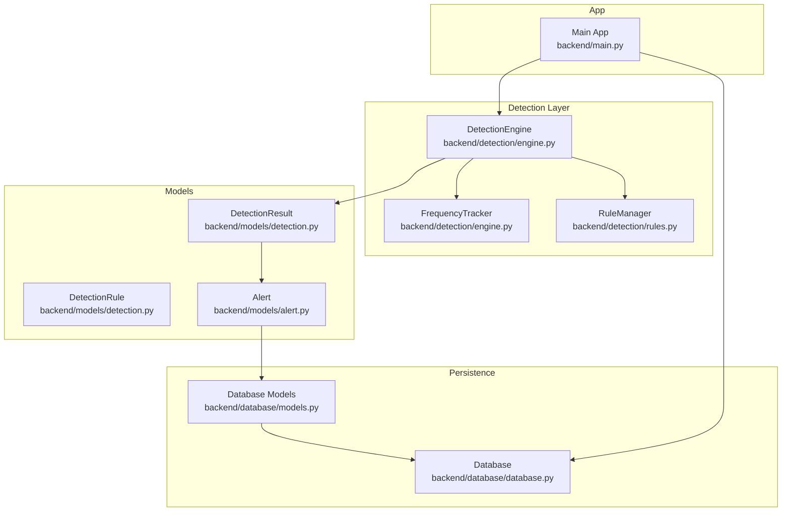
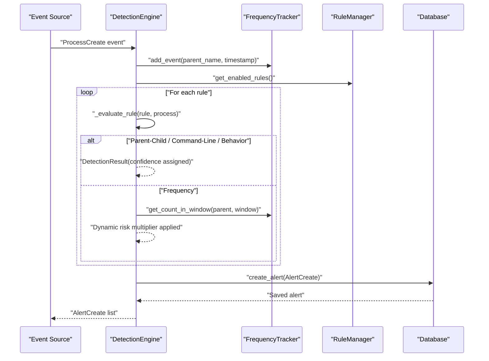
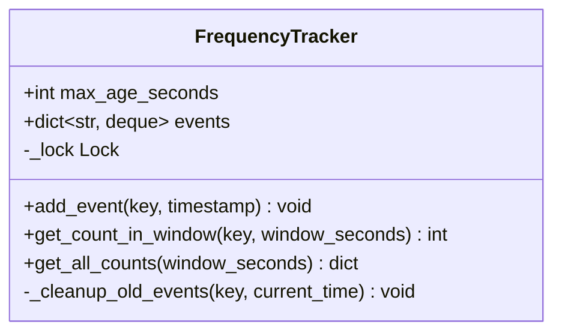
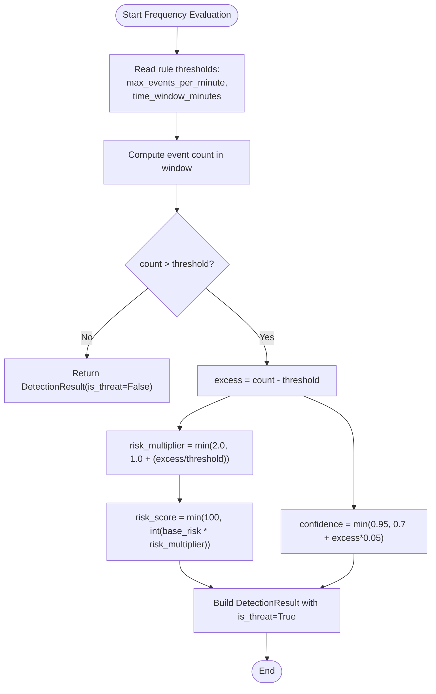
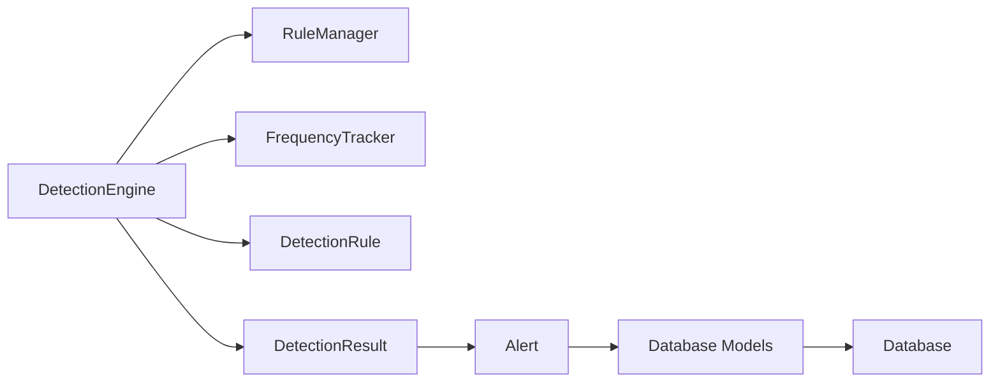

# Risk Scoring and Thresholds

<cite>
**Referenced Files in This Document**
- [engine.py](file://backend/detection/engine.py)
- [rules.py](file://backend/detection/rules.py)
- [detection.py](file://backend/models/detection.py)
- [alert.py](file://backend/models/alert.py)
- [models.py](file://backend/database/models.py)
- [database.py](file://backend/database/database.py)
- [main.py](file://backend/main.py)
</cite>

## Table of Contents
1. [Introduction](#introduction)
2. [Project Structure](#project-structure)
3. [Core Components](#core-components)
4. [Architecture Overview](#architecture-overview)
5. [Detailed Component Analysis](#detailed-component-analysis)
6. [Dependency Analysis](#dependency-analysis)
7. [Performance Considerations](#performance-considerations)
8. [Troubleshooting Guide](#troubleshooting-guide)
9. [Conclusion](#conclusion)
10. [Appendices](#appendices)

## Introduction
This document explains EDR Lite’s risk scoring and threshold management system. It covers:
- How base risk scores originate from detection rules
- Dynamic risk multipliers for frequency-based detections
- Confidence scoring from 0.0 to 1.0 and how it is assigned per detection type
- Threshold configuration parameters: max_events_per_minute and time_window_minutes
- How risk scores relate to alert severity and automatic severity classification
- The frequency-based risk calculation formula that scales risk with detection frequency
- Examples of risk scoring calculations across scenarios
- How risk scores influence alert prioritization and response workflows
- Tuning guidelines to optimize sensitivity while minimizing false positives

## Project Structure
The risk scoring and threshold logic is implemented primarily in the detection engine and rule models, with alert severity derived from rule metadata and persisted via the database layer.

**Diagram sources**
- [engine.py:64-324](file://backend/detection/engine.py#L64-L324)
- [rules.py:273-480](file://backend/detection/rules.py#L273-L480)
- [detection.py:17-92](file://backend/models/detection.py#L17-L92)
- [alert.py:15-55](file://backend/models/alert.py#L15-L55)
- [models.py](file://backend/database/models.py)
- [database.py](file://backend/database/database.py)
- [main.py](file://backend/main.py)

**Section sources**
- [engine.py:1-324](file://backend/detection/engine.py#L1-L324)
- [rules.py:1-480](file://backend/detection/rules.py#L1-L480)
- [detection.py:1-92](file://backend/models/detection.py#L1-L92)
- [alert.py:1-55](file://backend/models/alert.py#L1-L55)
- [models.py](file://backend/database/models.py)
- [database.py](file://backend/database/database.py)
- [main.py](file://backend/main.py)

## Core Components
- DetectionEngine: Orchestrates detection evaluation, frequency tracking, and alert creation. Implements dynamic risk scoring for frequency-based rules and confidence assignment per detection type.
- FrequencyTracker: Maintains sliding-window counts of process creation events keyed by parent process name.
- RuleManager: Loads default and custom rules, compiles patterns, and exposes enabled rules.
- DetectionRule: Defines rule metadata, thresholds, and base risk scores.
- DetectionResult: Captures detection outcomes, confidence, and risk score.
- Alert: Represents the alert entity with severity derived from the triggering rule.

Key implementation references:
- Frequency evaluation and dynamic risk multiplier: [engine.py:192-225](file://backend/detection/engine.py#L192-L225)
- Confidence assignments per detection type: [engine.py:155-190](file://backend/detection/engine.py#L155-L190)
- Rule thresholds and base risk: [detection.py:34-39](file://backend/models/detection.py#L34-L39)
- Default frequency rule configuration: [rules.py:210-221](file://backend/detection/rules.py#L210-L221)

**Section sources**
- [engine.py:64-324](file://backend/detection/engine.py#L64-L324)
- [rules.py:210-221](file://backend/detection/rules.py#L210-L221)
- [detection.py:17-92](file://backend/models/detection.py#L17-L92)
- [alert.py:15-55](file://backend/models/alert.py#L15-L55)

## Architecture Overview
The detection pipeline evaluates incoming process events against enabled rules, computes risk scores dynamically for frequency-based detections, and creates alerts with severity mapped from rule metadata.

**Diagram sources**
- [engine.py:84-119](file://backend/detection/engine.py#L84-L119)
- [engine.py:121-250](file://backend/detection/engine.py#L121-L250)
- [engine.py:252-270](file://backend/detection/engine.py#L252-L270)
- [rules.py:291-313](file://backend/detection/rules.py#L291-L313)

## Detailed Component Analysis

### FrequencyTracker
- Purpose: Tracks process creation events per parent process within a sliding time window.
- Sliding window: Controlled by max_age_seconds and window_seconds queries.
- Thread-safe: Uses a lock around event deque updates.
- Exposed operations: add_event, get_count_in_window, get_all_counts.

**Diagram sources**
- [engine.py:23-61](file://backend/detection/engine.py#L23-L61)

**Section sources**
- [engine.py:23-61](file://backend/detection/engine.py#L23-L61)

### DetectionEngine
- Responsibilities:
  - Analyze process events against rules
  - Evaluate rule types and compute DetectionResult
  - Apply dynamic risk scoring for frequency anomalies
  - Assign confidence scores per detection type
  - Create AlertCreate objects and persist alerts
- Frequency evaluation:
  - Computes event count within time_window_minutes
  - Triggers if count exceeds max_events_per_minute
  - Applies dynamic risk multiplier and caps risk score at 100
  - Caps confidence below 0.95
- Confidence assignments:
  - Parent-Child: 0.9
  - Command-Line: 0.85
  - Behavior: 0.75
  - Frequency: starts at 0.7 and increases with excess events
- Alert creation:
  - Severity copied from rule.severity
  - Details include detection_type and relevant metrics

**Diagram sources**
- [engine.py:192-225](file://backend/detection/engine.py#L192-L225)

**Section sources**
- [engine.py:84-119](file://backend/detection/engine.py#L84-L119)
- [engine.py:121-250](file://backend/detection/engine.py#L121-L250)
- [engine.py:252-270](file://backend/detection/engine.py#L252-L270)

### RuleManager and DetectionRule
- RuleManager loads default and custom rules, compiles regex patterns, and exposes enabled rules.
- DetectionRule defines:
  - rule_type, severity, description, enabled
  - thresholds for frequency rules: max_events_per_minute, time_window_minutes
  - base risk_score (0–100)
  - Pattern matching helpers for parent/child/command-line

Default frequency rule example:
- Rule ID: RULE-017
- Name: Rapid Process Spawning
- Description: Unusually high rate of process creation from single parent
- Severity: medium
- Thresholds: max_events_per_minute: 30, time_window_minutes: 1
- Base risk_score: 60

**Section sources**
- [rules.py:210-221](file://backend/detection/rules.py#L210-L221)
- [detection.py:17-92](file://backend/models/detection.py#L17-L92)

### DetectionResult and Alert
- DetectionResult captures:
  - is_threat, rule, confidence (0.0–1.0), risk_score (0–100), details, timestamp
- Alert:
  - Inherits severity from rule metadata
  - Includes risk_score and details for downstream triage

**Section sources**
- [detection.py:85-92](file://backend/models/detection.py#L85-L92)
- [alert.py:15-55](file://backend/models/alert.py#L15-L55)

## Dependency Analysis
- DetectionEngine depends on:
  - RuleManager for enabled rules
  - FrequencyTracker for event counting
  - DetectionResult and Alert models for outputs
- RuleManager depends on DetectionRule and filesystem for custom rules
- Alerts are persisted via database models and database layer

**Diagram sources**
- [engine.py:64-82](file://backend/detection/engine.py#L64-L82)
- [rules.py:273-313](file://backend/detection/rules.py#L273-L313)
- [detection.py:17-92](file://backend/models/detection.py#L17-L92)
- [alert.py:15-55](file://backend/models/alert.py#L15-L55)
- [models.py](file://backend/database/models.py)
- [database.py](file://backend/database/database.py)

**Section sources**
- [engine.py:64-82](file://backend/detection/engine.py#L64-L82)
- [rules.py:273-313](file://backend/detection/rules.py#L273-L313)
- [detection.py:17-92](file://backend/models/detection.py#L17-L92)
- [alert.py:15-55](file://backend/models/alert.py#L15-L55)
- [models.py](file://backend/database/models.py)
- [database.py](file://backend/database/database.py)

## Performance Considerations
- FrequencyTracker uses deques with maxlen and periodic cleanup to bound memory and improve lookup performance.
- get_count_in_window filters timestamps in O(n) per key; ensure reasonable window sizes and parent_name cardinality.
- Regex compilation is cached in DetectionRule after initial load to avoid repeated overhead.
- Confidence and risk score computations are constant-time additions to rule evaluation.

[No sources needed since this section provides general guidance]

## Troubleshooting Guide
Common issues and resolutions:
- Frequency rule not triggering:
  - Verify max_events_per_minute and time_window_minutes are set appropriately for the workload.
  - Confirm the parent process name matches the rule pattern.
- Excessive false positives from frequency rule:
  - Increase max_events_per_minute or time_window_minutes to smooth out bursts.
  - Consider raising base risk_score to improve alert prioritization without changing thresholds.
- Low confidence scores:
  - Parent-Child and Command-Line detections have higher confidence defaults; adjust rule patterns or add specificity to increase match precision.
- Severity not reflecting risk:
  - Severity is taken from the rule; ensure the rule severity field is set as intended.

**Section sources**
- [engine.py:192-225](file://backend/detection/engine.py#L192-L225)
- [rules.py:210-221](file://backend/detection/rules.py#L210-L221)
- [detection.py:34-39](file://backend/models/detection.py#L34-L39)

## Conclusion
EDR Lite’s risk scoring system combines static base risk from rules with dynamic multipliers for frequency anomalies. Confidence scores are assigned per detection type, and severity is propagated from rule metadata. Threshold parameters—max_events_per_minute and time_window_minutes—directly control sensitivity and must be tuned to balance detection coverage and false positives. The frequency-based formula ensures risk escalates proportionally with abnormal event rates, enabling robust alert prioritization and efficient incident response workflows.

[No sources needed since this section summarizes without analyzing specific files]

## Appendices

### Threshold Configuration Parameters
- max_events_per_minute: Threshold for frequency anomaly detection; when exceeded, triggers dynamic risk scoring.
- time_window_minutes: Time window (converted to seconds) used to compute event counts for frequency checks.

Impact on sensitivity:
- Lower max_events_per_minute or shorter time_window_minutes increase sensitivity and may raise false positives.
- Higher values reduce sensitivity but can miss rapid bursts.

**Section sources**
- [detection.py:34-39](file://backend/models/detection.py#L34-L39)
- [engine.py:192-225](file://backend/detection/engine.py#L192-L225)

### Risk Scoring Calculation Examples
- Example 1: Parent-Child rule
  - Base risk: 80
  - Confidence: 0.9
  - Risk score: 80
  - Detection type: parent_child_mismatch
  - Reference: [engine.py:155-166](file://backend/detection/engine.py#L155-L166)

- Example 2: Command-Line rule
  - Base risk: varies by rule (e.g., 85)
  - Confidence: 0.85
  - Risk score: base risk
  - Detection type: suspicious_command_line
  - Reference: [engine.py:180-190](file://backend/detection/engine.py#L180-L190)

- Example 3: Behavior rule
  - Base risk: varies by rule (e.g., 50–55)
  - Confidence: 0.75
  - Risk score: base risk
  - Detection type: suspicious_behavior
  - Reference: [engine.py:233-244](file://backend/detection/engine.py#L233-L244)

- Example 4: Frequency rule (default)
  - Base risk: 60
  - Threshold: 30 events per minute over 1-minute window
  - Scenario A: 35 events (excess = 5)
    - risk_multiplier = min(2.0, 1.0 + (5/30)) ≈ 1.167
    - risk_score = min(100, int(60 × 1.167)) = 70
    - confidence = min(0.95, 0.7 + 5×0.05) = 0.95
  - Scenario B: 60 events (excess = 30)
    - risk_multiplier = min(2.0, 1.0 + (30/30)) = 2.0
    - risk_score = min(100, int(60 × 2.0)) = 100
    - confidence = min(0.95, 0.7 + 30×0.05) = 0.95
  - Detection type: frequency_anomaly
  - References: [rules.py:210-221](file://backend/detection/rules.py#L210-L221), [engine.py:192-225](file://backend/detection/engine.py#L192-L225)

### Relationship Between Risk Scores and Severity
- Severity is assigned from the rule’s severity field during alert creation.
- Risk score influences prioritization and triage workflows downstream of alert generation.
- Reference: [engine.py:258-268](file://backend/detection/engine.py#L258-L268), [alert.py:15-55](file://backend/models/alert.py#L15-L55)

### Tuning Guidelines
- Start with default thresholds and observe baseline behavior.
- Increase max_events_per_minute or time_window_minutes to reduce false positives if bursts are normal in the environment.
- Decrease thresholds to catch more anomalies, but monitor false positive rate.
- Adjust base risk_score to reflect operational priorities without changing thresholds.
- Use confidence and severity to categorize alerts; ensure severity reflects true impact.

[No sources needed since this section provides general guidance]