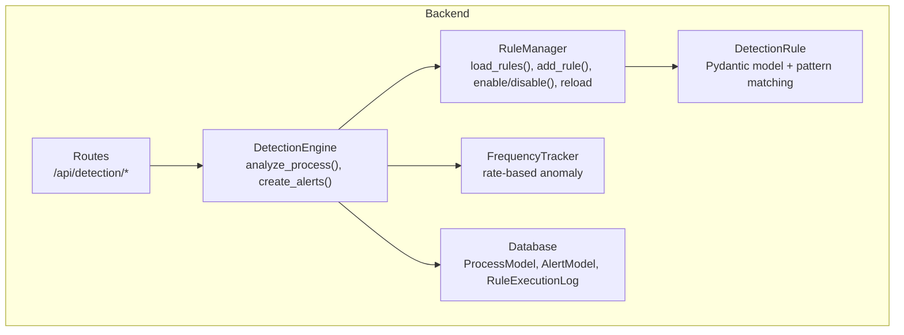
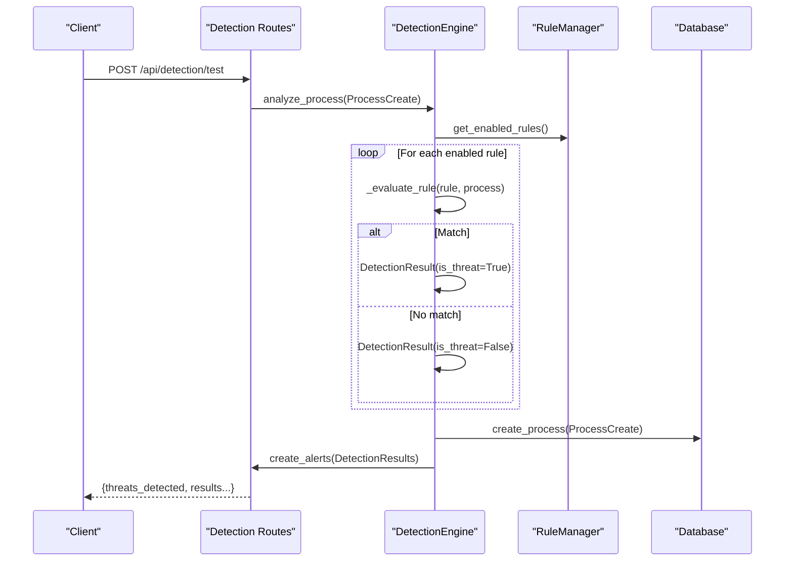
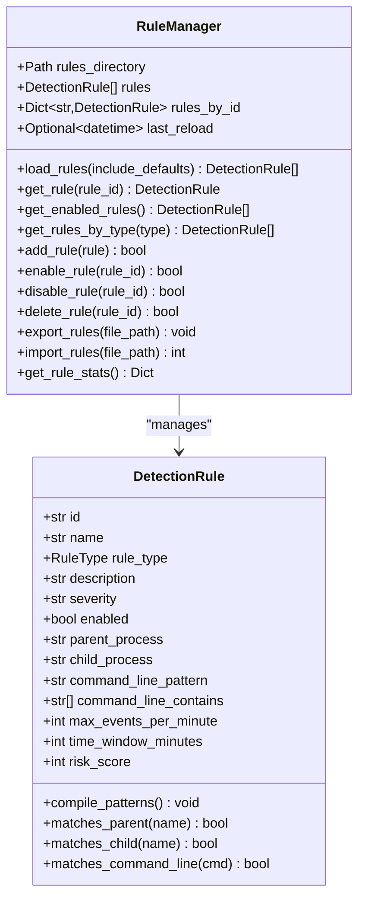
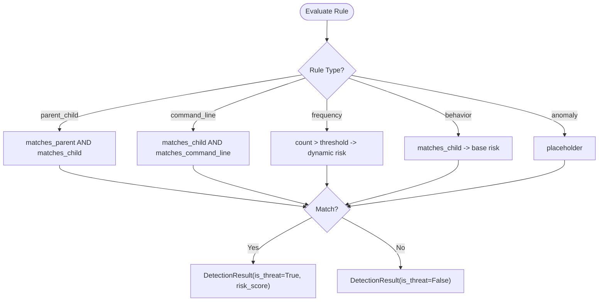
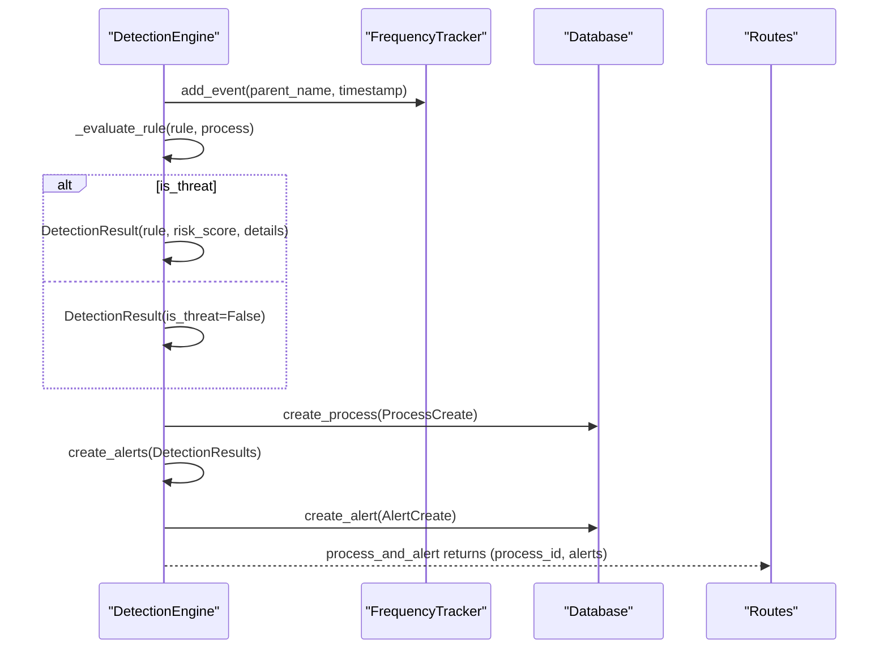
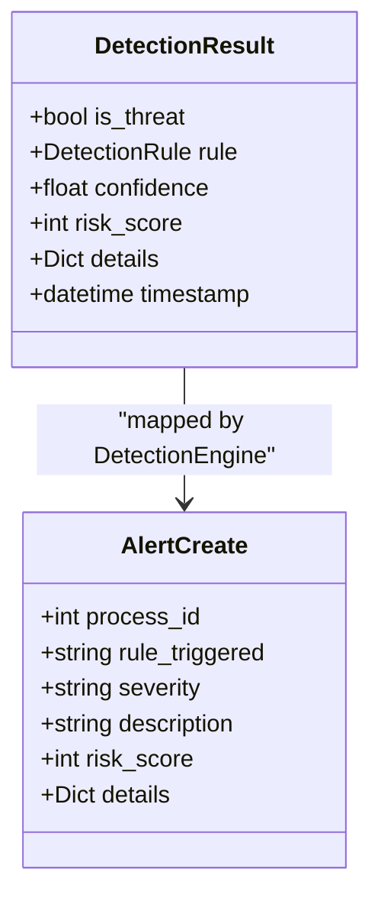
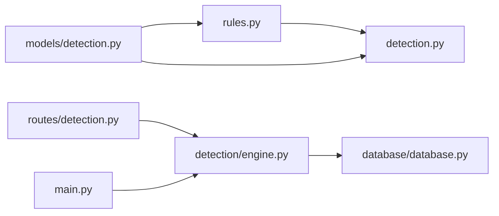

# Rule Management

<cite>
**Referenced Files in This Document**
- [backend/detection/rules.py](file://backend/detection/rules.py)
- [backend/detection/engine.py](file://backend/detection/engine.py)
- [backend/models/detection.py](file://backend/models/detection.py)
- [backend/models/alert.py](file://backend/models/alert.py)
- [backend/models/process.py](file://backend/models/process.py)
- [backend/database/models.py](file://backend/database/models.py)
- [backend/database/database.py](file://backend/database/database.py)
- [backend/routes/detection.py](file://backend/routes/detection.py)
- [backend/main.py](file://backend/main.py)
- [README.md](file://README.md)
</cite>

## Table of Contents
1. [Introduction](#introduction)
2. [Project Structure](#project-structure)
3. [Core Components](#core-components)
4. [Architecture Overview](#architecture-overview)
5. [Detailed Component Analysis](#detailed-component-analysis)
6. [Dependency Analysis](#dependency-analysis)
7. [Performance Considerations](#performance-considerations)
8. [Troubleshooting Guide](#troubleshooting-guide)
9. [Conclusion](#conclusion)
10. [Appendices](#appendices)

## Introduction
This document explains the rule management system powering EDR Lite’s detection engine. It covers how detection rules are defined, loaded, evaluated, and integrated into alert generation. It also documents the RuleManager architecture, rule configuration formats, rule types, evaluation logic, enable/disable controls, dynamic reloading, validation, and practical guidance for building custom rules.

## Project Structure
The rule management system spans several backend modules:
- Rule definition and storage: DetectionRule model and RuleManager
- Detection engine: Rule evaluation, frequency tracking, and alert creation
- Persistence: Database models and operations for processes, alerts, and rule execution logs
- API: Endpoints to manage rules, test detections, and reload configurations
- Application lifecycle: Startup initializes the detection engine and loads rules

**Diagram sources**
- [backend/detection/rules.py:273-480](file://backend/detection/rules.py#L273-L480)
- [backend/models/detection.py:17-92](file://backend/models/detection.py#L17-L92)
- [backend/detection/engine.py:64-324](file://backend/detection/engine.py#L64-L324)
- [backend/database/database.py:21-324](file://backend/database/database.py#L21-L324)
- [backend/routes/detection.py:1-256](file://backend/routes/detection.py#L1-L256)

**Section sources**
- [backend/detection/rules.py:1-480](file://backend/detection/rules.py#L1-L480)
- [backend/detection/engine.py:1-324](file://backend/detection/engine.py#L1-L324)
- [backend/models/detection.py:1-92](file://backend/models/detection.py#L1-L92)
- [backend/database/database.py:1-324](file://backend/database/database.py#L1-L324)
- [backend/routes/detection.py:1-256](file://backend/routes/detection.py#L1-L256)
- [backend/main.py:120-177](file://backend/main.py#L120-L177)

## Core Components
- DetectionRule: Pydantic model defining rule schema, rule type enumeration, and pattern compilation helpers.
- RuleManager: Loads default and custom rules, manages enable/disable state, and persists custom rules to disk.
- DetectionEngine: Evaluates incoming process events against rules, computes risk scores, and creates AlertCreate objects.
- Database: Stores processes, alerts, and execution logs; supports CRUD operations and statistics.
- Routes: Expose REST endpoints for rule management, testing, reloading, and statistics.

Key responsibilities:
- Rule configuration: JSON-driven with fields for type, severity, matching criteria, thresholds, and risk score.
- Evaluation logic: Type-specific matching (parent-child, command line, frequency, behavior, anomaly).
- Alert mapping: DetectionResult feeds AlertCreate with rule metadata, severity, and details.

**Section sources**
- [backend/models/detection.py:8-92](file://backend/models/detection.py#L8-L92)
- [backend/detection/rules.py:258-480](file://backend/detection/rules.py#L258-L480)
- [backend/detection/engine.py:64-324](file://backend/detection/engine.py#L64-L324)
- [backend/database/models.py:9-77](file://backend/database/models.py#L9-L77)
- [backend/routes/detection.py:44-256](file://backend/routes/detection.py#L44-L256)

## Architecture Overview
The rule management architecture integrates rule loading, evaluation, and alerting into a cohesive pipeline.

**Diagram sources**
- [backend/detection/engine.py:84-120](file://backend/detection/engine.py#L84-L120)
- [backend/routes/detection.py:168-211](file://backend/routes/detection.py#L168-L211)
- [backend/database/database.py:86-121](file://backend/database/database.py#L86-L121)

## Detailed Component Analysis

### RuleManager: Rule Loading, Validation, and Persistence
- Default rules: Embedded in code as a list of dictionaries; compiled into DetectionRule objects and validated.
- Custom rules: Loaded from JSON files in the config/rules directory; supports single-rule or array-of-rules JSON.
- Persistence: New or updated rules are saved to individual JSON files named by rule id; enable/disable toggles update persisted files.
- Indexing: Maintains a dictionary mapping rule id to rule object for fast lookup.
- Statistics: Provides counts by type and severity, plus last reload timestamp.

**Diagram sources**
- [backend/detection/rules.py:273-480](file://backend/detection/rules.py#L273-L480)
- [backend/models/detection.py:17-92](file://backend/models/detection.py#L17-L92)

**Section sources**
- [backend/detection/rules.py:258-480](file://backend/detection/rules.py#L258-L480)
- [backend/models/detection.py:8-92](file://backend/models/detection.py#L8-L92)

### DetectionRule Schema and Matching Logic
- Rule types: parent_child, command_line, frequency, behavior, anomaly.
- Matching:
  - Parent-child: regex patterns for parent and child process names.
  - Command line: either a regex pattern or a list of substrings to detect.
  - Frequency: threshold-based rate detection using a sliding window.
  - Behavior: pattern-based checks on child process names.
  - Anomaly: placeholder for future ML-based detection.
- Risk scoring: Base risk_score per rule; frequency rules compute a dynamic risk multiplier based on excess events.

**Diagram sources**
- [backend/detection/engine.py:121-250](file://backend/detection/engine.py#L121-L250)
- [backend/models/detection.py:46-80](file://backend/models/detection.py#L46-L80)

**Section sources**
- [backend/models/detection.py:17-92](file://backend/models/detection.py#L17-L92)
- [backend/detection/engine.py:121-250](file://backend/detection/engine.py#L121-L250)

### DetectionEngine: Evaluation Pipeline and Alert Creation
- Analyzes a ProcessCreate against all enabled rules.
- Uses FrequencyTracker to maintain per-parent counts for rate-based anomalies.
- Creates DetectionResult objects with confidence and risk_score.
- Converts DetectionResult to AlertCreate with severity and description mapped from the rule.

**Diagram sources**
- [backend/detection/engine.py:84-291](file://backend/detection/engine.py#L84-L291)
- [backend/database/database.py:86-215](file://backend/database/database.py#L86-L215)

**Section sources**
- [backend/detection/engine.py:64-324](file://backend/detection/engine.py#L64-L324)
- [backend/database/database.py:86-215](file://backend/database/database.py#L86-L215)

### Rule Configuration Format and Examples
- JSON schema fields:
  - id, name, rule_type, description, severity, enabled
  - parent_process, child_process (regex)
  - command_line_pattern (regex) or command_line_contains (array of strings)
  - max_events_per_minute, time_window_minutes (integers)
  - risk_score (integer 0–100)
- Example rule types are documented in the project README with JSON samples for parent-child, command_line, and frequency rules.

**Section sources**
- [backend/models/detection.py:17-92](file://backend/models/detection.py#L17-L92)
- [README.md:142-190](file://README.md#L142-L190)

### Rule Types and Parameters
- Parent-Child: Detects suspicious parent-child process pairs using regex patterns.
- Command Line: Matches either a regex or a list of substrings in the command line; optionally restricts to specific child processes.
- Frequency: Flags rapid process spawning from a single parent using a configurable threshold and time window; risk_score scales dynamically.
- Behavior: Generic behavioral indicators based on child process patterns.
- Anomaly: Reserved for advanced detection (placeholder).

**Section sources**
- [backend/models/detection.py:8-15](file://backend/models/detection.py#L8-L15)
- [backend/detection/engine.py:121-250](file://backend/detection/engine.py#L121-L250)

### Rule Evaluation Logic and Risk Scoring
- Confidence: Predefined per rule type to reflect rule reliability.
- Risk scoring:
  - Base risk_score from rule configuration.
  - Frequency rules scale risk based on the ratio of observed events to threshold.
- DetectionResult includes details for downstream alerting and debugging.

**Section sources**
- [backend/detection/engine.py:155-225](file://backend/detection/engine.py#L155-L225)
- [backend/models/detection.py:85-92](file://backend/models/detection.py#L85-L92)

### Rule Enable/Disable, Dynamic Reloading, and Validation
- Enable/disable: Toggles enabled flag and persists to JSON; reload endpoint reinitializes RuleManager.
- Dynamic reloading: POST /api/detection/reload triggers DetectionEngine to reload rules.
- Validation: Rules are validated during construction; errors are logged and ignored to avoid breaking startup.

**Section sources**
- [backend/detection/rules.py:376-425](file://backend/detection/rules.py#L376-L425)
- [backend/routes/detection.py:221-231](file://backend/routes/detection.py#L221-L231)
- [backend/detection/engine.py:310-314](file://backend/detection/engine.py#L310-L314)

### Relationship Between Detection Rules and Alerts
- DetectionResult produced by DetectionEngine is transformed into AlertCreate with:
  - process_id, rule_triggered (rule name), severity, description, risk_score, and details.
- Alerts are persisted to the database and streamed via WebSocket.

**Diagram sources**
- [backend/models/detection.py:85-92](file://backend/models/detection.py#L85-L92)
- [backend/models/alert.py:24-38](file://backend/models/alert.py#L24-L38)
- [backend/detection/engine.py:252-270](file://backend/detection/engine.py#L252-L270)

**Section sources**
- [backend/detection/engine.py:252-270](file://backend/detection/engine.py#L252-L270)
- [backend/models/alert.py:15-38](file://backend/models/alert.py#L15-L38)
- [backend/database/models.py:39-64](file://backend/database/models.py#L39-L64)

### Default Detection Rules and Coverage Areas
The system ships with default rules covering:
- Office macro threats (Outlook/Word/Excel spawning suspicious children)
- Email phishing (Outlook spawning shells)
- Browser exploits (Chrome/Firefox spawning shells)
- Credential dumping (LSASS spawning suspicious processes)
- Ransomware indicators (shadow copy deletion)
- LOLBAS techniques (CertUtil, Regsvr32, MSHTA, etc.)
- Persistence vectors and encoded commands

These are embedded in the default rules list and compiled into DetectionRule objects at startup.

**Section sources**
- [backend/detection/rules.py:21-255](file://backend/detection/rules.py#L21-L255)
- [README.md:254-266](file://README.md#L254-L266)

### Rule Customization Guidelines and Best Practices
- Keep patterns specific to reduce false positives; use word boundaries and anchors in regex.
- Prefer command_line_contains for simple keyword detection; use command_line_pattern for complex multi-part matches.
- Tune max_events_per_minute and time_window_minutes carefully to balance sensitivity vs. noise.
- Start with lower risk_score and increase gradually; combine with severity to control alert urgency.
- Use the test endpoint to validate rule behavior against representative events before enabling.
- Export/import rules to version-control custom rule sets.

**Section sources**
- [backend/routes/detection.py:168-211](file://backend/routes/detection.py#L168-L211)
- [backend/detection/rules.py:448-480](file://backend/detection/rules.py#L448-L480)

### Developing Custom Detection Rules
- Create a JSON file in the config/rules directory with a unique id and appropriate fields.
- Use the POST /api/detection/rules endpoint to add a rule programmatically.
- Toggle enable/disable via PUT /api/detection/rules/{rule_id}/toggle.
- Use GET /api/detection/test to validate behavior without persisting.
- Use GET /api/detection/rules/stats to monitor rule effectiveness.

**Section sources**
- [backend/routes/detection.py:86-158](file://backend/routes/detection.py#L86-L158)
- [backend/detection/rules.py:355-425](file://backend/detection/rules.py#L355-L425)

## Dependency Analysis
The rule management system exhibits clear separation of concerns:
- RuleManager depends on DetectionRule and filesystem I/O.
- DetectionEngine depends on RuleManager, FrequencyTracker, and Database.
- Routes depend on DetectionEngine and expose management APIs.
- Database models encapsulate persistence for processes, alerts, and logs.

**Diagram sources**
- [backend/detection/rules.py:1-480](file://backend/detection/rules.py#L1-L480)
- [backend/detection/engine.py:1-324](file://backend/detection/engine.py#L1-L324)
- [backend/models/detection.py:1-92](file://backend/models/detection.py#L1-L92)
- [backend/database/database.py:1-324](file://backend/database/database.py#L1-L324)
- [backend/routes/detection.py:1-256](file://backend/routes/detection.py#L1-L256)
- [backend/main.py:120-177](file://backend/main.py#L120-L177)

**Section sources**
- [backend/detection/rules.py:1-480](file://backend/detection/rules.py#L1-L480)
- [backend/detection/engine.py:1-324](file://backend/detection/engine.py#L1-L324)
- [backend/models/detection.py:1-92](file://backend/models/detection.py#L1-L92)
- [backend/database/database.py:1-324](file://backend/database/database.py#L1-L324)
- [backend/routes/detection.py:1-256](file://backend/routes/detection.py#L1-L256)
- [backend/main.py:120-177](file://backend/main.py#L120-L177)

## Performance Considerations
- Regex compilation: Patterns are compiled lazily and cached as private attributes on DetectionRule; repeated evaluations reuse compiled patterns.
- Memory indexing: RuleManager maintains an id-to-rule dictionary for O(1) lookups.
- Frequency tracking: Sliding window counters are thread-safe and bounded; cleanup removes stale entries older than a configured threshold.
- I/O: Rule persistence writes are minimal and occur on add/update/delete; consider batching if managing many rules programmatically.
- Recommendations:
  - Keep regex patterns efficient; avoid catastrophic backtracking.
  - Limit frequent rule updates; batch changes and trigger reload once.
  - Monitor rule_stats and disable underperforming rules to reduce evaluation overhead.

**Section sources**
- [backend/models/detection.py:46-80](file://backend/models/detection.py#L46-L80)
- [backend/detection/engine.py:23-62](file://backend/detection/engine.py#L23-L62)
- [backend/detection/rules.py:376-425](file://backend/detection/rules.py#L376-L425)

## Troubleshooting Guide
- Rules not triggering:
  - Verify rule.enabled is True and rule_type matches the event characteristics.
  - Use GET /api/detection/test to simulate a process and inspect results.
  - Confirm patterns compile; check logs for errors during rule loading.
- Alerts not appearing:
  - Ensure DetectionEngine.process_and_alert completes and Database.create_alert succeeds.
  - Check database connectivity and table creation.
- Dynamic reload issues:
  - Call POST /api/detection/reload to refresh rules from disk.
  - Confirm config/rules directory permissions and JSON validity.
- False positives:
  - Narrow patterns; add child_process restrictions for command_line rules.
  - Increase max_events_per_minute thresholds for frequency rules.
  - Lower risk_score or adjust severity to reduce alert volume.

**Section sources**
- [backend/routes/detection.py:168-231](file://backend/routes/detection.py#L168-L231)
- [backend/database/database.py:185-215](file://backend/database/database.py#L185-L215)
- [backend/detection/engine.py:310-314](file://backend/detection/engine.py#L310-L314)

## Conclusion
EDR Lite’s rule management system provides a flexible, JSON-driven approach to endpoint detection. RuleManager centralizes loading and persistence, DetectionEngine applies type-specific logic with tunable risk scoring, and the API enables dynamic management and testing. By following the customization guidelines and leveraging the provided examples, teams can rapidly develop targeted rules to detect real-world threats while minimizing false positives.

## Appendices

### API Reference: Detection Rules and Engine
- GET /api/detection/rules: List all rules; filter by enabled_only and rule_type.
- GET /api/detection/rules/{rule_id}: Get rule details including trigger counts.
- POST /api/detection/rules: Create a new rule from JSON.
- PUT /api/detection/rules/{rule_id}: Update an existing rule by id.
- POST /api/detection/rules/{rule_id}/toggle: Enable or disable a rule.
- DELETE /api/detection/rules/{rule_id}: Delete a custom rule.
- GET /api/detection/rules/stats: Get rule statistics (counts by type/severity).
- POST /api/detection/test: Test a process against rules without persisting.
- POST /api/detection/reload: Reload rules from files.
- POST /api/detection/export: Export all rules to a JSON file.
- POST /api/detection/import: Import rules from a JSON file.

**Section sources**
- [backend/routes/detection.py:44-256](file://backend/routes/detection.py#L44-L256)

### Data Models: Processes, Alerts, and Rule Execution Logs
- ProcessModel: Stores process events with parent/child info and timestamps.
- AlertModel: Stores alerts with severity, description, risk_score, and details.
- RuleExecutionLog: Tracks rule execution outcomes for auditing.

**Section sources**
- [backend/database/models.py:9-77](file://backend/database/models.py#L9-L77)