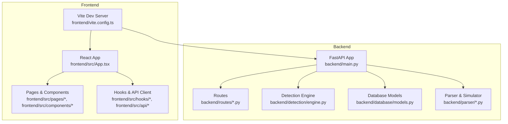
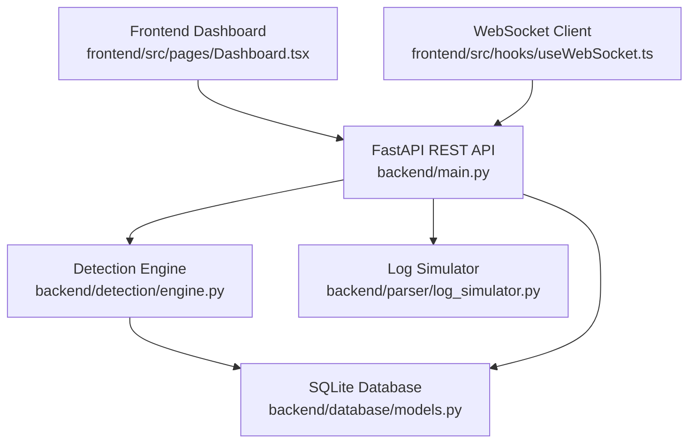
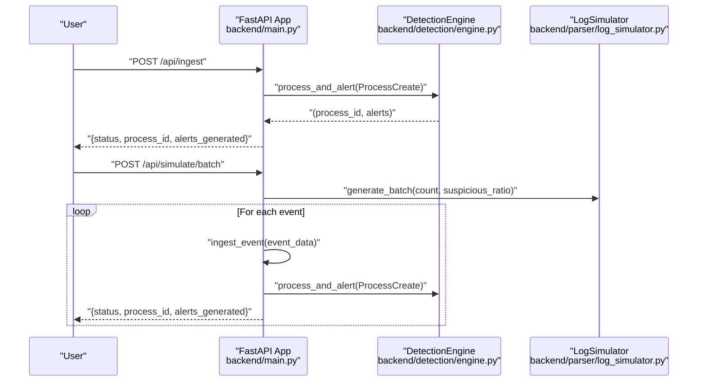
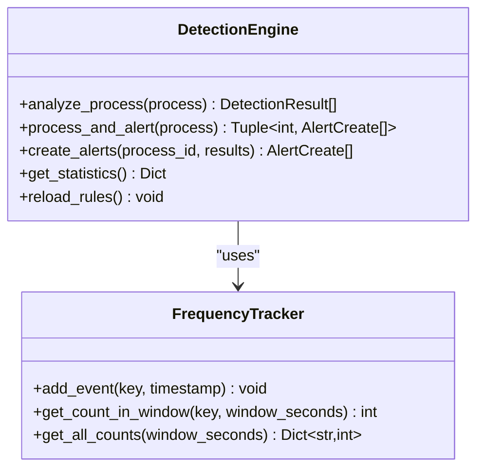
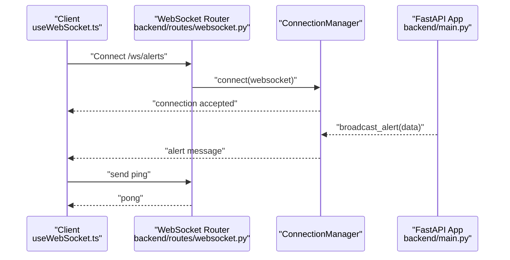
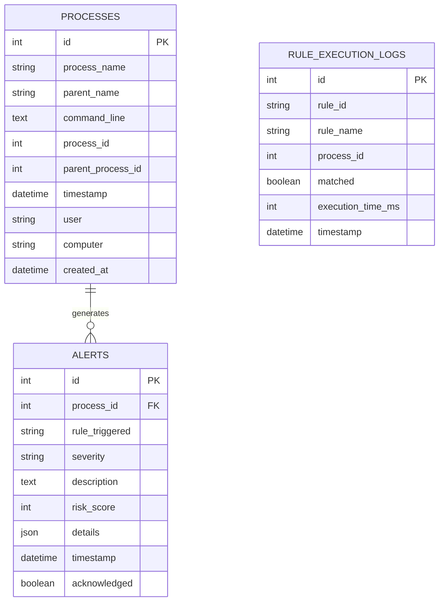
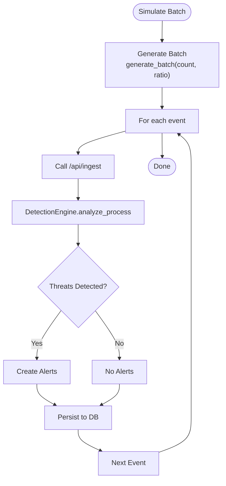
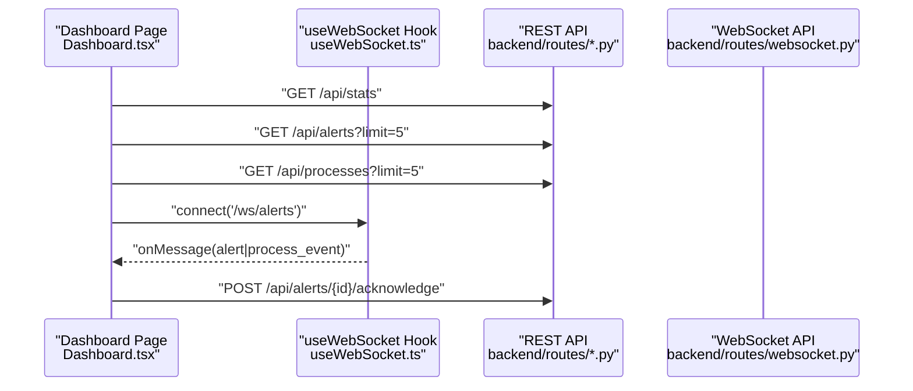
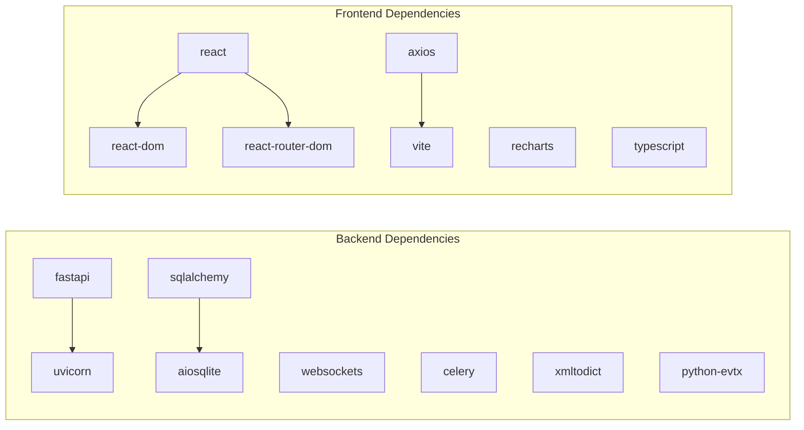

# Development Guide

<cite>
**Referenced Files in This Document**
- [README.md](file://README.md)
- [backend/main.py](file://backend/main.py)
- [backend/requirements.txt](file://backend/requirements.txt)
- [backend/detection/engine.py](file://backend/detection/engine.py)
- [backend/routes/websocket.py](file://backend/routes/websocket.py)
- [backend/database/models.py](file://backend/database/models.py)
- [backend/parser/log_simulator.py](file://backend/parser/log_simulator.py)
- [backend/models/alert.py](file://backend/models/alert.py)
- [backend/routes/alerts.py](file://backend/routes/alerts.py)
- [backend/routes/processes.py](file://backend/routes/processes.py)
- [frontend/package.json](file://frontend/package.json)
- [frontend/vite.config.ts](file://frontend/vite.config.ts)
- [frontend/src/App.tsx](file://frontend/src/App.tsx)
- [frontend/src/pages/Dashboard.tsx](file://frontend/src/pages/Dashboard.tsx)
- [frontend/src/hooks/useWebSocket.ts](file://frontend/src/hooks/useWebSocket.ts)
</cite>

## Table of Contents
1. [Introduction](#introduction)
2. [Project Structure](#project-structure)
3. [Core Components](#core-components)
4. [Architecture Overview](#architecture-overview)
5. [Detailed Component Analysis](#detailed-component-analysis)
6. [Dependency Analysis](#dependency-analysis)
7. [Performance Considerations](#performance-considerations)
8. [Troubleshooting Guide](#troubleshooting-guide)
9. [Contribution Guidelines](#contribution-guidelines)
10. [Conclusion](#conclusion)
11. [Appendices](#appendices)

## Introduction
This development guide provides a comprehensive overview of setting up a local development environment, contributing to the EDR Lite project, and extending its functionality. It covers backend and frontend setup, hot reloading, project structure, coding standards, testing, adding detection rules, extending the detection engine, developing custom visualization components, pull request and code review processes, continuous integration practices, debugging and profiling, and performance analysis.

## Project Structure
The project is organized into two primary areas:
- backend: FastAPI application with routing, detection engine, database models, parsers, and WebSocket streaming
- frontend: React-based dashboard with TypeScript, Vite, and Tailwind CSS

**Diagram sources**
- [backend/main.py:171-192](file://backend/main.py#L171-L192)
- [backend/routes/alerts.py:15](file://backend/routes/alerts.py#L15)
- [backend/routes/processes.py:16](file://backend/routes/processes.py#L16)
- [backend/detection/engine.py:64-83](file://backend/detection/engine.py#L64-L83)
- [backend/database/models.py:1-77](file://backend/database/models.py#L1-L77)
- [backend/parser/log_simulator.py:18-315](file://backend/parser/log_simulator.py#L18-L315)
- [frontend/vite.config.ts:1-25](file://frontend/vite.config.ts#L1-L25)
- [frontend/src/App.tsx:1-23](file://frontend/src/App.tsx#L1-L23)

**Section sources**
- [README.md:31-51](file://README.md#L31-L51)
- [backend/main.py:171-192](file://backend/main.py#L171-L192)
- [frontend/vite.config.ts:12-24](file://frontend/vite.config.ts#L12-L24)

## Core Components
- Backend application lifecycle and configuration, including CORS, routers, and static file serving
- Detection engine with rule evaluation, frequency tracking, and alert creation
- WebSocket streaming for real-time alerts and events
- Database models for processes and alerts
- Log simulator for generating test events
- REST API routes for alerts, processes, and detection
- Frontend React application with routing, pages, hooks, and WebSocket integration

Key implementation references:
- Application lifecycle and environment configuration: [backend/main.py:51-169](file://backend/main.py#L51-L169)
- Detection engine initialization and rule evaluation: [backend/detection/engine.py:64-324](file://backend/detection/engine.py#L64-L324)
- WebSocket connection management and broadcasting: [backend/routes/websocket.py:21-233](file://backend/routes/websocket.py#L21-L233)
- Database models for processes and alerts: [backend/database/models.py:9-77](file://backend/database/models.py#L9-L77)
- Log simulator for test events: [backend/parser/log_simulator.py:18-315](file://backend/parser/log_simulator.py#L18-L315)
- Alerts API endpoints: [backend/routes/alerts.py:18-180](file://backend/routes/alerts.py#L18-L180)
- Processes API endpoints: [backend/routes/processes.py:19-253](file://backend/routes/processes.py#L19-L253)
- Frontend Vite configuration and proxy: [frontend/vite.config.ts:12-24](file://frontend/vite.config.ts#L12-L24)
- Frontend React app routing: [frontend/src/App.tsx:1-23](file://frontend/src/App.tsx#L1-L23)

**Section sources**
- [backend/main.py:51-169](file://backend/main.py#L51-L169)
- [backend/detection/engine.py:64-324](file://backend/detection/engine.py#L64-L324)
- [backend/routes/websocket.py:21-233](file://backend/routes/websocket.py#L21-L233)
- [backend/database/models.py:9-77](file://backend/database/models.py#L9-L77)
- [backend/parser/log_simulator.py:18-315](file://backend/parser/log_simulator.py#L18-L315)
- [backend/routes/alerts.py:18-180](file://backend/routes/alerts.py#L18-L180)
- [backend/routes/processes.py:19-253](file://backend/routes/processes.py#L19-L253)
- [frontend/vite.config.ts:12-24](file://frontend/vite.config.ts#L12-L24)
- [frontend/src/App.tsx:1-23](file://frontend/src/App.tsx#L1-L23)

## Architecture Overview
The system consists of a FastAPI backend exposing REST endpoints and WebSocket streams, with a React frontend that consumes both APIs and WebSocket feeds. The backend includes a detection engine that evaluates incoming process events against detection rules and persists results to a SQLite database.

**Diagram sources**
- [backend/main.py:171-192](file://backend/main.py#L171-L192)
- [backend/detection/engine.py:64-83](file://backend/detection/engine.py#L64-L83)
- [backend/database/models.py:1-77](file://backend/database/models.py#L1-L77)
- [backend/parser/log_simulator.py:18-315](file://backend/parser/log_simulator.py#L18-L315)
- [frontend/src/pages/Dashboard.tsx:45-58](file://frontend/src/pages/Dashboard.tsx#L45-L58)
- [frontend/src/hooks/useWebSocket.ts:13-103](file://frontend/src/hooks/useWebSocket.ts#L13-L103)

## Detailed Component Analysis

### Backend Application Lifecycle and Configuration
- Environment configuration via EDRConfig
- Application lifespan manager for startup/shutdown routines
- CORS middleware configuration
- Router registration for alerts, processes, detection, and WebSocket
- Health checks, statistics, ingestion, and simulation endpoints

**Diagram sources**
- [backend/main.py:243-336](file://backend/main.py#L243-L336)
- [backend/detection/engine.py:272-290](file://backend/detection/engine.py#L272-L290)
- [backend/parser/log_simulator.py:225-236](file://backend/parser/log_simulator.py#L225-L236)

**Section sources**
- [backend/main.py:51-169](file://backend/main.py#L51-L169)
- [backend/main.py:171-241](file://backend/main.py#L171-L241)
- [backend/main.py:313-358](file://backend/main.py#L313-L358)

### Detection Engine and Rule Evaluation
- FrequencyTracker for anomaly detection based on parent-child process creation rates
- DetectionEngine with rule evaluation strategies (parent-child, command line, frequency, behavior)
- Alert creation and persistence
- Statistics collection and rule reload capability

**Diagram sources**
- [backend/detection/engine.py:64-324](file://backend/detection/engine.py#L64-L324)

**Section sources**
- [backend/detection/engine.py:23-62](file://backend/detection/engine.py#L23-L62)
- [backend/detection/engine.py:84-324](file://backend/detection/engine.py#L84-L324)

### WebSocket Streaming and Broadcasting
- ConnectionManager maintains active connections and broadcasts messages
- WebSocket endpoints for alerts and events with heartbeat and client message handling
- Global broadcast functions for alerts, events, and statistics

**Diagram sources**
- [backend/routes/websocket.py:21-233](file://backend/routes/websocket.py#L21-L233)
- [frontend/src/hooks/useWebSocket.ts:13-103](file://frontend/src/hooks/useWebSocket.ts#L13-L103)
- [backend/main.py:90-118](file://backend/main.py#L90-L118)

**Section sources**
- [backend/routes/websocket.py:21-233](file://backend/routes/websocket.py#L21-L233)
- [frontend/src/hooks/useWebSocket.ts:13-103](file://frontend/src/hooks/useWebSocket.ts#L13-L103)

### Database Models and Persistence
- ProcessModel and AlertModel with SQLAlchemy ORM
- JSON field for alert details and rule execution logs
- Timestamp indexing for efficient querying

**Diagram sources**
- [backend/database/models.py:9-77](file://backend/database/models.py#L9-L77)

**Section sources**
- [backend/database/models.py:9-77](file://backend/database/models.py#L9-L77)

### Log Simulator and Testing
- Generates realistic Sysmon Event ID 1 events
- Supports normal and suspicious parent-child combinations
- Batch generation and streaming modes for testing

**Diagram sources**
- [backend/parser/log_simulator.py:225-236](file://backend/parser/log_simulator.py#L225-L236)
- [backend/main.py:243-336](file://backend/main.py#L243-L336)
- [backend/detection/engine.py:84-119](file://backend/detection/engine.py#L84-L119)

**Section sources**
- [backend/parser/log_simulator.py:18-315](file://backend/parser/log_simulator.py#L18-L315)
- [backend/main.py:313-358](file://backend/main.py#L313-L358)

### Frontend Dashboard and WebSocket Integration
- React Router-based navigation
- Dashboard page fetching stats, alerts, and recent processes
- WebSocket hook for real-time updates and automatic reconnection
- Proxy configuration for API and WebSocket traffic

**Diagram sources**
- [frontend/src/pages/Dashboard.tsx:25-65](file://frontend/src/pages/Dashboard.tsx#L25-L65)
- [frontend/src/hooks/useWebSocket.ts:27-72](file://frontend/src/hooks/useWebSocket.ts#L27-L72)
- [backend/routes/alerts.py:104-138](file://backend/routes/alerts.py#L104-L138)
- [backend/routes/websocket.py:68-119](file://backend/routes/websocket.py#L68-L119)

**Section sources**
- [frontend/src/App.tsx:1-23](file://frontend/src/App.tsx#L1-L23)
- [frontend/src/pages/Dashboard.tsx:18-208](file://frontend/src/pages/Dashboard.tsx#L18-L208)
- [frontend/src/hooks/useWebSocket.ts:13-103](file://frontend/src/hooks/useWebSocket.ts#L13-L103)
- [frontend/vite.config.ts:12-24](file://frontend/vite.config.ts#L12-L24)

## Dependency Analysis
- Backend dependencies declared in requirements.txt
- Frontend dependencies managed via package.json
- Vite proxy configuration for API and WebSocket endpoints

**Diagram sources**
- [backend/requirements.txt:1-14](file://backend/requirements.txt#L1-L14)
- [frontend/package.json:5-28](file://frontend/package.json#L5-L28)

**Section sources**
- [backend/requirements.txt:1-14](file://backend/requirements.txt#L1-L14)
- [frontend/package.json:5-28](file://frontend/package.json#L5-L28)

## Performance Considerations
- Detection engine tracks analysis time and maintains statistics for throughput measurement
- FrequencyTracker uses thread-safe deques with time-windowed counts for anomaly detection
- WebSocket broadcasting handles disconnections and cleans up inactive clients
- SQLite is suitable for development; consider PostgreSQL for high-volume production deployments
- Use production ASGI server (e.g., gunicorn with uvicorn workers) for deployment

[No sources needed since this section provides general guidance]

## Troubleshooting Guide
- Verify backend and frontend are running on the expected ports (8000 and 3000 respectively)
- Check CORS configuration if frontend-origin requests are blocked
- Inspect logs directory for application logs
- Use health check endpoint to confirm service status
- Validate environment variables for database URL, simulation mode, and intervals
- Confirm WebSocket connectivity and automatic reconnection behavior

**Section sources**
- [backend/main.py:214-223](file://backend/main.py#L214-L223)
- [backend/main.py:34-35](file://backend/main.py#L34-L35)
- [backend/main.py:179-186](file://backend/main.py#L179-L186)

## Contribution Guidelines
- Follow existing code style and patterns
- Include tests for new features
- Update documentation
- Write clear commit messages
- Adhere to pull request process and code review standards

**Section sources**
- [README.md:295-301](file://README.md#L295-L301)

## Conclusion
This guide outlined the development setup, architecture, and extension points for EDR Lite. By leveraging the FastAPI backend, detection engine, and React frontend, contributors can add new detection rules, extend the engine, develop custom visualizations, and integrate with the WebSocket streaming infrastructure. Follow the contribution guidelines and leverage the testing and simulation utilities for robust development.

[No sources needed since this section summarizes without analyzing specific files]

## Appendices

### Local Development Setup
- Backend
  - Create and activate a Python virtual environment
  - Install dependencies from requirements.txt
  - Copy environment file and adjust variables as needed
  - Run the FastAPI application with hot reload enabled when DEBUG is true
- Frontend
  - Install dependencies via package manager
  - Start Vite development server
  - Access the dashboard at the configured port

**Section sources**
- [README.md:62-118](file://README.md#L62-L118)
- [backend/requirements.txt:1-14](file://backend/requirements.txt#L1-L14)
- [frontend/package.json:24-28](file://frontend/package.json#L24-L28)
- [backend/main.py:699-705](file://backend/main.py#L699-L705)
- [frontend/vite.config.ts:12-24](file://frontend/vite.config.ts#L12-L24)

### Adding New Detection Rules
- Define rule JSON with appropriate fields (id, name, rule_type, severity, enabled, etc.)
- Place rule files in the configured rules directory
- Use the detection reload endpoint to refresh rules at runtime
- Validate rule behavior using the detection test endpoint

**Section sources**
- [README.md:142-189](file://README.md#L142-L189)
- [backend/main.py:243-336](file://backend/main.py#L243-L336)

### Extending the Detection Engine
- Add new rule evaluation strategies in the DetectionEngine
- Implement frequency tracking enhancements in FrequencyTracker
- Extend alert creation logic and persistence
- Update statistics collection and rule reload mechanisms

**Section sources**
- [backend/detection/engine.py:64-324](file://backend/detection/engine.py#L64-L324)

### Developing Custom Visualization Components
- Create new pages under frontend/src/pages
- Build reusable components in frontend/src/components
- Integrate with the API client in frontend/src/api
- Utilize the WebSocket hook for real-time updates

**Section sources**
- [frontend/src/App.tsx:1-23](file://frontend/src/App.tsx#L1-L23)
- [frontend/src/pages/Dashboard.tsx:18-208](file://frontend/src/pages/Dashboard.tsx#L18-L208)
- [frontend/src/hooks/useWebSocket.ts:13-103](file://frontend/src/hooks/useWebSocket.ts#L13-L103)

### Pull Request and Code Review Standards
- Ensure code follows existing style patterns
- Include tests for new features
- Update documentation
- Write clear commit messages
- Submit PRs for peer review

**Section sources**
- [README.md:295-301](file://README.md#L295-L301)

### Continuous Integration Practices
- Use production ASGI server for deployment
- Build frontend assets and serve statically
- Consider CI pipelines for automated testing and builds

**Section sources**
- [README.md:204-222](file://README.md#L204-L222)

### Debugging Techniques and Profiling Tools
- Inspect application logs in the logs directory
- Use health check endpoint to verify service status
- Leverage WebSocket client-side logging for connection issues
- Monitor detection engine statistics for performance insights

**Section sources**
- [backend/main.py:214-223](file://backend/main.py#L214-L223)
- [backend/main.py:34-35](file://backend/main.py#L34-L35)
- [frontend/src/hooks/useWebSocket.ts:55-66](file://frontend/src/hooks/useWebSocket.ts#L55-L66)

### Performance Analysis Methods
- Measure detection analysis time per event
- Track frequency-based anomalies with configurable windows
- Monitor rule trigger counts and top triggered rules
- Evaluate throughput metrics via system statistics endpoint

**Section sources**
- [backend/detection/engine.py:113-119](file://backend/detection/engine.py#L113-L119)
- [backend/detection/engine.py:292-308](file://backend/detection/engine.py#L292-L308)
- [backend/main.py:226-240](file://backend/main.py#L226-L240)

### Common Development Tasks

#### Adding New API Endpoints
- Define route handlers in backend/routes
- Use FastAPI dependency injection for database sessions
- Return Pydantic models for serialization
- Register routers in the main application

**Section sources**
- [backend/routes/alerts.py:18-180](file://backend/routes/alerts.py#L18-L180)
- [backend/routes/processes.py:19-253](file://backend/routes/processes.py#L19-L253)
- [backend/main.py:188-192](file://backend/main.py#L188-L192)

#### Implementing WebSocket Handlers
- Create WebSocket endpoints in backend/routes/websocket.py
- Manage connections via ConnectionManager
- Broadcast messages to clients
- Handle client messages and heartbeats

**Section sources**
- [backend/routes/websocket.py:21-233](file://backend/routes/websocket.py#L21-L233)

#### Extending React Dashboard Components
- Add new pages under frontend/src/pages
- Create reusable components in frontend/src/components
- Integrate with the API client in frontend/src/api
- Use the WebSocket hook for live updates

**Section sources**
- [frontend/src/pages/Dashboard.tsx:18-208](file://frontend/src/pages/Dashboard.tsx#L18-L208)
- [frontend/src/hooks/useWebSocket.ts:13-103](file://frontend/src/hooks/useWebSocket.ts#L13-L103)