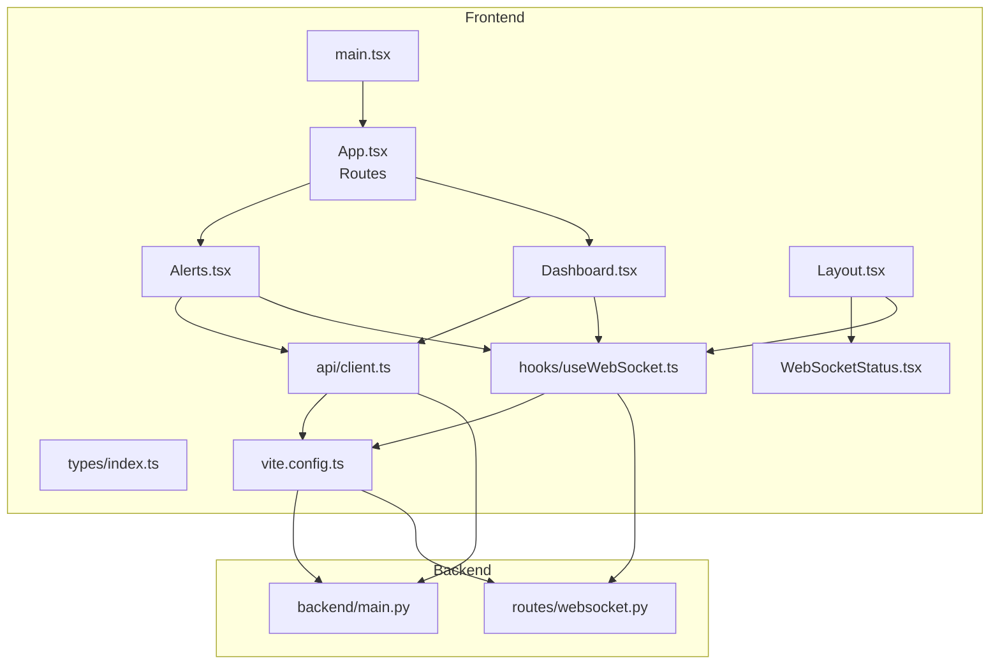
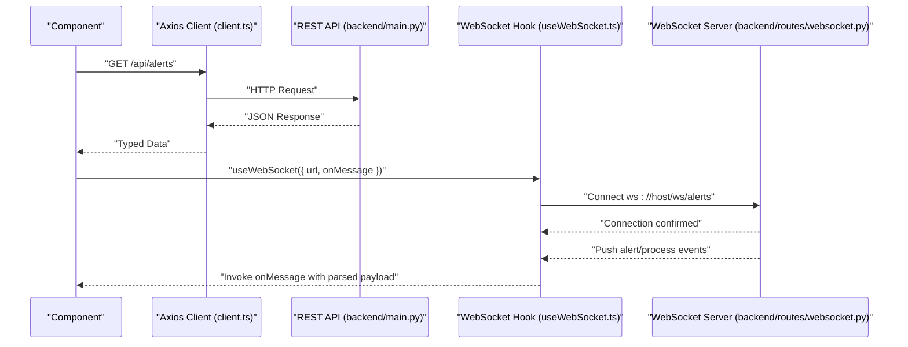
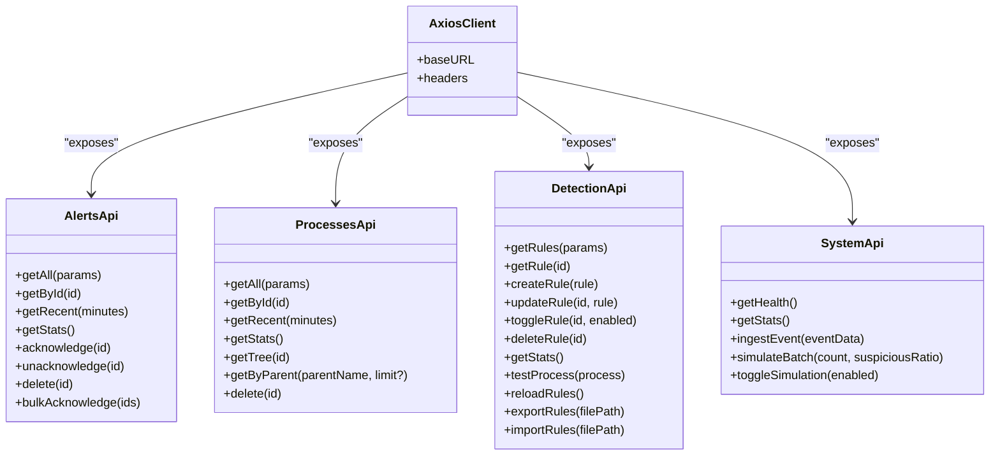
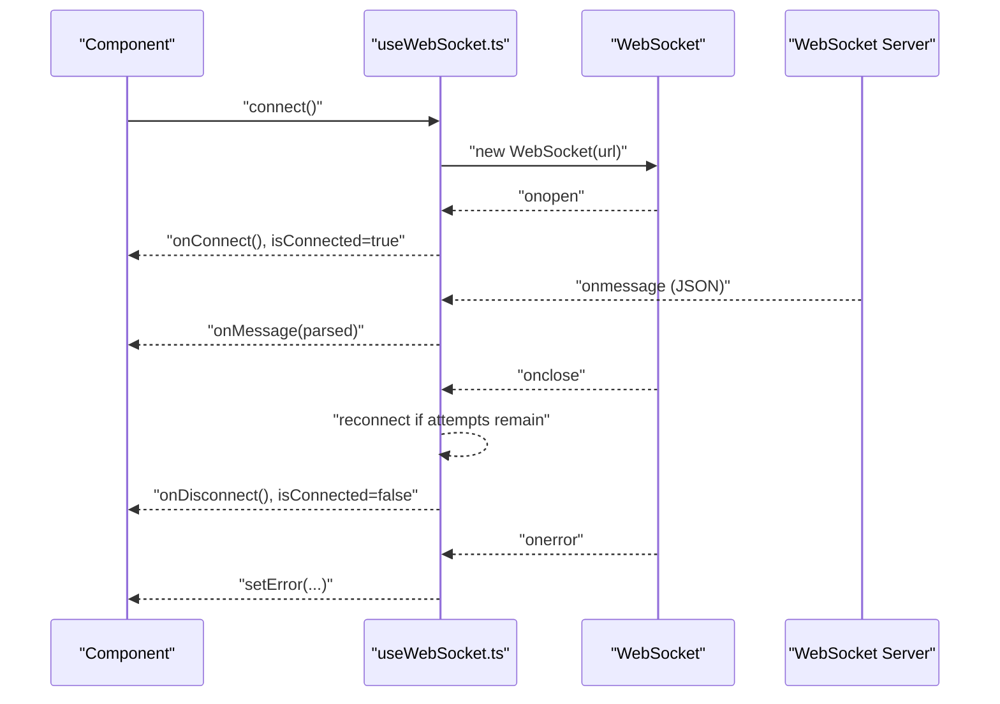
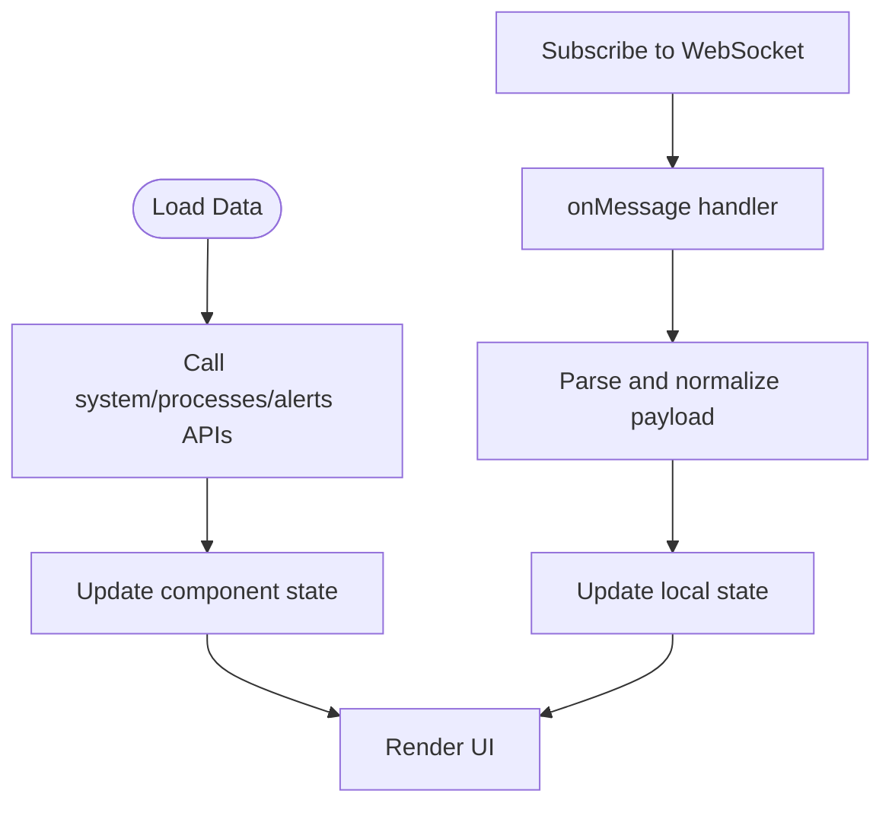
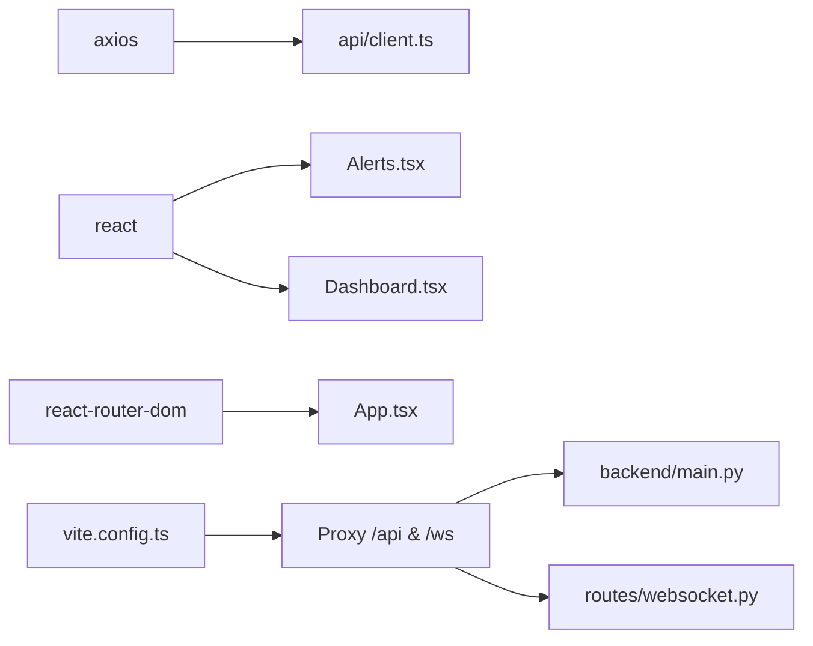

# API Client Integration

<cite>
**Referenced Files in This Document**
- [client.ts](file://frontend/src/api/client.ts)
- [useWebSocket.ts](file://frontend/src/hooks/useWebSocket.ts)
- [index.ts](file://frontend/src/types/index.ts)
- [Alerts.tsx](file://frontend/src/pages/Alerts.tsx)
- [Dashboard.tsx](file://frontend/src/pages/Dashboard.tsx)
- [Layout.tsx](file://frontend/src/components/Layout.tsx)
- [WebSocketStatus.tsx](file://frontend/src/components/WebSocketStatus.tsx)
- [AlertCard.tsx](file://frontend/src/components/AlertCard.tsx)
- [main.tsx](file://frontend/src/main.tsx)
- [vite.config.ts](file://frontend/vite.config.ts)
- [package.json](file://frontend/package.json)
- [main.py](file://backend/main.py)
- [websocket.py](file://backend/routes/websocket.py)
</cite>

## Table of Contents
1. [Introduction](#introduction)
2. [Project Structure](#project-structure)
3. [Core Components](#core-components)
4. [Architecture Overview](#architecture-overview)
5. [Detailed Component Analysis](#detailed-component-analysis)
6. [Dependency Analysis](#dependency-analysis)
7. [Performance Considerations](#performance-considerations)
8. [Troubleshooting Guide](#troubleshooting-guide)
9. [Conclusion](#conclusion)
10. [Appendices](#appendices)

## Introduction
This document explains EDR Lite’s frontend API integration patterns with a focus on:
- HTTP client configuration and endpoint grouping
- Real-time communication via WebSocket
- Data transformation and state synchronization
- Error handling, loading states, and retry strategies
- Extension guidelines for adding new endpoints and implementing optimistic updates
- Performance optimization, caching, offline handling, API versioning, throttling, and security considerations

## Project Structure
The frontend integrates with a FastAPI backend through:
- An Axios-based HTTP client that groups endpoints by domain (alerts, processes, detection, system)
- A reusable WebSocket hook for live updates
- Strongly typed models shared between frontend and backend
- Vite proxy configuration to route API and WebSocket traffic to the backend

**Diagram sources**
- [main.tsx:1-13](file://frontend/src/main.tsx#L1-L13)
- [Alerts.tsx:1-242](file://frontend/src/pages/Alerts.tsx#L1-L242)
- [Dashboard.tsx:1-208](file://frontend/src/pages/Dashboard.tsx#L1-L208)
- [Layout.tsx:1-110](file://frontend/src/components/Layout.tsx#L1-L110)
- [WebSocketStatus.tsx:1-24](file://frontend/src/components/WebSocketStatus.tsx#L1-L24)
- [client.ts:1-124](file://frontend/src/api/client.ts#L1-L124)
- [useWebSocket.ts:1-103](file://frontend/src/hooks/useWebSocket.ts#L1-L103)
- [index.ts:1-83](file://frontend/src/types/index.ts#L1-L83)
- [vite.config.ts:1-25](file://frontend/vite.config.ts#L1-L25)
- [main.py:1-705](file://backend/main.py#L1-L705)
- [websocket.py:1-233](file://backend/routes/websocket.py#L1-L233)

**Section sources**
- [main.tsx:1-13](file://frontend/src/main.tsx#L1-L13)
- [vite.config.ts:1-25](file://frontend/vite.config.ts#L1-L25)

## Core Components
- HTTP client and endpoint groups:
  - Base URL resolution from environment variable
  - Endpoint groups for alerts, processes, detection, and system
  - Strong typing via TypeScript interfaces
- WebSocket hook:
  - Automatic connection with protocol detection
  - Configurable reconnection attempts and intervals
  - Message parsing and error handling
- Shared types:
  - Interfaces for alerts, processes, detection rules, system stats, and WebSocket messages

Key implementation references:
- HTTP client and endpoint groups: [client.ts:1-124](file://frontend/src/api/client.ts#L1-L124)
- WebSocket hook: [useWebSocket.ts:1-103](file://frontend/src/hooks/useWebSocket.ts#L1-L103)
- Shared types: [index.ts:1-83](file://frontend/src/types/index.ts#L1-L83)

**Section sources**
- [client.ts:1-124](file://frontend/src/api/client.ts#L1-L124)
- [useWebSocket.ts:1-103](file://frontend/src/hooks/useWebSocket.ts#L1-L103)
- [index.ts:1-83](file://frontend/src/types/index.ts#L1-L83)

## Architecture Overview
The frontend uses Axios for REST and a custom WebSocket hook for real-time updates. Vite proxies requests to the backend during development.

**Diagram sources**
- [client.ts:14-38](file://frontend/src/api/client.ts#L14-L38)
- [main.py:226-241](file://backend/main.py#L226-L241)
- [useWebSocket.ts:27-72](file://frontend/src/hooks/useWebSocket.ts#L27-L72)
- [websocket.py:68-118](file://backend/routes/websocket.py#L68-L118)

## Detailed Component Analysis

### HTTP Client Configuration and Endpoint Groups
- Base URL:
  - Resolved from environment variable for flexibility across environments
- Headers:
  - JSON content type configured globally
- Endpoint groups:
  - Alerts: listing, retrieval, recent, stats, acknowledgment toggles, deletion, bulk operations
  - Processes: listing, retrieval, recent, stats, tree, parent lookup, deletion
  - Detection: CRUD for rules, stats, testing, reload, export/import
  - System: health, stats, event ingestion, simulation controls

**Diagram sources**
- [client.ts:6-11](file://frontend/src/api/client.ts#L6-L11)
- [client.ts:14-38](file://frontend/src/api/client.ts#L14-L38)
- [client.ts:41-62](file://frontend/src/api/client.ts#L41-L62)
- [client.ts:65-104](file://frontend/src/api/client.ts#L65-L104)
- [client.ts:107-122](file://frontend/src/api/client.ts#L107-L122)

Implementation highlights:
- Environment-driven base URL ensures portability across dev, staging, and prod
- Each group encapsulates related endpoints for discoverability and maintainability
- Strong typing improves developer experience and reduces runtime errors

**Section sources**
- [client.ts:4-11](file://frontend/src/api/client.ts#L4-L11)
- [client.ts:14-122](file://frontend/src/api/client.ts#L14-L122)

### Real-Time Communication with useWebSocket Hook
The hook manages WebSocket lifecycle, message parsing, and reconnection logic.

Key behaviors:
- Protocol detection (wss vs ws) based on current page protocol
- Reconnection loop with configurable interval and attempts
- Safe JSON parsing and error logging
- Controlled send and close operations

**Diagram sources**
- [useWebSocket.ts:27-72](file://frontend/src/hooks/useWebSocket.ts#L27-L72)
- [useWebSocket.ts:74-89](file://frontend/src/hooks/useWebSocket.ts#L74-L89)
- [websocket.py:68-118](file://backend/routes/websocket.py#L68-L118)

**Section sources**
- [useWebSocket.ts:1-103](file://frontend/src/hooks/useWebSocket.ts#L1-L103)

### Data Transformation and State Synchronization
- Alerts page:
  - Loads paginated alerts with filters and updates totals
  - Receives live alerts via WebSocket and prepends them
  - Updates acknowledged state optimistically after API responses
- Dashboard:
  - Concurrently loads stats, recent alerts, and recent processes
  - Updates recent lists on live events
  - Polls periodically for periodic refresh

**Diagram sources**
- [Alerts.tsx:21-62](file://frontend/src/pages/Alerts.tsx#L21-L62)
- [Alerts.tsx:48-53](file://frontend/src/pages/Alerts.tsx#L48-L53)
- [Dashboard.tsx:25-43](file://frontend/src/pages/Dashboard.tsx#L25-L43)
- [Dashboard.tsx:46-52](file://frontend/src/pages/Dashboard.tsx#L46-L52)

**Section sources**
- [Alerts.tsx:1-242](file://frontend/src/pages/Alerts.tsx#L1-L242)
- [Dashboard.tsx:1-208](file://frontend/src/pages/Dashboard.tsx#L1-L208)

### Error Handling, Loading States, and Retry Strategies
- HTTP errors:
  - Try/catch around API calls; errors logged to console
  - Loading flags prevent concurrent operations and improve UX
- WebSocket errors:
  - Dedicated error state and console logging
  - Reconnection attempts with exponential backoff concept (configurable interval)
- Retry strategies:
  - Manual retry via refresh buttons
  - Periodic polling for dashboard data refresh

Recommendations:
- Surface user-friendly notifications for persistent failures
- Implement request deduplication to avoid redundant network calls
- Add circuit breaker logic for failing endpoints

**Section sources**
- [Alerts.tsx:21-45](file://frontend/src/pages/Alerts.tsx#L21-L45)
- [Dashboard.tsx:25-43](file://frontend/src/pages/Dashboard.tsx#L25-L43)
- [useWebSocket.ts:55-58](file://frontend/src/hooks/useWebSocket.ts#L55-L58)
- [useWebSocket.ts:46-52](file://frontend/src/hooks/useWebSocket.ts#L46-L52)

### Extending API Functionality and Adding New Endpoints
Guidelines:
- Define endpoint group in the HTTP client with strongly typed parameters and responses
- Add corresponding TypeScript interfaces in shared types
- Consume the new endpoint in components with proper error handling and loading states
- For WebSocket updates, extend message types and handle them in onMessage callbacks

Example extension points:
- New domain-specific endpoints in the HTTP client
- Additional WebSocket channels or message types in the hook and backend

**Section sources**
- [client.ts:1-124](file://frontend/src/api/client.ts#L1-L124)
- [index.ts:1-83](file://frontend/src/types/index.ts#L1-L83)
- [useWebSocket.ts:1-103](file://frontend/src/hooks/useWebSocket.ts#L1-L103)
- [websocket.py:169-206](file://backend/routes/websocket.py#L169-L206)

### Optimistic Updates
Patterns demonstrated:
- Immediately update UI upon acknowledgment or deletion
- Revert or reconcile on API failure
- Append new items from WebSocket events to the top of lists

Best practices:
- Keep a pending queue for batch operations
- Use rollback strategies for failed mutations
- Debounce frequent updates to reduce render churn

**Section sources**
- [Alerts.tsx:64-99](file://frontend/src/pages/Alerts.tsx#L64-L99)
- [Alerts.tsx:48-53](file://frontend/src/pages/Alerts.tsx#L48-L53)
- [Dashboard.tsx:46-52](file://frontend/src/pages/Dashboard.tsx#L46-L52)

## Dependency Analysis
- Frontend depends on:
  - Axios for HTTP
  - React and React Router for routing
  - Vite for dev/proxy and build
- Backend exposes:
  - REST endpoints and WebSocket routes
- Proxy configuration:
  - API and WebSocket paths are proxied to the backend server

**Diagram sources**
- [package.json:5-13](file://frontend/package.json#L5-L13)
- [vite.config.ts:14-23](file://frontend/vite.config.ts#L14-L23)
- [main.py:188-192](file://backend/main.py#L188-L192)
- [websocket.py:12-14](file://backend/routes/websocket.py#L12-L14)

**Section sources**
- [package.json:1-46](file://frontend/package.json#L1-L46)
- [vite.config.ts:1-25](file://frontend/vite.config.ts#L1-L25)

## Performance Considerations
- Network efficiency:
  - Use pagination and filtering to limit payload sizes
  - Batch operations where possible (bulk acknowledge)
- Rendering:
  - Virtualize long lists
  - Memoize derived data and avoid unnecessary re-renders
- Caching:
  - Implement in-memory cache for repeated reads of static data
  - Use stale-while-revalidate for frequently accessed resources
- Offline handling:
  - Queue actions locally and replay on reconnection
  - Show cached data with “offline” indicators
- Throttling:
  - Debounce rapid UI triggers (filters, search)
  - Limit polling frequency for non-critical data
- Versioning:
  - Use API version prefixes (e.g., /api/v1) to manage breaking changes
- Security:
  - Enforce HTTPS in production
  - Sanitize inputs and validate payloads
  - Rotate tokens and enforce short-lived sessions

[No sources needed since this section provides general guidance]

## Troubleshooting Guide
Common issues and resolutions:
- API not reachable:
  - Verify Vite proxy targets and backend port
  - Confirm environment variable for base URL is set
- WebSocket disconnections:
  - Check server logs for exceptions
  - Adjust reconnection interval and attempts
- Type mismatches:
  - Align frontend types with backend schemas
  - Validate JSON payloads before parsing
- UI not updating:
  - Ensure state updates occur after successful API responses
  - Confirm WebSocket message types match expectations

**Section sources**
- [vite.config.ts:12-24](file://frontend/vite.config.ts#L12-L24)
- [client.ts:4-11](file://frontend/src/api/client.ts#L4-L11)
- [useWebSocket.ts:55-58](file://frontend/src/hooks/useWebSocket.ts#L55-L58)
- [index.ts:1-83](file://frontend/src/types/index.ts#L1-L83)

## Conclusion
EDR Lite’s frontend integrates REST and WebSocket APIs through a clean, typed HTTP client and a robust WebSocket hook. The architecture supports real-time updates, efficient data fetching, and scalable extension. By following the outlined patterns and best practices, teams can reliably add new endpoints, optimize performance, and enhance resilience.

[No sources needed since this section summarizes without analyzing specific files]

## Appendices

### API Endpoint Reference (Selected)
- Alerts
  - GET /api/alerts
  - GET /api/alerts/:id
  - GET /api/alerts/recent
  - GET /api/alerts/stats
  - POST /api/alerts/:id/acknowledge
  - POST /api/alerts/:id/unacknowledge
  - DELETE /api/alerts/:id
  - POST /api/alerts/bulk/acknowledge
- Processes
  - GET /api/processes
  - GET /api/processes/:id
  - GET /api/processes/recent
  - GET /api/processes/stats
  - GET /api/processes/:id/tree
  - GET /api/processes/by-parent/:parentName
  - DELETE /api/processes/:id
- Detection Rules
  - GET /api/detection/rules
  - GET /api/detection/rules/:id
  - POST /api/detection/rules
  - PUT /api/detection/rules/:id
  - POST /api/detection/rules/:id/toggle
  - DELETE /api/detection/rules/:id
  - GET /api/detection/stats
  - POST /api/detection/test
  - POST /api/detection/reload
  - POST /api/detection/export
  - POST /api/detection/import
- System
  - GET /health
  - GET /api/stats
  - POST /api/ingest
  - POST /api/simulate/batch
  - POST /api/simulation/toggle

**Section sources**
- [client.ts:14-122](file://frontend/src/api/client.ts#L14-L122)
- [main.py:226-358](file://backend/main.py#L226-L358)

### WebSocket Message Types
- Connection lifecycle: connection, heartbeat
- Live events: alert, process_event
- Stats: stats_update
- Errors: error

**Section sources**
- [index.ts:78-83](file://frontend/src/types/index.ts#L78-L83)
- [websocket.py:209-233](file://backend/routes/websocket.py#L209-L233)