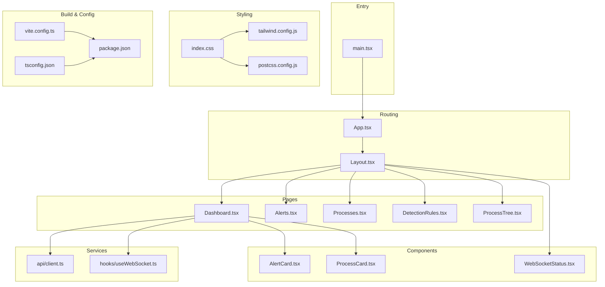
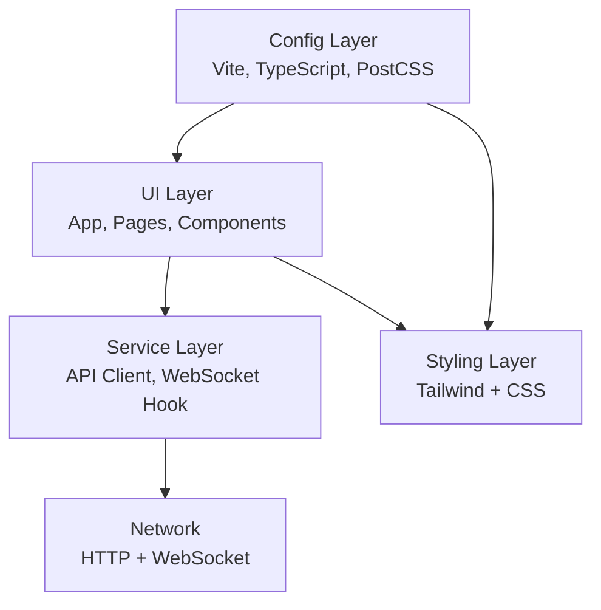
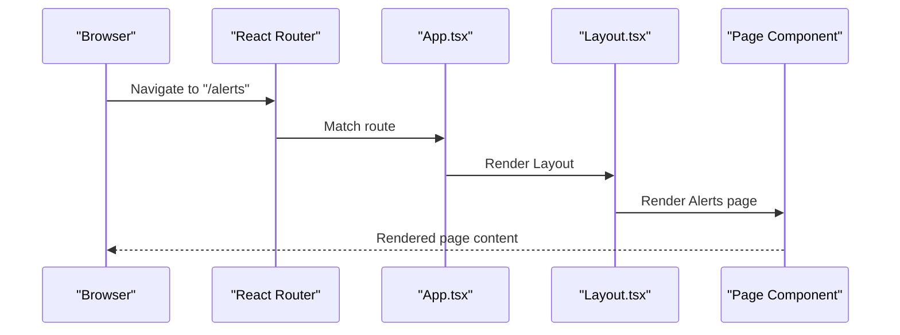
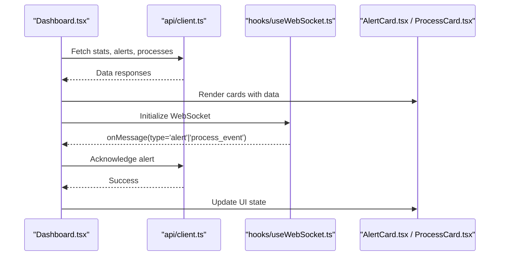
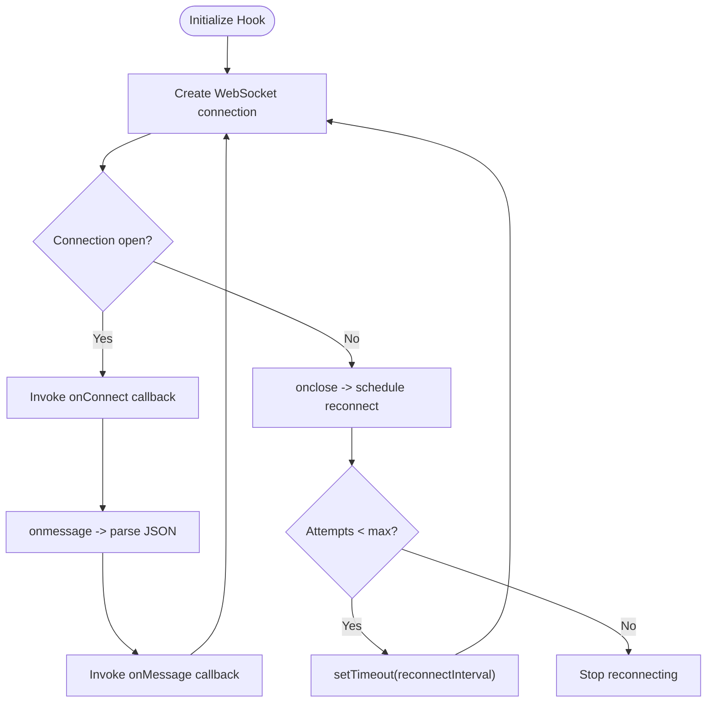
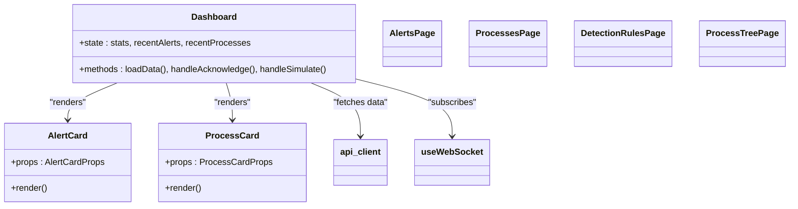
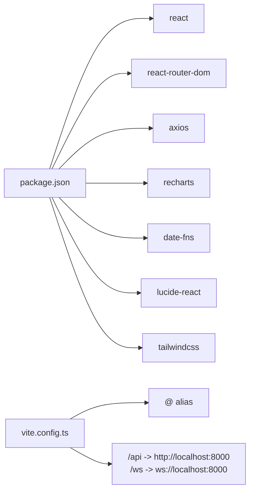

# Application Structure

<cite>
**Referenced Files in This Document**
- [main.tsx](file://frontend/src/main.tsx)
- [App.tsx](file://frontend/src/App.tsx)
- [Layout.tsx](file://frontend/src/components/Layout.tsx)
- [Dashboard.tsx](file://frontend/src/pages/Dashboard.tsx)
- [client.ts](file://frontend/src/api/client.ts)
- [useWebSocket.ts](file://frontend/src/hooks/useWebSocket.ts)
- [index.css](file://frontend/src/index.css)
- [tailwind.config.js](file://frontend/tailwind.config.js)
- [postcss.config.js](file://frontend/postcss.config.js)
- [vite.config.ts](file://frontend/vite.config.ts)
- [tsconfig.json](file://frontend/tsconfig.json)
- [package.json](file://frontend/package.json)
- [index.tsx](file://frontend/src/index.tsx)
- [AlertCard.tsx](file://frontend/src/components/AlertCard.tsx)
- [ProcessCard.tsx](file://frontend/src/components/ProcessCard.tsx)
- [index.ts](file://frontend/src/types/index.ts)
</cite>

## Table of Contents
1. [Introduction](#introduction)
2. [Project Structure](#project-structure)
3. [Core Components](#core-components)
4. [Architecture Overview](#architecture-overview)
5. [Detailed Component Analysis](#detailed-component-analysis)
6. [Dependency Analysis](#dependency-analysis)
7. [Performance Considerations](#performance-considerations)
8. [Troubleshooting Guide](#troubleshooting-guide)
9. [Conclusion](#conclusion)
10. [Appendices](#appendices)

## Introduction
This document explains the frontend architecture of EDR Lite’s React application. It covers the component hierarchy starting from the root entry point, routing configuration with React Router, the Layout wrapper, page organization, and the CSS/Tailwind architecture. It also documents TypeScript and Vite configuration, the development workflow, and practical guidelines for adding new pages, maintaining consistent styling, and optimizing bundle size.

## Project Structure
The frontend is organized around a clear separation of concerns:
- Entry point initializes the React app, wraps it in a router, and applies global styles.
- App defines top-level routes and renders the Layout wrapper.
- Layout provides a responsive sidebar, mobile header, and page container while hosting a WebSocket status indicator.
- Pages implement domain-specific views and orchestrate data fetching via an API client and WebSocket hooks.
- Components encapsulate reusable UI elements with consistent styling.
- Types define shared interfaces for alerts, processes, detection rules, and WebSocket messages.
- Build and styling are configured via Vite, TypeScript, Tailwind CSS, and PostCSS.

**Diagram sources**
- [main.tsx:1-13](file://frontend/src/main.tsx#L1-L13)
- [App.tsx:1-23](file://frontend/src/App.tsx#L1-L23)
- [Layout.tsx:1-110](file://frontend/src/components/Layout.tsx#L1-L110)
- [Dashboard.tsx:1-208](file://frontend/src/pages/Dashboard.tsx#L1-L208)
- [AlertCard.tsx:1-69](file://frontend/src/components/AlertCard.tsx#L1-L69)
- [ProcessCard.tsx:1-57](file://frontend/src/components/ProcessCard.tsx#L1-L57)
- [client.ts:1-124](file://frontend/src/api/client.ts#L1-L124)
- [useWebSocket.ts:1-103](file://frontend/src/hooks/useWebSocket.ts#L1-L103)
- [index.css:1-96](file://frontend/src/index.css#L1-L96)
- [tailwind.config.js:1-45](file://frontend/tailwind.config.js#L1-L45)
- [postcss.config.js:1-6](file://frontend/postcss.config.js#L1-L6)
- [vite.config.ts:1-25](file://frontend/vite.config.ts#L1-L25)
- [tsconfig.json:1-25](file://frontend/tsconfig.json#L1-L25)
- [package.json:1-46](file://frontend/package.json#L1-L46)

**Section sources**
- [main.tsx:1-13](file://frontend/src/main.tsx#L1-L13)
- [App.tsx:1-23](file://frontend/src/App.tsx#L1-L23)
- [Layout.tsx:1-110](file://frontend/src/components/Layout.tsx#L1-L110)
- [Dashboard.tsx:1-208](file://frontend/src/pages/Dashboard.tsx#L1-L208)
- [client.ts:1-124](file://frontend/src/api/client.ts#L1-L124)
- [useWebSocket.ts:1-103](file://frontend/src/hooks/useWebSocket.ts#L1-L103)
- [index.css:1-96](file://frontend/src/index.css#L1-L96)
- [tailwind.config.js:1-45](file://frontend/tailwind.config.js#L1-L45)
- [postcss.config.js:1-6](file://frontend/postcss.config.js#L1-L6)
- [vite.config.ts:1-25](file://frontend/vite.config.ts#L1-L25)
- [tsconfig.json:1-25](file://frontend/tsconfig.json#L1-L25)
- [package.json:1-46](file://frontend/package.json#L1-L46)

## Core Components
- Root entry point: Initializes React, enables strict mode, mounts the router, and renders the App component. It also imports global styles.
- App: Declares top-level routes and renders the Layout wrapper, which provides a consistent shell around pages.
- Layout: Implements a responsive sidebar navigation, mobile header, and page content area. It integrates a WebSocket status indicator and computes active navigation state based on the current route.
- Pages: Each page composes UI components and orchestrates data fetching via the API client and WebSocket hook. The Dashboard demonstrates concurrent data loading, real-time updates, and interactive controls.
- Components: Reusable building blocks such as AlertCard and ProcessCard encapsulate presentation and minor interactions, leveraging shared Tailwind utilities and severity-based styling.
- Services: The API client centralizes HTTP requests to backend endpoints. The WebSocket hook abstracts connection lifecycle, reconnection logic, and message parsing.
- Types: Strongly typed interfaces model backend entities and WebSocket messages, ensuring type safety across the app.

**Section sources**
- [main.tsx:1-13](file://frontend/src/main.tsx#L1-L13)
- [App.tsx:1-23](file://frontend/src/App.tsx#L1-L23)
- [Layout.tsx:1-110](file://frontend/src/components/Layout.tsx#L1-L110)
- [Dashboard.tsx:1-208](file://frontend/src/pages/Dashboard.tsx#L1-L208)
- [AlertCard.tsx:1-69](file://frontend/src/components/AlertCard.tsx#L1-L69)
- [ProcessCard.tsx:1-57](file://frontend/src/components/ProcessCard.tsx#L1-L57)
- [client.ts:1-124](file://frontend/src/api/client.ts#L1-L124)
- [useWebSocket.ts:1-103](file://frontend/src/hooks/useWebSocket.ts#L1-L103)
- [index.ts:1-83](file://frontend/src/types/index.ts#L1-L83)

## Architecture Overview
The application follows a layered architecture:
- Presentation Layer: App and pages render UI and manage local state.
- Composition Layer: Components encapsulate reusable UI and accept props for customization.
- Service Layer: API client and WebSocket hook abstract network concerns.
- Data Contracts: Shared TypeScript interfaces unify data structures across layers.
- Styling Layer: Tailwind CSS with custom theme and PostCSS pipeline.

[No sources needed since this diagram shows conceptual workflow, not actual code structure]

## Detailed Component Analysis

### Routing and Page Organization
- Top-level routes are defined in App, rendering the Layout wrapper and switching between pages.
- The Layout component receives page content as children and manages navigation via Link and useLocation.
- Navigation items are declared centrally and rendered dynamically, enabling consistent updates.

**Diagram sources**
- [App.tsx:1-23](file://frontend/src/App.tsx#L1-L23)
- [Layout.tsx:1-110](file://frontend/src/components/Layout.tsx#L1-L110)

**Section sources**
- [App.tsx:1-23](file://frontend/src/App.tsx#L1-L23)
- [Layout.tsx:1-110](file://frontend/src/components/Layout.tsx#L1-L110)

### Dashboard Page Workflow
The Dashboard coordinates multiple data sources:
- Concurrent loading of stats, recent alerts, and recent processes.
- Real-time updates via WebSocket messages.
- Periodic refresh and manual refresh controls.
- Acknowledging alerts and simulating events.

**Diagram sources**
- [Dashboard.tsx:1-208](file://frontend/src/pages/Dashboard.tsx#L1-L208)
- [client.ts:1-124](file://frontend/src/api/client.ts#L1-L124)
- [useWebSocket.ts:1-103](file://frontend/src/hooks/useWebSocket.ts#L1-L103)
- [AlertCard.tsx:1-69](file://frontend/src/components/AlertCard.tsx#L1-L69)
- [ProcessCard.tsx:1-57](file://frontend/src/components/ProcessCard.tsx#L1-L57)

**Section sources**
- [Dashboard.tsx:1-208](file://frontend/src/pages/Dashboard.tsx#L1-L208)
- [client.ts:1-124](file://frontend/src/api/client.ts#L1-L124)
- [useWebSocket.ts:1-103](file://frontend/src/hooks/useWebSocket.ts#L1-L103)
- [AlertCard.tsx:1-69](file://frontend/src/components/AlertCard.tsx#L1-L69)
- [ProcessCard.tsx:1-57](file://frontend/src/components/ProcessCard.tsx#L1-L57)

### WebSocket Hook Behavior
The WebSocket hook encapsulates connection lifecycle, automatic reconnection, and message handling.

**Diagram sources**
- [useWebSocket.ts:1-103](file://frontend/src/hooks/useWebSocket.ts#L1-L103)

**Section sources**
- [useWebSocket.ts:1-103](file://frontend/src/hooks/useWebSocket.ts#L1-L103)

### Component Composition Patterns
- Props-driven rendering: Components accept typed props and render accordingly.
- Conditional styling: Severity-based classes and dynamic class names adapt visuals.
- Event callbacks: Components expose handlers for parent orchestration (e.g., acknowledging alerts).
- Composition: Pages compose multiple components and services to deliver cohesive views.

**Diagram sources**
- [AlertCard.tsx:1-69](file://frontend/src/components/AlertCard.tsx#L1-L69)
- [ProcessCard.tsx:1-57](file://frontend/src/components/ProcessCard.tsx#L1-L57)
- [Dashboard.tsx:1-208](file://frontend/src/pages/Dashboard.tsx#L1-L208)
- [client.ts:1-124](file://frontend/src/api/client.ts#L1-L124)
- [useWebSocket.ts:1-103](file://frontend/src/hooks/useWebSocket.ts#L1-L103)

**Section sources**
- [AlertCard.tsx:1-69](file://frontend/src/components/AlertCard.tsx#L1-L69)
- [ProcessCard.tsx:1-57](file://frontend/src/components/ProcessCard.tsx#L1-L57)
- [Dashboard.tsx:1-208](file://frontend/src/pages/Dashboard.tsx#L1-L208)

## Dependency Analysis
- Runtime dependencies include React, React Router DOM, Axios, Recharts, date-fns, Lucide icons, and Tailwind CSS.
- Build and dev dependencies include Vite, React plugin, TypeScript, PostCSS, Autoprefixer, and related type packages.
- Aliasing: Vite aliases '@' to the src directory for concise imports.
- Proxying: Vite proxies '/api' and '/ws' to the backend server during development.

**Diagram sources**
- [package.json:1-46](file://frontend/package.json#L1-L46)
- [vite.config.ts:1-25](file://frontend/vite.config.ts#L1-L25)

**Section sources**
- [package.json:1-46](file://frontend/package.json#L1-L46)
- [vite.config.ts:1-25](file://frontend/vite.config.ts#L1-L25)

## Performance Considerations
- Bundle size optimization:
  - Prefer tree-shaking by importing only necessary icons and utilities.
  - Keep component libraries scoped; avoid unused chart or date utilities.
  - Use lazy loading for heavy pages if navigation becomes sluggish.
- Rendering performance:
  - Memoize expensive computations with callbacks and stable references.
  - Limit re-renders by using shallow comparisons and avoiding unnecessary prop drilling.
- Network efficiency:
  - Batch API calls when possible (as seen in concurrent loading).
  - Implement pagination or limits for large datasets.
- Styling efficiency:
  - Leverage Tailwind utilities to minimize custom CSS.
  - Avoid generating dynamic utilities at runtime; predefine variants in the theme.

[No sources needed since this section provides general guidance]

## Troubleshooting Guide
- Routing issues:
  - Ensure routes match the intended paths and that Layout wraps pages correctly.
  - Verify that navigation links use the correct paths and that the active state is computed from the current location.
- WebSocket connectivity:
  - Confirm the WebSocket URL scheme matches the environment (ws/wss).
  - Check that the backend endpoint is reachable and that Vite proxy settings are correct for '/ws'.
- API connectivity:
  - Verify the API base URL and that Vite proxy forwards '/api' to the backend.
  - Inspect response shapes against the typed interfaces to catch mismatches early.
- Styling anomalies:
  - Confirm Tailwind content paths include all source files.
  - Ensure PostCSS plugins are present and Tailwind directives are included in the global stylesheet.

**Section sources**
- [Layout.tsx:1-110](file://frontend/src/components/Layout.tsx#L1-L110)
- [useWebSocket.ts:1-103](file://frontend/src/hooks/useWebSocket.ts#L1-L103)
- [client.ts:1-124](file://frontend/src/api/client.ts#L1-L124)
- [index.css:1-96](file://frontend/src/index.css#L1-L96)
- [tailwind.config.js:1-45](file://frontend/tailwind.config.js#L1-L45)
- [postcss.config.js:1-6](file://frontend/postcss.config.js#L1-L6)
- [vite.config.ts:1-25](file://frontend/vite.config.ts#L1-L25)

## Conclusion
EDR Lite’s frontend employs a clean, modular architecture with a strong separation between routing, layout, pages, components, services, and styling. React Router provides straightforward navigation, while the Layout wrapper ensures consistent UX across pages. The API client and WebSocket hook abstract networking concerns, and Tailwind CSS with a custom theme delivers a cohesive design system. Following the guidelines below will help maintain quality and scalability as the application evolves.

## Appendices

### Adding a New Page
- Create a new page component under the pages directory.
- Import the component in App and add a matching route inside Routes.
- Add a navigation item in the Layout component’s navItems array.
- Implement data fetching using the API client and integrate the WebSocket hook if needed.
- Compose reusable components and apply consistent Tailwind utilities.

**Section sources**
- [App.tsx:1-23](file://frontend/src/App.tsx#L1-L23)
- [Layout.tsx:1-110](file://frontend/src/components/Layout.tsx#L1-L110)
- [client.ts:1-124](file://frontend/src/api/client.ts#L1-L124)
- [useWebSocket.ts:1-103](file://frontend/src/hooks/useWebSocket.ts#L1-L103)

### Maintaining Consistent Styling
- Use the predefined Tailwind utilities and custom components from the global stylesheet.
- Extend the Tailwind theme minimally and keep color tokens consistent.
- Prefer semantic class names and avoid ad-hoc overrides.
- Centralize badge and card styles in the global stylesheet for uniformity.

**Section sources**
- [index.css:1-96](file://frontend/src/index.css#L1-L96)
- [tailwind.config.js:1-45](file://frontend/tailwind.config.js#L1-L45)

### TypeScript and Vite Configuration Highlights
- TypeScript targets modern ES features and uses bundler module resolution.
- Path aliases enable concise imports using '@/'.
- Vite runs a dev server on port 3000 with proxy rules for API and WebSocket traffic.
- Build script compiles TypeScript then bundles assets with Vite.

**Section sources**
- [tsconfig.json:1-25](file://frontend/tsconfig.json#L1-L25)
- [vite.config.ts:1-25](file://frontend/vite.config.ts#L1-L25)
- [package.json:1-46](file://frontend/package.json#L1-L46)