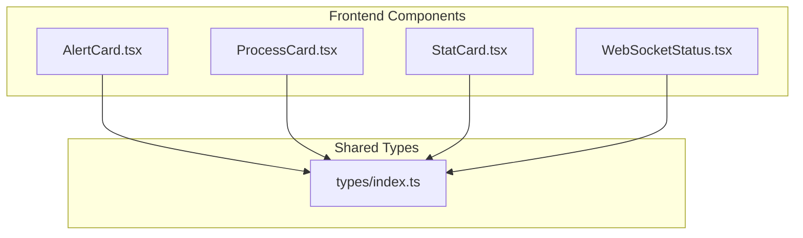
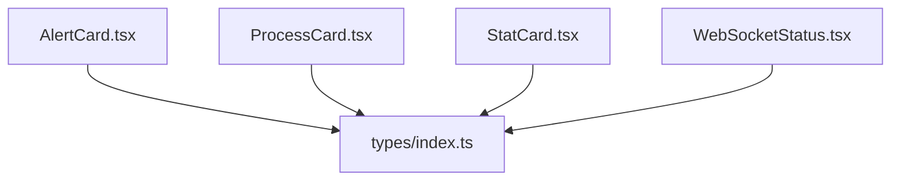
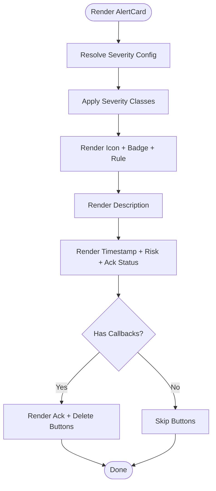
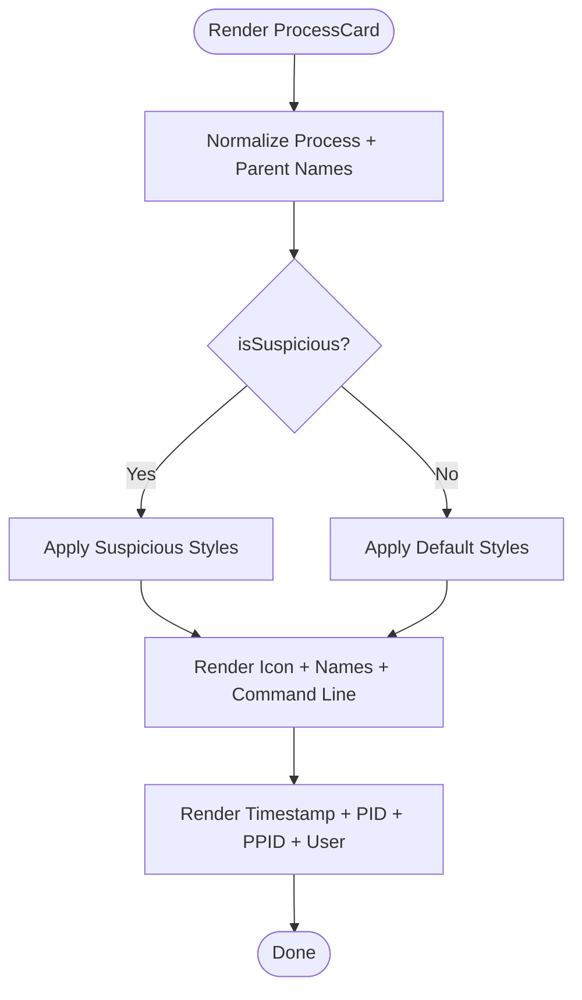
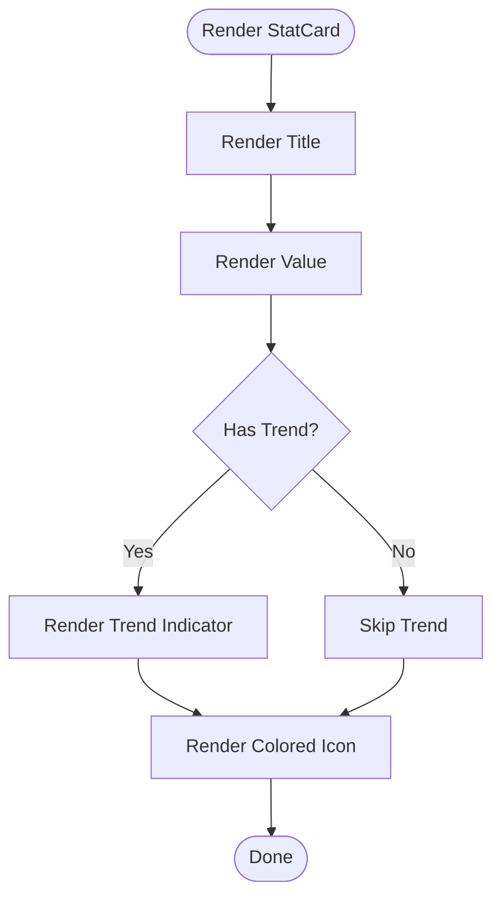
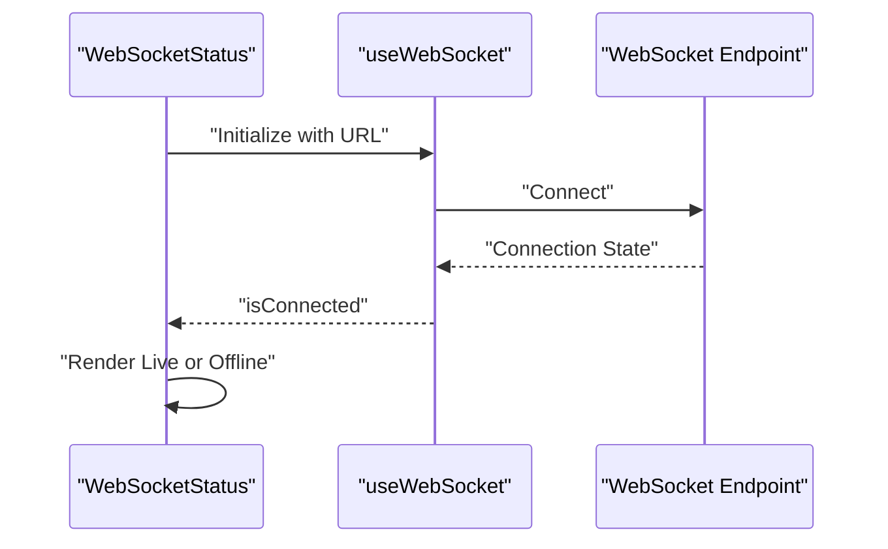

# Dashboard Components

<cite>
**Referenced Files in This Document**
- [AlertCard.tsx](file://frontend/src/components/AlertCard.tsx)
- [ProcessCard.tsx](file://frontend/src/components/ProcessCard.tsx)
- [StatCard.tsx](file://frontend/src/components/StatCard.tsx)
- [WebSocketStatus.tsx](file://frontend/src/components/WebSocketStatus.tsx)
- [index.ts](file://frontend/src/types/index.ts)
</cite>

## Table of Contents
1. [Introduction](#introduction)
2. [Project Structure](#project-structure)
3. [Core Components](#core-components)
4. [Architecture Overview](#architecture-overview)
5. [Detailed Component Analysis](#detailed-component-analysis)
6. [Dependency Analysis](#dependency-analysis)
7. [Performance Considerations](#performance-considerations)
8. [Troubleshooting Guide](#troubleshooting-guide)
9. [Conclusion](#conclusion)
10. [Appendices](#appendices)

## Introduction
This document provides comprehensive documentation for EDR Lite’s core dashboard components. It focuses on four primary UI widgets:
- AlertCard: displays threat notifications with severity indicators, timestamps, and interactive actions.
- ProcessCard: visualizes process events with iconography, suspicious status, and metadata.
- StatCard: presents key metrics and statistics with optional trend indicators and color theming.
- WebSocketStatus: monitors real-time connection health and displays live/offline state.

The guide covers component props, TypeScript interfaces, styling approaches using TailwindCSS, integration patterns, reusability, customization options, and performance considerations. It also outlines usage examples and extension patterns for building additional dashboard widgets.

## Project Structure
The dashboard components reside under the frontend/src/components directory and rely on shared TypeScript interfaces located in frontend/src/types/index.ts. These interfaces define the shape of alert, process, detection rule, system stats, and WebSocket message data used across the UI.

**Diagram sources**
- [AlertCard.tsx:1-69](file://frontend/src/components/AlertCard.tsx#L1-L69)
- [ProcessCard.tsx:1-57](file://frontend/src/components/ProcessCard.tsx#L1-L57)
- [StatCard.tsx:1-41](file://frontend/src/components/StatCard.tsx#L1-L41)
- [WebSocketStatus.tsx:1-24](file://frontend/src/components/WebSocketStatus.tsx#L1-L24)
- [index.ts:1-83](file://frontend/src/types/index.ts#L1-L83)

**Section sources**
- [AlertCard.tsx:1-69](file://frontend/src/components/AlertCard.tsx#L1-L69)
- [ProcessCard.tsx:1-57](file://frontend/src/components/ProcessCard.tsx#L1-L57)
- [StatCard.tsx:1-41](file://frontend/src/components/StatCard.tsx#L1-L41)
- [WebSocketStatus.tsx:1-24](file://frontend/src/components/WebSocketStatus.tsx#L1-L24)
- [index.ts:1-83](file://frontend/src/types/index.ts#L1-L83)

## Core Components
This section documents each component’s purpose, props, rendering logic, styling, and integration points.

### AlertCard
Purpose:
- Renders a single alert with severity-aware styling, timestamp formatting, and action buttons for acknowledgment and deletion.

Props:
- alert: Alert (required)
- onAcknowledge?: (id: number) => void (optional)
- onDelete?: (id: number) => void (optional)

Behavior:
- Severity mapping selects an icon and applies severity-specific styling classes.
- Timestamp is formatted using a date utility for human-readable display.
- Conditional action buttons render only when callbacks are provided and the alert is not acknowledged.

Styling:
- Uses Tailwind utility classes for background, borders, and badges.
- Severity-specific color classes are applied via a configuration mapping.

Accessibility:
- Buttons include hover and focus affordances with clear icons.

Extensibility:
- Add new severity levels by extending the severity configuration mapping.
- Introduce additional actions by adding new optional callbacks and rendering conditions.

**Section sources**
- [AlertCard.tsx:5-9](file://frontend/src/components/AlertCard.tsx#L5-L9)
- [AlertCard.tsx:11-16](file://frontend/src/components/AlertCard.tsx#L11-L16)
- [AlertCard.tsx:18-69](file://frontend/src/components/AlertCard.tsx#L18-L69)
- [index.ts:1-11](file://frontend/src/types/index.ts#L1-L11)

### ProcessCard
Purpose:
- Displays a process event with parent-child relationship visualization, suspicious status highlighting, and metadata.

Props:
- process: Process (required)
- isSuspicious?: boolean (optional, defaults to false)

Behavior:
- Extracts base process and parent names from full paths.
- Applies suspicious styling when flagged.
- Formats timestamp for readability.
- Shows PID, PPID, and optional user information.

Styling:
- Conditional background and border classes based on suspicious flag.
- Consistent iconography and monospace typography for command lines.

Extensibility:
- Add drill-down navigation by wrapping the card in a navigable container.
- Extend metadata display by adding new fields from the Process interface.

**Section sources**
- [ProcessCard.tsx:5-8](file://frontend/src/components/ProcessCard.tsx#L5-L8)
- [ProcessCard.tsx:10-57](file://frontend/src/components/ProcessCard.tsx#L10-L57)
- [index.ts:19-30](file://frontend/src/types/index.ts#L19-L30)

### StatCard
Purpose:
- Presents a metric with a title, value, optional trend indicator, and a colored icon area.

Props:
- title: string (required)
- value: string | number (required)
- icon: LucideIcon (required)
- trend?: { value: number; isPositive: boolean } (optional)
- color?: 'blue' | 'green' | 'yellow' | 'red' | 'purple' (optional, defaults to 'blue')

Behavior:
- Displays a positive or negative trend indicator when provided.
- Applies color classes based on the selected theme.

Styling:
- Uses Tailwind utility classes for background, text, and border colors.

Extensibility:
- Add new color themes by extending the color classes mapping.
- Support additional metric types by adjusting the value prop typing.

**Section sources**
- [StatCard.tsx:3-12](file://frontend/src/components/StatCard.tsx#L3-L12)
- [StatCard.tsx:22-41](file://frontend/src/components/StatCard.tsx#L22-L41)
- [index.ts:61-76](file://frontend/src/types/index.ts#L61-L76)

### WebSocketStatus
Purpose:
- Monitors and visually indicates the current WebSocket connection state for real-time updates.

Props:
- None (uses a hook internally)

Behavior:
- Consumes a WebSocket hook to determine connection status.
- Renders a live indicator when connected, otherwise offline.

Integration:
- Configured to connect to a specific WebSocket endpoint for alerts.

Extensibility:
- Adjust the endpoint by modifying the hook configuration.
- Extend to show connection details (latency, messages/sec) by enhancing the hook.

**Section sources**
- [WebSocketStatus.tsx:4-24](file://frontend/src/components/WebSocketStatus.tsx#L4-L24)

## Architecture Overview
The dashboard components consume strongly typed data from shared interfaces and apply Tailwind-based styling. They are designed for composability and minimal coupling to external systems.

**Diagram sources**
- [AlertCard.tsx:1-69](file://frontend/src/components/AlertCard.tsx#L1-L69)
- [ProcessCard.tsx:1-57](file://frontend/src/components/ProcessCard.tsx#L1-L57)
- [StatCard.tsx:1-41](file://frontend/src/components/StatCard.tsx#L1-L41)
- [WebSocketStatus.tsx:1-24](file://frontend/src/components/WebSocketStatus.tsx#L1-L24)
- [index.ts:1-83](file://frontend/src/types/index.ts#L1-L83)

## Detailed Component Analysis

### AlertCard Analysis
Key implementation patterns:
- Severity-driven rendering via a configuration mapping.
- Optional action handlers for acknowledgment and deletion.
- Timestamp formatting for consistent readability.

**Diagram sources**
- [AlertCard.tsx:18-69](file://frontend/src/components/AlertCard.tsx#L18-L69)
- [AlertCard.tsx:11-16](file://frontend/src/components/AlertCard.tsx#L11-L16)

Props and types:
- Props: alert (Alert), onAcknowledge (optional), onDelete (optional).
- Alert interface fields include severity, timestamp, risk score, and acknowledgment state.

Styling approach:
- Tailwind classes for backgrounds, borders, and badges.
- Severity-specific color utilities.

Customization options:
- Add new severity levels by updating the severity configuration mapping.
- Introduce additional actions by adding new optional callbacks.

**Section sources**
- [AlertCard.tsx:5-9](file://frontend/src/components/AlertCard.tsx#L5-L9)
- [AlertCard.tsx:11-16](file://frontend/src/components/AlertCard.tsx#L11-L16)
- [AlertCard.tsx:18-69](file://frontend/src/components/AlertCard.tsx#L18-L69)
- [index.ts:1-11](file://frontend/src/types/index.ts#L1-L11)

### ProcessCard Analysis
Key implementation patterns:
- Path normalization for process and parent names.
- Suspicious status toggles visual emphasis.
- Metadata display for command line, PID, PPID, and optional user.

**Diagram sources**
- [ProcessCard.tsx:10-57](file://frontend/src/components/ProcessCard.tsx#L10-L57)

Props and types:
- Props: process (Process), isSuspicious (boolean).
- Process interface includes identifiers, names, command line, and optional user/computer.

Styling approach:
- Conditional background/border classes based on suspicious flag.
- Monospace typography for command line readability.

Customization options:
- Add drill-down by wrapping the card in a navigable element.
- Extend metadata by adding new fields from the Process interface.

**Section sources**
- [ProcessCard.tsx:5-8](file://frontend/src/components/ProcessCard.tsx#L5-L8)
- [ProcessCard.tsx:10-57](file://frontend/src/components/ProcessCard.tsx#L10-L57)
- [index.ts:19-30](file://frontend/src/types/index.ts#L19-L30)

### StatCard Analysis
Key implementation patterns:
- Metric presentation with optional trend indicator.
- Color theming via a predefined palette.

**Diagram sources**
- [StatCard.tsx:22-41](file://frontend/src/components/StatCard.tsx#L22-L41)

Props and types:
- Props: title, value, icon, trend (optional), color (optional).
- SystemStats interface provides example metric structures.

Styling approach:
- Tailwind classes for background, text, and border derived from color mapping.

Customization options:
- Add new color themes by extending the color classes mapping.
- Support additional metric types by adjusting the value prop typing.

**Section sources**
- [StatCard.tsx:3-12](file://frontend/src/components/StatCard.tsx#L3-L12)
- [StatCard.tsx:22-41](file://frontend/src/components/StatCard.tsx#L22-L41)
- [index.ts:61-76](file://frontend/src/types/index.ts#L61-L76)

### WebSocketStatus Analysis
Key implementation patterns:
- Consumes a WebSocket hook to determine connection state.
- Visual indicator switches between live and offline states.

**Diagram sources**
- [WebSocketStatus.tsx:4-24](file://frontend/src/components/WebSocketStatus.tsx#L4-L24)

Props and types:
- No props; uses internal hook configuration.

Integration pattern:
- Configured to connect to a specific WebSocket endpoint for alerts.

**Section sources**
- [WebSocketStatus.tsx:4-24](file://frontend/src/components/WebSocketStatus.tsx#L4-L24)

## Dependency Analysis
The components depend on shared TypeScript interfaces and external libraries for icons and date formatting. There are no circular dependencies among the components themselves.

**Diagram sources**
- [AlertCard.tsx:1-69](file://frontend/src/components/AlertCard.tsx#L1-L69)
- [ProcessCard.tsx:1-57](file://frontend/src/components/ProcessCard.tsx#L1-L57)
- [StatCard.tsx:1-41](file://frontend/src/components/StatCard.tsx#L1-L41)
- [WebSocketStatus.tsx:1-24](file://frontend/src/components/WebSocketStatus.tsx#L1-L24)
- [index.ts:1-83](file://frontend/src/types/index.ts#L1-L83)

**Section sources**
- [AlertCard.tsx:1-69](file://frontend/src/components/AlertCard.tsx#L1-L69)
- [ProcessCard.tsx:1-57](file://frontend/src/components/ProcessCard.tsx#L1-L57)
- [StatCard.tsx:1-41](file://frontend/src/components/StatCard.tsx#L1-L41)
- [WebSocketStatus.tsx:1-24](file://frontend/src/components/WebSocketStatus.tsx#L1-L24)
- [index.ts:1-83](file://frontend/src/types/index.ts#L1-L83)

## Performance Considerations
- Prefer memoization for frequently changing props to avoid unnecessary re-renders.
- Use virtualized lists for large datasets (alerts, processes) to reduce DOM nodes.
- Debounce or throttle timestamp updates to minimize re-renders.
- Lazy-load icons and heavy utilities to improve initial load times.
- Avoid inline styles; leverage Tailwind utilities for efficient rendering.

## Troubleshooting Guide
Common issues and resolutions:
- Missing severity classes: Ensure severity configuration includes all supported values from the Alert interface.
- Incorrect timestamps: Verify timestamp formats match expectations and consider timezone handling.
- Action handlers not firing: Confirm optional callback props are provided and correctly bound.
- Suspicious styling not applying: Check the isSuspicious prop and ensure conditional classes are evaluated.

**Section sources**
- [AlertCard.tsx:11-16](file://frontend/src/components/AlertCard.tsx#L11-L16)
- [AlertCard.tsx:47-64](file://frontend/src/components/AlertCard.tsx#L47-L64)
- [ProcessCard.tsx:17-19](file://frontend/src/components/ProcessCard.tsx#L17-L19)
- [index.ts:1-11](file://frontend/src/types/index.ts#L1-L11)

## Conclusion
The dashboard components are modular, type-safe, and styled with TailwindCSS. They provide a solid foundation for displaying alerts, process events, metrics, and connection status. Their design supports easy customization, extensibility, and performance optimization.

## Appendices
Usage examples and extension patterns:
- AlertCard usage:
  - Provide an Alert object and optional onAcknowledge/onDelete handlers.
  - Extend severity support by updating the severity configuration mapping.
- ProcessCard usage:
  - Pass a Process object and set isSuspicious for suspicious events.
  - Add drill-down navigation by wrapping the card in a navigable container.
- StatCard usage:
  - Supply a title, value, and icon; optionally include a trend and color.
  - Add new color themes by extending the color classes mapping.
- WebSocketStatus usage:
  - Configure the hook URL to target the desired WebSocket endpoint.
  - Extend the hook to expose additional connection metrics.

[No sources needed since this section provides general guidance]