# Frontend Architecture

<cite>
**Referenced Files in This Document**
- [App.tsx](file://frontend/src/App.tsx)
- [main.tsx](file://frontend/src/main.tsx)
- [Layout.tsx](file://frontend/src/components/Layout.tsx)
- [AlertCard.tsx](file://frontend/src/components/AlertCard.tsx)
- [ProcessCard.tsx](file://frontend/src/components/ProcessCard.tsx)
- [StatCard.tsx](file://frontend/src/components/StatCard.tsx)
- [WebSocketStatus.tsx](file://frontend/src/components/WebSocketStatus.tsx)
- [useWebSocket.ts](file://frontend/src/hooks/useWebSocket.ts)
- [client.ts](file://frontend/src/api/client.ts)
- [index.ts](file://frontend/src/types/index.ts)
- [Dashboard.tsx](file://frontend/src/pages/Dashboard.tsx)
- [Alerts.tsx](file://frontend/src/pages/Alerts.tsx)
- [Processes.tsx](file://frontend/src/pages/Processes.tsx)
- [ProcessTree.tsx](file://frontend/src/pages/ProcessTree.tsx)
- [DetectionRules.tsx](file://frontend/src/pages/DetectionRules.tsx)
</cite>

## Table of Contents
1. [Introduction](#introduction)
2. [Project Structure](#project-structure)
3. [Core Components](#core-components)
4. [Architecture Overview](#architecture-overview)
5. [Detailed Component Analysis](#detailed-component-analysis)
6. [Dependency Analysis](#dependency-analysis)
7. [Performance Considerations](#performance-considerations)
8. [Troubleshooting Guide](#troubleshooting-guide)
9. [Conclusion](#conclusion)
10. [Appendices](#appendices)

## Introduction
This document describes the frontend architecture of EDR Lite’s React-based dashboard. It covers the component hierarchy, routing, real-time data integration via WebSockets, API client configuration, state management patterns, and responsive design using TailwindCSS. It also documents key components (AlertCard, ProcessCard, StatCard, WebSocketStatus), routing configuration, and provides guidance for extending the dashboard with new visualizations and monitoring capabilities.

## Project Structure
The frontend is organized around a clear separation of concerns:
- Pages: Route handlers that orchestrate data fetching, state, and rendering.
- Components: Reusable UI building blocks for cards, status indicators, and layout.
- Hooks: Custom hooks encapsulating cross-cutting concerns like WebSocket management.
- API: Axios-based client module exporting typed APIs for alerts, processes, detection rules, and system stats.
- Types: Shared TypeScript interfaces for backend models and WebSocket messages.
- Entry: Application bootstrap wiring up routing and mounting the app.

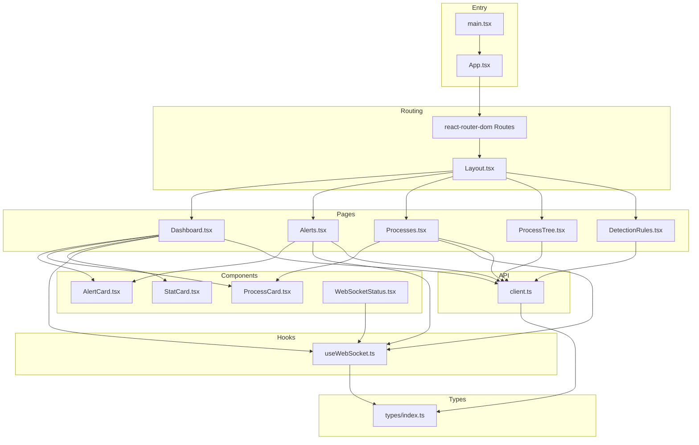

**Diagram sources**
- [main.tsx:1-13](file://frontend/src/main.tsx#L1-L13)
- [App.tsx:1-23](file://frontend/src/App.tsx#L1-L23)
- [Layout.tsx:1-110](file://frontend/src/components/Layout.tsx#L1-L110)
- [Dashboard.tsx:1-208](file://frontend/src/pages/Dashboard.tsx#L1-L208)
- [Alerts.tsx:1-242](file://frontend/src/pages/Alerts.tsx#L1-L242)
- [Processes.tsx:1-136](file://frontend/src/pages/Processes.tsx#L1-L136)
- [ProcessTree.tsx:1-130](file://frontend/src/pages/ProcessTree.tsx#L1-L130)
- [DetectionRules.tsx:1-271](file://frontend/src/pages/DetectionRules.tsx#L1-L271)
- [AlertCard.tsx:1-69](file://frontend/src/components/AlertCard.tsx#L1-L69)
- [ProcessCard.tsx:1-57](file://frontend/src/components/ProcessCard.tsx#L1-L57)
- [StatCard.tsx:1-41](file://frontend/src/components/StatCard.tsx#L1-L41)
- [WebSocketStatus.tsx:1-24](file://frontend/src/components/WebSocketStatus.tsx#L1-L24)
- [useWebSocket.ts:1-103](file://frontend/src/hooks/useWebSocket.ts#L1-L103)
- [client.ts:1-124](file://frontend/src/api/client.ts#L1-L124)
- [index.ts:1-83](file://frontend/src/types/index.ts#L1-L83)

**Section sources**
- [main.tsx:1-13](file://frontend/src/main.tsx#L1-L13)
- [App.tsx:1-23](file://frontend/src/App.tsx#L1-L23)
- [Layout.tsx:18-23](file://frontend/src/components/Layout.tsx#L18-L23)

## Core Components
- Layout: Provides responsive sidebar navigation, mobile header, and page container. Integrates WebSocketStatus at the bottom of the sidebar.
- AlertCard: Renders a single alert with severity-aware styling, timestamp, risk score, acknowledgment state, and action buttons.
- ProcessCard: Displays process creation events with parent-child relationship, command line, timestamps, and optional suspicious highlighting.
- StatCard: Presents KPI-style metrics with icons, trends, and color-coded badges.
- WebSocketStatus: Visual indicator of live connection health for the alerts stream.
- useWebSocket: Hook managing WebSocket lifecycle, reconnection, message parsing, and send utilities.
- API Client: Centralized Axios client exposing typed endpoints for alerts, processes, detection rules, and system stats.

**Section sources**
- [Layout.tsx:25-110](file://frontend/src/components/Layout.tsx#L25-L110)
- [AlertCard.tsx:18-69](file://frontend/src/components/AlertCard.tsx#L18-L69)
- [ProcessCard.tsx:10-57](file://frontend/src/components/ProcessCard.tsx#L10-L57)
- [StatCard.tsx:22-41](file://frontend/src/components/StatCard.tsx#L22-L41)
- [WebSocketStatus.tsx:4-24](file://frontend/src/components/WebSocketStatus.tsx#L4-L24)
- [useWebSocket.ts:13-103](file://frontend/src/hooks/useWebSocket.ts#L13-L103)
- [client.ts:14-124](file://frontend/src/api/client.ts#L14-L124)

## Architecture Overview
The dashboard follows a layered pattern:
- Routing layer: Declares routes and wraps pages in a shared Layout.
- Page layer: Implements page-specific data loading, state, and rendering.
- Component layer: Reusable presentational components with minimal logic.
- Hook layer: Encapsulates WebSocket connectivity and lifecycle.
- API layer: Typed HTTP client with domain-specific namespaces.

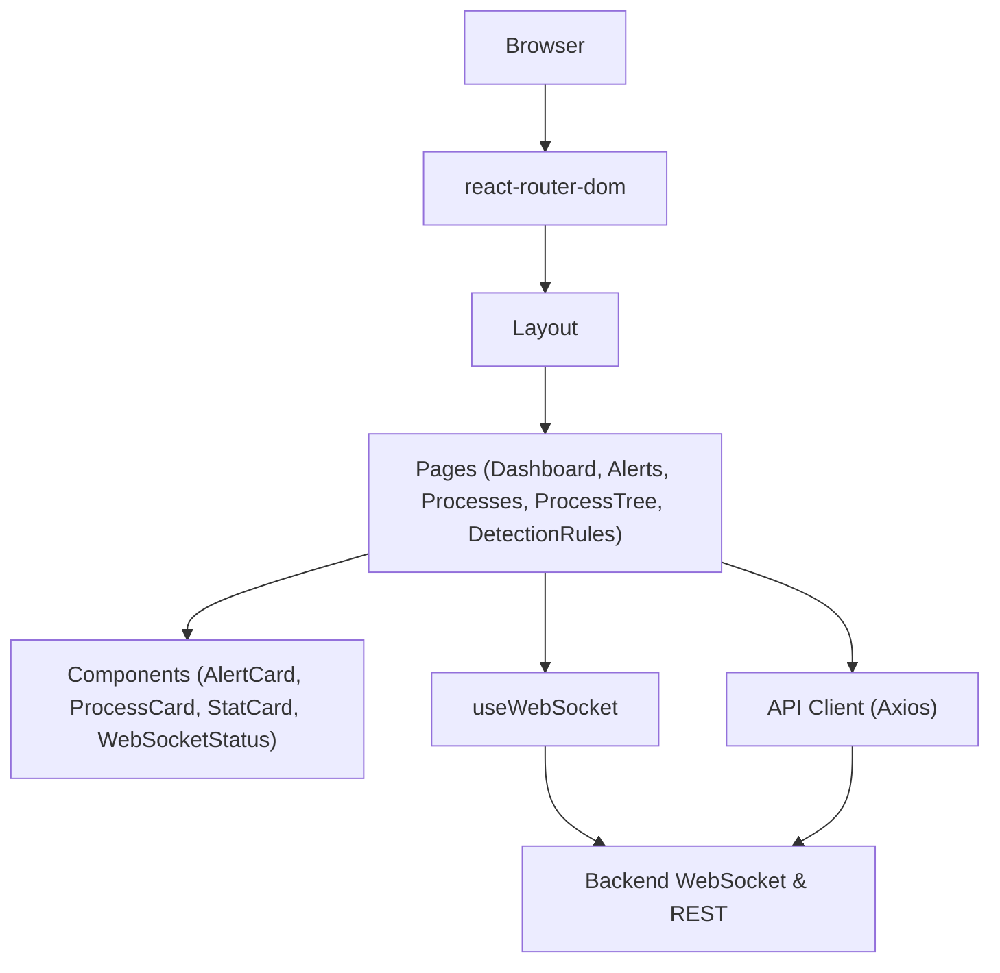

**Diagram sources**
- [App.tsx:1-23](file://frontend/src/App.tsx#L1-L23)
- [Layout.tsx:25-110](file://frontend/src/components/Layout.tsx#L25-L110)
- [Dashboard.tsx:18-208](file://frontend/src/pages/Dashboard.tsx#L18-L208)
- [Alerts.tsx:11-242](file://frontend/src/pages/Alerts.tsx#L11-L242)
- [Processes.tsx:8-136](file://frontend/src/pages/Processes.tsx#L8-L136)
- [ProcessTree.tsx:7-130](file://frontend/src/pages/ProcessTree.tsx#L7-L130)
- [DetectionRules.tsx:6-271](file://frontend/src/pages/DetectionRules.tsx#L6-L271)
- [useWebSocket.ts:13-103](file://frontend/src/hooks/useWebSocket.ts#L13-L103)
- [client.ts:14-124](file://frontend/src/api/client.ts#L14-L124)

## Detailed Component Analysis

### Routing and Navigation
- BrowserRouter is mounted at the root.
- Routes define the application shell with nested Layout.
- Navigation items are defined centrally and rendered in the sidebar with active-state styling.
- WebSocketStatus is embedded in the layout footer for global visibility.

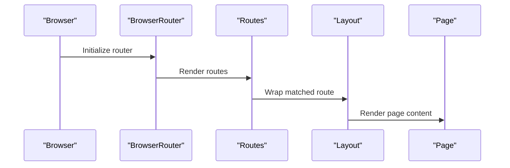

**Diagram sources**
- [main.tsx:7-12](file://frontend/src/main.tsx#L7-L12)
- [App.tsx:9-21](file://frontend/src/App.tsx#L9-L21)
- [Layout.tsx:25-110](file://frontend/src/components/Layout.tsx#L25-L110)

**Section sources**
- [main.tsx:1-13](file://frontend/src/main.tsx#L1-L13)
- [App.tsx:1-23](file://frontend/src/App.tsx#L1-L23)
- [Layout.tsx:18-23](file://frontend/src/components/Layout.tsx#L18-L23)

### Real-Time Data Integration with WebSockets
- useWebSocket manages connection lifecycle, automatic reconnection, and message parsing.
- Pages subscribe to specific channels (alerts and events) and update local state reactively.
- WebSocketStatus provides a global live/offline indicator.

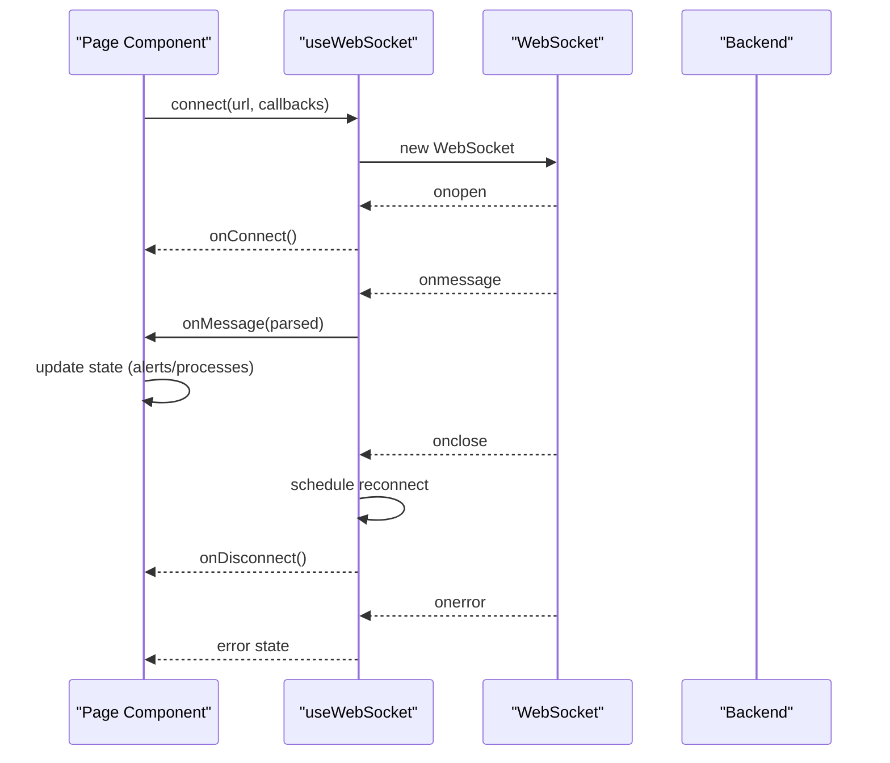

**Diagram sources**
- [useWebSocket.ts:27-72](file://frontend/src/hooks/useWebSocket.ts#L27-L72)
- [useWebSocket.ts:91-94](file://frontend/src/hooks/useWebSocket.ts#L91-L94)
- [Dashboard.tsx:55-58](file://frontend/src/pages/Dashboard.tsx#L55-L58)
- [Alerts.tsx:55-58](file://frontend/src/pages/Alerts.tsx#L55-L58)
- [Processes.tsx:38-41](file://frontend/src/pages/Processes.tsx#L38-L41)
- [WebSocketStatus.tsx:4-7](file://frontend/src/components/WebSocketStatus.tsx#L4-L7)

**Section sources**
- [useWebSocket.ts:13-103](file://frontend/src/hooks/useWebSocket.ts#L13-L103)
- [Dashboard.tsx:45-58](file://frontend/src/pages/Dashboard.tsx#L45-L58)
- [Alerts.tsx:47-58](file://frontend/src/pages/Alerts.tsx#L47-L58)
- [Processes.tsx:31-41](file://frontend/src/pages/Processes.tsx#L31-L41)
- [WebSocketStatus.tsx:4-24](file://frontend/src/components/WebSocketStatus.tsx#L4-L24)

### API Client Configuration and Error Handling
- Axios client configured with base URL from environment and JSON headers.
- Domain-specific namespaces: alertsApi, processesApi, detectionApi, systemApi.
- Error logging to console; callers handle UI feedback and retries.

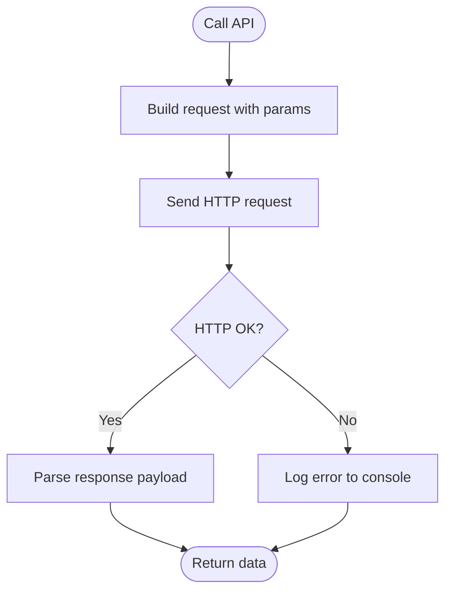

**Diagram sources**
- [client.ts:6-11](file://frontend/src/api/client.ts#L6-L11)
- [client.ts:14-38](file://frontend/src/api/client.ts#L14-L38)
- [client.ts:40-62](file://frontend/src/api/client.ts#L40-L62)
- [client.ts:64-104](file://frontend/src/api/client.ts#L64-L104)
- [client.ts:106-122](file://frontend/src/api/client.ts#L106-L122)

**Section sources**
- [client.ts:1-124](file://frontend/src/api/client.ts#L1-L124)

### Dashboard Page
- Loads system stats, recent alerts, and recent processes concurrently.
- Subscribes to live alert and process events via WebSocket.
- Supports manual refresh and simulated event generation.

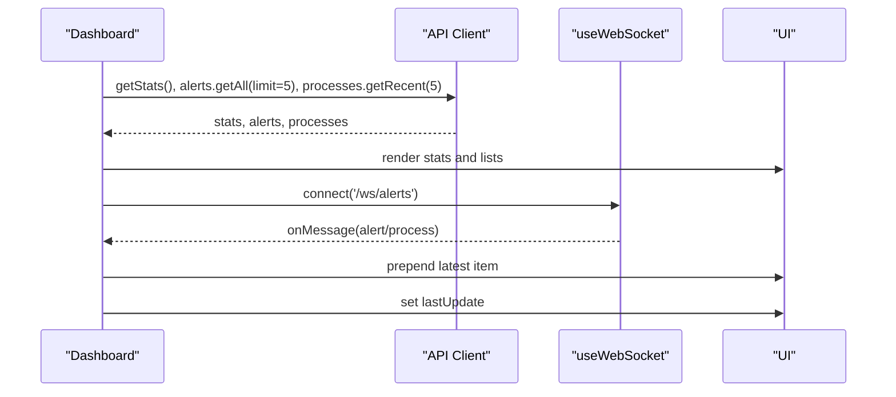

**Diagram sources**
- [Dashboard.tsx:25-43](file://frontend/src/pages/Dashboard.tsx#L25-L43)
- [Dashboard.tsx:45-52](file://frontend/src/pages/Dashboard.tsx#L45-L52)
- [Dashboard.tsx:55-58](file://frontend/src/pages/Dashboard.tsx#L55-L58)
- [Dashboard.tsx:61-65](file://frontend/src/pages/Dashboard.tsx#L61-L65)

**Section sources**
- [Dashboard.tsx:18-208](file://frontend/src/pages/Dashboard.tsx#L18-L208)

### Alerts Page
- Paginated listing with severity and status filters.
- Live updates via WebSocket; acknowledges and deletes individual alerts.
- Bulk acknowledge support.

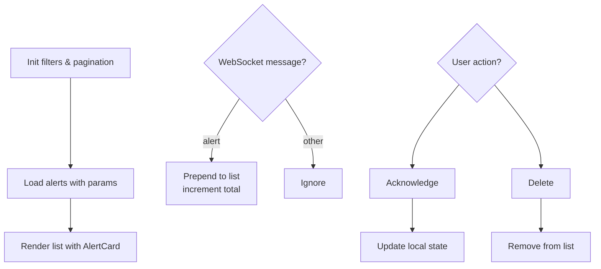

**Diagram sources**
- [Alerts.tsx:21-45](file://frontend/src/pages/Alerts.tsx#L21-L45)
- [Alerts.tsx:47-58](file://frontend/src/pages/Alerts.tsx#L47-L58)
- [Alerts.tsx:64-85](file://frontend/src/pages/Alerts.tsx#L64-L85)
- [Alerts.tsx:87-99](file://frontend/src/pages/Alerts.tsx#L87-L99)

**Section sources**
- [Alerts.tsx:11-242](file://frontend/src/pages/Alerts.tsx#L11-L242)

### Processes Page
- Paginated listing with search; live process events via WebSocket.
- Highlights suspicious processes and displays command lines.

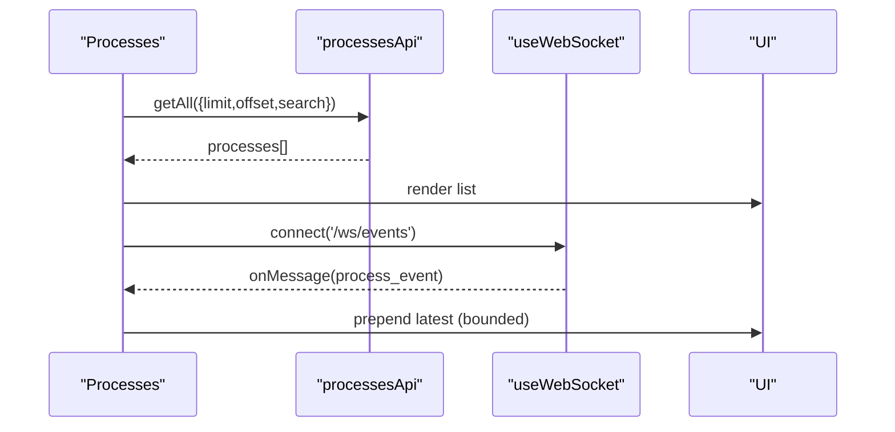

**Diagram sources**
- [Processes.tsx:15-29](file://frontend/src/pages/Processes.tsx#L15-L29)
- [Processes.tsx:31-41](file://frontend/src/pages/Processes.tsx#L31-L41)
- [Processes.tsx:47-51](file://frontend/src/pages/Processes.tsx#L47-L51)

**Section sources**
- [Processes.tsx:8-136](file://frontend/src/pages/Processes.tsx#L8-L136)

### Process Tree Page
- Fetches and renders hierarchical process execution chain.
- Uses recursive rendering for nested children.

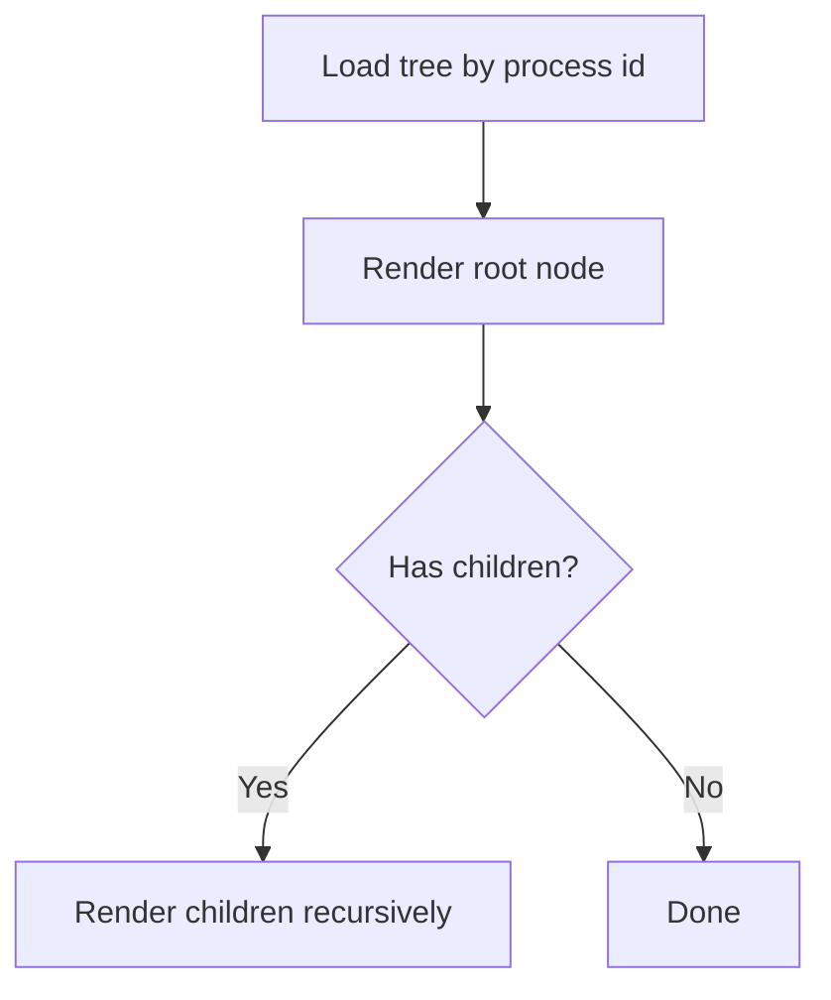

**Diagram sources**
- [ProcessTree.tsx:13-30](file://frontend/src/pages/ProcessTree.tsx#L13-L30)
- [ProcessTree.tsx:32-82](file://frontend/src/pages/ProcessTree.tsx#L32-L82)

**Section sources**
- [ProcessTree.tsx:7-130](file://frontend/src/pages/ProcessTree.tsx#L7-L130)

### Detection Rules Page
- Lists detection rules with enable/disable actions, deletion, and statistics.
- Includes rule testing and modal placeholders for create/edit.

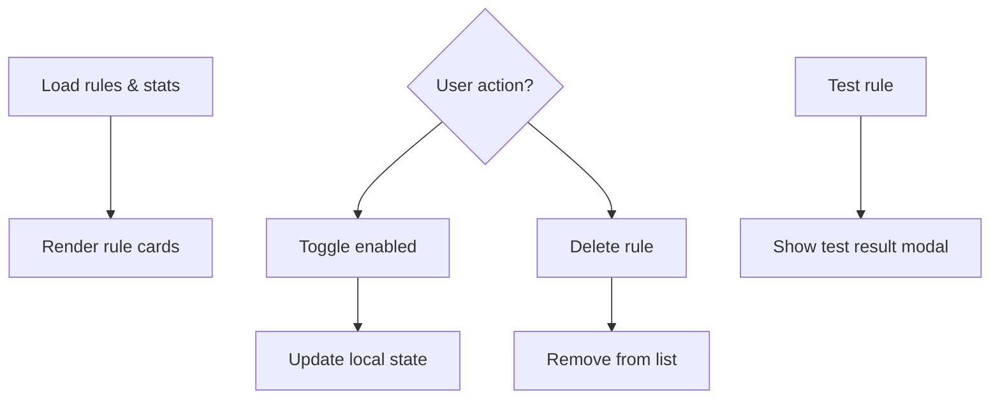

**Diagram sources**
- [DetectionRules.tsx:14-32](file://frontend/src/pages/DetectionRules.tsx#L14-L32)
- [DetectionRules.tsx:34-54](file://frontend/src/pages/DetectionRules.tsx#L34-L54)
- [DetectionRules.tsx:56-67](file://frontend/src/pages/DetectionRules.tsx#L56-L67)

**Section sources**
- [DetectionRules.tsx:6-271](file://frontend/src/pages/DetectionRules.tsx#L6-L271)

### Component Composition Patterns
- Presentational components (AlertCard, ProcessCard, StatCard) receive props and render UI.
- Container components (pages) manage state, fetch data, and pass props down.
- useWebSocket is composed by pages to handle real-time updates without prop drilling.
- Layout composes navigation and WebSocketStatus globally.

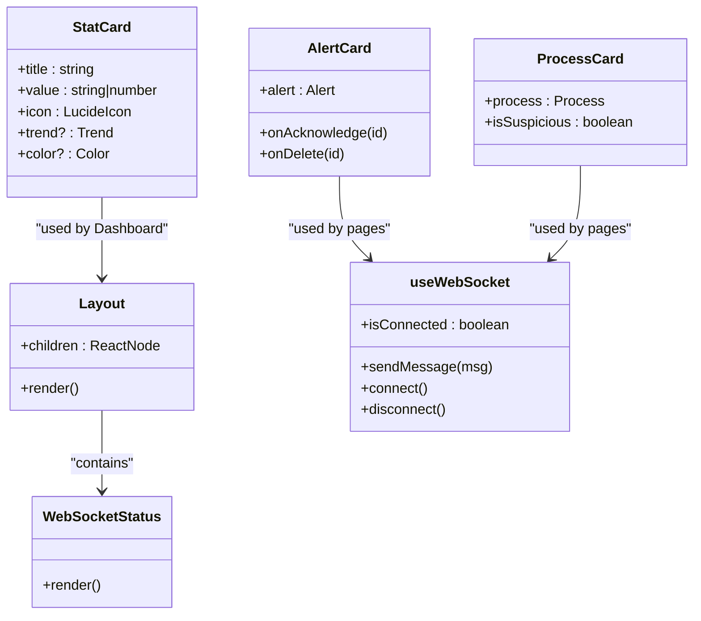

**Diagram sources**
- [Layout.tsx:25-110](file://frontend/src/components/Layout.tsx#L25-L110)
- [WebSocketStatus.tsx:4-24](file://frontend/src/components/WebSocketStatus.tsx#L4-L24)
- [AlertCard.tsx:18-69](file://frontend/src/components/AlertCard.tsx#L18-L69)
- [ProcessCard.tsx:10-57](file://frontend/src/components/ProcessCard.tsx#L10-L57)
- [StatCard.tsx:22-41](file://frontend/src/components/StatCard.tsx#L22-L41)
- [useWebSocket.ts:13-103](file://frontend/src/hooks/useWebSocket.ts#L13-L103)

**Section sources**
- [Layout.tsx:25-110](file://frontend/src/components/Layout.tsx#L25-L110)
- [AlertCard.tsx:18-69](file://frontend/src/components/AlertCard.tsx#L18-L69)
- [ProcessCard.tsx:10-57](file://frontend/src/components/ProcessCard.tsx#L10-L57)
- [StatCard.tsx:22-41](file://frontend/src/components/StatCard.tsx#L22-L41)
- [useWebSocket.ts:13-103](file://frontend/src/hooks/useWebSocket.ts#L13-L103)

### State Management Approaches
- Local component state for UI flags, filters, pagination, and selections.
- React hooks (useState, useEffect, useCallback) manage lifecycle and derived state.
- No external state library is used; local state suffices for current scope.

**Section sources**
- [Dashboard.tsx:18-43](file://frontend/src/pages/Dashboard.tsx#L18-L43)
- [Alerts.tsx:11-45](file://frontend/src/pages/Alerts.tsx#L11-L45)
- [Processes.tsx:8-29](file://frontend/src/pages/Processes.tsx#L8-L29)
- [ProcessTree.tsx:7-30](file://frontend/src/pages/ProcessTree.tsx#L7-L30)
- [DetectionRules.tsx:6-32](file://frontend/src/pages/DetectionRules.tsx#L6-L32)

### Responsive Design with TailwindCSS
- Layout uses responsive classes for sidebar, header, and grid layouts.
- Cards and grids adapt across breakpoints using grid-cols and flex utilities.
- Icons and spacing leverage Tailwind utilities for consistent visuals.

**Section sources**
- [Layout.tsx:30-107](file://frontend/src/components/Layout.tsx#L30-L107)
- [Dashboard.tsx:117-142](file://frontend/src/pages/Dashboard.tsx#L117-L142)
- [Dashboard.tsx:145-205](file://frontend/src/pages/Dashboard.tsx#L145-L205)
- [Alerts.tsx:147-182](file://frontend/src/pages/Alerts.tsx#L147-L182)
- [Processes.tsx:76-92](file://frontend/src/pages/Processes.tsx#L76-L92)

### Prop Drilling Solutions
- useWebSocket encapsulates connection logic, eliminating the need to pass WebSocket instances down multiple component levels.
- Layout centralizes navigation and status, reducing prop needs in pages.
- For future expansion, consider a lightweight context provider scoped to pages that require live updates.

**Section sources**
- [useWebSocket.ts:13-103](file://frontend/src/hooks/useWebSocket.ts#L13-L103)
- [Layout.tsx:25-110](file://frontend/src/components/Layout.tsx#L25-L110)

## Dependency Analysis
- Pages depend on API client and useWebSocket hook.
- Components depend on types and icons; AlertCard and ProcessCard are used by multiple pages.
- Layout depends on WebSocketStatus and navigation items.
- useWebSocket depends on types for message parsing.

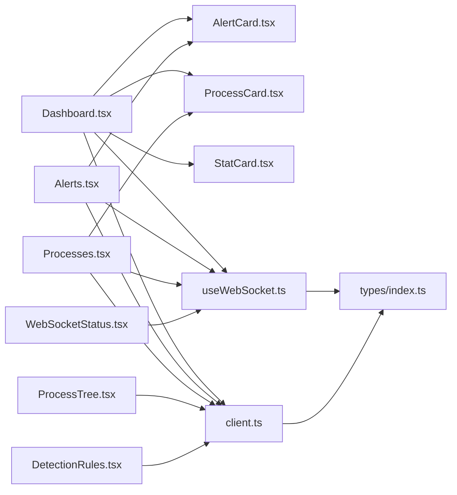

**Diagram sources**
- [Dashboard.tsx:12-16](file://frontend/src/pages/Dashboard.tsx#L12-L16)
- [Alerts.tsx:3-6](file://frontend/src/pages/Alerts.tsx#L3-L6)
- [Processes.tsx:2-6](file://frontend/src/pages/Processes.tsx#L2-L6)
- [ProcessTree.tsx:3-6](file://frontend/src/pages/ProcessTree.tsx#L3-L6)
- [DetectionRules.tsx:2-4](file://frontend/src/pages/DetectionRules.tsx#L2-L4)
- [WebSocketStatus.tsx:2](file://frontend/src/components/WebSocketStatus.tsx#L2)
- [useWebSocket.ts:2](file://frontend/src/hooks/useWebSocket.ts#L2)
- [client.ts:1-2](file://frontend/src/api/client.ts#L1-L2)
- [index.ts:1-83](file://frontend/src/types/index.ts#L1-L83)

**Section sources**
- [Dashboard.tsx:12-16](file://frontend/src/pages/Dashboard.tsx#L12-L16)
- [Alerts.tsx:3-6](file://frontend/src/pages/Alerts.tsx#L3-L6)
- [Processes.tsx:2-6](file://frontend/src/pages/Processes.tsx#L2-L6)
- [ProcessTree.tsx:3-6](file://frontend/src/pages/ProcessTree.tsx#L3-L6)
- [DetectionRules.tsx:2-4](file://frontend/src/pages/DetectionRules.tsx#L2-L4)
- [WebSocketStatus.tsx:2](file://frontend/src/components/WebSocketStatus.tsx#L2)
- [useWebSocket.ts:2](file://frontend/src/hooks/useWebSocket.ts#L2)
- [client.ts:1-2](file://frontend/src/api/client.ts#L1-L2)
- [index.ts:1-83](file://frontend/src/types/index.ts#L1-L83)

## Performance Considerations
- Concurrent data loading reduces initial load time.
- WebSocket updates prepend new items and cap list sizes to keep memory bounded.
- Debounce or throttle frequent UI actions where appropriate.
- Consider virtualizing long lists if pagination becomes insufficient.
- Memoize expensive computations and avoid unnecessary re-renders by keeping payloads small.

[No sources needed since this section provides general guidance]

## Troubleshooting Guide
- WebSocket errors: useWebSocket logs errors and attempts reconnection; check browser console for underlying network issues.
- API failures: API client logs to console; ensure VITE_API_URL is set and reachable.
- UI not updating: verify WebSocket message types and onMessage handlers in pages.
- Pagination issues: confirm limit and offset parameters align with backend expectations.

**Section sources**
- [useWebSocket.ts:55-71](file://frontend/src/hooks/useWebSocket.ts#L55-L71)
- [client.ts:4-11](file://frontend/src/api/client.ts#L4-L11)

## Conclusion
The EDR Lite frontend employs a clean, modular architecture leveraging React hooks, typed APIs, and real-time streaming. The design emphasizes composability, maintainability, and responsiveness, enabling straightforward extension with new visualizations and monitoring capabilities.

[No sources needed since this section summarizes without analyzing specific files]

## Appendices

### Data Models Overview
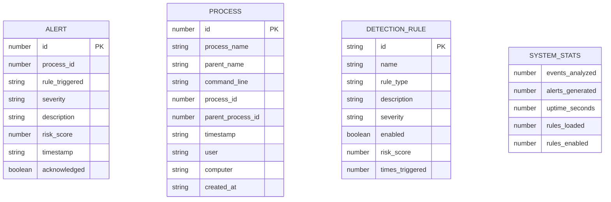

**Diagram sources**
- [index.ts:1-83](file://frontend/src/types/index.ts#L1-L83)