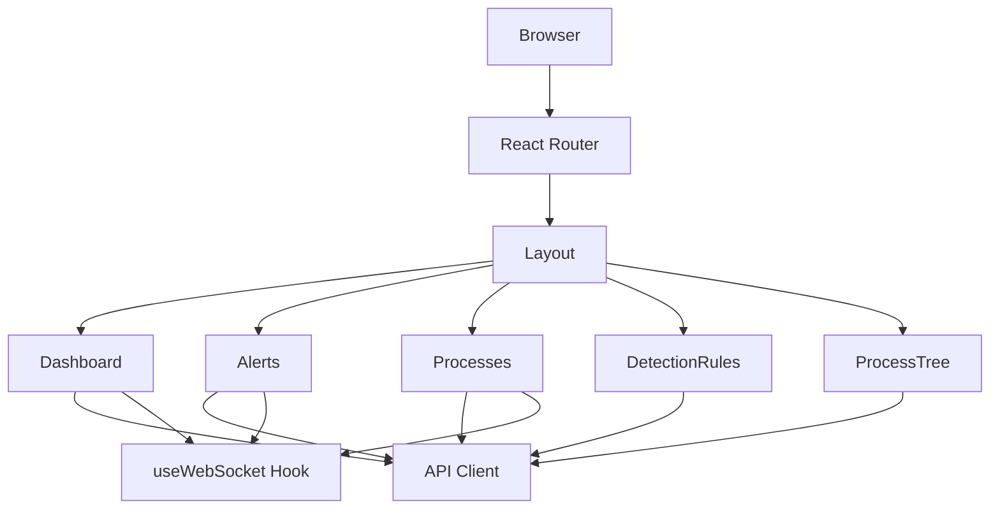
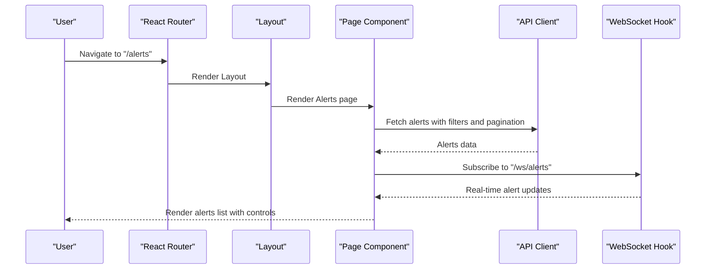
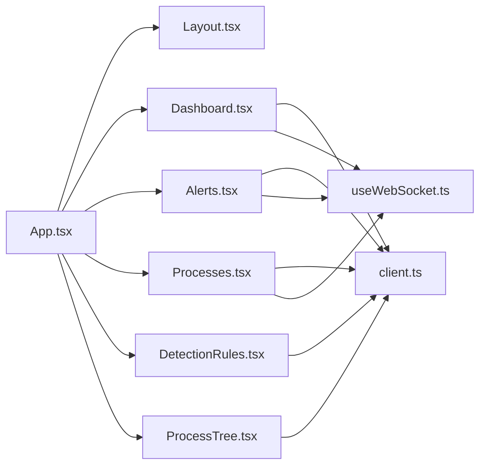

# Page Routing System

<cite>
**Referenced Files in This Document**
- [App.tsx](file://frontend/src/App.tsx)
- [Layout.tsx](file://frontend/src/components/Layout.tsx)
- [Dashboard.tsx](file://frontend/src/pages/Dashboard.tsx)
- [Alerts.tsx](file://frontend/src/pages/Alerts.tsx)
- [Processes.tsx](file://frontend/src/pages/Processes.tsx)
- [DetectionRules.tsx](file://frontend/src/pages/DetectionRules.tsx)
- [ProcessTree.tsx](file://frontend/src/pages/ProcessTree.tsx)
- [client.ts](file://frontend/src/api/client.ts)
- [useWebSocket.ts](file://frontend/src/hooks/useWebSocket.ts)
- [main.tsx](file://frontend/src/main.tsx)
- [vite.config.ts](file://frontend/vite.config.ts)
- [index.ts](file://frontend/src/types/index.ts)
</cite>

## Table of Contents
1. [Introduction](#introduction)
2. [Project Structure](#project-structure)
3. [Core Components](#core-components)
4. [Architecture Overview](#architecture-overview)
5. [Detailed Component Analysis](#detailed-component-analysis)
6. [Dependency Analysis](#dependency-analysis)
7. [Performance Considerations](#performance-considerations)
8. [Troubleshooting Guide](#troubleshooting-guide)
9. [Conclusion](#conclusion)
10. [Appendices](#appendices)

## Introduction
This document explains EDR Lite’s page-based routing system built with React Router and Vite. It covers routing configuration, page components (Dashboard, Alerts, Processes, DetectionRules, ProcessTree), route parameters and dynamic routing, navigation patterns, data fetching strategies, loading and error handling, responsive design and accessibility, and guidelines for extending the routing system with new pages. It also addresses SEO considerations, browser history management, and deep linking.

## Project Structure
The routing system centers around a single-page application with a layout wrapper and five primary pages. The router is configured declaratively in the application root, while navigation is centralized in the shared layout component. API clients abstract backend endpoints, and a WebSocket hook enables real-time updates.

**Diagram sources**
- [App.tsx:1-23](file://frontend/src/App.tsx#L1-L23)
- [Layout.tsx:25-110](file://frontend/src/components/Layout.tsx#L25-L110)
- [Dashboard.tsx:18-66](file://frontend/src/pages/Dashboard.tsx#L18-L66)
- [Alerts.tsx:11-62](file://frontend/src/pages/Alerts.tsx#L11-L62)
- [Processes.tsx:8-46](file://frontend/src/pages/Processes.tsx#L8-L46)
- [DetectionRules.tsx:6-33](file://frontend/src/pages/DetectionRules.tsx#L6-L33)
- [ProcessTree.tsx:7-31](file://frontend/src/pages/ProcessTree.tsx#L7-L31)
- [client.ts:1-124](file://frontend/src/api/client.ts#L1-L124)
- [useWebSocket.ts:1-103](file://frontend/src/hooks/useWebSocket.ts#L1-L103)

**Section sources**
- [App.tsx:1-23](file://frontend/src/App.tsx#L1-L23)
- [Layout.tsx:25-110](file://frontend/src/components/Layout.tsx#L25-L110)
- [main.tsx:1-13](file://frontend/src/main.tsx#L1-L13)

## Core Components
- Router configuration and routes: Declares static and dynamic routes for each page.
- Layout: Provides global navigation, responsive sidebar, and WebSocket status.
- Pages: Each page encapsulates its own data fetching, filtering, pagination, and rendering logic.
- API client: Centralized HTTP client with typed endpoints for alerts, processes, detection, and system.
- WebSocket hook: Manages real-time updates via WebSocket connections.

Key routing highlights:
- Static routes: "/", "/alerts", "/processes", "/rules".
- Dynamic route: "/process-tree/:id" with a route parameter for process tree viewing.

**Section sources**
- [App.tsx:9-21](file://frontend/src/App.tsx#L9-L21)
- [Layout.tsx:18-23](file://frontend/src/components/Layout.tsx#L18-L23)
- [ProcessTree.tsx:7-31](file://frontend/src/pages/ProcessTree.tsx#L7-L31)

## Architecture Overview
The routing architecture follows a clean separation of concerns:
- App.tsx defines routes and wraps them in a layout.
- Layout.tsx manages navigation and renders page content.
- Each page component handles its data fetching and state.
- API client abstracts HTTP requests; useWebSocket provides real-time updates.

**Diagram sources**
- [App.tsx:12-17](file://frontend/src/App.tsx#L12-L17)
- [Layout.tsx:54-77](file://frontend/src/components/Layout.tsx#L54-L77)
- [Alerts.tsx:21-62](file://frontend/src/pages/Alerts.tsx#L21-L62)
- [client.ts:14-38](file://frontend/src/api/client.ts#L14-L38)
- [useWebSocket.ts:27-72](file://frontend/src/hooks/useWebSocket.ts#L27-L72)

## Detailed Component Analysis

### Dashboard
Purpose: Overview metrics, recent alerts, and recent processes with simulated refresh and WebSocket updates.

Routing and navigation:
- Route: "/".
- Navigation links to "/alerts" and "/processes" for deeper inspection.

Data fetching strategy:
- Parallel fetch of system stats, recent alerts, and recent processes.
- Periodic refresh every 30 seconds.
- Real-time updates via WebSocket for alerts and processes.

Loading and error handling:
- Loading spinner during fetch.
- Error logging; graceful degradation if fetch fails.

Responsive design:
- Grid-based layout adapts to small, medium, and large screens.
- Scrollable panels for long lists.

Accessibility:
- Semantic headings and button roles.
- Focus-friendly controls.

SEO and deep linking:
- Static route supports bookmarking and deep linking.

**Section sources**
- [App.tsx:13](file://frontend/src/App.tsx#L13)
- [Dashboard.tsx:18-66](file://frontend/src/pages/Dashboard.tsx#L18-L66)
- [Dashboard.tsx:87-207](file://frontend/src/pages/Dashboard.tsx#L87-L207)
- [client.ts:14-38](file://frontend/src/api/client.ts#L14-L38)
- [useWebSocket.ts:27-72](file://frontend/src/hooks/useWebSocket.ts#L27-L72)

### Alerts
Purpose: Full-featured alert management with filtering, pagination, acknowledgment, deletion, and bulk actions.

Routing and navigation:
- Route: "/alerts".
- Uses WebSocket "/ws/alerts" for live updates.

Data fetching strategy:
- Supports severity and status filters.
- Pagination with configurable limit.
- Bulk acknowledgment and individual actions.

Loading and error handling:
- Loading indicator during fetch.
- Error logging; maintains UI state on failures.

Responsive design:
- Checkbox selection row layout.
- Pagination controls at bottom.

Accessibility:
- Proper labeling for filter selects and buttons.
- Keyboard navigable controls.

SEO and deep linking:
- Static route supports deep linking; filters/pagination reflected in URL via query params.

**Section sources**
- [App.tsx:14](file://frontend/src/App.tsx#L14)
- [Alerts.tsx:11-62](file://frontend/src/pages/Alerts.tsx#L11-L62)
- [Alerts.tsx:113-242](file://frontend/src/pages/Alerts.tsx#L113-L242)
- [client.ts:14-38](file://frontend/src/api/client.ts#L14-L38)
- [useWebSocket.ts:27-72](file://frontend/src/hooks/useWebSocket.ts#L27-L72)

### Processes
Purpose: Real-time process monitoring with search and pagination.

Routing and navigation:
- Route: "/processes".
- Uses WebSocket "/ws/events" for live process events.

Data fetching strategy:
- Searchable process listing with pagination.
- Live updates show newest events at the top.

Loading and error handling:
- Loading spinner and empty states.
- Error logging; maintains UI state.

Responsive design:
- Search form stacked on small screens, inline on larger.
- Scrollable list with pagination.

Accessibility:
- Form controls labeled; focus management for search and pagination.

SEO and deep linking:
- Static route supports deep linking; search reflected in URL via query params.

**Section sources**
- [App.tsx:15](file://frontend/src/App.tsx#L15)
- [Processes.tsx:8-46](file://frontend/src/pages/Processes.tsx#L8-L46)
- [Processes.tsx:53-136](file://frontend/src/pages/Processes.tsx#L53-L136)
- [client.ts:40-62](file://frontend/src/api/client.ts#L40-L62)
- [useWebSocket.ts:27-72](file://frontend/src/hooks/useWebSocket.ts#L27-L72)

### DetectionRules
Purpose: Manage detection rules, enable/disable, test, and view statistics.

Routing and navigation:
- Route: "/rules".

Data fetching strategy:
- Parallel fetch of rules and statistics.
- Test rule endpoint returns evaluation result.

Loading and error handling:
- Loading spinner and empty state.
- Error logging; maintains UI state.

Responsive design:
- Statistics cards arranged in responsive grid.
- Modals for create/edit and test results.

Accessibility:
- Modal dialogs with focus trapping and close controls.
- Clear labels for toggles and actions.

SEO and deep linking:
- Static route supports deep linking.

**Section sources**
- [App.tsx:16](file://frontend/src/App.tsx#L16)
- [DetectionRules.tsx:6-33](file://frontend/src/pages/DetectionRules.tsx#L6-L33)
- [DetectionRules.tsx:80-271](file://frontend/src/pages/DetectionRules.tsx#L80-L271)
- [client.ts:64-104](file://frontend/src/api/client.ts#L64-L104)

### ProcessTree
Purpose: Hierarchical visualization of a process and its ancestors.

Routing and navigation:
- Dynamic route: "/process-tree/:id".
- Uses route parameter ":id" to load a specific process tree.

Data fetching strategy:
- Loads process tree by process ID.
- Renders nested nodes recursively.

Loading and error handling:
- Loading spinner and error state with back navigation.
- Error message and fallback UI.

Responsive design:
- Horizontal scrolling container for wide trees.
- Indented child branches for clarity.

Accessibility:
- Back navigation via link with visible icon.
- Readable typography and contrast.

SEO and deep linking:
- Dynamic route supports deep linking to specific process trees.

**Section sources**
- [App.tsx:17](file://frontend/src/App.tsx#L17)
- [ProcessTree.tsx:7-31](file://frontend/src/pages/ProcessTree.tsx#L7-L31)
- [ProcessTree.tsx:106-130](file://frontend/src/pages/ProcessTree.tsx#L106-L130)
- [client.ts:54](file://frontend/src/api/client.ts#L54)

### Layout and Navigation
Navigation patterns:
- Persistent sidebar with icons and labels.
- Active state highlighting based on current location.
- Mobile-responsive hamburger menu with overlay.

Integration points:
- Links to all static routes.
- WebSocket status indicator in footer.

Responsive design:
- Sidebar collapses on mobile; overlay prevents body scroll.
- Header bar appears on mobile with brand and menu toggle.

Accessibility:
- Semantic HTML and ARIA-friendly structure.
- Keyboard navigation support.

**Section sources**
- [Layout.tsx:25-110](file://frontend/src/components/Layout.tsx#L25-L110)
- [main.tsx:7-12](file://frontend/src/main.tsx#L7-L12)

### API Client and WebSocket
API client:
- Centralized HTTP client with typed endpoints for alerts, processes, detection, and system.
- Supports query parameters for filtering and pagination.

WebSocket:
- Reconnect logic with exponential backoff.
- Message parsing and error handling.
- Hooks for connect/disconnect callbacks.

**Section sources**
- [client.ts:1-124](file://frontend/src/api/client.ts#L1-L124)
- [useWebSocket.ts:1-103](file://frontend/src/hooks/useWebSocket.ts#L1-L103)

## Dependency Analysis
The routing system exhibits low coupling and high cohesion:
- App.tsx depends on Layout and page components.
- Pages depend on API client and WebSocket hook.
- Layout depends on React Router for navigation and location.

**Diagram sources**
- [App.tsx:1-23](file://frontend/src/App.tsx#L1-L23)
- [Layout.tsx:25-110](file://frontend/src/components/Layout.tsx#L25-L110)
- [Dashboard.tsx:18-66](file://frontend/src/pages/Dashboard.tsx#L18-L66)
- [Alerts.tsx:11-62](file://frontend/src/pages/Alerts.tsx#L11-L62)
- [Processes.tsx:8-46](file://frontend/src/pages/Processes.tsx#L8-L46)
- [DetectionRules.tsx:6-33](file://frontend/src/pages/DetectionRules.tsx#L6-L33)
- [ProcessTree.tsx:7-31](file://frontend/src/pages/ProcessTree.tsx#L7-L31)
- [client.ts:1-124](file://frontend/src/api/client.ts#L1-L124)
- [useWebSocket.ts:1-103](file://frontend/src/hooks/useWebSocket.ts#L1-L103)

**Section sources**
- [App.tsx:1-23](file://frontend/src/App.tsx#L1-L23)
- [client.ts:1-124](file://frontend/src/api/client.ts#L1-L124)
- [useWebSocket.ts:1-103](file://frontend/src/hooks/useWebSocket.ts#L1-L103)

## Performance Considerations
- Parallel data fetching: Pages like Dashboard and DetectionRules use concurrent requests to reduce latency.
- Debounced or periodic refresh: Dashboard refreshes every 30 seconds; adjust intervals based on backend capacity.
- Efficient WebSocket usage: Subscribe only to relevant channels and reuse connections.
- Pagination: Limit page sizes to keep DOM manageable.
- Virtualization: Consider virtualizing long lists for Alerts and Processes if data volume grows.

## Troubleshooting Guide
Common issues and resolutions:
- Navigation not working:
  - Ensure BrowserRouter is wrapped around the app.
  - Verify routes match the intended paths.
- WebSocket errors:
  - Confirm WebSocket URL protocol matches the page protocol.
  - Check reconnect attempts and intervals.
- API timeouts or CORS:
  - Validate proxy configuration in development.
  - Confirm base URL and endpoint correctness.
- Dynamic route parameter missing:
  - Ensure route parameter is present before making requests.
  - Provide fallback UI when parameter is absent.

**Section sources**
- [main.tsx:7-12](file://frontend/src/main.tsx#L7-L12)
- [useWebSocket.ts:27-72](file://frontend/src/hooks/useWebSocket.ts#L27-L72)
- [vite.config.ts:14-24](file://frontend/vite.config.ts#L14-L24)
- [ProcessTree.tsx:13-31](file://frontend/src/pages/ProcessTree.tsx#L13-L31)

## Conclusion
EDR Lite’s routing system is straightforward, maintainable, and extensible. It leverages React Router for navigation, a shared layout for consistent UX, and a centralized API/WebSocket layer for reliable data access. The pages are self-contained, with clear data-fetching patterns, loading states, and error handling. The system supports responsive design, accessibility, and deep linking out of the box, and can be extended with new pages following established patterns.

## Appendices

### Adding a New Page
Steps:
1. Create a new page component under frontend/src/pages/.
2. Define route parameters if needed in App.tsx.
3. Add navigation link in Layout.tsx if applicable.
4. Implement data fetching using the API client and optional WebSocket hook.
5. Handle loading and error states consistently.
6. Apply responsive and accessibility best practices.
7. Test navigation, deep linking, and browser history behavior.

Guidelines:
- Keep pages focused and cohesive.
- Use consistent loading and error patterns.
- Prefer parallel fetching for independent data sets.
- Use pagination for large datasets.

**Section sources**
- [App.tsx:12-17](file://frontend/src/App.tsx#L12-L17)
- [Layout.tsx:54-77](file://frontend/src/components/Layout.tsx#L54-L77)
- [client.ts:1-124](file://frontend/src/api/client.ts#L1-L124)
- [useWebSocket.ts:27-72](file://frontend/src/hooks/useWebSocket.ts#L27-L72)

### SEO and Browser History
- Static routes support deep linking and bookmarks.
- Use semantic HTML and descriptive headings for content pages.
- Maintain consistent meta and title tags at the application level if needed.
- Browser history is managed automatically by React Router; ensure routes are deterministic.

**Section sources**
- [App.tsx:12-17](file://frontend/src/App.tsx#L12-L17)
- [main.tsx:7-12](file://frontend/src/main.tsx#L7-L12)

### Types and Contracts
Key types used across pages:
- Alert, AlertResponse, Process, ProcessTreeNode, DetectionRule, SystemStats, WebSocketMessage.

These types define the shape of data fetched from the API and consumed by page components.

**Section sources**
- [index.ts:1-83](file://frontend/src/types/index.ts#L1-L83)