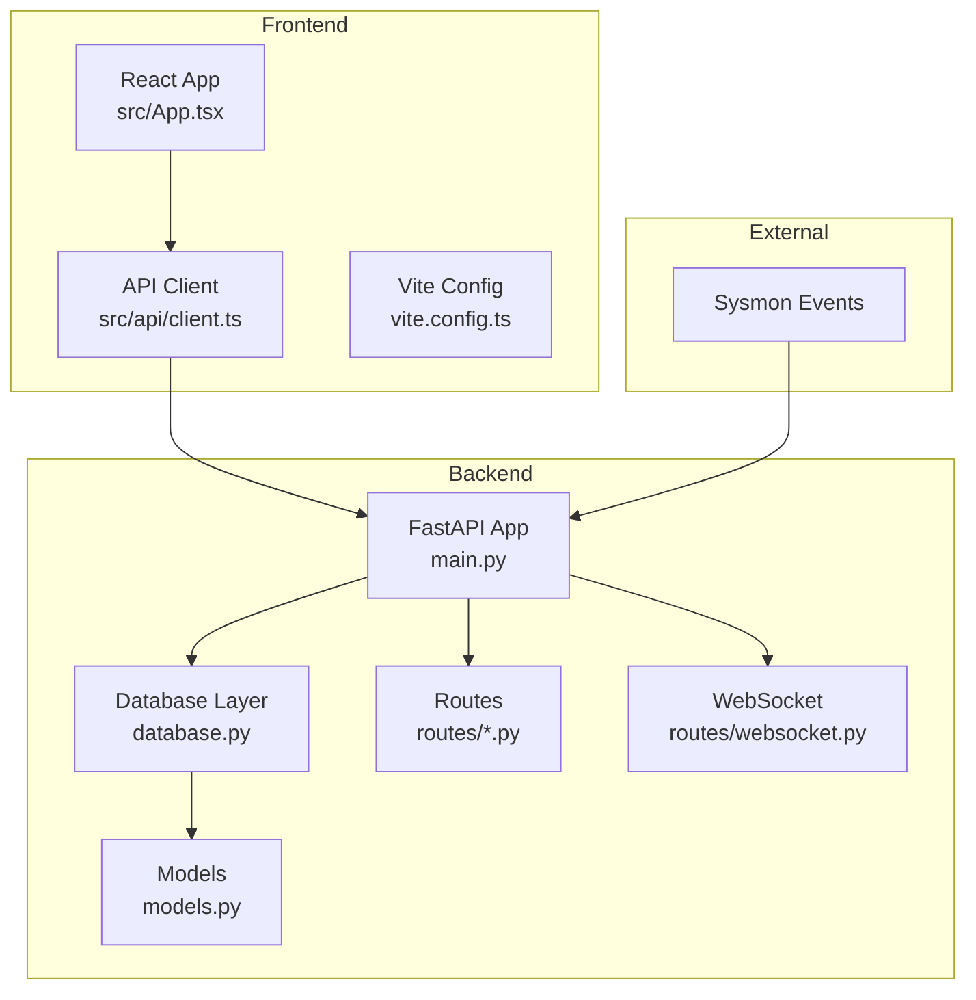

# Getting Started

<cite>
**Referenced Files in This Document**
- [README.md](file://README.md)
- [backend/requirements.txt](file://backend/requirements.txt)
- [backend/main.py](file://backend/main.py)
- [backend/database/database.py](file://backend/database/database.py)
- [backend/database/models.py](file://backend/database/models.py)
- [backend/routes/alerts.py](file://backend/routes/alerts.py)
- [backend/routes/websocket.py](file://backend/routes/websocket.py)
- [frontend/package.json](file://frontend/package.json)
- [frontend/vite.config.ts](file://frontend/vite.config.ts)
- [frontend/src/api/client.ts](file://frontend/src/api/client.ts)
- [frontend/src/App.tsx](file://frontend/src/App.tsx)
- [frontend/src/types/index.ts](file://frontend/src/types/index.ts)
</cite>

## Table of Contents
1. [Introduction](#introduction)
2. [Prerequisites](#prerequisites)
3. [Quick Start](#quick-start)
4. [Backend Setup](#backend-setup)
5. [Frontend Setup](#frontend-setup)
6. [Running the Servers](#running-the-servers)
7. [Accessing Interfaces](#accessing-interfaces)
8. [Initial Configuration](#initial-configuration)
9. [Verification Steps](#verification-steps)
10. [Common Issues and Solutions](#common-issues-and-solutions)
11. [Architecture Overview](#architecture-overview)
12. [Troubleshooting Guide](#troubleshooting-guide)
13. [Conclusion](#conclusion)

## Introduction
EDR Lite is a real-time endpoint monitoring and threat detection system that ingests Windows Sysmon process creation events, applies rule-based detection logic, and streams live alerts and events to a modern React dashboard. It consists of a FastAPI backend and a React/TypeScript frontend, with a SQLite database for persistence and WebSocket support for real-time updates.

## Prerequisites
- Python 3.9 or newer
- Node.js 18 or newer
- pip (Python package manager)
- npm or yarn (Node.js package manager)

These requirements are documented in the project’s quick start guide.

**Section sources**
- [README.md:55-61](file://README.md#L55-L61)

## Quick Start
Follow the step-by-step instructions below to install and run EDR Lite locally.

**Section sources**
- [README.md:53-118](file://README.md#L53-L118)

## Backend Setup
The backend is a FastAPI application that exposes REST endpoints and WebSocket streams, manages a SQLite database, and optionally simulates Sysmon events.

Steps:
1. Navigate to the backend directory.
2. Create a virtual environment and activate it.
3. Install Python dependencies from the requirements file.
4. Prepare the environment configuration file.
5. Start the backend server.

Notes:
- The backend uses environment variables for configuration (e.g., database URL, host, port, CORS origins, simulation mode).
- The application initializes the database and detection engine on startup and can optionally run a background simulation loop.

**Section sources**
- [README.md:62-89](file://README.md#L62-L89)
- [backend/main.py:51-58](file://backend/main.py#L51-L58)
- [backend/main.py:120-154](file://backend/main.py#L120-L154)
- [backend/database/database.py:42-74](file://backend/database/database.py#L42-L74)

## Frontend Setup
The frontend is a React application configured with Vite, TypeScript, and Tailwind CSS. It communicates with the backend via HTTP and WebSocket endpoints.

Steps:
1. Navigate to the frontend directory.
2. Install Node.js dependencies.
3. Start the development server.

Notes:
- The frontend proxies API requests to the backend and forwards WebSocket traffic accordingly.
- The API client reads a base URL from an environment variable, enabling flexible backend targeting.

**Section sources**
- [README.md:92-109](file://README.md#L92-L109)
- [frontend/package.json:1-46](file://frontend/package.json#L1-L46)
- [frontend/vite.config.ts:12-24](file://frontend/vite.config.ts#L12-L24)
- [frontend/src/api/client.ts:4](file://frontend/src/api/client.ts#L4)

## Running the Servers
Start both the backend and frontend servers concurrently to enable the full application experience.

- Backend server runs on port 8000 by default.
- Frontend development server runs on port 3000 by default.
- The frontend proxies API calls to the backend and WebSocket traffic to the backend.

Platform-specific guidance:
- Windows: Use Command Prompt or PowerShell; ensure the virtual environment is activated before starting the backend.
- Linux/macOS: Use your terminal; ensure the virtual environment is activated before starting the backend.

**Section sources**
- [README.md:90](file://README.md#L90)
- [README.md:109](file://README.md#L109)
- [backend/main.py:694-705](file://backend/main.py#L694-L705)
- [frontend/vite.config.ts:12-24](file://frontend/vite.config.ts#L12-L24)

## Accessing Interfaces
Once both servers are running:
- Dashboard: http://localhost:3000
- API Documentation: http://localhost:8000/docs
- Built-in Dashboard: http://localhost:8000/dashboard

The frontend routes include dashboards, alerts, processes, detection rules, and process trees.

**Section sources**
- [README.md:111-118](file://README.md#L111-L118)
- [frontend/src/App.tsx:9-21](file://frontend/src/App.tsx#L9-L21)

## Initial Configuration
Key environment variables and defaults:
- Database URL: sqlite:///./edr_lite.db
- Host: 0.0.0.0
- Port: 8000
- Simulation Mode: true
- Simulation Interval: 5.0 seconds
- Auto Ingest: true
- CORS Origins: http://localhost:3000,http://localhost:5173

Configure these via the environment file copied during setup.

**Section sources**
- [README.md:191-203](file://README.md#L191-L203)
- [backend/main.py:51-58](file://backend/main.py#L51-L58)

## Verification Steps
Confirm successful installation and basic functionality:
- Health check: GET http://localhost:8000/health
- System stats: GET http://localhost:8000/api/stats
- Alerts: GET http://localhost:8000/api/alerts?limit=10
- Processes: GET http://localhost:8000/api/processes?limit=10
- WebSocket connectivity: Connect to ws://localhost:8000/ws/alerts and verify live updates
- Frontend dashboard loads and displays data

Optional tests:
- Simulate events: POST http://localhost:8000/api/simulate/batch?count=10&suspicious_ratio=0.3
- Test detection rules: POST http://localhost:8000/api/detection/test with a process payload
- Import sample data: POST http://localhost:8000/api/ingest with sample Sysmon JSON

**Section sources**
- [README.md:224-252](file://README.md#L224-L252)
- [backend/main.py:214-240](file://backend/main.py#L214-L240)
- [backend/routes/alerts.py:18-54](file://backend/routes/alerts.py#L18-L54)
- [backend/routes/websocket.py:68-116](file://backend/routes/websocket.py#L68-L116)

## Common Issues and Solutions
- Port conflicts:
  - Backend port 8000: Change via environment variable PORT or stop the conflicting service.
  - Frontend port 3000: Change via Vite configuration or stop the conflicting service.
- Dependency resolution:
  - Backend: Ensure Python 3.9+ and install dependencies from requirements.txt.
  - Frontend: Ensure Node.js 18+ and install dependencies via npm/yarn.
- CORS configuration:
  - Adjust CORS_ORIGINS to include the frontend origin(s) if running on a different host/port.
- WebSocket errors:
  - Verify backend is reachable at the expected host/port and that the frontend proxy is configured correctly.
- SQLite database locking:
  - Avoid concurrent writes from external tools; rely on the backend’s database initialization and sessions.

**Section sources**
- [backend/main.py:51-58](file://backend/main.py#L51-L58)
- [backend/main.py:179-186](file://backend/main.py#L179-L186)
- [frontend/vite.config.ts:12-24](file://frontend/vite.config.ts#L12-L24)

## Architecture Overview
The system comprises a FastAPI backend, a React frontend, a SQLite database, and WebSocket channels for real-time updates.

**Diagram sources**
- [backend/main.py:172-192](file://backend/main.py#L172-L192)
- [backend/database/database.py:21-84](file://backend/database/database.py#L21-L84)
- [backend/database/models.py:9-77](file://backend/database/models.py#L9-L77)
- [backend/routes/alerts.py:15](file://backend/routes/alerts.py#L15)
- [backend/routes/websocket.py:14](file://backend/routes/websocket.py#L14)
- [frontend/src/App.tsx:9-21](file://frontend/src/App.tsx#L9-L21)
- [frontend/src/api/client.ts:6](file://frontend/src/api/client.ts#L6)
- [frontend/vite.config.ts:5-24](file://frontend/vite.config.ts#L5-L24)

## Troubleshooting Guide
- Backend fails to start:
  - Confirm Python version meets the minimum requirement.
  - Activate the virtual environment and re-run the server.
- Frontend fails to load:
  - Confirm Node.js version meets the minimum requirement.
  - Install dependencies and retry the development server.
- CORS errors in the browser:
  - Update CORS_ORIGINS to include the frontend origin.
- WebSocket disconnections:
  - Check network connectivity and firewall settings.
  - Verify the WebSocket endpoints are reachable.
- Database initialization failures:
  - Ensure the working directory allows file creation for the SQLite database.
  - Review logs for detailed error messages.

**Section sources**
- [backend/main.py:23-34](file://backend/main.py#L23-L34)
- [backend/database/database.py:315-324](file://backend/database/database.py#L315-L324)

## Conclusion
You now have the essential steps to deploy EDR Lite quickly, configure both backend and frontend, and verify core functionality. Use the provided endpoints and interfaces to explore alerts, processes, detection rules, and live streams. For production, review the deployment guidance and security considerations in the project documentation.