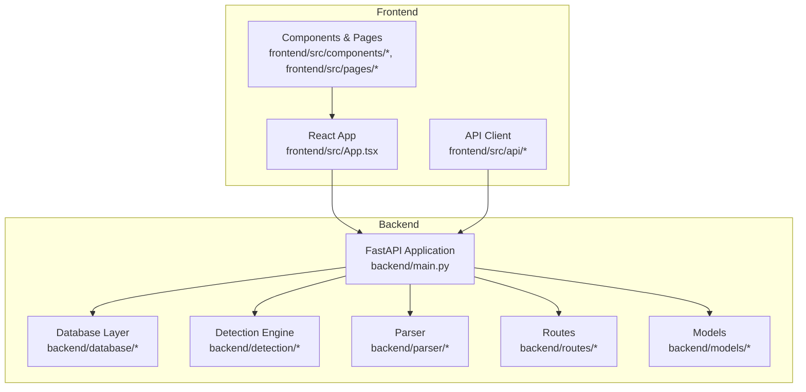
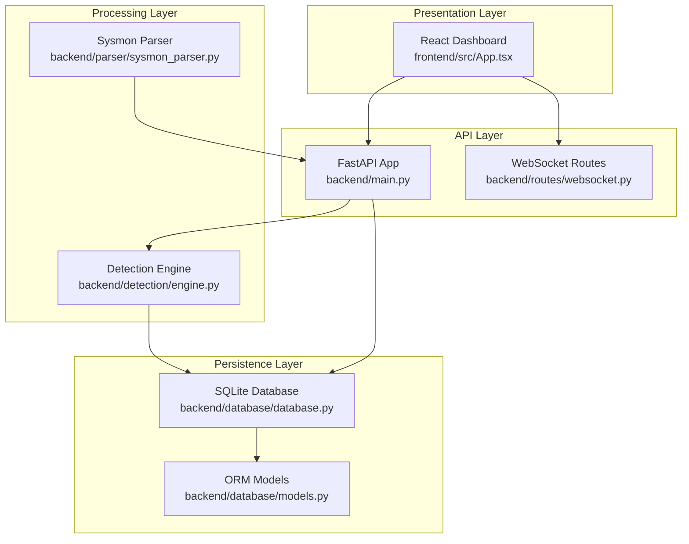
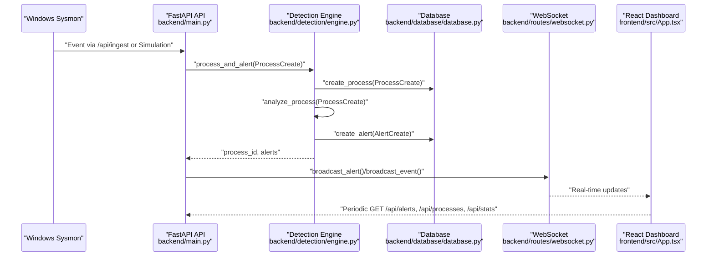
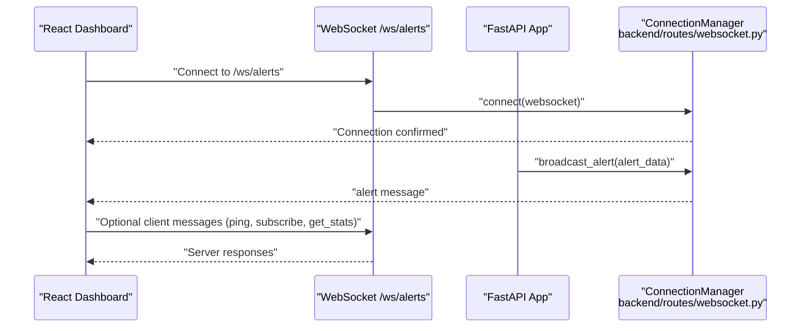
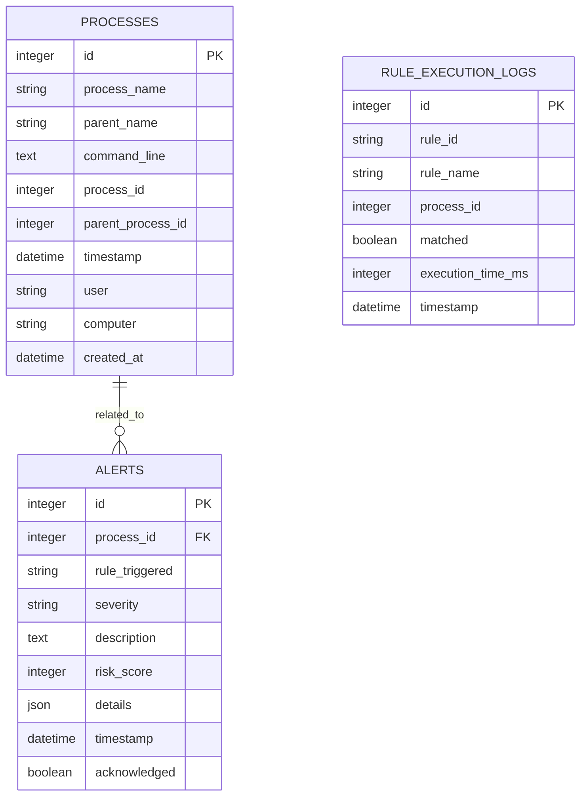
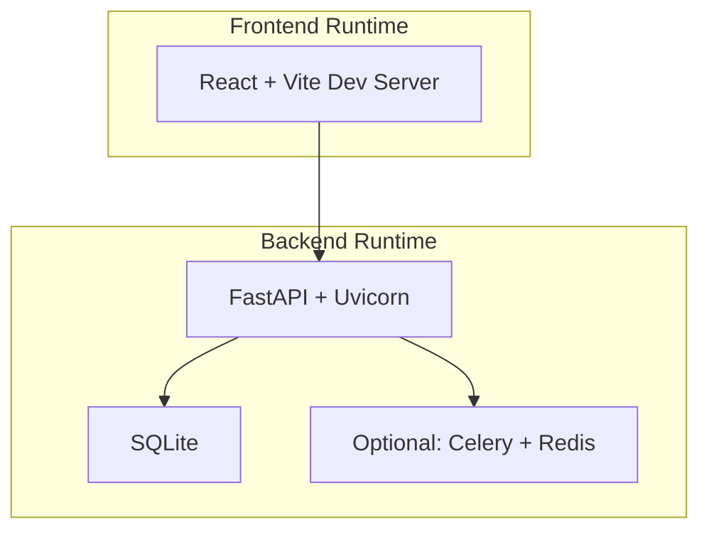
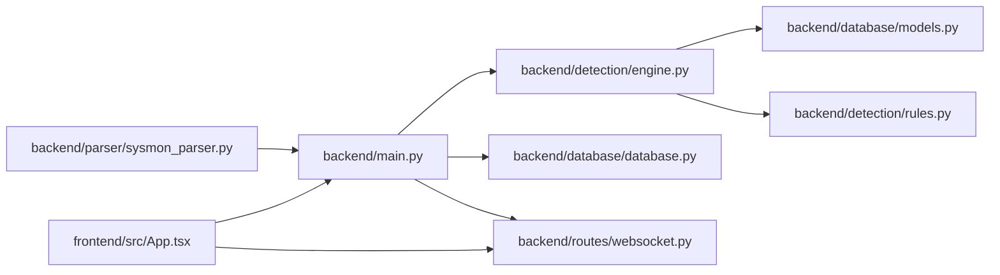

# Architecture Overview

<cite>
**Referenced Files in This Document**
- [README.md](file://README.md)
- [backend/main.py](file://backend/main.py)
- [backend/database/database.py](file://backend/database/database.py)
- [backend/database/models.py](file://backend/database/models.py)
- [backend/detection/engine.py](file://backend/detection/engine.py)
- [backend/parser/sysmon_parser.py](file://backend/parser/sysmon_parser.py)
- [backend/routes/websocket.py](file://backend/routes/websocket.py)
- [backend/models/process.py](file://backend/models/process.py)
- [backend/models/alert.py](file://backend/models/alert.py)
- [frontend/src/App.tsx](file://frontend/src/App.tsx)
- [frontend/package.json](file://frontend/package.json)
- [backend/requirements.txt](file://backend/requirements.txt)
- [sample_data/sample_sysmon_events.json](file://sample_data/sample_sysmon_events.json)
</cite>

## Table of Contents
1. [Introduction](#introduction)
2. [Project Structure](#project-structure)
3. [Core Components](#core-components)
4. [Architecture Overview](#architecture-overview)
5. [Detailed Component Analysis](#detailed-component-analysis)
6. [Dependency Analysis](#dependency-analysis)
7. [Performance Considerations](#performance-considerations)
8. [Troubleshooting Guide](#troubleshooting-guide)
9. [Conclusion](#conclusion)

## Introduction
EDR Lite is a real-time endpoint monitoring and threat detection system designed to analyze Windows Sysmon Event ID 1 (Process Creation) events. It combines a FastAPI backend with a React frontend to deliver live insights into process behavior, with WebSocket-powered real-time updates and a SQLite-backed persistence layer. The system emphasizes modularity and extensibility, enabling rule-based detection strategies and future enhancements such as machine learning-based anomaly detection.

## Project Structure
The project is organized into two primary layers:
- Backend: A FastAPI application providing REST APIs, WebSocket endpoints, and a detection engine.
- Frontend: A React application offering a modern, dark-themed dashboard with real-time updates.

**Diagram sources**
- [backend/main.py:171-192](file://backend/main.py#L171-L192)
- [frontend/src/App.tsx:1-23](file://frontend/src/App.tsx#L1-L23)

**Section sources**
- [README.md:31-51](file://README.md#L31-L51)

## Core Components
- FastAPI Application: Central orchestration point managing lifecycle, middleware, routers, and WebSocket broadcasting.
- Database Layer: Asynchronous SQLAlchemy integration with SQLite for lightweight persistence.
- Detection Engine: Rule-based analyzer with frequency tracking and multiple detection strategies.
- Parser: Multi-format Sysmon log parser supporting EVTX, XML, and JSON.
- WebSocket Routes: Real-time streaming of alerts and process events.
- Frontend Dashboard: React-based UI with routing, components, and WebSocket integration.

**Section sources**
- [backend/main.py:171-192](file://backend/main.py#L171-L192)
- [backend/database/database.py:21-84](file://backend/database/database.py#L21-L84)
- [backend/detection/engine.py:64-120](file://backend/detection/engine.py#L64-L120)
- [backend/parser/sysmon_parser.py:61-95](file://backend/parser/sysmon_parser.py#L61-L95)
- [backend/routes/websocket.py:14-65](file://backend/routes/websocket.py#L14-L65)
- [frontend/src/App.tsx:1-23](file://frontend/src/App.tsx#L1-L23)

## Architecture Overview
The system follows a layered architecture:
- Presentation Layer: React frontend with routing and WebSocket integration.
- API Layer: FastAPI REST endpoints and WebSocket endpoints.
- Processing Layer: Detection engine performing rule evaluation and alert generation.
- Persistence Layer: SQLite database via SQLAlchemy ORM.
- Integration Layer: Sysmon log ingestion and simulation capabilities.

**Diagram sources**
- [backend/main.py:171-192](file://backend/main.py#L171-L192)
- [backend/routes/websocket.py:68-166](file://backend/routes/websocket.py#L68-L166)
- [backend/detection/engine.py:64-120](file://backend/detection/engine.py#L64-L120)
- [backend/parser/sysmon_parser.py:61-95](file://backend/parser/sysmon_parser.py#L61-L95)
- [backend/database/database.py:21-84](file://backend/database/database.py#L21-L84)
- [backend/database/models.py:9-77](file://backend/database/models.py#L9-L77)
- [frontend/src/App.tsx:1-23](file://frontend/src/App.tsx#L1-L23)

## Detailed Component Analysis

### Data Flow: Windows Sysmon to Web Dashboard
The end-to-end data flow begins with Sysmon logs and culminates in the React dashboard:
1. Sysmon logs are ingested via the REST API or simulation mode.
2. The detection engine evaluates incoming process events against configured rules.
3. Alerts are persisted to the database and broadcast via WebSocket.
4. The React dashboard receives real-time updates and displays alerts and process events.

**Diagram sources**
- [backend/main.py:243-311](file://backend/main.py#L243-L311)
- [backend/detection/engine.py:272-290](file://backend/detection/engine.py#L272-L290)
- [backend/database/database.py:86-215](file://backend/database/database.py#L86-L215)
- [backend/routes/websocket.py:209-224](file://backend/routes/websocket.py#L209-L224)
- [frontend/src/App.tsx:1-23](file://frontend/src/App.tsx#L1-L23)

**Section sources**
- [backend/main.py:243-311](file://backend/main.py#L243-L311)
- [backend/detection/engine.py:272-290](file://backend/detection/engine.py#L272-L290)
- [backend/database/database.py:86-215](file://backend/database/database.py#L86-L215)
- [backend/routes/websocket.py:209-224](file://backend/routes/websocket.py#L209-L224)
- [sample_data/sample_sysmon_events.json:1-194](file://sample_data/sample_sysmon_events.json#L1-L194)

### Real-Time Communication via WebSocket
WebSocket endpoints provide live streaming of alerts and process events:
- `/ws/alerts`: Streams new alerts to connected clients.
- `/ws/events`: Streams process events and periodic statistics.

**Diagram sources**
- [backend/routes/websocket.py:68-118](file://backend/routes/websocket.py#L68-L118)
- [backend/routes/websocket.py:169-206](file://backend/routes/websocket.py#L169-L206)
- [backend/routes/websocket.py:209-224](file://backend/routes/websocket.py#L209-L224)

**Section sources**
- [backend/routes/websocket.py:68-118](file://backend/routes/websocket.py#L68-L118)
- [backend/routes/websocket.py:169-206](file://backend/routes/websocket.py#L169-L206)
- [backend/routes/websocket.py:209-224](file://backend/routes/websocket.py#L209-L224)

### Database Schema and Relationships
The database persists process events and alerts with indexed fields for efficient querying.

**Diagram sources**
- [backend/database/models.py:9-77](file://backend/database/models.py#L9-L77)

**Section sources**
- [backend/database/models.py:9-77](file://backend/database/models.py#L9-L77)
- [backend/database/database.py:86-215](file://backend/database/database.py#L86-L215)

### Technology Stack and Deployment Topology
- Backend: FastAPI, Uvicorn, SQLAlchemy, Pydantic, WebSockets, Celery/Redis (optional), python-evtx, schedule, psutil.
- Frontend: React, React Router, Axios, Recharts, Tailwind CSS.
- Database: SQLite (default), async SQLAlchemy support.
- Deployment: Development servers for backend and frontend; production deployment via Gunicorn with Uvicorn workers.

**Diagram sources**
- [backend/requirements.txt:1-14](file://backend/requirements.txt#L1-L14)
- [frontend/package.json:1-46](file://frontend/package.json#L1-L46)
- [README.md:204-222](file://README.md#L204-L222)

**Section sources**
- [backend/requirements.txt:1-14](file://backend/requirements.txt#L1-L14)
- [frontend/package.json:1-46](file://frontend/package.json#L1-L46)
- [README.md:204-222](file://README.md#L204-L222)

## Dependency Analysis
The system exhibits clear separation of concerns:
- FastAPI orchestrates routers and WebSocket broadcasting.
- Detection engine depends on database and rule manager.
- Parser is decoupled and can be extended for additional formats.
- Frontend communicates via REST and WebSocket endpoints.

**Diagram sources**
- [backend/main.py:37-41](file://backend/main.py#L37-L41)
- [backend/detection/engine.py:16-18](file://backend/detection/engine.py#L16-L18)
- [backend/database/database.py:11-12](file://backend/database/database.py#L11-L12)
- [backend/routes/websocket.py:12-14](file://backend/routes/websocket.py#L12-L14)
- [backend/parser/sysmon_parser.py:10-18](file://backend/parser/sysmon_parser.py#L10-L18)
- [frontend/src/App.tsx:1-23](file://frontend/src/App.tsx#L1-L23)

**Section sources**
- [backend/main.py:37-41](file://backend/main.py#L37-L41)
- [backend/detection/engine.py:16-18](file://backend/detection/engine.py#L16-L18)
- [backend/database/database.py:11-12](file://backend/database/database.py#L11-L12)
- [backend/routes/websocket.py:12-14](file://backend/routes/websocket.py#L12-L14)
- [backend/parser/sysmon_parser.py:10-18](file://backend/parser/sysmon_parser.py#L10-L18)
- [frontend/src/App.tsx:1-23](file://frontend/src/App.tsx#L1-L23)

## Performance Considerations
- Database: SQLite is suitable for development and small-scale deployments. For higher throughput, consider migrating to PostgreSQL with async drivers.
- Detection Engine: Rule evaluation and frequency tracking are O(n) per event. Optimize rule sets and leverage indexing on frequently queried fields.
- WebSocket: ConnectionManager handles broadcasting efficiently; monitor concurrent connections and implement rate limiting if needed.
- Frontend: Debounce API polling and use efficient rendering for large datasets.

[No sources needed since this section provides general guidance]

## Troubleshooting Guide
Common operational checks:
- Health endpoint: Verify backend availability and component initialization.
- Simulation mode: Toggle simulation to generate test events and validate WebSocket streams.
- Database cleanup: Use retention policies to manage historical data growth.
- CORS configuration: Ensure allowed origins match frontend host/port.

**Section sources**
- [backend/main.py:214-223](file://backend/main.py#L214-L223)
- [backend/main.py:339-358](file://backend/main.py#L339-L358)
- [backend/database/database.py:296-308](file://backend/database/database.py#L296-L308)
- [backend/main.py:179-186](file://backend/main.py#L179-L186)

## Conclusion
EDR Lite demonstrates a clean, modular architecture that integrates Windows Sysmon logs with a FastAPI backend and a React frontend. Its layered design facilitates extensibility, real-time observability via WebSockets, and straightforward deployment. While SQLite serves as a practical default, production deployments should consider scaling the database and adding authentication/authorization for enhanced security.