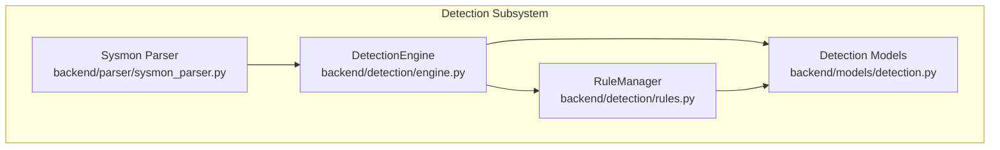
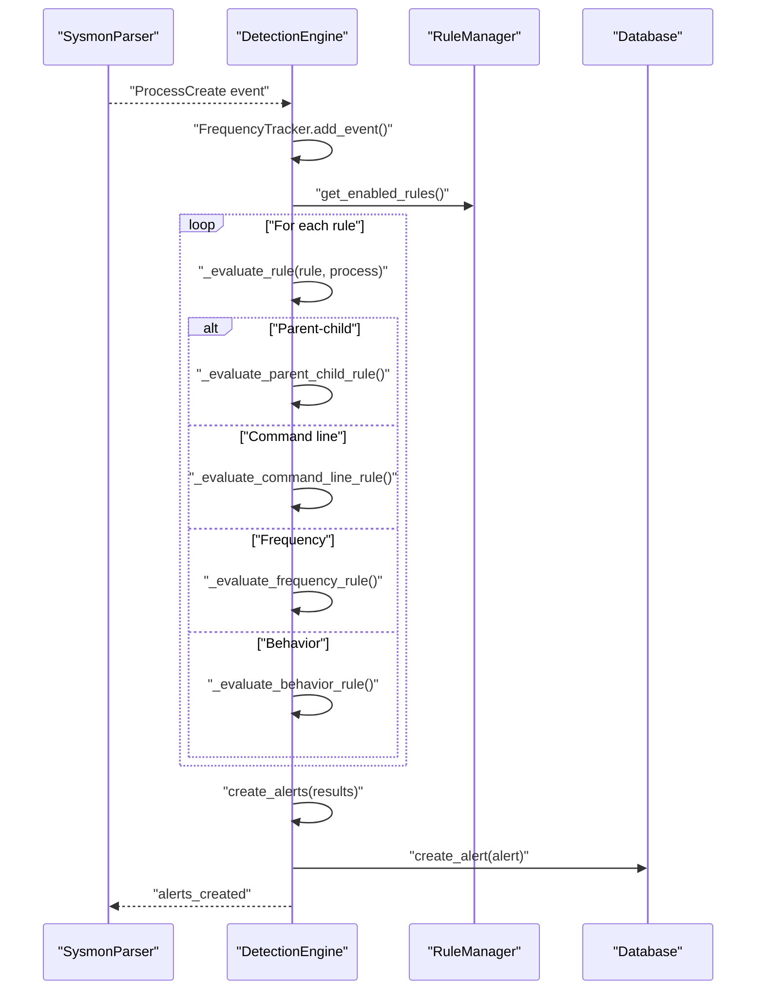
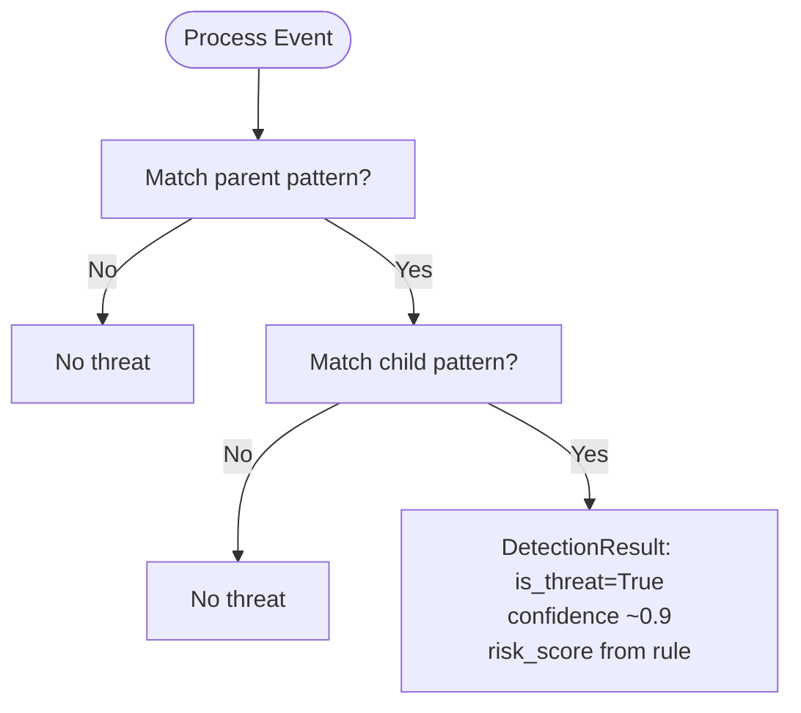
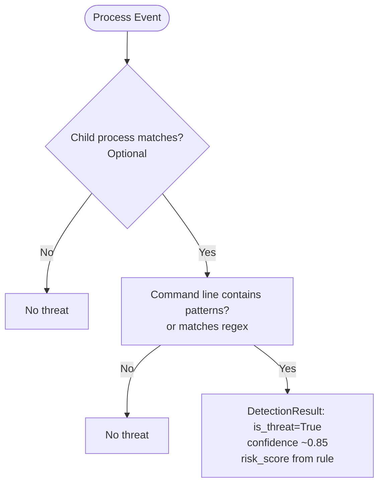
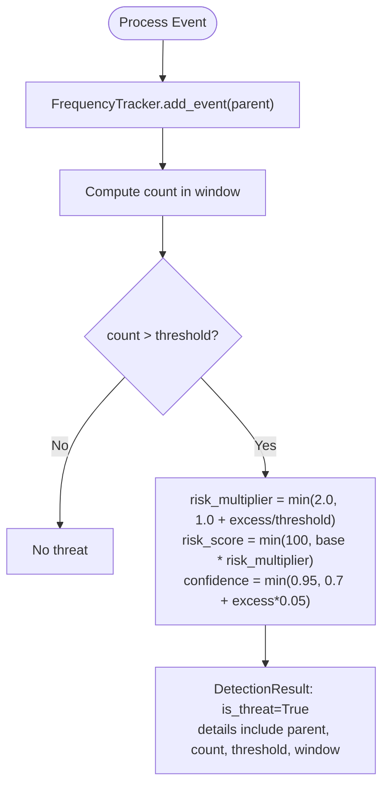
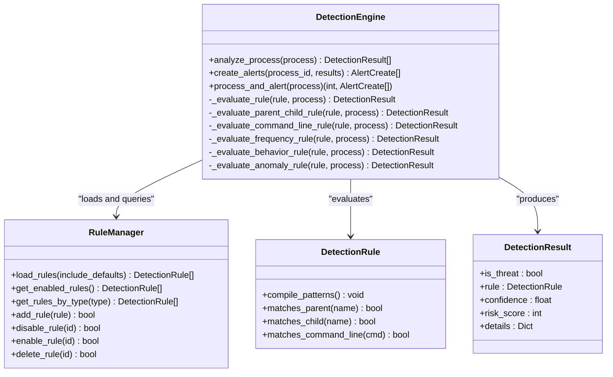

# Detection Capabilities

<cite>
**Referenced Files in This Document**
- [engine.py](file://backend/detection/engine.py)
- [rules.py](file://backend/detection/rules.py)
- [detection.py](file://backend/models/detection.py)
- [sysmon_parser.py](file://backend/parser/sysmon_parser.py)
</cite>

## Table of Contents
1. [Introduction](#introduction)
2. [Project Structure](#project-structure)
3. [Core Components](#core-components)
4. [Architecture Overview](#architecture-overview)
5. [Detailed Component Analysis](#detailed-component-analysis)
6. [Dependency Analysis](#dependency-analysis)
7. [Performance Considerations](#performance-considerations)
8. [Troubleshooting Guide](#troubleshooting-guide)
9. [Conclusion](#conclusion)

## Introduction
This document explains the EDR Lite detection capabilities and how the system identifies suspicious activity using three primary detection strategies:
- Parent-child anomaly detection: Identifies suspicious process relationships (e.g., office applications spawning shells or browsers spawning scripting engines).
- Command line analysis: Detects encoded PowerShell commands, download cradles, remote execution attempts, and LOLBAS technique indicators.
- Frequency analysis: Rapid process spawning detection with threshold-based anomaly detection.

It also documents detection patterns, risk scoring mechanisms, severity levels, and how each strategy contributes to overall threat identification.

## Project Structure
The detection subsystem is organized around a detection engine, rule management, and data models. The engine evaluates incoming process events against rules and generates alerts when threats are detected. The rule manager loads built-in and custom rules from disk and supports runtime enable/disable and updates.

**Diagram sources**
- [engine.py:64-324](file://backend/detection/engine.py#L64-L324)
- [rules.py:273-480](file://backend/detection/rules.py#L273-L480)
- [detection.py:17-92](file://backend/models/detection.py#L17-L92)
- [sysmon_parser.py:61-385](file://backend/parser/sysmon_parser.py#L61-L385)

**Section sources**
- [engine.py:64-120](file://backend/detection/engine.py#L64-L120)
- [rules.py:273-314](file://backend/detection/rules.py#L273-L314)
- [detection.py:17-92](file://backend/models/detection.py#L17-L92)
- [sysmon_parser.py:61-120](file://backend/parser/sysmon_parser.py#L61-L120)

## Core Components
- DetectionEngine: Orchestrates detection evaluation across rule types, maintains frequency tracking, and creates alerts.
- RuleManager: Loads default and custom rules, compiles patterns, and manages rule lifecycle.
- DetectionRule and DetectionResult: Pydantic models defining rule structure, matching logic, and detection outcomes.
- SysmonParser: Converts raw Sysmon events into structured process creation events consumed by the detection engine.

Key responsibilities:
- Parent-child anomaly detection: Matches suspicious parent-child process pairs.
- Command line analysis: Matches suspicious command-line patterns and keywords.
- Frequency analysis: Tracks process creation rates and flags anomalies.
- Behavior scoring: Computes risk scores and confidence per detection.

**Section sources**
- [engine.py:64-324](file://backend/detection/engine.py#L64-L324)
- [rules.py:20-256](file://backend/detection/rules.py#L20-L256)
- [detection.py:17-92](file://backend/models/detection.py#L17-L92)
- [sysmon_parser.py:23-59](file://backend/parser/sysmon_parser.py#L23-L59)

## Architecture Overview
The detection pipeline ingests Sysmon process creation events, normalizes them into ProcessCreate-like structures, and evaluates them against detection rules. Threats trigger DetectionResult entries with risk scores and details, which are transformed into alerts.

**Diagram sources**
- [sysmon_parser.py:61-120](file://backend/parser/sysmon_parser.py#L61-L120)
- [engine.py:84-120](file://backend/detection/engine.py#L84-L120)
- [engine.py:121-250](file://backend/detection/engine.py#L121-L250)
- [rules.py:291-314](file://backend/detection/rules.py#L291-L314)

## Detailed Component Analysis

### Parent-Child Anomaly Detection
Purpose:
- Identify suspicious process relationships that often indicate attack techniques (e.g., Office applications spawning shells, browsers spawning scripting engines).

How it works:
- The engine checks whether the parent process matches a configured pattern and whether the child process matches another pattern.
- On a successful two-way match, a DetectionResult is produced with high confidence and risk score.

Severity and risk scoring:
- Severity levels are defined per rule (e.g., high, critical).
- Risk scores are rule-defined and used to quantify threat severity.

Examples of detection patterns:
- Outlook spawning cmd/powershell/wscript/cscript.
- Word spawning powershell/pwsh.
- Excel spawning powershell/cmd/wscript/cscript/mshta.
- Browser spawning cmd/powershell/wscript/cscript.
- LSASS spawning cmd/powershell.
- Service host spawning regsvr32.

**Diagram sources**
- [engine.py:142-166](file://backend/detection/engine.py#L142-L166)
- [rules.py:21-88](file://backend/detection/rules.py#L21-L88)

**Section sources**
- [engine.py:142-166](file://backend/detection/engine.py#L142-L166)
- [rules.py:21-88](file://backend/detection/rules.py#L21-L88)

### Command Line Analysis
Purpose:
- Detect suspicious command-line constructs indicative of encoded PowerShell, download cradles, hidden execution, LOLBAS usage, and other evasion techniques.

How it works:
- Optionally restricts to specific child processes (e.g., powershell.exe, certutil.exe).
- Matches either literal substrings or regex patterns in the command line.
- On match, produces DetectionResult with medium-to-high confidence and risk score.

Severity and risk scoring:
- Severity varies by rule (e.g., high, critical, medium).
- Risk scores reflect rule-defined base scores.

Examples of detection patterns:
- Encoded PowerShell invocation keywords.
- PowerShell download primitives (Invoke-WebRequest/iwr/wget/curl/net.WebClient).
- Hidden window execution.
- Execution policy bypass.
- CertUtil remote cache retrieval.
- MSHTA remote execution.
- Regsvr32 Squiblydoo remote scriptlet.
- Shadow copy deletion via vssadmin/wmic.
- Net user creation and localgroup administrator addition.

**Diagram sources**
- [engine.py:168-190](file://backend/detection/engine.py#L168-L190)
- [rules.py:90-209](file://backend/detection/rules.py#L90-L209)
- [detection.py:71-79](file://backend/models/detection.py#L71-L79)

**Section sources**
- [engine.py:168-190](file://backend/detection/engine.py#L168-L190)
- [rules.py:90-209](file://backend/detection/rules.py#L90-L209)
- [detection.py:71-79](file://backend/models/detection.py#L71-L79)

### Frequency Analysis
Purpose:
- Detect rapid process spawning from a single parent, indicating potential automated or malicious activity.

How it works:
- Maintains a sliding-window frequency tracker keyed by parent process name.
- Compares observed event counts within a configurable time window against a threshold.
- On breach, computes a dynamic risk score and confidence based on the magnitude of excess.

Severity and risk scoring:
- Severity is defined per rule.
- Risk score scales with the excess over the threshold, capped at 100.

Examples of detection patterns:
- Unusually high rate of child process creation from a single parent within a short time window.

**Diagram sources**
- [engine.py:23-62](file://backend/detection/engine.py#L23-L62)
- [engine.py:192-225](file://backend/detection/engine.py#L192-L225)
- [rules.py:210-222](file://backend/detection/rules.py#L210-L222)

**Section sources**
- [engine.py:23-62](file://backend/detection/engine.py#L23-L62)
- [engine.py:192-225](file://backend/detection/engine.py#L192-L225)
- [rules.py:210-222](file://backend/detection/rules.py#L210-L222)

### Behavior-Based Detection (Supplementary)
Purpose:
- Complement anomaly detection with observable behavioral patterns.

Examples:
- Suspicious script extensions executed.
- Executables running from temp directories.
- WMI process creation leading to suspicious children.

**Section sources**
- [rules.py:223-254](file://backend/detection/rules.py#L223-L254)

## Dependency Analysis
The detection engine depends on:
- RuleManager for rule discovery and compilation.
- DetectionRule/DetectionResult models for matching and scoring.
- FrequencyTracker for temporal anomaly detection.
- SysmonParser for event ingestion.

**Diagram sources**
- [engine.py:64-324](file://backend/detection/engine.py#L64-L324)
- [rules.py:273-480](file://backend/detection/rules.py#L273-L480)
- [detection.py:17-92](file://backend/models/detection.py#L17-L92)

**Section sources**
- [engine.py:64-120](file://backend/detection/engine.py#L64-L120)
- [rules.py:273-314](file://backend/detection/rules.py#L273-L314)
- [detection.py:17-92](file://backend/models/detection.py#L17-L92)

## Performance Considerations
- FrequencyTracker uses thread-safe deques with bounded length to cap memory usage and maintain O(n) cleanup per event.
- Regex compilation is deferred until needed and reused via compiled patterns on DetectionRule.
- Rule evaluation short-circuits on non-matching conditions to minimize overhead.
- Confidence and risk score calculations are lightweight arithmetic operations.

Recommendations:
- Tune thresholds for frequency rules based on environment baseline.
- Keep rule sets minimal and enabled to reduce evaluation overhead.
- Monitor rule-trigger statistics to identify hotspots and adjust severities.

[No sources needed since this section provides general guidance]

## Troubleshooting Guide
Common issues and resolutions:
- Missing python-evtx dependency for EVTX parsing: Install the optional dependency to enable EVTX parsing support.
- Parsing errors in XML/JSON: Verify file integrity and supported structures; check error logs for specific parse failures.
- Rules not triggering: Confirm rules are enabled, patterns match expected casing, and child process filters align with actual executables.
- Excessive false positives: Lower risk scores or increase thresholds; refine patterns to avoid benign matches.

Operational tips:
- Use rule statistics to identify frequently triggered rules and adjust accordingly.
- Export/import rules to version-control custom detections.
- Reload rules dynamically to apply changes without restart.

**Section sources**
- [sysmon_parser.py:100-107](file://backend/parser/sysmon_parser.py#L100-L107)
- [sysmon_parser.py:156-161](file://backend/parser/sysmon_parser.py#L156-L161)
- [sysmon_parser.py:189-194](file://backend/parser/sysmon_parser.py#L189-L194)
- [rules.py:426-446](file://backend/detection/rules.py#L426-L446)

## Conclusion
EDR Lite’s detection engine combines parent-child anomaly detection, command line analysis, and frequency-based anomaly detection to provide layered visibility into suspicious process behaviors. Built-in rules capture common attack patterns (e.g., encoded PowerShell, download cradles, LOLBAS), while configurable thresholds and risk scoring enable tailored security postures. Together, these strategies contribute to robust threat identification with actionable alerts and tunable severity levels.