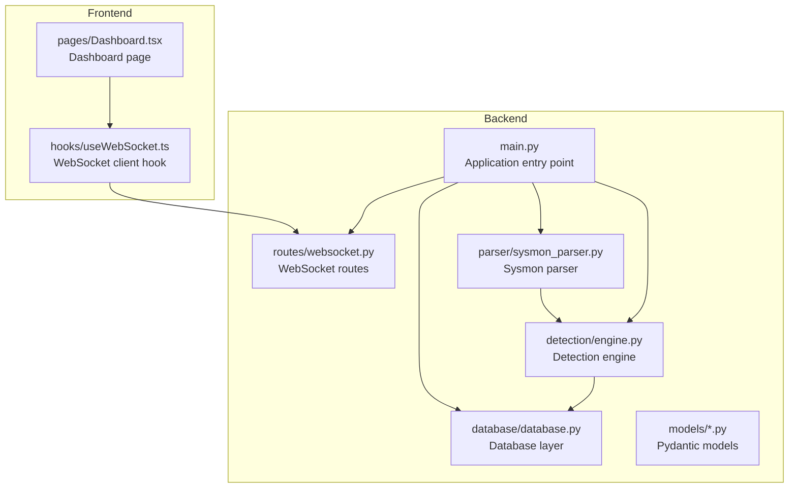
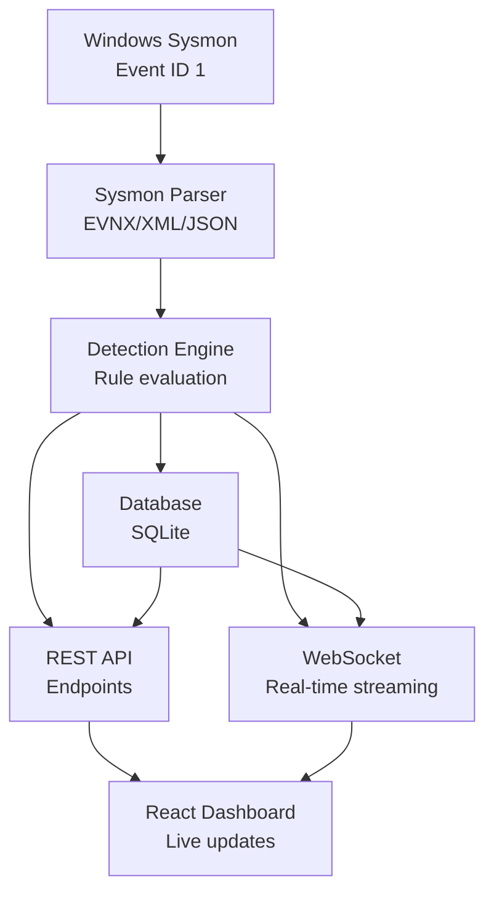
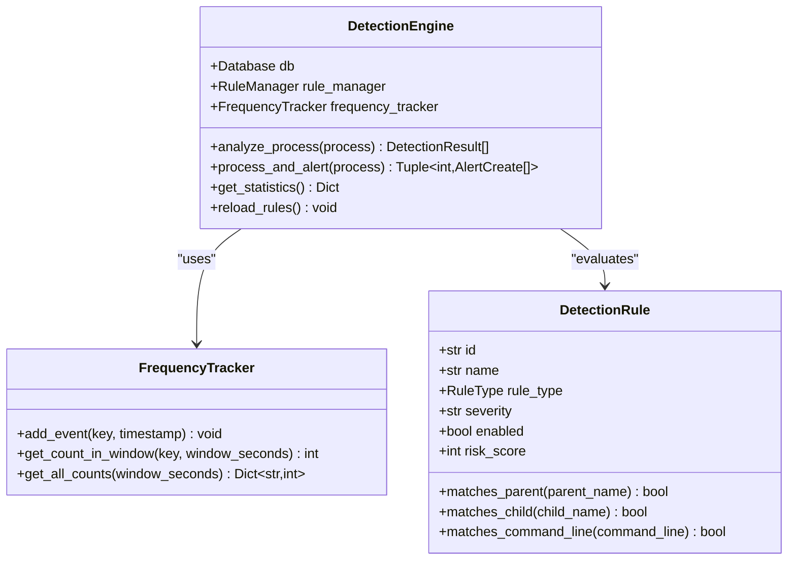
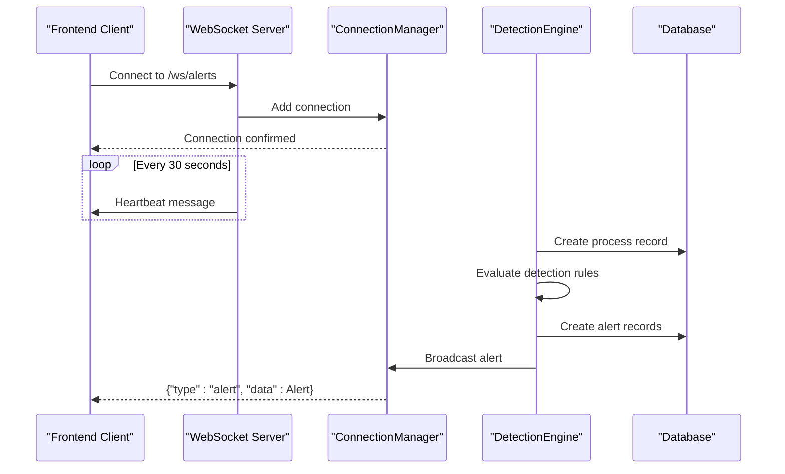
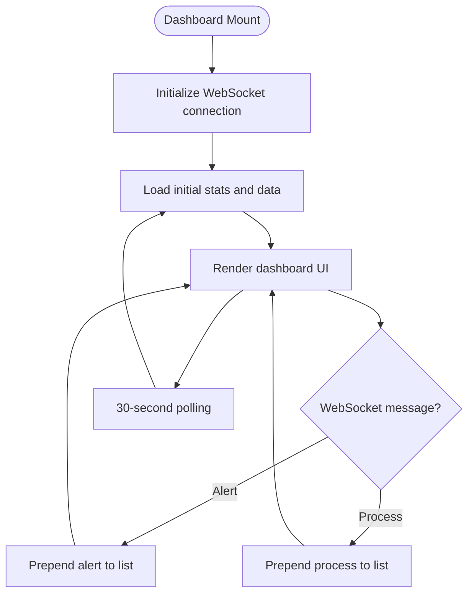
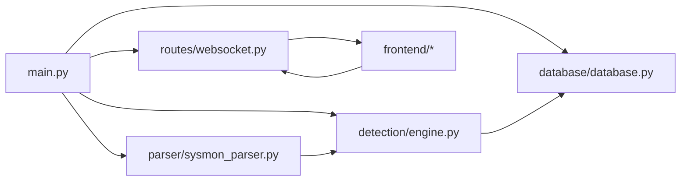

# Introduction

<cite>
**Referenced Files in This Document**
- [README.md](file://README.md)
- [backend/main.py](file://backend/main.py)
- [backend/parser/sysmon_parser.py](file://backend/parser/sysmon_parser.py)
- [backend/detection/engine.py](file://backend/detection/engine.py)
- [backend/models/process.py](file://backend/models/process.py)
- [backend/models/alert.py](file://backend/models/alert.py)
- [backend/models/detection.py](file://backend/models/detection.py)
- [backend/routes/websocket.py](file://backend/routes/websocket.py)
- [backend/database/database.py](file://backend/database/database.py)
- [frontend/src/pages/Dashboard.tsx](file://frontend/src/pages/Dashboard.tsx)
- [frontend/src/hooks/useWebSocket.ts](file://frontend/src/hooks/useWebSocket.ts)
- [sample_data/sample_sysmon_events.json](file://sample_data/sample_sysmon_events.json)
</cite>

## Table of Contents
1. [Introduction](#introduction)
2. [Project Structure](#project-structure)
3. [Core Components](#core-components)
4. [Architecture Overview](#architecture-overview)
5. [Detailed Component Analysis](#detailed-component-analysis)
6. [Dependency Analysis](#dependency-analysis)
7. [Performance Considerations](#performance-considerations)
8. [Troubleshooting Guide](#troubleshooting-guide)
9. [Conclusion](#conclusion)

## Introduction
EDR Lite is a real-time endpoint detection and response (EDR) system designed to monitor Windows Sysmon Event ID 1 (Process Creation) events and detect suspicious process behaviors. It serves security analysts and system administrators by providing a kernel-level monitoring solution that combines a rule-based detection engine with a modern web dashboard for live threat monitoring.

At its core, EDR Lite continuously ingests process creation events from Windows Sysmon, applies configurable detection rules to identify anomalous or malicious behaviors, and streams actionable alerts to a real-time dashboard. The system emphasizes practical, rule-driven detection while maintaining a lightweight, serverless architecture suitable for demonstrations and proof-of-concept deployments.

Key capabilities include:
- Real-time monitoring of Windows Sysmon Event ID 1 events
- Rule-based detection covering parent-child anomalies, command-line analysis, and frequency thresholds
- WebSocket-powered live streaming of alerts and process events
- A modern React dashboard with dark theme and responsive design
- SQLite-backed persistence for events and alerts
- Built-in event simulation for testing and demonstration

EDR Lite transforms raw process event data into actionable security alerts by parsing Sysmon logs, applying detection rules, generating risk scores, and broadcasting results to both REST APIs and WebSocket channels. This enables security teams to observe suspicious process behaviors as they occur and respond quickly to potential threats.

**Section sources**
- [README.md:1-307](file://README.md#L1-L307)
- [backend/main.py:171-241](file://backend/main.py#L171-L241)
- [backend/parser/sysmon_parser.py:61-95](file://backend/parser/sysmon_parser.py#L61-L95)
- [backend/detection/engine.py:64-83](file://backend/detection/engine.py#L64-L83)

## Project Structure
The project is organized into two primary layers:
- Backend: FastAPI application providing REST endpoints, WebSocket streaming, detection engine, database, and parsers
- Frontend: React application offering a modern dashboard with real-time updates

**Diagram sources**
- [backend/main.py:171-192](file://backend/main.py#L171-L192)
- [backend/detection/engine.py:64-83](file://backend/detection/engine.py#L64-L83)
- [backend/parser/sysmon_parser.py:61-95](file://backend/parser/sysmon_parser.py#L61-L95)
- [backend/database/database.py:21-41](file://backend/database/database.py#L21-L41)
- [backend/routes/websocket.py:14-15](file://backend/routes/websocket.py#L14-L15)
- [frontend/src/pages/Dashboard.tsx:18-208](file://frontend/src/pages/Dashboard.tsx#L18-L208)
- [frontend/src/hooks/useWebSocket.ts:13-103](file://frontend/src/hooks/useWebSocket.ts#L13-L103)

**Section sources**
- [README.md:31-51](file://README.md#L31-L51)
- [backend/main.py:171-192](file://backend/main.py#L171-L192)

## Core Components
- Detection Engine: Applies rule-based detection to process events, tracks frequency anomalies, and generates risk scores
- Sysmon Parser: Parses Windows Sysmon Event ID 1 events from EVTX, XML, and JSON formats
- Database Layer: Provides SQLite-backed storage for processes and alerts with async support
- WebSocket Routes: Streams alerts and process events to connected clients in real time
- Frontend Dashboard: Presents live statistics, recent alerts, and process events with interactive controls

These components work together to deliver a complete EDR solution that monitors process creation events, evaluates them against detection rules, persists results, and presents them through a modern web interface.

**Section sources**
- [backend/detection/engine.py:64-83](file://backend/detection/engine.py#L64-L83)
- [backend/parser/sysmon_parser.py:61-95](file://backend/parser/sysmon_parser.py#L61-L95)
- [backend/database/database.py:21-41](file://backend/database/database.py#L21-L41)
- [backend/routes/websocket.py:14-15](file://backend/routes/websocket.py#L14-L15)
- [frontend/src/pages/Dashboard.tsx:18-208](file://frontend/src/pages/Dashboard.tsx#L18-L208)

## Architecture Overview
EDR Lite follows a layered architecture with clear separation of concerns:
- Data ingestion layer handles Sysmon event parsing
- Detection layer applies rules and computes risk scores
- Persistence layer stores events and alerts
- Presentation layer provides real-time dashboards and analytics

**Diagram sources**
- [backend/parser/sysmon_parser.py:61-95](file://backend/parser/sysmon_parser.py#L61-L95)
- [backend/detection/engine.py:64-83](file://backend/detection/engine.py#L64-L83)
- [backend/database/database.py:21-41](file://backend/database/database.py#L21-L41)
- [backend/routes/websocket.py:14-15](file://backend/routes/websocket.py#L14-L15)
- [frontend/src/pages/Dashboard.tsx:18-208](file://frontend/src/pages/Dashboard.tsx#L18-L208)

## Detailed Component Analysis

### Detection Engine Analysis
The detection engine implements a rule-based approach with multiple detection strategies:
- Parent-child relationship detection for suspicious process hierarchies
- Command-line pattern matching for encoded commands and suspicious artifacts
- Frequency analysis for rapid process spawning anomalies
- Behavior-based detection for known malicious patterns

**Diagram sources**
- [backend/detection/engine.py:64-83](file://backend/detection/engine.py#L64-L83)
- [backend/detection/engine.py:23-62](file://backend/detection/engine.py#L23-L62)
- [backend/models/detection.py:17-83](file://backend/models/detection.py#L17-L83)

**Section sources**
- [backend/detection/engine.py:84-141](file://backend/detection/engine.py#L84-L141)
- [backend/models/detection.py:17-83](file://backend/models/detection.py#L17-L83)

### WebSocket Streaming Analysis
The WebSocket implementation provides real-time bidirectional communication:
- Two channels: alerts and events
- Heartbeat mechanism for connection health
- Automatic reconnection with exponential backoff
- Message routing for subscription and statistics requests

**Diagram sources**
- [backend/routes/websocket.py:68-119](file://backend/routes/websocket.py#L68-L119)
- [backend/routes/websocket.py:21-62](file://backend/routes/websocket.py#L21-L62)
- [backend/detection/engine.py:272-291](file://backend/detection/engine.py#L272-L291)
- [backend/database/database.py:86-121](file://backend/database/database.py#L86-L121)

**Section sources**
- [backend/routes/websocket.py:68-119](file://backend/routes/websocket.py#L68-L119)
- [backend/routes/websocket.py:21-62](file://backend/routes/websocket.py#L21-L62)

### Frontend Dashboard Analysis
The React dashboard provides a comprehensive monitoring interface:
- Real-time statistics cards showing total alerts, high severity, processes analyzed, and active rules
- Live feed of recent alerts with severity indicators and acknowledgment controls
- Recent processes display with command-line visibility
- WebSocket integration for automatic updates and manual refresh capability

**Diagram sources**
- [frontend/src/pages/Dashboard.tsx:25-65](file://frontend/src/pages/Dashboard.tsx#L25-L65)
- [frontend/src/pages/Dashboard.tsx:46-52](file://frontend/src/pages/Dashboard.tsx#L46-L52)
- [frontend/src/hooks/useWebSocket.ts:27-72](file://frontend/src/hooks/useWebSocket.ts#L27-L72)

**Section sources**
- [frontend/src/pages/Dashboard.tsx:18-208](file://frontend/src/pages/Dashboard.tsx#L18-L208)
- [frontend/src/hooks/useWebSocket.ts:13-103](file://frontend/src/hooks/useWebSocket.ts#L13-L103)

## Dependency Analysis
The system exhibits clear module boundaries with minimal coupling:
- Backend main module orchestrates lifecycle management and service initialization
- Detection engine depends on database and rule manager abstractions
- Parser provides a unified interface for multiple Sysmon formats
- WebSocket routes depend on connection manager for broadcast operations
- Frontend components depend on shared types and WebSocket hook

**Diagram sources**
- [backend/main.py:171-192](file://backend/main.py#L171-L192)
- [backend/detection/engine.py:64-83](file://backend/detection/engine.py#L64-L83)
- [backend/parser/sysmon_parser.py:61-95](file://backend/parser/sysmon_parser.py#L61-L95)
- [backend/database/database.py:21-41](file://backend/database/database.py#L21-L41)
- [backend/routes/websocket.py:14-15](file://backend/routes/websocket.py#L14-L15)

**Section sources**
- [backend/main.py:171-192](file://backend/main.py#L171-L192)
- [backend/detection/engine.py:64-83](file://backend/detection/engine.py#L64-L83)

## Performance Considerations
- Frequency tracking uses thread-safe deques with configurable window sizes to minimize memory overhead
- Database operations leverage async sessions for improved throughput under concurrent loads
- WebSocket connections implement heartbeat and automatic reconnection to maintain reliability
- Frontend uses efficient list rendering with bounded item counts to prevent DOM bloat
- Detection rules are compiled once and reused across evaluations to reduce regex overhead

## Troubleshooting Guide
Common operational issues and resolutions:
- WebSocket disconnections: The frontend automatically attempts reconnection with exponential backoff
- Database connectivity: SQLite initialization occurs during application startup; verify file permissions
- Rule loading failures: Detection rules are loaded at startup; check JSON format and pattern validity
- Event parsing errors: Sysmon parser handles multiple formats with graceful error reporting
- Simulation mode: Toggleable background event generation for testing without external Sysmon integration

**Section sources**
- [backend/routes/websocket.py:133-166](file://backend/routes/websocket.py#L133-L166)
- [backend/database/database.py:42-74](file://backend/database/database.py#L42-L74)
- [backend/parser/sysmon_parser.py:96-161](file://backend/parser/sysmon_parser.py#L96-L161)
- [backend/main.py:140-149](file://backend/main.py#L140-L149)

## Conclusion
EDR Lite delivers a practical, rule-driven endpoint detection and response solution that bridges the gap between raw Sysmon telemetry and actionable security insights. By combining a robust detection engine with a modern web interface, it enables security teams to monitor suspicious process behaviors in real time while maintaining a lightweight, easy-to-deploy architecture suitable for demonstrations and proof-of-concept scenarios.

The system's strength lies in its focus on Windows Sysmon Event ID 1 monitoring, comprehensive rule coverage, and seamless real-time visualization through WebSocket streaming and React-based dashboards. While designed primarily as a demonstration platform, the modular architecture and clear separation of concerns provide a solid foundation for extending detection capabilities and integrating with production-grade infrastructure.