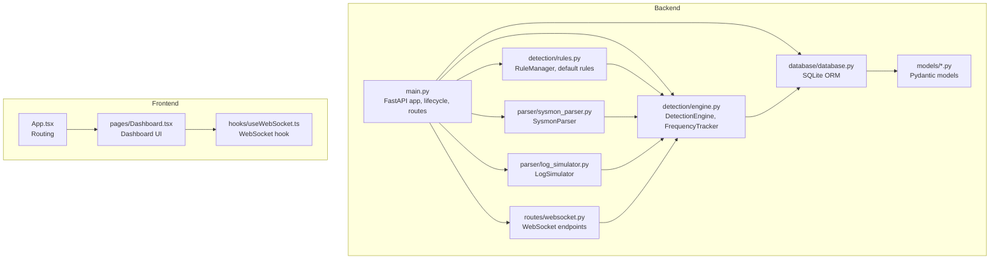
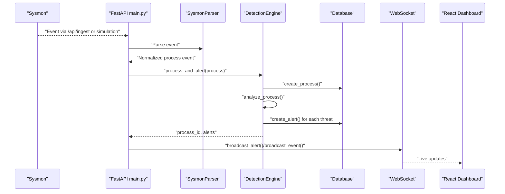
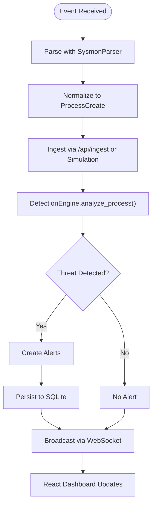
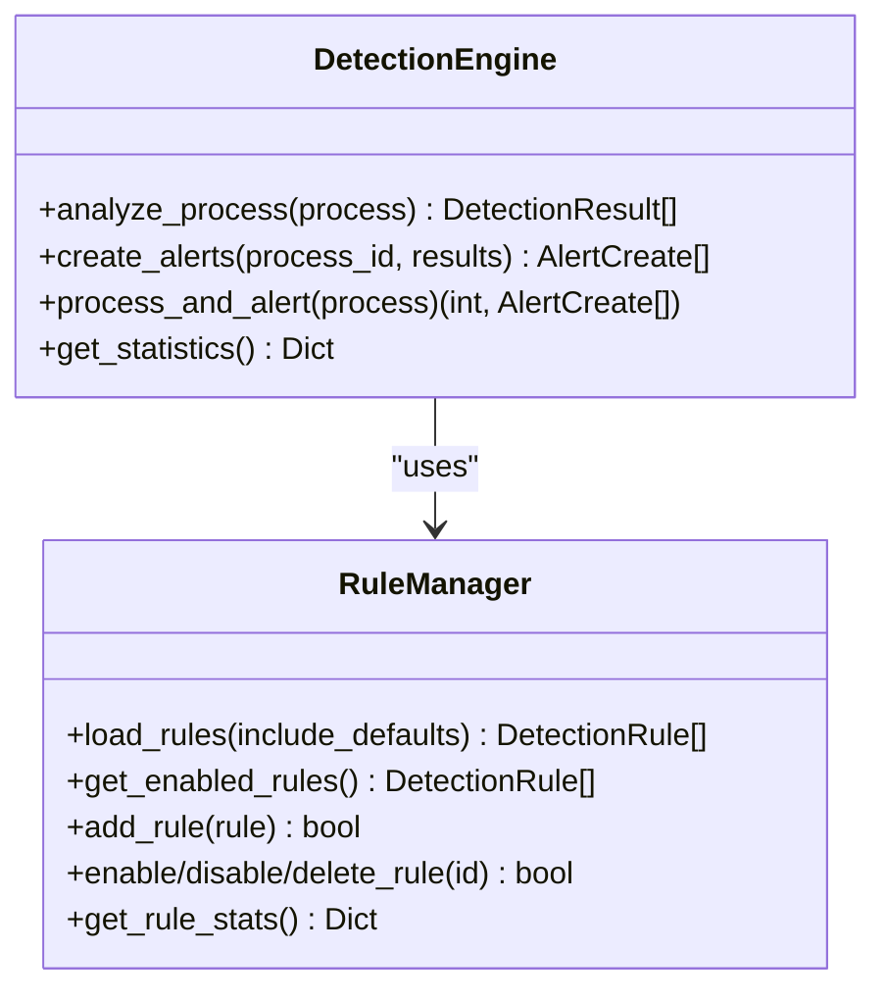
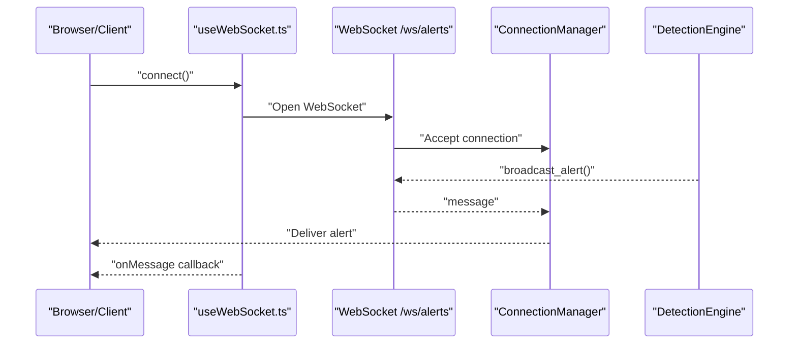
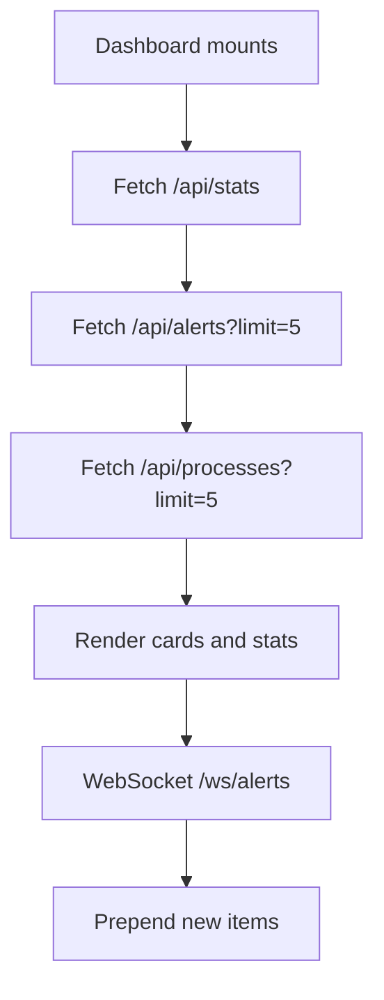
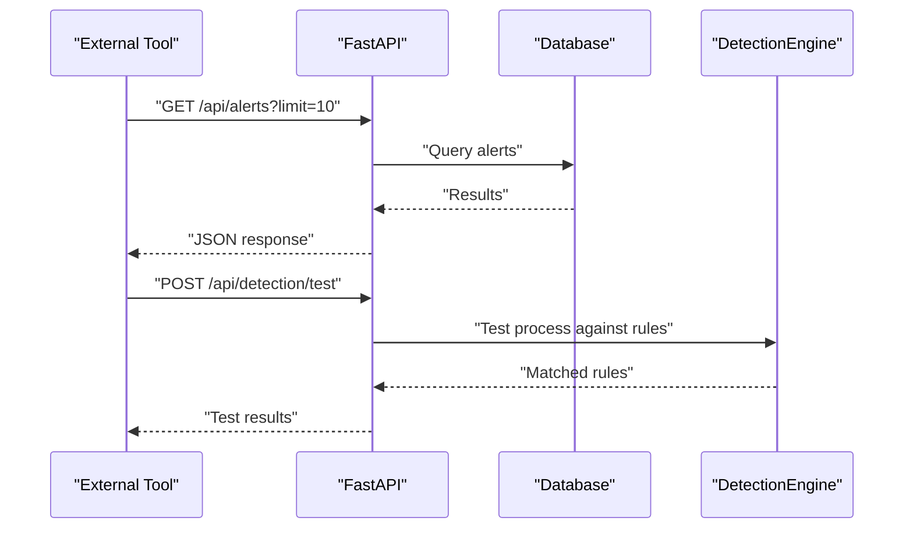
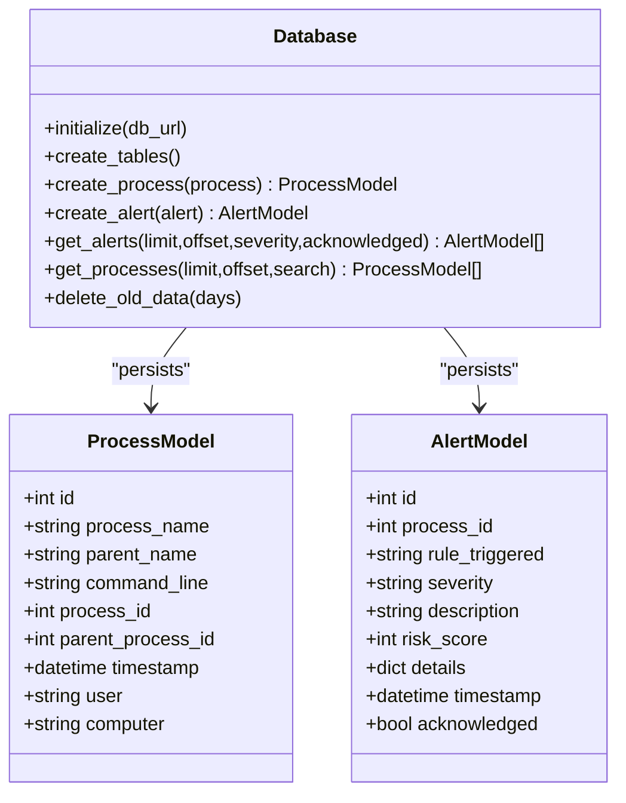
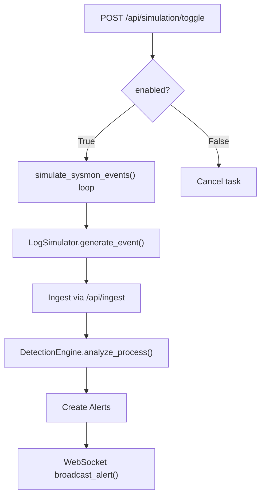
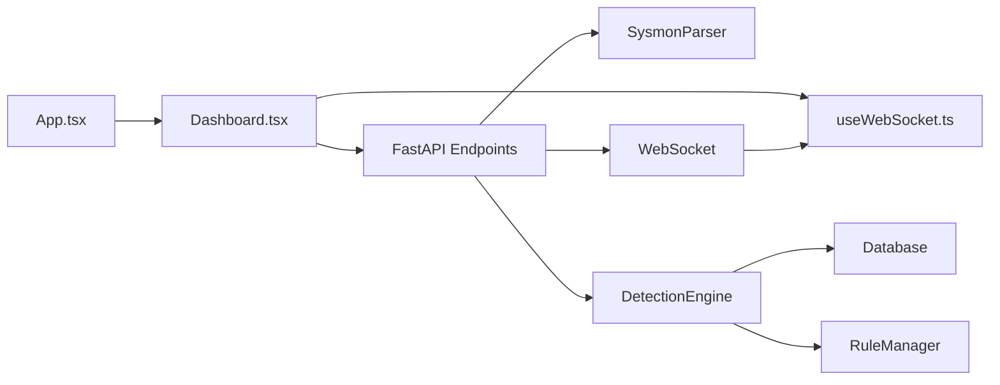

# Key Features

<cite>
**Referenced Files in This Document**
- [README.md](file://README.md)
- [backend/main.py](file://backend/main.py)
- [backend/detection/engine.py](file://backend/detection/engine.py)
- [backend/parser/sysmon_parser.py](file://backend/parser/sysmon_parser.py)
- [backend/parser/log_simulator.py](file://backend/parser/log_simulator.py)
- [backend/routes/websocket.py](file://backend/routes/websocket.py)
- [backend/database/database.py](file://backend/database/database.py)
- [backend/models/process.py](file://backend/models/process.py)
- [backend/models/alert.py](file://backend/models/alert.py)
- [backend/detection/rules.py](file://backend/detection/rules.py)
- [frontend/src/App.tsx](file://frontend/src/App.tsx)
- [frontend/src/pages/Dashboard.tsx](file://frontend/src/pages/Dashboard.tsx)
- [frontend/src/hooks/useWebSocket.ts](file://frontend/src/hooks/useWebSocket.ts)
- [sample_data/sample_sysmon_events.json](file://sample_data/sample_sysmon_events.json)
</cite>

## Table of Contents
1. [Introduction](#introduction)
2. [Project Structure](#project-structure)
3. [Core Components](#core-components)
4. [Architecture Overview](#architecture-overview)
5. [Detailed Component Analysis](#detailed-component-analysis)
6. [Dependency Analysis](#dependency-analysis)
7. [Performance Considerations](#performance-considerations)
8. [Troubleshooting Guide](#troubleshooting-guide)
9. [Conclusion](#conclusion)

## Introduction
This document presents the key features of EDR Lite, focusing on how the system monitors Windows processes in real time, applies a rule-based detection engine with JSON-driven configurations, streams live updates via WebSocket, provides a modern React dashboard with a dark theme, exposes a REST API for programmatic access, persists data with SQLite, and includes a built-in simulation mode for testing. These features combine to form a compact yet powerful endpoint monitoring and threat detection solution suitable for learning, demos, and light operational use.

## Project Structure
EDR Lite is organized into two primary layers:
- Backend: FastAPI application providing REST endpoints, WebSocket streaming, detection engine, parsers, and database integration.
- Frontend: React SPA with TypeScript, Tailwind CSS, and a dark theme, consuming REST APIs and WebSocket streams.

**Diagram sources**
- [backend/main.py:171-241](file://backend/main.py#L171-L241)
- [backend/detection/engine.py:64-120](file://backend/detection/engine.py#L64-L120)
- [backend/detection/rules.py:273-314](file://backend/detection/rules.py#L273-L314)
- [backend/parser/sysmon_parser.py:61-95](file://backend/parser/sysmon_parser.py#L61-L95)
- [backend/parser/log_simulator.py:18-37](file://backend/parser/log_simulator.py#L18-L37)
- [backend/routes/websocket.py:14-233](file://backend/routes/websocket.py#L14-L233)
- [backend/database/database.py:21-84](file://backend/database/database.py#L21-L84)
- [frontend/src/App.tsx:1-23](file://frontend/src/App.tsx#L1-L23)
- [frontend/src/pages/Dashboard.tsx:18-66](file://frontend/src/pages/Dashboard.tsx#L18-L66)
- [frontend/src/hooks/useWebSocket.ts:13-72](file://frontend/src/hooks/useWebSocket.ts#L13-L72)

**Section sources**
- [README.md:31-51](file://README.md#L31-L51)
- [backend/main.py:171-241](file://backend/main.py#L171-L241)
- [frontend/src/App.tsx:1-23](file://frontend/src/App.tsx#L1-L23)

## Core Components
- Real-time process monitoring using Windows Sysmon Event ID 1
  - Purpose: Capture process creation events to feed detection and alerting.
  - Implementation: SysmonParser supports EVTX, XML, and JSON formats; ingestion via manual endpoint and simulation mode.
  - Benefits: Comprehensive coverage of process lifecycle events for behavioral analysis.

- Rule-based detection engine with JSON-driven configurations
  - Purpose: Apply configurable detection rules to identify suspicious behaviors.
  - Implementation: DetectionEngine evaluates parent-child anomalies, command-line patterns, frequency thresholds, and behavior heuristics; RuleManager loads defaults and custom rules from JSON files.
  - Benefits: Flexible, extensible, and easy to tune for specific environments.

- WebSocket support for live streaming
  - Purpose: Push real-time alerts and process events to connected clients.
  - Implementation: WebSocket endpoints broadcast alerts and events; ConnectionManager manages clients; frontend hook handles reconnection and message parsing.
  - Benefits: Low-latency dashboards and integrations.

- Modern React dashboard with dark theme
  - Purpose: Provide a responsive, real-time UI for monitoring and managing detections.
  - Implementation: Dashboard page aggregates stats, recent alerts, and processes; uses WebSocket hook for live updates; routing configured in App.
  - Benefits: Intuitive UX for security analysts and administrators.

- REST API for programmatic access
  - Purpose: Expose endpoints for alerts, processes, detection rules, and system stats.
  - Implementation: FastAPI routes under dedicated routers; endpoints include listing, filtering, acknowledgments, and rule management.
  - Benefits: Enables automation, SIEM integration, and external tooling.

- SQLite database for lightweight persistence
  - Purpose: Persist process events and alerts with minimal setup.
  - Implementation: SQLAlchemy ORM models and sessions; automatic table creation; retention and cleanup helpers.
  - Benefits: Zero-dependency storage suitable for demos and small deployments.

- Built-in simulation mode for testing
  - Purpose: Generate realistic Sysmon events for testing detection rules and UI.
  - Implementation: LogSimulator produces normal and suspicious events; batch generation and streaming; toggling via API.
  - Benefits: Validates detection logic and demonstrates system capabilities without live traffic.

**Section sources**
- [README.md:5-13](file://README.md#L5-L13)
- [backend/parser/sysmon_parser.py:61-95](file://backend/parser/sysmon_parser.py#L61-L95)
- [backend/detection/engine.py:64-120](file://backend/detection/engine.py#L64-L120)
- [backend/detection/rules.py:273-314](file://backend/detection/rules.py#L273-L314)
- [backend/routes/websocket.py:14-233](file://backend/routes/websocket.py#L14-L233)
- [frontend/src/pages/Dashboard.tsx:18-66](file://frontend/src/pages/Dashboard.tsx#L18-L66)
- [frontend/src/hooks/useWebSocket.ts:13-72](file://frontend/src/hooks/useWebSocket.ts#L13-L72)
- [backend/database/database.py:21-84](file://backend/database/database.py#L21-L84)
- [backend/parser/log_simulator.py:18-37](file://backend/parser/log_simulator.py#L18-L37)

## Architecture Overview
The system integrates ingestion, detection, persistence, and presentation layers. Real-world or simulated Sysmon events are parsed and evaluated against detection rules, generating alerts stored in SQLite. WebSocket endpoints stream updates to the React dashboard and any external consumers.

**Diagram sources**
- [backend/main.py:243-311](file://backend/main.py#L243-L311)
- [backend/parser/sysmon_parser.py:61-95](file://backend/parser/sysmon_parser.py#L61-L95)
- [backend/detection/engine.py:272-290](file://backend/detection/engine.py#L272-L290)
- [backend/database/database.py:86-120](file://backend/database/database.py#L86-L120)
- [backend/routes/websocket.py:209-224](file://backend/routes/websocket.py#L209-L224)

## Detailed Component Analysis

### Real-time Process Monitoring (Sysmon Event ID 1)
- Purpose: Continuously capture process creation events to detect anomalous behaviors.
- Implementation:
  - SysmonParser supports multiple input formats and extracts standardized fields.
  - Manual ingestion endpoint accepts JSON payloads; simulation mode generates synthetic events.
- Practical impact:
  - Security analysts can monitor suspicious parent-child relationships and command-line patterns.
  - Administrators can track process activity and validate detection coverage.

**Diagram sources**
- [backend/parser/sysmon_parser.py:196-207](file://backend/parser/sysmon_parser.py#L196-L207)
- [backend/main.py:243-311](file://backend/main.py#L243-L311)
- [backend/detection/engine.py:84-119](file://backend/detection/engine.py#L84-L119)
- [backend/database/database.py:185-201](file://backend/database/database.py#L185-L201)
- [backend/routes/websocket.py:209-224](file://backend/routes/websocket.py#L209-L224)

**Section sources**
- [backend/parser/sysmon_parser.py:61-95](file://backend/parser/sysmon_parser.py#L61-L95)
- [backend/main.py:243-311](file://backend/main.py#L243-L311)
- [sample_data/sample_sysmon_events.json:1-194](file://sample_data/sample_sysmon_events.json#L1-L194)

### Rule-Based Detection Engine (JSON-driven)
- Purpose: Evaluate incoming process events against configurable detection rules.
- Implementation:
  - DetectionEngine runs multiple evaluation strategies (parent-child, command-line, frequency, behavior).
  - RuleManager loads default and custom rules from JSON files, compiles patterns, and maintains statistics.
- Practical impact:
  - Analysts can fine-tune detection sensitivity and severity.
  - Administrators can add domain-specific rules and export/import rule sets.

**Diagram sources**
- [backend/detection/engine.py:64-120](file://backend/detection/engine.py#L64-L120)
- [backend/detection/rules.py:273-314](file://backend/detection/rules.py#L273-L314)

**Section sources**
- [backend/detection/engine.py:64-120](file://backend/detection/engine.py#L64-L120)
- [backend/detection/rules.py:20-256](file://backend/detection/rules.py#L20-L256)

### WebSocket Support (Live Streaming)
- Purpose: Provide real-time delivery of alerts and process events to browsers and clients.
- Implementation:
  - WebSocket endpoints for alerts and events; ConnectionManager tracks clients and broadcasts messages.
  - Frontend uses a reusable hook to connect, handle reconnections, and parse messages.
- Practical impact:
  - Immediate visibility into threats and process activity.
  - Enables building custom integrations and dashboards.

**Diagram sources**
- [frontend/src/hooks/useWebSocket.ts:13-72](file://frontend/src/hooks/useWebSocket.ts#L13-L72)
- [backend/routes/websocket.py:68-119](file://backend/routes/websocket.py#L68-L119)
- [backend/routes/websocket.py:209-224](file://backend/routes/websocket.py#L209-L224)

**Section sources**
- [backend/routes/websocket.py:14-233](file://backend/routes/websocket.py#L14-L233)
- [frontend/src/hooks/useWebSocket.ts:13-72](file://frontend/src/hooks/useWebSocket.ts#L13-L72)

### Modern React Dashboard (Dark Theme)
- Purpose: Present system stats, recent alerts, and processes in a responsive, dark-themed UI.
- Implementation:
  - Routing configured in App; Dashboard page fetches stats and recent items, subscribes to WebSocket for live updates.
  - Components for cards and status indicators; layout and styling via Tailwind CSS.
- Practical impact:
  - Analysts can triage incidents quickly with live feeds.
  - Administrators can monitor system health and rule effectiveness.

**Diagram sources**
- [frontend/src/pages/Dashboard.tsx:25-66](file://frontend/src/pages/Dashboard.tsx#L25-L66)
- [frontend/src/App.tsx:1-23](file://frontend/src/App.tsx#L1-L23)

**Section sources**
- [frontend/src/pages/Dashboard.tsx:18-66](file://frontend/src/pages/Dashboard.tsx#L18-L66)
- [frontend/src/App.tsx:1-23](file://frontend/src/App.tsx#L1-L23)

### REST API (Programmatic Access)
- Purpose: Enable external systems to integrate with EDR Lite for alerts, processes, and detection rule management.
- Implementation:
  - Endpoints include listing alerts and processes, retrieving specific items, acknowledging alerts, rule CRUD, and system stats.
  - API docs served at /docs.
- Practical impact:
  - Automate incident response workflows.
  - Build custom dashboards and integrate with SIEM/SOAR platforms.

**Diagram sources**
- [backend/main.py:195-241](file://backend/main.py#L195-L241)
- [backend/database/database.py:217-246](file://backend/database/database.py#L217-L246)
- [backend/detection/engine.py:310-324](file://backend/detection/engine.py#L310-L324)

**Section sources**
- [README.md:119-141](file://README.md#L119-L141)
- [backend/main.py:195-241](file://backend/main.py#L195-L241)

### SQLite Database (Lightweight Persistence)
- Purpose: Persist process events and alerts with minimal overhead.
- Implementation:
  - SQLAlchemy ORM models for processes and alerts; sessions for sync and async operations.
  - Automatic table creation and helper methods for queries and cleanup.
- Practical impact:
  - Reliable historical data for trend analysis and forensics.
  - Easy deployment without external databases.

**Diagram sources**
- [backend/database/database.py:21-84](file://backend/database/database.py#L21-L84)
- [backend/models/process.py:15-29](file://backend/models/process.py#L15-L29)
- [backend/models/alert.py:24-38](file://backend/models/alert.py#L24-L38)

**Section sources**
- [backend/database/database.py:21-84](file://backend/database/database.py#L21-L84)
- [backend/models/process.py:15-29](file://backend/models/process.py#L15-L29)
- [backend/models/alert.py:24-38](file://backend/models/alert.py#L24-L38)

### Built-in Simulation Mode (Testing)
- Purpose: Generate realistic Sysmon events for testing detection rules and validating the UI.
- Implementation:
  - LogSimulator creates normal and suspicious events; batch and streaming modes; toggle endpoint to enable/disable.
- Practical impact:
  - Validate detection accuracy and rule tuning.
  - Demonstrate system capabilities to stakeholders.

**Diagram sources**
- [backend/main.py:60-118](file://backend/main.py#L60-L118)
- [backend/parser/log_simulator.py:138-150](file://backend/parser/log_simulator.py#L138-L150)
- [backend/main.py:243-311](file://backend/main.py#L243-L311)
- [backend/routes/websocket.py:209-224](file://backend/routes/websocket.py#L209-L224)

**Section sources**
- [backend/main.py:60-118](file://backend/main.py#L60-L118)
- [backend/parser/log_simulator.py:18-37](file://backend/parser/log_simulator.py#L18-L37)
- [README.md:224-232](file://README.md#L224-L232)

## Dependency Analysis
The system exhibits clear separation of concerns:
- Backend orchestrates ingestion, detection, persistence, and streaming.
- Frontend consumes REST and WebSocket for a cohesive UI.
- Models define data contracts for both layers.

**Diagram sources**
- [frontend/src/App.tsx:1-23](file://frontend/src/App.tsx#L1-L23)
- [frontend/src/pages/Dashboard.tsx:18-66](file://frontend/src/pages/Dashboard.tsx#L18-L66)
- [frontend/src/hooks/useWebSocket.ts:13-72](file://frontend/src/hooks/useWebSocket.ts#L13-L72)
- [backend/main.py:171-241](file://backend/main.py#L171-L241)
- [backend/parser/sysmon_parser.py:61-95](file://backend/parser/sysmon_parser.py#L61-L95)
- [backend/detection/engine.py:64-120](file://backend/detection/engine.py#L64-L120)
- [backend/database/database.py:21-84](file://backend/database/database.py#L21-L84)
- [backend/detection/rules.py:273-314](file://backend/detection/rules.py#L273-L314)
- [backend/routes/websocket.py:14-233](file://backend/routes/websocket.py#L14-L233)

**Section sources**
- [backend/main.py:171-241](file://backend/main.py#L171-L241)
- [frontend/src/App.tsx:1-23](file://frontend/src/App.tsx#L1-L23)

## Performance Considerations
- DetectionEngine tracks statistics and uses thread-safe frequency tracking to compute counts per parent within time windows.
- WebSocket broadcasting cleans up disconnected clients and sends periodic heartbeats to maintain liveness.
- SQLite is optimized for simplicity; for higher throughput, consider migrating to a server-grade database and enabling indexing on frequently queried fields.

[No sources needed since this section provides general guidance]

## Troubleshooting Guide
- WebSocket disconnections:
  - The frontend hook attempts reconnection with exponential backoff; verify network connectivity and server logs.
- Simulation mode not generating events:
  - Confirm simulation mode is enabled and the background task is running; use the toggle endpoint to enable/disable.
- API returns errors:
  - Check environment variables (e.g., database URL) and ensure the server is healthy via the health endpoint.
- Missing or stale data:
  - Use the REST endpoints to list alerts and processes; confirm WebSocket subscriptions are active.

**Section sources**
- [frontend/src/hooks/useWebSocket.ts:74-102](file://frontend/src/hooks/useWebSocket.ts#L74-L102)
- [backend/main.py:339-358](file://backend/main.py#L339-L358)
- [backend/main.py:214-223](file://backend/main.py#L214-L223)

## Conclusion
EDR Lite’s key features—real-time Sysmon monitoring, JSON-driven detection rules, WebSocket streaming, a modern React dashboard, REST API, SQLite persistence, and simulation mode—work together to deliver a cohesive endpoint monitoring solution. These capabilities enable security analysts to triage incidents in real time and administrators to validate detection logic and monitor system behavior effectively.