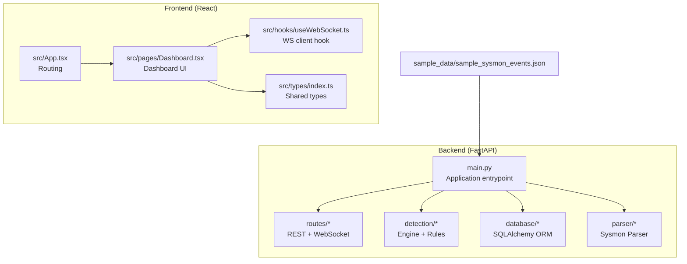
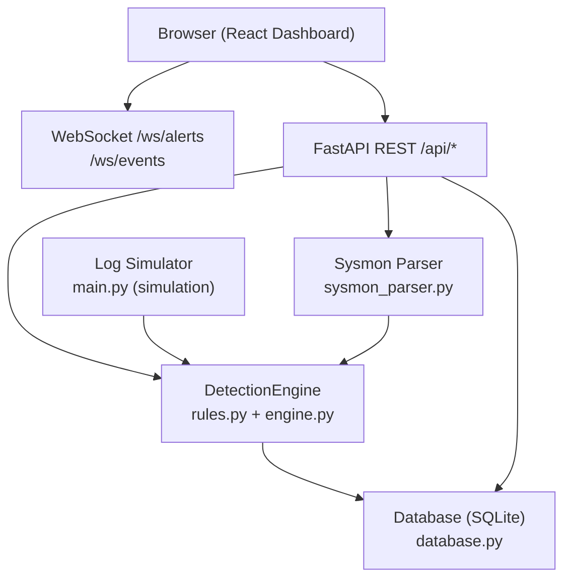
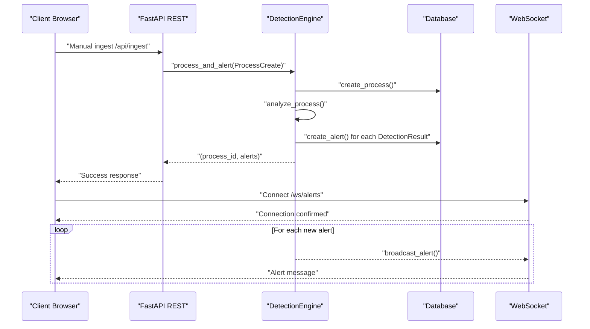
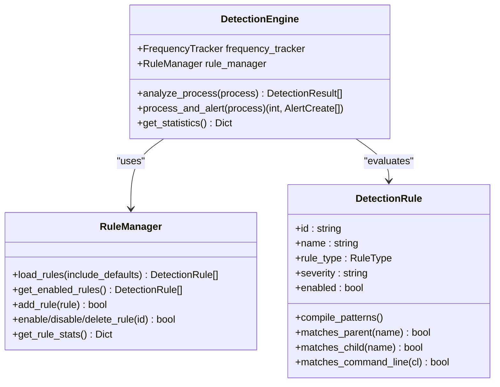
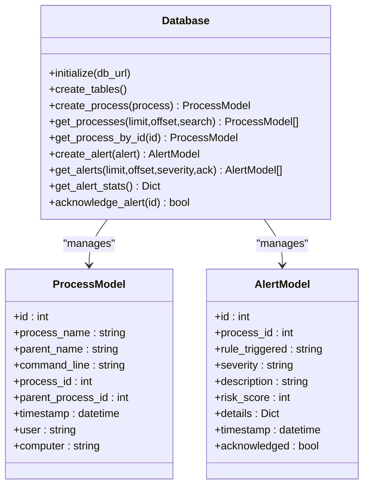
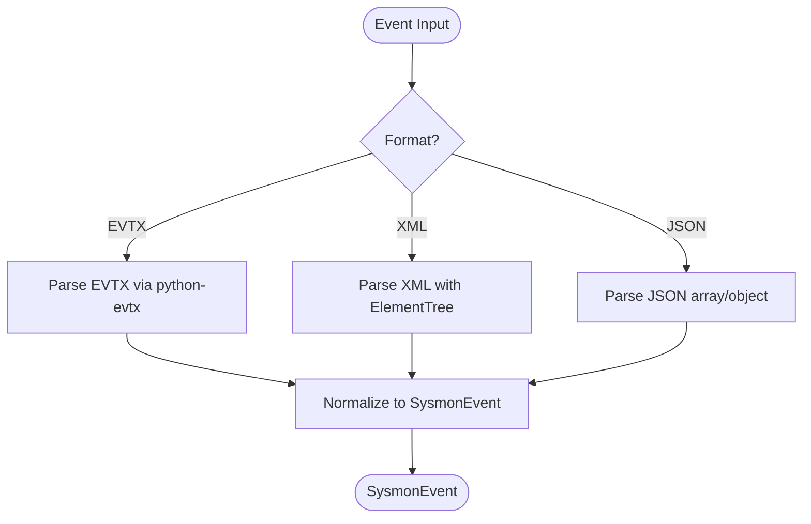
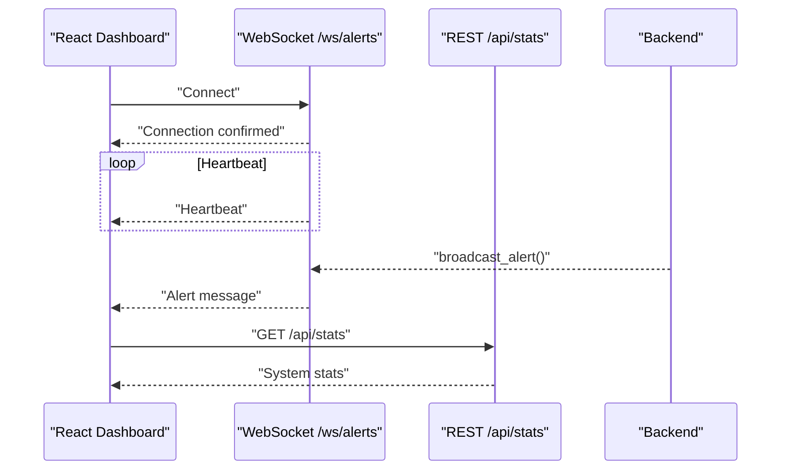
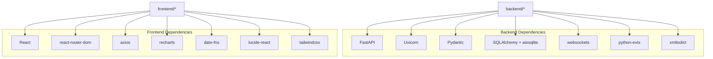

# Project Overview

<cite>
**Referenced Files in This Document**
- [README.md](file://README.md)
- [backend/main.py](file://backend/main.py)
- [backend/requirements.txt](file://backend/requirements.txt)
- [backend/database/database.py](file://backend/database/database.py)
- [backend/detection/engine.py](file://backend/detection/engine.py)
- [backend/detection/rules.py](file://backend/detection/rules.py)
- [backend/parser/sysmon_parser.py](file://backend/parser/sysmon_parser.py)
- [backend/routes/websocket.py](file://backend/routes/websocket.py)
- [backend/models/process.py](file://backend/models/process.py)
- [backend/models/alert.py](file://backend/models/alert.py)
- [backend/models/detection.py](file://backend/models/detection.py)
- [frontend/package.json](file://frontend/package.json)
- [frontend/src/App.tsx](file://frontend/src/App.tsx)
- [frontend/src/pages/Dashboard.tsx](file://frontend/src/pages/Dashboard.tsx)
- [frontend/src/hooks/useWebSocket.ts](file://frontend/src/hooks/useWebSocket.ts)
- [frontend/src/types/index.ts](file://frontend/src/types/index.ts)
- [sample_data/sample_sysmon_events.json](file://sample_data/sample_sysmon_events.json)
</cite>

## Table of Contents
1. [Introduction](#introduction)
2. [Project Structure](#project-structure)
3. [Core Components](#core-components)
4. [Architecture Overview](#architecture-overview)
5. [Detailed Component Analysis](#detailed-component-analysis)
6. [Dependency Analysis](#dependency-analysis)
7. [Performance Considerations](#performance-considerations)
8. [Troubleshooting Guide](#troubleshooting-guide)
9. [Conclusion](#conclusion)

## Introduction
EDR Lite is a real-time endpoint detection and response (EDR) platform designed to monitor Windows Sysmon Event ID 1 (Process Creation) events. It provides a rule-based detection engine, WebSocket-powered live streaming, and a modern React dashboard for visualizing alerts and process events. The system persists data in SQLite and supports both manual ingestion and simulation modes for demonstration and testing.

Key cybersecurity monitoring workflows supported by EDR Lite include:
- Parent-child anomaly detection (e.g., email clients spawning shells)
- Command line analysis (e.g., encoded PowerShell, download cradles, LOLBAS techniques)
- Frequency-based threat detection (e.g., rapid process spawning)

The platform targets security teams needing a lightweight, extensible EDR solution for Windows environments, with a focus on observability, rule-driven detection, and real-time visibility.

**Section sources**
- [README.md:1-307](file://README.md#L1-L307)

## Project Structure
The repository is organized into two primary areas:
- backend: FastAPI application with routing, detection, database, parser, and WebSocket modules
- frontend: React-based dashboard with TypeScript, Tailwind CSS, and Vite tooling
- sample_data: Example Sysmon events for testing and demonstration

**Diagram sources**
- [backend/main.py:1-705](file://backend/main.py#L1-L705)
- [frontend/src/App.tsx:1-23](file://frontend/src/App.tsx#L1-L23)
- [frontend/src/pages/Dashboard.tsx:1-208](file://frontend/src/pages/Dashboard.tsx#L1-L208)
- [frontend/src/hooks/useWebSocket.ts:1-103](file://frontend/src/hooks/useWebSocket.ts#L1-L103)
- [frontend/src/types/index.ts:1-83](file://frontend/src/types/index.ts#L1-L83)
- [sample_data/sample_sysmon_events.json:1-194](file://sample_data/sample_sysmon_events.json#L1-L194)

**Section sources**
- [README.md:31-51](file://README.md#L31-L51)
- [backend/requirements.txt:1-14](file://backend/requirements.txt#L1-L14)
- [frontend/package.json:1-46](file://frontend/package.json#L1-L46)

## Core Components
- FastAPI backend with REST endpoints and WebSocket streaming
- Detection engine implementing rule-based matching across multiple detection categories
- SQLite-backed persistence for processes and alerts
- Sysmon log parser supporting EVTX, XML, and JSON formats
- React dashboard with real-time updates via WebSocket and REST APIs

Capabilities:
- Real-time monitoring of process creation events
- Rule-driven detection with configurable severity and risk scoring
- Live alert and event streaming
- Simulation mode for testing and demonstration
- REST endpoints for alerts, processes, detection rules, and statistics

**Section sources**
- [README.md:5-30](file://README.md#L5-L30)
- [backend/main.py:171-241](file://backend/main.py#L171-L241)
- [backend/database/database.py:21-84](file://backend/database/database.py#L21-L84)
- [backend/detection/engine.py:64-120](file://backend/detection/engine.py#L64-L120)
- [backend/parser/sysmon_parser.py:61-95](file://backend/parser/sysmon_parser.py#L61-L95)

## Architecture Overview
EDR Lite’s architecture combines a FastAPI backend with a React frontend. The backend ingests Sysmon events (via manual ingestion or simulation), runs them through the detection engine, persists results, and streams updates to WebSocket clients. The frontend consumes both REST and WebSocket feeds to present a modern, dark-themed dashboard.

**Diagram sources**
- [backend/main.py:60-118](file://backend/main.py#L60-L118)
- [backend/detection/engine.py:84-120](file://backend/detection/engine.py#L84-L120)
- [backend/database/database.py:85-216](file://backend/database/database.py#L85-L216)
- [backend/parser/sysmon_parser.py:96-195](file://backend/parser/sysmon_parser.py#L96-L195)
- [backend/routes/websocket.py:68-167](file://backend/routes/websocket.py#L68-L167)

## Detailed Component Analysis

### Backend Application Lifecycle and Streaming
The backend initializes the database, detection engine, and optional log simulator. It exposes REST endpoints for ingestion and statistics, and WebSocket endpoints for live alert and event streaming. Background tasks simulate Sysmon events when enabled.

**Diagram sources**
- [backend/main.py:243-311](file://backend/main.py#L243-L311)
- [backend/detection/engine.py:272-291](file://backend/detection/engine.py#L272-L291)
- [backend/database/database.py:86-216](file://backend/database/database.py#L86-L216)
- [backend/routes/websocket.py:209-224](file://backend/routes/websocket.py#L209-L224)

**Section sources**
- [backend/main.py:120-169](file://backend/main.py#L120-L169)
- [backend/main.py:313-358](file://backend/main.py#L313-L358)
- [backend/routes/websocket.py:68-167](file://backend/routes/websocket.py#L68-L167)

### Detection Engine and Rule Management
The detection engine evaluates incoming process events against a collection of rules. It supports multiple rule types (parent-child, command line, frequency, behavior) and maintains statistics and risk scores. Rules are compiled and persisted in memory, with optional file-based persistence for custom rules.

**Diagram sources**
- [backend/detection/engine.py:64-120](file://backend/detection/engine.py#L64-L120)
- [backend/detection/engine.py:121-251](file://backend/detection/engine.py#L121-L251)
- [backend/detection/rules.py:273-314](file://backend/detection/rules.py#L273-L314)
- [backend/detection/rules.py:342-406](file://backend/detection/rules.py#L342-L406)
- [backend/models/detection.py:17-92](file://backend/models/detection.py#L17-L92)

**Section sources**
- [backend/detection/engine.py:64-120](file://backend/detection/engine.py#L64-L120)
- [backend/detection/engine.py:272-291](file://backend/detection/engine.py#L272-L291)
- [backend/detection/rules.py:20-256](file://backend/detection/rules.py#L20-L256)
- [backend/models/detection.py:8-15](file://backend/models/detection.py#L8-L15)

### Database Layer and Persistence
The database module provides synchronous and asynchronous SQLAlchemy sessions, with models for processes and alerts. It supports CRUD operations, filtering, and statistics aggregation.

**Diagram sources**
- [backend/database/database.py:21-84](file://backend/database/database.py#L21-L84)
- [backend/database/database.py:85-216](file://backend/database/database.py#L85-L216)
- [backend/models/process.py:15-29](file://backend/models/process.py#L15-L29)
- [backend/models/alert.py:24-38](file://backend/models/alert.py#L24-L38)

**Section sources**
- [backend/database/database.py:21-84](file://backend/database/database.py#L21-L84)
- [backend/database/database.py:85-216](file://backend/database/database.py#L85-L216)
- [backend/models/process.py:15-29](file://backend/models/process.py#L15-L29)
- [backend/models/alert.py:24-38](file://backend/models/alert.py#L24-L38)

### Sysmon Parser and Event Formats
The Sysmon parser supports multiple input formats (EVTX, XML, JSON) and normalizes them into a unified event structure suitable for detection evaluation.

**Diagram sources**
- [backend/parser/sysmon_parser.py:96-195](file://backend/parser/sysmon_parser.py#L96-L195)
- [backend/parser/sysmon_parser.py:208-327](file://backend/parser/sysmon_parser.py#L208-L327)

**Section sources**
- [backend/parser/sysmon_parser.py:61-95](file://backend/parser/sysmon_parser.py#L61-L95)
- [backend/parser/sysmon_parser.py:96-195](file://backend/parser/sysmon_parser.py#L96-L195)
- [sample_data/sample_sysmon_events.json:1-194](file://sample_data/sample_sysmon_events.json#L1-L194)

### WebSocket Streaming and Frontend Integration
WebSocket endpoints broadcast alerts and process events to connected clients. The React dashboard connects to these endpoints and also polls REST endpoints for periodic updates.

**Diagram sources**
- [backend/routes/websocket.py:68-167](file://backend/routes/websocket.py#L68-L167)
- [backend/routes/websocket.py:209-233](file://backend/routes/websocket.py#L209-L233)
- [frontend/src/pages/Dashboard.tsx:25-65](file://frontend/src/pages/Dashboard.tsx#L25-L65)
- [frontend/src/hooks/useWebSocket.ts:27-72](file://frontend/src/hooks/useWebSocket.ts#L27-L72)

**Section sources**
- [backend/routes/websocket.py:68-167](file://backend/routes/websocket.py#L68-L167)
- [frontend/src/pages/Dashboard.tsx:45-58](file://frontend/src/pages/Dashboard.tsx#L45-L58)
- [frontend/src/hooks/useWebSocket.ts:13-72](file://frontend/src/hooks/useWebSocket.ts#L13-L72)

### Practical Monitoring Scenarios
Common detection scenarios implemented by EDR Lite include:
- Parent-child anomaly detection: Email clients spawning shells, browsers spawning scripting engines, system processes spawning suspicious children
- Command line analysis: Encoded PowerShell commands, download cradles, LOLBAS technique detection
- Frequency-based threat detection: Rapid process spawning and threshold-based anomaly detection

These scenarios are driven by the built-in detection rules and can be extended or customized via JSON rule files.

**Section sources**
- [README.md:15-30](file://README.md#L15-L30)
- [backend/detection/rules.py:20-256](file://backend/detection/rules.py#L20-L256)

## Dependency Analysis
External dependencies include FastAPI, Uvicorn, Pydantic, SQLAlchemy, aiosqlite, websockets, and libraries for parsing Sysmon logs. The frontend depends on React, React Router, Axios, Recharts, and Tailwind CSS.

**Diagram sources**
- [backend/requirements.txt:1-14](file://backend/requirements.txt#L1-L14)
- [frontend/package.json:5-14](file://frontend/package.json#L5-L14)

**Section sources**
- [backend/requirements.txt:1-14](file://backend/requirements.txt#L1-L14)
- [frontend/package.json:1-46](file://frontend/package.json#L1-L46)

## Performance Considerations
- SQLite is lightweight and suitable for demonstration but may require migration to a production database (e.g., PostgreSQL) for high-volume deployments.
- WebSocket broadcasting is optimized to clean up disconnected clients and send heartbeat messages to maintain liveness.
- The detection engine tracks statistics and uses thread-safe frequency tracking for anomaly detection.
- Consider enabling HTTPS and adding authentication/authorization for production deployments.

[No sources needed since this section provides general guidance]

## Troubleshooting Guide
- Health checks: Use the health endpoint to verify database connectivity and engine status.
- Simulation mode: Toggle simulation on/off and adjust the interval for generating synthetic events.
- WebSocket connectivity: The React hook handles reconnection attempts and logs errors; inspect browser console for connection issues.
- Data retention: Old data can be pruned by deleting entries older than a specified number of days.

**Section sources**
- [backend/main.py:214-224](file://backend/main.py#L214-L224)
- [backend/main.py:339-358](file://backend/main.py#L339-L358)
- [backend/database/database.py:296-309](file://backend/database/database.py#L296-L309)
- [frontend/src/hooks/useWebSocket.ts:27-72](file://frontend/src/hooks/useWebSocket.ts#L27-L72)

## Conclusion
EDR Lite delivers a practical, rule-driven EDR platform tailored for Windows environments. Its combination of Sysmon event ingestion, a flexible detection engine, real-time streaming, and a modern dashboard makes it suitable for both learning and operational use. By leveraging JSON-based detection rules, SQLite persistence, and WebSocket streaming, it provides a foundation for building robust endpoint monitoring workflows.

[No sources needed since this section summarizes without analyzing specific files]