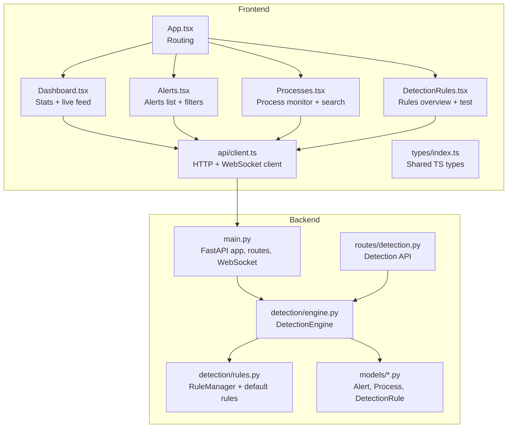
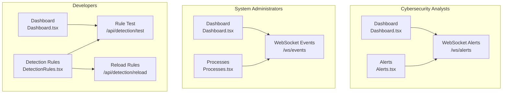
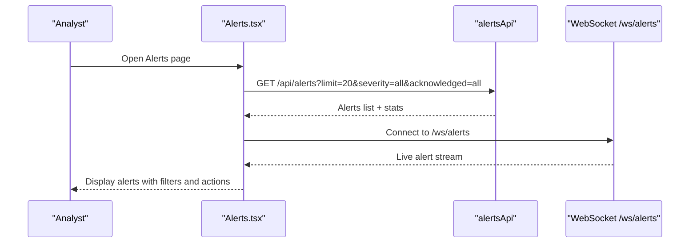
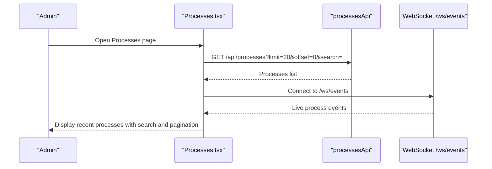
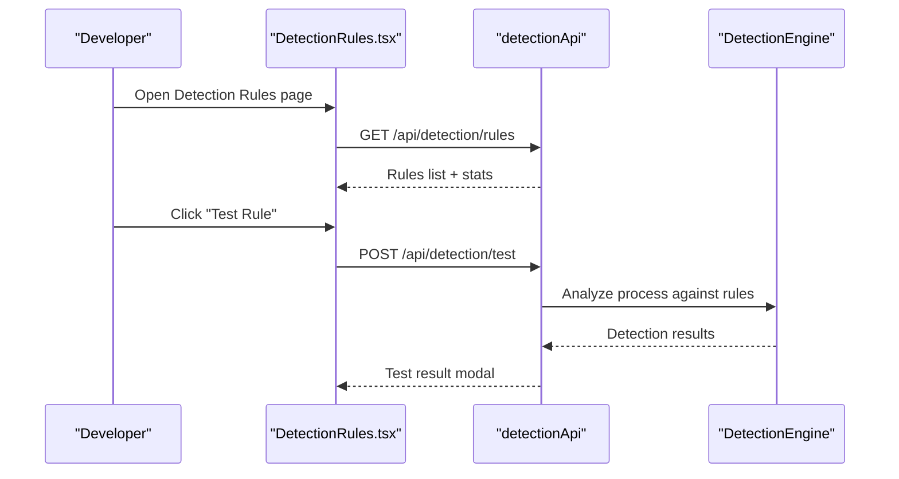
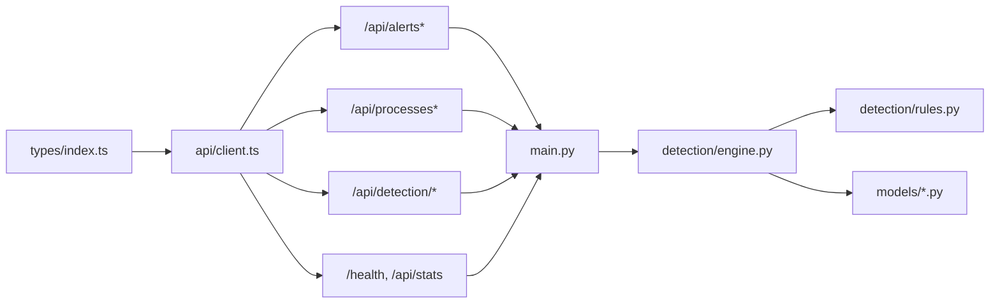

# Target Audience

<cite>
**Referenced Files in This Document**
- [README.md](file://README.md)
- [backend/main.py](file://backend/main.py)
- [backend/detection/engine.py](file://backend/detection/engine.py)
- [backend/detection/rules.py](file://backend/detection/rules.py)
- [backend/routes/detection.py](file://backend/routes/detection.py)
- [backend/models/alert.py](file://backend/models/alert.py)
- [backend/models/process.py](file://backend/models/process.py)
- [backend/models/detection.py](file://backend/models/detection.py)
- [frontend/src/App.tsx](file://frontend/src/App.tsx)
- [frontend/src/pages/Dashboard.tsx](file://frontend/src/pages/Dashboard.tsx)
- [frontend/src/pages/Alerts.tsx](file://frontend/src/pages/Alerts.tsx)
- [frontend/src/pages/Processes.tsx](file://frontend/src/pages/Processes.tsx)
- [frontend/src/pages/DetectionRules.tsx](file://frontend/src/pages/DetectionRules.tsx)
- [frontend/src/api/client.ts](file://frontend/src/api/client.ts)
- [frontend/src/types/index.ts](file://frontend/src/types/index.ts)
</cite>

## Table of Contents
1. [Introduction](#introduction)
2. [Project Structure](#project-structure)
3. [Core Components](#core-components)
4. [Architecture Overview](#architecture-overview)
5. [Detailed Component Analysis](#detailed-component-analysis)
6. [Dependency Analysis](#dependency-analysis)
7. [Performance Considerations](#performance-considerations)
8. [Troubleshooting Guide](#troubleshooting-guide)
9. [Conclusion](#conclusion)

## Introduction
This document describes the target audiences for EDR Lite and how each group can use the system’s features. It focuses on:
- Cybersecurity professionals and security analysts needing real-time endpoint monitoring and alert triage
- System administrators who want to monitor system health and analyze process activity
- Developers extending detection capabilities or integrating EDR Lite with other security tools

It also outlines skill expectations, typical use cases, and considerations for demonstrations versus production deployments.

## Project Structure
EDR Lite comprises:
- A FastAPI backend exposing REST APIs and WebSocket streams for live alerts and events
- A React-based frontend dashboard with pages for alerts, processes, detection rules, and a dashboard overview
- A detection engine with JSON-driven rules supporting parent-child anomalies, command-line analysis, and frequency thresholds
- A lightweight database for storing alerts and process events

**Diagram sources**
- [backend/main.py:171-192](file://backend/main.py#L171-L192)
- [backend/detection/engine.py:64-83](file://backend/detection/engine.py#L64-L83)
- [backend/detection/rules.py:273-313](file://backend/detection/rules.py#L273-L313)
- [backend/routes/detection.py:14-27](file://backend/routes/detection.py#L14-L27)
- [frontend/src/App.tsx:9-21](file://frontend/src/App.tsx#L9-L21)
- [frontend/src/pages/Dashboard.tsx:18-66](file://frontend/src/pages/Dashboard.tsx#L18-L66)
- [frontend/src/pages/Alerts.tsx:11-62](file://frontend/src/pages/Alerts.tsx#L11-L62)
- [frontend/src/pages/Processes.tsx:8-46](file://frontend/src/pages/Processes.tsx#L8-L46)
- [frontend/src/pages/DetectionRules.tsx:6-32](file://frontend/src/pages/DetectionRules.tsx#L6-L32)
- [frontend/src/api/client.ts:13-124](file://frontend/src/api/client.ts#L13-L124)
- [frontend/src/types/index.ts:1-83](file://frontend/src/types/index.ts#L1-L83)

**Section sources**
- [README.md:31-51](file://README.md#L31-L51)
- [backend/main.py:171-192](file://backend/main.py#L171-L192)
- [frontend/src/App.tsx:9-21](file://frontend/src/App.tsx#L9-L21)

## Core Components
- Real-time monitoring and alerts
  - WebSocket endpoints stream live alerts and process events to the dashboard
  - REST endpoints expose alerts, processes, and detection rules
- Detection engine
  - Rule-based engine evaluates process events against parent-child, command-line, frequency, behavior, and anomaly rules
  - Built-in default rules cover common attack patterns (e.g., phishing, LOLBAS, rapid spawning)
- Dashboard and pages
  - Dashboard: overview stats, recent alerts, and recent processes
  - Alerts: filterable list with acknowledgment and bulk actions
  - Processes: searchable list and pagination
  - Detection Rules: rules overview, enable/disable, and rule testing

**Section sources**
- [README.md:5-14](file://README.md#L5-L14)
- [backend/main.py:136-149](file://backend/main.py#L136-L149)
- [backend/detection/engine.py:84-119](file://backend/detection/engine.py#L84-L119)
- [backend/detection/rules.py:257-271](file://backend/detection/rules.py#L257-L271)
- [frontend/src/pages/Dashboard.tsx:18-66](file://frontend/src/pages/Dashboard.tsx#L18-L66)
- [frontend/src/pages/Alerts.tsx:11-62](file://frontend/src/pages/Alerts.tsx#L11-L62)
- [frontend/src/pages/Processes.tsx:8-46](file://frontend/src/pages/Processes.tsx#L8-L46)
- [frontend/src/pages/DetectionRules.tsx:6-32](file://frontend/src/pages/DetectionRules.tsx#L6-L32)

## Architecture Overview
The system supports three primary user journeys mapped to distinct dashboards and APIs.

**Diagram sources**
- [backend/main.py:361-367](file://backend/main.py#L361-L367)
- [backend/main.py:136-149](file://backend/main.py#L136-L149)
- [frontend/src/pages/Dashboard.tsx:18-66](file://frontend/src/pages/Dashboard.tsx#L18-L66)
- [frontend/src/pages/Alerts.tsx:11-62](file://frontend/src/pages/Alerts.tsx#L11-L62)
- [frontend/src/pages/Processes.tsx:8-46](file://frontend/src/pages/Processes.tsx#L8-L46)
- [frontend/src/pages/DetectionRules.tsx:6-32](file://frontend/src/pages/DetectionRules.tsx#L6-L32)
- [backend/routes/detection.py:168-231](file://backend/routes/detection.py#L168-L231)

## Detailed Component Analysis

### Cybersecurity Professionals and Security Analysts
Primary use cases:
- Real-time alert monitoring and triage
- Investigating suspicious process behaviors
- Tuning detection rules and validating effectiveness

Key features and pages:
- Dashboard overview with total alerts, high severity, processes analyzed, and active rules
- Alerts page with severity/status filters, bulk acknowledgment, and pagination
- WebSocket live feed for immediate alert visibility
- Detection Rules page for enabling/disabling rules and testing

Skill level expectations:
- Familiarity with endpoint security concepts (process trees, parent-child relationships, command-line analysis)
- Basic understanding of JSON rule configuration and REST APIs
- Ability to interpret risk scores and severities

Demonstration vs. production considerations:
- Demonstrations: leverage built-in simulation and default rules; use the dashboard and alerts pages for quick inspection
- Production: harden authentication/authorization, switch to a production database, enable HTTPS, and manage rule lifecycles via API

**Diagram sources**
- [frontend/src/pages/Alerts.tsx:21-62](file://frontend/src/pages/Alerts.tsx#L21-L62)
- [frontend/src/api/client.ts:13-38](file://frontend/src/api/client.ts#L13-L38)
- [backend/main.py:136-149](file://backend/main.py#L136-L149)

**Section sources**
- [README.md:15-30](file://README.md#L15-L30)
- [frontend/src/pages/Dashboard.tsx:18-66](file://frontend/src/pages/Dashboard.tsx#L18-L66)
- [frontend/src/pages/Alerts.tsx:11-62](file://frontend/src/pages/Alerts.tsx#L11-L62)
- [backend/routes/detection.py:44-71](file://backend/routes/detection.py#L44-L71)

### System Administrators
Primary use cases:
- System health monitoring
- Investigating unusual process activity and suspicious command-lines
- Using the dashboard to track overall system activity

Key features and pages:
- Dashboard overview for system-wide stats
- Processes page for searching and browsing recent process events
- WebSocket live feed for events
- REST endpoints for retrieving recent processes and stats

Skill level expectations:
- Basic familiarity with Windows processes and Sysmon event concepts
- Comfortable with dashboards and filtering/searching
- Understanding of risk scores and severity helps prioritize

Demonstration vs. production considerations:
- Demonstrations: use the built-in simulator and default rules
- Production: ingest real Sysmon events, configure persistent storage, and secure access

**Diagram sources**
- [frontend/src/pages/Processes.tsx:15-46](file://frontend/src/pages/Processes.tsx#L15-L46)
- [frontend/src/api/client.ts:40-62](file://frontend/src/api/client.ts#L40-L62)
- [backend/main.py:136-149](file://backend/main.py#L136-L149)

**Section sources**
- [README.md:15-30](file://README.md#L15-L30)
- [frontend/src/pages/Dashboard.tsx:18-66](file://frontend/src/pages/Dashboard.tsx#L18-L66)
- [frontend/src/pages/Processes.tsx:8-46](file://frontend/src/pages/Processes.tsx#L8-L46)
- [backend/models/process.py:22-29](file://backend/models/process.py#L22-L29)

### Developers
Primary use cases:
- Extending detection capabilities via custom rules
- Integrating EDR Lite with external SIEM/security tools
- Validating and tuning detection logic

Key features and APIs:
- Detection Rules page for rule overview and testing
- REST endpoints for rule CRUD, testing, and reloading
- WebSocket streams for real-time integration
- TypeScript types for consistent integrations

Skill level expectations:
- Proficiency in JSON rule definition and REST API consumption
- Understanding of detection rule types (parent-child, command-line, frequency, behavior)
- Familiarity with WebSocket connections for real-time data

Demonstration vs. production considerations:
- Demonstrations: use the built-in simulator and default rules; test via UI and API
- Production: deploy a production-grade backend, manage rule persistence, and secure endpoints

**Diagram sources**
- [frontend/src/pages/DetectionRules.tsx:6-32](file://frontend/src/pages/DetectionRules.tsx#L6-L32)
- [frontend/src/api/client.ts:64-104](file://frontend/src/api/client.ts#L64-L104)
- [backend/routes/detection.py:168-231](file://backend/routes/detection.py#L168-L231)
- [backend/detection/engine.py:84-119](file://backend/detection/engine.py#L84-L119)

**Section sources**
- [README.md:142-189](file://README.md#L142-L189)
- [backend/detection/rules.py:257-271](file://backend/detection/rules.py#L257-L271)
- [backend/routes/detection.py:44-71](file://backend/routes/detection.py#L44-L71)
- [frontend/src/pages/DetectionRules.tsx:6-32](file://frontend/src/pages/DetectionRules.tsx#L6-L32)
- [frontend/src/api/client.ts:64-104](file://frontend/src/api/client.ts#L64-L104)

## Dependency Analysis
The frontend depends on the backend for data and WebSocket streams. The backend’s detection engine and rule manager encapsulate detection logic and rule lifecycle.

**Diagram sources**
- [frontend/src/types/index.ts:1-83](file://frontend/src/types/index.ts#L1-L83)
- [frontend/src/api/client.ts:13-124](file://frontend/src/api/client.ts#L13-L124)
- [backend/main.py:171-192](file://backend/main.py#L171-L192)
- [backend/detection/engine.py:64-83](file://backend/detection/engine.py#L64-L83)
- [backend/detection/rules.py:273-313](file://backend/detection/rules.py#L273-L313)
- [backend/models/alert.py:15-55](file://backend/models/alert.py#L15-L55)
- [backend/models/process.py:6-44](file://backend/models/process.py#L6-L44)
- [backend/models/detection.py:17-92](file://backend/models/detection.py#L17-L92)

**Section sources**
- [frontend/src/types/index.ts:1-83](file://frontend/src/types/index.ts#L1-L83)
- [frontend/src/api/client.ts:13-124](file://frontend/src/api/client.ts#L13-L124)
- [backend/main.py:171-192](file://backend/main.py#L171-L192)
- [backend/detection/engine.py:64-83](file://backend/detection/engine.py#L64-L83)
- [backend/detection/rules.py:273-313](file://backend/detection/rules.py#L273-L313)

## Performance Considerations
- Simulation mode generates synthetic events at configurable intervals; adjust for load testing versus production ingestion
- WebSocket broadcasting updates the UI in real time; ensure network bandwidth and client-side rendering efficiency
- Rule evaluation performance scales with the number of enabled rules; keep only necessary rules enabled in production
- Use pagination and filtering to reduce payload sizes on alerts and processes pages

[No sources needed since this section provides general guidance]

## Troubleshooting Guide
Common operational checks:
- Health endpoint confirms database connectivity, detection engine status, and simulation mode
- WebSocket connection status indicators help diagnose streaming issues
- Rule reload endpoint refreshes detection rules from disk

Operational tips:
- Verify CORS origins for the frontend origin
- Confirm environment variables for database URL, simulation mode, and intervals
- For production, replace SQLite with a robust database and enable HTTPS

**Section sources**
- [backend/main.py:214-223](file://backend/main.py#L214-L223)
- [backend/main.py:361-367](file://backend/main.py#L361-L367)
- [backend/routes/detection.py:221-231](file://backend/routes/detection.py#L221-L231)
- [README.md:193-202](file://README.md#L193-L202)

## Conclusion
EDR Lite serves three primary audiences:
- Cybersecurity analysts who need real-time alert triage and investigation
- System administrators who want system-wide visibility and process activity insights
- Developers who want to extend detection rules and integrate with broader security tooling

Each audience leverages the dashboard, REST APIs, and WebSocket streams tailored to their tasks. For demonstrations, the built-in simulator and default rules provide immediate value. For production, secure deployment, persistent storage, and careful rule management are essential.