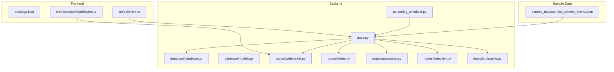
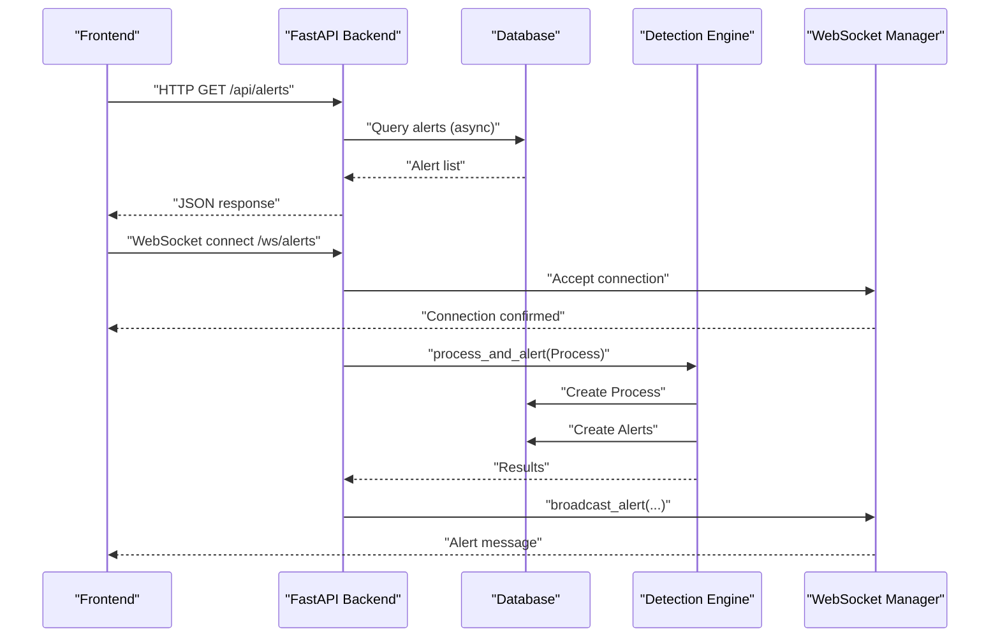
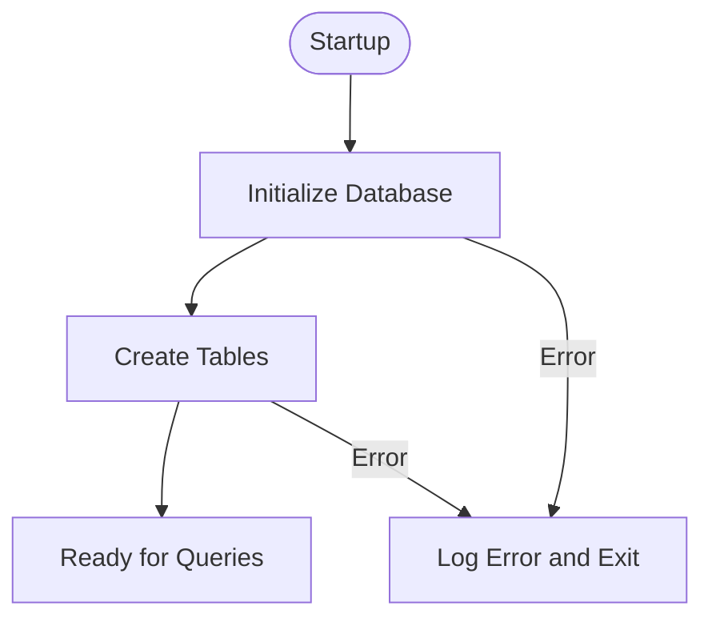
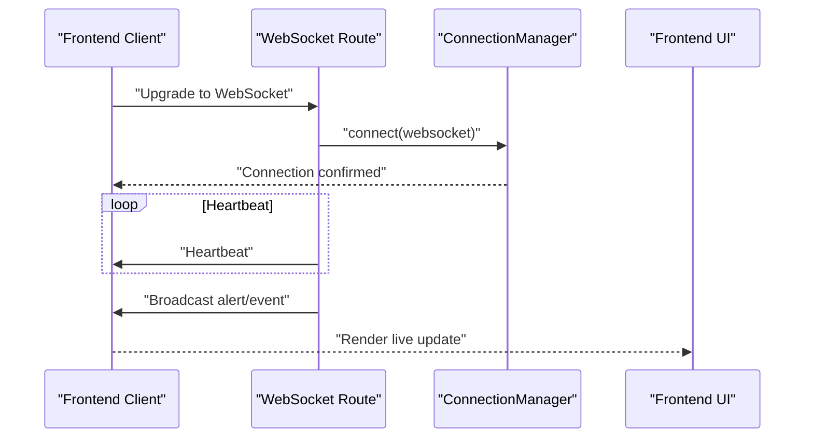
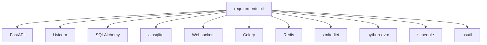

# Troubleshooting and FAQ

<cite>
**Referenced Files in This Document**
- [README.md](file://README.md)
- [backend/main.py](file://backend/main.py)
- [backend/requirements.txt](file://backend/requirements.txt)
- [backend/database/database.py](file://backend/database/database.py)
- [backend/database/models.py](file://backend/database/models.py)
- [backend/routes/websocket.py](file://backend/routes/websocket.py)
- [backend/routes/alerts.py](file://backend/routes/alerts.py)
- [backend/routes/processes.py](file://backend/routes/processes.py)
- [backend/routes/detection.py](file://backend/routes/detection.py)
- [backend/detection/engine.py](file://backend/detection/engine.py)
- [backend/parser/log_simulator.py](file://backend/parser/log_simulator.py)
- [frontend/package.json](file://frontend/package.json)
- [frontend/src/api/client.ts](file://frontend/src/api/client.ts)
- [frontend/src/hooks/useWebSocket.ts](file://frontend/src/hooks/useWebSocket.ts)
</cite>

## Table of Contents
1. [Introduction](#introduction)
2. [Project Structure](#project-structure)
3. [Core Components](#core-components)
4. [Architecture Overview](#architecture-overview)
5. [Detailed Component Analysis](#detailed-component-analysis)
6. [Dependency Analysis](#dependency-analysis)
7. [Performance Considerations](#performance-considerations)
8. [Troubleshooting Guide](#troubleshooting-guide)
9. [Conclusion](#conclusion)
10. [Appendices](#appendices)

## Introduction
This document provides comprehensive troubleshooting and FAQ guidance for EDR Lite. It focuses on diagnosing and resolving common installation issues, environment setup errors, platform-specific pitfalls, database connectivity failures, WebSocket connection problems, API endpoint access issues, detection engine diagnostics, alert generation failures, frontend integration problems, performance tuning, configuration errors (including CORS), deployment challenges, monitoring/logging strategies, security considerations, data integrity, backup/recovery procedures, and community support channels.

## Project Structure
EDR Lite consists of:
- Backend: FastAPI application with REST and WebSocket endpoints, database layer, detection engine, parsers, and routes.
- Frontend: React-based dashboard with TypeScript, Axios for API calls, and a WebSocket hook for live updates.
- Sample data: JSON-formatted Sysmon events for ingestion testing.

**Diagram sources**
- [backend/main.py:170-240](file://backend/main.py#L170-L240)
- [backend/database/database.py:21-90](file://backend/database/database.py#L21-L90)
- [backend/database/models.py:9-77](file://backend/database/models.py#L9-L77)
- [backend/routes/websocket.py:1-60](file://backend/routes/websocket.py#L1-L60)
- [backend/routes/alerts.py:1-60](file://backend/routes/alerts.py#L1-L60)
- [backend/routes/processes.py:1-60](file://backend/routes/processes.py#L1-L60)
- [backend/routes/detection.py:1-60](file://backend/routes/detection.py#L1-L60)
- [backend/detection/engine.py:64-120](file://backend/detection/engine.py#L64-L120)
- [backend/parser/log_simulator.py:18-60](file://backend/parser/log_simulator.py#L18-L60)
- [frontend/package.json:1-46](file://frontend/package.json#L1-L46)
- [frontend/src/api/client.ts:1-40](file://frontend/src/api/client.ts#L1-L40)
- [frontend/src/hooks/useWebSocket.ts:13-40](file://frontend/src/hooks/useWebSocket.ts#L13-L40)

**Section sources**
- [README.md:31-51](file://README.md#L31-L51)
- [backend/main.py:170-240](file://backend/main.py#L170-L240)

## Core Components
- Application lifecycle and configuration: startup/shutdown, logging, CORS, static serving, and health checks.
- Database: SQLAlchemy ORM with async sessions, table creation, CRUD operations, and statistics.
- Detection engine: rule evaluation, frequency tracking, alert creation, and statistics.
- Routing: REST endpoints for alerts, processes, detection rules, and WebSocket streams.
- Parser and simulator: event ingestion and synthetic event generation for testing.
- Frontend: Axios-based API client and a reusable WebSocket hook with reconnection logic.

Key areas for troubleshooting:
- Environment variables and CORS misconfiguration.
- Database initialization and connection pooling.
- WebSocket connection lifecycle and broadcasting.
- API request/response validation and pagination limits.
- Simulation mode and background tasks.

**Section sources**
- [backend/main.py:51-118](file://backend/main.py#L51-L118)
- [backend/database/database.py:21-90](file://backend/database/database.py#L21-L90)
- [backend/detection/engine.py:64-120](file://backend/detection/engine.py#L64-L120)
- [backend/routes/websocket.py:21-66](file://backend/routes/websocket.py#L21-L66)
- [backend/routes/alerts.py:18-54](file://backend/routes/alerts.py#L18-L54)
- [backend/routes/processes.py:19-42](file://backend/routes/processes.py#L19-L42)
- [backend/routes/detection.py:44-71](file://backend/routes/detection.py#L44-L71)
- [backend/parser/log_simulator.py:18-60](file://backend/parser/log_simulator.py#L18-L60)
- [frontend/src/api/client.ts:1-40](file://frontend/src/api/client.ts#L1-L40)
- [frontend/src/hooks/useWebSocket.ts:13-40](file://frontend/src/hooks/useWebSocket.ts#L13-L40)

## Architecture Overview
End-to-end flow from ingestion to real-time dashboards:

**Diagram sources**
- [backend/main.py:243-311](file://backend/main.py#L243-L311)
- [backend/database/database.py:105-120](file://backend/database/database.py#L105-L120)
- [backend/detection/engine.py:272-290](file://backend/detection/engine.py#L272-L290)
- [backend/routes/websocket.py:68-118](file://backend/routes/websocket.py#L68-L118)

## Detailed Component Analysis

### Database Connectivity and Initialization
Common issues:
- Incorrect DATABASE_URL format or missing SQLite file permissions.
- Asynchronous engine mismatch or pool configuration problems.
- Missing table creation during cold start.

Diagnostic steps:
- Verify DATABASE_URL environment variable and path accessibility.
- Confirm async engine URL conversion and pool settings.
- Check logs for successful table creation and session acquisition.

**Diagram sources**
- [backend/database/database.py:42-74](file://backend/database/database.py#L42-L74)

**Section sources**
- [backend/database/database.py:42-74](file://backend/database/database.py#L42-L74)
- [backend/main.py:130-139](file://backend/main.py#L130-L139)

### WebSocket Streaming and Broadcasting
Common issues:
- CORS misconfiguration blocking WebSocket upgrades.
- Client-side reconnection attempts failing silently.
- Broadcast failures due to stale connections.

Diagnostic steps:
- Ensure CORS_ORIGINS includes frontend origin(s).
- Inspect WebSocket logs for accept/connect/disconnect events.
- Validate heartbeat messages and error handling paths.

**Diagram sources**
- [backend/routes/websocket.py:68-118](file://backend/routes/websocket.py#L68-L118)
- [frontend/src/hooks/useWebSocket.ts:27-72](file://frontend/src/hooks/useWebSocket.ts#L27-L72)

**Section sources**
- [backend/routes/websocket.py:21-66](file://backend/routes/websocket.py#L21-L66)
- [backend/main.py:179-186](file://backend/main.py#L179-L186)
- [frontend/src/hooks/useWebSocket.ts:13-40](file://frontend/src/hooks/useWebSocket.ts#L13-L40)

### API Endpoints and Pagination Limits
Common issues:
- Request parameter validation errors (limits, filters).
- Missing authentication/authorization in production.
- CORS errors when calling endpoints from the frontend.

Diagnostic steps:
- Review query parameter constraints (min/max/le/ge).
- Confirm CORS middleware allows frontend origin.
- Use OpenAPI docs for endpoint validation.

**Section sources**
- [backend/routes/alerts.py:18-54](file://backend/routes/alerts.py#L18-L54)
- [backend/routes/processes.py:19-42](file://backend/routes/processes.py#L19-L42)
- [backend/main.py:179-186](file://backend/main.py#L179-L186)

### Detection Engine and Alert Generation
Common issues:
- Rules not loaded or disabled.
- Frequency tracker anomalies causing false positives/negatives.
- Alert creation failures during concurrent processing.

Diagnostic steps:
- Verify rule loading and enablement.
- Inspect detection statistics and rule trigger counts.
- Check logs for rule evaluation exceptions.

**Section sources**
- [backend/detection/engine.py:64-120](file://backend/detection/engine.py#L64-L120)
- [backend/routes/detection.py:44-71](file://backend/routes/detection.py#L44-L71)

### Frontend Integration and API Client
Common issues:
- API base URL not configured in the environment.
- Axios interceptors or headers not aligned with backend expectations.
- WebSocket URL construction differences between HTTP and HTTPS.

Diagnostic steps:
- Confirm VITE_API_URL is set appropriately.
- Validate WebSocket URL scheme (ws/wss) based on protocol.
- Use network tab to inspect requests/responses.

**Section sources**
- [frontend/src/api/client.ts:4-11](file://frontend/src/api/client.ts#L4-L11)
- [frontend/src/hooks/useWebSocket.ts:27-31](file://frontend/src/hooks/useWebSocket.ts#L27-L31)

## Dependency Analysis
External dependencies and their roles:
- FastAPI and Uvicorn for the REST/WS server.
- SQLAlchemy and aiosqlite for async ORM and SQLite.
- Websockets for WebSocket transport.
- Celery and Redis for potential async task offloading (optional).
- xmltodict and python-evtx for parsing EVTX/XML logs.
- schedule and psutil for scheduling and system metrics.

Potential conflicts:
- Version mismatches between FastAPI, Uvicorn, and Python versions.
- SQLite concurrency limitations under heavy load.

**Diagram sources**
- [backend/requirements.txt:1-14](file://backend/requirements.txt#L1-L14)

**Section sources**
- [backend/requirements.txt:1-14](file://backend/requirements.txt#L1-L14)

## Performance Considerations
- Memory usage optimization:
  - Limit API response sizes (pagination and limit caps).
  - Avoid loading excessive historical data; use time-windowed queries.
  - Use async sessions to reduce blocking overhead.
- Database query tuning:
  - Indexes are applied on timestamp and name fields; leverage filtered queries.
  - Prefer time-based pagination and avoid full-table scans.
- WebSocket connection management:
  - Monitor active connections and clean up stale sockets.
  - Implement heartbeat and automatic reconnection with backoff.

[No sources needed since this section provides general guidance]

## Troubleshooting Guide

### Installation and Environment Setup
Symptoms:
- ImportError or ModuleNotFoundError on startup.
- Virtual environment activation issues on Windows vs Unix-like systems.
- Port binding failures or permission denied errors.

Resolutions:
- Ensure Python 3.9+ and Node.js 18+ are installed.
- Create and activate a virtual environment before installing Python dependencies.
- Install frontend dependencies and run the dev server on the expected port.
- Set environment variables (DATABASE_URL, HOST, PORT, CORS_ORIGINS) as documented.

**Section sources**
- [README.md:55-110](file://README.md#L55-L110)
- [backend/main.py:51-58](file://backend/main.py#L51-L58)

### Dependency Conflicts and Platform-Specific Issues
Symptoms:
- Incompatible versions of FastAPI/Uvicorn/sqlalchemy.
- Missing native libraries for EVTX parsing on Linux/macOS.
- Permission errors writing logs or SQLite files.

Resolutions:
- Pin compatible versions per requirements.txt.
- Use supported platforms for EVTX parsing; otherwise, rely on JSON/XML ingestion.
- Ensure write permissions for logs directory and database file location.

**Section sources**
- [backend/requirements.txt:1-14](file://backend/requirements.txt#L1-L14)
- [backend/main.py:22-34](file://backend/main.py#L22-L34)

### Database Connection Failures
Symptoms:
- OperationalError on first query.
- Database locked or concurrent access issues.
- Missing tables after startup.

Resolutions:
- Verify DATABASE_URL correctness and path accessibility.
- Use async engine for FastAPI; confirm URL conversion.
- Ensure tables are created during initialization.
- For SQLite, avoid concurrent writes; consider PostgreSQL for production.

**Section sources**
- [backend/database/database.py:42-74](file://backend/database/database.py#L42-L74)
- [backend/database/database.py:71-74](file://backend/database/database.py#L71-L74)

### WebSocket Connection Problems
Symptoms:
- Upgrade fails with CORS errors.
- Frequent disconnections or no heartbeats.
- Messages not reaching clients.

Resolutions:
- Add frontend origin(s) to CORS_ORIGINS.
- Confirm WebSocket route paths (/ws/alerts, /ws/events).
- Implement exponential backoff in the frontend hook.
- Check backend logs for broadcast/send exceptions.

**Section sources**
- [backend/main.py:179-186](file://backend/main.py#L179-L186)
- [backend/routes/websocket.py:68-118](file://backend/routes/websocket.py#L68-L118)
- [frontend/src/hooks/useWebSocket.ts:27-72](file://frontend/src/hooks/useWebSocket.ts#L27-L72)

### API Endpoint Access Issues
Symptoms:
- 422 validation errors on query parameters.
- 404 for non-existent resources.
- CORS preflight failures.

Resolutions:
- Respect limit/min/max constraints and filter parameters.
- Use correct resource IDs and endpoints.
- Ensure frontend origin is whitelisted in CORS_ORIGINS.

**Section sources**
- [backend/routes/alerts.py:18-54](file://backend/routes/alerts.py#L18-L54)
- [backend/routes/processes.py:115-125](file://backend/routes/processes.py#L115-L125)
- [backend/main.py:179-186](file://backend/main.py#L179-L186)

### Detection Engine Problems
Symptoms:
- No alerts generated despite suspicious events.
- Rules not triggering or disabled.
- High latency in detection.

Resolutions:
- Confirm rules are loaded and enabled.
- Use the test endpoint to validate rule logic.
- Review detection statistics and rule trigger counts.
- Adjust frequency thresholds and windows as needed.

**Section sources**
- [backend/detection/engine.py:64-120](file://backend/detection/engine.py#L64-L120)
- [backend/routes/detection.py:168-211](file://backend/routes/detection.py#L168-L211)

### Alert Generation Failures
Symptoms:
- Alerts not persisted to the database.
- Missing alert counts in stats.

Resolutions:
- Verify process creation precedes alert creation.
- Check database commit paths and error logs.
- Confirm broadcast functions are invoked after alert creation.

**Section sources**
- [backend/detection/engine.py:272-290](file://backend/detection/engine.py#L272-L290)
- [backend/database/database.py:185-215](file://backend/database/database.py#L185-L215)

### Frontend Integration Issues
Symptoms:
- Blank dashboard or no live updates.
- API calls fail with 404/422.
- WebSocket not connecting.

Resolutions:
- Set VITE_API_URL to backend base URL.
- Ensure WebSocket URL scheme matches protocol (ws/wss).
- Use the provided API client and WebSocket hook consistently.

**Section sources**
- [frontend/src/api/client.ts:4-11](file://frontend/src/api/client.ts#L4-L11)
- [frontend/src/hooks/useWebSocket.ts:27-31](file://frontend/src/hooks/useWebSocket.ts#L27-L31)

### Configuration Errors (CORS and Others)
Symptoms:
- Cross-origin requests blocked.
- Unexpected behavior with simulation mode.

Resolutions:
- Set CORS_ORIGINS to include frontend origins.
- Toggle simulation mode via the provided endpoint.
- Validate environment variables at runtime.

**Section sources**
- [backend/main.py:51-58](file://backend/main.py#L51-L58)
- [backend/main.py:179-186](file://backend/main.py#L179-L186)
- [backend/main.py:339-358](file://backend/main.py#L339-L358)

### Deployment Challenges
Symptoms:
- Development server works but production server fails.
- Static assets not served.

Resolutions:
- Use a production ASGI server (e.g., Gunicorn with Uvicorn workers).
- Build the frontend and serve static files from the backend.
- Set DEBUG=false and configure environment variables accordingly.

**Section sources**
- [README.md:204-222](file://README.md#L204-L222)
- [backend/main.py:361-364](file://backend/main.py#L361-L364)

### Monitoring and Logging Strategies
- Backend logs: INFO level with stdout and file handler; inspect logs directory.
- Health endpoint: verify database and detection engine status.
- Stats endpoints: monitor engine and rule statistics.
- WebSocket manager: track connection counts and broadcast errors.

**Section sources**
- [backend/main.py:22-34](file://backend/main.py#L22-L34)
- [backend/main.py:214-223](file://backend/main.py#L214-L223)
- [backend/routes/websocket.py:21-66](file://backend/routes/websocket.py#L21-L66)

### Security Considerations, Data Integrity, Backup, and Recovery
- Security: This is a demo system; add authentication/authorization and HTTPS for production.
- Data integrity: Use transactions and commits; monitor for partial writes.
- Backup/recovery: For SQLite, back up the database file; for production, consider PostgreSQL logical backups.

**Section sources**
- [README.md:283-289](file://README.md#L283-L289)

### Contact and Community Support
- Contributions and acknowledgments are documented; use repository channels for issues and discussions.

**Section sources**
- [README.md:295-307](file://README.md#L295-L307)

## Conclusion
This guide consolidates practical troubleshooting steps for EDR Lite across installation, environment setup, database connectivity, WebSocket streaming, API access, detection engine behavior, frontend integration, performance tuning, configuration, deployment, monitoring, and security. Apply the diagnostic procedures and resolutions outlined above to quickly identify and fix most operational issues.

## Appendices

### Frequently Asked Questions (FAQ)
- How do I enable simulation mode?
  - Use the simulation toggle endpoint to enable/disable background event generation.
- Why are my alerts not appearing in the dashboard?
  - Check WebSocket connectivity, CORS configuration, and that alerts are being created and broadcast.
- How do I increase the number of alerts returned by the API?
  - Adjust the limit parameter within accepted bounds.
- Can I use PostgreSQL instead of SQLite?
  - Yes; update DATABASE_URL and deploy a production database; adjust pool settings accordingly.
- How do I test a rule without generating alerts?
  - Use the detection test endpoint to evaluate a process against rules.

**Section sources**
- [backend/main.py:339-358](file://backend/main.py#L339-L358)
- [backend/routes/websocket.py:68-118](file://backend/routes/websocket.py#L68-L118)
- [backend/routes/alerts.py:18-54](file://backend/routes/alerts.py#L18-L54)
- [backend/routes/detection.py:168-211](file://backend/routes/detection.py#L168-L211)
- [README.md:204-209](file://README.md#L204-L209)